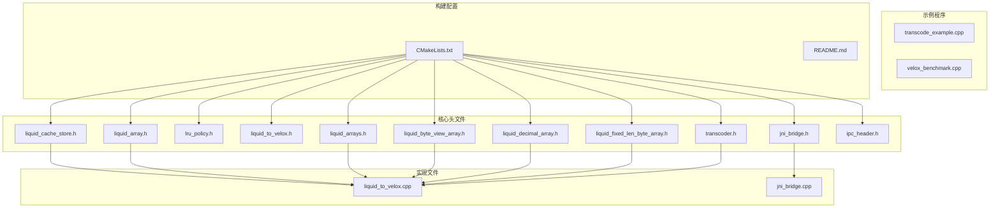
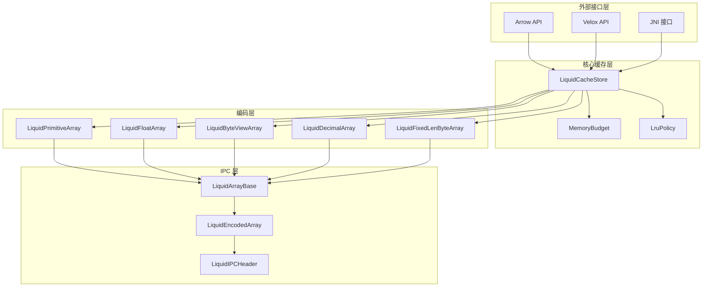
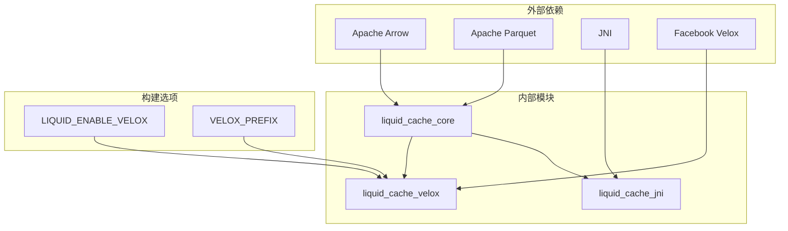

# API 参考手册

<cite>
**本文档引用的文件**
- [README.md](file://README.md)
- [CMakeLists.txt](file://CMakeLists.txt)
- [liquid_cache_store.h](file://include/liquid_cache/liquid_cache_store.h)
- [transcoder.h](file://include/liquid_cache/transcoder.h)
- [lru_policy.h](file://include/liquid_cache/lru_policy.h)
- [liquid_to_velox.h](file://include/liquid_cache/liquid_to_velox.h)
- [jni_bridge.h](file://include/liquid_cache/jni_bridge.h)
- [liquid_array.h](file://include/liquid_cache/liquid_array.h)
- [liquid_arrays.h](file://include/liquid_cache/liquid_arrays.h)
- [liquid_byte_view_array.h](file://include/liquid_cache/liquid_byte_view_array.h)
- [liquid_decimal_array.h](file://include/liquid_cache/liquid_decimal_array.h)
- [liquid_fixed_len_byte_array.h](file://include/liquid_cache/liquid_fixed_len_byte_array.h)
- [ipc_header.h](file://include/liquid_cache/ipc_header.h)
- [liquid_to_velox.cpp](file://src/liquid_to_velox.cpp)
- [jni_bridge.cpp](file://src/jni_bridge.cpp)
- [transcode_example.cpp](file://examples/transcode_example.cpp)
- [velox_benchmark.cpp](file://examples/velox_benchmark.cpp)
</cite>

## 目录
1. [简介](#简介)
2. [项目结构](#项目结构)
3. [核心组件](#核心组件)
4. [架构概览](#架构概览)
5. [详细组件分析](#详细组件分析)
6. [依赖关系分析](#依赖关系分析)
7. [性能考虑](#性能考虑)
8. [故障排除指南](#故障排除指南)
9. [结论](#结论)
10. [附录](#附录)

## 简介

Liquid Cache C++ 是一个高性能的内存缓存系统，专门用于存储和访问列式数据。该库提供了零反序列化读取能力，支持多种数据类型的压缩编码，并集成了 Apache Arrow 和可选的 Facebook Velox 向量引擎。

本参考手册详细记录了所有公共接口，包括类定义、方法签名、参数说明、返回值描述、使用示例和最佳实践。文档按照功能模块组织，便于开发者快速找到所需的接口信息。

## 项目结构



**图表来源**
- [CMakeLists.txt](file://CMakeLists.txt)
- [liquid_cache_store.h](file://include/liquid_cache/liquid_cache_store.h)
- [transcoder.h](file://include/liquid_cache/transcoder.h)

**章节来源**
- [CMakeLists.txt](file://CMakeLists.txt)
- [README.md](file://README.md)

## 核心组件

### LiquidCacheStore - 主缓存存储器

LiquidCacheStore 是整个系统的核心组件，提供内存中的列式数据缓存功能。它支持零反序列化读取、列投影、行过滤和 LRU 淘汰策略。

**主要特性：**
- 内存中存储 Liquid 结构对象（非序列化字节）
- 列式存储：每列的每个批次独立缓存
- 列投影：仅解码请求的列
- 行过滤：在解码时应用布尔数组掩码
- 零反序列化读取：直接访问 Liquid 结构对象

**关键方法：**
- `insert()` - 插入 Liquid 编码数组到缓存
- `insert_arrow()` - 插入原始 Arrow 数组到缓存  
- `get()` - 获取单个缓存数组
- `read_batch()` - 批量读取 RecordBatch
- `load_from_parquet()` - 从 Parquet 文件批量加载

**章节来源**
- [liquid_cache_store.h](file://include/liquid_cache/liquid_cache_store.h)

### Transcoder - 数据转码器

Transcoder 模块负责将 Arrow 数组转换为 Liquid Cache 格式，以及将 Liquid 编码的数据解码回 Arrow 格式。

**支持的数据类型：**
- 整数类型：FoR + BitPacking 编码
- 浮点类型：ALP（自适应无损浮点）编码
- 字符串/二进制：字典 + FSST 压缩
- 十进制类型：Frame-of-Reference + BitPacking

**章节来源**
- [transcoder.h](file://include/liquid_cache/transcoder.h)

### LRU Policy - LRU 淘汰策略

实现经典的 LRU（最近最少使用）淘汰策略，维护缓存条目的访问顺序。

**核心功能：**
- `notify_insert()` - 通知插入或重新插入
- `notify_access()` - 通知访问操作
- `find_victims()` - 查找淘汰候选
- `remove()` - 移除特定键

**章节来源**
- [lru_policy.h](file://include/liquid_cache/lru_policy.h)

## 架构概览



**图表来源**
- [liquid_cache_store.h](file://include/liquid_cache/liquid_cache_store.h)
- [liquid_array.h](file://include/liquid_cache/liquid_array.h)
- [ipc_header.h](file://include/liquid_cache/ipc_header.h)

## 详细组件分析

### LiquidCacheStore 类详解

#### 类定义和构造函数

```cpp
class LiquidCacheStore {
public:
    LiquidCacheStore();
    explicit LiquidCacheStore(size_t max_cache_bytes);
```

**构造函数参数：**
- `max_cache_bytes` - 最大缓存内存限制（字节），0 表示无限制

#### 缓存管理方法

**设置缓存预算：**
```cpp
void set_max_cache_bytes(size_t max_bytes);
size_t max_cache_bytes() const;
size_t memory_budget_usage() const;
```

**统计信息：**
```cpp
struct Stats {
    size_t entry_count;
    size_t total_memory_bytes;
    size_t liquid_entries;
    size_t arrow_entries;
    size_t budget_usage_bytes;
    size_t budget_max_bytes;
};

Stats stats() const;
size_t entry_count() const;
size_t total_memory_size() const;
void clear();
size_t lru_size() const;
```

#### 插入操作

**插入 Liquid 编码数组：**
```cpp
bool insert(const LiquidCacheKey& key, LiquidArrayRef array);
```

**插入 Arrow 数组：**
```cpp
bool insert_arrow(const LiquidCacheKey& key, std::shared_ptr<arrow::Array> array);
```

**参数说明：**
- `key` - 缓存键，包含文件标识、行组标识、列标识和批次标识
- `array` - 要插入的数组引用

#### 读取操作

**单个元素读取：**
```cpp
bool contains(const LiquidCacheKey& key) const;
std::shared_ptr<arrow::Array> get(
    const LiquidCacheKey& key,
    const std::shared_ptr<arrow::BooleanArray>& selection = nullptr);
```

**批量读取（推荐）：**
```cpp
std::shared_ptr<arrow::RecordBatch> read_batch(
    uint16_t file_id,
    uint16_t rg_id,
    uint16_t batch_id,
    const std::shared_ptr<arrow::Schema>& schema,
    const std::vector<int>& projection = {},
    const std::shared_ptr<arrow::BooleanArray>& selection = nullptr) const;
```

**参数说明：**
- `projection` - 列索引向量，空表示选择所有列
- `selection` - 行过滤布尔数组

#### Parquet 加载

**批量加载：**
```cpp
std::vector<RowGroupInfo> load_from_parquet(
    const std::vector<std::string>& files,
    std::shared_ptr<arrow::Schema>& schema,
    double& transcode_sec,
    const std::function<LiquidArrayRef(
        const std::shared_ptr<arrow::Array>&)>& transcode_fn);

struct RowGroupInfo {
    uint16_t file_id;
    uint16_t rg_id;
    uint16_t num_batches;
    size_t total_rows;
};
```

**章节来源**
- [liquid_cache_store.h](file://include/liquid_cache/liquid_cache_store.h)

### Transcoder API 详解

#### LiquidArrayBase 抽象基类

```cpp
class LiquidArrayBase {
public:
    virtual ~LiquidArrayBase() = default;
    
    virtual std::shared_ptr<arrow::Array> to_arrow() const = 0;
    virtual std::shared_ptr<arrow::Array> filter(
        const std::shared_ptr<arrow::BooleanArray>& selection) const;
        
    virtual size_t memory_size() const = 0;
    virtual uint32_t length() const = 0;
    virtual LiquidDataType data_type() const = 0;
    virtual PhysicalType physical_type() const = 0;
    virtual std::shared_ptr<arrow::DataType> original_arrow_type() const = 0;
    
#ifdef LIQUID_ENABLE_VELOX
    virtual facebook::velox::VectorPtr to_velox(
        facebook::velox::memory::MemoryPool* pool) const = 0;
#endif
};
```

#### 具体数组类型

**整数数组（FoR + BitPacking）：**
```cpp
template <typename ArrowType>
class LiquidPrimitiveArray {
    static LiquidPrimitiveArray from_arrow(
        const std::shared_ptr<arrow::Array>& array);
    std::shared_ptr<arrow::Array> to_arrow() const;
    std::vector<uint8_t> to_bytes() const;
    static LiquidPrimitiveArray from_bytes(const uint8_t* data, size_t len);
    
    uint32_t length() const;
    size_t memory_size() const;
    uint8_t bit_width() const;
};
```

**浮点数组（ALP + BitPacking）：**
```cpp
template <typename FloatT>
class LiquidFloatArray {
    static LiquidFloatArray from_arrow(
        const std::shared_ptr<arrow::Array>& array);
    std::shared_ptr<arrow::Array> to_arrow() const;
    std::vector<uint8_t> to_bytes() const;
    static LiquidFloatArray from_bytes(const uint8_t* data, size_t len);
    
    uint32_t length() const;
    size_t memory_size() const;
    uint8_t bit_width() const;
};
```

**字符串数组（字典 + FSST）：**
```cpp
class LiquidByteViewArray {
    static LiquidByteViewArray from_arrow(
        const std::shared_ptr<arrow::Array>& array);
    std::shared_ptr<arrow::Array> to_arrow() const;
    std::vector<uint8_t> to_bytes() const;
    static LiquidByteViewArray from_bytes(const uint8_t* data, size_t len);
    
    uint32_t length() const;
    size_t memory_size() const;
};
```

**十进制数组：**
```cpp
class LiquidDecimalArray {
    static LiquidDecimalArray from_arrow(
        const std::shared_ptr<arrow::Array>& array);
    std::shared_ptr<arrow::Array> to_arrow() const;
    std::vector<uint8_t> to_bytes() const;
    static LiquidDecimalArray from_bytes(const uint8_t* data, size_t len);
    
    uint32_t length() const;
    size_t memory_size() const;
};
```

**固定长度字节数组：**
```cpp
class LiquidFixedLenByteArray {
    static LiquidFixedLenByteArray from_decimal128(
        const std::shared_ptr<arrow::Array>& array);
    static LiquidFixedLenByteArray from_decimal256(
        const std::shared_ptr<arrow::Array>& array);
    std::shared_ptr<arrow::Array> to_arrow() const;
    std::vector<uint8_t> to_bytes() const;
    static LiquidFixedLenByteArray from_bytes(const uint8_t* data, size_t len);
    
    uint32_t length() const;
    size_t memory_size() const;
};
```

**章节来源**
- [liquid_array.h](file://include/liquid_cache/liquid_array.h)
- [liquid_arrays.h](file://include/liquid_cache/liquid_arrays.h)
- [liquid_byte_view_array.h](file://include/liquid_cache/liquid_byte_view_array.h)
- [liquid_decimal_array.h](file://include/liquid_cache/liquid_decimal_array.h)
- [liquid_fixed_len_byte_array.h](file://include/liquid_cache/liquid_fixed_len_byte_array.h)

### IPC 头部和数据格式

#### LiquidIPCHeader

```cpp
struct LiquidIPCHeader {
    uint8_t magic[4];           // 魔术数字 "LQDA"
    uint16_t version;           // 版本号
    uint16_t logical_type_id;   // 逻辑类型标识
    uint16_t physical_type_id;  // 物理类型标识
    uint8_t padding[6];         // 填充字节
    
    static constexpr size_t SIZE = 16;
    
    void serialize(std::vector<uint8_t>& out) const;
    static LiquidIPCHeader deserialize(const uint8_t* data, size_t len);
};
```

#### 数据类型枚举

**逻辑类型：**
```cpp
enum class LiquidDataType : uint16_t {
    Integer = 1,
    Float = 2,
    FixedLenByteArray = 3,
    ByteViewArray = 4,
    LinearInteger = 5,
    Decimal = 6,
};
```

**物理类型：**
```cpp
enum class PhysicalType : uint16_t {
    Int8 = 0, Int16 = 1, Int32 = 2, Int64 = 3,
    UInt8 = 4, UInt16 = 5, UInt32 = 6, UInt64 = 7,
    Float32 = 8, Float64 = 9,
    Date32 = 10, Date64 = 11,
    TimestampSecond = 12,
    TimestampMillisecond = 13,
    TimestampMicrosecond = 14,
    TimestampNanosecond = 15,
};
```

**章节来源**
- [ipc_header.h](file://include/liquid_cache/ipc_header.h)

### JNI 接口

#### 会话管理

```cpp
JNIEXPORT jlong JNICALL
Java_org_apache_spark_sql_execution_liquidcache_LiquidCacheNative_createSession(
    JNIEnv* env, jclass cls, jstring serverAddress);

JNIEXPORT void JNICALL
Java_org_apache_spark_sql_execution_liquidcache_LiquidCacheNative_closeSession(
    JNIEnv* env, jclass cls, jlong sessionHandle);
```

#### 扫描执行

```cpp
JNIEXPORT jlong JNICALL
Java_org_apache_spark_sql_execution_liquidcache_LiquidCacheNative_executeScan(
    JNIEnv* env, jclass cls, jlong session, jstring tableName,
    jobjectArray columns, jint batchSize);

JNIEXPORT jbyteArray JNICALL
Java_org_apache_spark_sql_execution_liquidcache_LiquidCacheNative_fetchNextBatch(
    JNIEnv* env, jclass cls, jlong resultHandle);

JNIEXPORT void JNICALL
Java_org_apache_spark_sql_execution_liquidcache_LiquidCacheNative_closeResult(
    JNIEnv* env, jclass cls, jlong resultHandle);
```

**章节来源**
- [jni_bridge.h](file://include/liquid_cache/jni_bridge.h)

### Velox 集成

#### 类型映射

```cpp
inline vx::TypePtr liquid_physical_to_velox_type(PhysicalType pt) {
    switch (pt) {
        case PhysicalType::Int8:
        case PhysicalType::UInt8:
            return vx::TINYINT();
        case PhysicalType::Int16:
        case PhysicalType::UInt16:
            return vx::SMALLINT();
        case PhysicalType::Int32:
        case PhysicalType::UInt32:
            return vx::INTEGER();
        case PhysicalType::Int64:
        case PhysicalType::UInt64:
            return vx::BIGINT();
        case PhysicalType::Float32:
            return vx::REAL();
        case PhysicalType::Float64:
            return vx::DOUBLE();
        case PhysicalType::Date32:
        case PhysicalType::Date64:
            return vx::INTEGER();
        case PhysicalType::TimestampSecond:
        case PhysicalType::TimestampMillisecond:
        case PhysicalType::TimestampMicrosecond:
        case PhysicalType::TimestampNanosecond:
            return vx::TIMESTAMP();
        default:
            throw std::runtime_error("Unsupported Liquid PhysicalType for Velox conversion");
    }
}
```

#### 批量读取

```cpp
facebook::velox::VectorPtr read_batch_velox(
    uint16_t file_id,
    uint16_t rg_id,
    uint16_t batch_id,
    const facebook::velox::RowTypePtr& rowType,
    facebook::velox::memory::MemoryPool* pool,
    const std::vector<int>& projection = {}) const;
```

**章节来源**
- [liquid_to_velox.h](file://include/liquid_cache/liquid_to_velox.h)

## 依赖关系分析



**图表来源**
- [CMakeLists.txt](file://CMakeLists.txt)

### 关键依赖关系

**编译时条件：**
- `LIQUID_ENABLE_VELOX` - 启用 Velox 集成功能
- `VELOX_PREFIX` - 指定 Velox 构建目录

**运行时依赖：**
- Arrow 24.x 或 Velox 捆绑的 Arrow 18.x
- Parquet 库
- JNI 支持

**章节来源**
- [CMakeLists.txt](file://CMakeLists.txt)

## 性能考虑

### 编码性能优化

1. **FoR + BitPacking 编码**：适用于具有最小值偏移的数据集
2. **ALP 浮点编码**：自适应无损浮点压缩，支持最优指数搜索
3. **FSST 字符串压缩**：结合字典压缩和 FSST 压缩算法
4. **线性模型编码**：适用于单调或近似线性的整数序列

### 内存管理

**LRU 淘汰策略：**
- 维护访问顺序的双向链表
- 使用哈希表进行快速查找
- 支持批量淘汰候选查找

**内存预算控制：**
- 原子操作的内存使用跟踪
- 无锁预算预留机制
- 动态预算调整

### 并发性能

**线程安全设计：**
- 每个操作使用互斥锁保护
- LRU 策略使用独立的互斥锁
- 内存预算使用原子操作

**性能基准测试：**
- 提供完整的基准测试套件
- 支持与原生 Parquet 读取的对比
- 包含不同数据类型的性能测试

## 故障排除指南

### 常见错误和解决方案

**内存不足错误：**
```cpp
// 错误：插入失败，条目过大
if (!store.insert(key, array)) {
    // 检查缓存预算
    auto stats = store.stats();
    if (stats.budget_usage_bytes >= stats.budget_max_bytes) {
        // 清理缓存或增加预算
        store.set_max_cache_bytes(stats.budget_max_bytes * 2);
    }
}
```

**类型不匹配错误：**
```cpp
// 错误：类型转换失败
try {
    auto decoded = liquid_array->to_arrow();
} catch (const std::runtime_error& e) {
    // 检查原始 Arrow 类型
    auto original_type = liquid_array->original_arrow_type();
    // 验证类型兼容性
}
```

**JNI 连接错误：**
```cpp
// 错误：JNI 方法调用失败
JNIEXPORT jlong JNICALL
Java_org_apache_spark_sql_execution_liquidcache_LiquidCacheNative_executeScan(
    JNIEnv* env, jclass cls, jlong session, jstring tableName, ...) {
    try {
        // 检查参数有效性
        if (!env || !tableName) {
            throw std::invalid_argument("Invalid JNI parameters");
        }
        // 验证字符串编码
        std::string table = jstring_to_string(env, tableName);
        if (table.empty()) {
            throw std::invalid_argument("Empty table name");
        }
    } catch (const std::exception& e) {
        throw_runtime_exception(env, e.what());
        return -1;
    }
}
```

### 调试技巧

**启用详细日志：**
```bash
export LIQUID_LOG_LEVEL=DEBUG
./liquid_cache_example data.parquet verify
```

**内存使用监控：**
```cpp
auto stats = store.stats();
std::cout << "缓存使用: " << stats.total_memory_bytes << " bytes\n";
std::cout << "条目数量: " << stats.entry_count << "\n";
std::cout << "LRU 大小: " << store.lru_size() << "\n";
```

**章节来源**
- [liquid_cache_store.h](file://include/liquid_cache/liquid_cache_store.h)
- [jni_bridge.cpp](file://src/jni_bridge.cpp)

## 结论

Liquid Cache C++ 提供了一个高性能、内存友好的数据缓存解决方案。通过零反序列化读取、智能压缩编码和灵活的查询接口，该库能够显著提升数据分析工作负载的性能。

**主要优势：**
- 零反序列化读取，避免运行时开销
- 多种压缩算法适配不同类型的数据
- 完善的内存管理和 LRU 淘汰策略
- 支持多种外部接口（Arrow、Velox、JNI）

**适用场景：**
- 大数据分析平台
- 实时查询系统
- 数据仓库缓存层
- 机器学习特征工程

## 附录

### 版本兼容性

**支持的 Arrow 版本：**
- 24.x（默认）
- 18.x（通过 Velox 集成）

**构建要求：**
- C++20 编译器
- CMake 3.16+
- 静态库链接（推荐）

### 迁移指南

**从 Rust 版本迁移：**
- API 名称映射：`LiquidCache` → `LiquidCacheStore`
- 编码格式完全兼容
- 内存管理语义相似

**从其他缓存系统迁移：**
- 替换缓存初始化代码
- 更新数据加载流程
- 调整查询接口以使用列投影

### 最佳实践

**性能优化建议：**
1. 合理设置缓存预算大小
2. 使用列投影减少内存占用
3. 利用行过滤在缓存层进行数据筛选
4. 定期监控缓存命中率
5. 对热点数据使用预加载

**内存管理建议：**
1. 监控 `memory_budget_usage()` 指标
2. 及时清理不再使用的缓存条目
3. 使用 `clear()` 方法重置缓存状态
4. 合理配置 LRU 策略参数

**章节来源**
- [CMakeLists.txt](file://CMakeLists.txt)
- [transcode_example.cpp](file://examples/transcode_example.cpp)
- [velox_benchmark.cpp](file://examples/velox_benchmark.cpp)