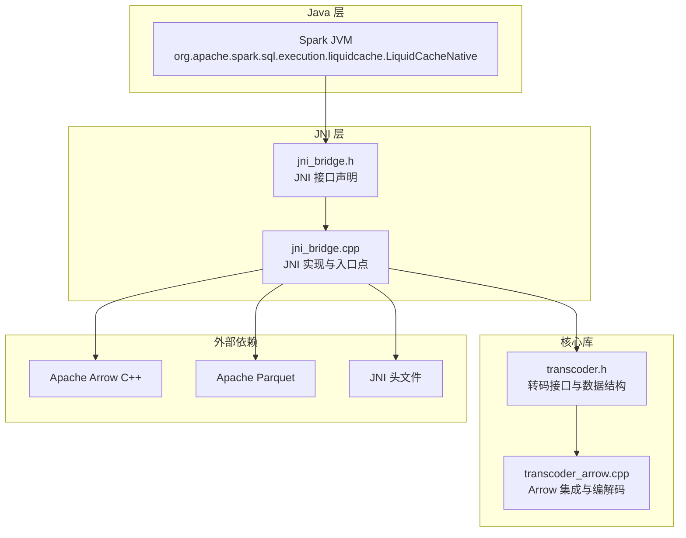
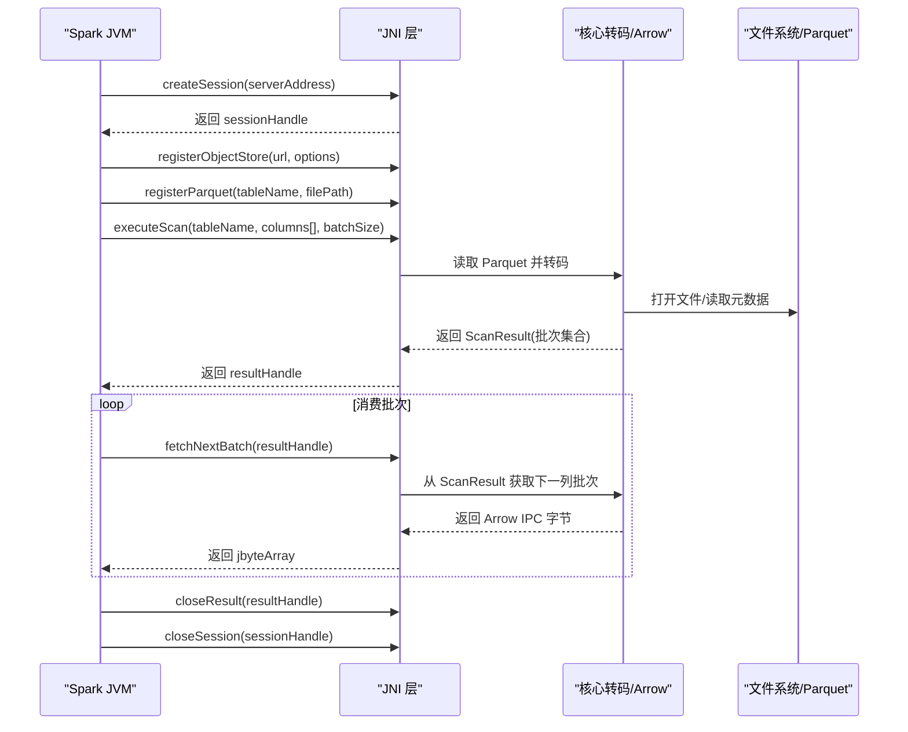
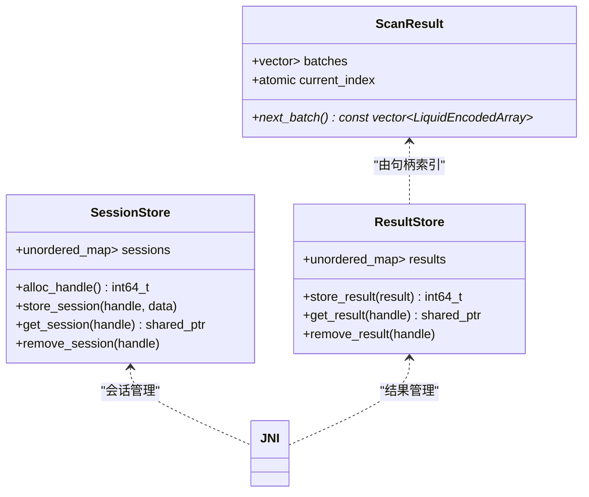
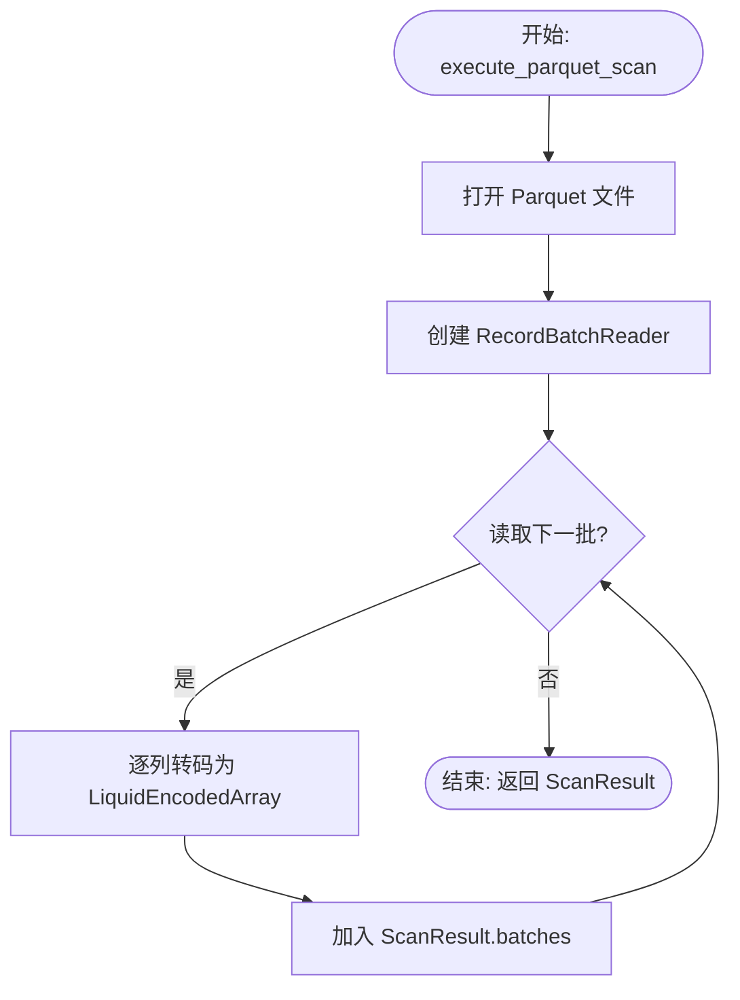
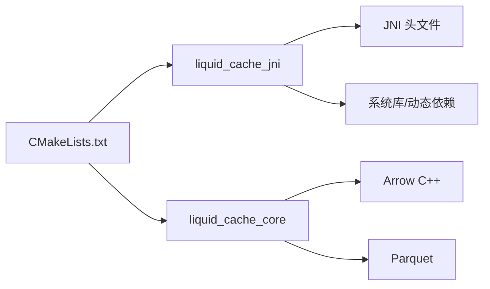

# JNI 桥接 API

<cite>
**本文引用的文件**
- [jni_bridge.h](file://include/liquid_cache/jni_bridge.h)
- [jni_bridge.cpp](file://src/jni_bridge.cpp)
- [transcoder.h](file://include/liquid_cache/transcoder.h)
- [transcoder_arrow.cpp](file://src/transcoder_arrow.cpp)
- [CMakeLists.txt](file://CMakeLists.txt)
- [README.md](file://README.md)
- [transcode_example.cpp](file://examples/transcode_example.cpp)
</cite>

## 目录
1. [简介](#简介)
2. [项目结构](#项目结构)
3. [核心组件](#核心组件)
4. [架构总览](#架构总览)
5. [详细组件分析](#详细组件分析)
6. [依赖关系分析](#依赖关系分析)
7. [性能考量](#性能考量)
8. [故障排查指南](#故障排查指南)
9. [结论](#结论)
10. [附录](#附录)

## 简介
本文件系统性地记录了 Liquid Cache C++ 实现的 JNI 桥接 API，覆盖 Java 与 C++ 之间的互操作接口、JNI 方法签名、数据类型映射、生命周期管理、Spark 集成要点、数据帧转换与内存管理、异常处理、性能优化技巧以及常见问题排查。目标是帮助开发者在 Java 应用中无缝调用 C++ 缓存功能，并在 Spark 生态中稳定高效地进行数据扫描与传输。

## 项目结构
该项目采用模块化设计，核心围绕 JNI 桥接层、Arrow/Parquet 集成、转码与序列化、以及可选的 Velox 集成展开。JNI 桥接层位于头文件与源文件中，负责与 Spark JVM 的交互；底层通过 Arrow C++ 读取 Parquet 并将列式数据转码为 Liquid Cache 格式；同时提供 IPC 序列化能力以兼容现有 Scala 侧的反序列化逻辑。

图表来源
- [jni_bridge.h:171-216](file://include/liquid_cache/jni_bridge.h#L171-L216)
- [jni_bridge.cpp:1-319](file://src/jni_bridge.cpp#L1-L319)
- [transcoder.h:1-360](file://include/liquid_cache/transcoder.h#L1-L360)
- [transcoder_arrow.cpp:1-746](file://src/transcoder_arrow.cpp#L1-L746)

章节来源
- [CMakeLists.txt:1-563](file://CMakeLists.txt#L1-L563)
- [README.md:1-378](file://README.md#L1-L378)

## 核心组件
- JNI 接口与入口点：定义并实现 Spark 调用的原生方法，包括会话创建、对象存储注册、Parquet 注册、扫描执行、批量获取、结果关闭与会话关闭。
- 会话与结果句柄管理：基于原子计数器分配句柄，使用线程安全的全局映射保存会话与扫描结果，支持并发访问与清理。
- JNI 辅助函数：字符串与数组转换、异常抛出、Arrow IPC 序列化辅助。
- Arrow/Parquet 扫描与转码：读取 Parquet 文件，按批读取 RecordBatch，逐列转码为 Liquid Cache 格式，支持多种 Arrow 类型。
- IPC 序列化：将转码后的列数据序列化为二进制格式，供 Java 侧消费。

章节来源
- [jni_bridge.h:25-161](file://include/liquid_cache/jni_bridge.h#L25-L161)
- [jni_bridge.cpp:176-319](file://src/jni_bridge.cpp#L176-L319)
- [transcoder.h:17-360](file://include/liquid_cache/transcoder.h#L17-L360)
- [transcoder_arrow.cpp:34-377](file://src/transcoder_arrow.cpp#L34-L377)

## 架构总览
JNI 桥接遵循“Spark JVM → JNI → Arrow/Parquet → 转码 → IPC 序列化”的数据通路。会话与结果通过句柄在 C++ 内部管理，避免跨语言生命周期泄漏；批量数据以 Arrow IPC 字节流形式返回给 Java，确保与现有 Scala 侧反序列化逻辑兼容。

图表来源
- [jni_bridge.cpp:10-16](file://src/jni_bridge.cpp#L10-L16)
- [jni_bridge.h:176-212](file://include/liquid_cache/jni_bridge.h#L176-L212)
- [transcoder_arrow.cpp:50-126](file://src/transcoder_arrow.cpp#L50-L126)

## 详细组件分析

### JNI 接口与方法签名
- createSession：创建会话并返回句柄；参数为服务器地址字符串。
- registerObjectStore：注册对象存储（S3/OBS 等）；参数为会话句柄、URL、选项数组。
- registerParquet：注册 Parquet 文件为命名表；参数为会话句柄、表名、文件路径。
- executeScan：执行扫描并返回结果句柄；参数为会话句柄、表名、列名数组、批大小。
- fetchNextBatch：从结果句柄获取下一批 Arrow IPC 字节；返回 null 表示无更多批次。
- closeResult/closeSession：关闭结果与会话句柄。

章节来源
- [jni_bridge.h:176-212](file://include/liquid_cache/jni_bridge.h#L176-L212)

### 会话与结果句柄管理
- 句柄分配：使用原子计数器分配唯一句柄，保证多线程安全。
- 会话存储：使用线程安全的哈希表保存会话上下文（当前为简化存储服务器地址）。
- 结果存储：ScanResult 保存批次集合，提供线程安全的 next_batch 访问；支持按句柄检索与删除。

图表来源
- [jni_bridge.h:42-93](file://include/liquid_cache/jni_bridge.h#L42-L93)

章节来源
- [jni_bridge.h:30-93](file://include/liquid_cache/jni_bridge.h#L30-L93)

### JNI 辅助函数
- jstring_to_string：将 Java 字符串转换为 C++ std::string，并正确释放本地引用。
- jobject_array_to_vec：将 Java 字符串数组转换为 C++ 字符串向量。
- throw_runtime_exception：在异常情况下抛出 Java RuntimeException。
- encode_batch_to_liquid_ipc：将列编码数组序列化为简单二进制格式（注释说明应为 Arrow IPC 格式以兼容现有 Scala 侧）。

章节来源
- [jni_bridge.h:99-158](file://include/liquid_cache/jni_bridge.h#L99-L158)

### Arrow/Parquet 扫描与转码
- execute_parquet_scan：打开 Parquet 文件，创建 RecordBatchReader，按批读取并转码为 LiquidEncodedArray 列表，形成 ScanResult。
- batch_to_arrow_ipc：将编码列解码回 Arrow 数组，构造 RecordBatch 并序列化为 Arrow IPC 字节流。
- transcode_arrow_array：按 Arrow 类型分派到具体编码器（整数/浮点/时间戳/字符串/十进制等），生成 LiquidEncodedArray。
- decode_liquid_array：从 IPC 字节流重建 Arrow 数组，支持多种逻辑类型与物理类型。

图表来源
- [jni_bridge.cpp:51-126](file://src/jni_bridge.cpp#L51-L126)
- [transcoder_arrow.cpp:44-351](file://src/transcoder_arrow.cpp#L44-L351)

章节来源
- [jni_bridge.cpp:51-170](file://src/jni_bridge.cpp#L51-L170)
- [transcoder_arrow.cpp:44-377](file://src/transcoder_arrow.cpp#L44-L377)

### IPC 序列化与数据帧转换
- encode_batch_to_liquid_ipc：将每列的 serialized_bytes 连接为统一二进制块，便于 Java 侧解析。
- fetchNextBatch：从 ScanResult 获取下一列批次，序列化后封装为 jbyteArray 返回。
- batch_to_arrow_ipc：用于兼容现有 Scala 侧反序列化逻辑，将编码列解码回 Arrow 并序列化为 Arrow IPC。

章节来源
- [jni_bridge.h:142-158](file://include/liquid_cache/jni_bridge.h#L142-L158)
- [jni_bridge.cpp:273-302](file://src/jni_bridge.cpp#L273-L302)
- [transcoder_arrow.cpp:139-170](file://src/transcoder_arrow.cpp#L139-L170)

### Spark 集成要点
- 类名与包名：org.apache.spark.sql.execution.liquidcache.LiquidCacheNative。
- 方法签名与返回类型：与 JNI 函数一一对应，返回类型映射如下：
  - jstring ↔ std::string
  - jobjectArray ↔ std::vector<std::string>
  - jlong ↔ int64_t（句柄）
  - jbyteArray ↔ std::vector<uint8_t>（序列化字节）
- 批次消费：Java 侧循环调用 fetchNextBatch，直到返回 null。
- 异常处理：C++ 侧捕获异常并通过 throw_runtime_exception 抛给 Java。

章节来源
- [jni_bridge.h:176-212](file://include/liquid_cache/jni_bridge.h#L176-L212)
- [jni_bridge.cpp:273-302](file://src/jni_bridge.cpp#L273-L302)

## 依赖关系分析
- 构建系统：CMakeLists.txt 统一管理依赖与链接顺序，确保 Arrow/Parquet 静态库正确打包，JNI 共享库正确链接。
- 关键依赖：Apache Arrow、Apache Parquet、JNI 头文件、Abseil、Snappy、LZ4、Zstd、Brotli 等。
- JNI 共享库：liquid_cache_jni，依赖 liquid_cache_core 与系统/第三方静态库，使用动态回退策略避免 PIC 限制。

图表来源
- [CMakeLists.txt:217-229](file://CMakeLists.txt#L217-L229)

章节来源
- [CMakeLists.txt:1-563](file://CMakeLists.txt#L1-L563)

## 性能考量
- 批大小：executeScan 中设置批大小，默认 8192，可根据数据特征调整以平衡内存占用与吞吐。
- 内存池：使用 arrow::default_memory_pool() 提升内存分配效率。
- 静态初始化器：链接阶段使用 --whole-archive 确保 Arrow 计算内核（如 min_max）不被裁剪。
- IPC 序列化：优先使用 Arrow IPC 格式以减少序列化开销并提升与 Java 侧的兼容性。
- 对象复用：JNI 层使用 NewByteArray 并 SetByteArrayRegion，避免不必要的拷贝；注意及时释放本地引用。
- 并发安全：会话与结果存储使用互斥锁保护，确保多线程安全。

章节来源
- [jni_bridge.cpp:73-73](file://src/jni_bridge.cpp#L73-L73)
- [CMakeLists.txt:158-166](file://CMakeLists.txt#L158-L166)
- [README.md:345-370](file://README.md#L345-L370)

## 故障排查指南
- 构建期 min_max 未注册：链接时未使用 --whole-archive 导致静态初始化器被裁剪。解决：确保链接脚本包含 --whole-archive libarrow.a -Wl,--no-whole-archive。
- Velox 集成 ABI 不兼容：系统 Arrow 24 与 Velox bundled Arrow 18 ABI 不兼容。解决：启用 Velox 时统一使用 bundled Arrow 18，或禁用 Velox 使用系统 Arrow。
- JNI 共享库 PIC 错误：静态库未使用 -fPIC。解决：JNI 共享库对非标准依赖采用动态库回退策略。
- absl 符号冲突：系统 Arrow 使用特定 ABI namespace 的 absl。解决：不要设置 ABSL_STATIC_PREFIX，让构建系统自动匹配系统版本。
- JNI 异常：C++ 侧抛出异常时，Java 侧会收到 RuntimeException。建议在 Java 侧捕获并记录堆栈信息以便定位。

章节来源
- [README.md:343-378](file://README.md#L343-L378)

## 结论
本 JNI 桥接 API 为 Spark 与 C++ Liquid Cache 之间提供了清晰、稳定的互操作通道。通过 Arrow/Parquet 的直接读取与转码、严格的句柄管理与异常处理、以及可扩展的 IPC 序列化机制，能够在保证性能的同时满足生产环境的可靠性要求。建议在实际部署中结合批大小、内存池与对象复用策略进一步优化吞吐与延迟。

## 附录

### JNI 使用示例（步骤说明）
- 加载共享库：加载 libliquid_cache_jni.so。
- 创建会话：调用 createSession(serverAddress)，获得 sessionHandle。
- 注册对象存储与表：registerObjectStore(url, options)、registerParquet(tableName, filePath)。
- 执行扫描：executeScan(tableName, columns[], batchSize)，获得 resultHandle。
- 循环消费：fetchNextBatch(resultHandle) 直到返回 null。
- 清理资源：closeResult(resultHandle)、closeSession(sessionHandle)。

章节来源
- [jni_bridge.h:176-212](file://include/liquid_cache/jni_bridge.h#L176-L212)
- [jni_bridge.cpp:191-317](file://src/jni_bridge.cpp#L191-L317)

### 数据类型映射参考
- Java String ↔ C++ std::string
- Java String[] ↔ C++ std::vector<std::string>
- Java long ↔ C++ int64_t（句柄）
- Java byte[] ↔ C++ std::vector<uint8_t>（序列化字节）

章节来源
- [jni_bridge.h:176-212](file://include/liquid_cache/jni_bridge.h#L176-L212)

### Spark 集成最佳实践
- 在 Java 侧使用 try/catch 捕获 RuntimeException，记录异常消息与堆栈。
- 控制批大小以平衡内存与吞吐；在大数据集上适当增大批大小。
- 使用对象池或重用 jbyteArray，减少频繁分配带来的 GC 压力。
- 在关闭阶段确保先 closeResult 再 closeSession，避免悬挂句柄。

章节来源
- [jni_bridge.cpp:273-317](file://src/jni_bridge.cpp#L273-L317)