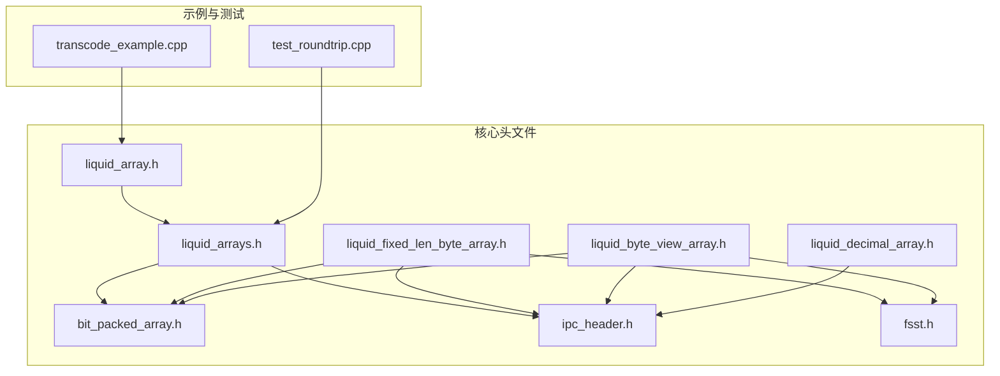
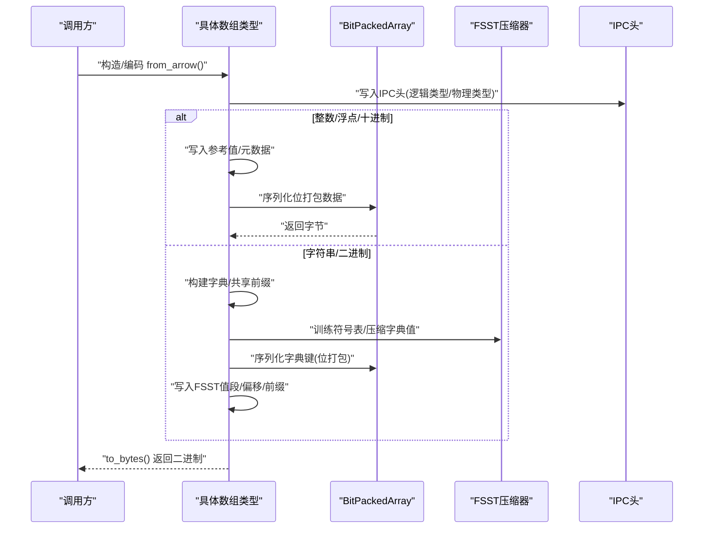
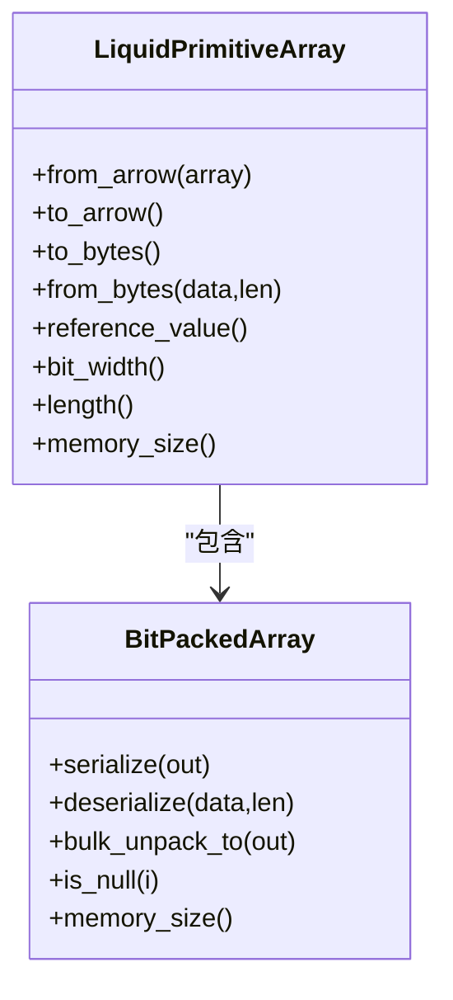
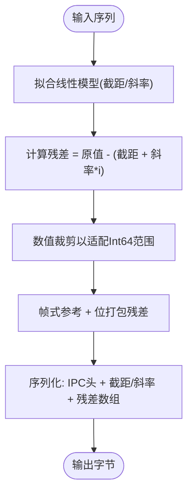
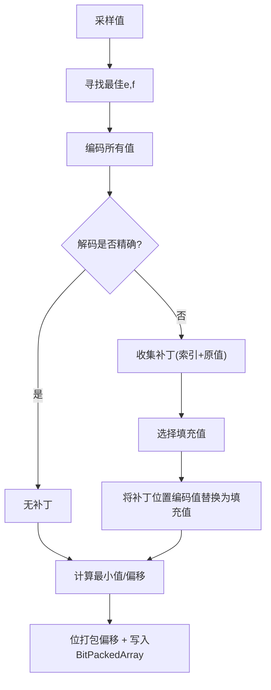
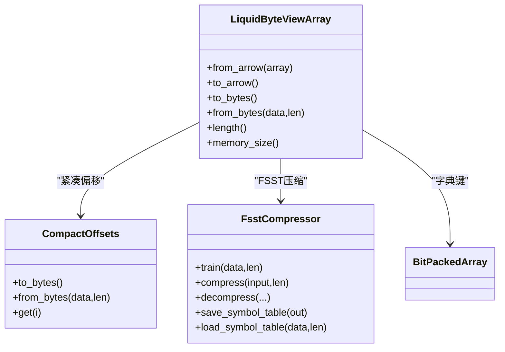
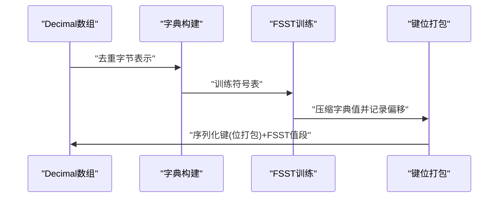
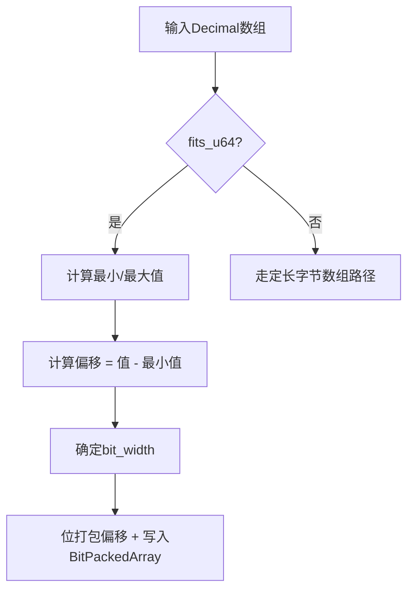
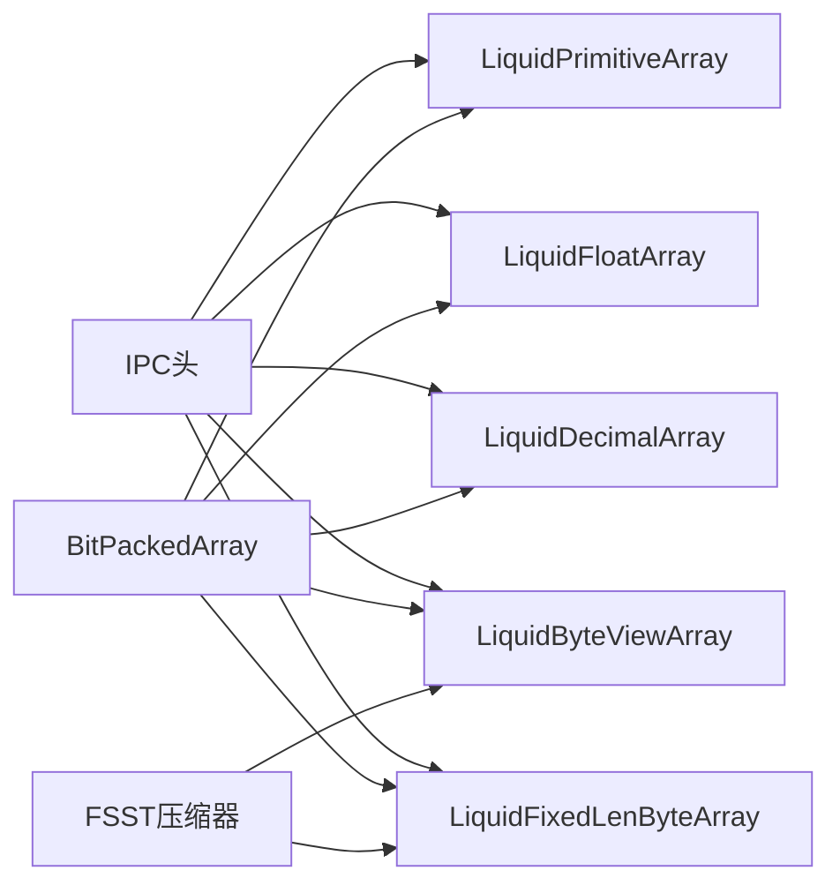

# 数组内存布局

<cite>
**本文档引用的文件**
- [liquid_array.h](file://include/liquid_cache/liquid_array.h)
- [liquid_arrays.h](file://include/liquid_cache/liquid_arrays.h)
- [bit_packed_array.h](file://include/liquid_cache/bit_packed_array.h)
- [liquid_fixed_len_byte_array.h](file://include/liquid_cache/liquid_fixed_len_byte_array.h)
- [liquid_byte_view_array.h](file://include/liquid_cache/liquid_byte_view_array.h)
- [ipc_header.h](file://include/liquid_cache/ipc_header.h)
- [fsst.h](file://include/liquid_cache/fsst.h)
- [liquid_decimal_array.h](file://include/liquid_cache/liquid_decimal_array.h)
- [transcode_example.cpp](file://examples/transcode_example.cpp)
- [test_roundtrip.cpp](file://tests/test_roundtrip.cpp)
- [README.md](file://README.md)
</cite>

## 目录
1. [简介](#简介)
2. [项目结构](#项目结构)
3. [核心组件](#核心组件)
4. [架构总览](#架构总览)
5. [详细组件分析](#详细组件分析)
6. [依赖关系分析](#依赖关系分析)
7. [性能考量](#性能考量)
8. [故障排查指南](#故障排查指南)
9. [结论](#结论)

## 简介
本文件系统性阐述 Liquid 编码数组的内存布局与实现细节，覆盖整数数组、浮点数组、字符串/二进制数组、定长字节数组以及十进制数组的内存组织结构。重点说明：
- 头部信息（IPC 头、逻辑类型标识、物理类型标识）
- 数据缓冲区（值缓冲区、空值位图、索引/键区）
- 不同编码算法的内存差异（帧式参考 + 位打包、ALP 有损/无损、字典 + FSST、线性模型）
- 内存对齐与缓存友好排列
- 零拷贝访问机制
- 内存使用分析（占用计算、碎片与回收策略）
- 内存安全与越界保护

## 项目结构
仓库采用按功能域分层的头文件组织，核心数组类型与工具类分布在 include/liquid_cache 下，示例与测试位于 examples/ 与 tests/ 目录。

图表来源
- [liquid_array.h:1-159](file://include/liquid_cache/liquid_array.h#L1-L159)
- [liquid_arrays.h:1-800](file://include/liquid_cache/liquid_arrays.h#L1-L800)
- [bit_packed_array.h:1-486](file://include/liquid_cache/bit_packed_array.h#L1-L486)
- [liquid_fixed_len_byte_array.h:1-531](file://include/liquid_cache/liquid_fixed_len_byte_array.h#L1-L531)
- [liquid_byte_view_array.h:1-670](file://include/liquid_cache/liquid_byte_view_array.h#L1-L670)
- [ipc_header.h:1-118](file://include/liquid_cache/ipc_header.h#L1-L118)
- [fsst.h:1-270](file://include/liquid_cache/fsst.h#L1-L270)
- [liquid_decimal_array.h:1-404](file://include/liquid_cache/liquid_decimal_array.h#L1-L404)
- [transcode_example.cpp:1-550](file://examples/transcode_example.cpp#L1-L550)
- [test_roundtrip.cpp:1-544](file://tests/test_roundtrip.cpp#L1-L544)

章节来源
- [README.md:1-378](file://README.md#L1-L378)

## 核心组件
- 抽象基类与多态包装：LiquidArrayBase 提供统一的多态接口，支持 Arrow/可选 Velox 解码、过滤、内存大小查询、长度与类型信息等。
- 编码数组族：整数（含线性模型）、浮点（ALP）、字节视图（字符串/二进制）、定长字节数组（十进制大值）、十进制（u64 路径）。
- 工具组件：BitPackedArray（位打包存储与批量解包）、FSST（快速静态符号表压缩）、IPC 头（二进制兼容序列化）。

章节来源
- [liquid_array.h:27-85](file://include/liquid_cache/liquid_array.h#L27-L85)
- [liquid_arrays.h:81-573](file://include/liquid_cache/liquid_arrays.h#L81-L573)
- [bit_packed_array.h:22-483](file://include/liquid_cache/bit_packed_array.h#L22-L483)
- [fsst.h:24-267](file://include/liquid_cache/fsst.h#L24-L267)
- [ipc_header.h:16-117](file://include/liquid_cache/ipc_header.h#L16-L117)

## 架构总览
Liquid 数组的内存布局遵循“IPC 头 + 元数据 + 数据块”的二进制兼容格式，所有数组类型共享统一的 IPC 头，内部再按类型填充各自的元数据与数据段，并严格遵守 8 字节对齐。

图表来源
- [liquid_arrays.h:88-238](file://include/liquid_cache/liquid_arrays.h#L88-L238)
- [liquid_byte_view_array.h:167-577](file://include/liquid_cache/liquid_byte_view_array.h#L167-L577)
- [liquid_fixed_len_byte_array.h:91-283](file://include/liquid_cache/liquid_fixed_len_byte_array.h#L91-L283)
- [ipc_header.h:46-117](file://include/liquid_cache/ipc_header.h#L46-L117)

## 详细组件分析

### 整数数组（帧式参考 + 位打包）
- 内存布局要点
  - IPC 头（16B）
  - 参考值（NativeT 大小，按物理类型对齐）
  - 填充至 8 字节对齐
  - BitPackedArray（16B 头 + 空值位图 + 打包值数据）
- 数据组织
  - 值 = 偏移 + 参考值，偏移经位打包存储，bit_width 动态决定
  - 空值位图与值数据分离，便于零拷贝解码
- 性能特性
  - bulk_unpack_to 使用 AVX2/SIMD 优化常见位宽（1/2/4/8/16/32）
  - 常量值（bit_width=0）仅存储 0，节省空间
- 内存占用估算
  - 近似：16B(IPC头) + sizeof(NativeT) + padding + ceil(N*bit_width/8) + ceil(N/8) 字节空值位图 + sizeof(BitPackedArray对象)

图表来源
- [liquid_arrays.h:88-248](file://include/liquid_cache/liquid_arrays.h#L88-L248)
- [bit_packed_array.h:22-483](file://include/liquid_cache/bit_packed_array.h#L22-L483)

章节来源
- [liquid_arrays.h:88-248](file://include/liquid_cache/liquid_arrays.h#L88-L248)
- [bit_packed_array.h:22-233](file://include/liquid_cache/bit_packed_array.h#L22-L233)

### 线性整数数组（线性模型 + 残差）
- 内存布局要点
  - IPC 头（16B）
  - 截距/斜率（各8B，LE）
  - 填充至 8 字节对齐
  - 残差数组（LiquidPrimitiveArray<Int64>，采用帧式参考 + 位打包）
- 数据组织
  - 值 ≈ 截距 + 斜率*i + 残差，残差经位打包存储
  - 适用于单调/近线性序列
- 内存占用估算
  - 近似：16B + 16B + padding + 残差数组内存大小

图表来源
- [liquid_arrays.h:342-566](file://include/liquid_cache/liquid_arrays.h#L342-L566)

章节来源
- [liquid_arrays.h:342-566](file://include/liquid_cache/liquid_arrays.h#L342-L566)

### 浮点数组（ALP + 位打包）
- 内存布局要点
  - IPC 头（16B）
  - 参考值（SignedInt，有符号整数）
  - 填充至 8 字节对齐
  - 指数参数 e/f（各1B，共2B）
  - 补丁数量（8B）
  - 补丁索引数组（8B*N）
  - 补丁原始值数组（sizeof(FloatT)*N）
  - 填充至 8 字节对齐
  - BitPackedArray（16B 头 + 空值位图 + 打包值数据）
- 数据组织
  - ALP 编码：encode = round(value * 10^e * 10^(-f))
  - 若解码不精确，则记录补丁（索引+原始值），并将对应位置设为“填充值”以提升压缩
  - 偏移 = 编码值 - 最小编码值，经位打包存储
- 内存占用估算
  - 近似：16B + sizeof(SignedInt) + 10B + 8B*N + sizeof(FloatT)*N + 打包值数据 + 空值位图

图表来源
- [liquid_arrays.h:577-800](file://include/liquid_cache/liquid_arrays.h#L577-L800)

章节来源
- [liquid_arrays.h:577-800](file://include/liquid_cache/liquid_arrays.h#L577-L800)

### 字符串/二进制数组（字典 + FSST）
- 内存布局要点
  - IPC 头（16B）
  - 字节视图数组头（20B，包含各段大小）
  - 填充至 8 字节对齐
  - FSST 原始缓冲区（符号表 + 原始字节数 + 压缩大小 + 压缩数据）
  - 填充至 8 字节对齐
  - BitPackedArray（字典键）
  - 填充至 8 字节对齐
  - 紧凑偏移（CompactOffsets）
  - 填充至 8 字节对齐
  - 前缀键数组（每项8字节）
  - 填充至 8 字节对齐
  - 共享前缀字节
- 数据组织
  - 字典：去重后的字符串，构建共享前缀
  - FSST：对字典值（去除共享前缀）进行符号表训练与压缩
  - 字典键：每条记录映射到字典索引，经位打包存储
  - CompactOffsets：线性回归压缩的字节偏移，支持 O(1) 访问
  - 解码时先解压字典，再按键索引拼接得到原始字符串
- 内存占用估算
  - 近似：16B + 20B + FSST段 + keys字节 + offsets字节 + 前缀键数组 + 共享前缀 + padding

图表来源
- [liquid_byte_view_array.h:167-666](file://include/liquid_cache/liquid_byte_view_array.h#L167-L666)
- [fsst.h:24-267](file://include/liquid_cache/fsst.h#L24-L267)
- [bit_packed_array.h:22-483](file://include/liquid_cache/bit_packed_array.h#L22-L483)

章节来源
- [liquid_byte_view_array.h:167-666](file://include/liquid_cache/liquid_byte_view_array.h#L167-L666)
- [fsst.h:24-267](file://include/liquid_cache/fsst.h#L24-L267)

### 定长字节数组（十进制大值，字典 + FSST）
- 内存布局要点
  - IPC 头（16B，逻辑类型=FixedLenByteArray）
  - 固定长度字节数组头（12B，包含键/值段大小、精度/刻度等）
  - BitPackedArray（字典键）
  - 填充至 8 字节对齐
  - FSST 值段（符号表 + 原始字节数 + 压缩大小 + 压缩数据 + 紧凑偏移）
- 数据组织
  - 用于 Decimal128/256 中超出 u64 范围的值
  - 将字节表示作为键进行字典化，FSST 压缩字典值
- 内存占用估算
  - 近似：16B + 12B + keys字节 + FSST值段字节

图表来源
- [liquid_fixed_len_byte_array.h:91-528](file://include/liquid_cache/liquid_fixed_len_byte_array.h#L91-L528)

章节来源
- [liquid_fixed_len_byte_array.h:91-528](file://include/liquid_cache/liquid_fixed_len_byte_array.h#L91-L528)

### 十进制数组（u64 路径，帧式参考 + 位打包）
- 内存布局要点
  - IPC 头（16B，逻辑类型=Decimal，物理类型=UInt64）
  - 十进制数组头（8B，包含类型、精度、刻度等）
  - 参考值（u64，LE）
  - 填充至 32 字节起始位置（对齐规则匹配 Rust 实现）
  - BitPackedArray（打包的 u64 偏移）
- 数据组织
  - 仅当所有非空值可放入 u64 时使用该路径
  - 偏移 = 原值 - 最小值，经位打包存储
- 内存占用估算
  - 近似：16B + 8B + 8B + padding + 打包值数据 + 空值位图

图表来源
- [liquid_decimal_array.h:66-394](file://include/liquid_cache/liquid_decimal_array.h#L66-L394)

章节来源
- [liquid_decimal_array.h:66-394](file://include/liquid_cache/liquid_decimal_array.h#L66-L394)

## 依赖关系分析
- 组件耦合
  - 所有数组类型均依赖 IPC 头（统一二进制格式）
  - 字符串/二进制与定长字节数组依赖 FSST 压缩器
  - 所有数值数组依赖 BitPackedArray（位打包工具）
- 外部依赖
  - Arrow/Parquet 用于数据读取与类型系统
  - 可选 Velox 集成（通过宏开关）

图表来源
- [ipc_header.h:16-117](file://include/liquid_cache/ipc_header.h#L16-L117)
- [bit_packed_array.h:22-483](file://include/liquid_cache/bit_packed_array.h#L22-L483)
- [fsst.h:24-267](file://include/liquid_cache/fsst.h#L24-L267)
- [liquid_arrays.h:88-573](file://include/liquid_cache/liquid_arrays.h#L88-L573)
- [liquid_byte_view_array.h:167-666](file://include/liquid_cache/liquid_byte_view_array.h#L167-L666)
- [liquid_fixed_len_byte_array.h:91-528](file://include/liquid_cache/liquid_fixed_len_byte_array.h#L91-L528)
- [liquid_decimal_array.h:66-394](file://include/liquid_cache/liquid_decimal_array.h#L66-L394)

章节来源
- [liquid_array.h:27-85](file://include/liquid_cache/liquid_array.h#L27-L85)
- [liquid_arrays.h:1-800](file://include/liquid_cache/liquid_arrays.h#L1-L800)

## 性能考量
- 内存对齐与缓存友好
  - 所有数组在写入打包数据前都会进行 8 字节对齐，减少跨缓存行访问
  - BitPackedArray 的批量解包使用 AVX2/SIMD，提升解码吞吐
- 零拷贝访问
  - 空值位图与值缓冲区直接映射到 Arrow/可选 Velox 的缓冲区，避免中间拷贝
  - 字符串/二进制解码通过预构建的连续数据缓冲区与偏移表，实现 O(1) 访问
- 压缩效率
  - 整数/十进制：小范围值（小 bit_width）显著压缩
  - 浮点：ALP 在高精度需求下仍保持良好压缩，补丁机制保证无损
  - 字符串/二进制：字典 + FSST 在重复性强的场景收益明显
- 内存使用分析
  - 占用计算：各数组类型均提供 memory_size()，返回内存中表示的总字节数（包含对象开销）
  - 建议：结合 to_arrow() 的缓冲区大小对比，评估压缩收益与解码成本

章节来源
- [bit_packed_array.h:242-272](file://include/liquid_cache/bit_packed_array.h#L242-L272)
- [liquid_byte_view_array.h:355-411](file://include/liquid_cache/liquid_byte_view_array.h#L355-L411)
- [liquid_decimal_array.h:377-380](file://include/liquid_cache/liquid_decimal_array.h#L377-L380)

## 故障排查指南
- 序列化/反序列化错误
  - IPC 头校验失败：确认 magic number 与版本匹配
  - 缓冲区不足：检查各段大小与对齐后的位置
- 解码异常
  - BitPackedArray 解包越界：检查 bit_width 与 length 是否一致
  - FSST 符号表损坏：重新训练或加载有效符号表
- 性能问题
  - 未命中 SIMD：确认编译器支持 AVX2，且 bit_width 为常见宽度
  - 字典/FSST 开销过大：在低基数/稀疏场景下，字典压缩可能不如直接存储
- 内存安全
  - 边界检查：get()/bulk_unpack_to() 内部已做越界保护
  - 空值处理：is_null()/null_count() 提供空值判定与计数

章节来源
- [ipc_header.h:86-117](file://include/liquid_cache/ipc_header.h#L86-L117)
- [bit_packed_array.h:97-153](file://include/liquid_cache/bit_packed_array.h#L97-L153)
- [fsst.h:199-226](file://include/liquid_cache/fsst.h#L199-L226)
- [test_roundtrip.cpp:32-54](file://tests/test_roundtrip.cpp#L32-L54)

## 结论
Liquid 数组通过统一的 IPC 头与严格的内存对齐，实现了跨类型的二进制兼容与高效的零拷贝解码。不同数组类型采用针对性的压缩策略：整数/十进制采用帧式参考 + 位打包，浮点采用 ALP + 补丁，字符串/二进制采用字典 + FSST，十进制大值采用字典 + FSST 的定长字节数组路径。配合 AVX2/SIMD 批量解包与 Arrow/可选 Velox 的缓冲区直通，整体在压缩率与解码性能之间取得良好平衡。建议在实际部署中结合数据特征选择合适编码，并利用提供的 memory_size() 与 round-trip 测试进行容量规划与质量验证。