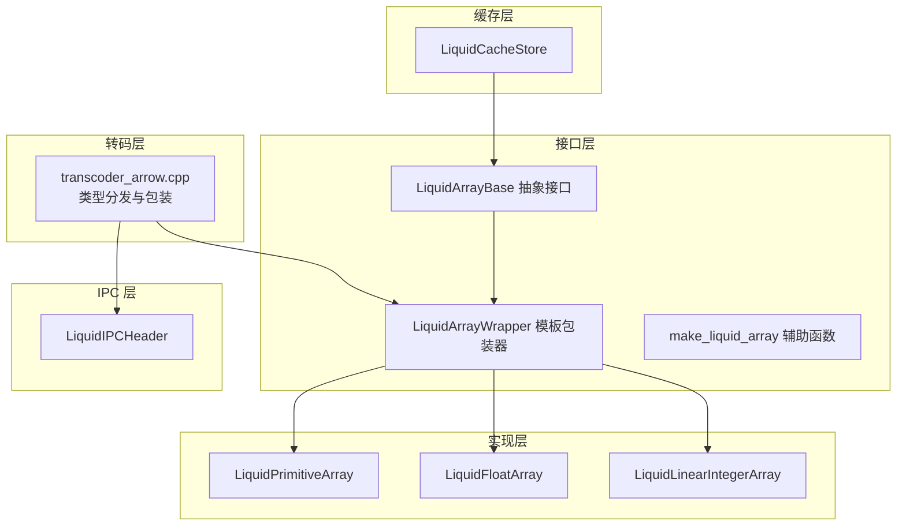
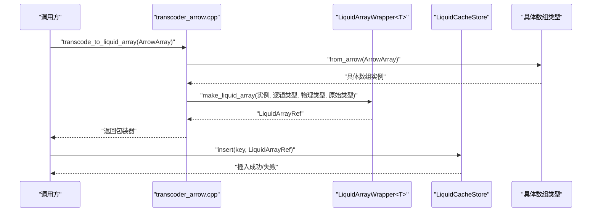
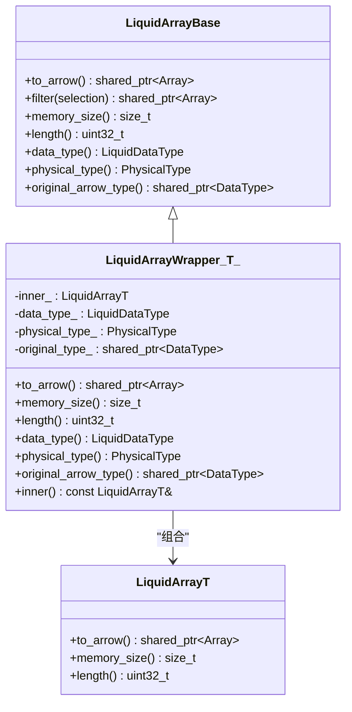
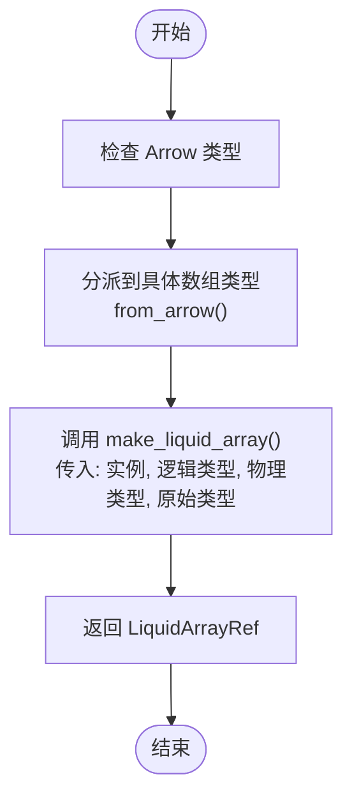
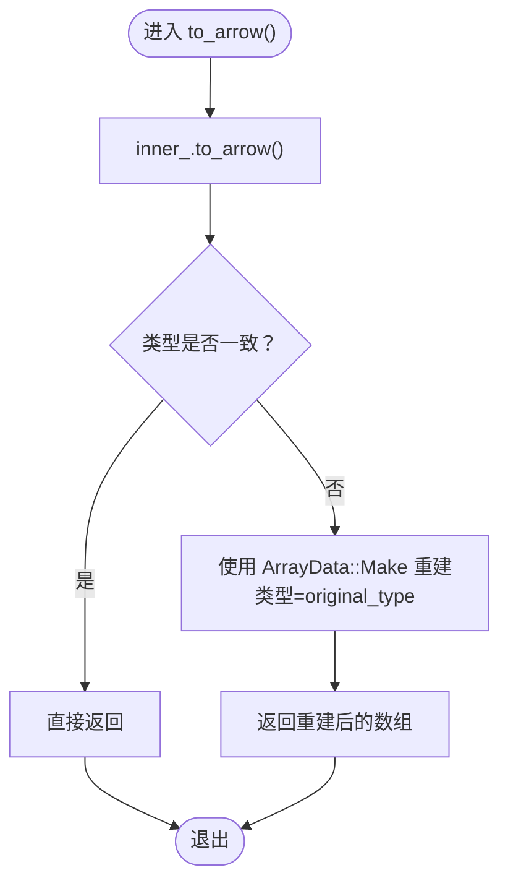
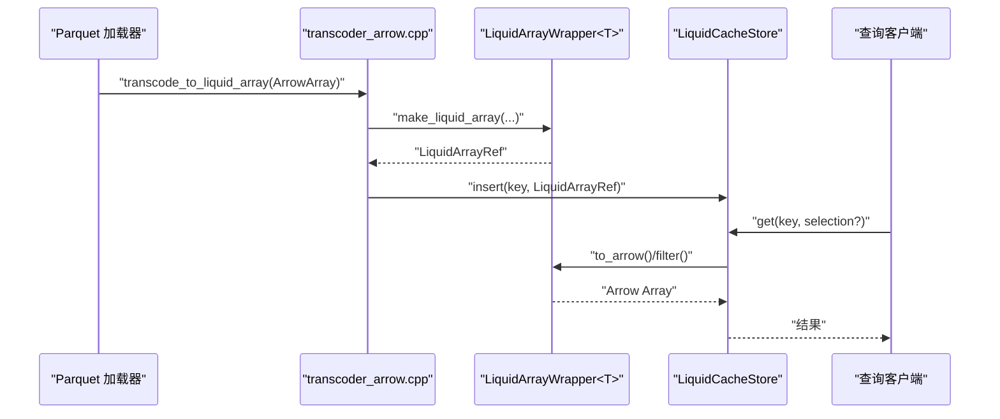
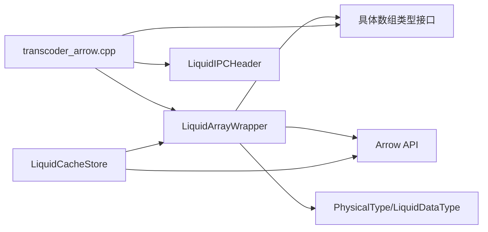

# 数组包装器模板

<cite>
**本文档引用的文件**
- [liquid_array.h](file://include/liquid_cache/liquid_array.h)
- [liquid_arrays.h](file://include/liquid_cache/liquid_arrays.h)
- [transcoder_arrow.cpp](file://src/transcoder_arrow.cpp)
- [ipc_header.h](file://include/liquid_cache/ipc_header.h)
- [transcoder.h](file://include/liquid_cache/transcoder.h)
- [liquid_cache_store.h](file://include/liquid_cache/liquid_cache_store.h)
</cite>

## 目录
1. [简介](#简介)
2. [项目结构](#项目结构)
3. [核心组件](#核心组件)
4. [架构总览](#架构总览)
5. [详细组件分析](#详细组件分析)
6. [依赖关系分析](#依赖关系分析)
7. [性能考量](#性能考量)
8. [故障排查指南](#故障排查指南)
9. [结论](#结论)
10. [附录](#附录)

## 简介
本文件围绕数组包装器模板进行系统化文档化，重点阐述 LiquidArrayWrapper 模板类的设计目的、实现机制与使用方法。文档涵盖：
- 模板参数约束与构造函数参数传递
- 类型转换与类型擦除机制
- 原始 Arrow 类型重解释的工作原理
- make_liquid_array 辅助函数的使用与最佳实践
- 在缓存系统中通过统一接口暴露不同数组类型的方法

## 项目结构
本项目采用“按功能域分层”的组织方式：
- 接口层：抽象基类与通用包装器（liquid_array.h）
- 实现层：具体编码数组类型（liquid_arrays.h）
- 转码层：Arrow 与内部编码之间的桥接（transcoder_arrow.cpp）
- IPC 层：序列化头部与二进制格式（ipc_header.h）
- 缓存层：列式缓存与内存预算控制（liquid_cache_store.h）

图表来源
- [liquid_array.h:39-156](file://include/liquid_cache/liquid_array.h#L39-L156)
- [liquid_arrays.h:95-248](file://include/liquid_cache/liquid_arrays.h#L95-L248)
- [transcoder_arrow.cpp:490-658](file://src/transcoder_arrow.cpp#L490-L658)
- [ipc_header.h:55-106](file://include/liquid_cache/ipc_header.h#L55-L106)
- [liquid_cache_store.h:188-527](file://include/liquid_cache/liquid_cache_store.h#L188-L527)

章节来源
- [liquid_array.h:1-159](file://include/liquid_cache/liquid_array.h#L1-L159)
- [liquid_arrays.h:1-800](file://include/liquid_cache/liquid_arrays.h#L1-L800)
- [transcoder_arrow.cpp:1-746](file://src/transcoder_arrow.cpp#L1-L746)
- [ipc_header.h:1-118](file://include/liquid_cache/ipc_header.h#L1-L118)
- [liquid_cache_store.h:1-527](file://include/liquid_cache/liquid_cache_store.h#L1-L527)

## 核心组件
- LiquidArrayBase：统一抽象接口，定义 to_arrow、filter、memory_size、length、data_type、physical_type、original_arrow_type 等虚函数，用于面向对象的多态访问。
- LiquidArrayWrapper<T>：泛型包装器，将任意具体数组类型适配为 LiquidArrayBase，实现类型擦除与统一接口暴露。
- make_liquid_array：辅助工厂函数，简化创建 LiquidArrayRef 的过程，传入具体数组实例、逻辑类型、物理类型与原始 Arrow 类型。
- 具体数组类型：如 LiquidPrimitiveArray<T>、LiquidFloatArray<T>、LiquidLinearIntegerArray<T> 等，负责具体的编码、解码与序列化。

章节来源
- [liquid_array.h:39-156](file://include/liquid_cache/liquid_array.h#L39-L156)

## 架构总览
数组包装器模板在缓存系统中的作用是：将不同 Arrow 类型的数组统一为一个可共享的、类型擦除的对象，以便缓存系统以相同的方式管理与访问。转码层根据 Arrow 类型分派到具体数组类型，再通过 make_liquid_array 创建包装器，最终存入缓存。

图表来源
- [transcoder_arrow.cpp:490-658](file://src/transcoder_arrow.cpp#L490-L658)
- [liquid_array.h:149-156](file://include/liquid_cache/liquid_array.h#L149-L156)
- [liquid_cache_store.h:222-245](file://include/liquid_cache/liquid_cache_store.h#L222-L245)

## 详细组件分析

### LiquidArrayWrapper 模板类
LiquidArrayWrapper<T> 作为模板包装器，将任意具体数组类型 T 适配为 LiquidArrayBase，从而实现类型擦除与统一接口暴露。其关键设计要点如下：

- 模板参数约束
  - T 必须提供以下成员函数签名：to_arrow()、memory_size()、length()。
  - 该约束通过接口契约而非显式模板约束体现，确保编译期不会引入额外开销。
- 构造函数参数传递
  - 接收具体数组实例 inner、逻辑类型 dt、物理类型 pt、原始 Arrow 类型 original_type。
  - 将这些参数保存为私有成员，供上层统一接口使用。
- 类型转换处理
  - 在 to_arrow() 中，若 inner_.to_arrow() 返回的 Arrow 类型与 original_type 不一致，则通过 arrow::ArrayData::Make 重新构造数组，确保类型一致性。
  - 这一机制用于处理如 Timestamp 存储为 Int64、但需要以 Arrow Timestamp 类型返回的情形。
- 统一接口实现
  - memory_size()/length()/data_type()/physical_type()/original_arrow_type() 直接委托给 inner_ 或保存的成员变量。
  - filter() 提供默认实现：先 to_arrow() 再应用箭头过滤，子类可覆盖以实现无全解码优化。
- 最佳实践
  - 在创建包装器时，确保传入的 original_type 与 inner_.to_arrow() 的实际类型一致，避免不必要的类型重解释。
  - 对于时间戳等特殊类型，应确保物理类型与逻辑类型正确映射。

图表来源
- [liquid_array.h:39-156](file://include/liquid_cache/liquid_array.h#L39-L156)

章节来源
- [liquid_array.h:98-146](file://include/liquid_cache/liquid_array.h#L98-L146)

### make_liquid_array 辅助函数
make_liquid_array 是创建 LiquidArrayRef 的便捷工厂函数，其职责与使用建议如下：

- 职责
  - 接收具体数组实例、逻辑类型、物理类型与原始 Arrow 类型。
  - 返回 std::shared_ptr<LiquidArrayBase>（即 LiquidArrayRef）。
- 使用方法
  - 在转码层根据 Arrow 类型分派后，调用 from_arrow() 获取具体数组实例，随后调用 make_liquid_array 创建包装器。
  - 传入的原始 Arrow 类型用于后续 to_arrow() 时的类型重解释。
- 最佳实践
  - 保持逻辑类型与物理类型与具体数组实例的编码约定一致。
  - 对于时间戳等类型，确保物理类型与单位匹配（如秒、毫秒、微秒、纳秒）。
  - 避免在包装器外层再次进行不必要的类型转换，减少重复开销。

图表来源
- [transcoder_arrow.cpp:490-658](file://src/transcoder_arrow.cpp#L490-L658)
- [liquid_array.h:149-156](file://include/liquid_cache/liquid_array.h#L149-L156)

章节来源
- [liquid_array.h:149-156](file://include/liquid_cache/liquid_array.h#L149-L156)
- [transcoder_arrow.cpp:490-658](file://src/transcoder_arrow.cpp#L490-L658)

### 原始 Arrow 类型重解释机制
在 to_arrow() 中，若 inner_.to_arrow() 返回的 Arrow 类型与 original_type 不一致，则通过 arrow::ArrayData::Make 重新构造数组，确保类型一致性。这一机制的关键点如下：

- 触发条件
  - 当具体数组类型内部以另一种 Arrow 类型表示（例如时间戳以 Int64 存储）时，需要在对外暴露时恢复为原始类型。
- 实现细节
  - 复用 inner_.to_arrow() 的 ArrayData（缓冲区、空值位图、长度、偏移），仅替换类型为 original_type。
  - 通过 arrow::ArrayData::Make 构造新的数组，避免复制数据。
- 典型场景
  - Timestamp 存储为 Int64，但在对外接口中需要以 Arrow Timestamp 类型返回。
  - Date32/Date64 的内部表示与外部类型一致，通常不需要重解释。

图表来源
- [liquid_array.h:109-121](file://include/liquid_cache/liquid_array.h#L109-L121)

章节来源
- [liquid_array.h:109-121](file://include/liquid_cache/liquid_array.h#L109-L121)

### 在缓存系统中的应用
缓存系统通过统一的 LiquidArrayBase 接口管理不同数组类型，实现零序列化读取与列式投影。关键流程如下：

- 插入阶段
  - 调用 transcode_to_liquid_array() 将 Arrow 数组转为具体数组类型，并通过 make_liquid_array 创建包装器。
  - 将包装器存入缓存，键由文件、行组、列索引与批次标识组成。
- 读取阶段
  - 通过键获取缓存项，调用 read() 或 filter()，内部统一走 to_arrow()/filter()。
  - 对于不支持的类型，降级为直接存储 Arrow 原始数组。
- 内存预算与 LRU
  - 通过 MemoryBudget 与 LruPolicy 控制内存占用与淘汰策略，确保缓存命中率与内存上限。

图表来源
- [transcoder_arrow.cpp:664-743](file://src/transcoder_arrow.cpp#L664-L743)
- [liquid_cache_store.h:286-356](file://include/liquid_cache/liquid_cache_store.h#L286-L356)

章节来源
- [liquid_cache_store.h:188-527](file://include/liquid_cache/liquid_cache_store.h#L188-L527)
- [transcoder_arrow.cpp:664-743](file://src/transcoder_arrow.cpp#L664-L743)

## 依赖关系分析
- LiquidArrayWrapper 依赖于：
  - 具体数组类型（如 LiquidPrimitiveArray<T>、LiquidFloatArray<T> 等）提供的 to_arrow()/memory_size()/length()。
  - Arrow C++ API 的 ArrayData、MakeArray、Compute Filter 等能力。
  - IPC 头部类型（LiquidDataType、PhysicalType）用于统一接口。
- 转码层依赖：
  - Arrow 类型分派与 Cast 能力，确保对字符串视图、字典等复杂类型进行预处理。
  - 具体数组类型的 from_arrow()/from_bytes()/to_arrow() 实现。
- 缓存层依赖：
  - LiquidArrayBase 的统一接口，实现列式投影与行过滤。
  - LruPolicy 与 MemoryBudget 的内存控制。

图表来源
- [liquid_array.h:98-156](file://include/liquid_cache/liquid_array.h#L98-L156)
- [transcoder_arrow.cpp:490-658](file://src/transcoder_arrow.cpp#L490-L658)
- [ipc_header.h:55-106](file://include/liquid_cache/ipc_header.h#L55-L106)
- [liquid_cache_store.h:188-527](file://include/liquid_cache/liquid_cache_store.h#L188-L527)

章节来源
- [liquid_array.h:98-156](file://include/liquid_cache/liquid_array.h#L98-L156)
- [transcoder_arrow.cpp:490-658](file://src/transcoder_arrow.cpp#L490-L658)
- [ipc_header.h:55-106](file://include/liquid_cache/ipc_header.h#L55-L106)
- [liquid_cache_store.h:188-527](file://include/liquid_cache/liquid_cache_store.h#L188-L527)

## 性能考量
- 类型重解释的成本
  - 仅在类型不一致时触发，且通过 ArrayData::Make 复用缓冲区，避免数据复制。
- 过滤优化
  - 默认实现先 to_arrow() 再 Filter，子类可覆盖以实现无全解码的谓词下推。
- 内存预算与 LRU
  - 通过 MemoryBudget 与 LruPolicy 控制缓存大小，避免内存溢出。
- 编解码效率
  - 具体数组类型（如 LiquidPrimitiveArray、LiquidFloatArray）采用帧参考 + 位打包等压缩策略，显著降低内存占用。

[本节为一般性指导，无需引用具体文件]

## 故障排查指南
- 类型不一致导致的解码错误
  - 现象：返回的 Arrow 类型与期望不符。
  - 排查：确认 original_type 是否正确传入，以及具体数组类型内部是否以不同类型存储（如时间戳）。
- 过滤失败
  - 现象：filter() 抛出异常。
  - 排查：检查 selection 的布尔数组长度与原数组长度一致，以及 Arrow 计算模块可用性。
- 内存不足
  - 现象：插入失败或 LRU 淘汰频繁。
  - 排查：调整 max_cache_bytes，或优化具体数组类型的内存使用（如选择更合适的编码策略）。

章节来源
- [liquid_array.h:51-59](file://include/liquid_cache/liquid_array.h#L51-L59)
- [liquid_cache_store.h:222-245](file://include/liquid_cache/liquid_cache_store.h#L222-L245)

## 结论
LiquidArrayWrapper 模板通过类型擦除与统一接口，成功将多种具体数组类型纳入同一缓存体系，实现了零序列化读取与高效的列式访问。配合 make_liquid_array 辅助函数与转码层的类型分派，系统能够在 Arrow 与内部编码之间平滑过渡，既保证了类型一致性，又兼顾了性能与内存控制。对于时间戳等特殊类型，原始 Arrow 类型重解释机制确保了对外接口的一致性与正确性。

[本节为总结性内容，无需引用具体文件]

## 附录
- 关键 API 路径
  - LiquidArrayBase 接口定义：[liquid_array.h:39-85](file://include/liquid_cache/liquid_array.h#L39-L85)
  - LiquidArrayWrapper 模板实现：[liquid_array.h:98-146](file://include/liquid_cache/liquid_array.h#L98-L146)
  - make_liquid_array 工厂函数：[liquid_array.h:149-156](file://include/liquid_cache/liquid_array.h#L149-L156)
  - 具体数组类型（示例）：[liquid_arrays.h:95-248](file://include/liquid_cache/liquid_arrays.h#L95-L248)
  - 转码入口（Arrow → 包装器）：[transcoder_arrow.cpp:490-658](file://src/transcoder_arrow.cpp#L490-L658)
  - IPC 头部结构：[ipc_header.h:55-106](file://include/liquid_cache/ipc_header.h#L55-L106)
  - 缓存存储与读取：[liquid_cache_store.h:188-527](file://include/liquid_cache/liquid_cache_store.h#L188-L527)

[本节为补充信息，无需引用具体文件]