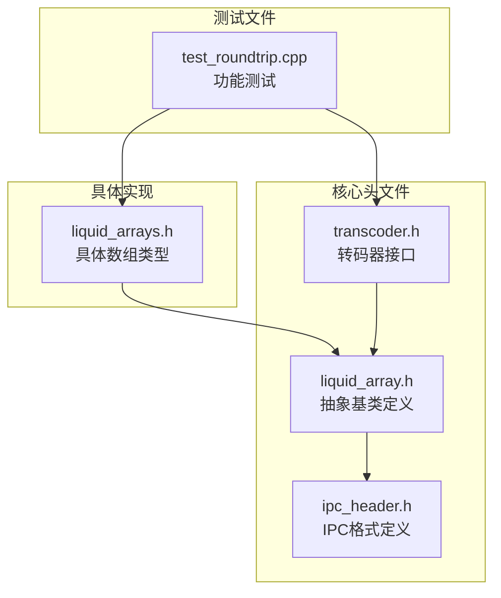
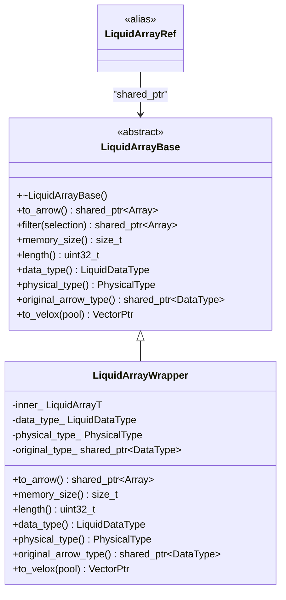
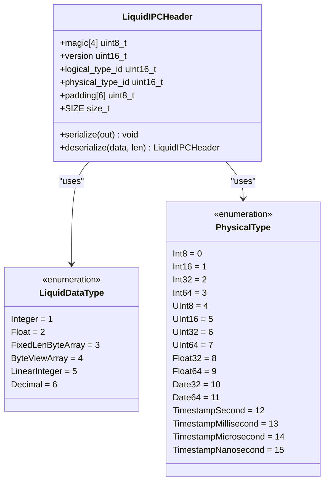
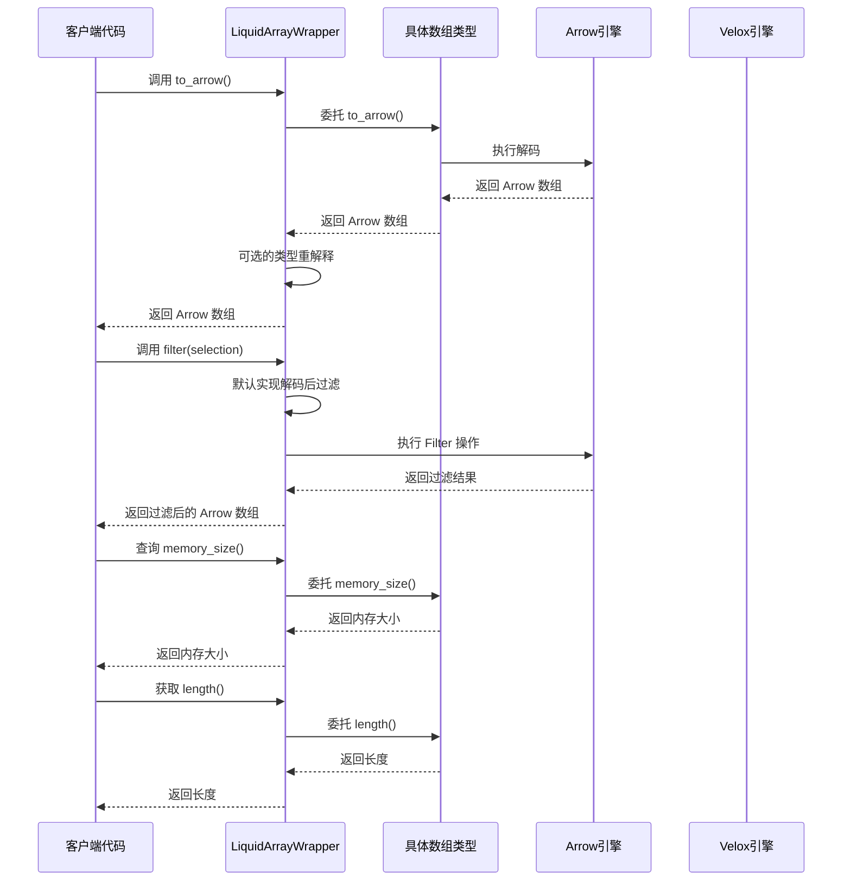
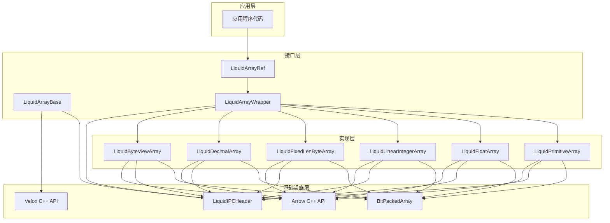

# 数组基类接口

<cite>
**本文档引用的文件**
- [liquid_array.h](file://include/liquid_cache/liquid_array.h)
- [liquid_arrays.h](file://include/liquid_cache/liquid_arrays.h)
- [ipc_header.h](file://include/liquid_cache/ipc_header.h)
- [transcoder.h](file://include/liquid_cache/transcoder.h)
- [test_roundtrip.cpp](file://tests/test_roundtrip.cpp)
</cite>

## 目录
1. [简介](#简介)
2. [项目结构](#项目结构)
3. [核心组件](#核心组件)
4. [架构概览](#架构概览)
5. [详细组件分析](#详细组件分析)
6. [依赖关系分析](#依赖关系分析)
7. [性能考虑](#性能考虑)
8. [故障排除指南](#故障排除指南)
9. [结论](#结论)

## 简介

LiquidArrayBase 是 Liquid Cache C++ 实现中的核心抽象基类，为所有 Liquid 编码数组类型提供统一的多态接口。该接口设计借鉴了 Rust 的 LiquidArray trait，实现了类型擦除机制，使得缓存存储能够持有异构数组而无需序列化。

LiquidArrayBase 提供了以下关键能力：
- **解码到 Arrow 格式**：支持完整的反压缩和数据重建
- **过滤操作**：基于布尔选择掩码进行行过滤
- **内存查询**：报告编码表示的内存大小
- **长度获取**：返回元素数量
- **类型标识**：提供逻辑和物理类型信息
- **原始类型重建**：确保正确的 Arrow 类型重构

## 项目结构

该项目采用模块化的头文件组织方式，核心文件分布如下：

**图表来源**
- [liquid_array.h:1-159](file://include/liquid_cache/liquid_array.h#L1-L159)
- [liquid_arrays.h:1-1221](file://include/liquid_cache/liquid_arrays.h#L1-L1221)
- [ipc_header.h:1-118](file://include/liquid_cache/ipc_header.h#L1-L118)

**章节来源**
- [liquid_array.h:1-159](file://include/liquid_cache/liquid_array.h#L1-L159)
- [liquid_arrays.h:1-1221](file://include/liquid_cache/liquid_arrays.h#L1-L1221)

## 核心组件

### LiquidArrayBase 抽象基类

LiquidArrayBase 是整个系统的核心抽象层，定义了所有 Liquid 编码数组必须实现的标准接口：

**图表来源**
- [liquid_array.h:38-85](file://include/liquid_cache/liquid_array.h#L38-L85)
- [liquid_array.h:98-146](file://include/liquid_cache/liquid_array.h#L98-L146)

### 类型系统定义

系统使用两个枚举来描述数据类型：

**图表来源**
- [ipc_header.h:16-44](file://include/liquid_cache/ipc_header.h#L16-L44)
- [ipc_header.h:55-106](file://include/liquid_cache/ipc_header.h#L55-L106)

**章节来源**
- [liquid_array.h:29-85](file://include/liquid_cache/liquid_array.h#L29-L85)
- [ipc_header.h:16-44](file://include/liquid_cache/ipc_header.h#L16-L44)

## 架构概览

LiquidArrayBase 通过类型擦除机制实现了多态性，允许不同的数组类型共享统一接口：

**图表来源**
- [liquid_array.h:42-84](file://include/liquid_cache/liquid_array.h#L42-L84)
- [liquid_array.h:109-136](file://include/liquid_cache/liquid_array.h#L109-L136)

## 详细组件分析

### to_arrow() 解码方法

to_arrow() 方法是 LiquidArrayBase 的核心功能，负责将编码的数据完全解码为 Arrow 格式：

**方法签名与行为**：
- **作用机制**：将压缩的内部表示转换为完整的 Arrow 数组
- **参数规范**：无参数
- **返回值含义**：返回指向 Arrow Array 的共享指针
- **异常处理**：解码失败时抛出运行时异常

**实现特点**：
- 支持批量解码，避免逐元素处理的开销
- 自动处理空数组和全空值的情况
- 维护原始 Arrow 类型信息用于正确重建

**章节来源**
- [liquid_array.h:42-44](file://include/liquid_cache/liquid_array.h#L42-L44)
- [liquid_arrays.h:169-197](file://include/liquid_cache/liquid_arrays.h#L169-L197)

### filter() 过滤方法

filter() 方法提供了高效的行过滤功能，支持两种执行模式：

**默认实现**：
- **作用机制**：先解码为 Arrow 格式，然后使用 Arrow 计算库进行过滤
- **优化策略**：子类型可重写以实现无需完整解码的优化过滤
- **参数规范**：接受 Arrow BooleanArray 作为选择掩码
- **返回值含义**：返回过滤后的 Arrow 数组

**性能特征**：
- 默认实现简单可靠，适用于通用场景
- 重写实现可显著减少内存使用和解码时间
- 支持谓词下推优化

**章节来源**
- [liquid_array.h:46-59](file://include/liquid_cache/liquid_array.h#L46-L59)

### memory_size() 内存查询

memory_size() 方法返回编码表示的内存占用：

**方法特性**：
- **作用机制**：报告 Liquid 编码数据的字节大小
- **参数规范**：无参数
- **返回值含义**：返回 size_t 类型的内存大小（字节）
- **用途**：缓存预算管理和内存估算

**实现考虑**：
- 包含编码元数据和实际数据的总大小
- 用于缓存驱逐策略和资源管理
- 支持动态内存调整

**章节来源**
- [liquid_array.h:61-63](file://include/liquid_cache/liquid_array.h#L61-L63)

### length() 长度获取

length() 方法提供元素数量信息：

**方法特性**：
- **作用机制**：返回数组中元素的总数
- **参数规范**：无参数
- **返回值含义**：返回 uint32_t 类型的元素数量
- **用途**：循环控制和边界检查

**实现要求**：
- 必须准确反映实际元素数量
- 包含空值在内的所有元素计数
- 性能要求常数时间复杂度

**章节来源**
- [liquid_array.h:65-67](file://include/liquid_cache/liquid_array.h#L65-L67)

### data_type() 类型标识

data_type() 方法提供逻辑编码类型信息：

**方法特性**：
- **作用机制**：返回数组的逻辑类型标识
- **参数规范**：无参数
- **返回值含义**：返回 LiquidDataType 枚举值
- **用途**：类型路由和序列化

**类型映射**：
- Integer：整数数组（包含日期和时间戳）
- Float：浮点数组
- FixedLenByteArray：固定长度字节数组
- ByteViewArray：字节视图数组
- LinearInteger：线性整数数组
- Decimal：十进制数组

**章节来源**
- [liquid_array.h:69-71](file://include/liquid_cache/liquid_array.h#L69-L71)

### physical_type() 物理类型

physical_type() 方法提供底层物理类型信息：

**方法特性**：
- **作用机制**：返回底层 Arrow 类型的物理表示
- **参数规范**：无参数
- **返回值含义**：返回 PhysicalType 枚举值
- **用途**：内存布局和字节序处理

**类型覆盖**：
- 整数类型：Int8, Int16, Int32, Int64, UInt8, UInt16, UInt32, UInt64
- 浮点类型：Float32, Float64
- 日期时间：Date32, Date64, Timestamp系列

**章节来源**
- [liquid_array.h:73-74](file://include/liquid_cache/liquid_array.h#L73-L74)

### original_arrow_type() 原始类型重建

original_arrow_type() 方法确保正确的 Arrow 类型重构：

**方法特性**：
- **作用机制**：返回原始 Arrow 数据类型
- **参数规范**：无参数
- **返回值含义**：返回 Arrow DataType 的共享指针
- **用途**：类型一致性保证

**实现细节**：
- 处理时间戳等需要特殊处理的类型
- 确保解码后的类型与原始类型一致
- 支持类型重解释机制

**章节来源**
- [liquid_array.h:76-78](file://include/liquid_cache/liquid_array.h#L76-L78)

### to_velox() Velox 集成

to_velox() 方法提供直接的 Velox 向量解码：

**方法特性**：
- **作用机制**：跳过 Arrow 中间步骤，直接生成 Velox 向量
- **参数规范**：接受 MemoryPool 指针
- **返回值含义**：返回 Velox VectorPtr
- **条件编译**：仅在启用 LIQUID_ENABLE_VELOX 时可用

**性能优势**：
- 减少一次中间转换步骤
- 降低内存分配开销
- 提高与 Velox 生态系统的集成效率

**章节来源**
- [liquid_array.h:80-84](file://include/liquid_cache/liquid_array.h#L80-L84)

## 依赖关系分析

系统采用清晰的分层架构，各组件之间的依赖关系如下：

**图表来源**
- [liquid_array.h:98-146](file://include/liquid_cache/liquid_array.h#L98-L146)
- [liquid_arrays.h:95-248](file://include/liquid_cache/liquid_arrays.h#L95-L248)
- [ipc_header.h:55-106](file://include/liquid_cache/ipc_header.h#L55-L106)

**章节来源**
- [liquid_array.h:98-146](file://include/liquid_cache/liquid_array.h#L98-L146)
- [liquid_arrays.h:95-248](file://include/liquid_cache/liquid_arrays.h#L95-L248)

## 性能考虑

### 内存效率

LiquidArrayBase 设计注重内存效率：

1. **零拷贝解码**：批量解码避免重复内存分配
2. **位打包压缩**：使用 BitPackedArray 减少存储空间
3. **延迟解码**：仅在需要时才完全解码数据
4. **类型重解释**：保持底层数据布局的一致性

### 计算效率

1. **多态调用开销**：虚函数调用的最小化设计
2. **批量操作**：支持批量解码和过滤操作
3. **缓存友好**：连续内存布局优化 CPU 缓存性能
4. **条件编译**：根据需要启用特定功能

### 并发安全性

1. **不可变设计**：数组对象在解码后保持不变
2. **线程安全**：共享数组对象的并发访问安全
3. **内存安全**：智能指针自动管理内存生命周期

## 故障排除指南

### 常见问题及解决方案

**解码失败**
- **症状**：to_arrow() 方法抛出运行时异常
- **原因**：损坏的数据或不匹配的类型信息
- **解决**：验证数据完整性，检查 IPC 头部信息

**内存不足**
- **症状**：memory_size() 返回异常大的值
- **原因**：数据类型错误或解码配置不当
- **解决**：检查数据类型映射，验证编码参数

**过滤性能问题**
- **症状**：filter() 操作响应缓慢
- **原因**：未重写优化版本或选择掩码过大
- **解决**：实现自定义过滤器，优化选择掩码

**类型不匹配**
- **症状**：original_arrow_type() 返回意外类型
- **原因**：类型重解释配置错误
- **解决**：验证原始类型信息，检查类型映射表

**章节来源**
- [liquid_array.h:55-58](file://include/liquid_cache/liquid_array.h#L55-L58)

## 结论

LiquidArrayBase 抽象基类为 Liquid Cache 系统提供了强大而灵活的多态接口。通过类型擦除机制，它成功地将多种不同的数组编码格式统一在一个标准接口下，既保持了性能优势，又提供了良好的扩展性。

该接口设计的关键优势包括：

1. **统一抽象**：为所有数组类型提供一致的编程模型
2. **性能优化**：支持多种优化策略，从简单到复杂的渐进式优化
3. **类型安全**：通过枚举和静态类型检查确保类型一致性
4. **扩展性**：易于添加新的数组类型和编码算法
5. **生态系统集成**：与 Arrow 和 Velox 生态系统无缝集成

对于开发者而言，理解 LiquidArrayBase 的设计理念和实现细节，有助于更好地利用这个接口来构建高性能的数据处理应用。通过正确实现这些接口方法，可以充分发挥 Liquid Cache 在内存效率和计算性能方面的优势。