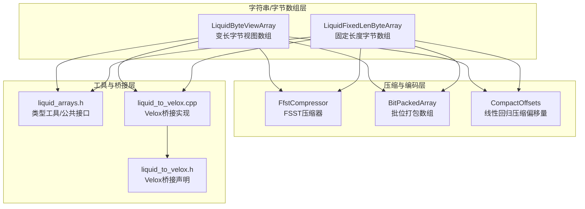
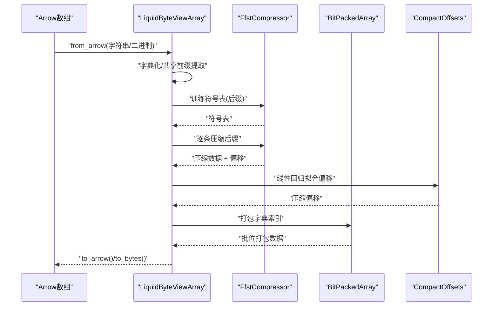
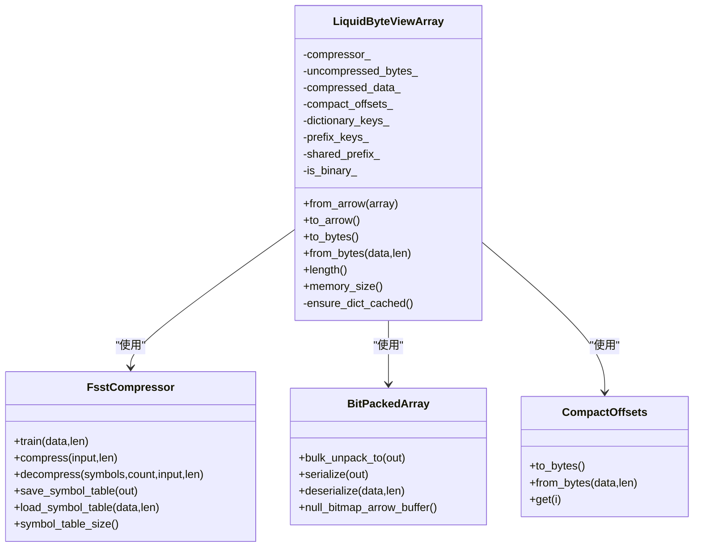
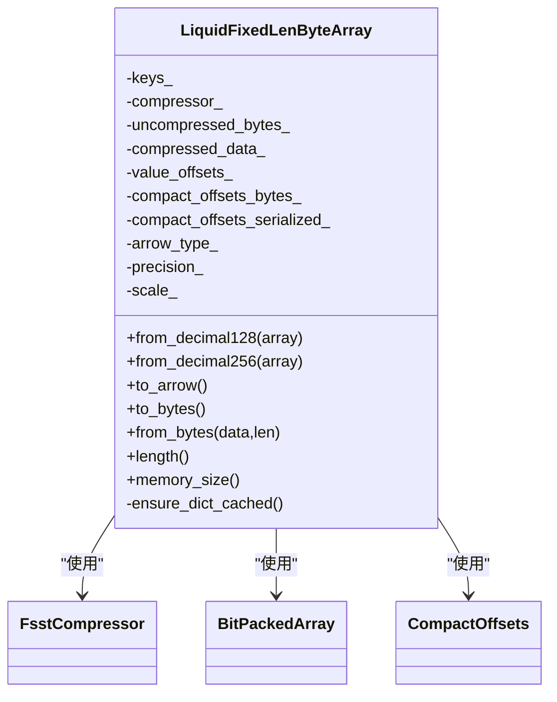
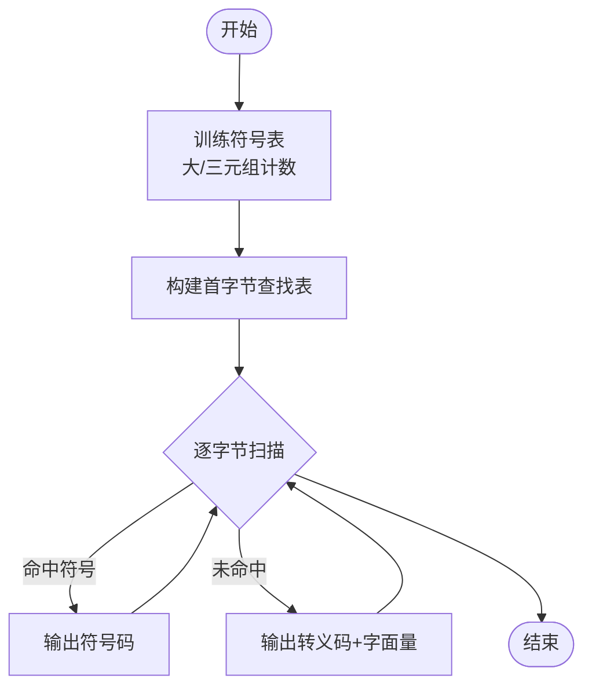
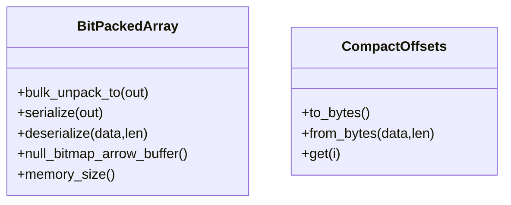
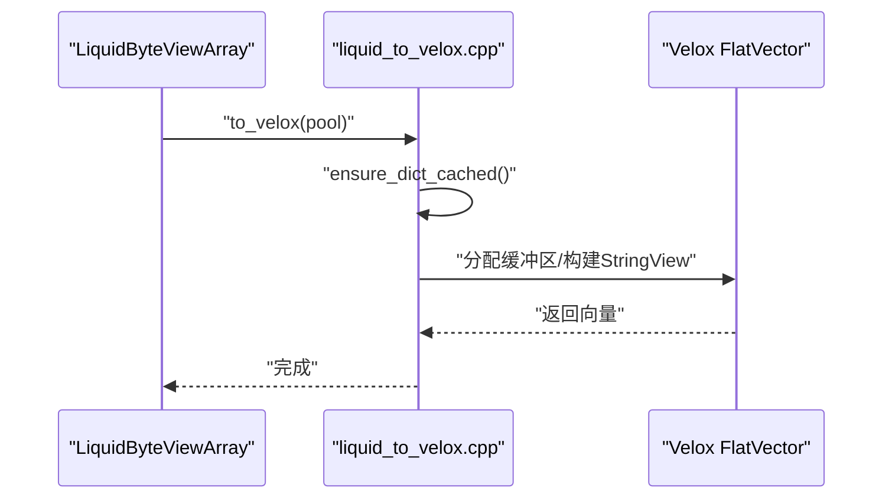
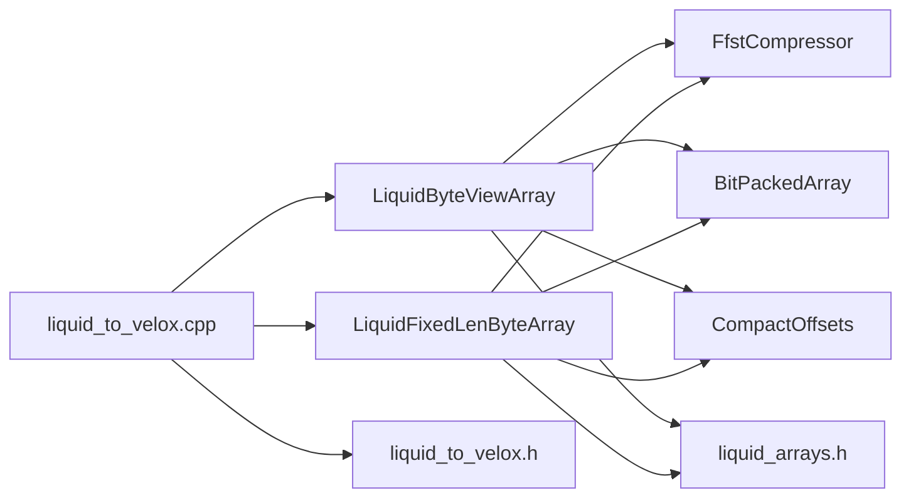

# 字符串字节数组类型

<cite>
**本文档引用的文件**
- [liquid_byte_view_array.h](file://include/liquid_cache/liquid_byte_view_array.h)
- [liquid_fixed_len_byte_array.h](file://include/liquid_cache/liquid_fixed_len_byte_array.h)
- [fsst.h](file://include/liquid_cache/fsst.h)
- [bit_packed_array.h](file://include/liquid_cache/bit_packed_array.h)
- [liquid_arrays.h](file://include/liquid_cache/liquid_arrays.h)
- [liquid_to_velox.cpp](file://src/liquid_to_velox.cpp)
- [liquid_to_velox.h](file://include/liquid_cache/liquid_to_velox.h)
- [test_roundtrip.cpp](file://tests/test_roundtrip.cpp)
</cite>

## 目录
1. [简介](#简介)
2. [项目结构](#项目结构)
3. [核心组件](#核心组件)
4. [架构总览](#架构总览)
5. [详细组件分析](#详细组件分析)
6. [依赖关系分析](#依赖关系分析)
7. [性能考量](#性能考量)
8. [故障排查指南](#故障排查指南)
9. [结论](#结论)
10. [附录](#附录)

## 简介
本文件聚焦于字符串与字节数组类型的实现与使用，系统性阐述以下内容：
- 变长字节视图数组（LiquidByteViewArray）的设计与实现：字典化 + FSST 压缩 + 前缀键优化，支持字符串与二进制类型。
- 固定长度字节数组（LiquidFixedLenByteArray）的设计与实现：字典化 + FSST 压缩，适用于无法用 u64 表示的大整数类型（如 Decimal128/256）。
- FSST 压缩算法的集成：符号表训练、压缩/解压流程、线性回归压缩偏移量（CompactOffsets）。
- 内存布局、访问模式与性能特征：批量解包、缓存字典、零拷贝复制等。
- 使用示例：创建、查询与过滤（大小写不敏感匹配、前缀匹配等）。
- 压缩效果与使用建议：何时选择变长字节视图数组或固定长度字节数组。

## 项目结构
围绕字符串/字节数组类型的关键文件组织如下：
- 变长字节视图数组：LiquidByteViewArray（头文件）
- 固定长度字节数组：LiquidFixedLenByteArray（头文件）
- FSST 压缩器：FfstCompressor（头文件）
- 批位打包数组：BitPackedArray（头文件）
- 类型工具与公共接口：liquid_arrays.h
- 与 Velox 的桥接转换：liquid_to_velox.cpp / liquid_to_velox.h
- 测试用例：test_roundtrip.cpp（包含字符串/二进制的往返测试）

图表来源
- [liquid_byte_view_array.h:204-667](file://include/liquid_cache/liquid_byte_view_array.h#L204-L667)
- [liquid_fixed_len_byte_array.h:111-528](file://include/liquid_cache/liquid_fixed_len_byte_array.h#L111-L528)
- [fsst.h:29-267](file://include/liquid_cache/fsst.h#L29-L267)
- [bit_packed_array.h:39-483](file://include/liquid_cache/bit_packed_array.h#L39-L483)
- [liquid_arrays.h:35-800](file://include/liquid_cache/liquid_arrays.h#L35-L800)
- [liquid_to_velox.cpp:274-342](file://src/liquid_to_velox.cpp#L274-L342)
- [liquid_to_velox.h:33-133](file://include/liquid_cache/liquid_to_velox.h#L33-L133)

章节来源
- [liquid_byte_view_array.h:1-670](file://include/liquid_cache/liquid_byte_view_array.h#L1-L670)
- [liquid_fixed_len_byte_array.h:1-531](file://include/liquid_cache/liquid_fixed_len_byte_array.h#L1-L531)
- [fsst.h:1-270](file://include/liquid_cache/fsst.h#L1-L270)
- [bit_packed_array.h:1-486](file://include/liquid_cache/bit_packed_array.h#L1-L486)
- [liquid_arrays.h:1-800](file://include/liquid_cache/liquid_arrays.h#L1-L800)
- [liquid_to_velox.cpp:1-639](file://src/liquid_to_velox.cpp#L1-L639)
- [liquid_to_velox.h:1-138](file://include/liquid_cache/liquid_to_velox.h#L1-L138)
- [test_roundtrip.cpp:1-544](file://tests/test_roundtrip.cpp#L1-L544)

## 核心组件
- LiquidByteViewArray：对字符串/二进制数组进行字典化、共享前缀提取、FSST 压缩，并通过 BitPackedArray 存储字典索引，支持 Arrow 与 Velox 的双向转换。
- LiquidFixedLenByteArray：对固定长度字节值（如 Decimal128/256）进行字典化 + FSST 压缩，适合无法用 u64 表示的大整数类型。
- FsstCompressor：最小化的 FSST 符号表压缩器，支持训练、压缩、解压与符号表序列化/反序列化。
- BitPackedArray：批位打包数组，提供批量解包、空值位图、内存占用统计等能力。
- CompactOffsets：线性回归拟合字节偏移，将偏移差分压缩为更小的整数宽度，节省存储空间。
- liquid_to_velox：将 Liquid 编码的数组直接解码到 Velox 向量，避免中间层拷贝，提升性能。

章节来源
- [liquid_byte_view_array.h:204-667](file://include/liquid_cache/liquid_byte_view_array.h#L204-L667)
- [liquid_fixed_len_byte_array.h:111-528](file://include/liquid_cache/liquid_fixed_len_byte_array.h#L111-L528)
- [fsst.h:29-267](file://include/liquid_cache/fsst.h#L29-L267)
- [bit_packed_array.h:39-483](file://include/liquid_cache/bit_packed_array.h#L39-L483)
- [liquid_to_velox.cpp:274-342](file://src/liquid_to_velox.cpp#L274-L342)

## 架构总览
Liquid 字符串/字节数组类型采用“字典化 + FSST 压缩 + 批位打包索引”的组合策略：
- 字典化：对重复值去重，建立字典映射，索引以 BitPackedArray 存储，减少冗余。
- 共享前缀：对字典条目提取共享前缀，仅对后缀部分进行 FSST 压缩，进一步降低存储。
- FSST 压缩：使用符号表训练，将高频子串替换为短码，显著压缩重复模式。
- 线性回归偏移：对字节偏移进行线性回归拟合，将残差压缩为 1/2/4 字节宽度，节省空间。
- 缓存字典：首次解码时构建并缓存解压后的字典，后续访问复用，避免重复解压。

图表来源
- [liquid_byte_view_array.h:208-353](file://include/liquid_cache/liquid_byte_view_array.h#L208-L353)
- [fsst.h:36-181](file://include/liquid_cache/fsst.h#L36-L181)
- [bit_packed_array.h:49-57](file://include/liquid_cache/bit_packed_array.h#L49-L57)
- [liquid_arrays.h:40-43](file://include/liquid_cache/liquid_arrays.h#L40-L43)

## 详细组件分析

### LiquidByteViewArray 组件分析
- 设计目标：对字符串/二进制数组进行高效压缩与快速解码，支持 Arrow 与 Velox 的无缝转换。
- 关键步骤：
  - 字典化与键生成：遍历原始数组，去重得到字典，记录每个元素对应的字典索引。
  - 共享前缀提取：计算字典中所有条目的最长公共前缀，仅对后缀进行压缩。
  - FSST 训练与压缩：对所有后缀拼接后进行符号表训练；逐条压缩后缀并记录压缩后偏移。
  - 线性回归偏移：对压缩后偏移进行线性回归拟合，将残差压缩为 1/2/4 字节宽度。
  - 批位打包索引：将字典索引打包为 BitPackedArray，支持空值位图。
  - 缓存字典：首次解码时构建并缓存解压后的字典，避免重复解压。
- 内存布局与访问模式：
  - 字典键：BitPackedArray，支持批量解包。
  - 压缩数据：FSST 压缩后的字节流。
  - 偏移：CompactOffsets，按需解码。
  - 共享前缀：字节数组，与字典条目拼接还原完整值。
  - 解码路径：先批量解码字典键，再一次性从缓存字典中复制对应字节，最后组装 Arrow 字符串/二进制数组。
- 性能特征：
  - 批量解包：BitPackedArray 提供 AVX2 加速的批量解包。
  - 零拷贝复制：缓存字典使用连续内存块，复制时可直接按偏移拷贝。
  - 空间效率：字典化 + FSST + 线性回归偏移显著降低存储体积。
- 适用场景：
  - 字符串/二进制列存在大量重复值或共享前缀。
  - 需要与 Arrow/Velox 生态互操作，且追求高吞吐解码。

图表来源
- [liquid_byte_view_array.h:204-667](file://include/liquid_cache/liquid_byte_view_array.h#L204-L667)
- [fsst.h:29-267](file://include/liquid_cache/fsst.h#L29-L267)
- [bit_packed_array.h:39-483](file://include/liquid_cache/bit_packed_array.h#L39-L483)

章节来源
- [liquid_byte_view_array.h:208-411](file://include/liquid_cache/liquid_byte_view_array.h#L208-L411)
- [liquid_byte_view_array.h:413-570](file://include/liquid_cache/liquid_byte_view_array.h#L413-L570)
- [liquid_byte_view_array.h:572-667](file://include/liquid_cache/liquid_byte_view_array.h#L572-L667)

### LiquidFixedLenByteArray 组件分析
- 设计目标：对固定长度字节值（如 Decimal128/256）进行字典化 + FSST 压缩，适合无法用 u64 表示的大整数类型。
- 关键步骤：
  - 字典化：以字节表示为键进行去重，建立字典映射。
  - FSST 训练与压缩：对所有唯一字节序列进行符号表训练与压缩，记录压缩后偏移。
  - 线性回归偏移：将压缩后偏移序列压缩为更小宽度。
  - 批位打包索引：将字典索引打包为 BitPackedArray。
  - 缓存字典：首次解码时构建并缓存解压后的字节序列。
- 内存布局与访问模式：
  - 字典键：BitPackedArray。
  - 压缩数据：FSST 压缩后的字节流。
  - 偏移：CompactOffsets 序列化形式。
  - 解码路径：批量解码字典键，从缓存字典中复制对应字节序列，组装 Arrow Decimal128/256 数组。
- 适用场景：
  - 大整数类型（Decimal128/256）存在重复值。
  - 需要与 Arrow/Velox 生态互操作。

图表来源
- [liquid_fixed_len_byte_array.h:111-528](file://include/liquid_cache/liquid_fixed_len_byte_array.h#L111-L528)
- [fsst.h:29-267](file://include/liquid_cache/fsst.h#L29-L267)
- [bit_packed_array.h:39-483](file://include/liquid_cache/bit_packed_array.h#L39-L483)

章节来源
- [liquid_fixed_len_byte_array.h:117-145](file://include/liquid_cache/liquid_fixed_len_byte_array.h#L117-L145)
- [liquid_fixed_len_byte_array.h:149-192](file://include/liquid_cache/liquid_fixed_len_byte_array.h#L149-L192)
- [liquid_fixed_len_byte_array.h:196-283](file://include/liquid_cache/liquid_fixed_len_byte_array.h#L196-L283)
- [liquid_fixed_len_byte_array.h:285-291](file://include/liquid_cache/liquid_fixed_len_byte_array.h#L285-L291)
- [liquid_fixed_len_byte_array.h:297-301](file://include/liquid_cache/liquid_fixed_len_byte_array.h#L297-L301)

### FSST 压缩器分析
- 符号表训练：基于大/三元组计数，选择最高收益的符号，最多 255 个符号。
- 压缩流程：使用首字节查找表快速定位候选符号，命中则输出符号码，否则输出转义码 + 字面量。
- 解压流程：根据符号表将符号码展开为字节序列，遇到转义码则直接输出下一个字节。
- 符号表序列化：兼容 Rust 版本的符号表格式，便于跨语言互操作。

图表来源
- [fsst.h:36-154](file://include/liquid_cache/fsst.h#L36-L154)
- [fsst.h:156-181](file://include/liquid_cache/fsst.h#L156-L181)
- [fsst.h:183-226](file://include/liquid_cache/fsst.h#L183-L226)

章节来源
- [fsst.h:29-267](file://include/liquid_cache/fsst.h#L29-L267)

### 批位打包数组与线性回归偏移
- BitPackedArray：
  - 批量解包：针对常见位宽（1/2/4/8/16/32）提供 AVX2 加速实现，避免逐元素解包开销。
  - 空值处理：支持空值位图，提供 Arrow 兼容的空值缓冲区。
  - 内存占用：统计打包数据、空值位图与对象本身的内存大小。
- CompactOffsets：
  - 线性回归拟合：对偏移序列进行线性拟合，残差作为压缩数据，按需使用 1/2/4 字节宽度存储。
  - 序列化/反序列化：与 Rust 版本兼容，便于跨语言互操作。

图表来源
- [bit_packed_array.h:244-272](file://include/liquid_cache/bit_packed_array.h#L244-L272)
- [bit_packed_array.h:155-195](file://include/liquid_cache/bit_packed_array.h#L155-L195)
- [bit_packed_array.h:197-233](file://include/liquid_cache/bit_packed_array.h#L197-L233)
- [bit_packed_array.h:448-476](file://include/liquid_cache/bit_packed_array.h#L448-L476)
- [liquid_byte_view_array.h:46-164](file://include/liquid_cache/liquid_byte_view_array.h#L46-L164)

章节来源
- [bit_packed_array.h:39-483](file://include/liquid_cache/bit_packed_array.h#L39-L483)
- [liquid_byte_view_array.h:46-164](file://include/liquid_cache/liquid_byte_view_array.h#L46-L164)

### 与 Velox 的桥接
- 直接解码：将 Liquid 编码的数组直接解码为 Velox FlatVector，避免中间层拷贝。
- 字符串/二进制：解码为 VarChar/StringView 或 VarBinary。
- 大整数：解码为 ShortDecimal/LongDecimal。
- Null 处理：保持空值语义一致。

图表来源
- [liquid_to_velox.cpp:284-342](file://src/liquid_to_velox.cpp#L284-L342)
- [liquid_to_velox.h:33-133](file://include/liquid_cache/liquid_to_velox.h#L33-L133)

章节来源
- [liquid_to_velox.cpp:274-342](file://src/liquid_to_velox.cpp#L274-L342)
- [liquid_to_velox.h:33-133](file://include/liquid_cache/liquid_to_velox.h#L33-L133)

## 依赖关系分析

图表来源
- [liquid_byte_view_array.h:18-21](file://include/liquid_cache/liquid_byte_view_array.h#L18-L21)
- [liquid_fixed_len_byte_array.h:39-42](file://include/liquid_cache/liquid_fixed_len_byte_array.h#L39-L42)
- [liquid_to_velox.cpp:8-12](file://src/liquid_to_velox.cpp#L8-L12)

章节来源
- [liquid_byte_view_array.h:18-21](file://include/liquid_cache/liquid_byte_view_array.h#L18-L21)
- [liquid_fixed_len_byte_array.h:39-42](file://include/liquid_cache/liquid_fixed_len_byte_array.h#L39-L42)
- [liquid_to_velox.cpp:8-12](file://src/liquid_to_velox.cpp#L8-L12)

## 性能考量
- 批量解包：BitPackedArray 在常见位宽上提供 AVX2 加速，显著降低解包成本。
- 缓存字典：首次解码时构建并缓存字典，后续访问复用，避免重复 FSST 解压。
- 零拷贝复制：缓存字典使用连续内存块，复制时可直接按偏移拷贝，减少内存碎片与拷贝次数。
- 线性回归偏移：将偏移差分压缩为更小宽度，降低存储与带宽占用。
- 适用性建议：
  - 字符串/二进制：当重复度高、共享前缀明显时，变长字节视图数组具有显著优势。
  - 大整数：当值无法用 u64 表示且存在重复时，固定长度字节数组更合适。
  - 与 Velox 互操作：优先使用 to_velox 直接解码，避免中间层转换。

## 故障排查指南
- 反序列化失败：
  - 检查 IPC 头与逻辑类型是否匹配。
  - 确认各段数据长度与对齐要求（8 字节对齐）。
- FSST 符号表不兼容：
  - 确保符号表序列化/反序列化格式与 Rust 版本一致。
- 内存不足或越界：
  - 检查 BitPackedArray 的位宽与元素数量是否合理。
  - 确认 CompactOffsets 的偏移范围与压缩数据长度一致。
- Velox 转换异常：
  - 检查空值位图与类型映射是否正确。
  - 确认字符串/二进制的内存布局与 StringView 的构造参数一致。

章节来源
- [liquid_byte_view_array.h:480-570](file://include/liquid_cache/liquid_byte_view_array.h#L480-L570)
- [liquid_fixed_len_byte_array.h:242-283](file://include/liquid_cache/liquid_fixed_len_byte_array.h#L242-L283)
- [fsst.h:199-226](file://include/liquid_cache/fsst.h#L199-L226)
- [bit_packed_array.h:197-233](file://include/liquid_cache/bit_packed_array.h#L197-L233)

## 结论
- LiquidByteViewArray 通过字典化、共享前缀、FSST 压缩与批位打包索引，实现了字符串/二进制数组的高效压缩与快速解码。
- LiquidFixedLenByteArray 针对固定长度字节值（如 Decimal128/256）提供了类似的压缩策略，适合大整数类型。
- FSST 压缩器与线性回归偏移共同降低了存储与带宽开销。
- 与 Velox 的桥接实现确保了端到端的高性能互操作。
- 在实际应用中，应根据数据分布与重复度选择合适的数组类型，并利用缓存字典与批量解包获得最佳性能。

## 附录

### 字符串数组的创建、查询与过滤示例
- 创建与往返测试：
  - 字符串数组：参考测试用例中的字符串往返测试，验证 Arrow → Liquid → Arrow 的一致性。
  - 二进制数组：参考测试用例中的二进制往返测试。
- 查询与过滤：
  - 大小写不敏感匹配：可在解码后的字符串上进行大小写转换后比较。
  - 前缀匹配：可利用共享前缀与字典键进行快速筛选，随后在缓存字典中执行精确匹配。
- 示例参考路径：
  - 字符串往返测试：[test_roundtrip.cpp:190-215](file://tests/test_roundtrip.cpp#L190-L215)
  - 二进制往返测试：[test_roundtrip.cpp:217-227](file://tests/test_roundtrip.cpp#L217-L227)
  - 字符串序列化往返测试：[test_roundtrip.cpp:480-490](file://tests/test_roundtrip.cpp#L480-L490)

章节来源
- [test_roundtrip.cpp:190-227](file://tests/test_roundtrip.cpp#L190-L227)
- [test_roundtrip.cpp:480-490](file://tests/test_roundtrip.cpp#L480-L490)

### 压缩效果与使用建议
- 压缩效果：
  - 字符串/二进制：当重复度高时，字典化 + FSST 显著降低存储体积。
  - 大整数：当值存在重复且无法用 u64 表示时，固定长度字节数组具有优势。
- 使用建议：
  - 优先选择与数据分布匹配的数组类型。
  - 利用缓存字典与批量解包提升解码性能。
  - 与 Velox 互操作时，优先使用 to_velox 直接解码。

章节来源
- [test_roundtrip.cpp:507-521](file://tests/test_roundtrip.cpp#L507-L521)