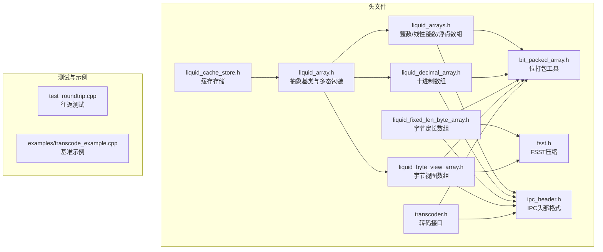
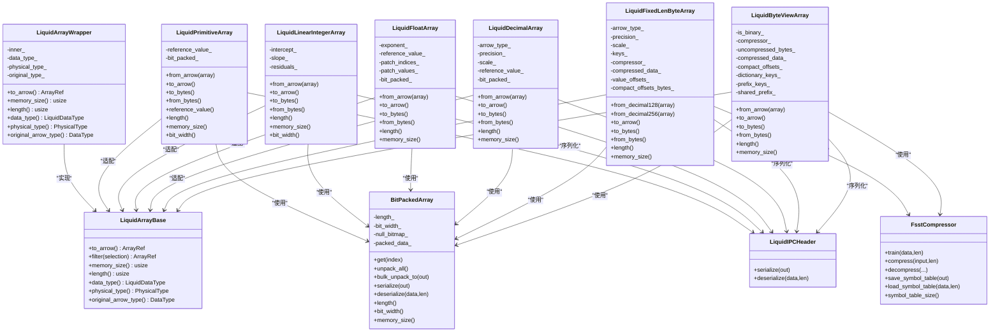
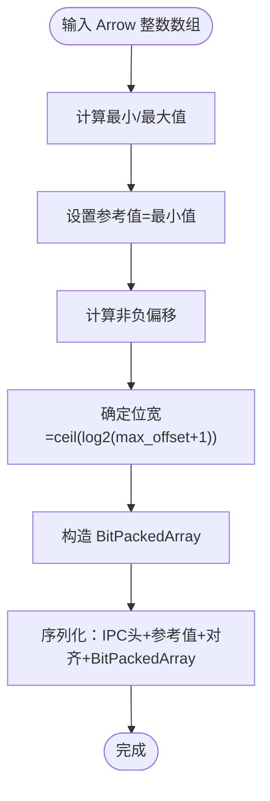
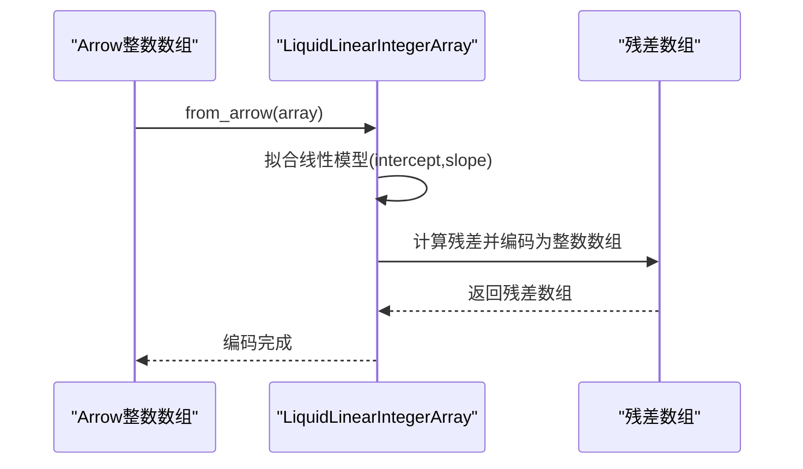
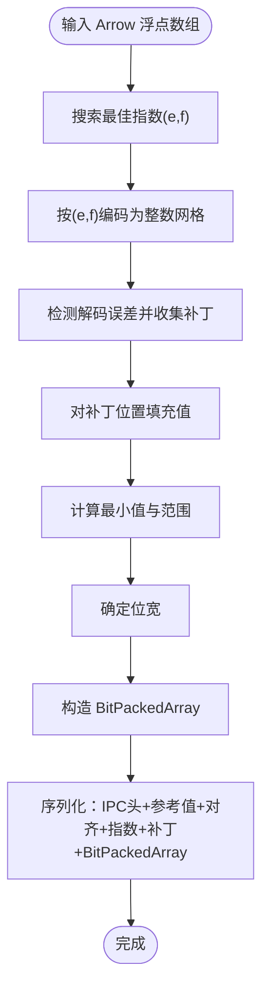
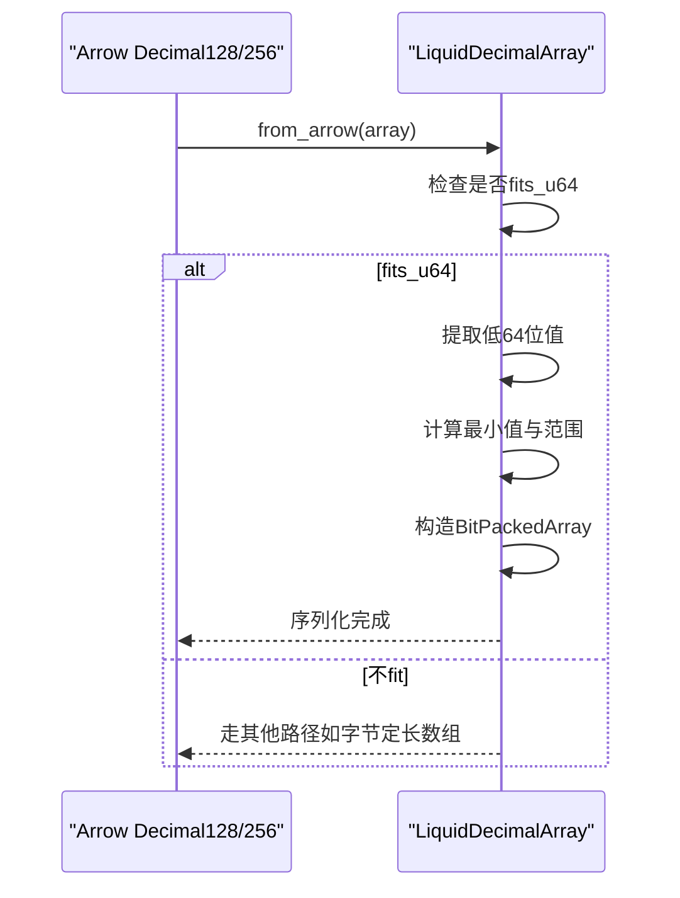
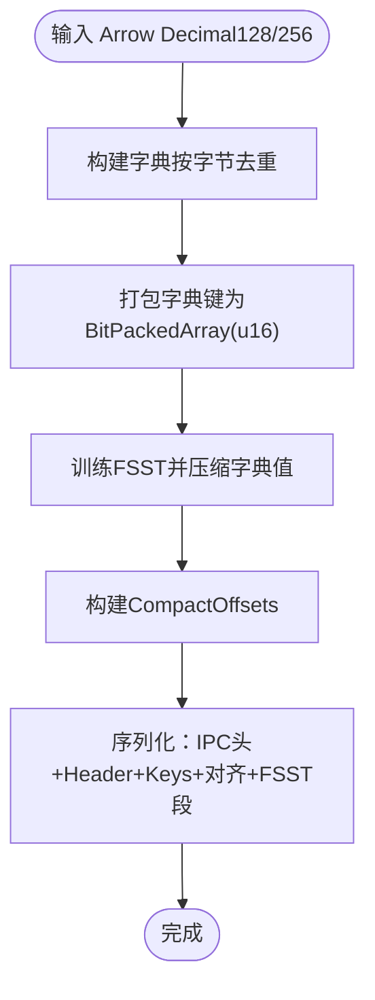
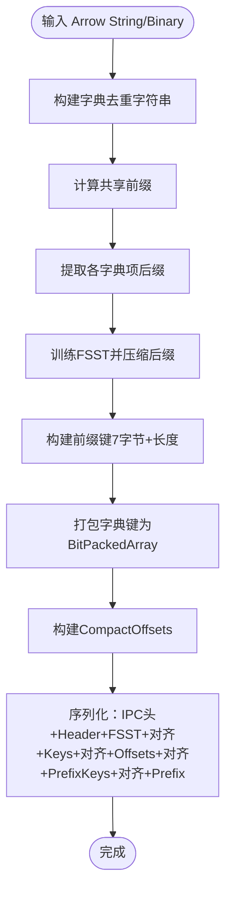
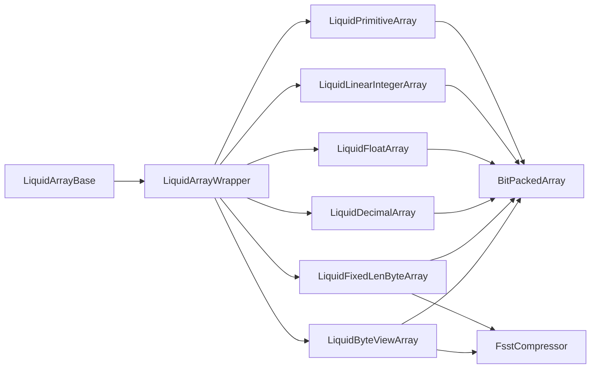

# 数组类型体系

<cite>
**本文档引用的文件**
- [liquid_arrays.h](file://include/liquid_cache/liquid_arrays.h)
- [liquid_array.h](file://include/liquid_cache/liquid_array.h)
- [bit_packed_array.h](file://include/liquid_cache/bit_packed_array.h)
- [liquid_decimal_array.h](file://include/liquid_cache/liquid_decimal_array.h)
- [liquid_fixed_len_byte_array.h](file://include/liquid_cache/liquid_fixed_len_byte_array.h)
- [liquid_byte_view_array.h](file://include/liquid_cache/liquid_byte_view_array.h)
- [ipc_header.h](file://include/liquid_cache/ipc_header.h)
- [fsst.h](file://include/liquid_cache/fsst.h)
- [transcoder.h](file://include/liquid_cache/transcoder.h)
- [liquid_cache_store.h](file://include/liquid_cache/liquid_cache_store.h)
- [test_roundtrip.cpp](file://tests/test_roundtrip.cpp)
- [README.md](file://README.md)
</cite>

## 目录
1. [简介](#简介)
2. [项目结构](#项目结构)
3. [核心组件](#核心组件)
4. [架构总览](#架构总览)
5. [详细组件分析](#详细组件分析)
6. [依赖关系分析](#依赖关系分析)
7. [性能考虑](#性能考虑)
8. [故障排查指南](#故障排查指南)
9. [结论](#结论)
10. [附录](#附录)

## 简介
本文件系统性梳理 liquid-cache-cpp 的数组类型体系，覆盖整数数组、浮点数组、字符串/二进制数组、日期时间数组、十进制数组以及字节定长数组等。内容包括：
- 各数组类型的编码格式、内存布局、访问模式与性能特征
- 类型间继承关系与接口实现差异
- 创建方法、使用示例与适用场景
- 注册机制与动态分发原理（基于 IPC 头部逻辑类型标识）

## 项目结构
仓库采用按功能域划分的头文件组织方式，核心数组类型集中在 include/liquid_cache 下，配合单元测试与示例程序验证正确性与性能。

**图表来源**
- [liquid_array.h:29-85](file://include/liquid_cache/liquid_array.h#L29-L85)
- [liquid_arrays.h:81-248](file://include/liquid_cache/liquid_arrays.h#L81-L248)
- [bit_packed_array.h:39-483](file://include/liquid_cache/bit_packed_array.h#L39-L483)
- [liquid_decimal_array.h:69-401](file://include/liquid_cache/liquid_decimal_array.h#L69-L401)
- [liquid_fixed_len_byte_array.h:111-531](file://include/liquid_cache/liquid_fixed_len_byte_array.h#L111-L531)
- [liquid_byte_view_array.h:204-670](file://include/liquid_cache/liquid_byte_view_array.h#L204-L670)
- [ipc_header.h:16-44](file://include/liquid_cache/ipc_header.h#L16-L44)
- [fsst.h:29-270](file://include/liquid_cache/fsst.h#L29-L270)
- [transcoder.h:23-360](file://include/liquid_cache/transcoder.h#L23-L360)
- [liquid_cache_store.h:188-527](file://include/liquid_cache/liquid_cache_store.h#L188-L527)

**章节来源**
- [README.md:5-39](file://README.md#L5-L39)

## 核心组件
- 抽象基类与多态包装：提供统一的 to_arrow、filter、memory_size、length、data_type、physical_type、original_arrow_type 等接口，支持类型擦除的多态持有。
- 位打包数组：提供高效的位打包存储与批量解包，支持多种 bit_width 的 SIMD 加速路径。
- 具体数组类型：
  - 整数数组（FoR + BitPacking）
  - 线性整数数组（线性模型 + 残差）
  - 浮点数组（ALP + BitPacking）
  - 十进制数组（Decimal128/256，u64 路径或 FSST 字典路径）
  - 字节视图数组（字符串/二进制，字典 + FSST）
  - 字节定长数组（Decimal128/256，大值路径）

**章节来源**
- [liquid_array.h:29-85](file://include/liquid_cache/liquid_array.h#L29-L85)
- [bit_packed_array.h:39-483](file://include/liquid_cache/bit_packed_array.h#L39-L483)
- [liquid_arrays.h:81-573](file://include/liquid_cache/liquid_arrays.h#L81-L573)
- [liquid_decimal_array.h:69-401](file://include/liquid_cache/liquid_decimal_array.h#L69-L401)
- [liquid_fixed_len_byte_array.h:111-531](file://include/liquid_cache/liquid_fixed_len_byte_array.h#L111-L531)
- [liquid_byte_view_array.h:204-670](file://include/liquid_cache/liquid_byte_view_array.h#L204-L670)

## 架构总览
数组类型体系以 IPC 头部的逻辑类型标识为入口，结合物理类型映射与具体数组类实现，形成“抽象接口 + 具体编码”的层次化设计。类型擦除包装器使缓存存储可以统一管理不同数组类型。

**图表来源**
- [liquid_array.h:29-85](file://include/liquid_cache/liquid_array.h#L29-L85)
- [liquid_arrays.h:81-573](file://include/liquid_cache/liquid_arrays.h#L81-L573)
- [bit_packed_array.h:39-483](file://include/liquid_cache/bit_packed_array.h#L39-L483)
- [liquid_decimal_array.h:69-401](file://include/liquid_cache/liquid_decimal_array.h#L69-L401)
- [liquid_fixed_len_byte_array.h:111-531](file://include/liquid_cache/liquid_fixed_len_byte_array.h#L111-L531)
- [liquid_byte_view_array.h:204-670](file://include/liquid_cache/liquid_byte_view_array.h#L204-L670)
- [ipc_header.h:55-106](file://include/liquid_cache/ipc_header.h#L55-L106)
- [fsst.h:29-270](file://include/liquid_cache/fsst.h#L29-L270)

## 详细组件分析

### 整数数组（LiquidPrimitiveArray）
- 编码策略：Frame-of-Reference（FoR）+ BitPacking
  - 计算最小值作为参考值，将每个值减去最小值得到非负偏移，再按最大偏移所需的位宽进行位打包。
- 内存布局：
  - IPC 头部（16B）
  - 参考值（NativeT 大小）
  - 8 字节对齐填充
  - BitPackedArray（包含长度、bit_width、是否含空值、空值位图、打包数据）
- 访问模式：支持批量解包（bulk_unpack_to）以避免逐元素访问开销。
- 性能特征：常数偏移序列（如递增序列）可获得极高压缩比（bit_width 接近 0）。

**图表来源**
- [liquid_arrays.h:111-165](file://include/liquid_cache/liquid_arrays.h#L111-L165)
- [bit_packed_array.h:39-195](file://include/liquid_cache/bit_packed_array.h#L39-L195)

**章节来源**
- [liquid_arrays.h:81-248](file://include/liquid_cache/liquid_arrays.h#L81-L248)
- [bit_packed_array.h:39-233](file://include/liquid_cache/bit_packed_array.h#L39-L233)

### 线性整数数组（LiquidLinearIntegerArray）
- 编码策略：线性回归模型 y = intercept + slope * i + 残差，残差部分用整数数组编码。
- 内存布局：IPC 头部 + intercept（f64）+ slope（f64）+ 对齐 + 残差（LiquidPrimitiveArray<Int64>）。
- 适用场景：单调或近似线性的整数序列（如时间序列索引）。

**图表来源**
- [liquid_arrays.h:358-474](file://include/liquid_cache/liquid_arrays.h#L358-L474)

**章节来源**
- [liquid_arrays.h:342-573](file://include/liquid_cache/liquid_arrays.h#L342-L573)

### 浮点数组（LiquidFloatArray）
- 编码策略：ALP（自适应无损浮点）+ BitPacking
  - 通过搜索最佳指数对 (e,f) 将浮点值映射到整数网格，若存在解码误差则记录补丁（patch），并对补丁位置使用填充值以提升压缩效果。
- 内存布局：IPC 头部 + 参考值（有符号整数）+ 对齐 + 指数 e/f + 补丁数量 + 补丁索引列表 + 补丁值列表 + 对齐 + BitPackedArray。
- 性能特征：对于具有固定小数位或可被 10^e·10^(-f) 映射到整数的浮点序列，可获得良好压缩比。

**图表来源**
- [liquid_arrays.h:679-800](file://include/liquid_cache/liquid_arrays.h#L679-L800)
- [bit_packed_array.h:39-195](file://include/liquid_cache/bit_packed_array.h#L39-L195)

**章节来源**
- [liquid_arrays.h:577-800](file://include/liquid_cache/liquid_arrays.h#L577-L800)
- [transcoder.h:158-342](file://include/liquid_cache/transcoder.h#L158-L342)

### 十进制数组（LiquidDecimalArray）
- 适用范围：Decimal128/256，且所有非空值可放入 u64。
- 编码策略：FoR + BitPacking，直接将低 64 位作为 u64 存储，再按范围压缩。
- 内存布局：IPC 头部（逻辑类型=Decimal）+ DecimalArrayHeader（箭头类型、精度、刻度等）+ 参考值（u64）+ 对齐 + BitPackedArray。
- 适用场景：精度较低、数值范围适合 u64 的十进制数据。

**图表来源**
- [liquid_decimal_array.h:107-172](file://include/liquid_cache/liquid_decimal_array.h#L107-L172)
- [liquid_decimal_array.h:307-339](file://include/liquid_cache/liquid_decimal_array.h#L307-L339)

**章节来源**
- [liquid_decimal_array.h:69-401](file://include/liquid_cache/liquid_decimal_array.h#L69-L401)

### 字节定长数组（LiquidFixedLenByteArray）
- 适用范围：Decimal128/256，且值超出 u64 范围。
- 编码策略：字典去重（按原始字节表示）→ UInt16 索引（BitPackedArray）+ FSST 压缩字典值。
- 内存布局：IPC 头部（逻辑类型=FixedLenByteArray）+ FixedLenByteArrayHeader（键大小、值大小、箭头类型、精度、刻度等）+ BitPackedArray（键）+ 对齐 + FSST 值段（符号表 + 原始字节数 + 压缩大小 + 压缩数据 + CompactOffsets）。
- 适用场景：高基数、重复值较多的十进制大值数据。

**图表来源**
- [liquid_fixed_len_byte_array.h:332-434](file://include/liquid_cache/liquid_fixed_len_byte_array.h#L332-L434)
- [fsst.h:29-270](file://include/liquid_cache/fsst.h#L29-L270)

**章节来源**
- [liquid_fixed_len_byte_array.h:111-531](file://include/liquid_cache/liquid_fixed_len_byte_array.h#L111-L531)
- [fsst.h:29-270](file://include/liquid_cache/fsst.h#L29-L270)

### 字节视图数组（LiquidByteViewArray）
- 适用范围：字符串/二进制（含大字符串/二进制）。
- 编码策略：字典去重（字符串）→ 前缀共享 + FSST 压缩后缀 + 8 字节前缀键（7 字节后缀首字节 + 1 字节长度）+ BitPackedArray 索引 + CompactOffsets。
- 内存布局：IPC 头部（逻辑类型=ByteViewArray，物理类型随字符串/二进制变化）+ ByteViewArrayHeader + FSST 段 + 对齐 + BitPackedArray（键）+ 对齐 + CompactOffsets + 对齐 + 前缀键 + 对齐 + 共享前缀。
- 适用场景：高基数字符串/二进制，尤其是存在公共前缀的数据集。

**图表来源**
- [liquid_byte_view_array.h:209-353](file://include/liquid_cache/liquid_byte_view_array.h#L209-L353)
- [liquid_byte_view_array.h:413-578](file://include/liquid_cache/liquid_byte_view_array.h#L413-L578)

**章节来源**
- [liquid_byte_view_array.h:204-670](file://include/liquid_cache/liquid_byte_view_array.h#L204-L670)
- [fsst.h:29-270](file://include/liquid_cache/fsst.h#L29-L270)

### 位打包数组（BitPackedArray）
- 存储模型：每个元素占用固定 bit_width 位，按块（FastLanes convention）组织，支持 8 字节对齐。
- 批量解包：提供 AVX2/SIMD 加速的批量解包（bw=1,2,4,8,16,32），以及标量回退路径。
- 空值处理：可选空值位图，支持 null_count 统计与 Arrow Buffer 转换。

**章节来源**
- [bit_packed_array.h:39-483](file://include/liquid_cache/bit_packed_array.h#L39-L483)

### IPC 头部与类型映射
- IPC 头部：16 字节，包含魔数、版本、逻辑类型、物理类型等。
- 逻辑类型枚举：Integer、Float、FixedLenByteArray、ByteViewArray、LinearInteger、Decimal。
- 物理类型枚举：Int8/16/32/64、UInt8/16/32/64、Float32/64、Date32/64、Timestamp 各单位等。

**章节来源**
- [ipc_header.h:16-118](file://include/liquid_cache/ipc_header.h#L16-L118)

## 依赖关系分析
- 组件耦合：
  - 所有具体数组类型均依赖 BitPackedArray 进行位打包存储。
  - 字节视图与字节定长数组依赖 FSST 压缩器进行字节序列压缩。
  - 抽象基类与多态包装器提供统一接口，便于缓存存储统一管理。
- 外部依赖：
  - Arrow 用于数组构建、计算与类型系统。
  - 可选 Velox 集成（通过宏开关）。

**图表来源**
- [liquid_array.h:29-85](file://include/liquid_cache/liquid_array.h#L29-L85)
- [liquid_arrays.h:81-573](file://include/liquid_cache/liquid_arrays.h#L81-L573)
- [bit_packed_array.h:39-483](file://include/liquid_cache/bit_packed_array.h#L39-L483)
- [liquid_fixed_len_byte_array.h:111-531](file://include/liquid_cache/liquid_fixed_len_byte_array.h#L111-L531)
- [liquid_byte_view_array.h:204-670](file://include/liquid_cache/liquid_byte_view_array.h#L204-L670)
- [fsst.h:29-270](file://include/liquid_cache/fsst.h#L29-L270)

**章节来源**
- [liquid_cache_store.h:188-527](file://include/liquid_cache/liquid_cache_store.h#L188-L527)

## 性能考虑
- 批量解包：优先使用 bulk_unpack_to，避免逐元素访问带来的开销。
- SIMD 加速：在常见 bit_width（1,2,4,8,16,32）下利用 AVX2 加速解包。
- 压缩策略选择：
  - 整数/日期：FoR + BitPacking，范围小则压缩比高。
  - 浮点：ALP 搜索最佳指数对，尽量减少补丁数量。
  - 字符串/二进制：字典 + FSST，共享前缀 + 后缀压缩。
  - 十进制：u64 路径优先；超范围走字节定长 + FSST。
- 内存对齐：序列化时严格遵循 8 字节对齐，减少解码时的边界检查成本。

## 故障排查指南
- round-trip 校验失败：
  - 检查空值位图与类型一致性（测试用例覆盖了空值、全空、常量值等边界）。
  - 确认序列化/反序列化路径一致（to_bytes/from_bytes）。
- 压缩比异常：
  - 对于整数数组，确认 bit_width 是否接近 0（常量或近似常量）。
  - 对于字符串/二进制，确认是否存在足够重复与共享前缀。
- 性能异常：
  - 确认是否启用了 AVX2 加速路径（编译器支持）。
  - 检查是否有大量补丁导致浮点数组解码开销增加。

**章节来源**
- [test_roundtrip.cpp:32-54](file://tests/test_roundtrip.cpp#L32-L54)
- [test_roundtrip.cpp:438-490](file://tests/test_roundtrip.cpp#L438-L490)

## 结论
本数组类型体系通过统一的抽象接口与多样化的编码策略，实现了对整数、浮点、字符串/二进制、日期时间、十进制等多种数据类型的高效压缩与快速解码。FoR/BitPacking、ALP、字典+FSST 等技术组合，使得在不同数据分布下均能获得良好的压缩比与解码性能。类型擦除包装器与 IPC 头部机制为动态分发与跨组件协作提供了坚实基础。

## 附录

### 创建与使用示例（路径指引）
- 整数数组往返测试：[test_roundtrip.cpp:60-97](file://tests/test_roundtrip.cpp#L60-L97)
- 浮点数组往返测试：[test_roundtrip.cpp:144-184](file://tests/test_roundtrip.cpp#L144-L184)
- 字符串/二进制往返测试：[test_roundtrip.cpp:190-227](file://tests/test_roundtrip.cpp#L190-L227)
- 十进制往返测试（u64 路径）：[test_roundtrip.cpp:233-265](file://tests/test_roundtrip.cpp#L233-L265)
- 十进制往返测试（FSST 路径）：[test_roundtrip.cpp:271-305](file://tests/test_roundtrip.cpp#L271-L305)
- 转码流水线往返测试：[test_roundtrip.cpp:330-397](file://tests/test_roundtrip.cpp#L330-L397)
- 示例程序（基准与验证）：[examples/transcode_example.cpp:247-332](file://examples/transcode_example.cpp#L247-L332)

### 注册机制与动态分发
- 逻辑类型标识：IPC 头部包含逻辑类型与物理类型，用于在序列化/反序列化阶段识别具体数组类型。
- 多态包装：通过 LiquidArrayWrapper 将具体数组类型包装为统一接口，便于缓存存储与上层调用方使用。
- 类型映射：Arrow 类型到物理类型的映射由工具函数提供，确保序列化时物理类型正确。

**章节来源**
- [ipc_header.h:16-118](file://include/liquid_cache/ipc_header.h#L16-L118)
- [liquid_array.h:29-85](file://include/liquid_cache/liquid_array.h#L29-L85)
- [transcoder.h:39-58](file://include/liquid_cache/transcoder.h#L39-L58)