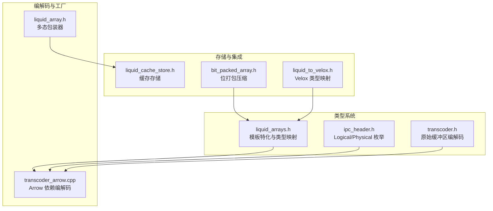
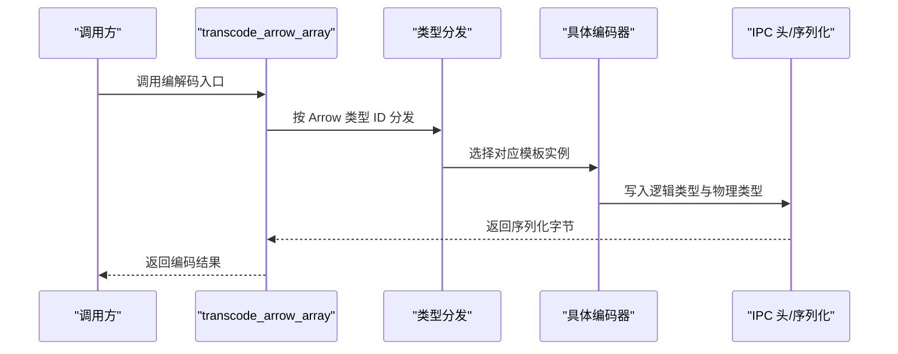
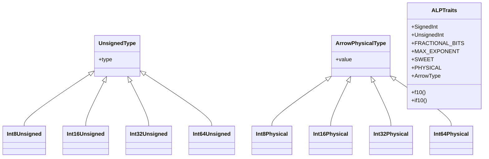
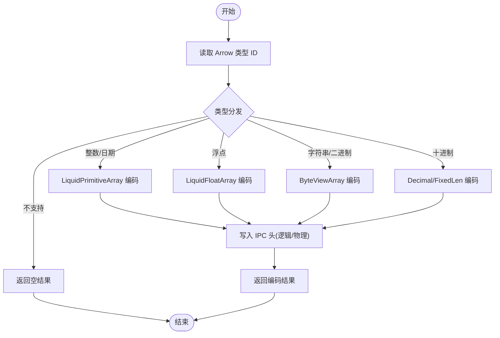
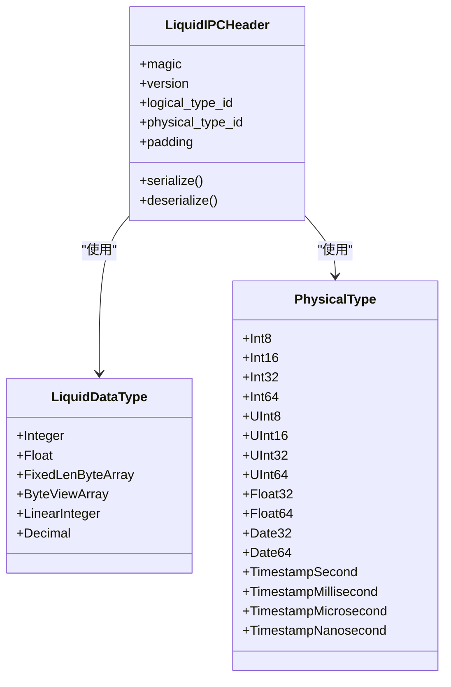
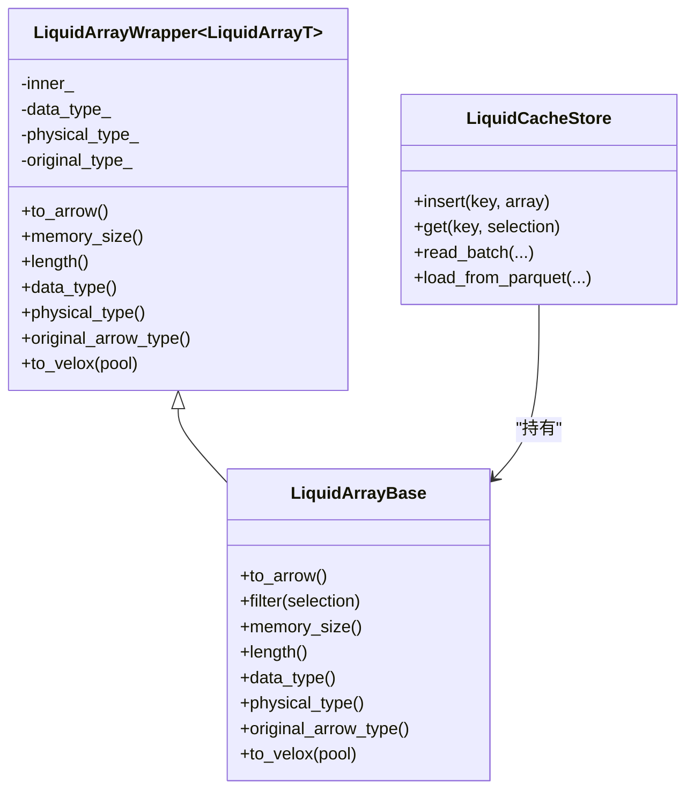
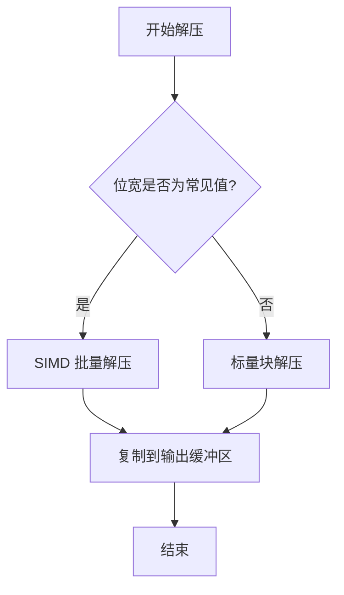
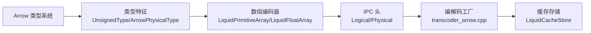

# 数组类型注册机制

<cite>
**本文档引用的文件**
- [liquid_arrays.h](file://include/liquid_cache/liquid_arrays.h)
- [transcoder.h](file://include/liquid_cache/transcoder.h)
- [transcoder_arrow.cpp](file://src/transcoder_arrow.cpp)
- [ipc_header.h](file://include/liquid_cache/ipc_header.h)
- [liquid_array.h](file://include/liquid_cache/liquid_array.h)
- [liquid_cache_store.h](file://include/liquid_cache/liquid_cache_store.h)
- [bit_packed_array.h](file://include/liquid_cache/bit_packed_array.h)
- [liquid_to_velox.h](file://include/liquid_cache/liquid_to_velox.h)
- [transcode_example.cpp](file://examples/transcode_example.cpp)
- [test_velox_crossval.cpp](file://tests/test_velox_crossval.cpp)
</cite>

## 目录
1. [简介](#简介)
2. [项目结构](#项目结构)
3. [核心组件](#核心组件)
4. [架构总览](#架构总览)
5. [详细组件分析](#详细组件分析)
6. [依赖关系分析](#依赖关系分析)
7. [性能考虑](#性能考虑)
8. [故障排除指南](#故障排除指南)
9. [结论](#结论)
10. [附录](#附录)

## 简介
本文件深入解析 LiquidCache 的数组类型注册机制，重点阐述其如何通过模板特化与类型映射实现数组类型的动态分发，以及 Arrow 类型到物理类型的映射关系。文档还详细说明了类型特征系统（Type Traits）的设计、工厂模式的实现方式、自定义数组类型的扩展指南，并提供了完整的类型映射表与使用示例路径。

## 项目结构
该项目采用模块化的头文件设计，核心功能集中在以下头文件中：
- 类型系统与数组编码：`liquid_arrays.h`
- 编解码入口与工厂：`transcoder.h`、`transcoder_arrow.cpp`
- IPC 头与类型枚举：`ipc_header.h`
- 多态包装与抽象接口：`liquid_array.h`
- 缓存存储与批量加载：`liquid_cache_store.h`
- 压缩存储与解压：`bit_packed_array.h`
- Velox 集成：`liquid_to_velox.h`
- 示例与测试：`transcode_example.cpp`、`test_velox_crossval.cpp`

**图表来源**
- [liquid_arrays.h:1-1233](file://include/liquid_cache/liquid_arrays.h#L1-L1233)
- [transcoder_arrow.cpp:1-746](file://src/transcoder_arrow.cpp#L1-L746)
- [ipc_header.h:1-118](file://include/liquid_cache/ipc_header.h#L1-L118)
- [liquid_array.h:1-159](file://include/liquid_cache/liquid_array.h#L1-L159)
- [liquid_cache_store.h:1-527](file://include/liquid_cache/liquid_cache_store.h#L1-L527)
- [bit_packed_array.h:1-486](file://include/liquid_cache/bit_packed_array.h#L1-L486)
- [liquid_to_velox.h:1-138](file://include/liquid_cache/liquid_to_velox.h#L1-L138)

**章节来源**
- [liquid_arrays.h:1-1233](file://include/liquid_cache/liquid_arrays.h#L1-L1233)
- [transcoder_arrow.cpp:1-746](file://src/transcoder_arrow.cpp#L1-L746)

## 核心组件
- 模板特化与类型映射：通过 `UnsignedType` 和 `ArrowPhysicalType` 模板特化，为 Arrow 类型建立到物理类型的映射。
- 工厂模式：`transcode_arrow_array`、`transcode_to_liquid_array` 提供统一的编解码入口，按 Arrow 类型 ID 进行动态分发。
- 多态包装：`LiquidArrayBase` 抽象基类与 `LiquidArrayWrapper` 类型擦除包装器，支持异构数组的统一管理。
- IPC 头与类型枚举：`LiquidIPCHeader`、`LiquidDataType`、`PhysicalType` 统一序列化格式与类型标识。
- 压缩存储：`BitPackedArray` 提供高效的位打包存储与批量解压。

**章节来源**
- [liquid_arrays.h:48-77](file://include/liquid_cache/liquid_arrays.h#L48-L77)
- [transcoder_arrow.cpp:44-351](file://src/transcoder_arrow.cpp#L44-L351)
- [liquid_array.h:29-85](file://include/liquid_cache/liquid_array.h#L29-L85)
- [ipc_header.h:16-44](file://include/liquid_cache/ipc_header.h#L16-L44)
- [bit_packed_array.h:39-233](file://include/liquid_cache/bit_packed_array.h#L39-L233)

## 架构总览
LiquidCache 的数组类型注册机制以“模板特化 + 类型映射 + 工厂模式”为核心，形成如下架构：
- 类型特征层：通过模板特化定义 Arrow 类型到物理类型、无符号类型等映射。
- 编解码层：根据 Arrow 类型 ID 动态分发到对应的编码器或解码器。
- 存储层：统一的 IPC 头与类型枚举确保跨语言兼容性。
- 多态层：抽象基类与包装器支持异构数组的统一管理与零拷贝转换。

**图表来源**
- [transcoder_arrow.cpp:44-351](file://src/transcoder_arrow.cpp#L44-L351)
- [ipc_header.h:46-106](file://include/liquid_cache/ipc_header.h#L46-L106)

## 详细组件分析

### 类型特征系统（Type Traits）
- 无符号类型映射：`UnsignedType<ArrowType>::type` 将有符号与无符号整数、日期与时间戳映射到对应的无符号类型，用于位打包偏移计算。
- 物理类型映射：`ArrowPhysicalType<ArrowType>::value` 将 Arrow 类型映射到 `PhysicalType`，用于 IPC 头中的物理类型标识。
- 浮点类型特性：`ALPTraits<FloatT>` 定义浮点类型相关的有符号整数、无符号整数、指数表与位宽常量。

**图表来源**
- [liquid_arrays.h:48-77](file://include/liquid_cache/liquid_arrays.h#L48-L77)
- [liquid_arrays.h:657-683](file://include/liquid_cache/liquid_arrays.h#L657-L683)

**章节来源**
- [liquid_arrays.h:48-77](file://include/liquid_cache/liquid_arrays.h#L48-L77)
- [liquid_arrays.h:657-683](file://include/liquid_cache/liquid_arrays.h#L657-L683)

### 工厂模式与动态分发
- 编码工厂：`transcode_arrow_array` 根据 `array->type_id()` 在编译期模板实例与运行期类型 ID 之间建立动态分发，返回 `LiquidEncodedArray`。
- 解码工厂：`decode_liquid_array` 读取 IPC 头中的逻辑类型与物理类型，再按物理类型进行二次分发，构建对应的解码器。
- 多态工厂：`transcode_to_liquid_array` 返回 `LiquidArrayRef`，内部通过 `make_liquid_array` 与 `LiquidArrayWrapper` 实现类型擦除与多态管理。

**图表来源**
- [transcoder_arrow.cpp:44-351](file://src/transcoder_arrow.cpp#L44-L351)
- [transcoder_arrow.cpp:378-477](file://src/transcoder_arrow.cpp#L378-L477)

**章节来源**
- [transcoder_arrow.cpp:44-351](file://src/transcoder_arrow.cpp#L44-L351)
- [transcoder_arrow.cpp:378-477](file://src/transcoder_arrow.cpp#L378-L477)

### IPC 头与类型枚举
- 逻辑类型：`LiquidDataType` 定义 Integer、Float、FixedLenByteArray、ByteViewArray、LinearInteger、Decimal 等。
- 物理类型：`PhysicalType` 定义 Int8/16/32/64、UInt8/16/32/64、Float32/64、Date32/64、TimestampSecond/Millisecond/Microsecond/Nanosecond。
- IPC 头：固定 16 字节布局，包含魔数、版本、逻辑类型 ID、物理类型 ID 与填充字段。

**图表来源**
- [ipc_header.h:16-106](file://include/liquid_cache/ipc_header.h#L16-L106)

**章节来源**
- [ipc_header.h:16-106](file://include/liquid_cache/ipc_header.h#L16-L106)

### 多态包装与缓存存储
- 抽象基类：`LiquidArrayBase` 提供统一的多态接口，包括 `to_arrow()`、`filter()`、`memory_size()`、`length()`、`data_type()`、`physical_type()`、`original_arrow_type()`。
- 包装器：`LiquidArrayWrapper<LiquidArrayT>` 将具体数组类型适配为多态接口，支持原 Arrow 类型的重新解释。
- 缓存存储：`LiquidCacheStore` 以列式存储方式管理 `LiquidArrayRef`，支持投影、过滤与内存预算控制。

**图表来源**
- [liquid_array.h:29-146](file://include/liquid_cache/liquid_array.h#L29-L146)
- [liquid_cache_store.h:188-524](file://include/liquid_cache/liquid_cache_store.h#L188-L524)

**章节来源**
- [liquid_array.h:29-146](file://include/liquid_cache/liquid_array.h#L29-L146)
- [liquid_cache_store.h:188-524](file://include/liquid_cache/liquid_cache_store.h#L188-L524)

### 压缩存储与批量解压
- 位打包数组：`BitPackedArray` 提供可变宽度的位打包存储，支持批量解压与空值位图。
- 批量解压：针对常见位宽（1、2、4、8、16、32）提供 SIMD 加速的批量解压实现，提升解码性能。

**图表来源**
- [bit_packed_array.h:244-444](file://include/liquid_cache/bit_packed_array.h#L244-L444)

**章节来源**
- [bit_packed_array.h:244-444](file://include/liquid_cache/bit_packed_array.h#L244-L444)

### Velox 集成与类型映射
- 类型映射：`liquid_physical_to_velox_type` 与 `liquid_physical_to_velox_kind` 将物理类型映射到 Velox 类型与类型种类。
- 时间戳转换：`int64_to_velox_timestamp` 根据物理类型将 int64 值转换为 Velox Timestamp。

**章节来源**
- [liquid_to_velox.h:69-133](file://include/liquid_cache/liquid_to_velox.h#L69-L133)

## 依赖关系分析
- 模板特化依赖：`liquid_arrays.h` 中的 `UnsignedType` 与 `ArrowPhysicalType` 依赖 Arrow 类型系统。
- 编解码依赖：`transcoder_arrow.cpp` 依赖 Arrow API 进行类型判断与数组访问。
- IPC 兼容：`ipc_header.h` 的 16 字节布局确保与 Rust 实现的二进制兼容。
- 多态依赖：`liquid_array.h` 的包装器依赖具体数组类型的实现。

**图表来源**
- [liquid_arrays.h:48-77](file://include/liquid_cache/liquid_arrays.h#L48-L77)
- [transcoder_arrow.cpp:44-351](file://src/transcoder_arrow.cpp#L44-L351)
- [ipc_header.h:46-106](file://include/liquid_cache/ipc_header.h#L46-L106)
- [liquid_cache_store.h:188-524](file://include/liquid_cache/liquid_cache_store.h#L188-L524)

**章节来源**
- [liquid_arrays.h:48-77](file://include/liquid_cache/liquid_arrays.h#L48-L77)
- [transcoder_arrow.cpp:44-351](file://src/transcoder_arrow.cpp#L44-L351)
- [ipc_header.h:46-106](file://include/liquid_cache/ipc_header.h#L46-L106)
- [liquid_cache_store.h:188-524](file://include/liquid_cache/liquid_cache_store.h#L188-L524)

## 性能考虑
- 批量解压优化：`BitPackedArray` 对常见位宽提供 SIMD 加速，显著降低解码开销。
- 内存预算控制：`LiquidCacheStore` 使用内存预算与 LRU 策略，避免缓存膨胀。
- 零拷贝转换：多态包装器支持原类型重新解释，减少不必要的数据复制。
- 浮点编码：ALP（自适应无损浮点）编码在保证精度的同时最小化存储空间。

[本节为通用性能讨论，无需特定文件分析]

## 故障排除指南
- 类型不支持：当 Arrow 类型不在支持列表时，工厂函数会返回空结果。可通过日志或断言定位问题。
- IPC 版本不匹配：`LiquidIPCHeader::deserialize` 会校验魔数与版本，不匹配时抛出异常。
- 内存不足：`LiquidCacheStore` 插入失败时检查预算与 LRU 淘汰策略是否生效。
- Velox 类型映射错误：确认物理类型与 Velox 类型映射一致，特别是时间戳单位。

**章节来源**
- [transcoder_arrow.cpp:344-351](file://src/transcoder_arrow.cpp#L344-L351)
- [ipc_header.h:86-105](file://include/liquid_cache/ipc_header.h#L86-L105)
- [liquid_cache_store.h:491-517](file://include/liquid_cache/liquid_cache_store.h#L491-L517)

## 结论
LiquidCache 的数组类型注册机制通过模板特化与类型映射实现了对 Arrow 类型的全面覆盖，结合工厂模式与多态包装，提供了高效、可扩展且跨语言兼容的数组编码方案。该机制在保持高性能的同时，为自定义数组类型的扩展预留了清晰的接口与最佳实践路径。

[本节为总结性内容，无需特定文件分析]

## 附录

### Arrow 类型到物理类型的映射表
- 整数类型
  - Int8 → Int8
  - Int16 → Int16
  - Int32 → Int32
  - Int64 → Int64
  - UInt8 → UInt8
  - UInt16 → UInt16
  - UInt32 → UInt32
  - UInt64 → UInt64
- 日期与时间戳
  - Date32 → Date32
  - Date64 → Date64
  - Timestamp → 对应时间戳物理类型（秒/毫秒/微秒/纳秒）
- 浮点类型
  - Float32 → Float32
  - Float64 → Float64

**章节来源**
- [liquid_arrays.h:68-77](file://include/liquid_cache/liquid_arrays.h#L68-L77)
- [transcoder_arrow.cpp:152-192](file://src/transcoder_arrow.cpp#L152-L192)

### 自定义数组类型的扩展指南
- 步骤
  1. 定义模板特化：为新 Arrow 类型提供 `UnsignedType` 与 `ArrowPhysicalType` 的特化。
  2. 实现编码器：创建新的数组类，实现 `from_arrow`、`to_arrow`、`to_bytes`、`from_bytes` 方法。
  3. 注册工厂：在 `transcode_arrow_array` 与 `transcode_to_liquid_array` 中添加类型分支。
  4. 更新 IPC：确保逻辑类型与物理类型在 IPC 头中正确设置。
  5. 单元测试：编写测试用例验证 round-trip 正确性与性能表现。
- 最佳实践
  - 保持与现有编码器相同的序列化布局与对齐规则。
  - 提供批量解压与空值处理的完整实现。
  - 在多态包装器中正确设置 `original_arrow_type` 以支持类型重新解释。

**章节来源**
- [liquid_arrays.h:48-77](file://include/liquid_cache/liquid_arrays.h#L48-L77)
- [transcoder_arrow.cpp:44-351](file://src/transcoder_arrow.cpp#L44-L351)
- [liquid_array.h:91-156](file://include/liquid_cache/liquid_array.h#L91-L156)

### 使用示例路径
- 基本编解码流程：参考示例程序中的编解码调用与缓存加载。
- Velox 集成：参考交叉验证测试中对不同类型的转换与验证。
- 性能基准：参考示例程序中的基准测试场景与统计输出。

**章节来源**
- [transcode_example.cpp:247-332](file://examples/transcode_example.cpp#L247-L332)
- [transcode_example.cpp:338-489](file://examples/transcode_example.cpp#L338-L489)
- [test_velox_crossval.cpp:40-85](file://tests/test_velox_crossval.cpp#L40-L85)
- [test_velox_crossval.cpp:134-174](file://tests/test_velox_crossval.cpp#L134-L174)