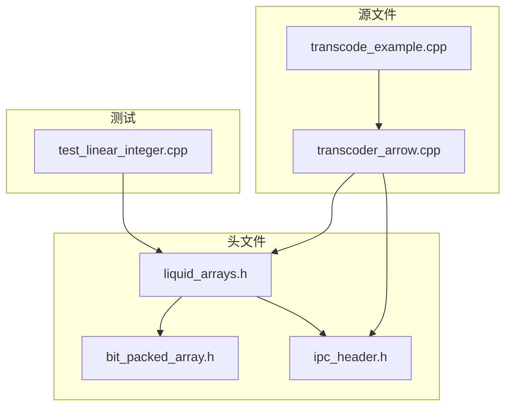
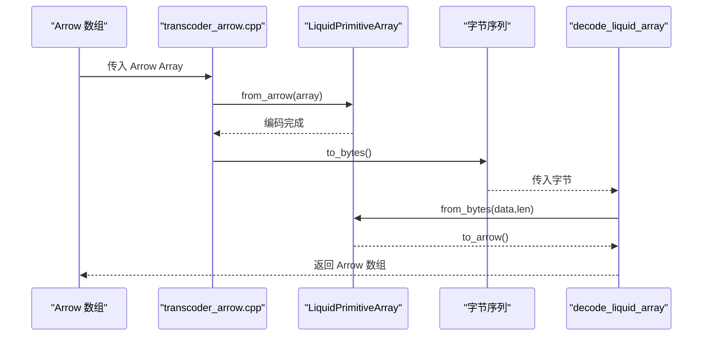
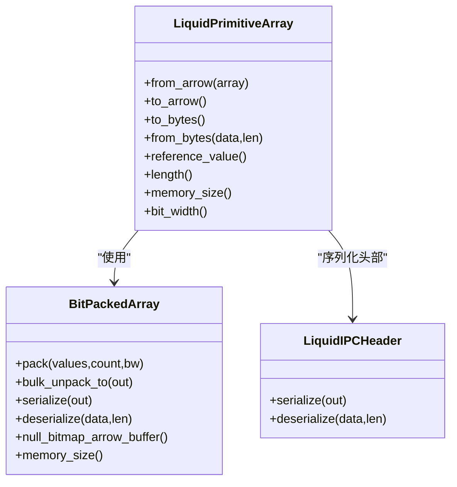
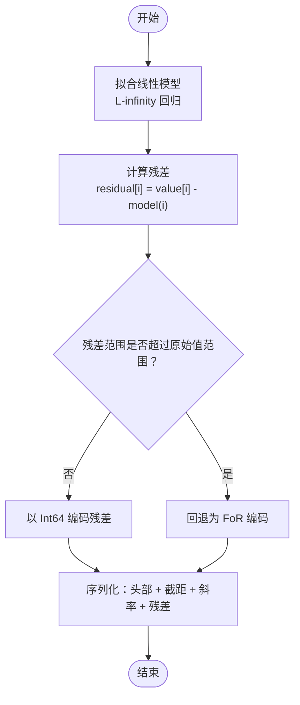
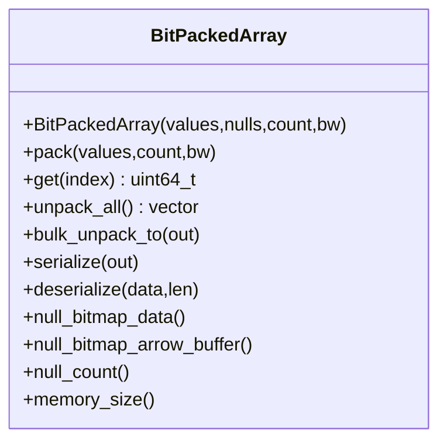
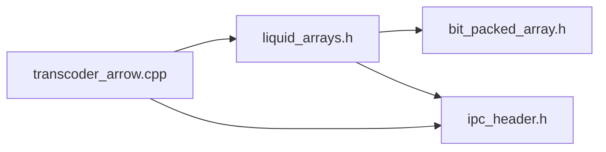

# 整数数组类型

<cite>
**本文档引用的文件**
- [liquid_arrays.h](file://include/liquid_cache/liquid_arrays.h)
- [bit_packed_array.h](file://include/liquid_cache/bit_packed_array.h)
- [ipc_header.h](file://include/liquid_cache/ipc_header.h)
- [test_linear_integer.cpp](file://tests/test_linear_integer.cpp)
- [transcoder_arrow.cpp](file://src/transcoder_arrow.cpp)
- [transcode_example.cpp](file://examples/transcode_example.cpp)
- [README.md](file://README.md)
</cite>

## 目录
1. [简介](#简介)
2. [项目结构](#项目结构)
3. [核心组件](#核心组件)
4. [架构总览](#架构总览)
5. [详细组件分析](#详细组件分析)
6. [依赖关系分析](#依赖关系分析)
7. [性能考量](#性能考量)
8. [故障排查指南](#故障排查指南)
9. [结论](#结论)
10. [附录](#附录)

## 简介
本文件聚焦于整数数组类型的实现与使用，涵盖两种整数数组类型：
- LiquidPrimitiveArray：基于“参考值 + 位打包”的 Frame-of-Reference + BitPacking 编码
- LiquidLinearIntegerArray：线性回归模型 + 残差存储的线性整数数组

文档将深入解释编码算法、内存布局、序列化格式、解码流程、性能特征，并提供从 Arrow 数组创建与解码的使用示例及适用场景与优化建议。

## 项目结构
围绕整数数组类型的关键文件与职责如下：
- include/liquid_cache/liquid_arrays.h：整数数组类型定义、编码/解码、序列化/反序列化、L-infinity 线性回归辅助函数
- include/liquid_cache/bit_packed_array.h：位打包数组的底层实现，提供打包/解包、批量解包、空值位图等
- include/liquid_cache/ipc_header.h：IPC 头部格式定义，用于统一的序列化标识与版本控制
- src/transcoder_arrow.cpp：Arrow 与整数数组类型的桥接，提供从 Arrow 数组到整数数组的编码与解码入口
- tests/test_linear_integer.cpp：线性整数数组的往返测试与序列化测试
- examples/transcode_example.cpp：示例程序，演示如何从 Parquet 读取 Arrow 数据并进行整数数组编码/解码
- README.md：项目总体说明、构建与使用指南

图表来源
- [liquid_arrays.h:1-1221](file://include/liquid_cache/liquid_arrays.h#L1-L1221)
- [bit_packed_array.h:1-486](file://include/liquid_cache/bit_packed_array.h#L1-L486)
- [ipc_header.h:1-118](file://include/liquid_cache/ipc_header.h#L1-L118)
- [transcoder_arrow.cpp:1-746](file://src/transcoder_arrow.cpp#L1-L746)
- [transcode_example.cpp:1-550](file://examples/transcode_example.cpp#L1-L550)
- [test_linear_integer.cpp:1-271](file://tests/test_linear_integer.cpp#L1-L271)

章节来源
- [README.md:1-378](file://README.md#L1-L378)

## 核心组件
- LiquidPrimitiveArray<T>：整数/日期类型采用 Frame-of-Reference + BitPacking 编码，序列化包含 IPC 头、参考值、8 字节对齐后的位打包数据
- LiquidLinearIntegerArray<T>：线性模型 y[i] = intercept + slope*i + residual[i]，残差以 Int64 的 LiquidPrimitiveArray 存储，使用 L-infinity（切比雪夫）回归拟合
- BitPackedArray：位打包数组，支持批量解包、空值位图、内存尺寸统计
- IPC 头部：统一的 16 字节头部，包含魔数、版本、逻辑类型、物理类型等

章节来源
- [liquid_arrays.h:80-576](file://include/liquid_cache/liquid_arrays.h#L80-L576)
- [bit_packed_array.h:22-486](file://include/liquid_cache/bit_packed_array.h#L22-L486)
- [ipc_header.h:16-118](file://include/liquid_cache/ipc_header.h#L16-L118)

## 架构总览
整数数组类型在 Arrow 与序列化之间提供桥接：
- Arrow → 整数数组：通过模板特化与类型映射，调用 from_arrow 完成编码
- 整数数组 → Arrow：通过 to_arrow 完成解码，直接构造 Arrow ArrayData，避免逐元素构建
- 序列化/反序列化：统一的 IPC 头部 + 数据体，支持 8 字节对齐与空值位图

图表来源
- [transcoder_arrow.cpp:44-351](file://src/transcoder_arrow.cpp#L44-L351)
- [liquid_arrays.h:111-238](file://include/liquid_cache/liquid_arrays.h#L111-L238)

章节来源
- [transcoder_arrow.cpp:44-477](file://src/transcoder_arrow.cpp#L44-L477)

## 详细组件分析

### LiquidPrimitiveArray：Frame-of-Reference + BitPacking
- 编码流程
  - 计算最小/最大值作为参考值（FoR）
  - 将每个值减去参考值得到非负偏移，按位宽打包
  - 位宽由偏移范围决定，使用 get_bit_width 计算
  - 支持空值位图，序列化时 8 字节对齐
- 解码流程
  - 从字节流中读取 IPC 头、参考值、位打包数据
  - 批量解包后加上参考值还原原值
  - 直接构造 Arrow ArrayData，避免逐元素构建
- 内存布局
  - IPC 头部（16B）
  - 参考值（NativeT 大小）
  - 8 字节对齐填充
  - BitPackedArray 数据（包含空值位图与打包数据）

图表来源
- [liquid_arrays.h:95-248](file://include/liquid_cache/liquid_arrays.h#L95-L248)
- [bit_packed_array.h:39-486](file://include/liquid_cache/bit_packed_array.h#L39-L486)
- [ipc_header.h:55-107](file://include/liquid_cache/ipc_header.h#L55-L107)

章节来源
- [liquid_arrays.h:80-248](file://include/liquid_cache/liquid_arrays.h#L80-L248)
- [bit_packed_array.h:22-233](file://include/liquid_cache/bit_packed_array.h#L22-L233)
- [ipc_header.h:46-118](file://include/liquid_cache/ipc_header.h#L46-L118)

### LiquidLinearIntegerArray：线性回归 + 残差
- 模型与残差
  - 模型：y[i] = intercept + slope*i
  - 残差：residual[i] = value[i] - model(i)，以 Int64 的 LiquidPrimitiveArray 存储
  - 拟合：使用 L-infinity（切比雪夫）回归，寻找最优截距与斜率
- 编码流程
  - 排除空值，拟合线性模型
  - 计算残差并裁剪到 Int64 范围，必要时回退为纯 FoR 编码
  - 将残差以 LiquidPrimitiveArray<Int64Type> 序列化
- 解码流程
  - 读取 IPC 头、截距与斜率
  - 从残差数组解码，重建原始值并做范围裁剪
- 内存布局
  - IPC 头部（16B）
  - 截距（double，8B）
  - 斜率（double，8B）
  - 8 字节对齐填充
  - 残差数组（Int64 的 LiquidPrimitiveArray）

图表来源
- [liquid_arrays.h:358-566](file://include/liquid_cache/liquid_arrays.h#L358-L566)

章节来源
- [liquid_arrays.h:342-566](file://include/liquid_cache/liquid_arrays.h#L342-L566)
- [test_linear_integer.cpp:1-271](file://tests/test_linear_integer.cpp#L1-L271)

### BitPackedArray：位打包存储
- 打包/解包
  - pack：按 bit_width 将每个值写入连续位段，处理跨字节边界
  - bulk_unpack_to：提供 AVX2 批量解包（常见位宽 1/2/4/8/16/32），否则使用块状标量解包
  - get：单元素解包，带越界保护
- 空值位图
  - 支持 null_bitmap_arrow_buffer，返回 Arrow Buffer
  - null_count 统计空值数量
- 内存尺寸
  - memory_size 返回打包数据 + 空值位图 + 结构体大小

图表来源
- [bit_packed_array.h:39-486](file://include/liquid_cache/bit_packed_array.h#L39-L486)

章节来源
- [bit_packed_array.h:22-486](file://include/liquid_cache/bit_packed_array.h#L22-L486)

### IPC 头部：统一序列化标识
- 头部字段
  - 魔数（LQDA）、版本、逻辑类型（Integer/LinearInteger）、物理类型
- 序列化/反序列化
  - 提供 serialize/deserialize，严格校验魔数与版本
- 对齐
  - 位打包数据前进行 8 字节对齐

章节来源
- [ipc_header.h:16-118](file://include/liquid_cache/ipc_header.h#L16-L118)

## 依赖关系分析
- LiquidPrimitiveArray 依赖 BitPackedArray 与 IPC 头部
- LiquidLinearIntegerArray 依赖 LiquidPrimitiveArray<Int64Type> 与 IPC 头部
- Arrow 桥接层负责类型分发与序列化/反序列化入口

图表来源
- [liquid_arrays.h:22-24](file://include/liquid_cache/liquid_arrays.h#L22-L24)
- [transcoder_arrow.cpp:18-27](file://src/transcoder_arrow.cpp#L18-L27)

章节来源
- [liquid_arrays.h:22-24](file://include/liquid_cache/liquid_arrays.h#L22-L24)
- [transcoder_arrow.cpp:18-27](file://src/transcoder_arrow.cpp#L18-L27)

## 性能考量
- 编码效率
  - LiquidPrimitiveArray：一次 min/max 计算 + 一次遍历计算偏移 + 一次位打包
  - LiquidLinearIntegerArray：拟合线性模型 + 计算残差 + 一次位打包（Int64）
- 解码效率
  - 批量解包（BitPackedArray.bulk_unpack_to）显著优于逐元素访问
  - Arrow 直接构造 ArrayData，避免 Builder 逐元素追加
- SIMD 优化
  - BitPackedArray 在 AVX2 下对常见位宽提供向量化解包
- 内存占用
  - 位宽越小，压缩比越高；空值位图带来额外开销但通常很小
  - LinearInteger 在接近线性时可显著降低位宽，否则回退为 FoR 编码

章节来源
- [bit_packed_array.h:242-444](file://include/liquid_cache/bit_packed_array.h#L242-L444)
- [liquid_arrays.h:342-566](file://include/liquid_cache/liquid_arrays.h#L342-L566)

## 故障排查指南
- 反序列化失败
  - 检查 IPC 魔数与版本是否匹配
  - 确认缓冲区长度足够读取头部与数据
- 解码结果不一致
  - 确认 Arrow 类型与物理类型匹配
  - 检查空值位图与长度一致性
- 性能异常
  - 确认使用批量解包接口
  - 检查位宽是否过大导致解包开销增加

章节来源
- [ipc_header.h:86-105](file://include/liquid_cache/ipc_header.h#L86-L105)
- [bit_packed_array.h:197-233](file://include/liquid_cache/bit_packed_array.h#L197-L233)

## 结论
- LiquidPrimitiveArray 适合具有共同参考值的整数/日期序列，能获得良好压缩比与解码性能
- LiquidLinearIntegerArray 在近似线性或单调序列上表现优异，通过残差存储进一步降低位宽
- 两者均提供与 Arrow 的无缝桥接，支持序列化/反序列化与批量解码，满足高性能内存缓存与列式处理需求

## 附录

### 使用示例：从 Arrow 数组创建与解码整数数组
- 从 Arrow 创建
  - 使用 transcode_arrow_array 或 transcode_to_liquid_array 将 Arrow 数组编码为整数数组
  - 该函数根据 Arrow 类型分派到对应的 LiquidPrimitiveArray 或 LiquidLinearIntegerArray
- 解码回 Arrow
  - 使用 decode_liquid_array 读取 IPC 头并分派到对应解码器
  - 最终返回 Arrow Array

章节来源
- [transcoder_arrow.cpp:44-351](file://src/transcoder_arrow.cpp#L44-L351)
- [transcoder_arrow.cpp:378-477](file://src/transcoder_arrow.cpp#L378-L477)

### 适用数据场景与优化建议
- 适用场景
  - LiquidPrimitiveArray：时间序列、计数器、ID 列等存在稳定偏移的整数
  - LiquidLinearIntegerArray：单调递增/递减、线性趋势明显的时间序列
- 优化建议
  - 优先使用批量解包接口，减少循环开销
  - 控制位宽，避免过大位宽导致解包成本上升
  - 对于线性序列，考虑使用 LinearInteger 以获得更优压缩比
  - 注意空值位图带来的额外空间，但在大多数情况下收益远大于成本

章节来源
- [liquid_arrays.h:342-566](file://include/liquid_cache/liquid_arrays.h#L342-L566)
- [bit_packed_array.h:242-444](file://include/liquid_cache/bit_packed_array.h#L242-L444)