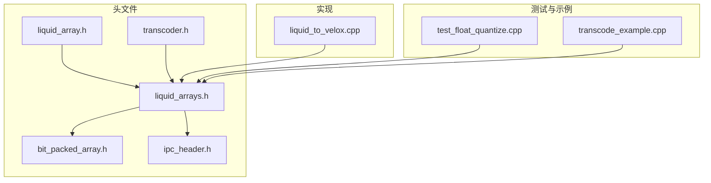
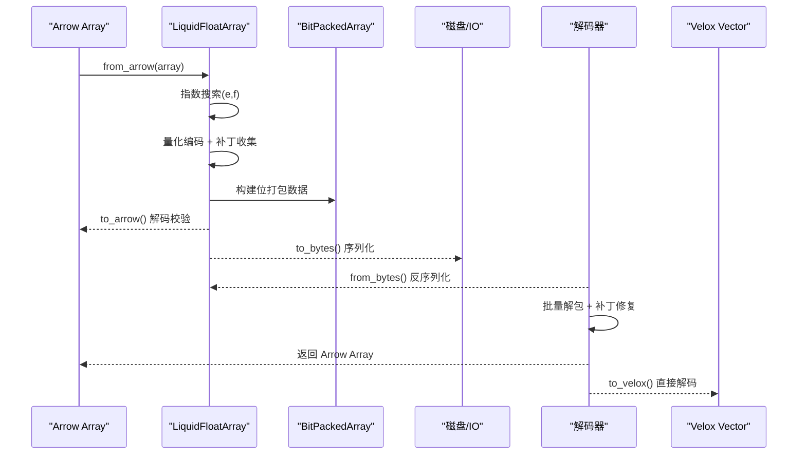
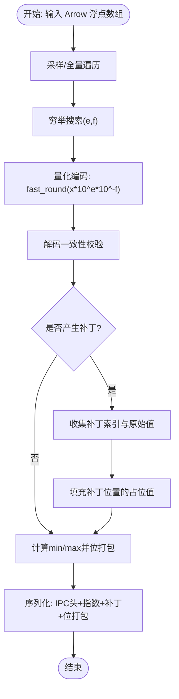
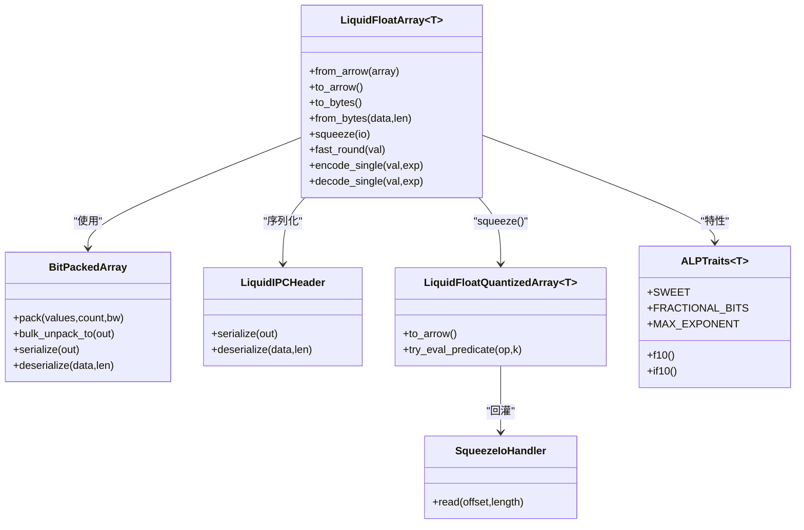

# 浮点数组类型

<cite>
**本文档引用的文件**
- [README.md](file://README.md)
- [liquid_arrays.h](file://include/liquid_cache/liquid_arrays.h)
- [liquid_array.h](file://include/liquid_cache/liquid_array.h)
- [bit_packed_array.h](file://include/liquid_cache/bit_packed_array.h)
- [ipc_header.h](file://include/liquid_cache/ipc_header.h)
- [test_float_quantize.cpp](file://tests/test_float_quantize.cpp)
- [transcoder.h](file://include/liquid_cache/transcoder.h)
- [liquid_to_velox.cpp](file://src/liquid_to_velox.cpp)
- [transcode_example.cpp](file://examples/transcode_example.cpp)
</cite>

## 目录
1. [简介](#简介)
2. [项目结构](#项目结构)
3. [核心组件](#核心组件)
4. [架构总览](#架构总览)
5. [详细组件分析](#详细组件分析)
6. [依赖关系分析](#依赖关系分析)
7. [性能考量](#性能考量)
8. [故障排查指南](#故障排查指南)
9. [结论](#结论)
10. [附录](#附录)

## 简介
本文件系统性阐述 LiquidCache C++ 实现中的浮点数组类型，重点围绕 LiquidFloatArray 的 ALP（Adaptive Lossless Packing）编码算法，涵盖指数搜索策略、量化与补丁机制、f32/f64 的差异化处理、预计算 10 的幂次表、快速四舍五入实现、序列化格式、性能特征与实际使用示例。文档旨在帮助读者在不深入源码的前提下，理解并正确使用浮点数组的编码与解码流程，并在工程中进行优化与排障。

## 项目结构
该项目是一个高性能列式数据内存缓存与编码压缩库，支持 Arrow/Parquet 数据的高效编解码，并可选集成 Facebook Velox 向量引擎。与浮点数组相关的核心文件位于 include/liquid_cache 目录，测试与示例位于 tests 与 examples 目录。

图表来源
- [liquid_array.h:1-159](file://include/liquid_cache/liquid_array.h#L1-L159)
- [liquid_arrays.h:1-1233](file://include/liquid_cache/liquid_arrays.h#L1-L1233)
- [bit_packed_array.h:1-486](file://include/liquid_cache/bit_packed_array.h#L1-L486)
- [ipc_header.h:1-118](file://include/liquid_cache/ipc_header.h#L1-L118)
- [transcoder.h:132-257](file://include/liquid_cache/transcoder.h#L132-L257)
- [liquid_to_velox.cpp:116-147](file://src/liquid_to_velox.cpp#L116-L147)
- [test_float_quantize.cpp:1-419](file://tests/test_float_quantize.cpp#L1-L419)
- [transcode_example.cpp:1-550](file://examples/transcode_example.cpp#L1-L550)

章节来源
- [README.md:1-378](file://README.md#L1-L378)

## 核心组件
- LiquidFloatArray<T>：面向浮点数组的 ALP 编码器，负责指数搜索、量化、补丁收集与位打包，提供 to_arrow()/to_bytes()/from_bytes() 等接口。
- BitPackedArray：位打包存储，提供批量解包、空值位图等能力，是 ALP 编码后数据的底层容器。
- LiquidIPCHeader：二进制 IPC 头，统一逻辑类型与物理类型标识，确保跨语言兼容。
- LiquidFloatQuantizedArray<T>：压缩后的“半分辨率”浮点数组，支持谓词下推评估，必要时从磁盘回灌完整数据。
- ALPTraits<T>：f32/f64 的特性模板，提供位宽、最大指数、预计算 10 的幂表、快速四舍五入常量等。

章节来源
- [liquid_arrays.h:584-1233](file://include/liquid_cache/liquid_arrays.h#L584-L1233)
- [bit_packed_array.h:22-486](file://include/liquid_cache/bit_packed_array.h#L22-L486)
- [ipc_header.h:16-118](file://include/liquid_cache/ipc_header.h#L16-L118)

## 架构总览
下图展示了浮点数组从 Arrow 到 Liquid 的编码路径，以及从 Liquid 到 Arrow/Velox 的解码路径。

图表来源
- [liquid_arrays.h:711-847](file://include/liquid_cache/liquid_arrays.h#L711-L847)
- [liquid_arrays.h:849-974](file://include/liquid_cache/liquid_arrays.h#L849-L974)
- [liquid_to_velox.cpp:122-147](file://src/liquid_to_velox.cpp#L122-L147)

## 详细组件分析

### ALP 编码算法与数据结构
- 指数搜索：对 (e, f) 组合进行穷举搜索，采样大数组以平衡性能与质量；估计编码后体积（位宽×长度/8 + 补丁开销）并选择最小者。
- 量化策略：对每个浮点值执行 fast_round(value × 10^e × 10^(-f))，得到有符号整数；随后按 min/max 计算偏移并位打包。
- 补丁机制：若解码结果与原值不一致，则记录索引与原始值，后续解码时直接替换，保证无损还原。
- 预计算幂表：f32 与 f64 各自维护 10 的幂与 10 的负幂表，避免运行时重复计算。
- 快速四舍五入：利用“甜点常量”（sweet spot constant）实现稳定且高效的浮点到整数的舍入，减少分支与溢出风险。
- 序列化布局：包含 IPC 头、参考值、指数参数、补丁索引与值、8 字节对齐、位打包数据块。

图表来源
- [liquid_arrays.h:711-806](file://include/liquid_cache/liquid_arrays.h#L711-L806)
- [liquid_arrays.h:977-1022](file://include/liquid_cache/liquid_arrays.h#L977-L1022)

章节来源
- [liquid_arrays.h:584-684](file://include/liquid_cache/liquid_arrays.h#L584-L684)
- [liquid_arrays.h:685-1030](file://include/liquid_cache/liquid_arrays.h#L685-L1030)

### f32 与 f64 的差异化处理
- 位宽与最大指数：f32 使用 23 位尾数位与最大指数 10；f64 使用 52 位尾数位与最大指数 18。这决定了幂表长度与快速四舍五入常量的取值。
- 快速四舍五入常量：分别为 f32 的 (1<<23)+(1<<22) 与 f64 的 (1ULL<<52)+(1ULL<<51)，用于稳定舍入。
- 幂表：f32 与 f64 各自维护长度不同的 10 的幂与负幂表，以匹配各自的精度范围。

章节来源
- [liquid_arrays.h:656-683](file://include/liquid_cache/liquid_arrays.h#L656-L683)

### 快速四舍五入实现
- fast_round：通过将数值加上“甜点常量”再减去同一常量，利用 IEEE 754 舍入规则实现就近舍入，避免显式分支与额外函数调用。
- decode_single：解码时先将整数视作浮点，再乘以 10^f 与 10^(-e)，恢复原始值。

章节来源
- [liquid_arrays.h:695-709](file://include/liquid_cache/liquid_arrays.h#L695-L709)

### 补丁机制与内存布局
- 补丁收集：在编码阶段记录解码不一致的位置与原始值；解码时先批量解码，再按索引逐一替换。
- 内存布局：补丁索引与值分别存储，便于后续谓词下推评估与增量回灌。

章节来源
- [liquid_arrays.h:735-770](file://include/liquid_cache/liquid_arrays.h#L735-L770)
- [liquid_arrays.h:833-836](file://include/liquid_cache/liquid_arrays.h#L833-L836)

### 序列化格式与反序列化
- IPC 头：包含魔数、版本、逻辑类型（Float）、物理类型（Float32/Float64）。
- 数据体：参考值、指数参数、补丁长度与补丁数据、8 字节对齐、位打包数据。
- 反序列化：严格校验头与各段长度，按顺序读取并重建内部结构。

章节来源
- [liquid_arrays.h:595-604](file://include/liquid_cache/liquid_arrays.h#L595-L604)
- [liquid_arrays.h:849-885](file://include/liquid_cache/liquid_arrays.h#L849-L885)
- [liquid_arrays.h:915-974](file://include/liquid_cache/liquid_arrays.h#L915-L974)
- [ipc_header.h:46-106](file://include/liquid_cache/ipc_header.h#L46-L106)

### 位打包与批量解包
- BitPackedArray：提供 pack/unpack、批量解包（AVX2 加速）与空值位图管理，是 ALP 编码后数据的底层容器。
- 批量解包：针对常见位宽（1/2/4/8/16/32）提供 AVX2 内联汇编优化，显著提升解码吞吐。

章节来源
- [bit_packed_array.h:22-486](file://include/liquid_cache/bit_packed_array.h#L22-L486)

### 从 Liquid 到 Arrow/Velocity 的解码
- to_arrow：批量解包 + 单次解码 + 补丁修复，最后构造 Arrow Array。
- to_velox：直接解码到 Velox FlatVector，避免中间 Arrow 层，进一步降低开销。

章节来源
- [liquid_arrays.h:808-847](file://include/liquid_cache/liquid_arrays.h#L808-L847)
- [liquid_to_velox.cpp:122-147](file://src/liquid_to_velox.cpp#L122-L147)

### 压缩与谓词下推（Squeeze）
- squeeze：当位宽≥8 时，将位宽减半（bucket_width_），保留补丁信息与磁盘偏移/长度，形成 Hybrid 存储。
- try_eval_predicate：基于半分辨率桶边界与补丁值，尽可能在内存中评估比较谓词，若存在歧义则返回“需要回灌”。

章节来源
- [liquid_arrays.h:1033-1224](file://include/liquid_cache/liquid_arrays.h#L1033-L1224)
- [test_float_quantize.cpp:158-419](file://tests/test_float_quantize.cpp#L158-L419)

## 依赖关系分析
- LiquidFloatArray 依赖 BitPackedArray 进行位打包，依赖 IPC 头进行序列化，依赖 Arrow 类型系统进行输入输出。
- LiquidFloatQuantizedArray 依赖 SqueezeIoHandler 从磁盘回灌完整数据。
- ALPTraits 提供 f32/f64 的差异配置，使编码器在编译期确定常量与表。

图表来源
- [liquid_arrays.h:584-1233](file://include/liquid_cache/liquid_arrays.h#L584-L1233)
- [bit_packed_array.h:22-486](file://include/liquid_cache/bit_packed_array.h#L22-L486)
- [ipc_header.h:16-118](file://include/liquid_cache/ipc_header.h#L16-L118)

## 性能考量
- 压缩率：通过指数搜索与补丁机制，在保证无损的前提下显著降低位宽；当位宽较高时，squeeze 可将位宽减半，进一步降低内存占用。
- 解码速度：批量解包（AVX2）与单次解码 + 补丁修复的组合，避免逐元素访问；to_velox 直接解码到向量，减少中间层开销。
- 精度保证：ALP 通过补丁机制确保解码与原值完全一致；快速四舍五入常量与幂表预计算减少运行时误差与开销。
- 内存足迹：squeeze 后的 Hybrid 结构在内存中只保存半分辨率数据与补丁，磁盘上保存完整编码，按需回灌。

章节来源
- [liquid_arrays.h:1033-1224](file://include/liquid_cache/liquid_arrays.h#L1033-L1224)
- [bit_packed_array.h:242-444](file://include/liquid_cache/bit_packed_array.h#L242-L444)

## 故障排查指南
- 反序列化失败：检查 IPC 头魔数与版本，确认缓冲区长度足够读取各段数据。
- 补丁数据越界：确认补丁索引与值的数量一致，且总长度不超过序列化缓冲区。
- 空数组/全空数组：编码器对全空数组有特殊处理，确保位宽与参考值合理。
- squeeze 失败：当位宽小于 8 时不会进行 squeeze；检查内存大小是否确实下降。

章节来源
- [liquid_arrays.h:915-974](file://include/liquid_cache/liquid_arrays.h#L915-L974)
- [test_float_quantize.cpp:115-419](file://tests/test_float_quantize.cpp#L115-L419)

## 结论
LiquidFloatArray 通过 ALP 编码将浮点数组转化为紧凑的位打包表示，并以补丁机制保证无损还原。f32/f64 的差异化设计与预计算幂表提升了运行效率；squeeze 机制进一步降低了内存占用并支持谓词下推评估。结合批量解包与直接解码到 Velox 的能力，整体在精度、压缩率与解码速度之间取得良好平衡。

## 附录

### 实际使用示例（路径引用）
- 创建与编码：参考 [liquid_arrays.h:711-806](file://include/liquid_cache/liquid_arrays.h#L711-L806)
- 序列化与反序列化：参考 [liquid_arrays.h:849-974](file://include/liquid_cache/liquid_arrays.h#L849-L974)
- 从 Arrow 到 Arrow 的往返测试：参考 [test_float_quantize.cpp:54-113](file://tests/test_float_quantize.cpp#L54-L113)
- 从 Arrow 到 Velox 的解码：参考 [liquid_to_velox.cpp:122-147](file://src/liquid_to_velox.cpp#L122-L147)
- 基准与验证示例：参考 [transcode_example.cpp:246-332](file://examples/transcode_example.cpp#L246-L332)