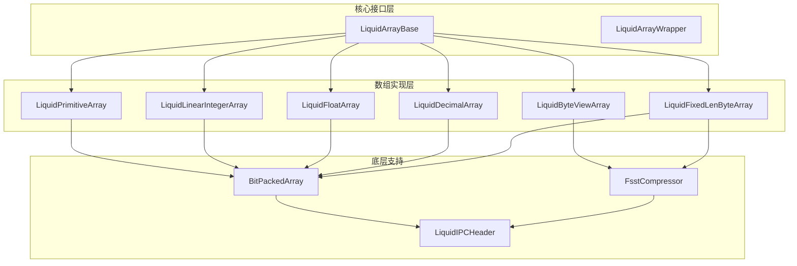
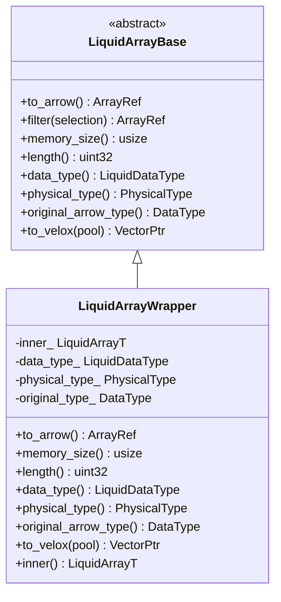
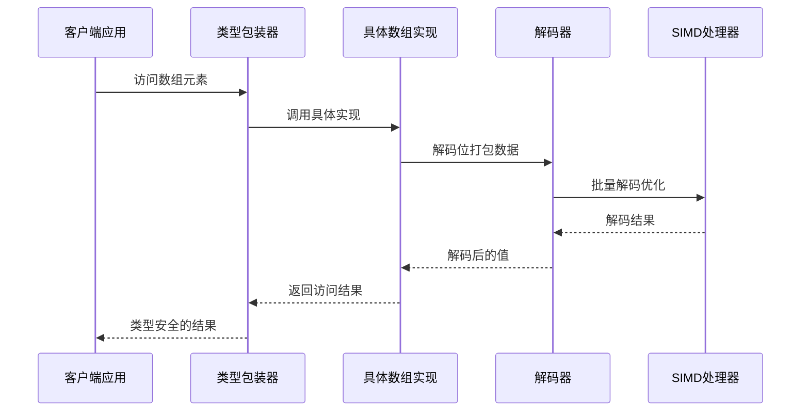
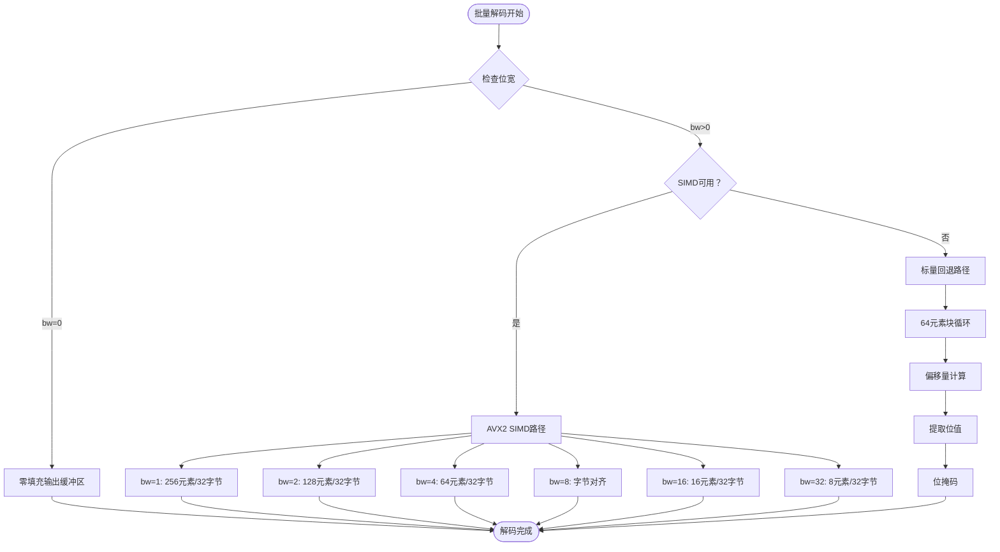
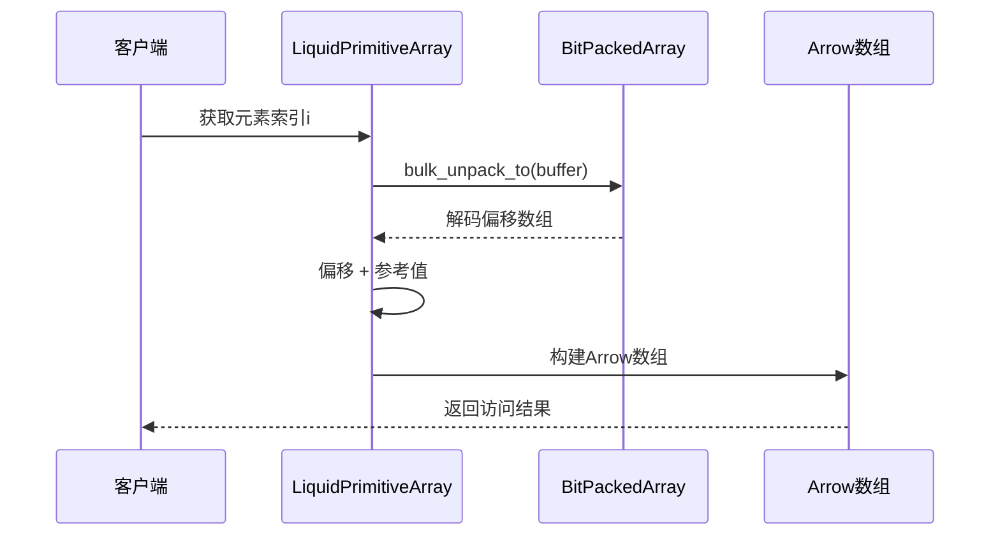
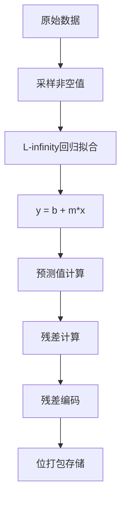
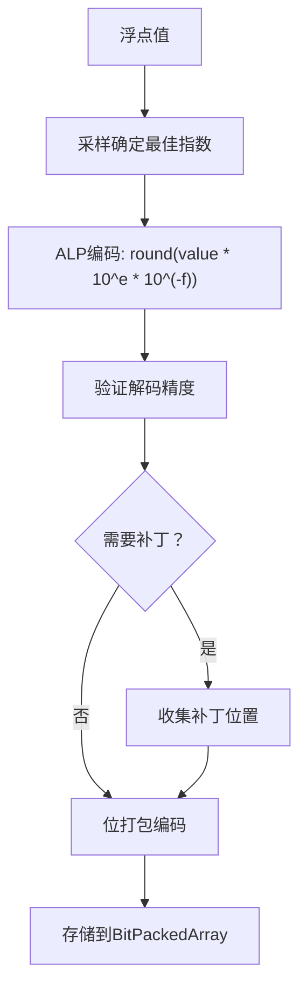
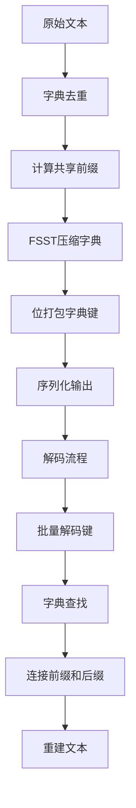
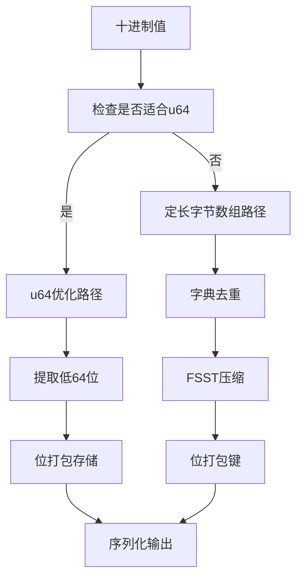
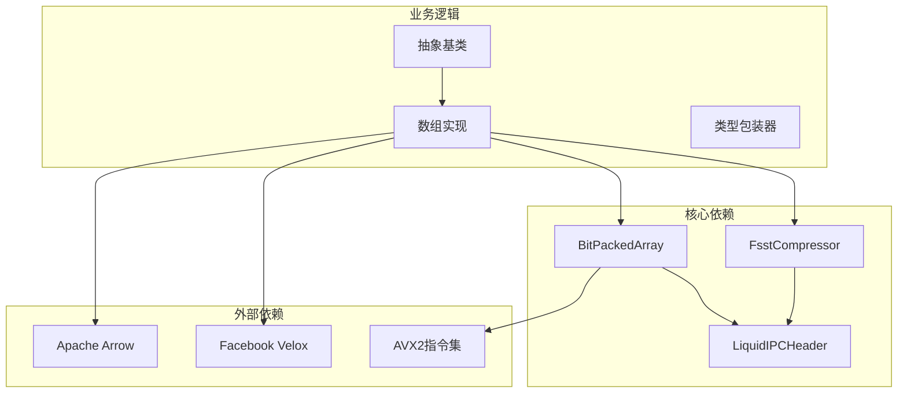

# 数组访问方法

<cite>
**本文档引用的文件**
- [liquid_array.h](file://include/liquid_cache/liquid_array.h)
- [liquid_arrays.h](file://include/liquid_cache/liquid_arrays.h)
- [bit_packed_array.h](file://include/liquid_cache/bit_packed_array.h)
- [liquid_byte_view_array.h](file://include/liquid_cache/liquid_byte_view_array.h)
- [liquid_fixed_len_byte_array.h](file://include/liquid_cache/liquid_fixed_len_byte_array.h)
- [liquid_decimal_array.h](file://include/liquid_cache/liquid_decimal_array.h)
- [ipc_header.h](file://include/liquid_cache/ipc_header.h)
- [fsst.h](file://include/liquid_cache/fsst.h)
- [README.md](file://README.md)
- [test_linear_integer.cpp](file://tests/test_linear_integer.cpp)
- [test_float_quantize.cpp](file://tests/test_float_quantize.cpp)
</cite>

## 目录
1. [简介](#简介)
2. [项目结构](#项目结构)
3. [核心组件](#核心组件)
4. [架构概览](#架构概览)
5. [详细组件分析](#详细组件分析)
6. [依赖关系分析](#依赖关系分析)
7. [性能考虑](#性能考虑)
8. [故障排除指南](#故障排除指南)
9. [结论](#结论)

## 简介

本文档深入分析了 liquid-cache-cpp 项目中的数组访问方法，这是一个高性能的列式数据内存缓存与编码压缩库。该项目提供了多种数组类型的访问接口，包括随机访问、范围访问、批量访问和向量化操作支持。

项目的核心特性包括：
- **多数据类型支持**：整数、浮点数、字符串、二进制、十进制等
- **高性能编码**：Frame-of-Reference + BitPacking、ALP（自适应无损浮点）、FSST 压缩
- **SIMD 向量化**：AVX2 指令集优化的批量解码
- **内存局部性优化**：1024 元素块的 FastLanes 模式
- **类型安全**：完整的类型系统和访问权限控制

## 项目结构

项目采用模块化的头文件设计，主要组件分布如下：

**图表来源**
- [liquid_array.h:29-85](file://include/liquid_cache/liquid_array.h#L29-L85)
- [liquid_arrays.h:95-248](file://include/liquid_cache/liquid_arrays.h#L95-L248)
- [bit_packed_array.h:39-483](file://include/liquid_cache/bit_packed_array.h#L39-L483)

**章节来源**
- [README.md:8-39](file://README.md#L8-L39)

## 核心组件

### 液体数组抽象基类

`LiquidArrayBase` 提供了统一的数组访问接口，支持多态数组操作：

**图表来源**
- [liquid_array.h:29-85](file://include/liquid_cache/liquid_array.h#L29-L85)
- [liquid_array.h:98-146](file://include/liquid_cache/liquid_array.h#L98-L146)

### 基础数组类型

项目实现了多种数组类型，每种都有特定的访问模式：

| 数组类型 | 数据类型 | 访问模式 | 特殊功能 |
|---------|----------|----------|----------|
| LiquidPrimitiveArray | 整数/日期 | 随机访问 + 批量解码 | Frame-of-Reference 编码 |
| LiquidLinearIntegerArray | 线性整数序列 | 数学模型预测 | L-infinity 回归 |
| LiquidFloatArray | 浮点数 | 随机访问 + 谓词下推 | ALP 编码 + 压缩 |
| LiquidByteViewArray | 字符串/二进制 | 字典 + FSST 压缩 | 前缀共享优化 |
| LiquidDecimalArray | 十进制 | 批量解码 | u64 优化路径 |
| LiquidFixedLenByteArray | 定长字节数组 | 字典 + FSST | Decimal128/256 |

**章节来源**
- [liquid_arrays.h:95-573](file://include/liquid_cache/liquid_arrays.h#L95-L573)
- [liquid_byte_view_array.h:204-667](file://include/liquid_cache/liquid_byte_view_array.h#L204-L667)

## 架构概览

数组访问架构采用分层设计，从底层的位打包到高层的类型安全接口：

**图表来源**
- [liquid_array.h:98-146](file://include/liquid_cache/liquid_array.h#L98-L146)
- [bit_packed_array.h:250-272](file://include/liquid_cache/bit_packed_array.h#L250-L272)

## 详细组件分析

### 位打包数组（BitPackedArray）

位打包数组是整个系统的基础，提供了高效的位级存储和批量解码能力：

#### 核心特性

1. **位级存储**：每个元素使用精确的位宽存储
2. **批量解码**：支持 AVX2 SIMD 指令集优化
3. **内存对齐**：8 字节对齐以优化缓存性能
4. **空值处理**：内置位图支持空值检测

#### 批量解码优化

**图表来源**
- [bit_packed_array.h:250-444](file://include/liquid_cache/bit_packed_array.h#L250-L444)

#### 访问模式对比

| 访问方式 | 性能特征 | 内存占用 | 适用场景 |
|---------|----------|----------|----------|
| 单元素访问 | O(1) 时间复杂度 | 高（函数调用开销） | 随机访问少量元素 |
| 批量解码 | O(n) 线性时间 | 低（内存局部性好） | 大规模数据遍历 |
| SIMD解码 | O(n/8) 向量化 | 最优（缓存友好） | AVX2可用的现代CPU |

**章节来源**
- [bit_packed_array.h:97-147](file://include/liquid_cache/bit_packed_array.h#L97-L147)
- [bit_packed_array.h:242-272](file://include/liquid_cache/bit_packed_array.h#L242-L272)

### 整数数组访问

整数数组采用 Frame-of-Reference + BitPacking 编码，提供最优的压缩比和访问性能：

#### 编码策略

1. **参考值选择**：使用最小值作为参考点
2. **位宽计算**：动态计算最大偏移所需的位宽
3. **批量存储**：使用位打包数组存储偏移值

#### 访问流程

**图表来源**
- [liquid_arrays.h:167-197](file://include/liquid_cache/liquid_arrays.h#L167-L197)
- [liquid_arrays.h:240-243](file://include/liquid_cache/liquid_arrays.h#L240-L243)

**章节来源**
- [liquid_arrays.h:95-248](file://include/liquid_cache/liquid_arrays.h#L95-L248)

### 线性整数数组

线性整数数组适用于单调或近似线性的整数序列，使用数学模型进行预测编码：

#### 线性回归优化

**图表来源**
- [liquid_arrays.h:358-474](file://include/liquid_cache/liquid_arrays.h#L358-L474)

#### 访问性能

线性整数数组在单调序列上具有显著优势：
- **预测访问**：O(1) 时间复杂度
- **内存占用**：仅存储残差和模型参数
- **压缩比**：对于线性序列可达 10:1 以上

**章节来源**
- [liquid_arrays.h:358-566](file://include/liquid_cache/liquid_arrays.h#L358-L566)

### 浮点数组访问

浮点数组采用 ALP（Adaptive Lossless Precision）编码，结合位打包和压缩技术：

#### ALP 编码流程

**图表来源**
- [liquid_arrays.h:704-799](file://include/liquid_cache/liquid_arrays.h#L704-L799)

#### 谓词下推支持

浮点数组支持谓词下推，允许在压缩状态下进行条件过滤：

| 操作符 | 功能描述 | 实现方式 |
|-------|----------|----------|
| Eq | 等于 | 精确匹配，返回布尔掩码 |
| NotEq | 不等于 | 精确匹配后取反 |
| Lt/Gt | 小于/大于 | 桶边界分析，必要时回退解码 |
| LtEq/GtEq | 小于等于/大于等于 | 桶边界分析 |

**章节来源**
- [liquid_arrays.h:599-800](file://include/liquid_cache/liquid_arrays.h#L599-L800)
- [test_float_quantize.cpp:232-364](file://tests/test_float_quantize.cpp#L232-L364)

### 字符串数组访问

字符串数组采用字典 + FSST 压缩策略，结合前缀共享优化：

#### 编码架构

**图表来源**
- [liquid_byte_view_array.h:209-353](file://include/liquid_cache/liquid_byte_view_array.h#L209-L353)

#### 访问优化

字符串数组的访问优化包括：
- **字典缓存**：避免重复的 FSST 解压缩
- **批量解码**：一次性解码所有键值
- **内存映射**：使用连续内存布局减少指针跳转

**章节来源**
- [liquid_byte_view_array.h:204-667](file://include/liquid_cache/liquid_byte_view_array.h#L204-L667)

### 十进制数组访问

十进制数组针对大整数精度需求，提供专门的优化路径：

#### u64 优化路径

对于可以安全转换为 u64 的十进制值，使用优化的编码路径：

**图表来源**
- [liquid_decimal_array.h:73-104](file://include/liquid_cache/liquid_decimal_array.h#L73-L104)
- [liquid_decimal_array.h:106-237](file://include/liquid_cache/liquid_decimal_array.h#L106-L237)

**章节来源**
- [liquid_decimal_array.h:69-401](file://include/liquid_cache/liquid_decimal_array.h#L69-L401)

## 依赖关系分析

数组访问系统的依赖关系呈现清晰的层次结构：

**图表来源**
- [liquid_array.h:19-25](file://include/liquid_cache/liquid_array.h#L19-L25)
- [bit_packed_array.h:16-18](file://include/liquid_cache/bit_packed_array.h#L16-L18)

**章节来源**
- [ipc_header.h:16-44](file://include/liquid_cache/ipc_header.h#L16-L44)

## 性能考虑

### 缓存局部性优化

系统通过多种机制优化缓存局部性：

1. **1024 元素块**：FastLanes 模式确保 SIMD 指令的缓存友好性
2. **连续内存布局**：批量解码时使用连续内存访问模式
3. **字典缓存**：字符串数组的字典解压缩结果缓存

### SIMD 向量化支持

系统充分利用现代 CPU 的 SIMD 能力：

| 位宽 | SIMD函数 | 处理元素数 | 内存带宽利用率 |
|------|----------|------------|----------------|
| 1位 | bulk_unpack_bw1_avx2 | 256个元素/32字节 | 100% |
| 2位 | bulk_unpack_bw2_avx2 | 128个元素/32字节 | 100% |
| 4位 | bulk_unpack_bw4_avx2 | 64个元素/32字节 | 100% |
| 8位 | bulk_unpack_bw8_avx2 | 32个元素/32字节 | 100% |
| 16位 | bulk_unpack_bw16_avx2 | 16个元素/32字节 | 100% |
| 32位 | bulk_unpack_bw32_avx2 | 8个元素/32字节 | 100% |

### 内存管理策略

1. **零拷贝设计**：尽可能重用 Arrow 缓冲区
2. **延迟解压缩**：字符串数组的字典解压缩按需进行
3. **内存池**：可选的 Velox 集成支持内存池管理

## 故障排除指南

### 常见问题及解决方案

#### 1. 编译错误（SIMD 相关）

**问题**：编译时出现 AVX2 相关错误
**原因**：编译器不支持 AVX2 指令集
**解决方案**：禁用 SIMD 优化或升级编译器

#### 2. 内存不足错误

**问题**：解码过程中内存分配失败
**原因**：数组过大或内存碎片化
**解决方案**：增加系统内存或分批处理

#### 3. 类型不匹配错误

**问题**：访问数组时出现类型转换错误
**原因**：数组类型与期望类型不匹配
**解决方案**：使用正确的数组类型或进行显式转换

#### 4. 性能异常

**问题**：数组访问性能低于预期
**原因**：缓存未命中或内存对齐问题
**解决方案**：检查数据布局和访问模式

**章节来源**
- [test_linear_integer.cpp:120-271](file://tests/test_linear_integer.cpp#L120-L271)
- [test_float_quantize.cpp:115-419](file://tests/test_float_quantize.cpp#L115-L419)

## 结论

liquid-cache-cpp 项目的数组访问方法展现了现代高性能数据处理系统的最佳实践：

### 主要优势

1. **类型安全**：完整的类型系统确保编译时类型检查
2. **性能优化**：多层优化策略覆盖从硬件到算法的各个层面
3. **扩展性**：模块化设计支持新数据类型的轻松添加
4. **兼容性**：与 Arrow 和 Velox 生态系统无缝集成

### 技术特色

- **智能编码**：根据不同数据特征选择最优编码策略
- **SIMD 向量化**：充分利用现代 CPU 的并行处理能力
- **内存优化**：通过缓存友好的数据布局提升性能
- **谓词下推**：在压缩状态下进行条件过滤

### 应用场景

该系统特别适用于：
- **大数据分析**：大规模数据集的高效处理
- **实时查询**：低延迟的数据访问需求
- **内存缓存**：高性能内存数据结构
- **数据传输**：压缩数据的快速解码

通过精心设计的架构和优化策略，liquid-cache-cpp 为现代数据处理应用提供了强大而灵活的数组访问解决方案。