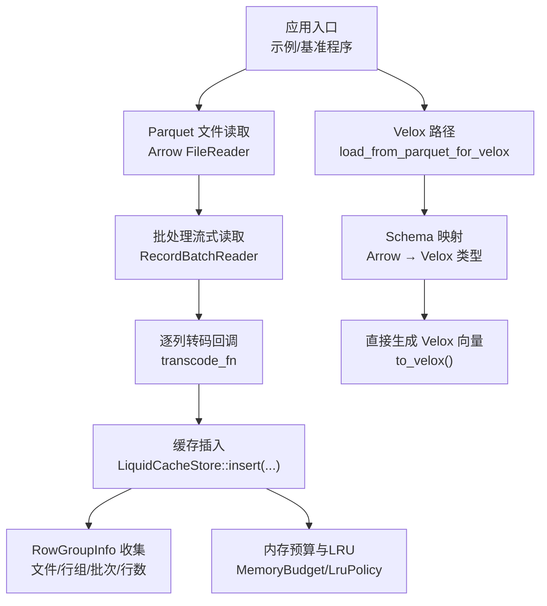
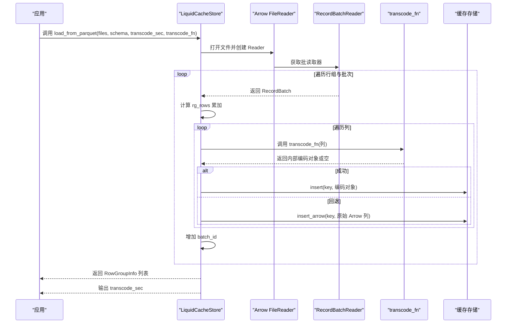
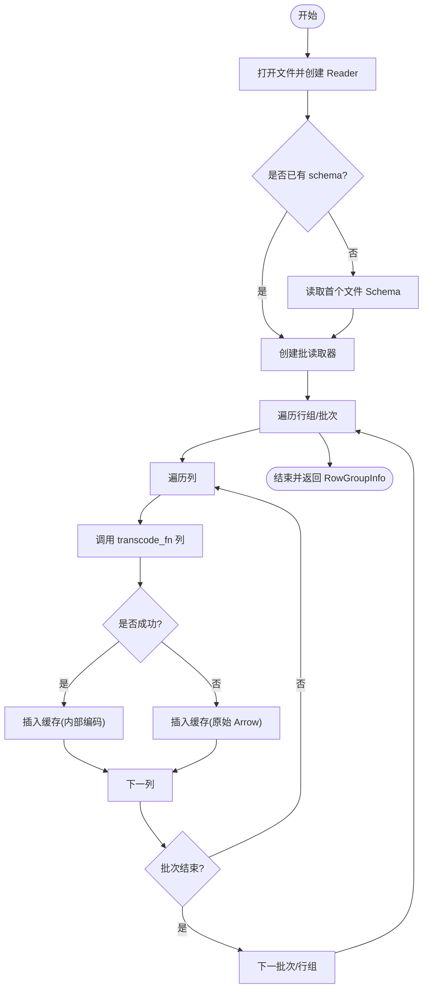
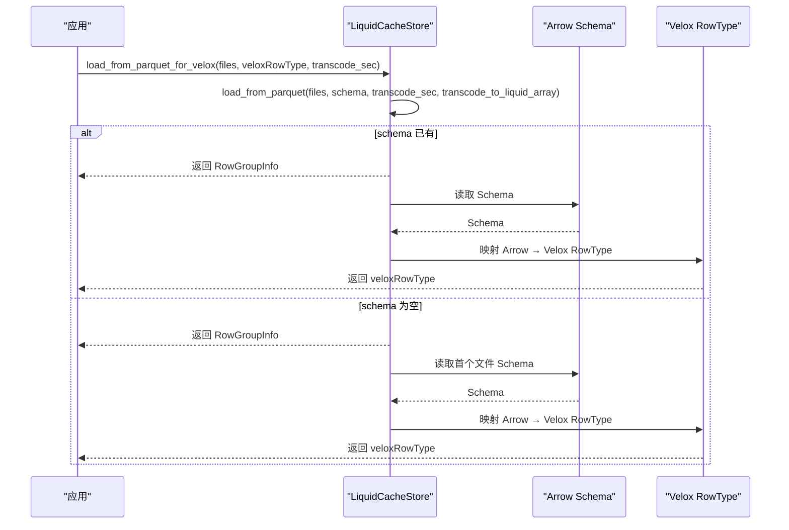
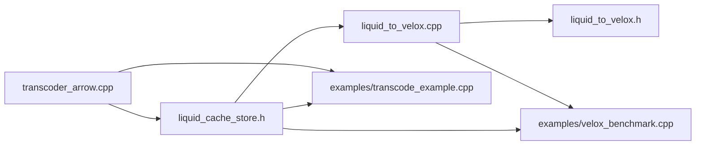

# 批量加载

<cite>
**本文引用的文件**
- [liquid_cache_store.h](file://include/liquid_cache/liquid_cache_store.h)
- [transcoder_arrow.cpp](file://src/transcoder_arrow.cpp)
- [liquid_to_velox.h](file://include/liquid_cache/liquid_to_velox.h)
- [liquid_to_velox.cpp](file://src/liquid_to_velox.cpp)
- [transcode_example.cpp](file://examples/transcode_example.cpp)
- [velox_benchmark.cpp](file://examples/velox_benchmark.cpp)
</cite>

## 目录
1. [简介](#简介)
2. [项目结构](#项目结构)
3. [核心组件](#核心组件)
4. [架构总览](#架构总览)
5. [详细组件分析](#详细组件分析)
6. [依赖关系分析](#依赖关系分析)
7. [性能考量](#性能考量)
8. [故障排查指南](#故障排查指南)
9. [结论](#结论)
10. [附录](#附录)

## 简介
本文件系统性阐述批量加载功能，聚焦于 load_from_parquet 与 load_from_parquet_for_velox 的实现原理与使用方式。内容涵盖：
- Parquet 文件加载流程：文件遍历、行组解析、列数据提取、转码过程、缓存插入
- RowGroupInfo 结构的作用与用途
- 转码函数的回调机制与类型分派
- 性能统计信息收集（转码耗时）
- 与 Velox 集成的特殊处理与读取路径
- 多文件批量加载、自定义转码函数、性能监控、错误处理的完整使用示例
- 最佳实践与性能优化策略

## 项目结构
与批量加载相关的关键模块如下：
- 缓存存储与键空间：LiquidCacheStore、RowGroupInfo、LiquidCacheKey
- 转码层：transcode_arrow.cpp 提供 Arrow 原生数组到内部编码的桥接
- Velox 集成：liquid_to_velox.* 将内部编码直接转换为 Velox 向量
- 示例与基准：examples 下的示例程序展示如何批量加载与性能对比

图表来源
- [transcoder_arrow.cpp:664-743](file://src/transcoder_arrow.cpp#L664-L743)
- [liquid_cache_store.h:360-366](file://include/liquid_cache/liquid_cache_store.h#L360-L366)
- [liquid_to_velox.cpp:546-558](file://src/liquid_to_velox.cpp#L546-L558)

章节来源
- [transcoder_arrow.cpp:664-743](file://src/transcoder_arrow.cpp#L664-L743)
- [liquid_cache_store.h:360-366](file://include/liquid_cache/liquid_cache_store.h#L360-L366)

## 核心组件
- LiquidCacheStore：列式缓存，支持按列、按批次、按行组读取；提供批量加载接口与统计信息
- RowGroupInfo：记录每个已加载行组的元信息（文件ID、行组ID、批次数量、总行数）
- 转码函数 transcode_fn：接收 Arrow Array，返回内部编码对象（或回退为 Arrow 原始数组）
- Velox 集成：load_from_parquet_for_velox 封装转码与类型映射，返回 Velox RowType 并保留 RowGroupInfo

章节来源
- [liquid_cache_store.h:360-366](file://include/liquid_cache/liquid_cache_store.h#L360-L366)
- [liquid_cache_store.h:378-383](file://include/liquid_cache/liquid_cache_store.h#L378-L383)
- [liquid_to_velox.cpp:546-558](file://src/liquid_to_velox.cpp#L546-L558)

## 架构总览
批量加载从 Parquet 文件开始，通过 Arrow 流式读取器逐批读取 RecordBatch，对每列调用转码回调，将结果以键空间组织插入缓存，并收集行组元信息。若启用 Velox，load_from_parquet_for_velox 还会将 Arrow Schema 转换为 Velox RowType。

图表来源
- [transcoder_arrow.cpp:664-743](file://src/transcoder_arrow.cpp#L664-L743)

## 详细组件分析

### 组件一：load_from_parquet（批量加载主流程）
- 输入：文件列表、输出参数 schema、transcode_sec、转码回调 transcode_fn
- 行为：
  - 逐文件打开 Arrow FileReader
  - 创建 RecordBatchReader，设置批大小
  - 流式读取 RecordBatch，逐列调用 transcode_fn
  - 使用键空间 LiquidCacheKey(file_id, rg_id, col_id, batch_id) 插入缓存
  - 汇总每个行组的批次数与总行数，返回 RowGroupInfo
  - 统计转码总耗时（秒）

图表来源
- [transcoder_arrow.cpp:664-743](file://src/transcoder_arrow.cpp#L664-L743)

章节来源
- [transcoder_arrow.cpp:664-743](file://src/transcoder_arrow.cpp#L664-L743)
- [liquid_cache_store.h:378-383](file://include/liquid_cache/liquid_cache_store.h#L378-L383)

### 组件二：RowGroupInfo（行组元信息）
- 字段：file_id、rg_id、num_batches、total_rows
- 作用：描述一次批量加载中每个行组的组织情况，便于后续按行组/批次读取与统计

章节来源
- [liquid_cache_store.h:360-366](file://include/liquid_cache/liquid_cache_store.h#L360-L366)

### 组件三：转码函数回调机制（transcode_fn）
- 接口：std::function<LiquidArrayRef(const std::shared_ptr<arrow::Array>&)>
- 实现要点：
  - 对整型、日期、时间戳、浮点、字符串/二进制、字典、Decimal 等类型进行分派
  - 时间戳在内部以 Int64 存储，物理类型映射为对应时间单位
  - 不支持的类型回退为原始 Arrow 数组
- 典型实现：transcode_to_liquid_array 将 Arrow Array 直接转为内存中的内部编码对象（非序列化字节），用于缓存存储

章节来源
- [transcoder_arrow.cpp:490-658](file://src/transcoder_arrow.cpp#L490-L658)
- [transcoder_arrow.cpp:216-351](file://src/transcoder_arrow.cpp#L216-L351)

### 组件四：load_from_parquet_for_velox（与 Velox 集成）
- 功能：隐藏 Arrow 类型细节，仅暴露 Velox RowType
- 流程：
  - 调用 load_from_parquet，传入 transcode_to_liquid_array
  - 若成功获取 Arrow Schema，则映射为 Velox RowType
  - 返回 RowGroupInfo 列表与转码耗时

图表来源
- [liquid_to_velox.cpp:546-558](file://src/liquid_to_velox.cpp#L546-L558)
- [liquid_to_velox.cpp:523-532](file://src/liquid_to_velox.cpp#L523-L532)

章节来源
- [liquid_to_velox.cpp:546-558](file://src/liquid_to_velox.cpp#L546-L558)
- [liquid_to_velox.cpp:523-532](file://src/liquid_to_velox.cpp#L523-L532)

### 组件五：Velox 直转（to_velox）与类型映射
- 直接将内部编码转换为 Velox 向量，避免中间 Arrow 层
- 支持类型：
  - 整型、日期、时间戳（按物理类型映射）
  - 浮点（ALP 解码）
  - 字符串/二进制（FSST 字典 + 位打包）
  - Decimal（短/长十进制）
- 时间戳与日期的特殊处理：毫秒转天等

章节来源
- [liquid_to_velox.cpp:25-101](file://src/liquid_to_velox.cpp#L25-L101)
- [liquid_to_velox.cpp:122-156](file://src/liquid_to_velox.cpp#L122-L156)
- [liquid_to_velox.cpp:168-260](file://src/liquid_to_velox.cpp#L168-L260)
- [liquid_to_velox.cpp:284-342](file://src/liquid_to_velox.cpp#L284-L342)
- [liquid_to_velox.cpp:352-399](file://src/liquid_to_velox.cpp#L352-L399)
- [liquid_to_velox.h:69-133](file://include/liquid_cache/liquid_to_velox.h#L69-L133)

### 组件六：键空间与缓存组织（LiquidCacheKey）
- 键结构：file_id(16) | rg_id(16) | col_id(16) | batch_id(16)
- 用途：唯一标识缓存中的某一列的某一批次，支持 LRU 与内存预算管理

章节来源
- [liquid_cache_store.h:48-78](file://include/liquid_cache/liquid_cache_store.h#L48-L78)

## 依赖关系分析
- load_from_parquet 依赖：
  - Arrow/Parquet：文件打开、Schema 读取、批读取
  - 转码回调：将 Arrow Array 转为内部编码对象
  - 缓存存储：以键空间插入条目
- load_from_parquet_for_velox 依赖：
  - load_from_parquet
  - Arrow → Velox 类型映射
  - 内部编码 → Velox 向量转换（to_velox）

图表来源
- [transcoder_arrow.cpp:664-743](file://src/transcoder_arrow.cpp#L664-L743)
- [liquid_to_velox.cpp:546-558](file://src/liquid_to_velox.cpp#L546-L558)

章节来源
- [transcoder_arrow.cpp:664-743](file://src/transcoder_arrow.cpp#L664-L743)
- [liquid_to_velox.cpp:546-558](file://src/liquid_to_velox.cpp#L546-L558)

## 性能考量
- 批大小：默认 8192，可在 Reader 上设置，影响内存占用与吞吐
- 转码耗时：通过 steady_clock 统计，作为 transcode_sec 返回
- 内存预算：可配置最大缓存字节数，超出时触发 LRU 淘汰
- Velox 路径：to_velox 直接生成向量，避免中间层拷贝，通常更快
- I/O 与 CPU：建议预热页缓存（示例程序已体现），减少磁盘 I/O 影响

章节来源
- [transcoder_arrow.cpp:689-690](file://src/transcoder_arrow.cpp#L689-L690)
- [transcoder_arrow.cpp:740-742](file://src/transcoder_arrow.cpp#L740-L742)
- [liquid_cache_store.h:192-205](file://include/liquid_cache/liquid_cache_store.h#L192-L205)

## 故障排查指南
- 文件打开失败：检查路径与权限；Arrow 状态返回错误
- Reader 创建失败：确认 Arrow/Parquet 版本兼容性
- 类型不支持：transcode_fn 对不支持类型回退为原始 Arrow，确保业务逻辑可接受
- Velox 类型映射异常：检查 Arrow Schema 与物理类型映射
- 内存不足：调整 max_cache_bytes 或降低批大小

章节来源
- [transcoder_arrow.cpp:675-677](file://src/transcoder_arrow.cpp#L675-L677)
- [transcoder_arrow.cpp:701-708](file://src/transcoder_arrow.cpp#L701-L708)
- [transcoder_arrow.cpp:724-731](file://src/transcoder_arrow.cpp#L724-L731)
- [liquid_to_velox.cpp:523-532](file://src/liquid_to_velox.cpp#L523-L532)

## 结论
批量加载通过 Arrow 流式读取与可插拔转码回调，实现了对多文件、多列、多批次的高效缓存构建；RowGroupInfo 提供了清晰的行组组织视图；启用 Velox 时，可进一步跳过中间层，直接生成 Velox 向量，获得更优性能。结合内存预算与 LRU 策略，可在受限资源下稳定运行。

## 附录

### 使用示例与最佳实践

- 多文件批量加载（示例程序）
  - 收集 .parquet 文件（递归目录扫描）
  - 调用 store.load_from_parquet，传入 transcode_to_liquid_array
  - 读取返回的 RowGroupInfo，用于后续按行组/批次读取
  - 参考路径：[examples/transcode_example.cpp:104-126](file://examples/transcode_example.cpp#L104-L126)，[examples/transcode_example.cpp:364-369](file://examples/transcode_example.cpp#L364-L369)

- 自定义转码函数
  - 在 transcode_fn 中实现类型分派与编码策略
  - 对不支持类型返回空，触发回退为原始 Arrow
  - 参考路径：[src/transcoder_arrow.cpp:490-658](file://src/transcoder_arrow.cpp#L490-L658)

- 性能监控
  - 通过 transcode_sec 获取转码耗时
  - 使用示例程序中的基准框架进行对比测试
  - 参考路径：[examples/transcode_example.cpp:366-368](file://examples/transcode_example.cpp#L366-L368)，[examples/velox_benchmark.cpp:497-506](file://examples/velox_benchmark.cpp#L497-L506)

- 错误处理
  - 文件/Reader 状态检查与异常抛出
  - 不支持类型回退为 Arrow，保证健壮性
  - 参考路径：[src/transcoder_arrow.cpp:675-677](file://src/transcoder_arrow.cpp#L675-L677)，[src/transcoder_arrow.cpp:724-731](file://src/transcoder_arrow.cpp#L724-L731)

- 与 Velox 集成
  - 使用 load_from_parquet_for_velox 获取 Velox RowType
  - 通过 read_batch_velox 按投影列读取 RowVector
  - 参考路径：[src/liquid_to_velox.cpp:546-558](file://src/liquid_to_velox.cpp#L546-L558)，[src/liquid_to_velox.cpp:581-634](file://src/liquid_to_velox.cpp#L581-L634)

- 最佳实践与优化策略
  - 设置合适的批大小（默认 8192）
  - 控制内存预算，避免频繁淘汰
  - 优先使用 Velox 路径以减少中间层成本
  - 预热页缓存，消除磁盘 I/O 波动
  - 参考路径：[src/transcoder_arrow.cpp:689-690](file://src/transcoder_arrow.cpp#L689-L690)，[src/liquid_to_velox.cpp:581-634](file://src/liquid_to_velox.cpp#L581-L634)