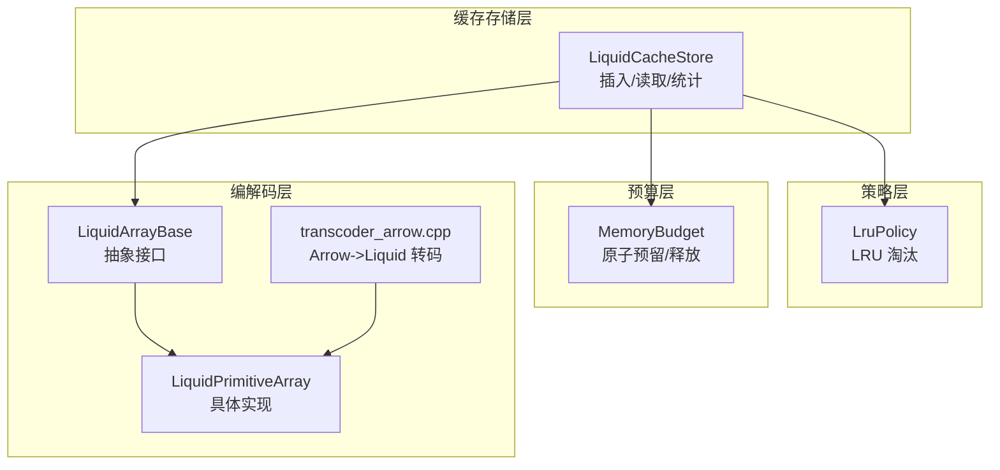
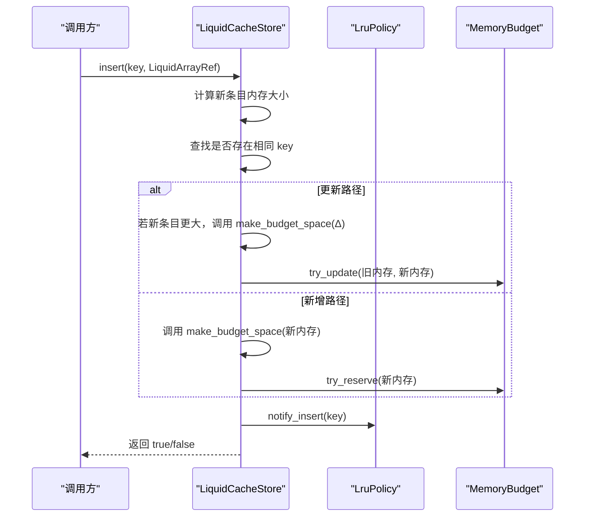
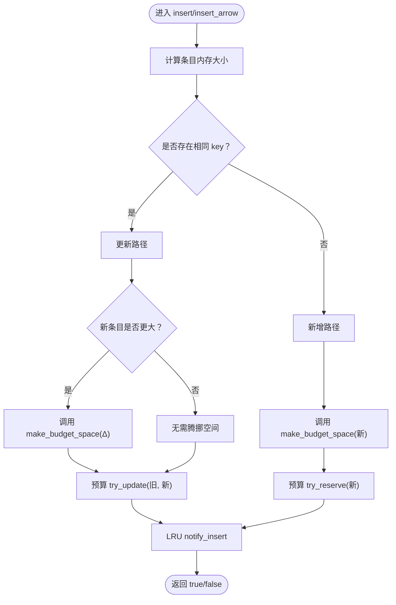
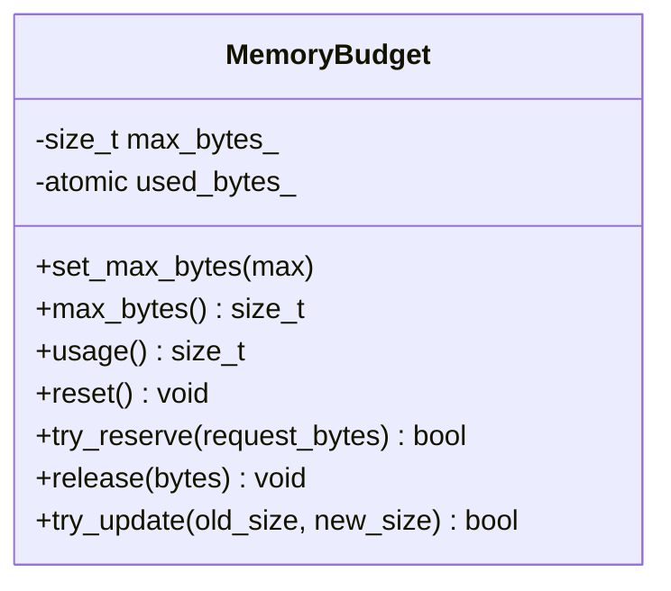
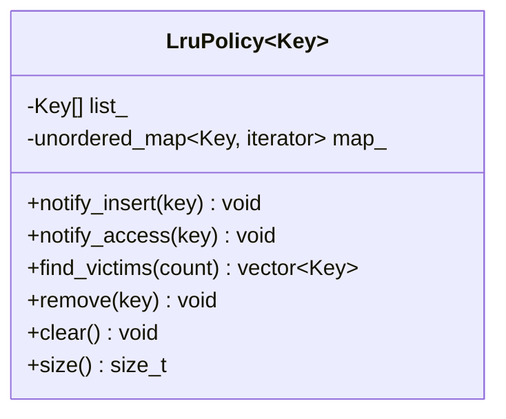
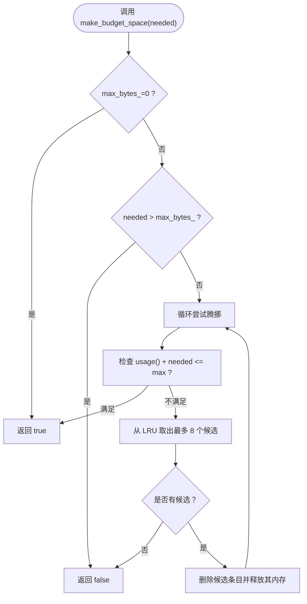
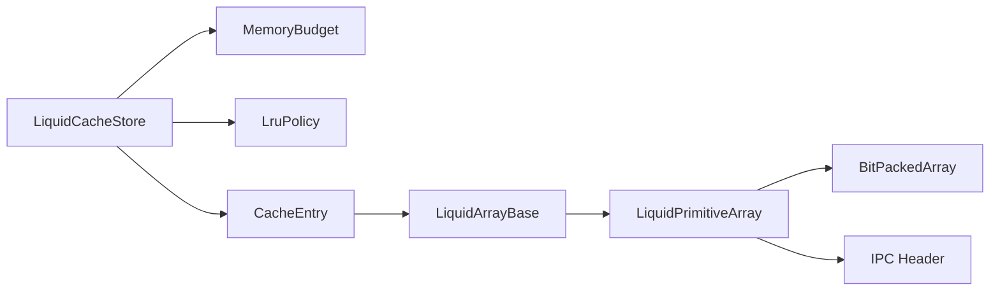

# 插入操作

<cite>
**本文档引用的文件**
- [liquid_cache_store.h](file://include/liquid_cache/liquid_cache_store.h)
- [lru_policy.h](file://include/liquid_cache/lru_policy.h)
- [liquid_array.h](file://include/liquid_cache/liquid_array.h)
- [liquid_arrays.h](file://include/liquid_cache/liquid_arrays.h)
- [ipc_header.h](file://include/liquid_cache/ipc_header.h)
- [test_cache_budget.cpp](file://tests/test_cache_budget.cpp)
- [transcoder_arrow.cpp](file://src/transcoder_arrow.cpp)
- [transcode_example.cpp](file://examples/transcode_example.cpp)
</cite>

## 目录
1. [简介](#简介)
2. [项目结构](#项目结构)
3. [核心组件](#核心组件)
4. [架构总览](#架构总览)
5. [详细组件分析](#详细组件分析)
6. [依赖关系分析](#依赖关系分析)
7. [性能考量](#性能考量)
8. [故障排查指南](#故障排查指南)
9. [结论](#结论)
10. [附录](#附录)

## 简介
本文件聚焦于缓存插入操作，系统性阐述 insert 与 insert_arrow 两大核心方法的实现原理、调用流程与使用方式。围绕内存预算检查、LRU 淘汰策略触发、预算预留机制、条目更新与新增的不同处理逻辑进行深入剖析，并详细解释 make_budget_space 的工作机制、LRU 条目淘汰算法以及预算超限时的处理策略。同时提供不同数据类型的插入示例（Liquid 编码数组、Arrow 原始数组、批量插入最佳实践），并给出错误处理与性能优化建议。

## 项目结构
本项目采用模块化设计，围绕“列式缓存存储 + LRU 淘汰 + 内存预算”三大核心模块组织代码：
- 缓存存储层：负责键值管理、条目读写、批量读取与统计
- LRU 策略层：维护访问顺序，提供淘汰候选
- 内存预算层：原子预留/释放，保障整体内存上限
- 编解码层：将 Arrow 数组转为 Liquid 结构，或直接缓存 Arrow 原始数组

图表来源
- [liquid_cache_store.h:188-527](file://include/liquid_cache/liquid_cache_store.h#L188-L527)
- [lru_policy.h:30-191](file://include/liquid_cache/lru_policy.h#L30-L191)
- [liquid_array.h:29-85](file://include/liquid_cache/liquid_array.h#L29-L85)
- [liquid_arrays.h:95-200](file://include/liquid_cache/liquid_arrays.h#L95-L200)
- [transcoder_arrow.cpp:34-200](file://src/transcoder_arrow.cpp#L34-L200)

章节来源
- [liquid_cache_store.h:188-527](file://include/liquid_cache/liquid_cache_store.h#L188-L527)
- [lru_policy.h:30-191](file://include/liquid_cache/lru_policy.h#L30-L191)
- [liquid_array.h:29-85](file://include/liquid_cache/liquid_array.h#L29-L85)
- [liquid_arrays.h:95-200](file://include/liquid_cache/liquid_arrays.h#L95-L200)
- [transcoder_arrow.cpp:34-200](file://src/transcoder_arrow.cpp#L34-L200)

## 核心组件
- LiquidCacheStore：提供 insert 与 insert_arrow 两大插入入口，内部协调内存预算与 LRU 策略，保证插入成功或明确失败返回值。
- MemoryBudget：线程安全的内存预算控制器，基于原子操作实现 try_reserve/try_update/release，避免锁竞争。
- LruPolicy：经典 LRU 实现，以 list + unordered_map 维护 MRU/LRU 顺序，提供 find_victims 用于批量淘汰。
- LiquidArrayBase/LiquidPrimitiveArray：抽象与具体实现，提供 to_arrow/filter/memory_size/length 等能力，支撑缓存条目的内存计量与读取。

章节来源
- [liquid_cache_store.h:218-274](file://include/liquid_cache/liquid_cache_store.h#L218-L274)
- [lru_policy.h:30-191](file://include/liquid_cache/lru_policy.h#L30-L191)
- [liquid_array.h:29-85](file://include/liquid_cache/liquid_array.h#L29-L85)
- [liquid_arrays.h:95-200](file://include/liquid_cache/liquid_arrays.h#L95-L200)

## 架构总览
插入流程的关键控制路径如下：
- insert：面向 LiquidArrayRef，先判断是否更新（旧条目更大需先腾挪空间），再原子更新预算，最后登记 LRU。
- insert_arrow：面向 Arrow 原始数组，处理逻辑与 insert 类似，区别在于条目内存计量来自 Arrow 的缓冲区大小。
- make_budget_space：在新条目插入前，循环从 LRU 获取候选，逐个释放其占用内存，直到满足所需空间或穷尽候选。
- LRU 与预算协同：每次插入后通知 LRU，访问时也通知 LRU，确保最近使用的条目优先保留。

图表来源
- [liquid_cache_store.h:222-245](file://include/liquid_cache/liquid_cache_store.h#L222-L245)
- [liquid_cache_store.h:491-517](file://include/liquid_cache/liquid_cache_store.h#L491-L517)
- [lru_policy.h:111-130](file://include/liquid_cache/lru_policy.h#L111-L130)
- [lru_policy.h:143-159](file://include/liquid_cache/lru_policy.h#L143-L159)
- [lru_policy.h:30-96](file://include/liquid_cache/lru_policy.h#L30-L96)

## 详细组件分析

### 插入方法：insert 与 insert_arrow
- 共同点
  - 均以互斥锁保护内部状态，确保线程安全
  - 均先计算条目内存大小（Liquid 由接口提供，Arrow 由缓冲区累加）
  - 均区分“更新”和“新增”两种路径，处理逻辑相似
- 不同点
  - insert 接收 LiquidArrayRef，内部以 CacheEntry::from_liquid 包装
  - insert_arrow 接收 Arrow 原始数组，内部以 CacheEntry::from_arrow 包装
  - 二者最终都调用 LRU 的 notify_insert，标记为最近使用

图表来源
- [liquid_cache_store.h:222-245](file://include/liquid_cache/liquid_cache_store.h#L222-L245)
- [liquid_cache_store.h:250-274](file://include/liquid_cache/liquid_cache_store.h#L250-L274)

章节来源
- [liquid_cache_store.h:222-274](file://include/liquid_cache/liquid_cache_store.h#L222-L274)

### 内存预算管理：MemoryBudget
- try_reserve(request_bytes)
  - 无限预算（max_bytes_=0）：直接原子累加使用量
  - 有限预算：使用 compare_exchange_weak 循环尝试原子增加，若超过上限立即失败
- try_update(old_size, new_size)
  - 若 new_size > old_size：等价于 try_reserve(new_size - old_size)
  - 若 new_size < old_size：等价于 release(old_size - new_size)
- release(bytes)：原子递减使用量
- 与 LRU 的配合：插入成功后通过 LRU 的 notify_insert/notify_access 维护访问顺序，避免被频繁淘汰

图表来源
- [lru_policy.h:30-96](file://include/liquid_cache/lru_policy.h#L30-L96)

章节来源
- [lru_policy.h:30-96](file://include/liquid_cache/lru_policy.h#L30-L96)

### LRU 淘汰策略：LruPolicy
- notify_insert(key)
  - 若 key 已存在：移动至 MRU（front）
  - 若 key 不存在：插入 front
- notify_access(key)
  - 若 key 存在：移动至 MRU（front）
- find_victims(count)
  - 从 LRU 末端（back）批量取出最多 count 个 key，作为淘汰候选
  - 适合在 make_budget_space 中循环调用，逐步释放内存
- remove/clear/size：辅助维护与统计

图表来源
- [lru_policy.h:111-188](file://include/liquid_cache/lru_policy.h#L111-L188)

章节来源
- [lru_policy.h:111-188](file://include/liquid_cache/lru_policy.h#L111-L188)

### make_budget_space：空间腾挪算法
- 目标：在插入前确保预算充足
- 策略：
  - 若 max_bytes_=0：无限制，直接返回 true
  - 若 needed_bytes > max_bytes_：直接返回 false
  - 否则：循环尝试释放 LRU 末端条目
    - 每轮从 LRU 取出最多 8 个候选（可调整）
    - 对每个候选，删除缓存条目并释放其内存
    - 每次释放后检查 usage() + needed_bytes 是否仍不超过上限
    - 若达到上限或穷尽候选，返回是否满足条件
- 限制：最多尝试 1024 次，防止极端情况下死循环

图表来源
- [liquid_cache_store.h:491-517](file://include/liquid_cache/liquid_cache_store.h#L491-L517)
- [lru_policy.h:143-159](file://include/liquid_cache/lru_policy.h#L143-L159)

章节来源
- [liquid_cache_store.h:491-517](file://include/liquid_cache/liquid_cache_store.h#L491-L517)

### 条目内存计量与类型差异
- LiquidArrayRef
  - 通过接口提供的 memory_size() 直接获得内存占用（字节）
  - 适合缓存压缩后的结构体，内存更紧凑
- Arrow 原始数组
  - 通过遍历 data()->buffers 累加各缓冲区大小，得到内存占用
  - 适合临时缓存原始 Arrow 数据，便于与 Arrow 生态交互

章节来源
- [liquid_cache_store.h:140-165](file://include/liquid_cache/liquid_cache_store.h#L140-L165)
- [liquid_cache_store.h:222-274](file://include/liquid_cache/liquid_cache_store.h#L222-L274)

### 编解码与插入示例
- Arrow->Liquid 编解码
  - transcoder_arrow.cpp 提供类型分派，将 Arrow 数组转为对应的 LiquidPrimitiveArray/LiquidFloatArray 等
  - 编码后通过 insert(key, LiquidArrayRef) 缓存
- 直接缓存 Arrow 原始数组
  - insert_arrow(key, ArrowArrayPtr) 直接缓存 Arrow 原始数组
- 批量插入最佳实践
  - 控制单次插入大小，避免触发多次 LRU 淘汰
  - 优先按列维度批量加载，减少锁竞争
  - 合理设置 max_cache_bytes，避免频繁淘汰

章节来源
- [transcoder_arrow.cpp:34-200](file://src/transcoder_arrow.cpp#L34-L200)
- [transcode_example.cpp:367-368](file://examples/transcode_example.cpp#L367-L368)

## 依赖关系分析
- LiquidCacheStore 依赖
  - MemoryBudget：预算预留/更新/释放
  - LruPolicy：淘汰候选选择
  - CacheEntry：封装 LiquidArrayRef/Arrow 原始数组
  - LiquidArrayBase：抽象接口，提供 to_arrow/filter/memory_size 等
- 编解码依赖
  - LiquidPrimitiveArray/LiquidFloatArray：具体编码实现
  - BitPackedArray：位打包工具
  - IPC Header：序列化头部格式

图表来源
- [liquid_cache_store.h:188-527](file://include/liquid_cache/liquid_cache_store.h#L188-L527)
- [liquid_array.h:29-85](file://include/liquid_cache/liquid_array.h#L29-L85)
- [liquid_arrays.h:95-200](file://include/liquid_cache/liquid_arrays.h#L95-L200)
- [ipc_header.h:86-117](file://include/liquid_cache/ipc_header.h#L86-L117)

章节来源
- [liquid_cache_store.h:188-527](file://include/liquid_cache/liquid_cache_store.h#L188-L527)
- [liquid_array.h:29-85](file://include/liquid_cache/liquid_array.h#L29-L85)
- [liquid_arrays.h:95-200](file://include/liquid_cache/liquid_arrays.h#L95-L200)
- [ipc_header.h:86-117](file://include/liquid_cache/ipc_header.h#L86-L117)

## 性能考量
- 原子预算预留
  - MemoryBudget 使用 compare_exchange_weak，避免锁竞争，提升并发性能
- LRU 批量淘汰
  - make_budget_space 每轮批量取 8 个候选，减少多次 LRU 访问开销
- 内存计量准确性
  - Liquid 编码数组 memory_size 更精确反映压缩后内存，有利于更合理的预算分配
- 批量加载策略
  - 按列维度批量加载，减少锁持有时间
  - 控制单次插入大小，避免频繁触发淘汰

## 故障排查指南
- 插入返回 false
  - 可能原因：条目过大超出预算上限；make_budget_space 无法腾挪足够空间
  - 排查要点：检查 max_cache_bytes、条目 memory_size、LRU 候选数量
- LRU 淘汰异常
  - 可能原因：notify_insert/notify_access 未正确调用；find_victims 返回空
  - 排查要点：确认插入/访问路径均调用 LRU 通知；检查 LRU 容量与使用情况
- Arrow 编解码失败
  - 可能原因：类型不支持或编解码异常
  - 排查要点：查看 transcoder_arrow.cpp 的类型分派与异常抛出位置
- 性能抖动
  - 可能原因：频繁触发 LRU 淘汰；锁竞争严重
  - 排查要点：增大预算；合并批量插入；减少热点列的频繁更新

章节来源
- [test_cache_budget.cpp:166-217](file://tests/test_cache_budget.cpp#L166-L217)
- [test_cache_budget.cpp:258-272](file://tests/test_cache_budget.cpp#L258-L272)
- [transcoder_arrow.cpp:34-200](file://src/transcoder_arrow.cpp#L34-L200)

## 结论
insert 与 insert_arrow 通过统一的内存预算与 LRU 策略协作，实现了稳定高效的缓存插入。make_budget_space 在插入前进行空间腾挪，结合 LRU 的 MRU 优先保留策略，有效平衡内存占用与命中率。对于不同数据类型，建议优先使用 Liquid 编码数组以降低内存占用；在批量插入场景中，合理规划预算与批量粒度，可显著提升整体性能与稳定性。

## 附录

### 使用示例（路径参考）
- Liquid 编码数组插入
  - 编解码入口：[transcoder_arrow.cpp:34-200](file://src/transcoder_arrow.cpp#L34-L200)
  - 插入调用：[liquid_cache_store.h:222-245](file://include/liquid_cache/liquid_cache_store.h#L222-L245)
- Arrow 原始数组插入
  - 插入调用：[liquid_cache_store.h:250-274](file://include/liquid_cache/liquid_cache_store.h#L250-L274)
- 批量插入最佳实践
  - 示例入口：[transcode_example.cpp:367-368](file://examples/transcode_example.cpp#L367-L368)
  - 预算与 LRU 行为验证：[test_cache_budget.cpp:166-217](file://tests/test_cache_budget.cpp#L166-L217)