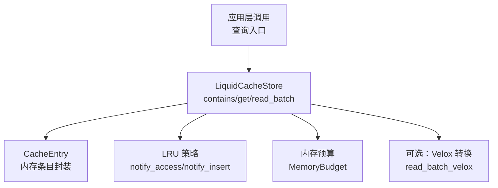
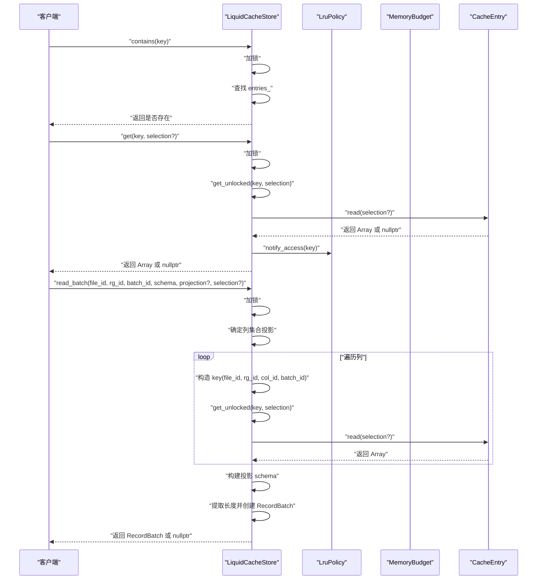
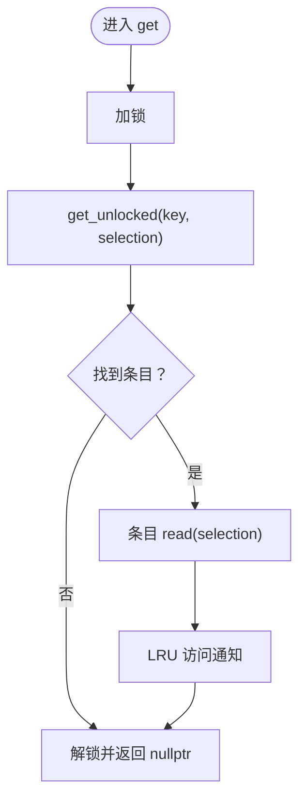
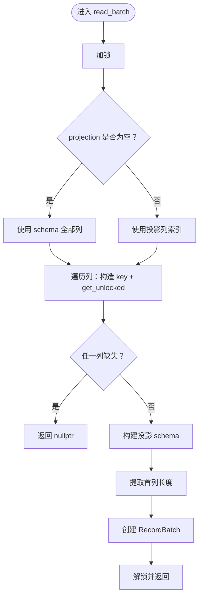
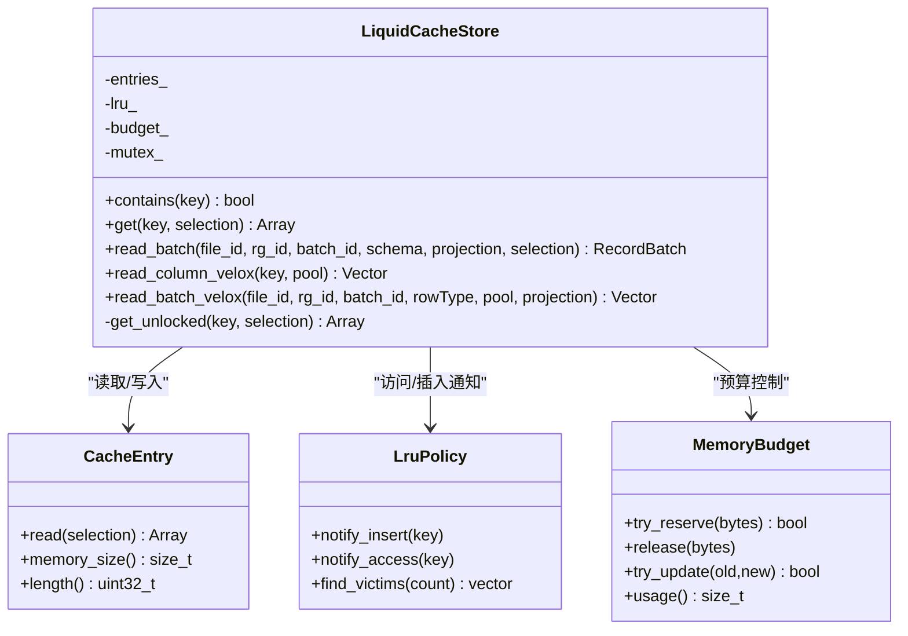

# 查询操作

<cite>
**本文档引用的文件**
- [README.md](file://README.md)
- [liquid_cache_store.h](file://include/liquid_cache/liquid_cache_store.h)
- [lru_policy.h](file://include/liquid_cache/lru_policy.h)
- [liquid_to_velox.cpp](file://src/liquid_to_velox.cpp)
- [transcode_example.cpp](file://examples/transcode_example.cpp)
- [test_cache_budget.cpp](file://tests/test_cache_budget.cpp)
</cite>

## 目录
1. [简介](#简介)
2. [项目结构](#项目结构)
3. [核心组件](#核心组件)
4. [架构总览](#架构总览)
5. [详细组件分析](#详细组件分析)
6. [依赖关系分析](#依赖关系分析)
7. [性能考量](#性能考量)
8. [故障排查指南](#故障排查指南)
9. [结论](#结论)
10. [附录](#附录)

## 简介
本文件聚焦于缓存查询操作，系统性阐述 contains、get、read_batch 等查询方法的实现与使用方式，覆盖单条目查询的完整流程（键存在性检查、条目获取、LRU 访问通知、选择性过滤），以及批量查询的列投影机制、行过滤功能与 RecordBatch 构建过程。文档同时提供丰富的使用示例场景（单列查询、多列投影、带过滤条件的查询、条件查询的性能优化），并解释查询操作的线程安全保证、异常处理机制与性能考虑因素。

## 项目结构
本仓库采用模块化设计，查询能力主要由缓存存储类与 LRU 策略共同实现，同时提供与 Velox 的直接向量转换以支持高性能分析引擎路径。核心文件如下：
- 查询与缓存：include/liquid_cache/liquid_cache_store.h
- LRU 策略与内存预算：include/liquid_cache/lru_policy.h
- Velox 转换实现（可选）：src/liquid_to_velox.cpp
- 示例与基准：examples/transcode_example.cpp
- 单元测试（含 LRU 与预算行为）：tests/test_cache_budget.cpp
- 项目说明与依赖：README.md

图表来源
- [liquid_cache_store.h:188-524](file://include/liquid_cache/liquid_cache_store.h#L188-L524)
- [lru_policy.h:30-96](file://include/liquid_cache/lru_policy.h#L30-L96)
- [liquid_to_velox.cpp:564-634](file://src/liquid_to_velox.cpp#L564-L634)

章节来源
- [README.md:1-120](file://README.md#L1-L120)
- [liquid_cache_store.h:1-120](file://include/liquid_cache/liquid_cache_store.h#L1-L120)

## 核心组件
- LiquidCacheStore：提供键存在性检查、单条目读取、批量读取（列投影 + 行过滤）、内存预算与 LRU 策略管理、可选的 Velox 向量读取等能力。
- CacheEntry：封装内存中的 Arrow 数组或 Liquid 结构，支持按布尔掩码进行行过滤。
- LruPolicy：维护最近最少使用顺序，提供插入/访问通知与受害者选择。
- MemoryBudget：原子化的内存预算跟踪，支持并发预留与释放。

章节来源
- [liquid_cache_store.h:101-173](file://include/liquid_cache/liquid_cache_store.h#L101-L173)
- [lru_policy.h:30-96](file://include/liquid_cache/lru_policy.h#L30-L96)
- [lru_policy.h:111-188](file://include/liquid_cache/lru_policy.h#L111-L188)

## 架构总览
查询操作围绕 LiquidCacheStore 展开，其内部通过互斥锁保护共享状态，结合 LRU 与内存预算实现高效的缓存淘汰与容量控制。批量查询通过列投影减少解码范围，行过滤在解码阶段应用布尔掩码，最终构建 RecordBatch 返回给上层。

图表来源
- [liquid_cache_store.h:278-356](file://include/liquid_cache/liquid_cache_store.h#L278-L356)
- [liquid_cache_store.h:471-478](file://include/liquid_cache/liquid_cache_store.h#L471-L478)
- [lru_policy.h:116-141](file://include/liquid_cache/lru_policy.h#L116-L141)

## 详细组件分析

### contains：键存在性检查
- 功能：判断指定键是否存在于缓存中。
- 实现要点：
  - 使用互斥锁保护 entries_ 查找。
  - 返回计数大于 0 的布尔值。
- 线程安全：完全受 mutex_ 保护，无并发竞争风险。
- 性能：哈希表查找 O(1)，加锁开销极小。

章节来源
- [liquid_cache_store.h:278-282](file://include/liquid_cache/liquid_cache_store.h#L278-L282)

### get：单条目查询与行过滤
- 功能：获取指定键对应的数组，支持可选的行过滤布尔掩码。
- 实现要点：
  - 加锁后调用内部 get_unlocked 获取条目。
  - 若成功获取，触发 LRU 访问通知（提升命中项优先级）。
  - 条目内部根据 selection 是否为空决定是否应用过滤：
    - Liquid 类型：调用 filter(selection)。
    - Arrow 类型：使用 arrow::compute::Filter 执行过滤，失败抛出异常。
- 线程安全：整体加锁，避免并发修改；LRU 访问通知在持有锁期间完成。
- 异常处理：Arrow 过滤失败时抛出 runtime_error，调用方应捕获处理。
- 性能：避免不必要的序列化/反序列化，直接在内存结构上进行过滤。

图表来源
- [liquid_cache_store.h:284-295](file://include/liquid_cache/liquid_cache_store.h#L284-L295)
- [liquid_cache_store.h:471-478](file://include/liquid_cache/liquid_cache_store.h#L471-L478)
- [liquid_cache_store.h:116-138](file://include/liquid_cache/liquid_cache_store.h#L116-L138)

章节来源
- [liquid_cache_store.h:284-295](file://include/liquid_cache/liquid_cache_store.h#L284-L295)
- [liquid_cache_store.h:116-138](file://include/liquid_cache/liquid_cache_store.h#L116-L138)

### read_batch：批量查询与列投影
- 功能：从缓存中读取一个批次的 RecordBatch，支持列投影与行过滤。
- 实现要点：
  - 加锁后确定要读取的列集合（投影）：若 projection 为空则读取 schema 全部列。
  - 遍历每列，构造 key(file_id, rg_id, col_id, batch_id)，调用 get_unlocked 获取数组。
  - 若任一列缺失，立即返回 nullptr（短路）。
  - 构建投影后的 schema（保留原字段定义）。
  - 提取首列长度作为 RecordBatch 行数，移动数组列表创建 RecordBatch。
- 行过滤：selection 传入到 get_unlocked，再由条目内部应用到具体数组。
- 线程安全：整体加锁，避免并发修改；列循环内逐列读取，保证一致性。
- 性能：仅解码所需列，减少内存与 CPU 开销；RecordBatch 构建避免重复拷贝。

图表来源
- [liquid_cache_store.h:311-356](file://include/liquid_cache/liquid_cache_store.h#L311-L356)
- [liquid_cache_store.h:471-478](file://include/liquid_cache/liquid_cache_store.h#L471-L478)

章节来源
- [liquid_cache_store.h:299-356](file://include/liquid_cache/liquid_cache_store.h#L299-L356)

### Velox 路径：read_batch_velox
- 功能：在启用 Velox 集成时，将缓存中的列直接解码为 Velox 向量，支持列投影。
- 实现要点：
  - 与 read_batch 类似，先确定列集合（投影）。
  - 逐列读取，要求条目类型为 MemoryLiquid，否则返回 nullptr。
  - 将各列转换为 Velox 向量，构建 RowVector 并返回。
- 适用场景：与 Velox 引擎对接，避免 Arrow 中间层开销。
- 注意：仅在编译时启用 LIQUID_ENABLE_VELOX 时可用。

章节来源
- [liquid_to_velox.cpp:581-634](file://src/liquid_to_velox.cpp#L581-L634)
- [liquid_cache_store.h:461-467](file://include/liquid_cache/liquid_cache_store.h#L461-L467)

## 依赖关系分析
- 组件耦合：
  - LiquidCacheStore 依赖 CacheEntry（封装内存数组）、LruPolicy（LRU 策略）、MemoryBudget（预算控制）。
  - get_unlocked 与 CacheEntry 的 read(selection) 直接耦合，实现行过滤。
  - read_batch 依赖 Arrow 的 RecordBatch 构造与 schema 抽取。
- 外部依赖：
  - Arrow：用于数组、记录批次、计算函数（过滤）。
  - 可选：Velox：用于直接向量转换与 RowVector 构建。
- 循环依赖：无显式循环，查询路径为单向依赖。

图表来源
- [liquid_cache_store.h:188-524](file://include/liquid_cache/liquid_cache_store.h#L188-L524)
- [lru_policy.h:30-96](file://include/liquid_cache/lru_policy.h#L30-L96)
- [lru_policy.h:111-188](file://include/liquid_cache/lru_policy.h#L111-L188)

章节来源
- [liquid_cache_store.h:188-524](file://include/liquid_cache/liquid_cache_store.h#L188-L524)
- [lru_policy.h:30-96](file://include/liquid_cache/lru_policy.h#L30-L96)

## 性能考量
- 列投影与行过滤：
  - read_batch 仅解码投影列，显著降低内存与 CPU 压力。
  - 行过滤在解码阶段应用布尔掩码，避免后续阶段的二次过滤。
- 内存预算与 LRU：
  - MemoryBudget 使用原子 CAS 实现 lock-free 预留，降低锁竞争。
  - LruPolicy 在互斥锁保护下维护 MRU/LRU 顺序，避免频繁扫描。
- 零序列化读取：
  - CacheEntry 直接访问内存中的 Arrow 或 Liquid 结构，避免序列化/反序列化开销。
- Velox 路径：
  - 直接解码为 Velox 向量，减少 Arrow 中间层，适合与 Velox 引擎深度集成。
- 示例参考：
  - 基准示例展示了不同投影场景下的性能对比，可作为优化参考。

章节来源
- [liquid_cache_store.h:299-356](file://include/liquid_cache/liquid_cache_store.h#L299-L356)
- [lru_policy.h:30-96](file://include/liquid_cache/lru_policy.h#L30-L96)
- [transcode_example.cpp:432-457](file://examples/transcode_example.cpp#L432-L457)

## 故障排查指南
- 查询返回空指针（nullptr）：
  - 单条目：可能键不存在或条目缺失。
  - 批量：任一列缺失即返回 nullptr，检查投影列与键构造是否正确。
- 过滤失败（Arrow 过滤）：
  - 当 selection 非空且条目类型为 Arrow 时，过滤可能失败并抛出异常。
  - 建议：确认 selection 类型与数组类型匹配，或在调用前进行类型校验。
- LRU 行为异常：
  - get() 成功后应触发 LRU 访问通知，避免被误判为“冷”条目。
  - 可通过单元测试验证 LRU 行为（如访问提升、插入覆盖等）。
- 预算不足：
  - 插入新条目时可能因预算不足而失败或触发淘汰。
  - 建议：合理设置最大缓存大小，监控预算使用情况。

章节来源
- [liquid_cache_store.h:116-138](file://include/liquid_cache/liquid_cache_store.h#L116-L138)
- [liquid_cache_store.h:284-295](file://include/liquid_cache/liquid_cache_store.h#L284-L295)
- [test_cache_budget.cpp:100-148](file://tests/test_cache_budget.cpp#L100-L148)
- [test_cache_budget.cpp:219-245](file://tests/test_cache_budget.cpp#L219-L245)

## 结论
本查询体系以 LiquidCacheStore 为核心，结合 CacheEntry 的零序列化读取、LRU 与内存预算的协同，实现了高效、可控的缓存查询路径。单条目查询通过 contains、get 完成键存在性检查与按需过滤；批量查询通过列投影与行过滤进一步降低资源消耗。在启用 Velox 集成时，可直接解码为向量，满足高性能分析场景。建议在实际使用中：
- 明确列投影与过滤条件，最大化利用列投影优势；
- 关注预算与 LRU 行为，避免误淘汰；
- 在需要与 Velox 引擎集成时启用 read_batch_velox 路径。

## 附录

### 使用示例与最佳实践
- 单列查询
  - 场景：仅读取某一列，避免解码其他列。
  - 建议：使用 read_batch 并传入仅包含该列索引的 projection。
- 多列投影查询
  - 场景：分析场景中只关心部分列。
  - 建议：预先规划列集，减少解码与内存占用。
- 带过滤条件的查询
  - 场景：按布尔掩码过滤行。
  - 建议：在 get/read_batch 时传入 selection，避免后续阶段二次过滤。
- 条件查询的性能优化
  - 场景：基于谓词的快速评估（如某些数组类型支持谓词预评估）。
  - 建议：优先使用列投影与行过滤，必要时结合谓词评估减少无效解码。
- 线程安全与异常处理
  - 线程安全：所有公共接口均在互斥锁保护下执行，可安全并发调用。
  - 异常处理：Arrow 过滤失败会抛出异常，应在调用侧捕获并处理。

章节来源
- [liquid_cache_store.h:278-356](file://include/liquid_cache/liquid_cache_store.h#L278-L356)
- [liquid_cache_store.h:116-138](file://include/liquid_cache/liquid_cache_store.h#L116-L138)
- [transcode_example.cpp:432-457](file://examples/transcode_example.cpp#L432-L457)