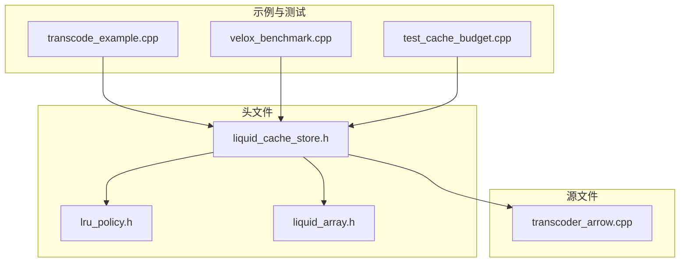
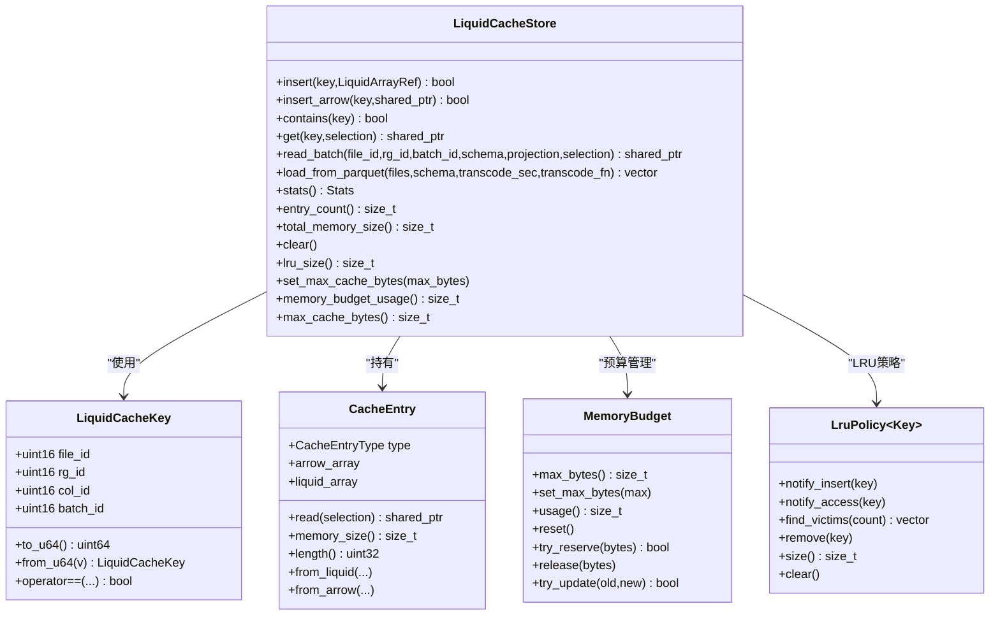
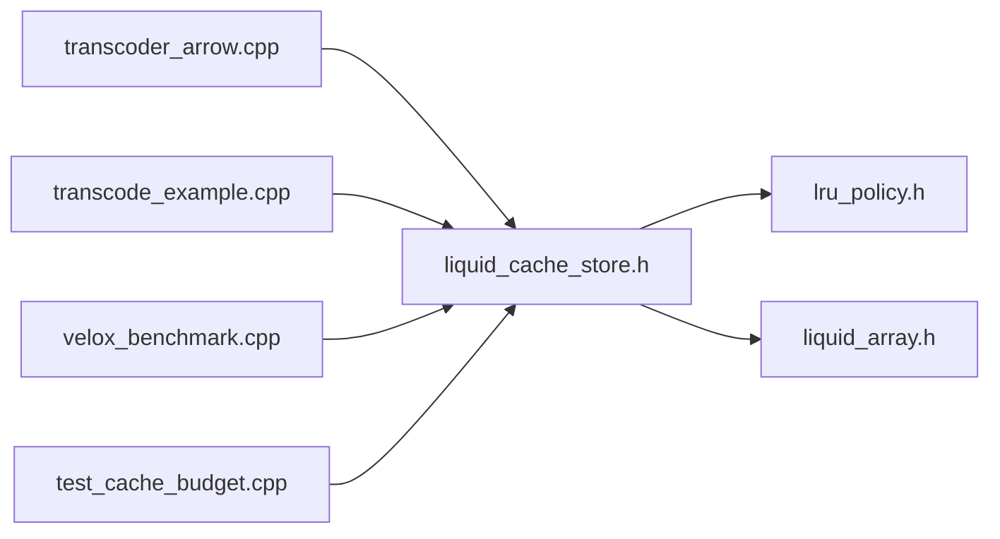
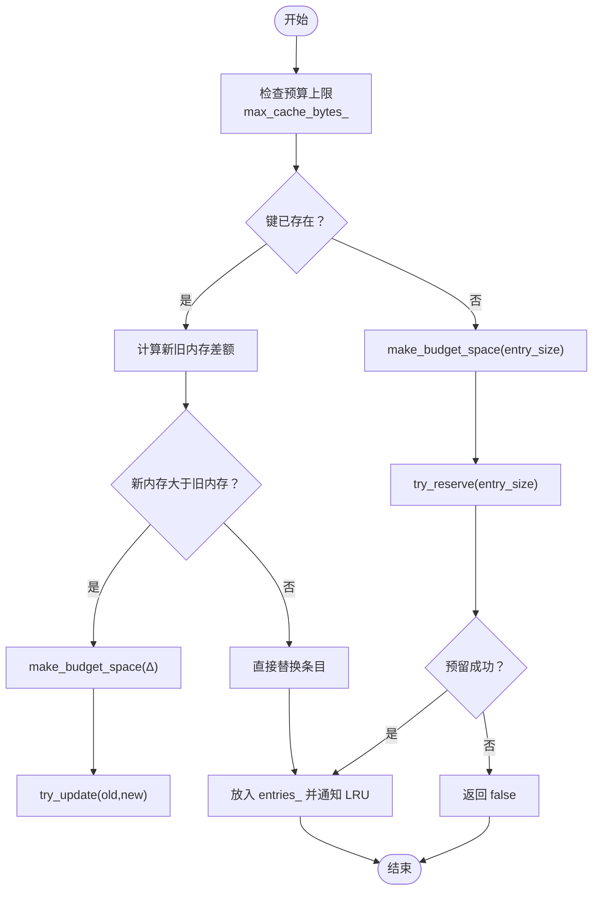
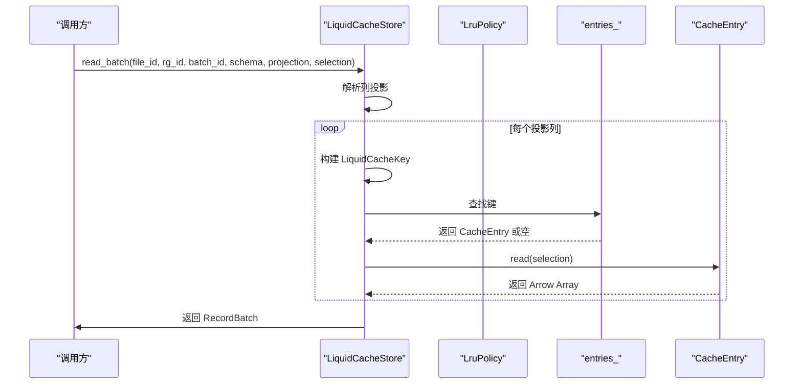

# 缓存 API

<cite>
**本文引用的文件列表**
- [liquid_cache_store.h](file://include/liquid_cache/liquid_cache_store.h)
- [lru_policy.h](file://include/liquid_cache/lru_policy.h)
- [liquid_array.h](file://include/liquid_cache/liquid_array.h)
- [transcoder_arrow.cpp](file://src/transcoder_arrow.cpp)
- [test_cache_budget.cpp](file://tests/test_cache_budget.cpp)
- [transcode_example.cpp](file://examples/transcode_example.cpp)
- [velox_benchmark.cpp](file://examples/velox_benchmark.cpp)
</cite>

## 目录
1. [简介](#简介)
2. [项目结构](#项目结构)
3. [核心组件](#核心组件)
4. [架构总览](#架构总览)
5. [详细组件分析](#详细组件分析)
6. [依赖关系分析](#依赖关系分析)
7. [性能考量](#性能考量)
8. [故障排查指南](#故障排查指南)
9. [结论](#结论)
10. [附录](#附录)

## 简介
本文件为 LiquidCacheStore 缓存 API 的权威文档，面向使用者与维护者，系统性阐述以下内容：
- LiquidCacheStore 的公共接口：构造、插入、查询、批量读取、统计与清理等
- 缓存键结构与使用方式（file_id、rg_id、col_id、batch_id）
- 内存预算管理机制与 LRU 淘汰策略
- 线程安全与并发访问要点
- 性能优化最佳实践与常见使用场景（单列缓存、批量缓存加载、条件查询）

## 项目结构
本项目采用头文件声明 + 源文件实现的组织方式，核心头文件位于 include/liquid_cache 目录，示例与测试分别位于 examples 与 tests 目录。与缓存 API 直接相关的关键文件如下：
- include/liquid_cache/liquid_cache_store.h：缓存存储器主体定义
- include/liquid_cache/lru_policy.h：内存预算与 LRU 策略
- include/liquid_cache/liquid_array.h：液态数组抽象与包装
- src/transcoder_arrow.cpp：Parquet 批量加载到缓存的实现
- tests/test_cache_budget.cpp：缓存预算与 LRU 行为的单元测试
- examples/transcode_example.cpp：缓存加载与基准测试示例
- examples/velox_benchmark.cpp：与 Velox 集成的基准测试示例

图表来源
- [liquid_cache_store.h:188-527](file://include/liquid_cache/liquid_cache_store.h#L188-L527)
- [lru_policy.h:30-191](file://include/liquid_cache/lru_policy.h#L30-L191)
- [liquid_array.h:29-85](file://include/liquid_cache/liquid_array.h#L29-L85)
- [transcoder_arrow.cpp:664-746](file://src/transcoder_arrow.cpp#L664-L746)
- [transcode_example.cpp:364-489](file://examples/transcode_example.cpp#L364-L489)
- [velox_benchmark.cpp:662-668](file://examples/velox_benchmark.cpp#L662-L668)
- [test_cache_budget.cpp:166-388](file://tests/test_cache_budget.cpp#L166-L388)

章节来源
- [liquid_cache_store.h:188-527](file://include/liquid_cache/liquid_cache_store.h#L188-L527)
- [lru_policy.h:30-191](file://include/liquid_cache/lru_policy.h#L30-L191)
- [liquid_array.h:29-85](file://include/liquid_cache/liquid_array.h#L29-L85)
- [transcoder_arrow.cpp:664-746](file://src/transcoder_arrow.cpp#L664-L746)
- [transcode_example.cpp:364-489](file://examples/transcode_example.cpp#L364-L489)
- [velox_benchmark.cpp:662-668](file://examples/velox_benchmark.cpp#L662-L668)
- [test_cache_budget.cpp:166-388](file://tests/test_cache_budget.cpp#L166-L388)

## 核心组件
- LiquidCacheStore：缓存存储器，支持列式缓存、投影读取、行过滤、零反序列化读取、内存预算控制与 LRU 淘汰
- LiquidCacheKey：缓存键，由 file_id、rg_id、col_id、batch_id 组成，打包为 uint64 以提升哈希与比较效率
- CacheEntry：缓存条目，支持 Arrow 原始数组与液态数组两种类型，提供统一的读取、内存大小与长度查询
- MemoryBudget：内存预算管理器，无锁原子预留与释放，支持上限检查与更新
- LruPolicy：LRU 淘汰策略，基于双向链表 + 哈希表，支持插入通知、访问通知与受害者选择

章节来源
- [liquid_cache_store.h:48-173](file://include/liquid_cache/liquid_cache_store.h#L48-L173)
- [lru_policy.h:30-191](file://include/liquid_cache/lru_policy.h#L30-L191)

## 架构总览
LiquidCacheStore 采用“列式缓存 + 投影 + 过滤”的设计，核心流程：
- 插入：将 Arrow 列或液态数组封装为 CacheEntry，按键索引存储；若超出预算则通过 LRU 逐出受害者
- 查询：单键 get 支持可选行过滤；批量 read_batch 支持列投影与行过滤
- 加载：从 Parquet 文件批量转码为液态数组并写入缓存
- 统计：提供条目数、总内存、液态/箭头条目数、预算使用情况等

图表来源
- [liquid_cache_store.h:48-527](file://include/liquid_cache/liquid_cache_store.h#L48-L527)
- [lru_policy.h:30-191](file://include/liquid_cache/lru_policy.h#L30-L191)

## 详细组件分析

### 缓存键结构与使用
- 键字段：file_id（文件标识）、rg_id（行组标识）、col_id（列索引）、batch_id（批内序号）
- 键打包：to_u64 将四个 16 位字段打包为一个 uint64，便于哈希与比较
- 键解包：from_u64 反向拆分
- 使用方式：用于定位特定列在特定行组与批中的数据；批量读取时按列投影组合多个键

章节来源
- [liquid_cache_store.h:48-78](file://include/liquid_cache/liquid_cache_store.h#L48-L78)

### 缓存条目与读取
- 类型：MemoryArrow（原始 Arrow 数组）、MemoryLiquid（液态编码数组）
- 读取：read(selection) 支持可选布尔掩码过滤；Arrow 路径使用 Arrow 计算库过滤；Liquid 路径优先使用原生过滤
- 内存大小：memory_size 返回字节数；length 返回元素个数
- 创建：from_liquid/from_arrow 工厂方法

章节来源
- [liquid_cache_store.h:111-173](file://include/liquid_cache/liquid_cache_store.h#L111-L173)
- [liquid_array.h:39-85](file://include/liquid_cache/liquid_array.h#L39-L85)

### 插入操作
- insert：插入液态数组；若键已存在，先按差额尝试预算更新，再替换；否则先腾挪空间再预留
- insert_arrow：插入 Arrow 原始数组；逻辑同上
- 预算检查：make_budget_space 在必要时逐出 LRU 受害者，直到满足所需空间
- 成功条件：返回 true 表示成功插入；当条目过大超过预算上限时返回 false

章节来源
- [liquid_cache_store.h:219-274](file://include/liquid_cache/liquid_cache_store.h#L219-L274)
- [liquid_cache_store.h:480-517](file://include/liquid_cache/liquid_cache_store.h#L480-L517)

### 查询与批量读取
- contains：判断键是否存在
- get：单键读取，支持可选 selection 过滤；命中后通知 LRU 提升访问热度
- read_batch：按列投影读取 RecordBatch；内部为每列构建键并调用 get，最后合并为 RecordBatch
- 行过滤：selection 为可选布尔数组，用于筛选行

章节来源
- [liquid_cache_store.h:278-356](file://include/liquid_cache/liquid_cache_store.h#L278-L356)

### 批量加载与转码
- load_from_parquet：从一组 Parquet 文件批量加载，逐批逐列转码为液态数组并写入缓存；失败列回退为 Arrow 原始数组
- 返回：RowGroupInfo 向量，包含每个文件/行组的批次数与总行数；transcode_sec 返回转码耗时
- 示例：examples/transcode_example.cpp 展示了如何调用该方法进行缓存加载与基准测试

章节来源
- [liquid_cache_store.h:378-383](file://include/liquid_cache/liquid_cache_store.h#L378-L383)
- [transcoder_arrow.cpp:664-746](file://src/transcoder_arrow.cpp#L664-L746)
- [transcode_example.cpp:364-369](file://examples/transcode_example.cpp#L364-L369)

### 统计与清理
- stats：返回条目数、总内存、液态/箭头条目数、预算使用与上限
- entry_count/total_memory_size：快速统计
- clear：清空缓存、重置预算、清空 LRU
- lru_size：返回 LRU 中跟踪的条目数

章节来源
- [liquid_cache_store.h:387-434](file://include/liquid_cache/liquid_cache_store.h#L387-L434)

### 内存预算与 LRU 策略
- MemoryBudget：无锁原子预留/释放；try_update 支持增长与收缩；usage/reset/set_max_bytes
- LruPolicy：notify_insert/notify_access 将键移动至最前；find_victims 从末尾选取受害者；remove/clear/size

章节来源
- [lru_policy.h:30-191](file://include/liquid_cache/lru_policy.h#L30-L191)

### 线程安全与并发
- 全局互斥：所有公共接口均通过 mutex_ 保护，确保插入、查询、统计、清理等操作的线程安全
- LRU 与预算：LRU 与 MemoryBudget 内部也各自持有互斥锁，避免竞争条件

章节来源
- [liquid_cache_store.h:519-523](file://include/liquid_cache/liquid_cache_store.h#L519-L523)
- [lru_policy.h:118-187](file://include/liquid_cache/lru_policy.h#L118-L187)

### 异常与错误处理
- CacheEntry::read 对 Arrow 过滤失败抛出异常
- LiquidArrayBase::filter 默认实现中，Arrow 过滤失败抛出异常
- load_from_parquet 对无法打开/读取文件的情况跳过并继续处理后续文件
- insert/insert_arrow 当条目过大或预算不足时返回 false，不抛异常

章节来源
- [liquid_cache_store.h:118-138](file://include/liquid_cache/liquid_cache_store.h#L118-L138)
- [liquid_array.h:52-59](file://include/liquid_cache/liquid_array.h#L52-L59)
- [transcoder_arrow.cpp:674-677](file://src/transcoder_arrow.cpp#L674-L677)

### 使用示例与场景
- 单列缓存：使用 insert 或 insert_arrow 存储单列键值，随后 get 获取并可选过滤
- 批量缓存加载：调用 load_from_parquet 将多文件多列批量转码并写入缓存
- 条件查询：get/read_batch 提供 selection 参数进行行过滤
- Velox 集成：在启用 LIQUID_ENABLE_VELOX 时，可通过 read_batch_velox/read_column_velox 直接输出 Velox 向量

章节来源
- [transcode_example.cpp:364-489](file://examples/transcode_example.cpp#L364-L489)
- [velox_benchmark.cpp:662-668](file://examples/velox_benchmark.cpp#L662-L668)
- [liquid_cache_store.h:441-468](file://include/liquid_cache/liquid_cache_store.h#L441-L468)

## 依赖关系分析

图表来源
- [liquid_cache_store.h:30-31](file://include/liquid_cache/liquid_cache_store.h#L30-L31)
- [lru_policy.h:13-18](file://include/liquid_cache/lru_policy.h#L13-L18)
- [liquid_array.h:17-25](file://include/liquid_cache/liquid_array.h#L17-L25)
- [transcoder_arrow.cpp:664-746](file://src/transcoder_arrow.cpp#L664-L746)
- [transcode_example.cpp:364-489](file://examples/transcode_example.cpp#L364-L489)
- [velox_benchmark.cpp:662-668](file://examples/velox_benchmark.cpp#L662-L668)
- [test_cache_budget.cpp:166-388](file://tests/test_cache_budget.cpp#L166-L388)

## 性能考量
- 内存预算上限：通过 set_max_cache_bytes 控制最大内存；0 表示不限制。预算不足时插入返回 false，避免 OOM
- LRU 淘汰：find_victims 一次批量逐出，减少频繁锁竞争；get/insert 会通知 LRU 更新热度
- 零反序列化读取：缓存存储的是原生结构（非序列化字节），读取时直接解码为 Arrow 或 Velox，避免反序列化开销
- 批量加载：load_from_parquet 以批为单位读取，降低内存峰值与 I/O 开销
- 列投影与行过滤：read_batch 支持仅读取所需列与行，减少不必要的解码与拷贝
- 并发访问：所有公共接口加锁，适合多线程环境；建议在高并发下尽量减少长生命周期持有锁的操作

[本节为通用性能指导，无需具体文件引用]

## 故障排查指南
- 插入失败（返回 false）：检查条目是否过大、预算是否为 0、是否触发了预算上限
- 查询为空：确认键是否正确、是否已被 LRU 淘汰、selection 是否导致全过滤
- 预算统计异常：检查是否在插入过程中发生多次更新，或是否调用了 clear/reset
- LRU 不生效：确认是否通过 get 访问以提升热度，或是否在预算紧张时被逐出
- 测试参考：使用 tests/test_cache_budget.cpp 中的测试用例验证预算与 LRU 行为

章节来源
- [test_cache_budget.cpp:166-388](file://tests/test_cache_budget.cpp#L166-L388)

## 结论
LiquidCacheStore 提供了高性能、低反序列化开销的列式缓存能力，结合内存预算与 LRU 淘汰策略，在保证线程安全的同时实现了灵活的列投影与行过滤。通过合理的预算配置与批量加载策略，可在大规模数据分析场景中显著提升读取性能。

[本节为总结性内容，无需具体文件引用]

## 附录

### 接口速查（方法签名与行为概要）
- 构造与配置
  - LiquidCacheStore()：默认无预算限制
  - LiquidCacheStore(max_cache_bytes)：设置最大内存预算
  - set_max_cache_bytes(max_bytes)：动态调整预算上限
  - memory_budget_usage()/max_cache_bytes()：查询预算状态
- 插入
  - insert(key, LiquidArrayRef)：插入液态数组；返回是否成功
  - insert_arrow(key, Arrow Array)：插入 Arrow 原始数组；返回是否成功
- 查询
  - contains(key)：是否存在
  - get(key, selection=nullptr)：单键读取，可选行过滤
  - read_batch(file_id, rg_id, batch_id, schema, projection=[], selection=nullptr)：批量读取 RecordBatch
- 统计与清理
  - stats()：返回条目数、内存、预算等统计
  - entry_count()/total_memory_size()：快速统计
  - clear()：清空缓存、预算与 LRU
  - lru_size()：LRU 条目数
- 批量加载
  - load_from_parquet(files, schema&, transcode_sec&, transcode_fn)：批量加载并转码
- Velox 集成（可选）
  - load_from_parquet_for_velox(...)：加载为 Velox RowType
  - read_batch_velox(...) / read_column_velox(...)：直接输出 Velox 向量

章节来源
- [liquid_cache_store.h:190-468](file://include/liquid_cache/liquid_cache_store.h#L190-L468)

### 关键流程图：插入与淘汰

图表来源
- [liquid_cache_store.h:219-274](file://include/liquid_cache/liquid_cache_store.h#L219-L274)
- [liquid_cache_store.h:480-517](file://include/liquid_cache/liquid_cache_store.h#L480-L517)

### 关键流程图：批量读取

图表来源
- [liquid_cache_store.h:311-356](file://include/liquid_cache/liquid_cache_store.h#L311-L356)