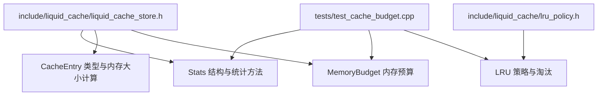
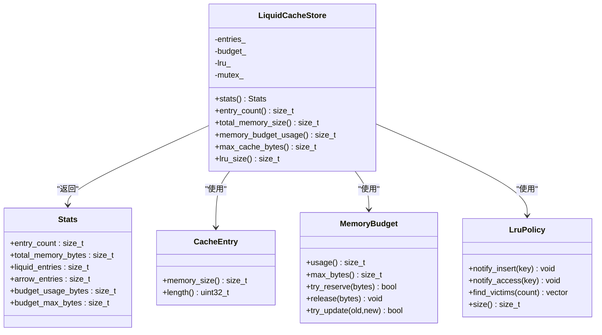
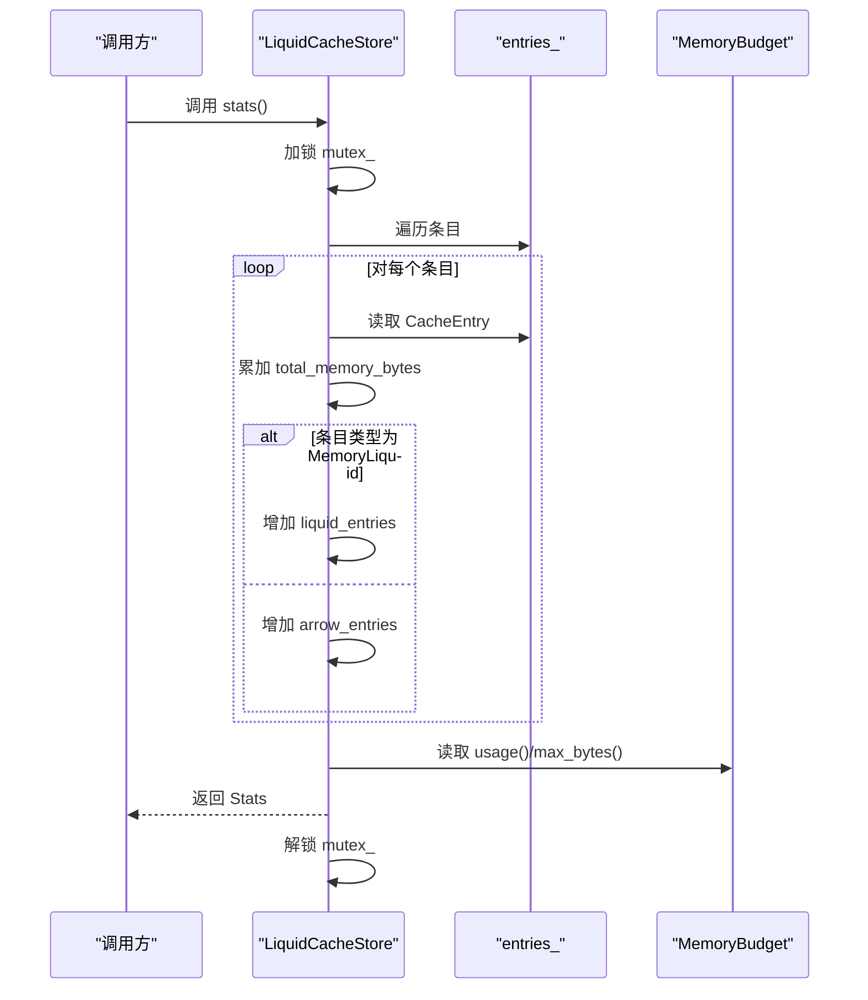
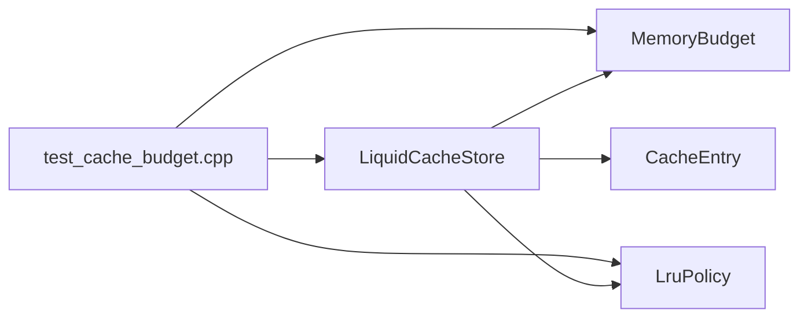

# 缓存统计

<cite>
**本文引用的文件列表**
- [liquid_cache_store.h](file://include/liquid_cache/liquid_cache_store.h)
- [lru_policy.h](file://include/liquid_cache/lru_policy.h)
- [test_cache_budget.cpp](file://tests/test_cache_budget.cpp)
- [README.md](file://README.md)
</cite>

## 目录
1. [简介](#简介)
2. [项目结构](#项目结构)
3. [核心组件](#核心组件)
4. [架构总览](#架构总览)
5. [详细组件分析](#详细组件分析)
6. [依赖关系分析](#依赖关系分析)
7. [性能考量](#性能考量)
8. [故障排查指南](#故障排查指南)
9. [结论](#结论)
10. [附录](#附录)

## 简介
本文件聚焦于缓存统计功能，系统性阐述 Stats 结构及其统计方法的实现与用途，覆盖以下要点：
- 统计指标含义：条目数量、总内存使用、Liquid 条目与 Arrow 条目的分布、预算使用情况
- 实时性保证与线程安全的统计更新机制
- 性能开销最小化的实现方式
- 使用场景与分析方法：缓存效率评估、内存使用监控、性能调优建议
- 统计信息的导出与可视化建议

## 项目结构
与缓存统计直接相关的核心文件位于 include/liquid_cache 目录中，主要涉及缓存存储、LRU 策略与内存预算三部分。测试文件提供了统计功能的验证用例。

图表来源
- [liquid_cache_store.h:386-437](file://include/liquid_cache/liquid_cache_store.h#L386-L437)
- [lru_policy.h:1-191](file://include/liquid_cache/lru_policy.h#L1-L191)
- [test_cache_budget.cpp:290-393](file://tests/test_cache_budget.cpp#L290-L393)

章节来源
- [liquid_cache_store.h:188-527](file://include/liquid_cache/liquid_cache_store.h#L188-L527)
- [lru_policy.h:1-191](file://include/liquid_cache/lru_policy.h#L1-L191)
- [test_cache_budget.cpp:290-393](file://tests/test_cache_budget.cpp#L290-L393)

## 核心组件
- Stats 结构：提供缓存状态快照，包含条目数量、总内存使用、Liquid/Arrow 条目分布、预算使用上限与当前使用量。
- 统计方法：
  - stats()：聚合当前缓存状态，返回 Stats
  - entry_count()：返回当前缓存条目数量
  - total_memory_size()：返回当前缓存总内存占用
  - memory_budget_usage()：返回预算当前使用量
  - max_cache_bytes()：返回预算上限
  - lru_size()：返回 LRU 策略跟踪的条目数量
- CacheEntry：封装缓存条目，提供 memory_size() 用于统计内存占用
- MemoryBudget：线程安全的内存预算跟踪器，支持原子预留、释放与更新
- LruPolicy：LRU 淘汰策略，维护访问顺序并在淘汰时移除条目

章节来源
- [liquid_cache_store.h:386-437](file://include/liquid_cache/liquid_cache_store.h#L386-L437)
- [liquid_cache_store.h:111-173](file://include/liquid_cache/liquid_cache_store.h#L111-L173)
- [lru_policy.h:30-96](file://include/liquid_cache/lru_policy.h#L30-L96)
- [lru_policy.h:111-188](file://include/liquid_cache/lru_policy.h#L111-L188)

## 架构总览
缓存统计围绕 LiquidCacheStore 展开，其内部持有：
- entries_：键到缓存条目的映射
- budget_：MemoryBudget 实例，负责预算预留与释放
- lru_：LruPolicy 实例，负责淘汰与访问顺序管理
- mutex_：保护上述共享状态的互斥锁

stats() 在获取互斥锁后遍历 entries_，累加内存大小并统计类型分布，同时读取预算使用与上限。entry_count() 与 total_memory_size() 提供更细粒度的快速查询。

图表来源
- [liquid_cache_store.h:188-527](file://include/liquid_cache/liquid_cache_store.h#L188-L527)
- [liquid_cache_store.h:386-437](file://include/liquid_cache/liquid_cache_store.h#L386-L437)
- [lru_policy.h:30-96](file://include/liquid_cache/lru_policy.h#L30-L96)
- [lru_policy.h:111-188](file://include/liquid_cache/lru_policy.h#L111-L188)

## 详细组件分析

### Stats 结构与统计方法
- 字段含义
  - entry_count：当前缓存条目数量
  - total_memory_bytes：所有条目占用的总内存字节
  - liquid_entries：类型为 MemoryLiquid 的条目数量
  - arrow_entries：类型为 MemoryArrow 的条目数量
  - budget_usage_bytes：预算当前使用量
  - budget_max_bytes：预算上限（0 表示无限制）
- 实现要点
  - stats() 在进入临界区后一次性遍历 entries_，避免重复扫描
  - 通过 CacheEntry::memory_size() 获取条目内存大小，确保统计口径一致
  - 通过 budget_.usage() 与 budget_.max_bytes() 获取预算状态
  - entry_count() 与 total_memory_size() 提供 O(n) 的轻量统计，适合频繁调用

图表来源
- [liquid_cache_store.h:396-408](file://include/liquid_cache/liquid_cache_store.h#L396-L408)
- [liquid_cache_store.h:111-173](file://include/liquid_cache/liquid_cache_store.h#L111-L173)
- [lru_policy.h:30-96](file://include/liquid_cache/lru_policy.h#L30-L96)

章节来源
- [liquid_cache_store.h:386-437](file://include/liquid_cache/liquid_cache_store.h#L386-L437)
- [liquid_cache_store.h:111-173](file://include/liquid_cache/liquid_cache_store.h#L111-L173)

### CacheEntry 与内存统计
- memory_size()：根据条目类型返回内存字节数
  - MemoryLiquid：调用底层结构的 memory_size()
  - MemoryArrow：累加所有缓冲区的大小
- length()：返回元素个数，便于与内存占用对比进行缓存密度分析

章节来源
- [liquid_cache_store.h:140-164](file://include/liquid_cache/liquid_cache_store.h#L140-L164)

### MemoryBudget 与预算统计
- 线程安全
  - usage() 使用 relaxed 内存序读取，开销极低
  - try_reserve() 使用 compare_exchange_weak 实现无锁预留
  - release() 使用 fetch_sub 减少使用量
- 统计口径
  - budget_usage_bytes：stats() 读取 budget_.usage()
  - budget_max_bytes：stats() 读取 budget_.max_bytes()

章节来源
- [lru_policy.h:30-96](file://include/liquid_cache/lru_policy.h#L30-L96)
- [liquid_cache_store.h:396-408](file://include/liquid_cache/liquid_cache_store.h#L396-L408)

### LRU 策略与统计
- lru_size()：返回 LRU 策略跟踪的条目数量，可用于评估缓存命中与淘汰压力
- LruPolicy 的 find_victims() 在淘汰时从 LRU 尾部选取条目，stats() 中不会直接反映淘汰行为，但可通过 entry_count() 与 lru_size() 的差异观察策略效果

章节来源
- [lru_policy.h:111-188](file://include/liquid_cache/lru_policy.h#L111-L188)
- [liquid_cache_store.h:431-434](file://include/liquid_cache/liquid_cache_store.h#L431-L434)

### 统计方法的线程安全与实时性
- 线程安全
  - stats()、entry_count()、total_memory_size()、memory_budget_usage()、max_cache_bytes()、lru_size() 均在进入临界区后读取，避免并发修改导致的数据竞争
  - MemoryBudget 的 usage() 使用 relaxed 读取，不加锁，读取成本极低
- 实时性
  - stats() 返回的是调用时刻的快照，包含 entries_ 的当前状态与预算使用
  - LRU 访问与插入会更新 LRU 顺序，但不会影响已统计的 entries_ 集合，因此统计结果是“当时”的真实反映

章节来源
- [liquid_cache_store.h:396-437](file://include/liquid_cache/liquid_cache_store.h#L396-L437)
- [lru_policy.h:30-96](file://include/liquid_cache/lru_policy.h#L30-L96)

### 性能开销最小化
- 无锁预算读取：MemoryBudget::usage() 使用 relaxed 内存序，避免锁竞争
- 延迟锁：stats() 等方法在必要时才加锁，且只在统计期间持有锁
- 批量统计：entry_count() 与 total_memory_size() 通过一次遍历完成，减少多次扫描带来的开销
- 类型分布统计：在遍历过程中同时统计 Liquid/Arrow 条目数量，避免二次扫描

章节来源
- [lru_policy.h:30-96](file://include/liquid_cache/lru_policy.h#L30-L96)
- [liquid_cache_store.h:396-437](file://include/liquid_cache/liquid_cache_store.h#L396-L437)

### 使用场景与分析方法
- 缓存效率评估
  - 通过 total_memory_bytes 与 entry_count 的比值估算平均条目大小，结合 length() 评估数据密度
  - liquid_entries 与 arrow_entries 的比例反映缓存中不同编码的比例，有助于评估压缩收益
- 内存使用监控
  - budget_usage_bytes 与 budget_max_bytes 的比值用于监控预算占用率，接近上限时应考虑调整预算或优化数据结构
  - total_memory_size() 与 entry_count() 的趋势图可用于识别内存增长异常
- 性能调优建议
  - 若 liquid_entries 占比高且内存占用大，可考虑增大预算上限以减少淘汰
  - 若 arrow_entries 占比高，可评估是否需要引入更多 Liquid 编码以降低内存占用
  - 结合 lru_size() 与 entry_count() 的差异评估淘汰频率，过高可能意味着预算过小或热点数据过多

章节来源
- [liquid_cache_store.h:386-437](file://include/liquid_cache/liquid_cache_store.h#L386-L437)
- [lru_policy.h:111-188](file://include/liquid_cache/lru_policy.h#L111-L188)

### 导出与可视化建议
- 导出
  - 将 stats() 的结果序列化为 JSON/CSV，记录时间戳、条目数量、总内存、Liquid/Arrow 分布、预算使用与上限
  - 采集周期建议：每秒或每分钟一次，具体取决于业务负载与统计成本
- 可视化
  - 折线图：总内存使用、预算使用占比、条目数量随时间变化
  - 柱状图：Liquid/Arrow 条目分布占比
  - 散点图：平均条目大小与数据密度的关系
  - 热力图：按列或批次维度展示内存占用分布

章节来源
- [liquid_cache_store.h:386-437](file://include/liquid_cache/liquid_cache_store.h#L386-L437)

## 依赖关系分析
- LiquidCacheStore 依赖 MemoryBudget 与 LruPolicy 提供预算与淘汰能力
- CacheEntry 提供内存大小与长度信息，支撑统计口径一致性
- 测试文件验证了统计功能的正确性与预算行为

图表来源
- [liquid_cache_store.h:188-527](file://include/liquid_cache/liquid_cache_store.h#L188-L527)
- [lru_policy.h:30-96](file://include/liquid_cache/lru_policy.h#L30-L96)
- [test_cache_budget.cpp:290-393](file://tests/test_cache_budget.cpp#L290-L393)

章节来源
- [liquid_cache_store.h:188-527](file://include/liquid_cache/liquid_cache_store.h#L188-L527)
- [lru_policy.h:30-96](file://include/liquid_cache/lru_policy.h#L30-L96)
- [test_cache_budget.cpp:290-393](file://tests/test_cache_budget.cpp#L290-L393)

## 性能考量
- 统计成本
  - stats() 为 O(n) 遍历 entries_，n 为当前条目数量
  - MemoryBudget::usage() 为 O(1)，无锁读取
- 并发与吞吐
  - 读取统计时加锁，写入路径（插入/更新/淘汰）也加锁，避免竞争
  - 建议在高频统计场景下合并调用，减少锁竞争
- 预算与淘汰
  - make_budget_space() 在插入/更新时触发，若预算不足会触发 LRU 淘汰，统计上体现为条目数量减少与内存占用下降

章节来源
- [liquid_cache_store.h:491-517](file://include/liquid_cache/liquid_cache_store.h#L491-L517)
- [lru_policy.h:111-188](file://include/liquid_cache/lru_policy.h#L111-L188)

## 故障排查指南
- 预算超限
  - 现象：insert/insert_arrow 返回 false
  - 排查：检查 budget_max_bytes 与 budget_usage_bytes，确认是否超过上限
  - 处理：增大预算上限或清理缓存
- 内存统计异常
  - 现象：total_memory_size() 与 entries_ 预期不符
  - 排查：确认 CacheEntry::memory_size() 是否正确，是否存在未释放的条目
  - 处理：调用 clear() 清空缓存并重试
- LRU 淘汰不生效
  - 现象：lru_size() 与 entry_count() 相等，淘汰未发生
  - 排查：确认预算上限是否为 0（无限制），或条目大小是否超过预算上限
  - 处理：适当减小预算上限或条目大小

章节来源
- [test_cache_budget.cpp:290-393](file://tests/test_cache_budget.cpp#L290-L393)
- [liquid_cache_store.h:491-517](file://include/liquid_cache/liquid_cache_store.h#L491-L517)

## 结论
Stats 结构与相关统计方法提供了对缓存状态的全面观测窗口，结合 MemoryBudget 与 LruPolicy 的协作，实现了在高并发下的线程安全与低开销统计。通过合理的采样与可视化，可以有效评估缓存效率、监控内存使用并指导性能调优。

## 附录
- 术语
  - 条目：缓存中的一个键值对，对应一个列批次
  - Liquid：压缩后的结构化数组，内存占用更低
  - Arrow：原始 Arrow 数组，内存占用更高但解码更快
  - 预算：缓存内存使用的上限，超过后触发淘汰