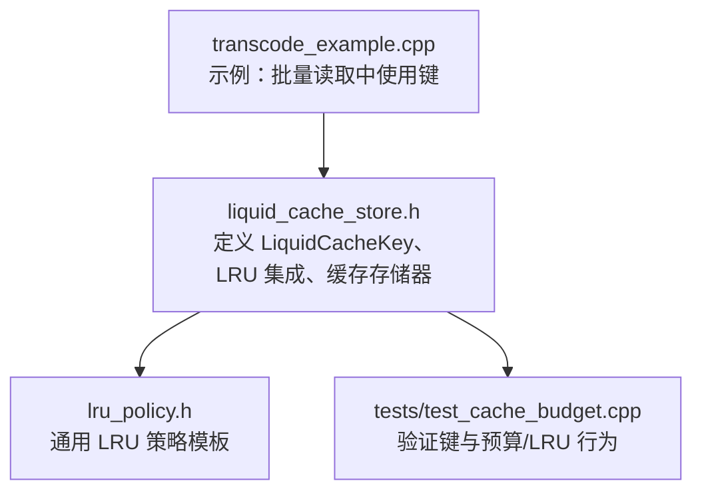
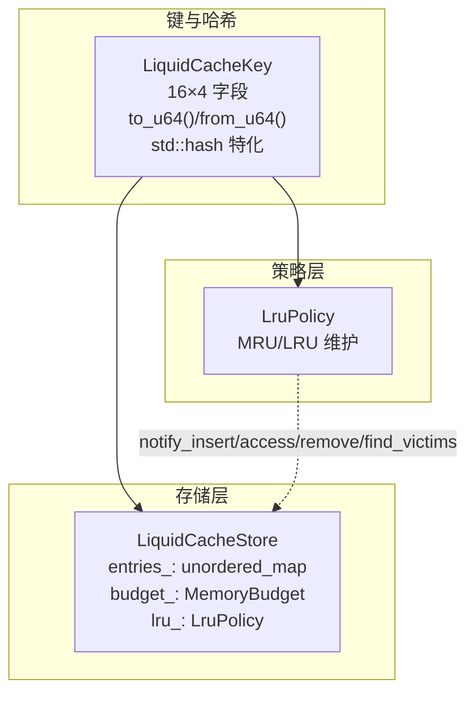
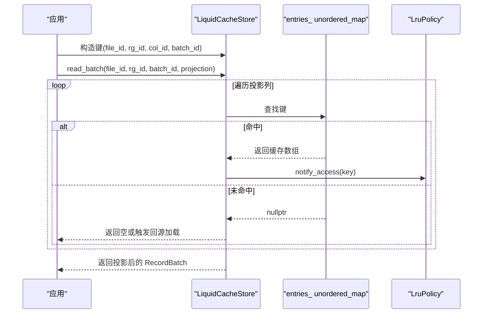
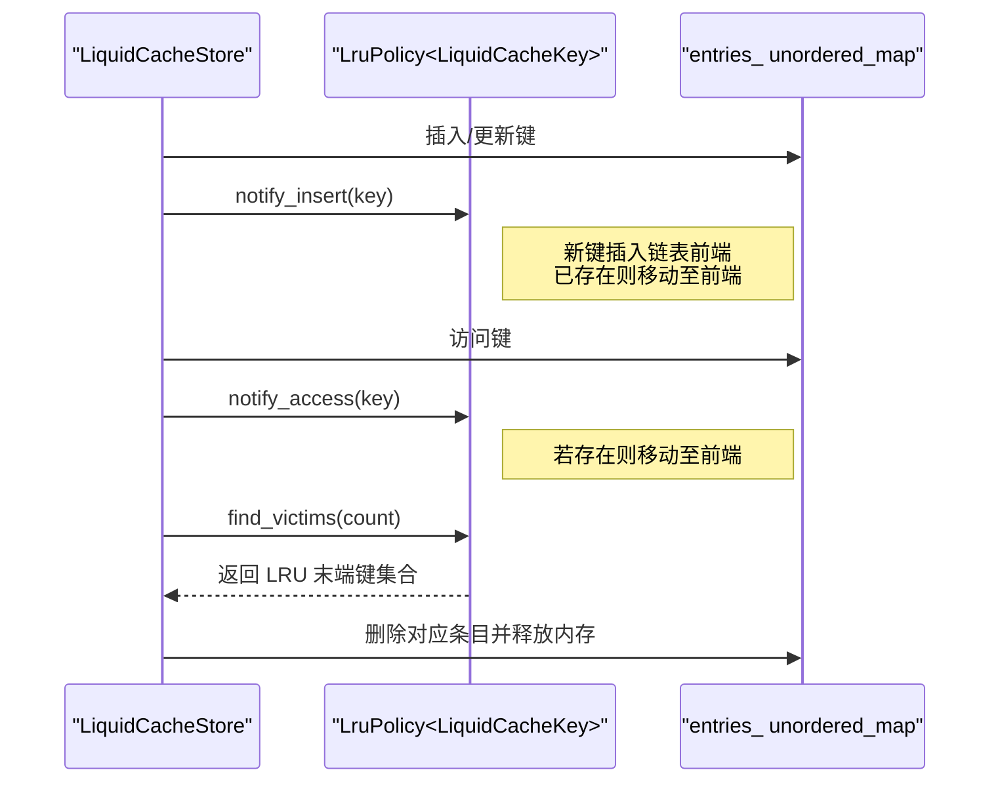
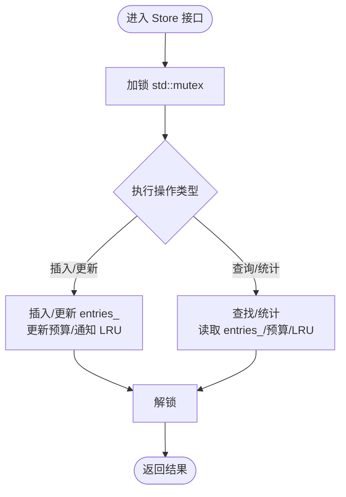
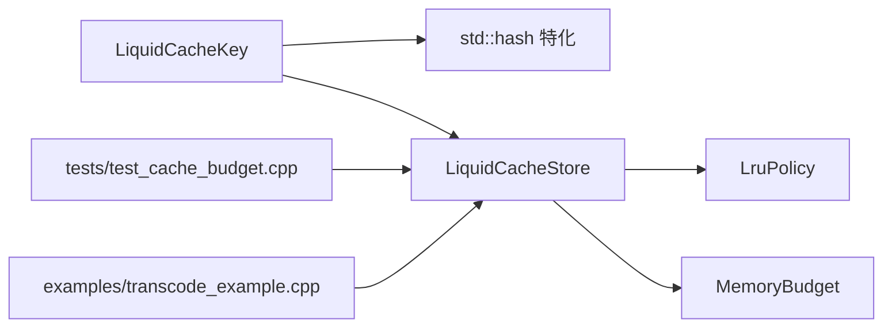

# 缓存键管理

<cite>
**本文引用的文件**
- [liquid_cache_store.h](file://include/liquid_cache/liquid_cache_store.h)
- [lru_policy.h](file://include/liquid_cache/lru_policy.h)
- [test_cache_budget.cpp](file://tests/test_cache_budget.cpp)
- [transcode_example.cpp](file://examples/transcode_example.cpp)
</cite>

## 目录
1. [简介](#简介)
2. [项目结构](#项目结构)
3. [核心组件](#核心组件)
4. [架构总览](#架构总览)
5. [详细组件分析](#详细组件分析)
6. [依赖关系分析](#依赖关系分析)
7. [性能考量](#性能考量)
8. [故障排查指南](#故障排查指南)
9. [结论](#结论)
10. [附录](#附录)

## 简介
本文件系统性阐述缓存键管理的设计与实现，聚焦于 LiquidCacheKey 的设计理念、16 位字段布局（file_id、rg_id、col_id、batch_id）、uint64_t 打包与解包机制、哈希与比较逻辑，以及在缓存存储中的创建、查找、序列化/反序列化路径。同时给出在不同场景下的使用示例（单列键构建、批量键生成、键值查找），解释与 LRU 策略的集成方式，并讨论多线程环境下的线程安全保障。

## 项目结构
围绕缓存键管理的关键文件与职责如下：
- include/liquid_cache/liquid_cache_store.h：定义缓存键类型、缓存存储器、LRU 集成与内存预算；包含键的打包/解包、哈希与比较。
- include/liquid_cache/lru_policy.h：通用 LRU 策略模板类，用于维护键的最近最少使用顺序。
- tests/test_cache_budget.cpp：覆盖缓存键在预算控制、LRU 淘汰、更新与统计等行为的测试用例。
- examples/transcode_example.cpp：展示如何通过 read_batch 构建键并进行批量读取，体现键在真实工作流中的使用。



**图表来源**
- [liquid_cache_store.h:40-99](file://include/liquid_cache/liquid_cache_store.h#L40-L99)
- [lru_policy.h:111-188](file://include/liquid_cache/lru_policy.h#L111-L188)
- [test_cache_budget.cpp:166-200](file://tests/test_cache_budget.cpp#L166-L200)
- [transcode_example.cpp:430-450](file://examples/transcode_example.cpp#L430-L450)

**章节来源**
- [liquid_cache_store.h:40-99](file://include/liquid_cache/liquid_cache_store.h#L40-L99)
- [lru_policy.h:111-188](file://include/liquid_cache/lru_policy.h#L111-L188)
- [test_cache_budget.cpp:166-200](file://tests/test_cache_budget.cpp#L166-L200)
- [transcode_example.cpp:430-450](file://examples/transcode_example.cpp#L430-L450)

## 核心组件
- LiquidCacheKey：标识缓存中“文件/行组/列/批”的唯一键，采用 16 位字段组合，统一打包为 uint64_t 以支持高效哈希与比较。
- 键的打包与解包：to_u64 将四个 16 位字段按高位到低位拼接为 uint64_t；from_u64 反向拆分。
- 哈希与比较：提供 std::hash 特化与相等比较，确保在 unordered_map 中作为键稳定可靠。
- LRU 集成：键类型可直接作为 LruPolicy 的模板参数，参与 MRU/LRU 列表维护。
- 缓存存储器：LiquidCacheStore 使用键作为 unordered_map 的键，结合 MemoryBudget 与 LruPolicy 实现带内存上限的 LRU 淘汰。

**章节来源**
- [liquid_cache_store.h:48-78](file://include/liquid_cache/liquid_cache_store.h#L48-L78)
- [liquid_cache_store.h:80-97](file://include/liquid_cache/liquid_cache_store.h#L80-L97)
- [lru_policy.h:111-188](file://include/liquid_cache/lru_policy.h#L111-L188)

## 架构总览
缓存键在系统中的位置与交互如下：



**图表来源**
- [liquid_cache_store.h:48-78](file://include/liquid_cache/liquid_cache_store.h#L48-L78)
- [liquid_cache_store.h:80-97](file://include/liquid_cache/liquid_cache_store.h#L80-L97)
- [lru_policy.h:111-188](file://include/liquid_cache/lru_policy.h#L111-L188)
- [liquid_cache_store.h:519-524](file://include/liquid_cache/liquid_cache_store.h#L519-L524)

## 详细组件分析

### LiquidCacheKey 设计与实现
- 字段组成：file_id、rg_id、col_id、batch_id，均为 uint16_t，分别对应文件号、行组号、列索引、批号。
- 打包机制：to_u64 将四个字段按高位到低位拼接，形成唯一的 uint64_t 值，便于哈希与比较。
- 解包机制：from_u64 将 uint64_t 按位掩码与右移还原各字段。
- 哈希与比较：提供自定义哈希器与相等比较，确保键在 unordered_map 中具备稳定的散列分布与快速比较。

```mermaid
classDiagram
class LiquidCacheKey {
+uint16_t file_id
+uint16_t rg_id
+uint16_t col_id
+uint16_t batch_id
+to_u64() uint64_t
+from_u64(v uint64_t) LiquidCacheKey
+operator==(other) bool
}
class LiquidCacheKeyHash {
+operator()(k) size_t
}
class std_hash_LiquidCacheKey {
+operator()(k) size_t
}
LiquidCacheKeyHash --> LiquidCacheKey : "哈希键"
std_hash_LiquidCacheKey --> LiquidCacheKey : "std : : hash 特化"
```

**图表来源**
- [liquid_cache_store.h:48-78](file://include/liquid_cache/liquid_cache_store.h#L48-L78)
- [liquid_cache_store.h:80-97](file://include/liquid_cache/liquid_cache_store.h#L80-L97)

**章节来源**
- [liquid_cache_store.h:48-78](file://include/liquid_cache/liquid_cache_store.h#L48-L78)
- [liquid_cache_store.h:80-97](file://include/liquid_cache/liquid_cache_store.h#L80-L97)

### 键的创建与使用流程
- 单列键构建：针对特定列与批，构造 LiquidCacheKey(file_id, rg_id, col_id, batch_id)。
- 批量键生成：在 read_batch 中，遍历投影列，逐列构造键并查询缓存。
- 键值查找：通过 LiquidCacheStore::contains/get/read_batch 等接口完成键查找与读取。



**图表来源**
- [liquid_cache_store.h:311-356](file://include/liquid_cache/liquid_cache_store.h#L311-L356)
- [liquid_cache_store.h:278-295](file://include/liquid_cache/liquid_cache_store.h#L278-L295)
- [lru_policy.h:116-141](file://include/liquid_cache/lru_policy.h#L116-L141)

**章节来源**
- [liquid_cache_store.h:311-356](file://include/liquid_cache/liquid_cache_store.h#L311-L356)
- [liquid_cache_store.h:278-295](file://include/liquid_cache/liquid_cache_store.h#L278-L295)
- [transcode_example.cpp:430-450](file://examples/transcode_example.cpp#L430-L450)

### 序列化与反序列化
- 序列化：键通过 to_u64() 转换为 uint64_t，可直接写入/传输。
- 反序列化：从 uint64_t 读取后，调用 from_u64() 还原为 LiquidCacheKey。
- 注意：键本身不包含额外元数据，序列化仅承载 64 位编码；如需持久化，应配合外部格式或上下文信息。

**章节来源**
- [liquid_cache_store.h:58-73](file://include/liquid_cache/liquid_cache_store.h#L58-L73)

### 与 LRU 策略的集成
- LruPolicy 模板类维护一个双向链表与哈希映射，记录键的 MRU/LRU 顺序。
- 在插入/访问时调用 notify_insert/notify_access，将键移动至前部（最常用）。
- 淘汰时从链表尾部选取受害者键，优先淘汰最久未使用项。
- LiquidCacheStore 在插入成功后通知 LRU，读取命中后也通知 LRU，从而保证热点键不被误淘汰。



**图表来源**
- [lru_policy.h:116-159](file://include/liquid_cache/lru_policy.h#L116-L159)
- [liquid_cache_store.h:243-244](file://include/liquid_cache/liquid_cache_store.h#L243-L244)
- [liquid_cache_store.h:292-293](file://include/liquid_cache/liquid_cache_store.h#L292-L293)

**章节来源**
- [lru_policy.h:111-188](file://include/liquid_cache/lru_policy.h#L111-L188)
- [liquid_cache_store.h:243-244](file://include/liquid_cache/liquid_cache_store.h#L243-L244)
- [liquid_cache_store.h:292-293](file://include/liquid_cache/liquid_cache_store.h#L292-L293)

### 多线程环境下的线程安全
- LiquidCacheStore 内部使用互斥锁保护关键数据结构（entries_、预算、LRU 状态），确保插入、删除、查询与统计等操作的原子性。
- LruPolicy 内部同样使用互斥锁保护其内部列表与映射，避免并发修改导致的数据竞争。
- MemoryBudget 提供无锁的原子预留与释放能力，但整体缓存操作仍由 Store 的互斥锁串行化。



**图表来源**
- [liquid_cache_store.h:519-524](file://include/liquid_cache/liquid_cache_store.h#L519-L524)
- [lru_policy.h:184-187](file://include/liquid_cache/lru_policy.h#L184-L187)

**章节来源**
- [liquid_cache_store.h:519-524](file://include/liquid_cache/liquid_cache_store.h#L519-L524)
- [lru_policy.h:184-187](file://include/liquid_cache/lru_policy.h#L184-L187)

## 依赖关系分析
- LiquidCacheKey 依赖于 uint64_t 打包/解包与哈希特化，后者由 std::hash 特化提供。
- LiquidCacheStore 依赖 LruPolicy 与 MemoryBudget，三者共同实现“带内存上限的 LRU 缓存”。
- 测试与示例展示了键在实际工作流中的使用：测试覆盖预算与 LRU 行为，示例展示批量读取中键的构造与查询。



**图表来源**
- [liquid_cache_store.h:80-97](file://include/liquid_cache/liquid_cache_store.h#L80-L97)
- [liquid_cache_store.h:519-524](file://include/liquid_cache/liquid_cache_store.h#L519-L524)
- [lru_policy.h:111-188](file://include/liquid_cache/lru_policy.h#L111-L188)
- [test_cache_budget.cpp:166-200](file://tests/test_cache_budget.cpp#L166-L200)
- [transcode_example.cpp:430-450](file://examples/transcode_example.cpp#L430-L450)

**章节来源**
- [liquid_cache_store.h:80-97](file://include/liquid_cache/liquid_cache_store.h#L80-L97)
- [liquid_cache_store.h:519-524](file://include/liquid_cache/liquid_cache_store.h#L519-L524)
- [lru_policy.h:111-188](file://include/liquid_cache/lru_policy.h#L111-L188)
- [test_cache_budget.cpp:166-200](file://tests/test_cache_budget.cpp#L166-L200)
- [transcode_example.cpp:430-450](file://examples/transcode_example.cpp#L430-L450)

## 性能考量
- 键比较与哈希：通过 to_u64() 将四段 16 位字段压缩为一次整型运算，比较与哈希均为 O(1)，适合高频查找场景。
- 内存占用：每个键仅 8 字节，且作为 unordered_map 的键，空间开销与哈希冲突控制平衡良好。
- LRU 成本：notify_insert/notify_access 为 O(1) 均摊时间复杂度；find_victims 批量淘汰时按需弹出，避免全量扫描。
- 并发成本：Store 的互斥锁保护了所有写操作，读取路径尽量短路；LRU 的互斥锁仅在必要时持有，整体并发友好。
- 预算与淘汰：MemoryBudget 的原子预留减少锁竞争；make_budget_space 循环淘汰直至满足空间需求，避免阻塞过久。

[本节为通用性能讨论，无需列出具体文件来源]

## 故障排查指南
- 键未命中：检查键字段是否正确（file_id、rg_id、col_id、batch_id），确认 read_batch 的投影列与批号一致。
- 预算不足：当插入返回失败或立即被驱逐，检查 max_cache_bytes 设置与单条目大小；可通过 stats() 获取当前使用情况。
- LRU 异常：若热点键被误淘汰，确认 get() 是否在读取后调用了 notify_access；检查是否存在大量小批量写入导致频繁驱逐。
- 并发问题：若出现数据竞争或死锁，确认调用方未在 Store 互斥锁内执行耗时操作；必要时将昂贵操作移出临界区。

**章节来源**
- [liquid_cache_store.h:278-295](file://include/liquid_cache/liquid_cache_store.h#L278-L295)
- [liquid_cache_store.h:480-517](file://include/liquid_cache/liquid_cache_store.h#L480-L517)
- [lru_policy.h:116-159](file://include/liquid_cache/lru_policy.h#L116-L159)

## 结论
LiquidCacheKey 以紧凑的 16 位字段与高效的 uint64_t 打包机制，实现了高性能的缓存键设计；配合标准库哈希特化与 LruPolicy，构成可靠的 LRU 缓存体系。在 LiquidCacheStore 中，键与内存预算、LRU 策略协同工作，既保证了查询效率，又能在受限内存下维持良好的局部性与吞吐表现。测试与示例进一步验证了键在真实场景中的可用性与稳定性。

[本节为总结性内容，无需列出具体文件来源]

## 附录

### 使用示例与最佳实践
- 单列缓存键构建：针对单一列与批，直接构造键并查询缓存。
- 批量缓存键生成：在 read_batch 中遍历投影列，逐列构造键并读取，最后合并为 RecordBatch。
- 键值查找：先通过 contains 检查，再通过 get 或 read_batch 获取数组；命中后通知 LRU 保持热度。
- 性能优化建议：
  - 合理设置 max_cache_bytes，避免频繁驱逐；
  - 对热点列与批进行预热，减少首次访问延迟；
  - 控制批大小与投影列数量，降低内存峰值；
  - 在高并发场景下，尽量减少在 Store 互斥锁内的非必要操作。

**章节来源**
- [liquid_cache_store.h:311-356](file://include/liquid_cache/liquid_cache_store.h#L311-L356)
- [transcode_example.cpp:430-450](file://examples/transcode_example.cpp#L430-L450)
- [test_cache_budget.cpp:166-200](file://tests/test_cache_budget.cpp#L166-L200)