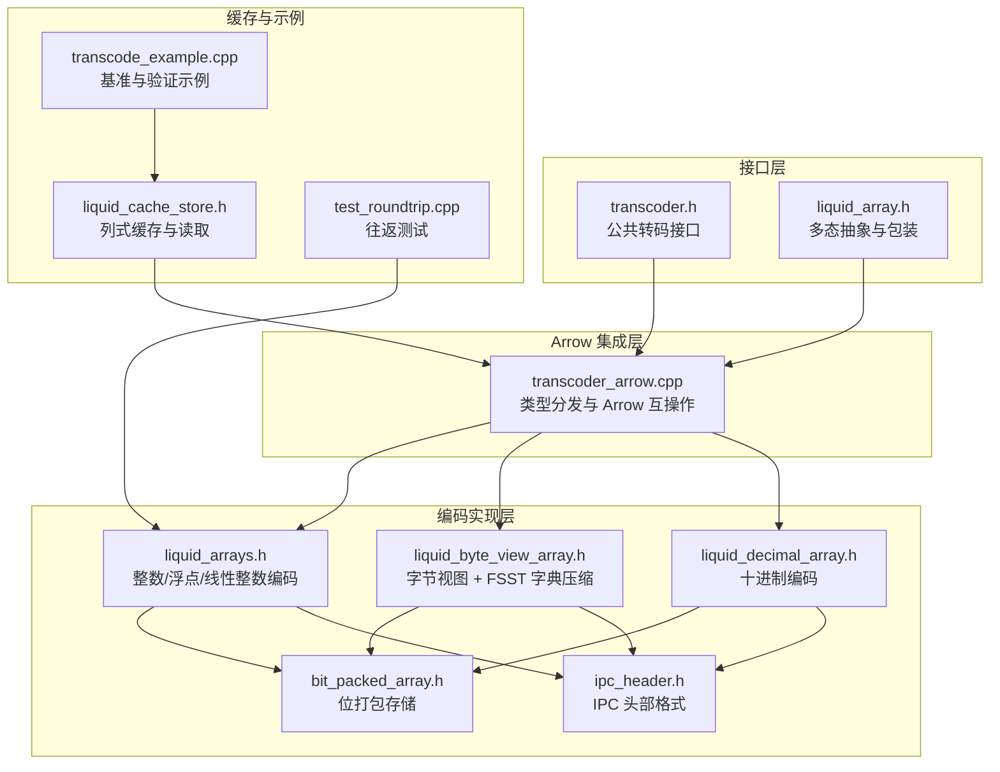
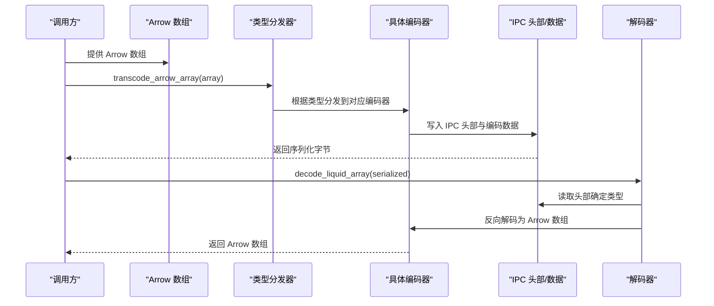
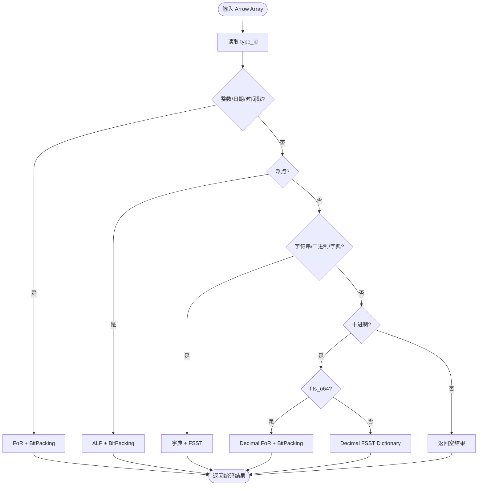
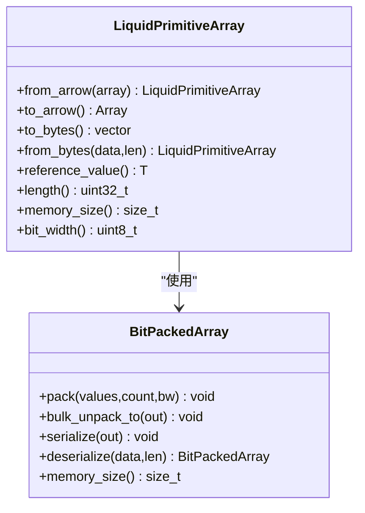
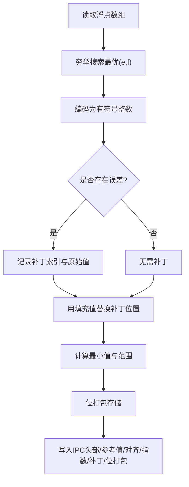
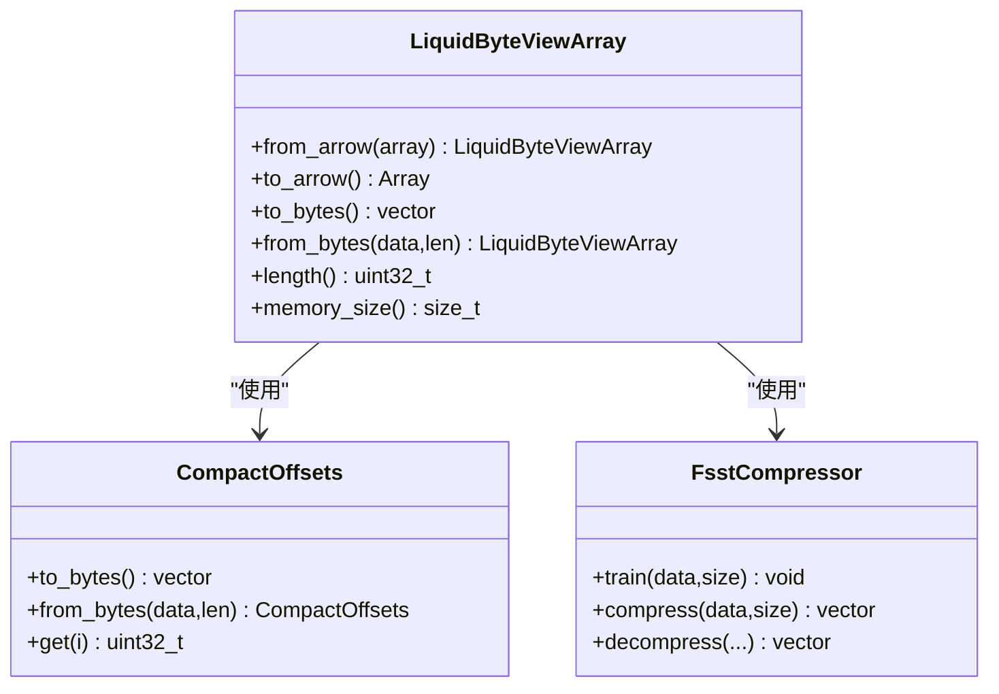
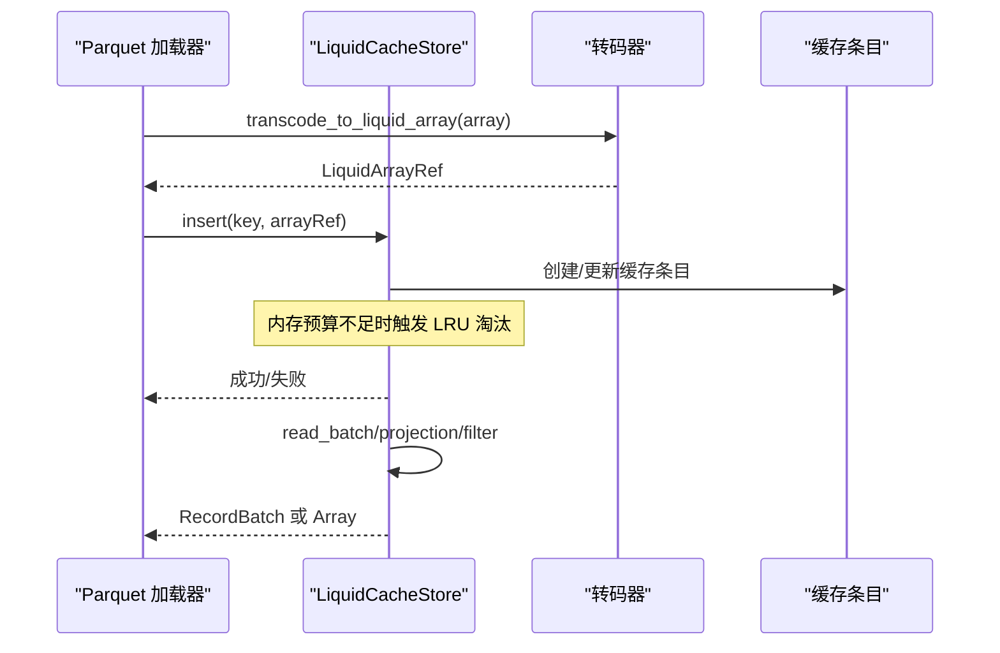
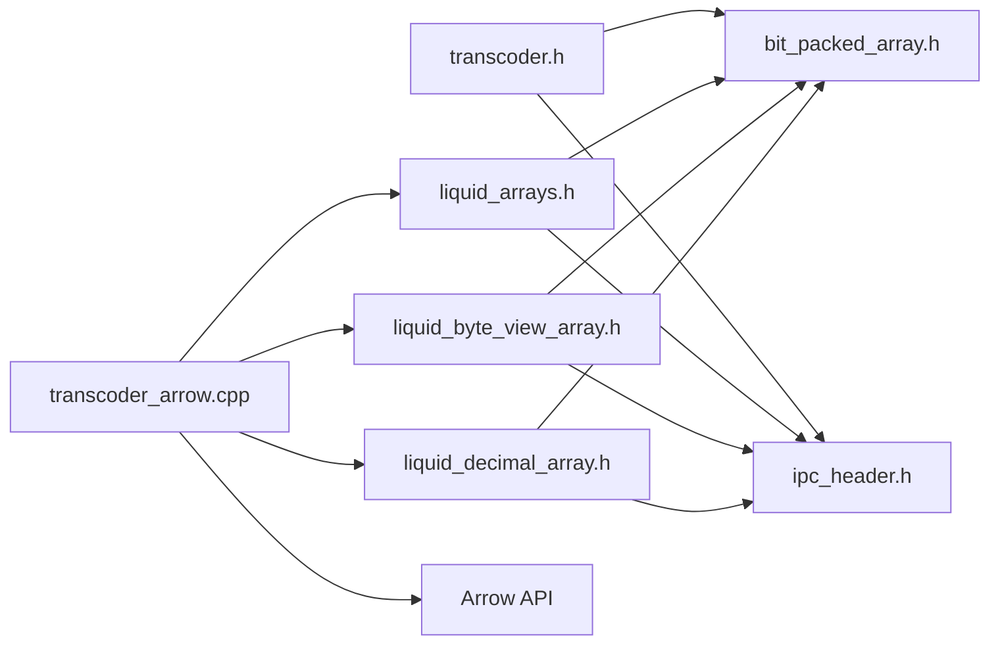

# 转码器 API

<cite>
**本文档引用的文件**
- [transcoder.h](file://include/liquid_cache/transcoder.h)
- [transcoder_arrow.cpp](file://src/transcoder_arrow.cpp)
- [liquid_arrays.h](file://include/liquid_cache/liquid_arrays.h)
- [liquid_byte_view_array.h](file://include/liquid_cache/liquid_byte_view_array.h)
- [liquid_decimal_array.h](file://include/liquid_cache/liquid_decimal_array.h)
- [bit_packed_array.h](file://include/liquid_cache/bit_packed_array.h)
- [ipc_header.h](file://include/liquid_cache/ipc_header.h)
- [liquid_array.h](file://include/liquid_cache/liquid_array.h)
- [liquid_cache_store.h](file://include/liquid_cache/liquid_cache_store.h)
- [transcode_example.cpp](file://examples/transcode_example.cpp)
- [test_roundtrip.cpp](file://tests/test_roundtrip.cpp)
- [README.md](file://README.md)
</cite>

## 目录
1. [简介](#简介)
2. [项目结构](#项目结构)
3. [核心组件](#核心组件)
4. [架构总览](#架构总览)
5. [详细组件分析](#详细组件分析)
6. [依赖关系分析](#依赖关系分析)
7. [性能考量](#性能考量)
8. [故障排查指南](#故障排查指南)
9. [结论](#结论)
10. [附录](#附录)

## 简介
本文件系统化梳理转码器 API 的设计与实现，覆盖 Arrow 数组到 Liquid 格式的转换、类型分发机制、编码策略选择、数据流转换与内存布局、性能特征与优化策略，并提供跨类型（整数、浮点、字符串、十进制等）的转码示例与最佳实践。

## 项目结构
仓库采用按功能域划分的头文件组织方式，核心转码逻辑位于头文件与源文件中，配合数组编码实现与缓存存储模块，形成完整的转码与缓存流水线。

**图表来源**
- [transcoder.h:1-360](file://include/liquid_cache/transcoder.h#L1-L360)
- [transcoder_arrow.cpp:1-746](file://src/transcoder_arrow.cpp#L1-L746)
- [liquid_arrays.h:1-1221](file://include/liquid_cache/liquid_arrays.h#L1-L1221)
- [liquid_byte_view_array.h:1-670](file://include/liquid_cache/liquid_byte_view_array.h#L1-L670)
- [liquid_decimal_array.h:1-404](file://include/liquid_cache/liquid_decimal_array.h#L1-L404)
- [bit_packed_array.h:1-486](file://include/liquid_cache/bit_packed_array.h#L1-L486)
- [ipc_header.h:1-118](file://include/liquid_cache/ipc_header.h#L1-L118)
- [liquid_array.h:1-159](file://include/liquid_cache/liquid_array.h#L1-L159)
- [liquid_cache_store.h:1-527](file://include/liquid_cache/liquid_cache_store.h#L1-L527)
- [transcode_example.cpp:1-550](file://examples/transcode_example.cpp#L1-L550)
- [test_roundtrip.cpp:1-544](file://tests/test_roundtrip.cpp#L1-L544)

**章节来源**
- [README.md:1-379](file://README.md#L1-L379)

## 核心组件
- 转码入口与类型分发
  - 独立缓冲区转码：适用于 JNI/Velox 等无 Arrow 依赖场景，提供整数与浮点的直接转码函数模板。
  - Arrow 依赖转码：面向 Arrow 数组，提供类型分发与解码，覆盖整数/日期/时间戳、浮点、字符串/二进制、字典、十进制等。
- 编码数组实现
  - 整数/日期/时间戳：帧参考 + 位打包（FoR + BitPacking）。
  - 浮点：自适应无损浮点编码（ALP）+ 位打包。
  - 字符串/二进制：字典 + FSST 压缩 + 前缀键 + 线性偏移压缩。
  - 十进制：Decimal128/256 在可适配范围内走 FoR + BitPacking，否则走定长字节数组 + FSST。
- IPC 与内存布局
  - 统一 IPC 头部，包含逻辑类型与物理类型标识。
  - 位打包数组采用 1024 元素块的 SIMD 友好布局。
- 缓存与读取
  - 列式缓存存储，支持投影与过滤，零反序列化读取，内存预算与 LRU 策略。

**章节来源**
- [transcoder.h:1-360](file://include/liquid_cache/transcoder.h#L1-L360)
- [transcoder_arrow.cpp:1-746](file://src/transcoder_arrow.cpp#L1-L746)
- [liquid_arrays.h:1-1221](file://include/liquid_cache/liquid_arrays.h#L1-L1221)
- [liquid_byte_view_array.h:1-670](file://include/liquid_cache/liquid_byte_view_array.h#L1-L670)
- [liquid_decimal_array.h:1-404](file://include/liquid_cache/liquid_decimal_array.h#L1-L404)
- [bit_packed_array.h:1-486](file://include/liquid_cache/bit_packed_array.h#L1-L486)
- [ipc_header.h:1-118](file://include/liquid_cache/ipc_header.h#L1-L118)
- [liquid_cache_store.h:1-527](file://include/liquid_cache/liquid_cache_store.h#L1-L527)

## 架构总览
转码器 API 的核心是“类型分发 + 编码策略”的组合。Arrow 侧通过类型分发映射到具体编码器，独立缓冲区路径提供通用的原生类型转码能力；解码阶段依据 IPC 头部类型进行反向分发。

**图表来源**
- [transcoder_arrow.cpp:34-351](file://src/transcoder_arrow.cpp#L34-L351)
- [transcoder.h:351-358](file://include/liquid_cache/transcoder.h#L351-L358)
- [ipc_header.h:46-106](file://include/liquid_cache/ipc_header.h#L46-L106)

## 详细组件分析

### 类型分发与转码入口
- 独立缓冲区转码
  - 整数：transcode_primitive 模板，支持任意原生整数类型，采用帧参考 + 位打包。
  - 浮点：transcode_float 模板，采用 ALP 编码 + 位打包，带补丁记录以保证无损。
- Arrow 依赖转码
  - transcode_arrow_array：按 Arrow type_id 分发到具体编码器，覆盖整数/日期/时间戳、浮点、字符串/二进制、字典、十进制等。
  - decode_liquid_array：依据 IPC 头部逻辑类型与物理类型进行解码分发。
  - transcode_to_liquid_array：返回内存中的液态数组引用，避免序列化开销，用于缓存存储。

**图表来源**
- [transcoder_arrow.cpp:44-351](file://src/transcoder_arrow.cpp#L44-L351)

**章节来源**
- [transcoder.h:78-342](file://include/liquid_cache/transcoder.h#L78-L342)
- [transcoder_arrow.cpp:34-351](file://src/transcoder_arrow.cpp#L34-L351)

### 编码策略与数据流

#### 整数/日期/时间戳：FoR + BitPacking
- 算法要点
  - 计算最小值作为参考值，将每个值减去参考值得到非负偏移。
  - 计算最大偏移所需的位宽，使用位打包数组存储。
  - IPC 头部后紧跟参考值，再进行 8 字节对齐后写入位打包数据。
- 内存布局
  - IPC 头部（16B）+ 参考值（与原生类型相同大小）+ 填充至 8 字节对齐 + 位打包数组。
- 性能特征
  - 顺序访问友好，批量解码通过位打包的批量解包 API 实现。
  - bit_width 越小压缩率越高，常量值可达到 0 位宽度。

**图表来源**
- [liquid_arrays.h:95-248](file://include/liquid_cache/liquid_arrays.h#L95-L248)
- [bit_packed_array.h:39-483](file://include/liquid_cache/bit_packed_array.h#L39-L483)

**章节来源**
- [liquid_arrays.h:81-248](file://include/liquid_cache/liquid_arrays.h#L81-L248)
- [bit_packed_array.h:22-240](file://include/liquid_cache/bit_packed_array.h#L22-L240)

#### 浮点：ALP + BitPacking
- 算法要点
  - 通过穷举搜索最优指数对 (e,f)，使编码后的整数尽可能无误差还原。
  - 对于存在误差的位置，记录补丁索引与原始值，解码时用填充值替换以提升压缩效果。
  - IPC 头部后写入参考值（最小编码值）、对齐、指数 (e,f)、补丁列表，再写入位打包数据。
- 内存布局
  - IPC 头部（16B）+ 参考值（有符号整数）+ 填充 + 指数（2B）+ 补丁长度与索引/值 + 位打包数据。
- 性能特征
  - 适合 IEEE 浮点分布，通过指数对选择减少误差。
  - 补丁数量越少，压缩率越高。

**图表来源**
- [transcoder.h:158-342](file://include/liquid_cache/transcoder.h#L158-L342)

**章节来源**
- [transcoder.h:158-342](file://include/liquid_cache/transcoder.h#L158-L342)

#### 字符串/二进制：字典 + FSST + 前缀键 + 线性偏移
- 算法要点
  - 去重建立字典，计算共享前缀，对字典值（去除共享前缀）训练并压缩。
  - 用前缀键（7 字节前缀 + 长度字节）表示字典项，线性回归压缩偏移，位打包存储字典键。
  - 解码时先解压字典，再批量拼接得到最终字符串/二进制数组。
- 内存布局
  - IPC 头部 + FSST 符号表/压缩数据 + 对齐 + 字典键位打包 + 线性偏移残差 + 前缀键 + 共享前缀 + 对齐。
- 性能特征
  - 高重复率场景显著受益，字典与 FSST 的组合通常优于单独压缩。

**图表来源**
- [liquid_byte_view_array.h:204-667](file://include/liquid_cache/liquid_byte_view_array.h#L204-L667)

**章节来源**
- [liquid_byte_view_array.h:204-667](file://include/liquid_cache/liquid_byte_view_array.h#L204-L667)

#### 十进制：Decimal128/256 适配路径
- 适配条件：Decimal128/256 的值在非负且低位满足 u64 范围内，走 FoR + BitPacking。
- 否则：走定长字节数组 + FSST 字典压缩路径。
- IPC 头部逻辑类型为 Decimal，物理类型为 UInt64。

**章节来源**
- [liquid_decimal_array.h:69-404](file://include/liquid_cache/liquid_decimal_array.h#L69-L404)
- [transcoder_arrow.cpp:298-342](file://src/transcoder_arrow.cpp#L298-L342)

### 缓存与读取（零反序列化）
- LiquidCacheStore
  - 列式缓存，键由文件/行组/列/批次组成，支持内存预算与 LRU。
  - 支持投影读取与行过滤，读取时直接解码为 Arrow 或（可选）Velox。
- 读取路径
  - read_batch：按投影列批量读取，构造 RecordBatch。
  - get：单列读取，支持布尔掩码过滤。
- 内存预算
  - 插入/更新时预留空间，不足时触发 LRU 淘汰。

**图表来源**
- [transcoder_arrow.cpp:489-658](file://src/transcoder_arrow.cpp#L489-L658)
- [liquid_cache_store.h:188-527](file://include/liquid_cache/liquid_cache_store.h#L188-L527)

**章节来源**
- [liquid_cache_store.h:188-527](file://include/liquid_cache/liquid_cache_store.h#L188-L527)
- [transcoder_arrow.cpp:664-743](file://src/transcoder_arrow.cpp#L664-L743)

## 依赖关系分析
- 头文件依赖
  - transcoder.h 依赖 ipc_header.h、bit_packed_array.h。
  - liquid_arrays.h 依赖 bit_packed_array.h、ipc_header.h。
  - liquid_byte_view_array.h 依赖 bit_packed_array.h、fsst.h、ipc_header.h。
  - liquid_decimal_array.h 依赖 bit_packed_array.h、ipc_header.h。
  - transcoder_arrow.cpp 依赖上述各数组头文件与 Arrow API。
- 外部依赖
  - Apache Arrow、Parquet（用于读取与类型计算）。
  - 可选：Facebook Velox（启用宏后提供转换接口）。

**图表来源**
- [transcoder.h:12-26](file://include/liquid_cache/transcoder.h#L12-L26)
- [liquid_arrays.h:22-24](file://include/liquid_cache/liquid_arrays.h#L22-L24)
- [liquid_byte_view_array.h:18-21](file://include/liquid_cache/liquid_byte_view_array.h#L18-L21)
- [liquid_decimal_array.h:21-23](file://include/liquid_cache/liquid_decimal_array.h#L21-L23)
- [transcoder_arrow.cpp:10-26](file://src/transcoder_arrow.cpp#L10-L26)

**章节来源**
- [transcoder.h:1-360](file://include/liquid_cache/transcoder.h#L1-L360)
- [liquid_arrays.h:1-1221](file://include/liquid_cache/liquid_arrays.h#L1-L1221)
- [liquid_byte_view_array.h:1-670](file://include/liquid_cache/liquid_byte_view_array.h#L1-L670)
- [liquid_decimal_array.h:1-404](file://include/liquid_cache/liquid_decimal_array.h#L1-L404)
- [transcoder_arrow.cpp:1-746](file://src/transcoder_arrow.cpp#L1-L746)

## 性能考量
- 编码策略选择
  - 整数/日期/时间戳：FoR + BitPacking，适合连续或近似线性分布，bit_width 越小压缩率越高。
  - 浮点：ALP 通过指数对选择降低误差，补丁越少压缩率越高。
  - 字符串/二进制：字典 + FSST，重复率越高收益越大；共享前缀与线性偏移进一步压缩。
  - 十进制：fits_u64 时优先 FoR + BitPacking；否则走 FSST 字典。
- 内存与对齐
  - 位打包数组采用 8 字节对齐，减少解码时的边界检查成本。
  - FSST 压缩数据与中间结构按 8 字节对齐，提高缓存命中。
- 批处理与 SIMD
  - 位打包批量解包使用 AVX2 特化路径（常见位宽 1/2/4/8/16/32），在不满足特化时回退到块状标量实现。
- 缓存与预算
  - LiquidCacheStore 支持内存预算上限与 LRU 淘汰，避免 OOM。
  - 零反序列化读取：直接访问内存中的液态数组，避免 IPC 反序列化开销。

**章节来源**
- [bit_packed_array.h:242-444](file://include/liquid_cache/bit_packed_array.h#L242-L444)
- [liquid_cache_store.h:480-517](file://include/liquid_cache/liquid_cache_store.h#L480-L517)

## 故障排查指南
- 类型不支持
  - Arrow 类型不在分发表中时，返回空结果。确认类型是否受支持。
- 时间戳时区
  - 带时区的时间戳被拒绝（保持与 Rust 行为一致）。请先转换为无时区类型。
- 浮点精度
  - ALP 搜索最优指数对时，若样本不足可能导致次优结果。可通过增大采样步长或调整策略改进。
- 字符串/二进制
  - FSST 符号表/压缩数据长度不匹配会导致反序列化失败。检查输入缓冲区完整性。
- 内存不足
  - 插入缓存时预算不足会返回失败。可调大预算或释放其他条目。

**章节来源**
- [transcoder_arrow.cpp:154-160](file://src/transcoder_arrow.cpp#L154-L160)
- [transcoder_arrow.cpp:233-238](file://src/transcoder_arrow.cpp#L233-L238)
- [liquid_byte_view_array.h:500-526](file://include/liquid_cache/liquid_byte_view_array.h#L500-L526)
- [liquid_cache_store.h:491-517](file://include/liquid_cache/liquid_cache_store.h#L491-L517)

## 结论
转码器 API 通过清晰的类型分发与多种编码策略，实现了对 Arrow 数组的高效压缩与快速解码。FoR + BitPacking、ALP + BitPacking、字典 + FSST、Decimal 适配路径共同覆盖了主流数据类型。结合零反序列化缓存与内存预算控制，可在真实分析场景中获得显著的吞吐与延迟优势。

## 附录

### 转码示例与最佳实践
- 整数（FoR + BitPacking）
  - 使用独立缓冲区转码：transcode_primitive 模板，传入原生整数指针、空位图、长度与物理类型。
  - 使用 Arrow 转码：transcode_arrow_array，自动分发到整数编码器。
- 浮点（ALP + BitPacking）
  - 使用独立缓冲区转码：transcode_float 模板，自动搜索最优指数对并记录补丁。
  - 使用 Arrow 转码：transcode_arrow_array，自动分发到浮点编码器。
- 字符串/二进制（字典 + FSST）
  - 使用 Arrow 转码：transcode_arrow_array，自动分发到字节视图编码器；大量重复字符串时收益显著。
- 十进制
  - 使用 Arrow 转码：transcode_arrow_array，若 fits_u64 则走 FoR + BitPacking，否则走 FSST 字典路径。
- 最佳实践
  - 选择合适的编码：整数/日期/时间戳优先 FoR + BitPacking；浮点优先 ALP；字符串/二进制优先字典 + FSST；十进制优先 fits_u64。
  - 控制内存：使用 LiquidCacheStore 的内存预算与 LRU，避免 OOM。
  - 批处理：利用批量解包与投影读取，减少 CPU 开销。

**章节来源**
- [transcoder.h:78-342](file://include/liquid_cache/transcoder.h#L78-L342)
- [transcoder_arrow.cpp:34-351](file://src/transcoder_arrow.cpp#L34-L351)
- [test_roundtrip.cpp:328-397](file://tests/test_roundtrip.cpp#L328-L397)
- [transcode_example.cpp:246-332](file://examples/transcode_example.cpp#L246-L332)