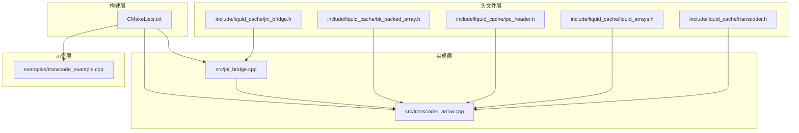
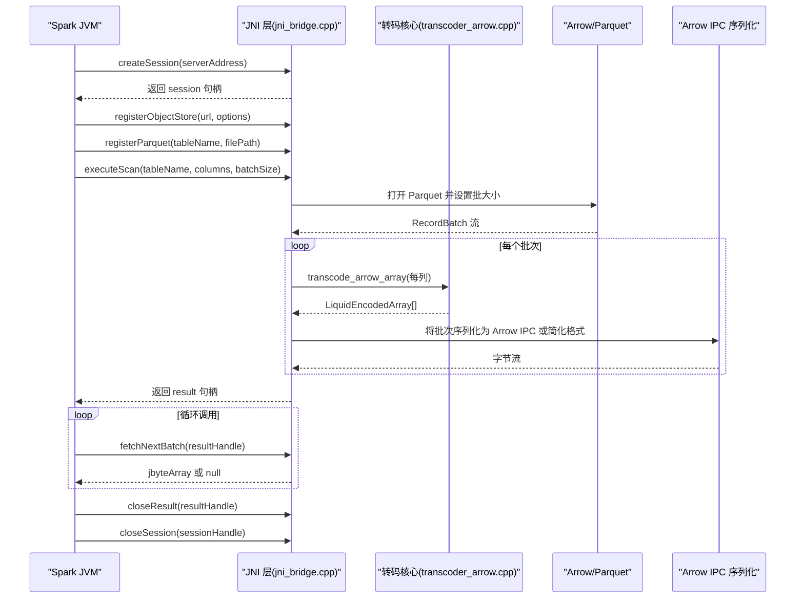
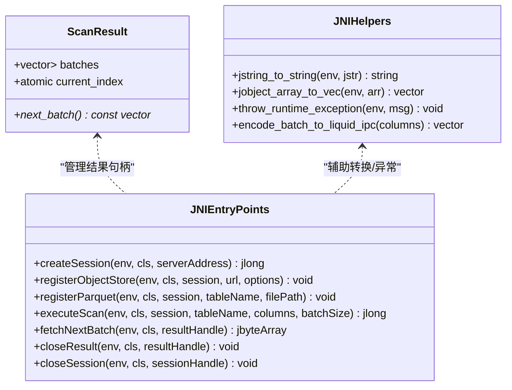
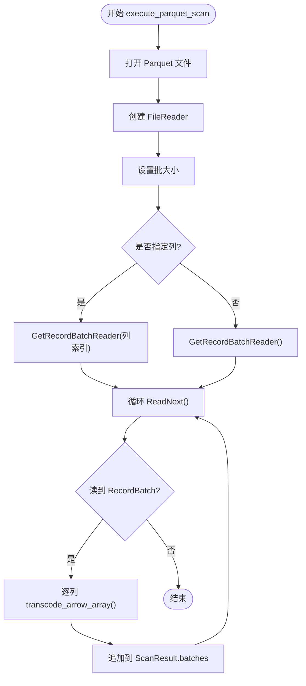
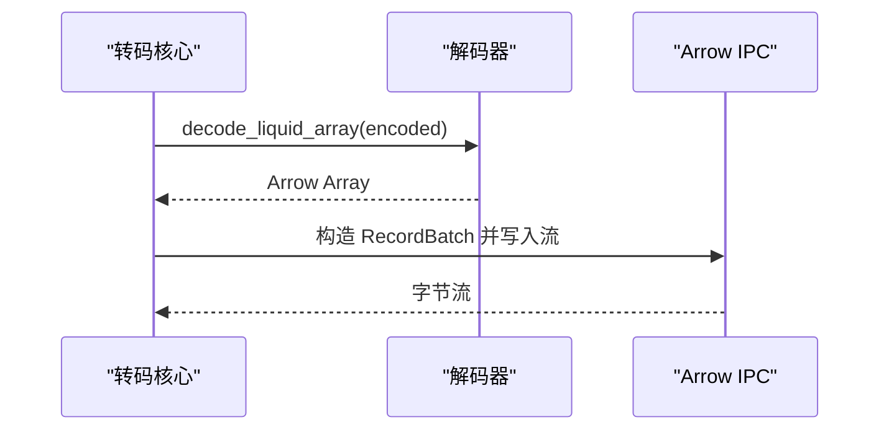
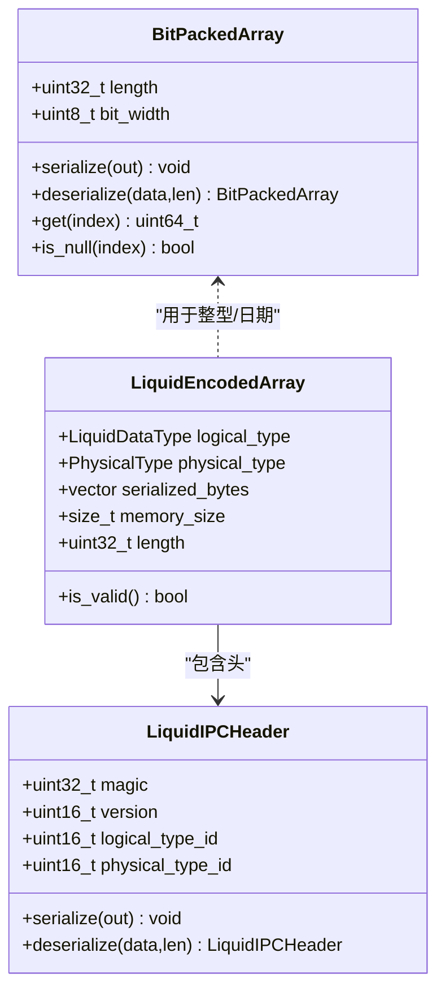
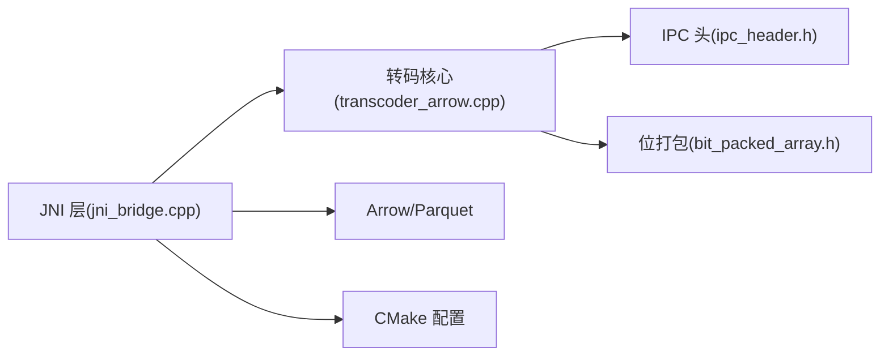

# JNI 桥接系统

<cite>
**本文引用的文件**
- [jni_bridge.h](file://include/liquid_cache/jni_bridge.h)
- [jni_bridge.cpp](file://src/jni_bridge.cpp)
- [transcoder_arrow.cpp](file://src/transcoder_arrow.cpp)
- [transcoder.h](file://include/liquid_cache/transcoder.h)
- [liquid_arrays.h](file://include/liquid_cache/liquid_arrays.h)
- [ipc_header.h](file://include/liquid_cache/ipc_header.h)
- [bit_packed_array.h](file://include/liquid_cache/bit_packed_array.h)
- [CMakeLists.txt](file://CMakeLists.txt)
- [transcode_example.cpp](file://examples/transcode_example.cpp)
- [debug.txt](file://debug.txt)
</cite>

## 目录
1. [简介](#简介)
2. [项目结构](#项目结构)
3. [核心组件](#核心组件)
4. [架构总览](#架构总览)
5. [详细组件分析](#详细组件分析)
6. [依赖关系分析](#依赖关系分析)
7. [性能考量](#性能考量)
8. [故障排查指南](#故障排查指南)
9. [结论](#结论)
10. [附录](#附录)

## 简介
本文件系统性地介绍 Liquid Cache C++ 的 JNI 桥接系统设计与实现，重点覆盖：
- 与 Apache Spark 集成的整体架构与数据流
- JNI 接口设计原则、方法签名与参数传递机制
- 会话管理、结果缓存与内存生命周期控制策略
- 错误处理、异常传播与调试支持
- 典型 JNI 方法的实现路径与跨语言数据转换
- 性能优化技巧与完整集成示例

## 项目结构
仓库采用“头文件 + 实现文件 + 示例 + 构建脚本”的组织方式，核心模块如下：
- 头文件层：定义 JNI 接口、IPC 头、编码数组与桥接辅助工具
- 实现层：JNI 入口点、Parquet 扫描与转码、Arrow IPC 序列化
- 示例层：端到端转码与基准测试
- 构建层：CMake 配置，静态链接 Arrow/Parquet/Abseil 等依赖

图表来源
- [jni_bridge.h:1-217](file://include/liquid_cache/jni_bridge.h#L1-L217)
- [jni_bridge.cpp:1-320](file://src/jni_bridge.cpp#L1-L320)
- [transcoder_arrow.cpp:1-286](file://src/transcoder_arrow.cpp#L1-L286)
- [CMakeLists.txt:1-179](file://CMakeLists.txt#L1-L179)

章节来源
- [CMakeLists.txt:1-179](file://CMakeLists.txt#L1-L179)

## 核心组件
- JNI 接口层：声明并实现 Spark 调用的原生方法，负责会话与结果句柄管理、Parquet 扫描、批量数据序列化等
- 转码核心层：基于 Arrow C++ 的列式数组转码为 Liquid Cache 格式，并提供解码回 Arrow 的能力
- IPC 序列化层：统一的 IPC 头与二进制布局，兼容 Rust 实现
- 数据结构层：位打包数组、编码数组、类型枚举等

章节来源
- [jni_bridge.h:176-217](file://include/liquid_cache/jni_bridge.h#L176-L217)
- [transcoder.h:23-34](file://include/liquid_cache/transcoder.h#L23-L34)
- [liquid_arrays.h:91-227](file://include/liquid_cache/liquid_arrays.h#L91-L227)
- [ipc_header.h:55-106](file://include/liquid_cache/ipc_header.h#L55-L106)

## 架构总览
JNI 桥接系统在 Spark JVM 与 C++ 核心之间建立直接通道，整体流程如下：
- Spark JVM 调用原生方法创建会话、注册对象存储/表、执行扫描
- C++ 侧通过 Arrow C++ 读取 Parquet，逐批转码为 Liquid Cache
- 结果以 Arrow IPC 字节流返回给 JVM，或使用简化格式进行演示
- 会话与结果句柄由 C++ 内部管理，避免 JVM 侧持有底层资源

图表来源
- [jni_bridge.cpp:183-318](file://src/jni_bridge.cpp#L183-L318)
- [transcoder_arrow.cpp:36-209](file://src/transcoder_arrow.cpp#L36-L209)

## 详细组件分析

### JNI 接口与句柄管理
- 会话与结果句柄：使用原子自增分配句柄，全局哈希表保存会话与结果，线程安全互斥保护
- 辅助函数：字符串与数组转换、异常抛出、Arrow IPC 编码（简化版）
- 原生方法签名：与 Spark 侧 LiquidCacheNative 对应，遵循 JNI 命名规范

图表来源
- [jni_bridge.h:42-93](file://include/liquid_cache/jni_bridge.h#L42-L93)
- [jni_bridge.h:99-161](file://include/liquid_cache/jni_bridge.h#L99-L161)
- [jni_bridge.h:176-217](file://include/liquid_cache/jni_bridge.h#L176-L217)

章节来源
- [jni_bridge.h:29-93](file://include/liquid_cache/jni_bridge.h#L29-L93)
- [jni_bridge.h:99-161](file://include/liquid_cache/jni_bridge.h#L99-L161)
- [jni_bridge.h:176-217](file://include/liquid_cache/jni_bridge.h#L176-L217)

### Parquet 扫描与转码流水线
- 扫描器：打开文件、创建 Reader、设置批大小、选择列索引、迭代 RecordBatch
- 转码器：按列调用 transcode_arrow_array，生成 LiquidEncodedArray 列表
- 结果缓存：将每批编码后的列集合存入 ScanResult，供 JVM 逐步拉取

图表来源
- [jni_bridge.cpp:51-126](file://src/jni_bridge.cpp#L51-L126)

章节来源
- [jni_bridge.cpp:51-126](file://src/jni_bridge.cpp#L51-L126)

### Arrow IPC 序列化与反序列化
- 编码：将 LiquidEncodedArray 解码为 Arrow 数组，构造 RecordBatch，写入 Arrow IPC 流
- 解码：从 IPC 流中读取 RecordBatch，再转回 Arrow 数组（当前对浮点类型为占位）

图表来源
- [transcoder_arrow.cpp:236-283](file://src/transcoder_arrow.cpp#L236-L283)

章节来源
- [transcoder_arrow.cpp:139-170](file://src/transcoder_arrow.cpp#L139-L170)
- [transcoder_arrow.cpp:236-283](file://src/transcoder_arrow.cpp#L236-L283)

### 类型系统与编码策略
- IPC 头：固定 16 字节，包含魔数、版本、逻辑类型、物理类型
- 整型/日期：帧差 + 位打包（BitPackedArray），存储参考值与位宽
- 浮点：ALP（自适应无损浮点）+ 位打包，存储指数与补丁
- 字节视图：占位（尚未实现 FSST 字典压缩）

图表来源
- [transcoder.h:25-33](file://include/liquid_cache/transcoder.h#L25-L33)
- [ipc_header.h:55-106](file://include/liquid_cache/ipc_header.h#L55-L106)
- [bit_packed_array.h:28-173](file://include/liquid_cache/bit_packed_array.h#L28-L173)

章节来源
- [transcoder.h:25-34](file://include/liquid_cache/transcoder.h#L25-L34)
- [ipc_header.h:55-106](file://include/liquid_cache/ipc_header.h#L55-L106)
- [bit_packed_array.h:28-173](file://include/liquid_cache/bit_packed_array.h#L28-L173)

### JNI 方法实现要点
- createSession：保存服务器地址，分配会话句柄
- registerObjectStore/registerParquet：占位（演示用途）
- executeScan：调用 execute_parquet_scan，返回结果句柄
- fetchNextBatch：返回 Arrow IPC 字节或空；内部使用简化格式演示
- closeResult/closeSession：清理句柄

章节来源
- [jni_bridge.cpp:190-318](file://src/jni_bridge.cpp#L190-L318)

## 依赖关系分析
- 依赖链：JNI 层依赖转码核心与 Arrow/Parquet；转码核心依赖 IPC 头与位打包数组
- 构建配置：CMake 使用静态链接 Arrow/Parquet/Abseil，减少运行时依赖；JNI 头文件路径由 JDK 提供

图表来源
- [jni_bridge.cpp:17-28](file://src/jni_bridge.cpp#L17-L28)
- [transcoder_arrow.cpp:10-18](file://src/transcoder_arrow.cpp#L10-L18)
- [CMakeLists.txt:9-12](file://CMakeLists.txt#L9-L12)

章节来源
- [CMakeLists.txt:9-12](file://CMakeLists.txt#L9-L12)
- [CMakeLists.txt:116-130](file://CMakeLists.txt#L116-L130)

## 性能考量
- 批处理：Parquet 批大小默认 8192，可按需调整
- 静态链接：通过静态库链接 Arrow/Parquet/Abseil，避免共享库查找与加载开销
- 内存对齐：IPC 头与位打包数据按 8 字节对齐，提升解码效率
- 位打包：整型/日期采用帧差 + 位打包，显著降低存储与传输成本
- 浮点：ALP + 位打包，配合补丁记录保证无损压缩
- 示例基准：提供 Parquet 直读与 Liquid Cache 读取对比，便于评估收益

章节来源
- [jni_bridge.cpp:73-73](file://src/jni_bridge.cpp#L73-L73)
- [CMakeLists.txt:116-130](file://CMakeLists.txt#L116-L130)
- [transcoder.h:138-155](file://include/liquid_cache/transcoder.h#L138-L155)
- [transcoder.h:308-342](file://include/liquid_cache/transcoder.h#L308-L342)
- [transcode_example.cpp:516-587](file://examples/transcode_example.cpp#L516-L587)
- [transcode_example.cpp:658-733](file://examples/transcode_example.cpp#L658-L733)

## 故障排查指南
- 异常传播：JNI 层捕获 C++ 异常并通过 throw_runtime_exception 抛给 JVM
- 常见问题
  - 无效句柄：fetchNextBatch 返回空或抛异常
  - 文件不可读：Parquet 打开失败或 Reader 创建失败
  - Arrow 版本兼容：示例代码存在已弃用 API 警告，建议升级到 Result 版本
- 调试建议
  - 使用示例程序验证转码正确性与性能
  - 关注构建日志中的依赖发现与链接警告
  - 在 JVM 侧捕获 RuntimeException 并打印堆栈

章节来源
- [jni_bridge.cpp:203-206](file://src/jni_bridge.cpp#L203-L206)
- [jni_bridge.cpp:259-262](file://src/jni_bridge.cpp#L259-L262)
- [jni_bridge.cpp:279-281](file://src/jni_bridge.cpp#L279-L281)
- [debug.txt:133-168](file://debug.txt#L133-L168)

## 结论
该 JNI 桥接系统以 Arrow C++ 为核心，实现了从 Parquet 到 Liquid Cache 的高效转码与回放，满足 Spark 场景下的高性能数据访问需求。通过严格的句柄管理、IPC 序列化与静态链接策略，系统在易用性与性能之间取得良好平衡。后续可在以下方面持续优化：
- 完善字节视图类型的 FSST 压缩
- 优化浮点解码路径，提升 JVM 侧回放性能
- 引入 Arrow Flight 作为远程执行通道，扩展分布式场景

## 附录

### JNI 方法签名与参数传递
- createSession：接收服务器地址字符串，返回会话句柄
- registerObjectStore/registerParquet：占位方法，演示用途
- executeScan：接收表名、列名数组、批大小，返回结果句柄
- fetchNextBatch：接收结果句柄，返回 Arrow IPC 字节或空
- closeResult/closeSession：清理句柄

章节来源
- [jni_bridge.h:176-217](file://include/liquid_cache/jni_bridge.h#L176-L217)

### 跨语言数据转换与类型映射
- 字符串：jstring ↔ std::string
- 数组：jobjectArray ↔ vector<string>
- Arrow IPC：C++ 侧序列化为字节数组，JVM 侧可直接消费

章节来源
- [jni_bridge.h:99-120](file://include/liquid_cache/jni_bridge.h#L99-L120)
- [jni_bridge.h:142-158](file://include/liquid_cache/jni_bridge.h#L142-L158)

### 集成示例与最佳实践
- 构建：使用 CMake，确保 Arrow/Parquet/JNI 可用
- 运行：示例程序提供基准测试与转码演示
- 最佳实践
  - 使用静态链接减少部署复杂度
  - 合理设置批大小以平衡内存与吞吐
  - 在 JVM 侧及时关闭句柄，避免资源泄漏

章节来源
- [CMakeLists.txt:1-179](file://CMakeLists.txt#L1-L179)
- [transcode_example.cpp:1-21](file://examples/transcode_example.cpp#L1-L21)