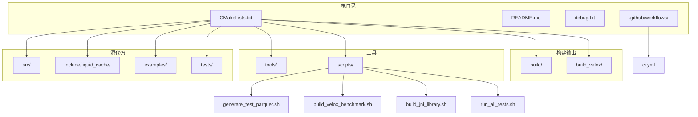
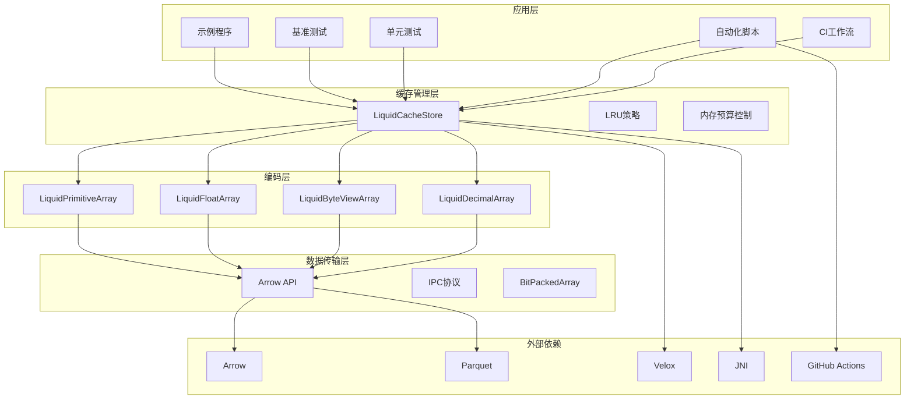
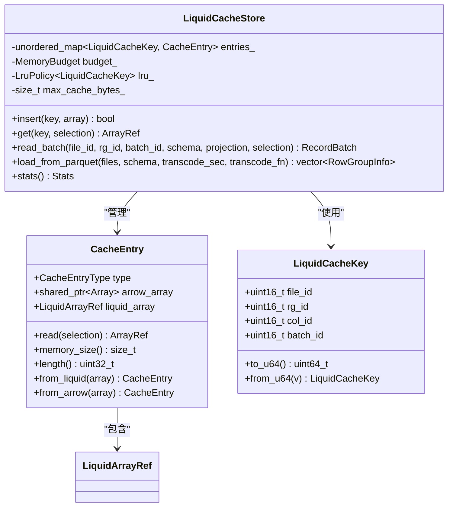
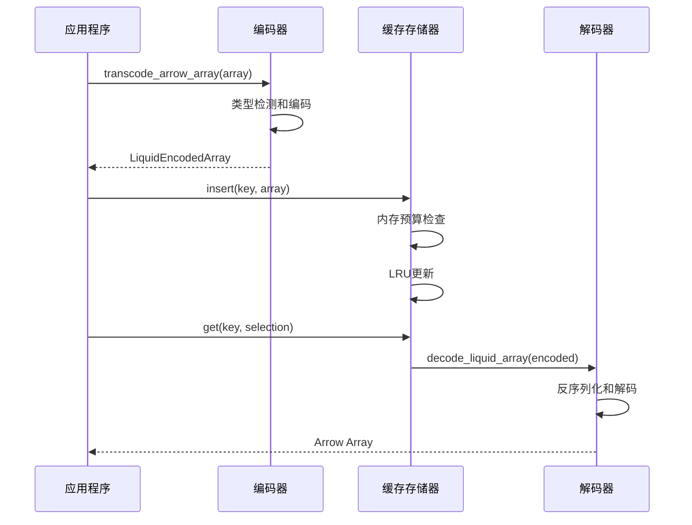
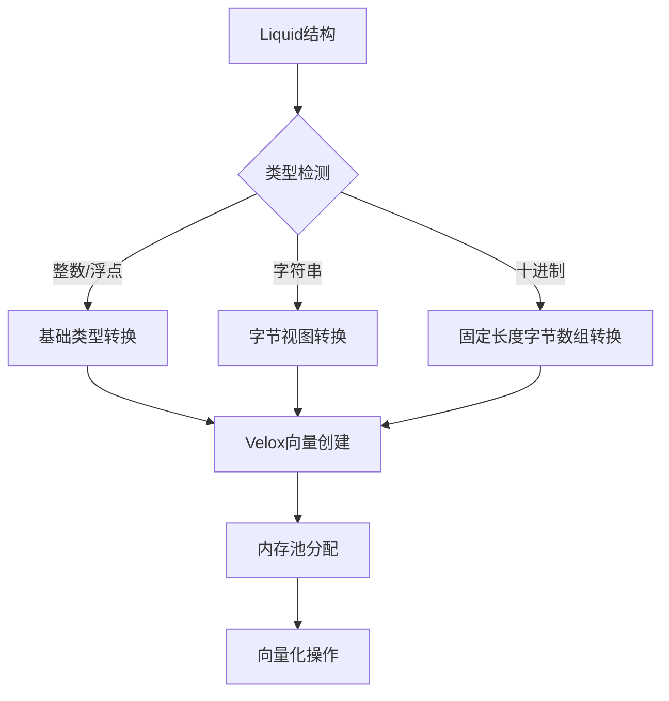
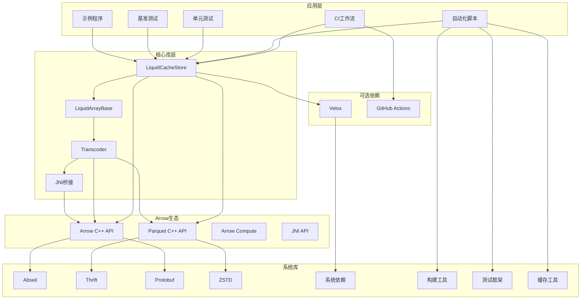

# 开发工具与实用程序

<cite>
**本文档引用的文件**
- [README.md](file://README.md)
- [CMakeLists.txt](file://CMakeLists.txt)
- [generate_test_parquet.cpp](file://tools/generate_test_parquet.cpp)
- [verify_parquet.cpp](file://tools/verify_parquet.cpp)
- [generate_test_parquet.sh](file://scripts/generate_test_parquet.sh)
- [build_velox_benchmark.sh](file://scripts/build_velox_benchmark.sh)
- [build_jni_library.sh](file://scripts/build_jni_library.sh)
- [run_all_tests.sh](file://scripts/run_all_tests.sh)
- [.github/workflows/ci.yml](file://.github/workflows/ci.yml)
- [transcoder_arrow.cpp](file://src/transcoder_arrow.cpp)
- [transcoder.h](file://include/liquid_cache/transcoder.h)
- [liquid_cache_store.h](file://include/liquid_cache/liquid_cache_store.h)
- [liquid_array.h](file://include/liquid_cache/liquid_array.h)
- [liquid_arrays.h](file://include/liquid_cache/liquid_arrays.h)
- [liquid_to_velox.h](file://include/liquid_cache/liquid_to_velox.h)
- [transcode_example.cpp](file://examples/transcode_example.cpp)
- [velox_benchmark.cpp](file://examples/velox_benchmark.cpp)
- [test_roundtrip.cpp](file://tests/test_roundtrip.cpp)
- [test_velox_crossval.cpp](file://tests/test_velox_crossval.cpp)
</cite>

## 目录
1. [简介](#简介)
2. [项目结构](#项目结构)
3. [核心组件](#核心组件)
4. [架构概览](#架构概览)
5. [详细组件分析](#详细组件分析)
6. [依赖关系分析](#依赖关系分析)
7. [性能考虑](#性能考虑)
8. [故障排除指南](#故障排除指南)
9. [结论](#结论)
10. [附录](#附录)

## 简介

本项目是一个高性能的列式缓存系统，专注于Arrow格式数据的压缩存储和快速解码。项目提供了完整的开发工具链，包括测试数据生成器、数据验证工具、基准测试程序、跨引擎兼容性验证以及全面的自动化脚本和持续集成支持。

该系统的核心特性包括：
- **多格式支持**：支持整数、浮点数、字符串、二进制、日期时间等多种Arrow数据类型
- **智能压缩**：采用帧参考+位打包、自适应无损浮点编码等压缩策略
- **零序列化读取**：内存中的Liquid结构直接访问，无需反序列化
- **跨引擎兼容**：支持Arrow、Velox等多种查询引擎
- **内存预算管理**：基于LRU的内存预算控制机制
- **自动化工具链**：提供完整的构建、测试和验证自动化脚本
- **持续集成支持**：完整的GitHub Actions CI工作流配置

## 项目结构

项目采用模块化的目录组织方式，主要包含以下核心目录：



**图表来源**
- [CMakeLists.txt:1-565](file://CMakeLists.txt#L1-L565)
- [.github/workflows/ci.yml:1-463](file://.github/workflows/ci.yml#L1-L463)

**章节来源**
- [CMakeLists.txt:1-565](file://CMakeLists.txt#L1-L565)

## 核心组件

### 测试数据生成器

测试数据生成器是项目的重要工具，用于创建大规模的测试数据集。它支持多种数据类型和配置选项。

#### 主要功能特性
- **多数据类型支持**：整数、浮点数、日期时间、字符串、二进制、十进制等
- **可配置参数**：输出路径、行数、批处理大小
- **高效生成**：使用Arrow的RecordBatch进行内存高效的批量生成
- **压缩配置**：默认使用Snappy压缩算法

#### 使用方法
```bash
# 生成默认大小的数据文件
./generate_test_parquet

# 指定输出路径
./generate_test_parquet /path/to/output.parquet

# 指定行数
./generate_test_parquet /path/to/output.parquet 1000000
```

**章节来源**
- [generate_test_parquet.cpp:1-314](file://tools/generate_test_parquet.cpp#L1-L314)

### 自动化脚本工具链

项目新增了四个强大的自动化脚本，显著增强了开发工具链的能力。

#### generate_test_parquet.sh - 测试数据生成脚本

这个脚本提供了完整的测试数据生成解决方案，支持多种配置选项和参数校验。

**主要功能**
- **智能构建**：自动检测并构建generate_test_parquet工具
- **灵活配置**：支持目标文件大小、行数、压缩格式等参数
- **参数校验**：完整的输入参数验证和错误处理
- **列类型覆盖**：生成包含所有支持数据类型的完整schema

**使用示例**
```bash
# 生成默认512MB测试数据
./scripts/generate_test_parquet.sh

# 生成1GB文件
./scripts/generate_test_parquet.sh -s 1

# 指定输出路径和行数
./scripts/generate_test_parquet.sh -r 10000000 -o /tmp/big.parquet
```

**章节来源**
- [generate_test_parquet.sh:1-262](file://scripts/generate_test_parquet.sh#L1-L262)

#### build_velox_benchmark.sh - Velox集成构建脚本

专门用于构建Velox集成版本的脚本，处理复杂的ABI兼容性问题。

**核心特性**
- **ABI兼容性检查**：自动检测并处理Velox Arrow 18与系统Arrow 24的不兼容问题
- **完整环境验证**：检查Velox构建目录的完整性
- **编译选项优化**：自动添加匹配Velox ABI的编译标志
- **构建状态报告**：提供详细的构建进度和结果报告

**使用示例**
```bash
# 基本构建
./scripts/build_velox_benchmark.sh

# 指定Velox路径
./scripts/build_velox_benchmark.sh -p /opt/velox/build

# 清理后重新构建
./scripts/build_velox_benchmark.sh --clean -j 8
```

**章节来源**
- [build_velox_benchmark.sh:1-261](file://scripts/build_velox_benchmark.sh#L1-L261)

#### build_jni_library.sh - JNI库构建脚本

用于构建JNI共享库的专用脚本，处理JNI相关的复杂依赖关系。

**功能特点**
- **JNI头文件检测**：自动检测系统中的JNI头文件
- **动态库链接处理**：解决PIC兼容性和静态库链接问题
- **符号验证**：检查生成的JNI库的导出符号
- **依赖分析**：提供详细的动态库依赖分析

**使用示例**
```bash
# 基本JNI库构建
./scripts/build_jni_library.sh

# 同时启用Velox集成
./scripts/build_jni_library.sh --with-velox /opt/velox/build

# 指定构建类型
./scripts/build_jni_library.sh -t Debug -j 4
```

**章节来源**
- [build_jni_library.sh:1-258](file://scripts/build_jni_library.sh#L1-L258)

#### run_all_tests.sh - 全量测试执行脚本

提供统一的测试执行界面，支持完整的测试套件运行。

**测试覆盖**
- **核心测试**：test_roundtrip、test_linear_integer、test_float_quantize、test_cache_budget
- **Velox测试**：test_velox_crossval（可选）
- **Parquet验证**：verify_parquet文件完整性检查
- **结果汇总**：详细的测试结果统计和报告

**使用示例**
```bash
# 运行完整测试套件
./scripts/run_all_tests.sh

# 启用Velox测试
./scripts/run_all_tests.sh --with-velox /opt/velox/build

# 指定测试过滤器
./scripts/run_all_tests.sh --gtest-filter "LiquidCache*"
```

**章节来源**
- [run_all_tests.sh:1-451](file://scripts/run_all_tests.sh#L1-L451)

### GitHub Actions CI工作流

项目配置了完整的持续集成工作流，支持自动化构建、测试和部署。

#### CI工作流特性
- **双作业架构**：基础构建测试作业和Velox集成构建作业
- **矩阵构建**：支持Debug和Release两种构建类型
- **依赖管理**：自动安装Apache Arrow 24.0.0和其他必需依赖
- **缓存优化**：使用ccache和Velox构建缓存提升构建速度
- **质量检查**：自动运行所有测试并验证生成的文件

**CI作业流程**
1. **基础构建作业**：构建Arrow 24环境下的所有目标
2. **Velox构建作业**：按需构建Velox集成版本
3. **测试验证**：运行所有单元测试和自定义测试
4. **文件验证**：验证生成的Parquet文件和JNI库

**章节来源**
- [.github/workflows/ci.yml:1-463](file://.github/workflows/ci.yml#L1-L463)

### 数据验证工具

数据验证工具用于验证Parquet文件的完整性和正确性，确保数据转换过程的可靠性。

#### 验证功能
- **文件完整性检查**：验证Parquet文件是否可正常打开和读取
- **元数据验证**：检查行数、列数、数据类型等元信息
- **Schema验证**：验证数据模式的正确性
- **行组统计**：报告行组数量和分布情况

**章节来源**
- [verify_parquet.cpp:1-76](file://tools/verify_parquet.cpp#L1-L76)

### 编译系统配置

项目使用CMake作为构建系统，提供了丰富的配置选项和自定义设置。

#### 关键配置选项
- **C++标准**：C++20标准，确保现代C++特性的使用
- **位置无关代码**：启用位置无关代码以支持共享库
- **可选依赖**：支持可选的Velox集成
- **静态链接优化**：针对Arrow、Parquet等库的静态链接配置

#### 构建目标
- **核心库**：liquid_cache_core（静态库）
- **JNI库**：liquid_cache_jni（共享库）
- **示例程序**：liquid_cache_example
- **测试工具**：generate_test_parquet、verify_parquet
- **Velox集成**：liquid_velox_benchmark（可选）

**章节来源**
- [CMakeLists.txt:1-565](file://CMakeLists.txt#L1-L565)

## 架构概览

系统采用分层架构设计，从底层的数据编码到上层的应用接口形成了清晰的层次结构。



**图表来源**
- [liquid_cache_store.h:188-527](file://include/liquid_cache/liquid_cache_store.h#L188-L527)
- [transcoder_arrow.cpp:28-746](file://src/transcoder_arrow.cpp#L28-L746)

## 详细组件分析

### LiquidCacheStore缓存存储器

LiquidCacheStore是系统的核心组件，实现了列式缓存存储和管理功能。

#### 核心设计原则
- **列式存储**：每个列的每个批次独立缓存，支持列投影
- **零序列化读取**：内存中的Liquid结构直接访问，无需反序列化
- **LRU淘汰策略**：基于时间戳的LRU算法，支持内存预算控制
- **线程安全**：使用互斥锁保证并发访问的安全性

#### 关键功能
- **批量加载**：从Parquet文件批量加载数据到缓存
- **列投影**：只解码请求的列，提高性能
- **行过滤**：通过布尔数组掩码应用行级过滤
- **内存管理**：自动内存预算控制和LRU淘汰



**图表来源**
- [liquid_cache_store.h:188-527](file://include/liquid_cache/liquid_cache_store.h#L188-L527)

**章节来源**
- [liquid_cache_store.h:188-527](file://include/liquid_cache/liquid_cache_store.h#L188-L527)

### 编码解码系统

系统实现了完整的数据编码解码管道，支持多种数据类型的高效压缩和解压。

#### 编码策略
- **整数类型**：帧参考+位打包编码，适用于有序或有范围的数据
- **浮点类型**：自适应无损浮点编码（ALP），通过指数变换实现无损压缩
- **字符串类型**：字节视图数组，支持字典压缩和FSST压缩
- **十进制类型**：根据数值范围选择合适的编码策略

#### IPC协议设计
系统采用自定义的IPC协议进行数据序列化，确保跨语言和跨平台的兼容性。



**图表来源**
- [transcoder_arrow.cpp:34-351](file://src/transcoder_arrow.cpp#L34-L351)
- [transcoder_arrow.cpp:378-477](file://src/transcoder_arrow.cpp#L378-L477)

**章节来源**
- [transcoder_arrow.cpp:34-351](file://src/transcoder_arrow.cpp#L34-L351)
- [transcoder_arrow.cpp:378-477](file://src/transcoder_arrow.cpp#L378-L477)

### 跨引擎兼容性

系统提供了对多个查询引擎的兼容性支持，特别是Velox引擎的深度集成。

#### Velox集成特性
- **类型映射**：将Liquid物理类型映射到Velox类型系统
- **零拷贝转换**：支持直接从Liquid结构转换为Velox向量
- **内存池管理**：与Velox的内存管理系统无缝集成
- **向量化操作**：支持Velox的向量化执行模型



**图表来源**
- [liquid_to_velox.h:69-133](file://include/liquid_cache/liquid_to_velox.h#L69-L133)

**章节来源**
- [liquid_to_velox.h:69-133](file://include/liquid_cache/liquid_to_velox.h#L69-L133)

## 依赖关系分析

项目具有清晰的依赖关系层次，从底层的Arrow库到上层的应用程序形成了稳定的依赖链。



**图表来源**
- [CMakeLists.txt:14-179](file://CMakeLists.txt#L14-L179)

**章节来源**
- [CMakeLists.txt:14-179](file://CMakeLists.txt#L14-L179)

## 性能考虑

系统在设计时充分考虑了性能优化，采用了多种技术来提升数据处理效率。

### 压缩策略优化
- **自适应编码**：根据数据特征选择最优的编码策略
- **批量处理**：使用Arrow的RecordBatch进行批量数据处理
- **内存局部性**：列式存储提高内存访问局部性
- **零拷贝操作**：尽量减少数据复制操作

### 并发性能
- **无锁数据结构**：在读取路径使用无锁数据结构
- **细粒度锁定**：仅在必要的写操作时使用互斥锁
- **批量更新**：支持批量插入和更新操作

### 内存管理
- **预算控制**：可配置的内存预算限制
- **LRU淘汰**：基于访问频率的智能淘汰策略
- **内存池**：使用Arrow的内存池提高内存分配效率

### 自动化工具性能优化
- **并行构建**：脚本支持多任务并行编译
- **缓存利用**：自动利用构建缓存减少重复工作
- **条件构建**：仅构建必要的目标和测试
- **资源监控**：实时监控构建进度和资源使用

## 故障排除指南

### 常见问题及解决方案

#### 构建问题
- **依赖缺失**：确保Arrow、Parquet、JNI等依赖正确安装
- **编译器版本**：需要支持C++20标准的编译器
- **静态链接问题**：检查静态库文件的可用性和兼容性
- **Velox ABI不兼容**：使用提供的构建脚本自动处理ABI兼容性

#### 运行时错误
- **内存不足**：调整内存预算设置或增加系统内存
- **类型不匹配**：检查数据类型转换和映射配置
- **文件损坏**：使用验证工具检查Parquet文件完整性
- **JNI库加载失败**：检查JNI库的符号和依赖关系

#### 性能问题
- **解码速度慢**：检查是否有不必要的列投影或行过滤
- **内存使用过高**：优化缓存大小和LRU策略
- **CPU使用率高**：考虑启用SIMD指令集优化
- **构建时间长**：利用缓存和并行构建优化

#### 自动化脚本问题
- **脚本权限**：确保脚本具有执行权限
- **参数错误**：检查脚本参数的正确性和有效性
- **环境变量**：验证必要的环境变量已正确设置
- **依赖工具**：确认所需的系统工具已安装

**章节来源**
- [CMakeLists.txt:1-565](file://CMakeLists.txt#L1-L565)

## 结论

本项目提供了一个完整且高效的列式缓存系统，具有以下优势：

1. **功能完整性**：涵盖了从数据生成、验证到存储、查询的完整工具链
2. **性能优异**：通过多种压缩技术和优化策略实现高性能数据处理
3. **扩展性强**：模块化设计支持新数据类型和查询引擎的扩展
4. **易用性好**：提供丰富的配置选项和详细的使用文档
5. **自动化程度高**：新增的脚本和CI工作流大幅提升了开发效率
6. **持续集成支持**：完整的CI配置确保代码质量和稳定性

该系统特别适合需要高性能数据分析和处理的应用场景，为开发者提供了强大的工具支持。新增的自动化脚本和CI工作流配置进一步简化了开发流程，提高了项目的可维护性和可靠性。

## 附录

### 开发环境配置

#### 必需工具
- **编译器**：支持C++20标准的编译器
- **构建系统**：CMake 3.16+
- **包管理器**：用于安装Arrow、Parquet等依赖
- **脚本环境**：Bash、GNU coreutils、bc等

#### IDE配置建议
- **Visual Studio Code**：推荐使用C++扩展和CMake Tools插件
- **CLion**：原生CMake支持，适合大型项目开发
- **VS Studio**：Windows平台的最佳选择

#### 调试设置
- **断点调试**：建议在关键函数入口设置断点
- **日志输出**：使用glog进行结构化日志记录
- **性能分析**：使用perf或Valgrind进行性能分析
- **脚本调试**：使用set -x和set -e进行shell脚本调试

### 常用开发任务

#### 代码格式化
- **工具**：使用clang-format进行代码格式化
- **配置**：遵循项目提供的格式化配置文件
- **自动化**：集成到CI/CD流程中

#### 静态分析
- **工具**：使用Clang Static Analyzer或PVS-Studio
- **规则**：遵循Google C++ Style Guide
- **集成**：在构建过程中自动运行

#### 持续集成
- **平台**：支持Linux、macOS、Windows
- **测试**：自动运行单元测试和集成测试
- **构建**：多配置构建和交叉编译支持
- **自动化**：完整的CI工作流配置

#### 自动化脚本使用
- **测试数据生成**：使用generate_test_parquet.sh生成测试数据
- **构建优化**：使用run_all_tests.sh统一执行测试
- **Velox集成**：使用build_velox_benchmark.sh构建Velox版本
- **JNI开发**：使用build_jni_library.sh构建JNI库

#### 脚本最佳实践
- **参数验证**：始终验证脚本参数的有效性
- **错误处理**：实现完善的错误处理和恢复机制
- **日志记录**：提供详细的日志输出便于调试
- **清理机制**：实现适当的清理和资源释放
- **并行优化**：合理利用并行构建提升效率
- **缓存利用**：充分利用构建缓存减少重复工作