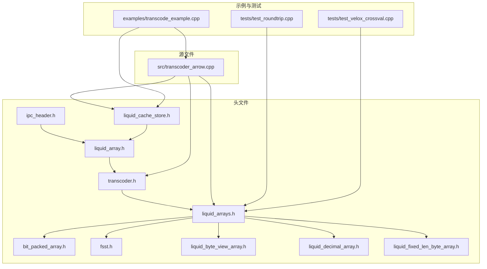
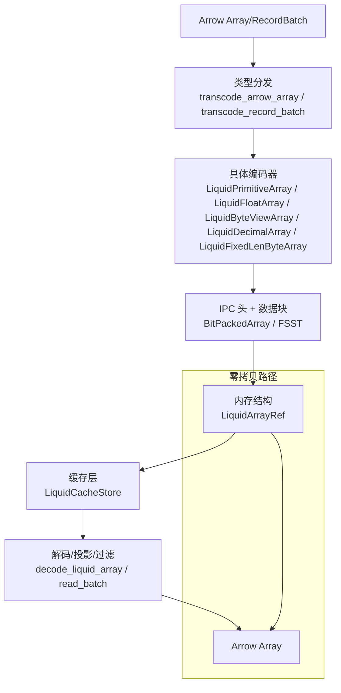
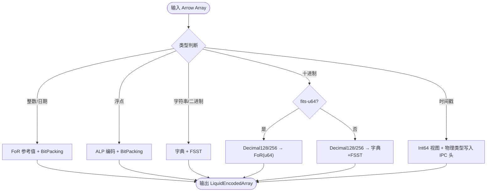
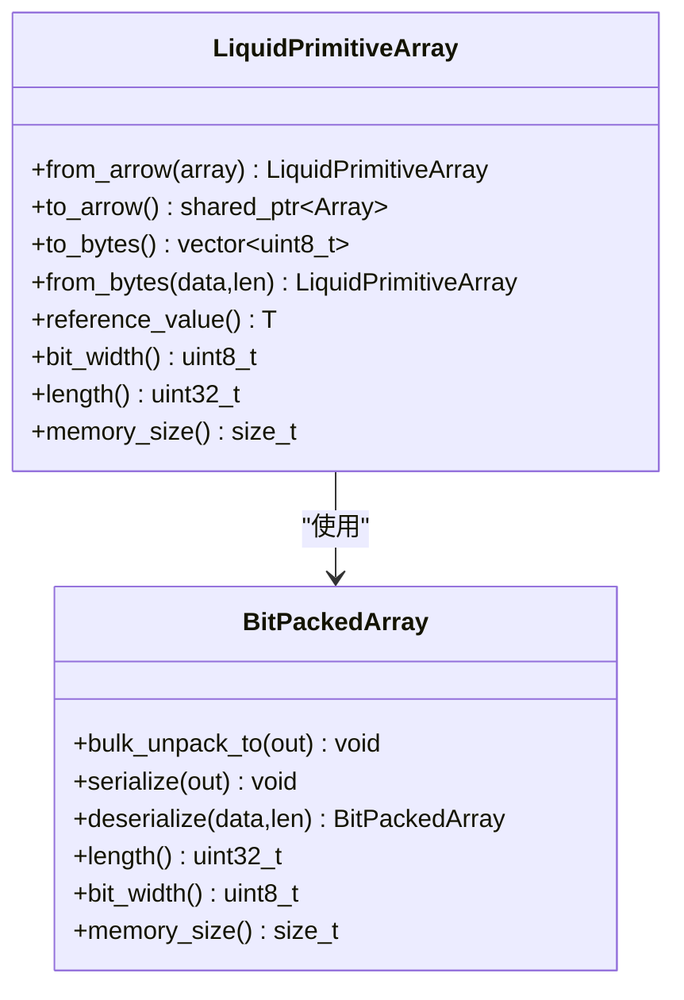
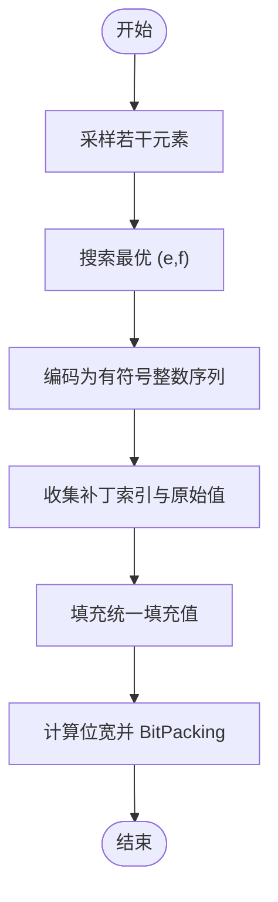
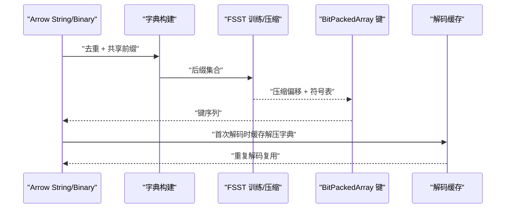
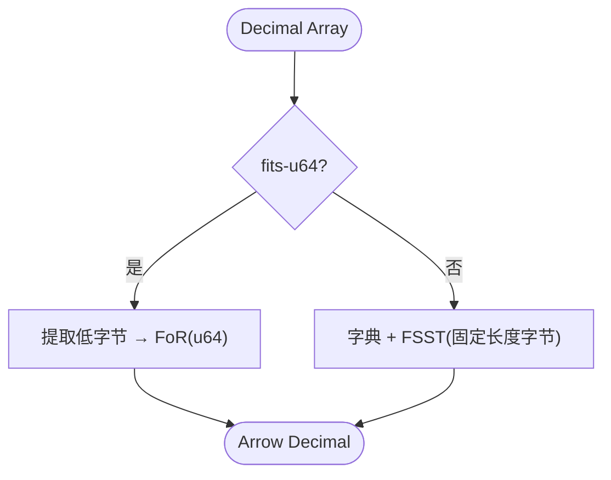
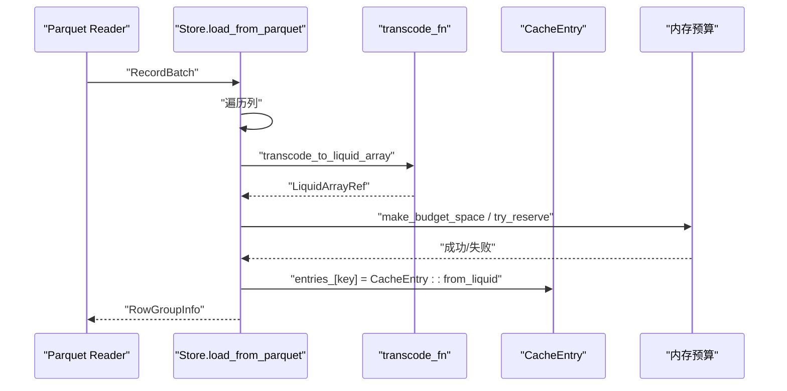
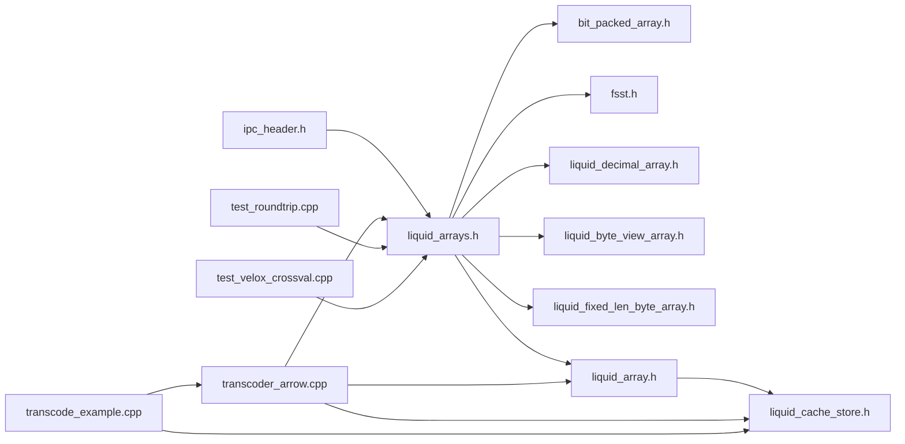

# Arrow 集成

<cite>
**本文档引用的文件**
- [README.md](file://README.md)
- [transcoder_arrow.cpp](file://src/transcoder_arrow.cpp)
- [transcoder.h](file://include/liquid_cache/transcoder.h)
- [liquid_arrays.h](file://include/liquid_cache/liquid_arrays.h)
- [liquid_cache_store.h](file://include/liquid_cache/liquid_cache_store.h)
- [bit_packed_array.h](file://include/liquid_cache/bit_packed_array.h)
- [fsst.h](file://include/liquid_cache/fsst.h)
- [liquid_byte_view_array.h](file://include/liquid_cache/liquid_byte_view_array.h)
- [liquid_decimal_array.h](file://include/liquid_cache/liquid_decimal_array.h)
- [liquid_fixed_len_byte_array.h](file://include/liquid_cache/liquid_fixed_len_byte_array.h)
- [ipc_header.h](file://include/liquid_cache/ipc_header.h)
- [liquid_array.h](file://include/liquid_cache/liquid_array.h)
- [transcode_example.cpp](file://examples/transcode_example.cpp)
- [test_roundtrip.cpp](file://tests/test_roundtrip.cpp)
- [test_velox_crossval.cpp](file://tests/test_velox_crossval.cpp)
</cite>

## 目录
1. [简介](#简介)
2. [项目结构](#项目结构)
3. [核心组件](#核心组件)
4. [架构总览](#架构总览)
5. [详细组件分析](#详细组件分析)
6. [依赖关系分析](#依赖关系分析)
7. [性能考量](#性能考量)
8. [故障排查指南](#故障排查指南)
9. [结论](#结论)
10. [附录](#附录)

## 简介
本项目为 Apache Arrow 与 Liquid Cache 的集成实现，提供从 Arrow 数组到 Liquid 编码格式的高效转码与解码能力。核心目标包括：
- 基于 Arrow 类型系统进行类型分发与转码
- 整数类型采用帧参考（FoR）+ 位打包（BitPacking）压缩
- 浮点类型采用自适应无损浮点编码（ALP）+ 位打包
- 字符串/二进制类型采用字典 + FSST 压缩
- 时间戳类型转换为整型存储并保留物理单位信息
- 支持 Arrow RecordBatch 批量处理与列式缓存
- 提供零拷贝解码路径与内存池管理

## 项目结构
仓库采用模块化设计，核心目录与文件如下：
- include/liquid_cache：核心头文件，定义 IPC 头、数组类型、转码器等
- src：实现文件，包含 Arrow 与 Liquid 的桥接转码逻辑
- tests：单元测试与交叉验证，覆盖 round-trip 正确性与跨引擎一致性
- examples：示例程序，展示 Parquet 加载、缓存与基准测试流程
- build/build_velox：可选的 Velox 集成构建产物

**图表来源**
- [transcoder_arrow.cpp](file://src/transcoder_arrow.cpp)
- [transcoder.h](file://include/liquid_cache/transcoder.h)
- [liquid_arrays.h](file://include/liquid_cache/liquid_arrays.h)
- [liquid_cache_store.h](file://include/liquid_cache/liquid_cache_store.h)
- [bit_packed_array.h](file://include/liquid_cache/bit_packed_array.h)
- [fsst.h](file://include/liquid_cache/fsst.h)
- [liquid_byte_view_array.h](file://include/liquid_cache/liquid_byte_view_array.h)
- [liquid_decimal_array.h](file://include/liquid_cache/liquid_decimal_array.h)
- [liquid_fixed_len_byte_array.h](file://include/liquid_cache/liquid_fixed_len_byte_array.h)
- [ipc_header.h](file://include/liquid_cache/ipc_header.h)
- [liquid_array.h](file://include/liquid_cache/liquid_array.h)
- [transcode_example.cpp](file://examples/transcode_example.cpp)
- [test_roundtrip.cpp](file://tests/test_roundtrip.cpp)
- [test_velox_crossval.cpp](file://tests/test_velox_crossval.cpp)

**章节来源**
- [README.md](file://README.md)
- [transcoder_arrow.cpp](file://src/transcoder_arrow.cpp)
- [transcoder.h](file://include/liquid_cache/transcoder.h)

## 核心组件
- 类型分发与转码入口
  - transcode_arrow_array：按 Arrow 类型 ID 分发到具体编码器
  - transcode_record_batch：批量转码 RecordBatch 的每一列
  - decode_liquid_array：根据 IPC 头反序列化并重建 Arrow 数组
  - transcode_to_liquid_array：返回内存中的 Liquid 结构（非序列化），用于缓存
- 编码器与解码器
  - 整数/日期：LiquidPrimitiveArray（FoR + BitPacking）
  - 浮点：LiquidFloatArray（ALP + BitPacking）
  - 字节视图：LiquidByteViewArray（字典 + FSST）
  - 十进制：LiquidDecimalArray（fits-u64 路径）与 LiquidFixedLenByteArray（FSST 字典）
- 底层压缩与数据结构
  - BitPackedArray：位打包容器，支持批量解包与对齐
  - FSST：静态符号表压缩器，训练与压缩/解压接口
  - IPC 头：统一的 16 字节头，标识逻辑/物理类型与版本
- 缓存与批处理
  - LiquidCacheStore：列式缓存，支持投影、过滤与内存预算
  - load_from_parquet：从 Parquet 读取并转码入库

**章节来源**
- [transcoder_arrow.cpp](file://src/transcoder_arrow.cpp)
- [transcoder.h](file://include/liquid_cache/transcoder.h)
- [liquid_arrays.h](file://include/liquid_cache/liquid_arrays.h)
- [liquid_cache_store.h](file://include/liquid_cache/liquid_cache_store.h)
- [bit_packed_array.h](file://include/liquid_cache/bit_packed_array.h)
- [fsst.h](file://include/liquid_cache/fsst.h)
- [liquid_byte_view_array.h](file://include/liquid_cache/liquid_byte_view_array.h)
- [liquid_decimal_array.h](file://include/liquid_cache/liquid_decimal_array.h)
- [liquid_fixed_len_byte_array.h](file://include/liquid_cache/liquid_fixed_len_byte_array.h)
- [ipc_header.h](file://include/liquid_cache/ipc_header.h)
- [liquid_array.h](file://include/liquid_cache/liquid_array.h)

## 架构总览
整体架构围绕“Arrow 类型 → Liquid 编码 → 内存缓存/序列化”展开，支持零拷贝解码与列式投影。

**图表来源**
- [transcoder_arrow.cpp](file://src/transcoder_arrow.cpp)
- [liquid_cache_store.h](file://include/liquid_cache/liquid_cache_store.h)
- [liquid_array.h](file://include/liquid_cache/liquid_array.h)
- [ipc_header.h](file://include/liquid_cache/ipc_header.h)
- [bit_packed_array.h](file://include/liquid_cache/bit_packed_array.h)
- [fsst.h](file://include/liquid_cache/fsst.h)

## 详细组件分析

### 类型分发与 Arrow 桥接
- 整数/日期/时间戳：FoR + BitPacking
  - 整数类型：基于最小值作为参考值，计算无符号偏移后按位宽打包
  - 日期类型：与整数一致的编码方式
  - 时间戳：拒绝带时区类型；按单位（秒/毫秒/微秒/纳秒）存储为 Int64，并在 IPC 头中记录物理类型
- 浮点类型：ALP（自适应无损浮点）+ BitPacking
  - 通过枚举最优指数对（e,f）进行编码，记录补丁位置与原始值以保证无损
- 字符串/二进制：字典 + FSST
  - 生成共享前缀，对后缀进行 FSST 训练与压缩，使用紧凑偏移表与位打包键
- 十进制：两路策略
  - fits-u64：直接用整型路径（FoR + BitPacking）
  - 大值：字典 + FSST（固定长度字节数组）

**图表来源**
- [transcoder_arrow.cpp](file://src/transcoder_arrow.cpp)
- [transcoder.h](file://include/liquid_cache/transcoder.h)
- [liquid_decimal_array.h](file://include/liquid_cache/liquid_decimal_array.h)
- [liquid_fixed_len_byte_array.h](file://include/liquid_cache/liquid_fixed_len_byte_array.h)
- [liquid_byte_view_array.h](file://include/liquid_cache/liquid_byte_view_array.h)

**章节来源**
- [transcoder_arrow.cpp](file://src/transcoder_arrow.cpp)
- [transcoder.h](file://include/liquid_cache/transcoder.h)

### 编码器实现要点

#### 整数/日期：FoR + BitPacking
- 参考值：非空元素的最小值
- 位宽：由最大偏移决定，使用 get_bit_width 计算
- BitPackedArray：支持批量解包与对齐，零拷贝构造 Arrow 数组

**图表来源**
- [liquid_arrays.h](file://include/liquid_cache/liquid_arrays.h)
- [bit_packed_array.h](file://include/liquid_cache/bit_packed_array.h)

**章节来源**
- [liquid_arrays.h](file://include/liquid_cache/liquid_arrays.h)
- [bit_packed_array.h](file://include/liquid_cache/bit_packed_array.h)

#### 浮点：ALP + BitPacking
- 指数搜索：在采样范围内搜索最优 (e,f)，最小化补丁数量与位宽乘积
- 补丁策略：对无法精确还原的位置记录索引与原始值，其余填充统一填充值
- 解码路径：按相同 (e,f) 还原，再与补丁合并

**图表来源**
- [transcoder.h](file://include/liquid_cache/transcoder.h)

**章节来源**
- [transcoder.h](file://include/liquid_cache/transcoder.h)

#### 字符串/二进制：字典 + FSST
- 字典构建：去重得到唯一后缀，计算共享前缀
- FSST 训练：对所有后缀拼接进行大二元/三元组统计，选择高收益符号
- 压缩：逐个后缀压缩，记录压缩偏移
- 解码：缓存解压后的字典，批量解包键并拼接共享前缀

**图表来源**
- [liquid_byte_view_array.h](file://include/liquid_cache/liquid_byte_view_array.h)
- [fsst.h](file://include/liquid_cache/fsst.h)
- [bit_packed_array.h](file://include/liquid_cache/bit_packed_array.h)

**章节来源**
- [liquid_byte_view_array.h](file://include/liquid_cache/liquid_byte_view_array.h)
- [fsst.h](file://include/liquid_cache/fsst.h)

#### 十进制：两路策略
- fits-u64：将 Decimal128/256 的低 8/32 字节视为无符号整型，走 FoR + BitPacking
- 大值：字典 + FSST，键为 UInt16，值为原始字节序列

**图表来源**
- [liquid_decimal_array.h](file://include/liquid_cache/liquid_decimal_array.h)
- [liquid_fixed_len_byte_array.h](file://include/liquid_cache/liquid_fixed_len_byte_array.h)

**章节来源**
- [liquid_decimal_array.h](file://include/liquid_cache/liquid_decimal_array.h)
- [liquid_fixed_len_byte_array.h](file://include/liquid_cache/liquid_fixed_len_byte_array.h)

### 缓存与批处理：LiquidCacheStore
- 列式缓存：每个列的每个批次独立缓存，键包含文件/行组/列/批次
- 投影与过滤：读取时仅解码所需列，支持布尔掩码过滤
- 内存预算：LRU 驱动的内存配额控制，插入时预留空间并驱逐
- 批量加载：从 Parquet 读取 RecordBatch，逐列转码并入库

**图表来源**
- [transcoder_arrow.cpp](file://src/transcoder_arrow.cpp)
- [liquid_cache_store.h](file://include/liquid_cache/liquid_cache_store.h)

**章节来源**
- [transcoder_arrow.cpp](file://src/transcoder_arrow.cpp)
- [liquid_cache_store.h](file://include/liquid_cache/liquid_cache_store.h)

### API 使用示例
- transcode_arrow_array
  - 输入：std::shared_ptr<arrow::Array>
  - 输出：LiquidEncodedArray（包含序列化字节、长度、内存大小）
  - 适用场景：将单列 Arrow 数组转为 Liquid 编码，便于持久化或网络传输
- transcode_record_batch
  - 输入：std::shared_ptr<arrow::RecordBatch>
  - 输出：std::vector<LiquidEncodedArray>
  - 适用场景：批量转码整个 RecordBatch 的所有列
- decode_liquid_array
  - 输入：LiquidEncodedArray
  - 输出：std::shared_ptr<arrow::Array>
  - 适用场景：从 Liquid 编码重建 Arrow 数组，支持零拷贝路径（当原始类型与存储类型一致时）
- transcode_to_liquid_array
  - 输入：std::shared_ptr<arrow::Array>
  - 输出：LiquidArrayRef（内存中的结构，非序列化）
  - 适用场景：直接写入缓存，避免额外序列化开销

**章节来源**
- [transcoder_arrow.cpp](file://src/transcoder_arrow.cpp)
- [transcoder.h](file://include/liquid_cache/transcoder.h)
- [liquid_array.h](file://include/liquid_cache/liquid_array.h)

## 依赖关系分析
- 头文件间依赖
  - ipc_header.h 为所有编码器提供统一 IPC 头
  - liquid_array.h 定义抽象基类与类型擦除包装器
  - liquid_arrays.h 提供模板化数组类型与工具函数
  - bit_packed_array.h 与 fsst.h 为底层压缩基础设施
  - liquid_cache_store.h 依赖上述组件实现缓存功能
- 源文件依赖
  - transcoder_arrow.cpp 依赖 Arrow API 与上述头文件，实现类型分发与转码
- 示例与测试
  - transcode_example.cpp 展示从 Parquet 加载、转码、缓存与基准对比
  - test_roundtrip.cpp 验证 round-trip 正确性
  - test_velox_crossval.cpp 验证与 Velox 的一致性（条件编译）

**图表来源**
- [transcoder_arrow.cpp](file://src/transcoder_arrow.cpp)
- [transcoder.h](file://include/liquid_cache/transcoder.h)
- [liquid_arrays.h](file://include/liquid_cache/liquid_arrays.h)
- [liquid_cache_store.h](file://include/liquid_cache/liquid_cache_store.h)
- [bit_packed_array.h](file://include/liquid_cache/bit_packed_array.h)
- [fsst.h](file://include/liquid_cache/fsst.h)
- [liquid_byte_view_array.h](file://include/liquid_cache/liquid_byte_view_array.h)
- [liquid_decimal_array.h](file://include/liquid_cache/liquid_decimal_array.h)
- [liquid_fixed_len_byte_array.h](file://include/liquid_cache/liquid_fixed_len_byte_array.h)
- [ipc_header.h](file://include/liquid_cache/ipc_header.h)
- [liquid_array.h](file://include/liquid_cache/liquid_array.h)
- [transcode_example.cpp](file://examples/transcode_example.cpp)
- [test_roundtrip.cpp](file://tests/test_roundtrip.cpp)
- [test_velox_crossval.cpp](file://tests/test_velox_crossval.cpp)

**章节来源**
- [transcoder_arrow.cpp](file://src/transcoder_arrow.cpp)
- [transcoder.h](file://include/liquid_cache/transcoder.h)
- [liquid_arrays.h](file://include/liquid_cache/liquid_arrays.h)
- [liquid_cache_store.h](file://include/liquid_cache/liquid_cache_store.h)

## 性能考量
- 压缩策略
  - 整数/日期：FoR + BitPacking 在单调或小范围数据上效果显著
  - 浮点：ALP 在常见分布下可获得良好压缩比，补丁开销可控
  - 字符串/二进制：字典 + FSST 对重复性强的数据收益明显
  - 十进制：fits-u64 路径避免了固定长度字节的额外开销
- 内存与零拷贝
  - BitPackedArray 支持批量解包，减少循环开销
  - LiquidCacheStore 直接持有内存中的 Liquid 结构，避免重复序列化
  - decode_liquid_array 在物理类型与原始类型一致时可零拷贝重建 Arrow 数组
- 并发与批处理
  - RecordBatch 级别并行转码（每列独立）
  - LRU 驱动的内存预算，避免 OOM
- 基准测试
  - 示例程序提供 Parquet 与缓存解码的对比基准，建议在目标数据集上运行以评估收益

**章节来源**
- [transcoder_arrow.cpp](file://src/transcoder_arrow.cpp)
- [transcode_example.cpp](file://examples/transcode_example.cpp)
- [test_roundtrip.cpp](file://tests/test_roundtrip.cpp)

## 故障排查指南
- 类型不支持
  - 当遇到不支持的 Arrow 类型时，转码函数会返回空结果。请确认类型是否在分发列表中。
- 时间戳带时区
  - 带时区的时间戳会被拒绝（保持长度信息），请先转换为 UTC 或无时区类型。
- FSST 符号表不匹配
  - FSST 压缩依赖符号表，若版本或训练数据不一致会导致解压失败。
- 内存不足
  - 缓存插入失败时检查内存预算设置与当前使用量，必要时增大上限或清理历史条目。
- 解码类型不一致
  - 若解码后类型与期望不符，请检查原始 Arrow 类型与 IPC 头中的物理类型映射。

**章节来源**
- [transcoder_arrow.cpp](file://src/transcoder_arrow.cpp)
- [liquid_cache_store.h](file://include/liquid_cache/liquid_cache_store.h)
- [liquid_byte_view_array.h](file://include/liquid_cache/liquid_byte_view_array.h)

## 结论
本项目通过 Arrow 类型分发与多种压缩策略，实现了高性能的列式数据编码与缓存。FoR + BitPacking、ALP + BitPacking、字典 + FSST 以及两路十进制策略覆盖了主流数据类型与分布特征。结合零拷贝解码与列式缓存，可在分析场景中显著降低解码成本与内存占用。建议在实际部署中结合业务数据分布选择合适的策略，并通过基准测试持续评估性能与压缩比。

## 附录
- 示例程序
  - 运行示例：从 Parquet 文件加载数据，转码并缓存，随后与直接读取进行性能对比
- 单元测试
  - round-trip 正确性测试：覆盖整数、浮点、字符串、二进制、十进制等类型
  - 与 Velox 的交叉验证：确保跨引擎一致性（需启用相应宏）

**章节来源**
- [transcode_example.cpp](file://examples/transcode_example.cpp)
- [test_roundtrip.cpp](file://tests/test_roundtrip.cpp)
- [test_velox_crossval.cpp](file://tests/test_velox_crossval.cpp)