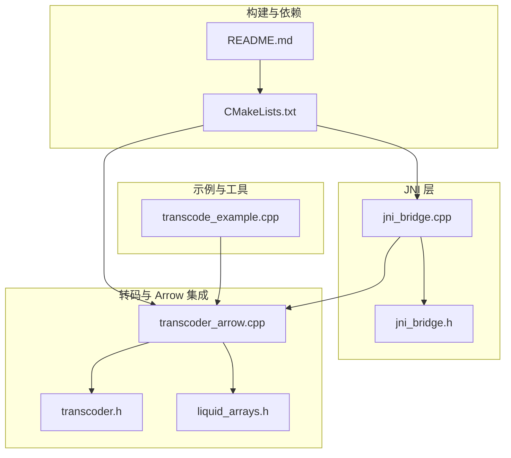
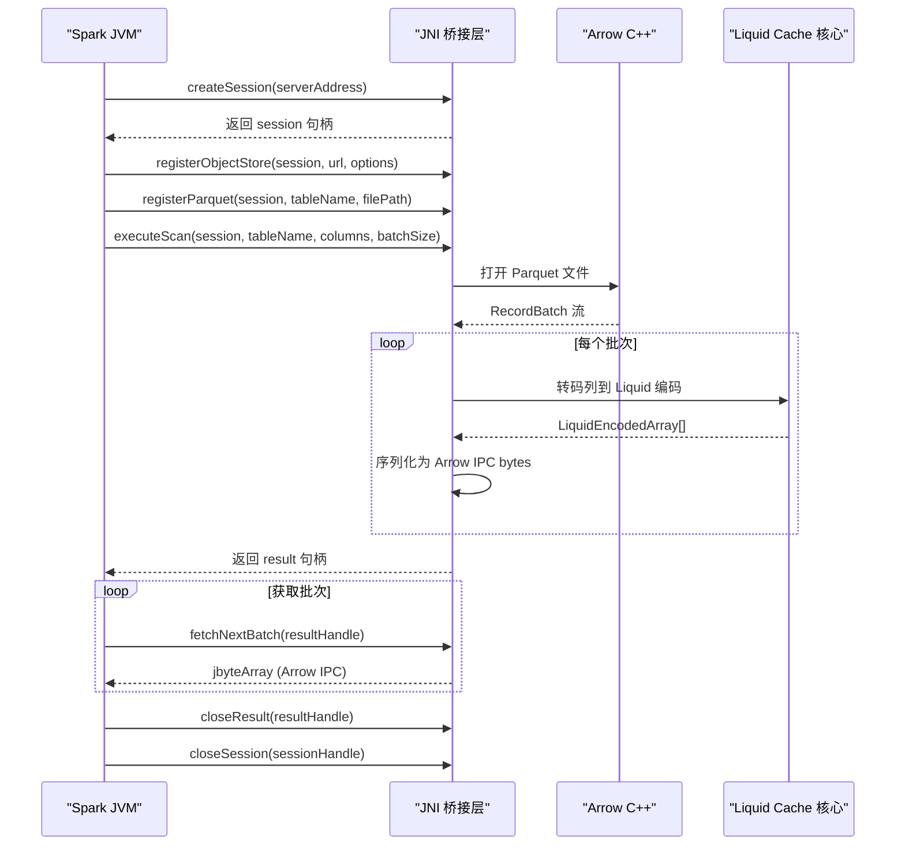
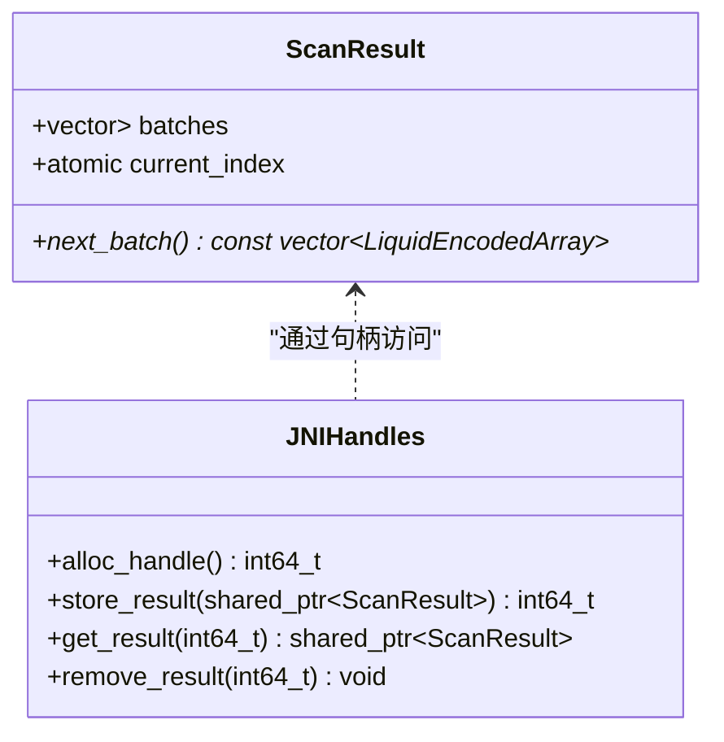
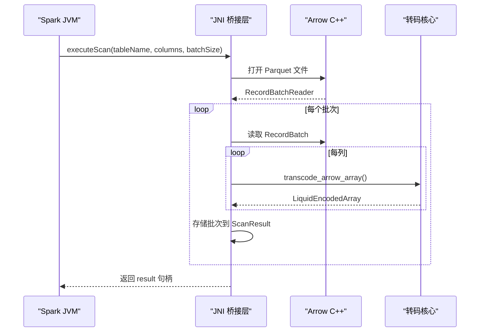
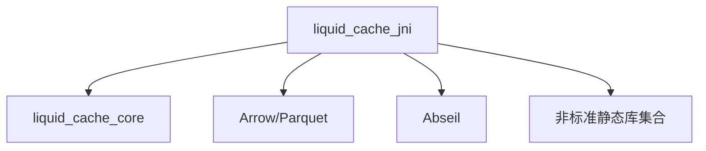

# JNI 桥接

<cite>
**本文档引用的文件**
- [jni_bridge.h](file://include/liquid_cache/jni_bridge.h)
- [jni_bridge.cpp](file://src/jni_bridge.cpp)
- [transcoder.h](file://include/liquid_cache/transcoder.h)
- [transcoder_arrow.cpp](file://src/transcoder_arrow.cpp)
- [liquid_arrays.h](file://include/liquid_cache/liquid_arrays.h)
- [CMakeLists.txt](file://CMakeLists.txt)
- [README.md](file://README.md)
- [transcode_example.cpp](file://examples/transcode_example.cpp)
</cite>

## 目录
1. [简介](#简介)
2. [项目结构](#项目结构)
3. [核心组件](#核心组件)
4. [架构总览](#架构总览)
5. [详细组件分析](#详细组件分析)
6. [依赖关系分析](#依赖关系分析)
7. [性能考量](#性能考量)
8. [故障排除指南](#故障排除指南)
9. [结论](#结论)
10. [附录](#附录)

## 简介
本文件面向需要在 Spark 生态中集成 Liquid Cache 的工程师，系统性阐述 C++ 实现的 JNI 桥接层设计与实现细节。内容涵盖：
- Java 与 C++ 之间的互操作：数据类型映射、内存管理、异常处理
- Spark 集成：RDD 创建、分区处理、执行上下文管理
- 生命周期管理：对象创建、句柄分配、引用管理、资源清理
- JNI 接口使用示例：缓存初始化、数据加载、查询执行
- 性能优化：本地方法调用优化、内存池复用、并发安全
- 故障排除：常见 JNI 错误、内存泄漏检测、调试技巧
- 与不同 Spark 版本的兼容性与部署注意事项

## 项目结构
该项目采用模块化组织，核心 JNI 桥接位于 src/jni_bridge.cpp 与 include/liquid_cache/jni_bridge.h，底层转码与 Arrow 集成位于 src/transcoder_arrow.cpp 与 include/liquid_cache/transcoder.h，数组编码结构体位于 include/liquid_cache/liquid_arrays.h。构建系统通过 CMakeLists.txt 统一管理依赖与目标。

图表来源
- [jni_bridge.h:1-217](file://include/liquid_cache/jni_bridge.h#L1-L217)
- [jni_bridge.cpp:1-320](file://src/jni_bridge.cpp#L1-L320)
- [transcoder.h:1-360](file://include/liquid_cache/transcoder.h#L1-L360)
- [transcoder_arrow.cpp:1-746](file://src/transcoder_arrow.cpp#L1-L746)
- [liquid_arrays.h:1-800](file://include/liquid_cache/liquid_arrays.h#L1-L800)
- [CMakeLists.txt:1-563](file://CMakeLists.txt#L1-L563)
- [README.md:1-378](file://README.md#L1-L378)
- [transcode_example.cpp:1-550](file://examples/transcode_example.cpp#L1-L550)

章节来源
- [CMakeLists.txt:1-563](file://CMakeLists.txt#L1-L563)
- [README.md:1-378](file://README.md#L1-L378)

## 核心组件
- JNI 入口与句柄管理：提供会话与结果句柄的分配、存储、查询与删除，保证线程安全。
- JNI 辅助函数：字符串与数组转换、异常抛出。
- Arrow IPC 序列化：将转码后的列批量序列化为二进制格式，供 JVM 侧消费。
- JNI 本地方法实现：创建会话、注册对象存储、注册 Parquet 表、执行扫描、获取下一批次、关闭结果与会话。
- 转码与解码：基于 Arrow 的数组转码为 Liquid 编码，以及反向解码。
- 数组编码结构：定义 LiquidEncodedArray、类型枚举、位打包数组等。

章节来源
- [jni_bridge.h:22-161](file://include/liquid_cache/jni_bridge.h#L22-L161)
- [jni_bridge.cpp:176-319](file://src/jni_bridge.cpp#L176-L319)
- [transcoder.h:15-360](file://include/liquid_cache/transcoder.h#L15-L360)
- [transcoder_arrow.cpp:34-477](file://src/transcoder_arrow.cpp#L34-L477)
- [liquid_arrays.h:35-248](file://include/liquid_cache/liquid_arrays.h#L35-L248)

## 架构总览
JNI 桥接层在 Spark JVM 与 C++ 核心之间建立双向通道：
- JVM 侧通过 org.apache.spark.sql.execution.liquidcache.LiquidCacheNative 调用本地方法
- 本地方法在 C++ 侧完成 Parquet 读取、转码、批次序列化，并以 jbyteArray 返回给 JVM
- 批次数据以 Arrow IPC Stream 格式传输，确保与现有 Scala 代码兼容

图表来源
- [jni_bridge.cpp:10-16](file://src/jni_bridge.cpp#L10-L16)
- [jni_bridge.cpp:190-317](file://src/jni_bridge.cpp#L190-L317)
- [transcoder_arrow.cpp:44-351](file://src/transcoder_arrow.cpp#L44-L351)

## 详细组件分析

### JNI 入口与句柄管理
- 会话与结果句柄：使用原子计数器分配唯一句柄，全局哈希表存储会话与结果，配合互斥锁保证线程安全。
- 结果游标：ScanResult 内部维护 current_index，按顺序返回批次，避免重复消费。
- 会话与结果的生命周期：createSession 分配并存储会话；executeScan 创建 ScanResult 并返回句柄；closeResult 与 closeSession 负责清理。

图表来源
- [jni_bridge.h:42-93](file://include/liquid_cache/jni_bridge.h#L42-L93)

章节来源
- [jni_bridge.h:30-93](file://include/liquid_cache/jni_bridge.h#L30-L93)

### JNI 辅助函数与异常处理
- 字符串与数组转换：将 jstring 转为 std::string，将 jobjectArray 转为 std::vector<std::string>，并在完成后释放局部引用。
- 异常抛出：通过 FindClass 与 ThrowNew 抛出 RuntimeException，便于 JVM 捕获。

章节来源
- [jni_bridge.h:99-126](file://include/liquid_cache/jni_bridge.h#L99-L126)

### Arrow IPC 序列化与反序列化
- 批次编码：将每列的 LiquidEncodedArray 序列化为二进制，包含列数与每列长度及字节。
- 批次解码：将 Arrow IPC Stream 反序列化为 RecordBatch，再逐列解码为 Arrow 数组。

章节来源
- [jni_bridge.h:142-158](file://include/liquid_cache/jni_bridge.h#L142-L158)
- [jni_bridge.cpp:139-170](file://src/jni_bridge.cpp#L139-L170)
- [transcoder_arrow.cpp:378-477](file://src/transcoder_arrow.cpp#L378-L477)

### JNI 本地方法实现
- createSession：解析服务器地址，存储为会话上下文，返回句柄。
- registerObjectStore/registerParquet：占位实现，用于后续扩展对象存储与表注册。
- executeScan：读取 Parquet，按列转码为 Liquid 编码，封装为 ScanResult 并返回句柄。
- fetchNextBatch：返回 Arrow IPC bytes，直至无更多批次。
- closeResult/closeSession：清理句柄与会话。

图表来源
- [jni_bridge.cpp:51-126](file://src/jni_bridge.cpp#L51-L126)
- [transcoder_arrow.cpp:44-351](file://src/transcoder_arrow.cpp#L44-L351)

章节来源
- [jni_bridge.cpp:190-317](file://src/jni_bridge.cpp#L190-L317)

### 转码与解码实现
- 类型分派：根据 Arrow 类型 ID 分派到对应的编码器（整数/日期、时间戳、浮点、字符串/二进制、字典、十进制等）。
- 时间戳处理：将带单位的时间戳转换为对应物理类型，内部以 Int64 存储，序列化时修正 IPC 头部物理类型。
- 解码：根据 IPC 头部逻辑类型与物理类型，重建 Arrow 数组。

章节来源
- [transcoder_arrow.cpp:44-351](file://src/transcoder_arrow.cpp#L44-L351)
- [transcoder_arrow.cpp:378-477](file://src/transcoder_arrow.cpp#L378-L477)

### 数组编码结构与序列化
- LiquidEncodedArray：包含逻辑类型、物理类型、序列化字节、近似内存大小与元素数量。
- IPC 头部：16 字节头部，包含逻辑类型与物理类型标识。
- 位打包数组：用于整数与浮点残差的高效存储。

章节来源
- [transcoder.h:25-33](file://include/liquid_cache/transcoder.h#L25-L33)
- [transcoder.h:39-58](file://include/liquid_cache/transcoder.h#L39-L58)
- [liquid_arrays.h:200-238](file://include/liquid_cache/liquid_arrays.h#L200-L238)

## 依赖关系分析
- JNI 依赖：JNI 头文件、C++ 标准库、线程互斥与原子类型。
- Arrow 依赖：Arrow API、Parquet 读取、IPC 序列化。
- 第三方库：Abseil、Thrift、Protobuf、Snappy、RE2、LZ4、Zstd、Brotli、libxml2、nghttp2、gssapi_krb5、curl 等。
- 构建目标：liquid_cache_core（静态库）、liquid_cache_jni（共享库）、示例与工具。

图表来源
- [CMakeLists.txt:217-229](file://CMakeLists.txt#L217-L229)
- [CMakeLists.txt:151-179](file://CMakeLists.txt#L151-L179)
- [CMakeLists.txt:105-131](file://CMakeLists.txt#L105-L131)

章节来源
- [CMakeLists.txt:14-116](file://CMakeLists.txt#L14-L116)
- [CMakeLists.txt:151-179](file://CMakeLists.txt#L151-L179)

## 性能考量
- 本地方法调用优化
  - 减少 JNI 调用次数：在 C++ 侧聚合批次，减少 JVM 与 C++ 的往返。
  - 批处理大小：默认 8192，可通过 batchSize 参数调整。
- 内存池复用
  - Arrow 内存池：使用 default_memory_pool()，避免频繁分配。
  - 静态链接与 --whole-archive：确保 Arrow 计算内核不被裁剪。
- 并发安全
  - 互斥锁保护全局句柄表，原子计数器分配句柄，避免竞争。
- 序列化效率
  - Arrow IPC 流式写入，减少中间缓冲区拷贝。
  - 位打包数组降低整数与浮点残差存储空间。

章节来源
- [jni_bridge.cpp:73-73](file://src/jni_bridge.cpp#L73-L73)
- [CMakeLists.txt:151-166](file://CMakeLists.txt#L151-L166)
- [jni_bridge.h:56-74](file://include/liquid_cache/jni_bridge.h#L56-L74)

## 故障排除指南
- JNI 共享库链接错误（PIC 相关）
  - 现象：链接器报错与位置无关代码相关。
  - 原因：系统静态库未使用 -fPIC 编译，无法链入 .so。
  - 解决：JNI 共享库对非标准依赖使用动态库版本（系统 .so）。
- Arrow 计算内核缺失
  - 现象：运行时报 “No function registered with name: min_max”。
  - 原因：链接器丢弃了通过静态初始化器注册的计算内核。
  - 解决：使用 -Wl,--whole-archive 包裹 libarrow.a。
- Velox 集成 ABI 不兼容
  - 现象：系统 Arrow 24 与 Velox bundled Arrow 18 不兼容导致链接或运行时崩溃。
  - 解决：启用 -DLIQUID_ENABLE_VELOX=ON 并指定 -DVELOX_PREFIX，使所有目标使用 Velox bundled Arrow 18。
- JNI 异常处理
  - 现象：C++ 抛出异常后 JVM 侧未捕获。
  - 解决：使用 throw_runtime_exception 将异常抛给 JVM，确保调用方能感知错误。

章节来源
- [README.md:345-378](file://README.md#L345-L378)
- [CMakeLists.txt:151-166](file://CMakeLists.txt#L151-L166)

## 结论
该 JNI 桥接层以 Arrow 为基础，实现了从 Parquet 到 Liquid 编码的高效转码与批次序列化，满足 Spark 在 JVM 侧的直接调用需求。通过原子句柄分配、互斥锁保护与 Arrow IPC 流式序列化，既保证了线程安全，又兼顾了性能。结合 CMake 的静态/动态库策略与 --whole-archive 修复，可稳定地在生产环境中部署。

## 附录

### JNI 接口使用示例（步骤说明）
- 初始化缓存与会话
  - createSession(serverAddress)：创建会话并返回句柄
  - registerObjectStore(session, url, options)：注册对象存储（占位）
  - registerParquet(session, tableName, filePath)：注册表（占位）
- 数据加载与查询
  - executeScan(session, tableName, columns, batchSize)：执行扫描，返回 result 句柄
  - fetchNextBatch(resultHandle)：循环获取 Arrow IPC bytes，直至返回 null
- 资源清理
  - closeResult(resultHandle)：关闭结果句柄
  - closeSession(sessionHandle)：关闭会话

章节来源
- [jni_bridge.h:176-212](file://include/liquid_cache/jni_bridge.h#L176-L212)
- [jni_bridge.cpp:190-317](file://src/jni_bridge.cpp#L190-L317)

### Spark 集成要点
- RDD 创建：在 JVM 侧通过本地方法驱动 C++ 读取与转码，将 Arrow IPC bytes 作为数据块。
- 分区处理：每个分区对应一次 executeScan，返回独立 result 句柄，JVM 侧并行拉取批次。
- 执行上下文：会话句柄贯穿整个执行周期，确保资源与状态一致。

章节来源
- [jni_bridge.cpp:10-16](file://src/jni_bridge.cpp#L10-L16)
- [jni_bridge.cpp:246-263](file://src/jni_bridge.cpp#L246-L263)

### 与不同 Spark 版本的兼容性
- 本项目基于 org.apache.spark.sql.execution.liquidcache.LiquidCacheNative 接口签名，确保与现有 Spark 代码的兼容。
- Arrow 与 Parquet 版本需满足 README 中的依赖要求，避免 ABI 不兼容问题。

章节来源
- [jni_bridge.h:166-212](file://include/liquid_cache/jni_bridge.h#L166-L212)
- [README.md:41-66](file://README.md#L41-L66)