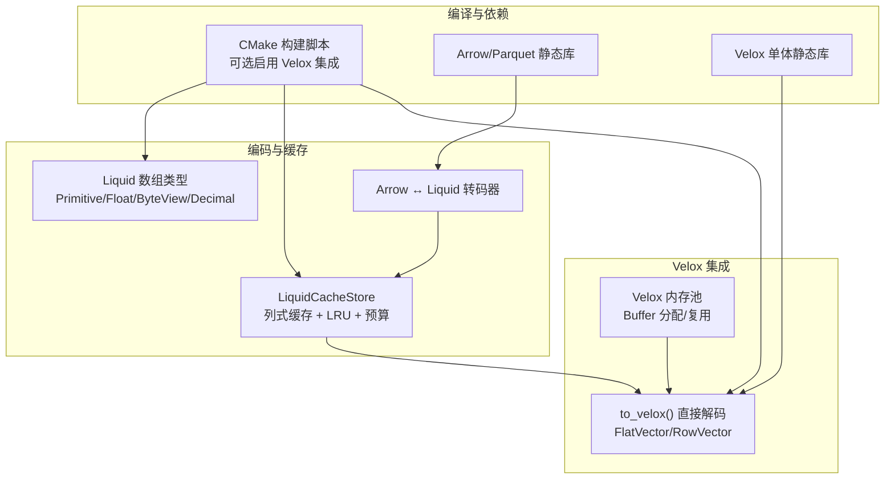
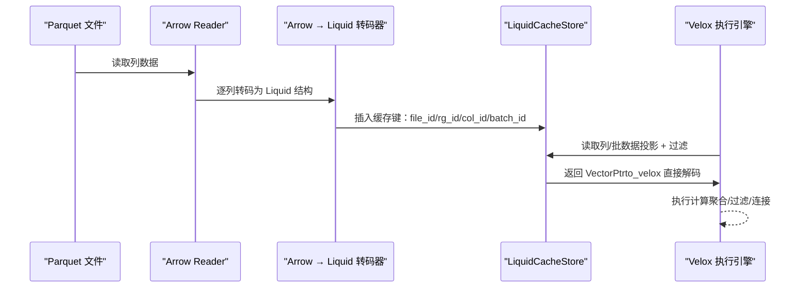
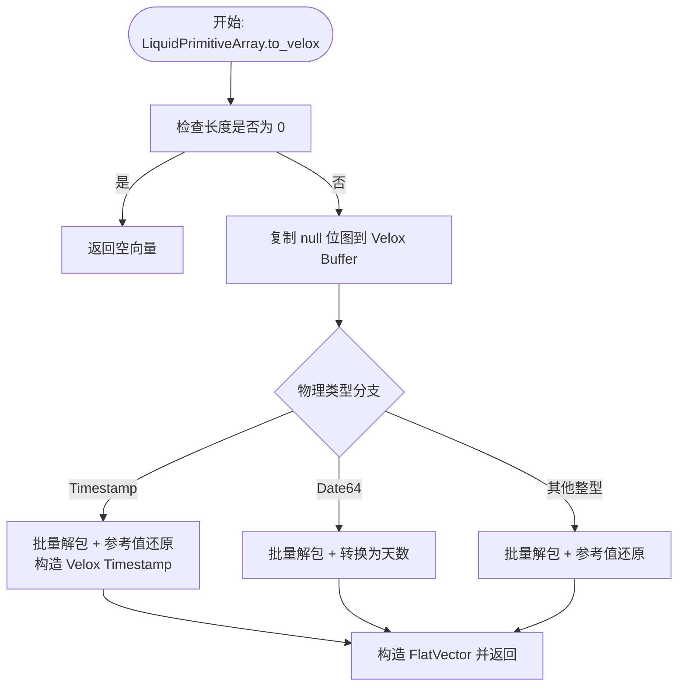
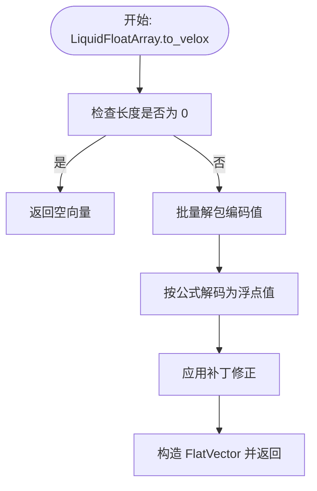
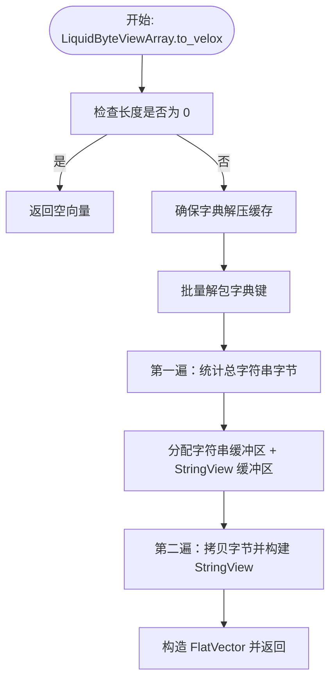
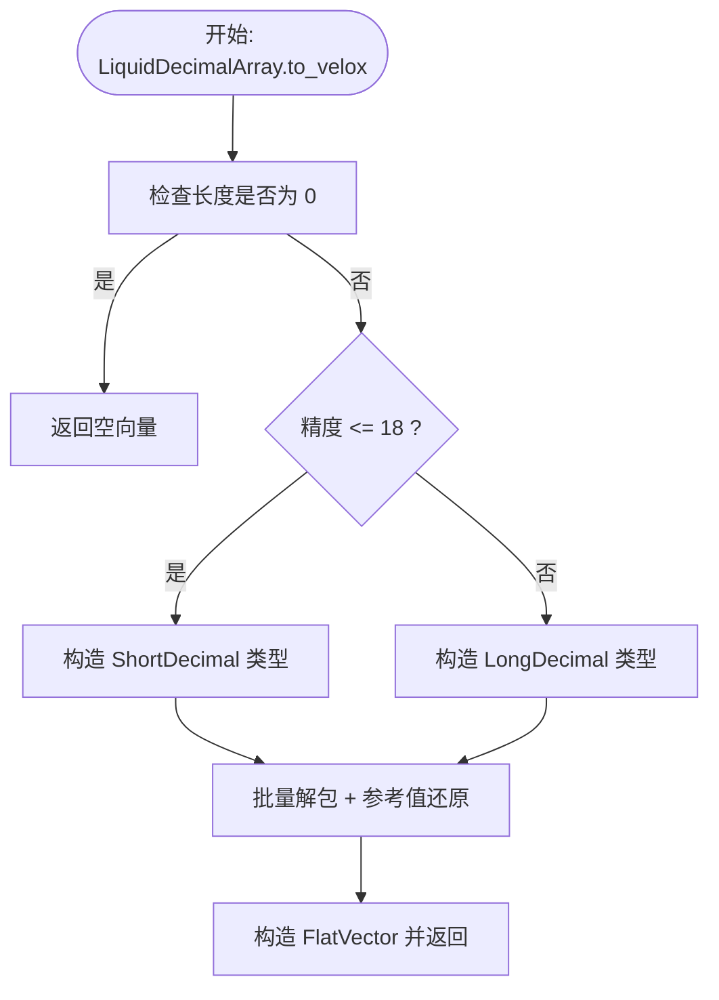
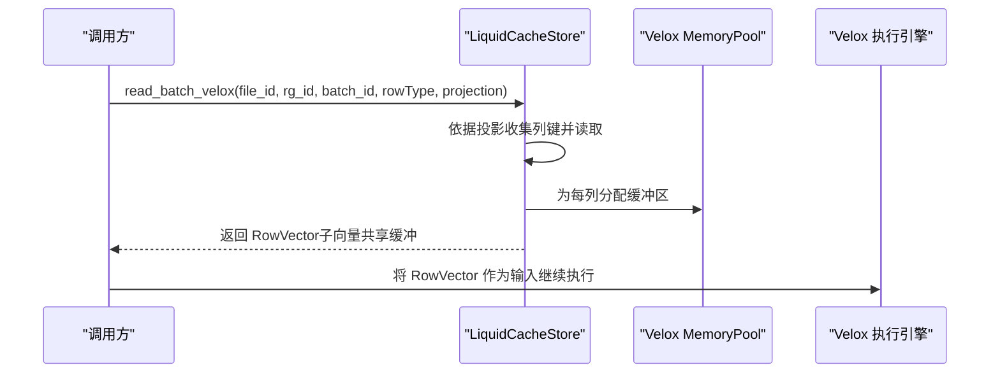
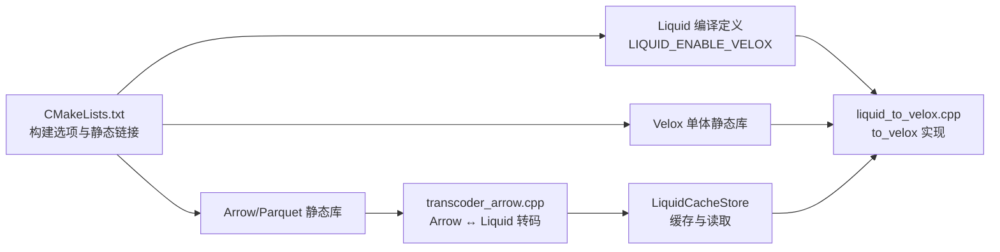

# Velox 集成

<cite>
**本文引用的文件**
- [README.md](file://README.md)
- [CMakeLists.txt](file://CMakeLists.txt)
- [liquid_to_velox.h](file://include/liquid_cache/liquid_to_velox.h)
- [liquid_to_velox.cpp](file://src/liquid_to_velox.cpp)
- [liquid_cache_store.h](file://include/liquid_cache/liquid_cache_store.h)
- [liquid_arrays.h](file://include/liquid_cache/liquid_arrays.h)
- [liquid_array.h](file://include/liquid_cache/liquid_array.h)
- [bit_packed_array.h](file://include/liquid_cache/bit_packed_array.h)
- [transcoder_arrow.cpp](file://src/transcoder_arrow.cpp)
- [velox_benchmark.cpp](file://examples/velox_benchmark.cpp)
- [test_velox_crossval.cpp](file://tests/test_velox_crossval.cpp)
</cite>

## 目录
1. [简介](#简介)
2. [项目结构](#项目结构)
3. [核心组件](#核心组件)
4. [架构总览](#架构总览)
5. [详细组件分析](#详细组件分析)
6. [依赖关系分析](#依赖关系分析)
7. [性能考量](#性能考量)
8. [故障排除指南](#故障排除指南)
9. [结论](#结论)
10. [附录](#附录)

## 简介
本文件面向需要在 Facebook Velox 查询执行引擎中高效使用 Liquid 缓存编码数据的工程师，系统性阐述以下内容：
- Liquid 数组到 Velox 向量的直接转换机制：内存布局优化、类型系统映射、执行计划集成
- 内存池管理策略：缓冲区分配、重用机制与垃圾回收优化
- Velox 向量的零序列化访问：向量头部解析、数据指针提取与空值处理
- 完整集成示例：如何在 Velox 查询执行中使用缓存数据
- 性能对比分析、内存使用优化与故障排除指南
- 与 Arrow 集成的差异与优势，以及适用场景的最佳选择

## 项目结构
该项目采用模块化设计，核心围绕“缓存编码 + 类型适配 + 直接解码到 Velox”的路径展开：
- 编译选项控制：通过开关启用 Velox 集成，确保 ABI 兼容与二进制接口一致性
- 编码层：LiquidPrimitiveArray、LiquidFloatArray、LiquidByteViewArray、LiquidDecimalArray 等，统一以二进制 IPC 头部标识逻辑/物理类型
- 缓存层：LiquidCacheStore 提供列式缓存、LRU 淘汰、预算控制与投影读取
- 转码层：Arrow → Liquid 的转码函数，以及 Arrow/SimdJSON 等依赖的静态链接策略
- Velox 集成层：将 Liquid 编码直接解码为 Velox FlatVector/RowVector，避免中间 Arrow 中间态

图示来源
- [CMakeLists.txt:184-430](file://CMakeLists.txt#L184-L430)
- [transcoder_arrow.cpp:490-658](file://src/transcoder_arrow.cpp#L490-L658)
- [liquid_cache_store.h:436-468](file://include/liquid_cache/liquid_cache_store.h#L436-L468)
- [liquid_to_velox.cpp:25-101](file://src/liquid_to_velox.cpp#L25-L101)

章节来源
- [CMakeLists.txt:1-563](file://CMakeLists.txt#L1-L563)
- [README.md:1-1](file://README.md#L1-L1)

## 核心组件
- 类型系统与映射
  - LiquidPhysicalType → Velox Type 映射：整型、浮点、日期/时间戳、字符串/二进制、十进制等
  - 时间戳与日期的特殊处理：毫秒/微秒/纳秒到 Velox Timestamp；Date64 到 Velox DATE 的换算
- 直接解码到 Velox
  - 原始数组：FoR + BitPacking → Velox FlatVector
  - 浮点数组：ALP + BitPacking + Patch → Velox FlatVector
  - 字符串/二进制：FSST 字典 + BitPacking → Velox FlatVector<StringView>
  - 十进制：FoR + BitPacking 或 FSST 字典 → ShortDecimal/LongDecimal
- 缓冲区与内存池
  - 使用 Velox AlignedBuffer 分配原生对齐的值缓冲区
  - 复用 null 位图与字符串数据缓冲，减少额外拷贝
  - 通过 MemoryPool 统一内存生命周期，避免频繁分配

章节来源
- [liquid_to_velox.h:69-133](file://include/liquid_cache/liquid_to_velox.h#L69-L133)
- [liquid_to_velox.cpp:25-101](file://src/liquid_to_velox.cpp#L25-L101)
- [liquid_to_velox.cpp:122-156](file://src/liquid_to_velox.cpp#L122-L156)
- [liquid_to_velox.cpp:284-342](file://src/liquid_to_velox.cpp#L284-L342)
- [liquid_to_velox.cpp:352-399](file://src/liquid_to_velox.cpp#L352-L399)

## 架构总览
Liquid 缓存数据在进入 Velox 执行前，已由 Arrow 转码为紧凑的 Liquid 结构；在查询阶段，直接从 Liquid 解码到 Velox 向量，跳过 Arrow 中间态，从而降低 CPU 和内存开销。

图示来源
- [transcoder_arrow.cpp:664-743](file://src/transcoder_arrow.cpp#L664-L743)
- [liquid_cache_store.h:442-467](file://include/liquid_cache/liquid_cache_store.h#L442-L467)
- [liquid_to_velox.cpp:564-634](file://src/liquid_to_velox.cpp#L564-L634)

## 详细组件分析

### 组件 A：LiquidPrimitiveArray → Velox FlatVector
- 解码流程
  - 从 BitPackedArray 批量解包偏移量，加参考值还原真实值
  - 特殊类型处理：Date64 转换为天数；Timestamp 根据物理单位构造 Velox Timestamp
  - 构造 FlatVector 并返回
- 内存布局
  - 值缓冲区按原生类型对齐分配
  - null 位图复用 BitPackedArray 的位图，避免二次拷贝
- 性能要点
  - 批量解包 + 单次分配，减少循环内分配
  - 无中间 Arrow 对象，直接生成 Velox 向量

图示来源
- [liquid_to_velox.cpp:25-101](file://src/liquid_to_velox.cpp#L25-L101)
- [liquid_to_velox.h:33-43](file://include/liquid_cache/liquid_to_velox.h#L33-L43)
- [liquid_to_velox.h:49-63](file://include/liquid_cache/liquid_to_velox.h#L49-L63)

章节来源
- [liquid_to_velox.cpp:25-101](file://src/liquid_to_velox.cpp#L25-L101)
- [liquid_to_velox.h:33-63](file://include/liquid_cache/liquid_to_velox.h#L33-L63)

### 组件 B：LiquidFloatArray → Velox FlatVector
- 解码流程
  - ALP 算法：寻找最佳指数参数，编码/解码校验并记录补丁
  - BitPacking 偏移量 + 参考值还原
  - 应用补丁修正误差
- 内存布局
  - 单缓冲区承载浮点值，按类型对齐
  - null 位图复用
- 性能要点
  - 一次遍历完成解码与补丁应用
  - 避免中间 Arrow，直接生成 FlatVector

图示来源
- [liquid_to_velox.cpp:122-156](file://src/liquid_to_velox.cpp#L122-L156)

章节来源
- [liquid_to_velox.cpp:122-156](file://src/liquid_to_velox.cpp#L122-L156)

### 组件 C：LiquidByteViewArray → Velox FlatVector<StringView>
- 解码流程
  - FSST 字典一次性解压并缓存（字典仅解压一次）
  - BitPacking 解出字典键，两遍扫描：第一遍统计总字符串字节数，第二遍拷贝并构建 StringView
- 内存布局
  - 字符串数据与 StringView 共享同一连续缓冲区
  - null 位图复用
- 性能要点
  - 字典解压去重，显著降低重复字符串存储
  - 两遍扫描避免多次内存重分配

图示来源
- [liquid_to_velox.cpp:284-342](file://src/liquid_to_velox.cpp#L284-L342)

章节来源
- [liquid_to_velox.cpp:284-342](file://src/liquid_to_velox.cpp#L284-L342)

### 组件 D：LiquidDecimalArray → Velox Decimal
- 解码流程
  - 根据精度选择 ShortDecimal（int64）或 LongDecimal（int128）
  - FoR + BitPacking 解码后加上参考值
- 内存布局
  - 单缓冲区承载十进制值
  - null 位图复用

图示来源
- [liquid_to_velox.cpp:352-399](file://src/liquid_to_velox.cpp#L352-L399)

章节来源
- [liquid_to_velox.cpp:352-399](file://src/liquid_to_velox.cpp#L352-L399)

### 组件 E：缓存读取与批构建（RowVector）
- 读取路径
  - 支持单列读取与多列投影读取
  - 通过 RowType 描述完整表结构，按投影构建 RowVector
- 内存管理
  - 使用传入的 MemoryPool 进行所有缓冲区分配
  - 子向量共享父级 RowVector 生命周期

图示来源
- [liquid_cache_store.h:461-467](file://include/liquid_cache/liquid_cache_store.h#L461-L467)
- [liquid_to_velox.cpp:581-634](file://src/liquid_to_velox.cpp#L581-L634)

章节来源
- [liquid_cache_store.h:442-467](file://include/liquid_cache/liquid_cache_store.h#L442-L467)
- [liquid_to_velox.cpp:564-634](file://src/liquid_to_velox.cpp#L564-L634)

## 依赖关系分析
- 构建与 ABI 兼容
  - 当启用 LIQUID_ENABLE_VELOX 时，强制使用 Velox 自带的 Arrow 18（含 Parquet/Compute），确保与 libvelox.a 的内部符号兼容
  - 通过 -mavx2/-mfma/-mbmi2 等编译选项与 Velox 一致，避免 ABI 不匹配导致的运行时崩溃
- 静态链接策略
  - Arrow/Parquet 采用静态库链接，配合 --whole-archive 保证 Arrow 计算内核注册不被裁剪
  - 非标准库优先使用静态归档，系统库回退动态链接
- 运行时依赖
  - Velox 执行引擎负责内存池、缓冲区分配与向量生命周期管理
  - Liquid 侧仅负责解码，不持有 Velox 类型对象

图示来源
- [CMakeLists.txt:184-430](file://CMakeLists.txt#L184-L430)
- [transcoder_arrow.cpp:490-658](file://src/transcoder_arrow.cpp#L490-L658)
- [liquid_cache_store.h:436-467](file://include/liquid_cache/liquid_cache_store.h#L436-L467)

章节来源
- [CMakeLists.txt:1-563](file://CMakeLists.txt#L1-L563)

## 性能考量
- 解码路径优化
  - 批量解包：BitPackedArray 提供 bulk_unpack_to，避免逐元素访问
  - SIMD 加速：针对常见位宽（1/2/4/8/16/32）使用 AVX2 向量化
  - 零拷贝：null 位图与字符串数据缓冲直接复用
- 内存管理
  - 通过 MemoryPool 统一分配，减少碎片与系统调用
  - 字典缓存：FSST 字典仅解压一次，跨迭代复用
- 与 Arrow 路径对比
  - Arrow 路径需要中间 Arrow 对象与缓冲区，to_velox 跳过 Arrow，减少 CPU 与内存占用
  - 基准测试覆盖了多种列组合与数据类型，验证了在多列场景下的稳定加速

章节来源
- [bit_packed_array.h:249-272](file://include/liquid_cache/bit_packed_array.h#L249-L272)
- [liquid_to_velox.cpp:284-342](file://src/liquid_to_velox.cpp#L284-L342)
- [velox_benchmark.cpp:419-592](file://examples/velox_benchmark.cpp#L419-L592)

## 故障排除指南
- 构建问题
  - 启用 Velox 集成必须设置 VELOX_PREFIX，否则会输出警告
  - 确保使用与 Velox 匹配的 Arrow 18 头文件与库，避免 ABI 不兼容
- 运行时问题
  - to_velox 调用前确保传入有效的 MemoryPool
  - 若出现 SIGSEGV，检查是否在同一翻译单元中同时定义了 LIQUID_ENABLE_VELOX
- 数据一致性
  - 使用交叉验证测试确保 Arrow → Liquid → Velox 的值与空值完全一致
  - 对于字符串/二进制，注意区分 ASCII 与二进制视图，确保类型映射正确

章节来源
- [CMakeLists.txt:434-438](file://CMakeLists.txt#L434-L438)
- [test_velox_crossval.cpp:40-85](file://tests/test_velox_crossval.cpp#L40-L85)
- [test_velox_crossval.cpp:180-254](file://tests/test_velox_crossval.cpp#L180-L254)

## 结论
通过将 Liquid 编码直接解码为 Velox 向量，项目在不牺牲压缩率的前提下，显著降低了解码成本与内存占用，适用于高吞吐、低延迟的查询执行场景。结合缓存与投影读取，可在复杂分析查询中获得稳定的性能增益。建议在需要与 Velox 深度集成且对内存与 CPU 开销敏感的应用中优先考虑该方案。

## 附录

### 类型系统映射与转换
- 整数/日期/时间戳：FoR + BitPacking → Velox 对应标量类型
- 浮点：ALP + BitPacking → Real/Double
- 字符串/二进制：FSST 字典 + BitPacking → VarChar/VarBinary（StringView）
- 十进制：根据精度选择 ShortDecimal/LongDecimal

章节来源
- [liquid_to_velox.h:69-133](file://include/liquid_cache/liquid_to_velox.h#L69-L133)

### 内存池与缓冲区分配
- 使用 Velox AlignedBuffer 分配原生对齐缓冲区
- 通过 MemoryPool 统一生命周期管理
- 字符串数据与 StringView 共享同一缓冲区，减少拷贝

章节来源
- [liquid_to_velox.cpp:284-342](file://src/liquid_to_velox.cpp#L284-L342)

### 集成示例：基准测试与验证
- 基准测试：比较 Velox Parquet Reader 与 LiquidCache → Velox 的性能，覆盖单列、多列与不同数据类型
- 交叉验证：确保 Arrow → Liquid → Velox 的值与空值一致性

章节来源
- [velox_benchmark.cpp:419-592](file://examples/velox_benchmark.cpp#L419-L592)
- [test_velox_crossval.cpp:40-85](file://tests/test_velox_crossval.cpp#L40-L85)

### 与 Arrow 集成的差异与优势
- 差异
  - Arrow 路径：Parquet → Arrow → 计算；to_velox 路径：Parquet → Liquid → Velox
- 优势
  - 更少的中间对象与缓冲区，更低的 CPU 与内存占用
  - 更强的类型映射灵活性（如 Timestamp/Date 的单位与单位换算）
  - 更好的字符串/二进制压缩（FSST 字典）

章节来源
- [transcoder_arrow.cpp:490-658](file://src/transcoder_arrow.cpp#L490-L658)
- [liquid_to_velox.cpp:284-342](file://src/liquid_to_velox.cpp#L284-L342)