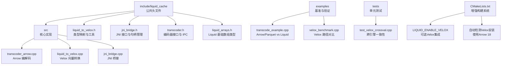
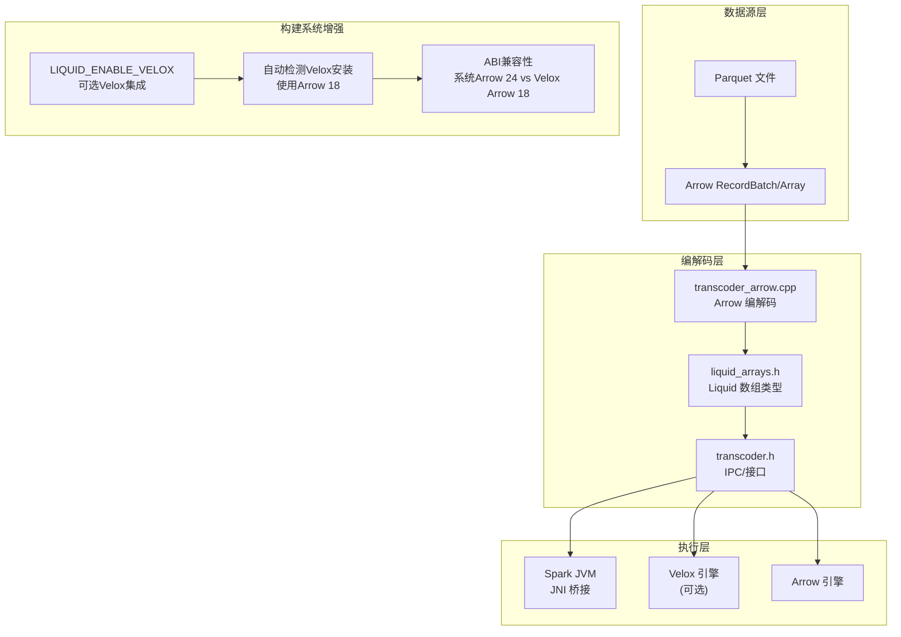
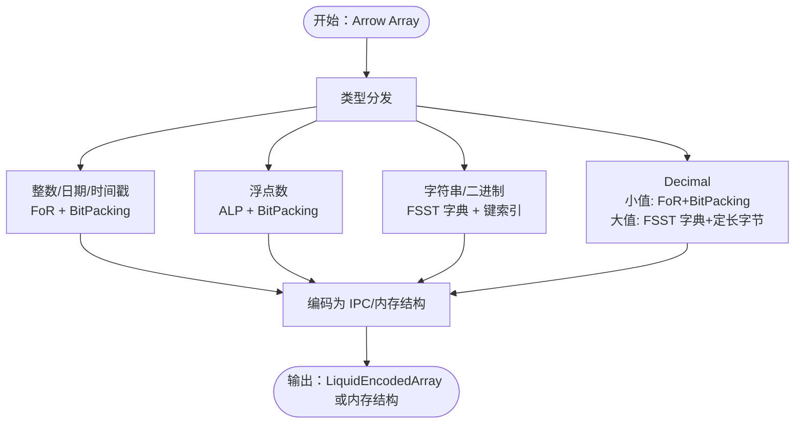
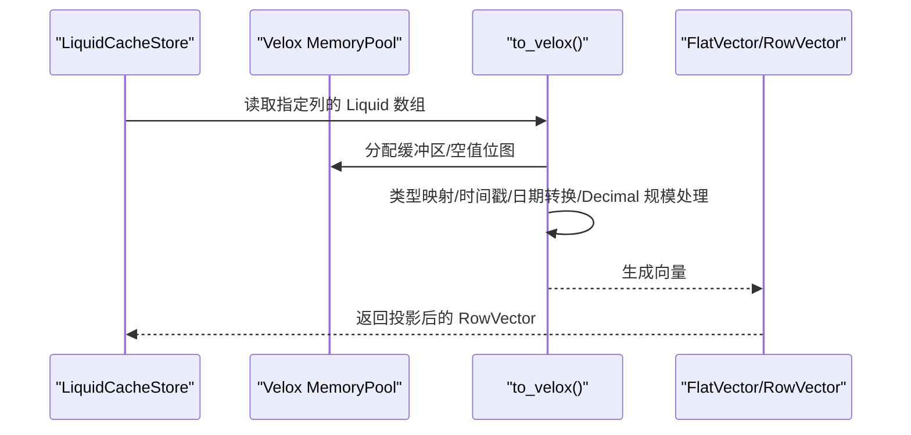
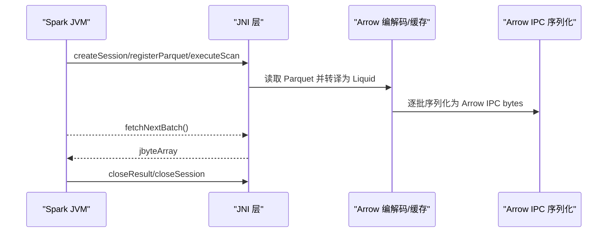
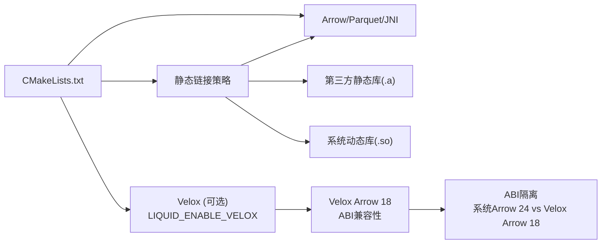

# 引擎集成

<cite>
**本文引用的文件**
- [README.md](file://README.md)
- [CMakeLists.txt](file://CMakeLists.txt)
- [transcoder_arrow.cpp](file://src/transcoder_arrow.cpp)
- [transcoder.h](file://include/liquid_cache/transcoder.h)
- [liquid_arrays.h](file://include/liquid_cache/liquid_arrays.h)
- [liquid_to_velox.h](file://include/liquid_cache/liquid_to_velox.h)
- [liquid_to_velox.cpp](file://src/liquid_to_velox.cpp)
- [jni_bridge.h](file://include/liquid_cache/jni_bridge.h)
- [jni_bridge.cpp](file://src/jni_bridge.cpp)
- [transcode_example.cpp](file://examples/transcode_example.cpp)
- [velox_benchmark.cpp](file://examples/velox_benchmark.cpp)
- [test_velox_crossval.cpp](file://tests/test_velox_crossval.cpp)
</cite>

## 更新摘要
**变更内容**
- 新增LIQUID_ENABLE_VELOX构建选项，支持可选的Facebook Velox集成
- 自动检测和集成Velox安装，使用Velox捆绑的Arrow 18库确保ABI兼容性
- 增强构建系统支持，实现系统Arrow 24与Velox Arrow 18的隔离
- 新增Velox专用目标和测试套件，提供完整的向量转换功能

## 目录
1. [简介](#简介)
2. [项目结构](#项目结构)
3. [核心组件](#核心组件)
4. [架构总览](#架构总览)
5. [详细组件分析](#详细组件分析)
6. [依赖关系分析](#依赖关系分析)
7. [性能考量](#性能考量)
8. [故障排除指南](#故障排除指南)
9. [结论](#结论)
10. [附录](#附录)

## 简介
本技术文档面向需要在不同引擎中集成 Liquid Cache 的工程师与架构师，系统阐述以下内容：
- 与 Apache Arrow 的集成：从 Arrow 数组到 Liquid 格式的编码/解码、内存管理与序列化协议。
- 与 Facebook Velox 的直接向量转换：内存池对接、向量布局优化与执行计划集成。
- JNI 桥接层：Java 与 C++ 的互操作、Spark 集成与生命周期管理。
- 使用指南与最佳实践：性能对比、适用场景、配置优化与部署建议。
- 完整集成示例与故障排除。

**更新** 新增对LIQUID_ENABLE_VELOX构建选项的支持，实现与Facebook Velox的深度集成，确保ABI兼容性和最佳性能。

## 项目结构
仓库采用模块化设计，核心目录与文件职责如下：
- include/liquid_cache：公共头文件，定义 IPC 头、数组类型、编解码接口与引擎桥接声明。
- src：核心实现，包括 Arrow 编解码、Velox 转换、JNI 桥接等。
- examples：基准测试与验证程序，覆盖 Arrow/Parquet、Liquid Cache、Velox 三路径对比。
- tests：单元测试，含跨引擎一致性校验（Arrow ↔ Liquid ↔ Velox）。
- CMakeLists.txt：构建配置，支持静态链接、可选 Velox 集成与 JNI 共享库。

**图表来源**
- [CMakeLists.txt](file://CMakeLists.txt)
- [transcoder_arrow.cpp](file://src/transcoder_arrow.cpp)
- [liquid_to_velox.cpp](file://src/liquid_to_velox.cpp)
- [jni_bridge.cpp](file://src/jni_bridge.cpp)
- [transcode_example.cpp](file://examples/transcode_example.cpp)
- [velox_benchmark.cpp](file://examples/velox_benchmark.cpp)
- [test_velox_crossval.cpp](file://tests/test_velox_crossval.cpp)

**章节来源**
- [CMakeLists.txt](file://CMakeLists.txt)

## 核心组件
- 编解码接口与 IPC 协议
  - 提供 Arrow 原生缓冲区到 Liquid 编码的通用函数族，以及独立于 Arrow 的纯 C++ 编码器，便于 JNI/Velox 直接调用。
  - IPC 头部与序列化格式与 Rust 版本二进制兼容，确保多语言互通。
- Liquid 基础数组类型
  - 支持整型/日期/时间戳、浮点数、字节视图、定长字节数组、线性整数数组等，覆盖常见分析列式数据。
  - 提供 to_arrow()/to_bytes()/from_arrow()/from_bytes() 等完整往返能力。
- Velox 直接转换
  - 将 Liquid 数组解码为 Velox FlatVector/RowVector，复用 Velox 内存池与缓冲区，避免二次拷贝。
  - 提供类型映射、空值位图复制、时间戳与日期转换等细节处理。
- JNI 桥接
  - 对接 Spark JVM，提供会话/结果句柄管理、Parquet 扫描、批次序列化与生命周期控制。
  - 支持 Arrow IPC 流兼容输出，便于现有 Scala 侧读取。

**更新** 新增LIQUID_ENABLE_VELOX编译定义，确保Velox集成的类型安全和ABI兼容性。

**章节来源**
- [transcoder.h](file://include/liquid_cache/transcoder.h)
- [liquid_arrays.h](file://include/liquid_cache/liquid_arrays.h)
- [liquid_to_velox.h](file://include/liquid_cache/liquid_to_velox.h)
- [jni_bridge.h](file://include/liquid_cache/jni_bridge.h)

## 架构总览
整体架构分为三层：
- 数据源层：Parquet 文件（Arrow Reader）或内存 Arrow 数组。
- 编解码层：Liquid 编解码器（FoR+BitPacking、ALP、FSST 字典等），生成 IPC 序列化或内存结构。
- 执行层：Spark（JNI）、Velox（原生向量）、Arrow（原生数组）三种消费路径。

**更新** 架构现在支持可选的Velox集成，通过LIQUID_ENABLE_VELOX选项启用，实现与系统Arrow 24的完全隔离。

**图表来源**
- [transcoder_arrow.cpp](file://src/transcoder_arrow.cpp)
- [transcoder.h](file://include/liquid_cache/transcoder.h)
- [liquid_arrays.h](file://include/liquid_cache/liquid_arrays.h)
- [jni_bridge.cpp](file://src/jni_bridge.cpp)
- [CMakeLists.txt](file://CMakeLists.txt)

## 详细组件分析

### 组件 A：Arrow 到 Liquid 的编解码
- 类型分发与编码策略
  - 整数/日期/时间戳：FoR（帧参考）+ BitPacking，按范围计算位宽，零拷贝写入。
  - 浮点数：ALP（自适应无损浮点）+ BitPacking，穷举搜索最优指数对，必要时记录补丁。
  - 字符串/二进制：FSST 字典 + 位打包键索引，支持低基数高重复场景。
  - Decimal：小值走 FoR+BitPacking；大值走 FSST 字典 + 定长字节数组。
- 解码路径
  - 通过 IPC 头解析逻辑/物化类型，重建 Arrow 数组，支持零拷贝 ArrayData 构造。
- 性能要点
  - 仅在必要时进行类型转换（如 Timestamp→Int64 视图），减少额外开销。
  - 批处理读取（Parquet Reader）与批量解码，降低系统调用与内存碎片。

**图表来源**
- [transcoder_arrow.cpp](file://src/transcoder_arrow.cpp)
- [transcoder.h](file://include/liquid_cache/transcoder.h)
- [liquid_arrays.h](file://include/liquid_cache/liquid_arrays.h)

**章节来源**
- [transcoder_arrow.cpp](file://src/transcoder_arrow.cpp)
- [transcoder.h](file://include/liquid_cache/transcoder.h)
- [liquid_arrays.h](file://include/liquid_cache/liquid_arrays.h)

### 组件 B：Velox 直接向量转换
- 内存池与缓冲区
  - 复用 Velox MemoryPool 分配器，避免跨边界拷贝；空值位图按 BitPackedArray 复制。
- 类型映射与特殊处理
  - 时间戳：根据物理单位转换为 Velox Timestamp。
  - Date64：毫秒转天，映射为 Velox DATE（int32）。
  - Decimal：精度 ≤18 使用 ShortDecimal（int64），>18 使用 LongDecimal（int128）。
- 向量布局
  - 生成 FlatVector/RowVector，支持投影裁剪与延迟求值（LazyVector）强制加载。
- 执行计划集成
  - 通过 RowType/Projection 与 Velox RowReaderOptions 配置，适配不同查询模式。

**更新** 新增LIQUID_ENABLE_VELOX编译定义，确保to_velox()虚函数在所有翻译单元中具有相同的vtable布局，避免SIGSEGV错误。

**图表来源**
- [liquid_to_velox.cpp](file://src/liquid_to_velox.cpp)
- [liquid_to_velox.h](file://include/liquid_cache/liquid_to_velox.h)

**章节来源**
- [liquid_to_velox.cpp](file://src/liquid_to_velox.cpp)
- [liquid_to_velox.h](file://include/liquid_cache/liquid_to_velox.h)

### 组件 C：JNI 桥接层（Spark 集成）
- 句柄与生命周期
  - 会话/结果句柄原子分配，全局互斥存储；提供 close/closeResult/closeSession 清理。
- 数据流
  - createSession/registerObjectStore/registerParquet/executeScan → fetchNextBatch（Arrow IPC bytes）→ closeResult/closeSession。
- 互操作细节
  - jstring/jobjectArray 与 C++ 字符串/向量互转；异常统一抛出为 Java RuntimeException。
- 兼容性
  - 输出 Arrow IPC Stream 格式，与现有 deserializeArrowIpc 兼容。

**图表来源**
- [jni_bridge.cpp](file://src/jni_bridge.cpp)
- [jni_bridge.h](file://include/liquid_cache/jni_bridge.h)

**章节来源**
- [jni_bridge.cpp](file://src/jni_bridge.cpp)
- [jni_bridge.h](file://include/liquid_cache/jni_bridge.h)

### 组件 D：基准与验证
- Arrow/Parquet vs Liquid Cache（Arrow 路径）
  - 以热页缓存（OS Page Cache）为前提，比较解码到 Arrow 的耗时，验证 round-trip 正确性。
- Velox 路径对比
  - 从内存 Parquet 读取到 Velox，与 Liquid Cache→Velox 进行统计对比，包含均值、中位数、标准差与置信区间。
- 跨引擎一致性测试
  - 针对整型、浮点、字符串、Decimal、空值与空数组等边界条件，验证 Arrow↔Liquid↔Velox 一致性。

**更新** 新增Velox基准测试，支持LIQUID_ENABLE_VELOX构建选项，提供完整的性能对比分析。

**章节来源**
- [transcode_example.cpp](file://examples/transcode_example.cpp)
- [velox_benchmark.cpp](file://examples/velox_benchmark.cpp)
- [test_velox_crossval.cpp](file://tests/test_velox_crossval.cpp)

## 依赖关系分析
- 构建系统
  - 必需依赖：Arrow、Parquet、JNI。
  - 可选依赖：Velox（通过选项启用），并要求与 Velox 捆绑的 Arrow 18 以保证 ABI 兼容。
  - 静态链接策略：对 Arrow/Parquet 采用 --whole-archive 保留计算内核符号；非标准库优先静态，系统库动态。
- 运行时依赖
  - Arrow/Parquet 需要初始化（静态链接场景下）；Velox 需要 MemoryManager 初始化与注册本地文件系统。

**更新** 增强的构建系统现在支持LIQUID_ENABLE_VELOX选项，自动检测Velox安装位置，使用Velox捆绑的Arrow 18库确保ABI兼容性。

**图表来源**
- [CMakeLists.txt](file://CMakeLists.txt)

**章节来源**
- [CMakeLists.txt](file://CMakeLists.txt)

## 性能考量
- 编解码性能
  - 选择合适的编码：整数/日期用 FoR+BitPacking；浮点用 ALP；字符串低基数用 FSST 字典。
  - 批处理读取与批量解码，减少系统调用与内存碎片。
- 内存管理
  - Arrow：使用 default_memory_pool；JNI/Velox：复用各自内存池，避免跨池分配。
  - Velox：RowReaderOptions 中预分配结果向量，避免 LazyVector 延迟求值带来的额外开销。
- 编译与链接
  - 静态链接时务必使用 --whole-archive 保留 Arrow 计算内核；非标准库优先静态，系统库动态，平衡体积与运行时依赖。
- 基准方法
  - 使用 examples 下的基准程序，设置相同热缓存条件，对比 Arrow/Parquet、Liquid Cache、Velox 三路径的均值、中位数与置信区间。

**更新** Velox集成提供零拷贝向量转换，相比传统路径具有显著性能优势，特别是在大规模数据分析场景中。

## 故障排除指南
- Arrow/Parquet 初始化失败
  - 静态链接场景需显式初始化 Arrow 计算模块；检查 CMake 是否启用静态链接与 --whole-archive。
- Velox ABI 不匹配
  - 启用 LIQUID_ENABLE_VELOX 时必须提供 VELOX_PREFIX，且与 Velox 构建目录一致；确保使用其捆绑的 Arrow 18。
- JNI 抛出异常
  - 检查 jstring/jobjectArray 转换是否为空；捕获 C++ 异常并转换为 Java RuntimeException。
- 内存不足或越界
  - 确认 MemoryPool 已初始化；检查缓冲区大小与对齐（IPC 头部后填充至 8 字节）。
- 性能不达预期
  - 检查批大小（Parquet Reader batch_size）与投影列；确认未产生不必要的类型转换（如 Timestamp→Int64 视图）。

**更新** 新增Velox集成相关故障排除：
- LIQUID_ENABLE_VELOX编译错误：确保所有翻译单元都定义了LIQUID_ENABLE_VELOX宏，避免vtable不匹配导致的SIGSEGV。
- VELOX_PREFIX路径错误：检查Velox构建目录是否存在，确保包含Arrow 18的头文件和库文件。
- ABI冲突问题：系统Arrow 24与Velox Arrow 18不能同时存在，构建系统会自动处理隔离。

**章节来源**
- [CMakeLists.txt](file://CMakeLists.txt)
- [jni_bridge.cpp](file://src/jni_bridge.cpp)
- [velox_benchmark.cpp](file://examples/velox_benchmark.cpp)

## 结论
本项目提供了从 Arrow 到 Liquid 的高效编解码、与 Velox 的零拷贝向量转换以及与 Spark 的 JNI 桥接，形成"数据源层 → 编解码层 → 执行层"的清晰架构。通过基准测试与一致性验证，证明了在热缓存条件下，Liquid Cache 在 Arrow/Velox 路径上具备显著性能优势。建议在生产环境启用静态链接与合适的批处理策略，并在启用 Velox 集成时严格遵循 ABI 兼容要求。

**更新** 新的构建系统增强了对Facebook Velox的集成支持，通过LIQUID_ENABLE_VELOX选项实现了可选的高性能向量转换功能，确保与系统Arrow 24的完全隔离和ABI兼容性。

## 附录

### 使用指南与最佳实践
- 构建与安装
  - 基础构建：CMake + Arrow/Parquet/JNI。
  - 可选 Velox：添加 -DLIQUID_ENABLE_VELOX=ON -DVELOX_PREFIX=/path/to/velox/build。
- Spark 集成
  - 通过 JNI 桥接创建会话、注册表、执行扫描并逐批获取 Arrow IPC bytes。
  - 注意批大小与列投影，减少不必要的数据传输。
- Velox 集成
  - 使用 RowType/Projection 与 RowReaderOptions；确保 MemoryPool 初始化。
  - 对于复杂查询，考虑预加载常用列到 Liquid Cache，进一步提升解码速度。
- 性能优化
  - 选择合适编码：FoR+BitPacking、ALP、FSST 字典。
  - 批处理与内存池复用；避免不必要的类型转换与拷贝。
  - 使用基准程序对比不同路径，确定最优方案。

**更新** Velox集成最佳实践：
- 在LIQUID_ENABLE_VELOX=ON模式下，所有目标都会使用Velox捆绑的Arrow 18库，确保ABI兼容性。
- 编译选项-mavx2 -mfma -mavx -mf16c -mlzcnt -mbmi2与Velox保持一致，避免指令集不匹配问题。
- 使用liquid_velox_benchmark目标进行性能测试，获得准确的基准数据。

### 集成示例路径
- Arrow/Parquet vs Liquid Cache 基准：[transcode_example.cpp](file://examples/transcode_example.cpp)
- Velox 路径对比：[velox_benchmark.cpp](file://examples/velox_benchmark.cpp)
- 跨引擎一致性测试：[test_velox_crossval.cpp](file://tests/test_velox_crossval.cpp)

**更新** 新增Velox集成示例：
- liquid_velox_benchmark：完整的Velox基准测试程序，支持多种查询场景和统计分析。
- test_velox_crossval：跨引擎一致性测试，验证Arrow→Liquid→Velox转换的正确性。
- 自动检测Velox安装：通过VELOX_PREFIX参数自动定位Velox安装目录和Arrow 18库。