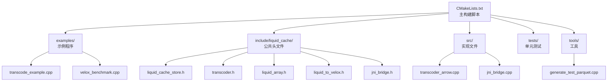
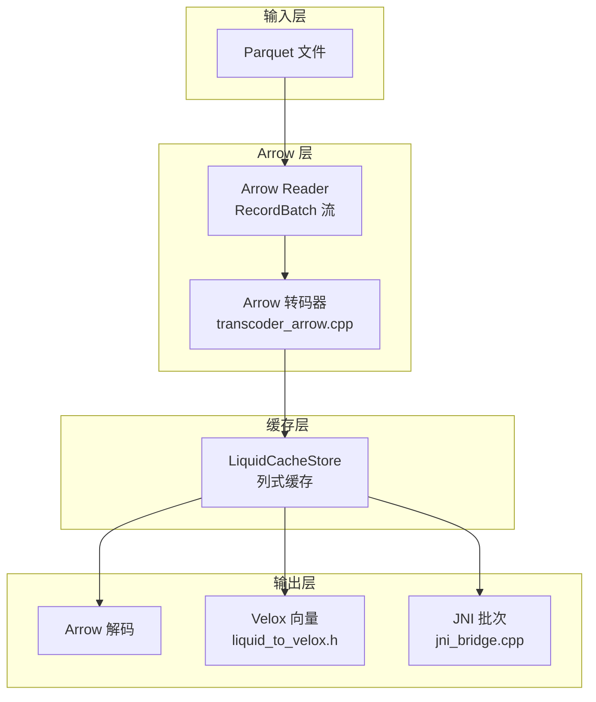
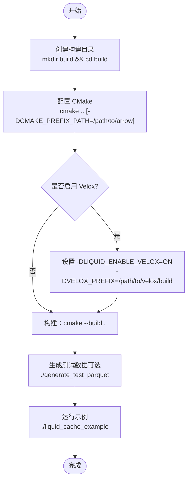
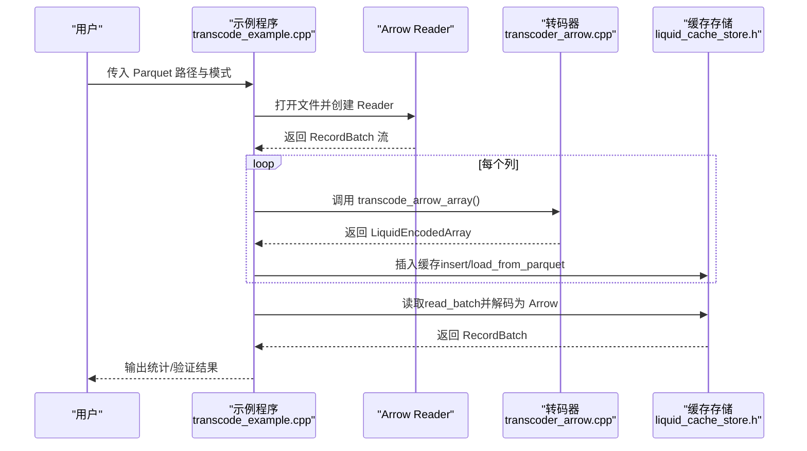
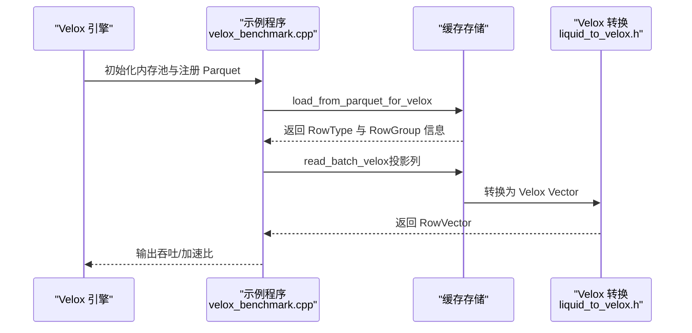
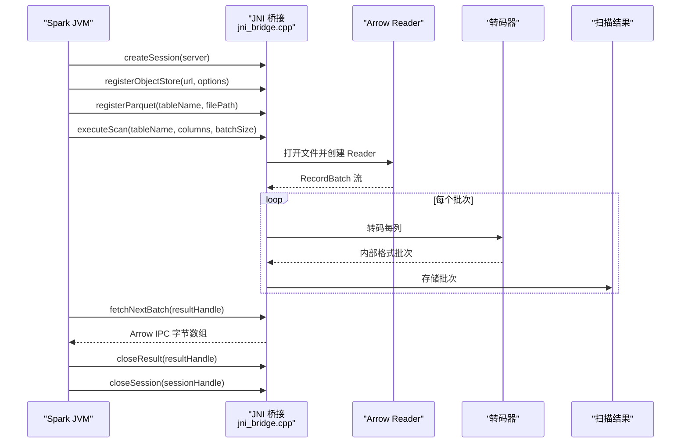
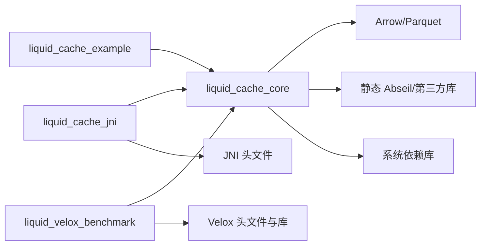

# 快速开始

<cite>
**本文档引用的文件**
- [CMakeLists.txt](file://CMakeLists.txt)
- [README.md](file://README.md)
- [examples/transcode_example.cpp](file://examples/transcode_example.cpp)
- [examples/velox_benchmark.cpp](file://examples/velox_benchmark.cpp)
- [src/transcoder_arrow.cpp](file://src/transcoder_arrow.cpp)
- [include/liquid_cache/liquid_cache_store.h](file://include/liquid_cache/liquid_cache_store.h)
- [include/liquid_cache/transcoder.h](file://include/liquid_cache/transcoder.h)
- [include/liquid_cache/liquid_array.h](file://include/liquid_cache/liquid_array.h)
- [include/liquid_cache/liquid_to_velox.h](file://include/liquid_cache/liquid_to_velox.h)
- [include/liquid_cache/jni_bridge.h](file://include/liquid_cache/jni_bridge.h)
- [src/jni_bridge.cpp](file://src/jni_bridge.cpp)
- [tools/generate_test_parquet.cpp](file://tools/generate_test_parquet.cpp)
- [tests/test_roundtrip.cpp](file://tests/test_roundtrip.cpp)
</cite>

## 目录
1. [简介](#简介)
2. [项目结构](#项目结构)
3. [核心组件](#核心组件)
4. [架构总览](#架构总览)
5. [详细组件分析](#详细组件分析)
6. [依赖分析](#依赖分析)
7. [性能考虑](#性能考虑)
8. [故障排查指南](#故障排查指南)
9. [结论](#结论)
10. [附录](#附录)

## 简介
liquid-cache-cpp 是一个高性能的列式内存缓存与转码库，专注于将 Arrow/Parquet 数据以更紧凑的内部格式存储，并支持零拷贝解码为 Arrow 或直接转换为 Velox 向量。它提供了：
- 基于 Arrow 的转码管线（整型、浮点、字符串、字节、十进制等）
- 列式内存缓存（LRU 驱逐、预算控制）
- 与 Velox 的直接向量转换
- Spark JNI 桥接能力（通过 JNI 头文件定义）

本“快速开始”将带你完成安装、编译、基础使用与多场景示例，帮助你从零搭建第一个可运行的应用。

## 项目结构
仓库采用 CMake 构建，主要目录与文件职责如下：
- build/：构建产物目录（首次构建后生成）
- examples/：示例程序（转码基准、Velox 对比）
- include/liquid_cache/：公共头文件（缓存、转码、JNI、Velox 转换等）
- src/：实现文件（转码、JNI 桥接、Velox 转换）
- tests/：单元测试（转码正确性、压缩率等）
- tools/：工具（生成测试 Parquet 文件）
- CMakeLists.txt：主构建脚本（依赖查找、目标定义、可选 Velox 集成）
- README.md：项目说明（当前仅标题）

**图表来源**
- [CMakeLists.txt:1-563](file://CMakeLists.txt#L1-L563)
- [examples/transcode_example.cpp:1-550](file://examples/transcode_example.cpp#L1-L550)
- [examples/velox_benchmark.cpp:1-683](file://examples/velox_benchmark.cpp#L1-L683)
- [src/transcoder_arrow.cpp:1-746](file://src/transcoder_arrow.cpp#L1-L746)
- [src/jni_bridge.cpp:1-320](file://src/jni_bridge.cpp#L1-L320)
- [tools/generate_test_parquet.cpp:1-314](file://tools/generate_test_parquet.cpp#L1-L314)

**章节来源**
- [CMakeLists.txt:1-563](file://CMakeLists.txt#L1-L563)
- [README.md:1-1](file://README.md#L1-L1)

## 核心组件
- 转码器（transcoder）：将 Arrow 数组编码为内部格式，或从内部格式解码回 Arrow。支持整数、浮点、字符串/二进制、十进制等类型。
- 缓存存储（LiquidCacheStore）：按列缓存，支持投影、过滤、LRU 预算控制。
- 类型抽象（LiquidArrayBase/LiquidArrayRef）：统一不同数组类型的接口，便于缓存与跨引擎转换。
- Velox 转换（liquid_to_velox）：将内部格式直接转换为 Velox 向量。
- JNI 桥接（jni_bridge）：为 Spark 提供 JNI 接口，实现扫描、批次传输与清理。

**章节来源**
- [include/liquid_cache/transcoder.h:1-360](file://include/liquid_cache/transcoder.h#L1-L360)
- [include/liquid_cache/liquid_cache_store.h:1-527](file://include/liquid_cache/liquid_cache_store.h#L1-L527)
- [include/liquid_cache/liquid_array.h:1-159](file://include/liquid_cache/liquid_array.h#L1-L159)
- [include/liquid_cache/liquid_to_velox.h:1-138](file://include/liquid_cache/liquid_to_velox.h#L1-L138)
- [include/liquid_cache/jni_bridge.h:1-217](file://include/liquid_cache/jni_bridge.h#L1-L217)

## 架构总览
下图展示了从 Parquet 加载、转码、缓存到读取解码的整体流程，以及与 Velox/JNI 的集成路径。

**图表来源**
- [examples/transcode_example.cpp:1-550](file://examples/transcode_example.cpp#L1-L550)
- [examples/velox_benchmark.cpp:1-683](file://examples/velox_benchmark.cpp#L1-L683)
- [src/transcoder_arrow.cpp:1-746](file://src/transcoder_arrow.cpp#L1-L746)
- [include/liquid_cache/liquid_cache_store.h:1-527](file://include/liquid_cache/liquid_cache_store.h#L1-L527)
- [include/liquid_cache/liquid_to_velox.h:1-138](file://include/liquid_cache/liquid_to_velox.h#L1-L138)
- [src/jni_bridge.cpp:1-320](file://src/jni_bridge.cpp#L1-L320)

## 详细组件分析

### 安装与编译
- 系统要求
  - C++20 支持（CMake 设置）
  - CMake ≥ 3.16
  - Arrow ≥ 19（或系统匹配版本），Parquet，JNI
  - 可选：Velox（启用时需要其构建目录）
- 关键依赖定位与静态链接策略
  - Arrow/Parquet 库文件通过 find_package 获取，同时尝试定位静态依赖（如 libarrow.a、libparquet.a）。
  - 为避免运行时依赖，项目优先使用静态 Abseil、Thrift、Protobuf、Snappy、RE2、UTF8Proc、LZ4、ZSTD、Brotli、cURL 等库；若系统未提供静态库，则回退到动态库。
  - Arrow 的系统依赖（如 ssl、crypto、xml2、nghttp2、gssapi_krb5、dl、rt 等）被显式列出。
- CMake 选项
  - LIQUID_ENABLE_VELOX：启用 Velox 集成（默认关闭）
  - VELOX_PREFIX：当启用 Velox 时，指定其构建目录
  - ABSL_STATIC_PREFIX：指向静态 Abseil 安装根目录（可选）
  - LIQUID_BUILD_TESTS：是否构建测试（默认开启）
- 构建步骤
  1) 创建构建目录并进入
  2) 配置：设置 Arrow/Parquet/JNI 路径（如未安装到系统默认位置）
  3) 构建：生成可执行文件与库
  4) 运行示例：生成测试数据 → 运行基准示例 → （可选）运行 Velox 对比

**图表来源**
- [CMakeLists.txt:1-563](file://CMakeLists.txt#L1-L563)
- [tools/generate_test_parquet.cpp:1-314](file://tools/generate_test_parquet.cpp#L1-L314)
- [examples/transcode_example.cpp:1-550](file://examples/transcode_example.cpp#L1-L550)

**章节来源**
- [CMakeLists.txt:1-563](file://CMakeLists.txt#L1-L563)

### 基础使用：从转码到缓存读取
- 步骤概览
  1) 使用 Arrow 读取 Parquet 文件，得到 RecordBatch 流
  2) 将每个列转码为内部格式（transcode_arrow_array）
  3) 将转码后的列插入缓存（insert 或批量 load_from_parquet）
  4) 读取时按需投影与过滤，解码为 Arrow
- 示例入口
  - 示例程序展示了从 Parquet 加载、转码、缓存、基准对比与一致性验证的完整流程。

**图表来源**
- [examples/transcode_example.cpp:1-550](file://examples/transcode_example.cpp#L1-L550)
- [src/transcoder_arrow.cpp:1-746](file://src/transcoder_arrow.cpp#L1-L746)
- [include/liquid_cache/liquid_cache_store.h:1-527](file://include/liquid_cache/liquid_cache_store.h#L1-L527)

**章节来源**
- [examples/transcode_example.cpp:1-550](file://examples/transcode_example.cpp#L1-L550)
- [src/transcoder_arrow.cpp:1-746](file://src/transcoder_arrow.cpp#L1-L746)
- [include/liquid_cache/liquid_cache_store.h:1-527](file://include/liquid_cache/liquid_cache_store.h#L1-L527)

### 第一个应用程序：从数据加载到缓存查询
- 目标：编写一个最小可运行程序，完成以下任务
  - 读取单个 Parquet 文件或目录
  - 一次性将所有列转码并加载到缓存
  - 读取部分列（投影）并打印统计信息
- 实现要点
  - 使用 Arrow Reader 打开文件并遍历 RecordBatch
  - 通过 transcode_to_liquid_array 将列转码为内存中的 Liquid 结构
  - 使用 load_from_parquet 将所有列批量插入缓存
  - 使用 read_batch 按列投影读取并统计行数/内存占用
- 预期输出
  - 文件数量、Schema 列表、缓存条目数、内存大小、转码耗时、各场景下的解码耗时与加速比

提示：你可以参考示例程序中的文件发现、Schema 读取、基准循环与统计打印逻辑，将其简化为你的第一个应用。

**章节来源**
- [examples/transcode_example.cpp:1-550](file://examples/transcode_example.cpp#L1-L550)
- [src/transcoder_arrow.cpp:1-746](file://src/transcoder_arrow.cpp#L1-L746)
- [include/liquid_cache/liquid_cache_store.h:1-527](file://include/liquid_cache/liquid_cache_store.h#L1-L527)

### 场景示例一：Arrow 集成（基础转码与缓存）
- 适用：需要在 C++ 中直接使用 Arrow 的场景
- 关键 API
  - transcode_arrow_array：将 Arrow Array 转为内部格式（序列化字节）
  - decode_liquid_array：将内部格式解码回 Arrow Array
  - LiquidCacheStore::load_from_parquet：批量转码并插入缓存
  - LiquidCacheStore::read_batch：按列投影读取 RecordBatch
- 参考实现
  - 示例程序中已完整演示了从 Parquet 到缓存再到解码的全流程。

**章节来源**
- [examples/transcode_example.cpp:1-550](file://examples/transcode_example.cpp#L1-L550)
- [src/transcoder_arrow.cpp:1-746](file://src/transcoder_arrow.cpp#L1-L746)
- [include/liquid_cache/transcoder.h:1-360](file://include/liquid_cache/transcoder.h#L1-L360)
- [include/liquid_cache/liquid_cache_store.h:1-527](file://include/liquid_cache/liquid_cache_store.h#L1-L527)

### 场景示例二：Velox 集成（直接向量转换）
- 适用：需要与 Velox 引擎无缝对接的场景
- 关键特性
  - 在启用 LIQUID_ENABLE_VELOX 时，可直接将缓存中的列转换为 Velox 向量，跳过 Arrow 中间层
  - 提供 load_from_parquet_for_velox 与 read_batch_velox
  - 提供物理类型到 Velox 类型的映射与空位图转换
- 参考实现
  - 示例程序展示了从内存中的 Parquet 数据加载到 Velox RowType，再与 LiquidCacheStore 的转换对比流程。

**图表来源**
- [examples/velox_benchmark.cpp:1-683](file://examples/velox_benchmark.cpp#L1-L683)
- [include/liquid_cache/liquid_cache_store.h:1-527](file://include/liquid_cache/liquid_cache_store.h#L1-L527)
- [include/liquid_cache/liquid_to_velox.h:1-138](file://include/liquid_cache/liquid_to_velox.h#L1-L138)

**章节来源**
- [examples/velox_benchmark.cpp:1-683](file://examples/velox_benchmark.cpp#L1-L683)
- [include/liquid_cache/liquid_to_velox.h:1-138](file://include/liquid_cache/liquid_to_velox.h#L1-L138)
- [include/liquid_cache/liquid_cache_store.h:1-527](file://include/liquid_cache/liquid_cache_store.h#L1-L527)

### 场景示例三：Spark JNI 桥接
- 适用：在 Spark 中通过 JNI 直接调用 C++ 转码与扫描能力
- 关键接口
  - 会话管理：createSession/closeSession
  - 注册对象存储：registerObjectStore
  - 注册表：registerParquet
  - 执行扫描：executeScan（返回结果句柄）
  - 获取批次：fetchNextBatch（Arrow IPC 字节）
  - 关闭结果：closeResult
- 数据流
  - JVM 侧调用 JNI 方法 → C++ 侧读取 Parquet、转码为内部格式 → 通过句柄返回批次（Arrow IPC）

**图表来源**
- [include/liquid_cache/jni_bridge.h:1-217](file://include/liquid_cache/jni_bridge.h#L1-L217)
- [src/jni_bridge.cpp:1-320](file://src/jni_bridge.cpp#L1-L320)

**章节来源**
- [include/liquid_cache/jni_bridge.h:1-217](file://include/liquid_cache/jni_bridge.h#L1-L217)
- [src/jni_bridge.cpp:1-320](file://src/jni_bridge.cpp#L1-L320)

## 依赖分析
- 外部依赖
  - Arrow/Parquet：用于读写列式数据
  - JNI：用于 JVM 交互
  - 可选：Velox（启用时替换 Arrow 版本并引入其依赖）
- 静态链接策略
  - 优先使用系统静态库（如 libarrow.a、libparquet.a、Abseil、Thrift、Protobuf、Snappy、RE2、UTF8Proc、LZ4、ZSTD、Brotli、cURL）
  - 若未找到静态库则回退到动态库
  - Arrow 的系统依赖（ssl、crypto、xml2、nghttp2、gssapi_krb5、dl、rt 等）显式列出
- 目标与库
  - liquid_cache_core：核心转码与缓存库
  - liquid_cache_jni：JNI 共享库
  - liquid_cache_example：示例可执行文件
  - liquid_velox_benchmark（可选）：启用 Velox 时构建的基准程序

**图表来源**
- [CMakeLists.txt:1-563](file://CMakeLists.txt#L1-L563)

**章节来源**
- [CMakeLists.txt:1-563](file://CMakeLists.txt#L1-L563)

## 性能考虑
- 编译优化
  - 启用 C++20 标准与 AVX2/FMA 等指令集（在启用 Velox 时）
- 缓存策略
  - LRU 驱逐 + 内存预算上限，避免无限增长
  - 列式缓存支持投影与过滤，减少不必要的解码
- I/O 与解码
  - 示例程序通过预热与多次迭代统计，比较缓存解码与直接 Parquet 读取的性能
  - Velox 路径可绕过 Arrow 中间层，进一步降低解码成本

**章节来源**
- [CMakeLists.txt:1-563](file://CMakeLists.txt#L1-L563)
- [include/liquid_cache/liquid_cache_store.h:1-527](file://include/liquid_cache/liquid_cache_store.h#L1-L527)
- [examples/transcode_example.cpp:1-550](file://examples/transcode_example.cpp#L1-L550)
- [examples/velox_benchmark.cpp:1-683](file://examples/velox_benchmark.cpp#L1-L683)

## 故障排查指南
- Arrow 初始化问题
  - 静态链接时必须初始化 Arrow 计算内核，示例程序在 main 中调用初始化
- Velox 未启用但使用相关 API
  - 若未设置 VELOX_PREFIX 且 LIQUID_ENABLE_VELOX=ON，CMake 会给出警告
- JNI 返回空批次
  - 当结果句柄耗尽时，fetchNextBatch 返回空；请检查结果句柄生命周期
- 单元测试失败
  - 测试环境需初始化 Arrow 计算内核；可参考测试入口的初始化逻辑

**章节来源**
- [examples/transcode_example.cpp:1-550](file://examples/transcode_example.cpp#L1-L550)
- [examples/velox_benchmark.cpp:1-683](file://examples/velox_benchmark.cpp#L1-L683)
- [src/jni_bridge.cpp:1-320](file://src/jni_bridge.cpp#L1-L320)
- [tests/test_roundtrip.cpp:1-544](file://tests/test_roundtrip.cpp#L1-L544)

## 结论
通过本指南，你已经完成了 liquid-cache-cpp 的安装与编译，理解了核心组件与架构，并掌握了 Arrow、Velox 与 Spark JNI 三种典型使用场景。建议从示例程序入手，逐步扩展到你的业务场景，结合缓存预算与投影过滤获得最佳性能。

## 附录

### 附录 A：常用命令速查
- 配置与构建
  - cmake .. [-DCMAKE_PREFIX_PATH=/path/to/arrow]
  - cmake --build .
- 生成测试数据
  - ./generate_test_parquet [输出路径] [行数]
- 运行示例
  - ./liquid_cache_example <parquet_path> [bench|verify]
  - ./liquid_velox_benchmark <parquet_path> [bench|verify]

**章节来源**
- [tools/generate_test_parquet.cpp:1-314](file://tools/generate_test_parquet.cpp#L1-L314)
- [examples/transcode_example.cpp:1-550](file://examples/transcode_example.cpp#L1-L550)
- [examples/velox_benchmark.cpp:1-683](file://examples/velox_benchmark.cpp#L1-L683)