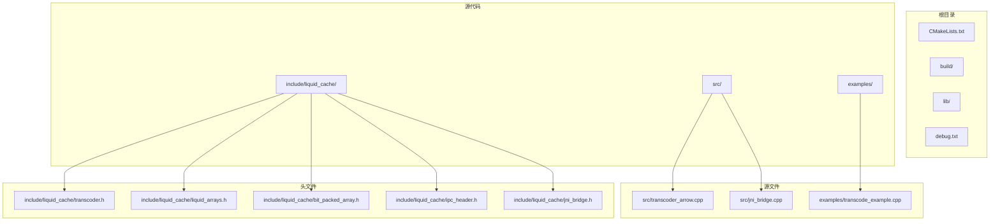
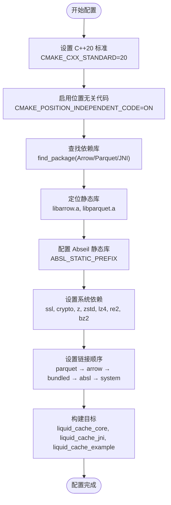
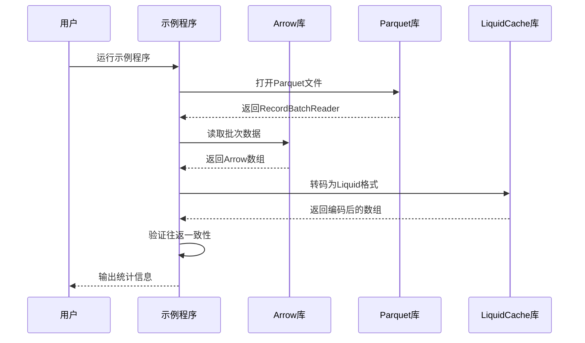
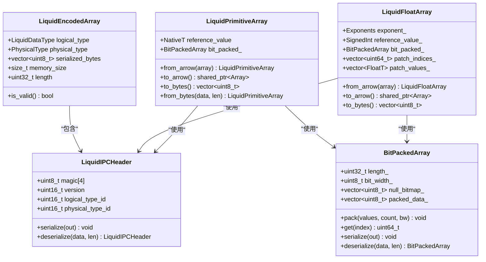
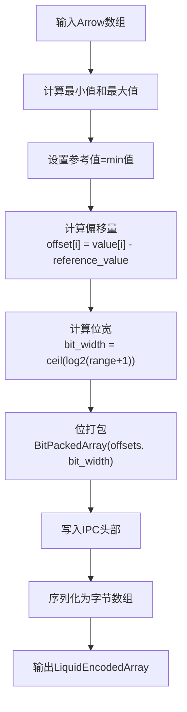
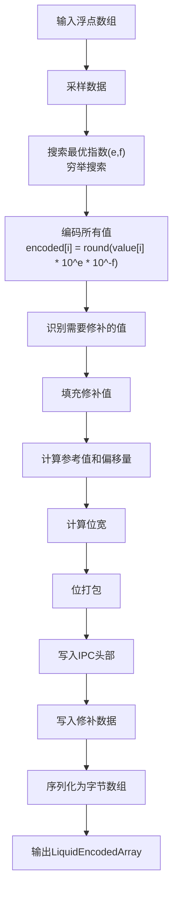

# 快速开始

<cite>
**本文档引用的文件**
- [CMakeLists.txt](file://CMakeLists.txt)
- [transcode_example.cpp](file://examples/transcode_example.cpp)
- [transcoder.h](file://include/liquid_cache/transcoder.h)
- [transcoder_arrow.cpp](file://src/transcoder_arrow.cpp)
- [liquid_arrays.h](file://include/liquid_cache/liquid_arrays.h)
- [bit_packed_array.h](file://include/liquid_cache/bit_packed_array.h)
- [ipc_header.h](file://include/liquid_cache/ipc_header.h)
- [jni_bridge.h](file://include/liquid_cache/jni_bridge.h)
- [jni_bridge.cpp](file://src/jni_bridge.cpp)
- [debug.txt](file://debug.txt)
</cite>

## 目录
1. [简介](#简介)
2. [项目结构](#项目结构)
3. [环境要求](#环境要求)
4. [安装步骤](#安装步骤)
5. [编译配置详解](#编译配置详解)
6. [第一个示例程序](#第一个示例程序)
7. [核心组件分析](#核心组件分析)
8. [常见问题解决](#常见问题解决)
9. [性能优化建议](#性能优化建议)
10. [调试技巧](#调试技巧)
11. [最佳实践](#最佳实践)
12. [总结](#总结)

## 简介

Liquid Cache C++ 是一个高性能的数据压缩和序列化库，专为 Apache Arrow 生态系统设计。该项目提供了将 Arrow 数组转换为紧凑的二进制格式的能力，支持整数、浮点数、日期时间等数据类型的高效存储和传输。

该库的核心特性包括：
- 基于帧式参考（Frame-of-Reference）和位打包的整数压缩
- 自适应无损浮点编码（ALP）
- 完全兼容 Arrow IPC 格式
- JNI 桥接支持 Spark 集成
- 静态链接配置以避免运行时依赖

## 项目结构



**图表来源**
- [CMakeLists.txt:1-127](file://CMakeLists.txt#L1-L127)
- [transcode_example.cpp:1-918](file://examples/transcode_example.cpp#L1-L918)

**章节来源**
- [CMakeLists.txt:1-127](file://CMakeLists.txt#L1-L127)

## 环境要求

### 编译器要求
- **C++20 编译器**：项目明确要求 C++20 标准
- 推荐编译器版本：GCC 11+ 或 Clang 14+

### 依赖库要求
- **Apache Arrow 24.0.0+**：核心数据处理库
- **Apache Parquet 24.0.0+**：列式存储格式支持
- **JNI 支持**：用于与 Java 虚拟机集成

### 系统依赖
- **Abseil 库**：Google 开源 C++ 库集合
- **OpenSSL**：加密和安全通信
- **Brotli**：高压缩比的压缩算法
- **Protobuf**：序列化协议
- **Zlib**：通用压缩库
- **其他**：lz4、re2、bz2、utf8proc、thrift、curl 等

**章节来源**
- [CMakeLists.txt:4-63](file://CMakeLists.txt#L4-L63)
- [debug.txt:81-117](file://debug.txt#L81-L117)

## 安装步骤

### 步骤 1：安装系统依赖

```bash
# Ubuntu/Debian 系统
sudo apt update
sudo apt install -y \
    build-essential \
    cmake \
    libarrow-dev \
    libparquet-dev \
    libarrow-bundle-dev \
    openjdk-11-jdk \
    libabsl-dev \
    libssl-dev \
    libbrotli-dev \
    libprotobuf-dev \
    zlib1g-dev \
    liblz4-dev \
    libre2-dev \
    libbz2-dev \
    libutf8proc-dev \
    libthrift-dev \
    libcurl4-openssl-dev
```

### 步骤 2：准备 Abseil 静态库

```bash
# 下载并编译 Abseil 静态库
git clone https://github.com/abseil/abseil-cpp.git
cd abseil-cpp
mkdir build && cd build
cmake .. -DCMAKE_BUILD_TYPE=Release -DCMAKE_POSITION_INDEPENDENT_CODE=ON
make -j$(nproc)
sudo make install
cd ../..
```

### 步骤 3：克隆和构建项目

```bash
# 克隆项目
git clone https://github.com/your-repo/liquid-cache-cpp.git
cd liquid-cache-cpp

# 创建构建目录
mkdir build && cd build

# 配置构建（使用静态链接）
cmake .. \
    -DCMAKE_BUILD_TYPE=Release \
    -DCMAKE_POSITION_INDEPENDENT_CODE=ON \
    -DABSL_STATIC_PREFIX=/usr/local

# 编译
cmake --build . -j$(nproc)
```

### 步骤 4：验证安装

```bash
# 检查可执行文件
ls -la liquid_cache_example liquid_cache_jni.so

# 检查静态链接
ldd liquid_cache_example | grep -E "(arrow|parquet|absl)" || echo "静态链接成功"

# 运行示例
./liquid_cache_example --help
```

**章节来源**
- [debug.txt:1-186](file://debug.txt#L1-L186)

## 编译配置详解

### CMake 配置参数



**图表来源**
- [CMakeLists.txt:1-127](file://CMakeLists.txt#L1-L127)

### 关键配置选项

#### 静态链接配置
- **静态库优先级**：优先使用 `.a` 文件而非 `.so`
- **捆绑依赖**：使用 `libarrow_bundled_dependencies.a`
- **Abseil 处理**：支持静态和动态两种模式

#### 构建目标
- **liquid_cache_core**：静态库，包含核心转码逻辑
- **liquid_cache_jni**：共享库，提供 JNI 接口
- **liquid_cache_example**：示例可执行文件

**章节来源**
- [CMakeLists.txt:14-78](file://CMakeLists.txt#L14-L78)

## 第一个示例程序

### 示例程序概述

示例程序 `transcode_example.cpp` 展示了完整的数据转码流程：



**图表来源**
- [transcode_example.cpp:177-340](file://examples/transcode_example.cpp#L177-L340)

### 基本使用流程

#### 1. 准备测试数据
```bash
# 创建示例Parquet文件
# 使用Arrow或Spark生成测试数据
```

#### 2. 运行示例程序
```bash
# 基本转码模式
./liquid_cache_example path/to/data.parquet

# 性能基准测试
./liquid_cache_example path/to/data.parquet bench

# 直接Parquet读取基准
./liquid_cache_example path/to/data.parquet bench1

# Liquid Cache读取基准
./liquid_cache_example path/to/data.parquet bench2
```

#### 3. 查看输出结果
程序会显示：
- 文件元数据信息
- 每列的转码详情
- 压缩率统计
- 往返一致性验证
- 性能基准报告

**章节来源**
- [transcode_example.cpp:1-918](file://examples/transcode_example.cpp#L1-L918)

## 核心组件分析

### 数据类型系统



**图表来源**
- [transcoder.h:23-34](file://include/liquid_cache/transcoder.h#L23-L34)
- [liquid_arrays.h:91-227](file://include/liquid_cache/liquid_arrays.h#L91-L227)
- [bit_packed_array.h:28-173](file://include/liquid_cache/bit_packed_array.h#L28-L173)
- [ipc_header.h:55-106](file://include/liquid_cache/ipc_header.h#L55-L106)

### 转码算法详解

#### 整数类型转码流程



**图表来源**
- [liquid_arrays.h:107-161](file://include/liquid_cache/liquid_arrays.h#L107-L161)
- [transcoder.h:86-156](file://include/liquid_cache/transcoder.h#L86-L156)

#### 浮点类型转码流程



**图表来源**
- [liquid_arrays.h:345-430](file://include/liquid_cache/liquid_arrays.h#L345-L430)
- [transcoder.h:169-342](file://include/liquid_cache/transcoder.h#L169-L342)

**章节来源**
- [transcoder_arrow.cpp:36-209](file://src/transcoder_arrow.cpp#L36-L209)
- [transcoder.h:1-345](file://include/liquid_cache/transcoder.h#L1-L345)

## 常见问题解决

### 编译时错误

#### 依赖库未找到
```bash
# 错误信息
CMake Error at CMakeLists.txt:15 (find_package):
  By not providing "FindArrow.cmake" in CMAKE_MODULE_PATH this project has
  asked CMake to find a package configuration file provided by "Arrow", but
  CMake did not find one.
```

**解决方案**：
```bash
# 确保安装了开发包
sudo apt install libarrow-dev libparquet-dev

# 设置正确的路径
export CMAKE_PREFIX_PATH="/usr/lib/x86_64-linux-gnu/cmake"

# 重新配置
cd build
cmake .. -DCMAKE_PREFIX_PATH="/usr/lib/x86_64-linux-gnu"
```

#### Abseil 静态库问题
```bash
# 错误信息
CMake Warning: Manually-specified variables were not used by the project:
    ABSL_STATIC_PREFIX
```

**解决方案**：
```bash
# 使用正确的变量名
cmake .. -DABSL_STATIC_PREFIX=/usr/local

# 或者不使用静态模式
cmake .. -DCMAKE_BUILD_TYPE=Release
```

#### JNI 头文件缺失
```bash
# 错误信息
fatal error: jni.h: No such file or directory
```

**解决方案**：
```bash
# 安装JDK开发包
sudo apt install openjdk-11-jdk

# 设置JAVA_HOME
export JAVA_HOME=/usr/lib/jvm/java-11-openjdk-amd64
```

### 运行时错误

#### 动态链接问题
```bash
# 检查动态链接
ldd liquid_cache_example | grep "not found"

# 解决方案：使用静态链接
cmake .. -DCMAKE_BUILD_TYPE=Release -DCMAKE_POSITION_INDEPENDENT_CODE=ON
```

#### 内存不足错误
```bash
# 错误信息
terminate called after throwing an instance of 'std::bad_alloc'
what(): std::bad_alloc

# 解决方案：减少批处理大小
./liquid_cache_example --batch-size=4096 path/to/large/file.parquet
```

**章节来源**
- [debug.txt:121-186](file://debug.txt#L121-L186)

## 性能优化建议

### 编译优化

#### 启用优化标志
```cmake
# 在CMakeLists.txt中添加
set(CMAKE_BUILD_TYPE Release)
set(CMAKE_CXX_FLAGS_RELEASE "-O3 -DNDEBUG")

# 启用链接时优化
set(CMAKE_INTERPROCEDURAL_OPTIMIZATION TRUE)
```

#### SIMD优化
```cpp
// 在bit_packed_array.h中启用SIMD
#ifdef __AVX2__
#define USE_SIMD 1
#endif
```

### 运行时优化

#### 批处理大小调优
```cpp
// 在示例程序中调整批处理大小
reader->set_batch_size(8192); // 默认值
reader->set_batch_size(16384); // 对于大文件
reader->set_batch_size(4096); // 对于内存受限环境
```

#### 内存管理优化
```cpp
// 使用智能指针管理内存
auto array = std::make_shared<arrow::Int32Array>(values);
auto encoded = transcode_arrow_array(array);

// 及时释放不需要的对象
encoded.reset();
```

## 调试技巧

### 日志和诊断

#### 启用详细日志
```cpp
// 在编译时定义调试宏
cmake .. -DCMAKE_BUILD_TYPE=Debug

// 在代码中添加调试输出
#ifdef DEBUG
    std::cout << "Debug: " << message << std::endl;
#endif
```

#### 性能分析
```bash
# 使用perf进行性能分析
perf record -g ./liquid_cache_example path/to/data.parquet
perf report

# 使用valgrind检测内存问题
valgrind --tool=memcheck --leak-check=full ./liquid_cache_example path/to/data.parquet
```

### 常用调试命令

```bash
# 检查依赖关系
ldd liquid_cache_example | grep -E "(arrow|parquet|absl)"

# 检查符号表
nm -D liquid_cache_jni.so | grep "liquid_cache"

# 检查内存使用
valgrind --tool=massif ./liquid_cache_example path/to/data.parquet
```

## 最佳实践

### 代码组织

#### 模块化设计
- 将核心转码逻辑分离到独立模块
- 提供清晰的接口抽象
- 实现类型安全的错误处理

#### 内存管理
- 优先使用智能指针
- 避免不必要的数据复制
- 及时释放临时对象

### 性能考虑

#### 数据流优化
```cpp
// 使用移动语义避免拷贝
auto encoded = std::move(transcode_arrow_array(array));

// 批量处理减少系统调用
for (const auto& batch : batches) {
    process_batch(batch);
}
```

#### 并发处理
```cpp
// 使用多线程处理多个文件
std::vector<std::future<void>> futures;
for (const auto& file : files) {
    futures.push_back(std::async(std::launch::async, 
                              [&]() { process_file(file); }));
}
```

### 错误处理

#### 异常安全
```cpp
try {
    auto result = transcode_arrow_array(array);
    if (!result.is_valid()) {
        throw std::runtime_error("Unsupported data type");
    }
} catch (const std::exception& e) {
    std::cerr << "Error: " << e.what() << std::endl;
    return -1;
}
```

## 总结

Liquid Cache C++ 项目为 Arrow 生态系统提供了高效的压缩和序列化解决方案。通过遵循本文档的指导，您可以在30分钟内完成环境搭建并运行第一个示例程序。

### 关键要点

1. **环境准备**：确保满足 C++20、Apache Arrow 24.0.0+、Apache Parquet 24.0.0+ 和 JNI 的要求
2. **编译配置**：正确配置静态链接和依赖库定位
3. **示例运行**：使用提供的示例程序验证安装
4. **性能优化**：根据应用场景调整批处理大小和内存使用
5. **故障排除**：利用调试工具和日志信息定位问题

### 下一步

- 探索更复杂的数据类型支持
- 集成到现有的 Arrow 应用程序中
- 实现自定义的 JNI 接口
- 优化特定场景下的性能表现

通过这些步骤，您将能够充分利用 Liquid Cache C++ 的强大功能，在生产环境中获得显著的存储节省和性能提升。