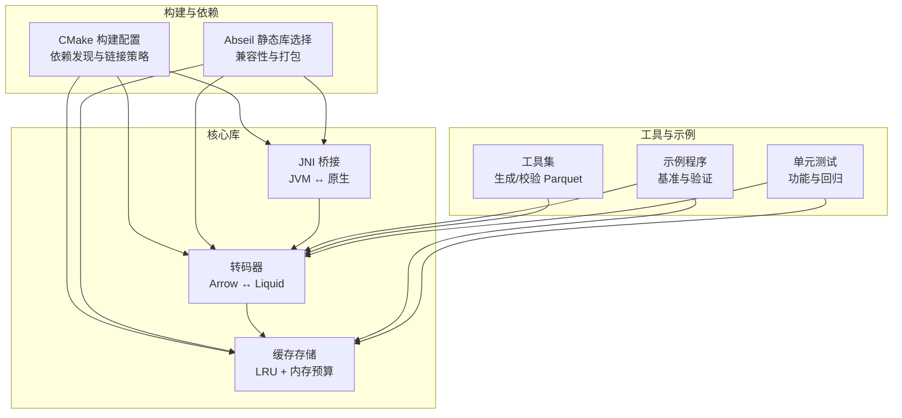
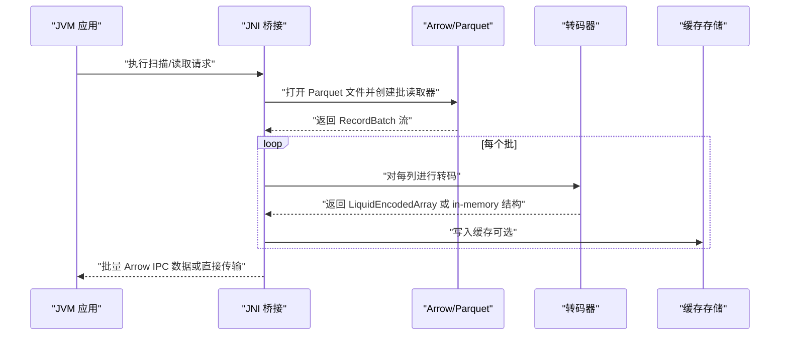
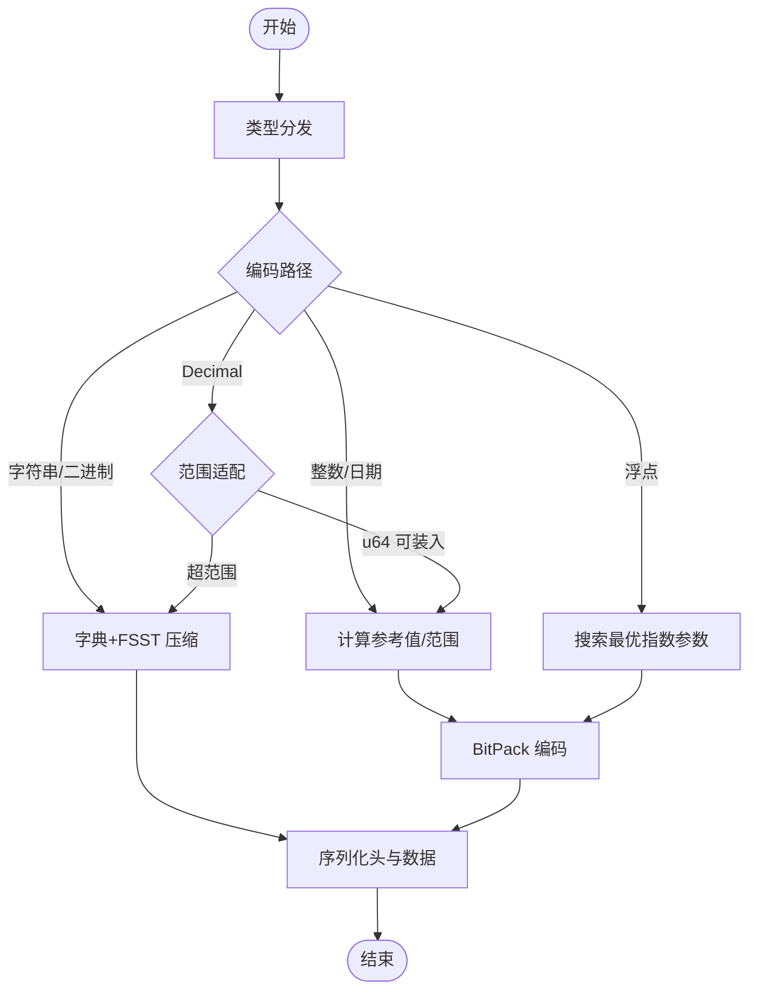
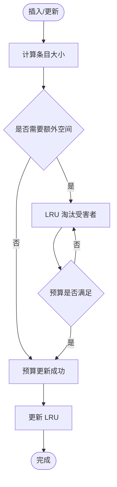
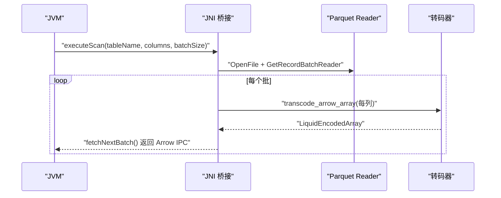
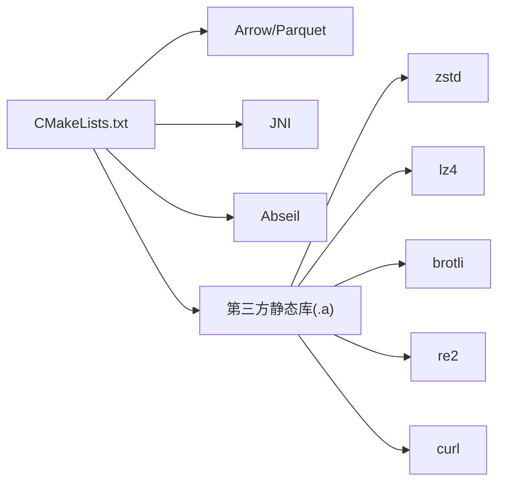

# 故障排除与调试

<cite>
**本文档引用的文件**
- [CMakeLists.txt](file://CMakeLists.txt)
- [debug.txt](file://debug.txt)
- [README.md](file://README.md)
- [transcoder.h](file://include/liquid_cache/transcoder.h)
- [lru_policy.h](file://include/liquid_cache/lru_policy.h)
- [liquid_cache_store.h](file://include/liquid_cache/liquid_cache_store.h)
- [transcoder_arrow.cpp](file://src/transcoder_arrow.cpp)
- [jni_bridge.cpp](file://src/jni_bridge.cpp)
- [transcode_example.cpp](file://examples/transcode_example.cpp)
- [test_cache_budget.cpp](file://tests/test_cache_budget.cpp)
- [test_roundtrip.cpp](file://tests/test_roundtrip.cpp)
- [test_velox_crossval.cpp](file://tests/test_velox_crossval.cpp)
- [test_float_quantize.cpp](file://tests/test_float_quantize.cpp)
- [generate_test_parquet.cpp](file://tools/generate_test_parquet.cpp)
- [verify_parquet.cpp](file://tools/verify_parquet.cpp)
</cite>

## 目录
1. [简介](#简介)
2. [项目结构](#项目结构)
3. [核心组件](#核心组件)
4. [架构总览](#架构总览)
5. [详细组件分析](#详细组件分析)
6. [依赖关系分析](#依赖关系分析)
7. [性能考虑](#性能考虑)
8. [故障排除指南](#故障排除指南)
9. [结论](#结论)
10. [附录](#附录)

## 简介
本指南面向使用 liquid-cache-cpp 的开发者与运维人员，系统化梳理常见问题与调试方法，覆盖编译错误、运行时异常、性能问题、内存泄漏、缓存策略异常、转码问题以及性能分析与优化建议。文档基于仓库中的源码、构建脚本与测试用例进行深入分析，并提供可操作的排障步骤与最佳实践。

## 项目结构
项目采用模块化设计，核心模块包括：
- 编译与依赖管理：通过 CMake 配置 Arrow、Parquet、JNI、Abseil 等依赖，并支持静态链接与动态链接策略。
- 转码与序列化：提供 Arrow 数组到 Liquid 缓存格式的编码/解码能力，支持多种数据类型与压缩策略。
- 缓存存储：以列为主的数据结构，支持内存预算控制与 LRU 淘汰策略，提供零反序列化读取路径。
- JNI 桥接：为 JVM（如 Spark）提供原生桥接，支持 Parquet 读取与批量传输。
- 示例与工具：基准测试、验证工具、测试数据生成器等。

图表来源
- [CMakeLists.txt](file://CMakeLists.txt)
- [transcoder_arrow.cpp](file://src/transcoder_arrow.cpp)
- [liquid_cache_store.h](file://include/liquid_cache/liquid_cache_store.h)
- [jni_bridge.cpp](file://src/jni_bridge.cpp)
- [transcode_example.cpp](file://examples/transcode_example.cpp)
- [generate_test_parquet.cpp](file://tools/generate_test_parquet.cpp)
- [verify_parquet.cpp](file://tools/verify_parquet.cpp)
- [test_roundtrip.cpp](file://tests/test_roundtrip.cpp)
- [test_cache_budget.cpp](file://tests/test_cache_budget.cpp)

章节来源
- [CMakeLists.txt](file://CMakeLists.txt)
- [README.md](file://README.md)

## 核心组件
- 转码器（transcoder.h/.cpp）
  - 支持整型、浮点、字符串/二进制、日期/时间戳、Decimal 等类型的编码与解码。
  - 提供 Arrow 原生数组与 Liquid 结构之间的互转接口。
- 缓存存储（liquid_cache_store.h）
  - 列式缓存，支持按列投影与行过滤。
  - 内存预算与 LRU 策略，线程安全。
- LRU 策略（lru_policy.h）
  - 基于列表与哈希表的 LRU 实现，支持插入、访问、淘汰与统计。
- JNI 桥接（jni_bridge.cpp）
  - 提供 JVM 侧调用的本地方法，负责 Parquet 读取、转码与批量传输。
- 示例与工具（transcode_example.cpp、generate_test_parquet.cpp、verify_parquet.cpp）
  - 基准测试、正确性验证与测试数据生成。

章节来源
- [transcoder.h](file://include/liquid_cache/transcoder.h)
- [transcoder_arrow.cpp](file://src/transcoder_arrow.cpp)
- [liquid_cache_store.h](file://include/liquid_cache/liquid_cache_store.h)
- [lru_policy.h](file://include/liquid_cache/lru_policy.h)
- [jni_bridge.cpp](file://src/jni_bridge.cpp)
- [transcode_example.cpp](file://examples/transcode_example.cpp)
- [generate_test_parquet.cpp](file://tools/generate_test_parquet.cpp)
- [verify_parquet.cpp](file://tools/verify_parquet.cpp)

## 架构总览
下图展示从 JVM 到 Arrow/Parquet，再到 Liquid 缓存的完整数据流与关键组件交互。

图表来源
- [jni_bridge.cpp](file://src/jni_bridge.cpp)
- [transcoder_arrow.cpp](file://src/transcoder_arrow.cpp)
- [liquid_cache_store.h](file://include/liquid_cache/liquid_cache_store.h)

## 详细组件分析

### 组件一：转码器（Arrow ↔ Liquid）
- 功能要点
  - 类型分发：根据 Arrow 类型映射到对应的 Liquid 编码路径（FoR+BitPacking、ALP、字节视图、Decimal 等）。
  - 编解码：支持 Arrow 原生数组与 Liquid 结构之间的双向转换。
  - 边界处理：空数组、全空值、常量值等边缘场景的健壮性。
- 关键流程
  - Arrow → Liquid：类型分发 → 计算参考值/范围 → BitPack/ALP → 序列化头与数据。
  - Liquid → Arrow：解析头 → 反序列化数据 → 还原类型与单位（如时间戳）。

图表来源
- [transcoder.h](file://include/liquid_cache/transcoder.h)
- [transcoder_arrow.cpp](file://src/transcoder_arrow.cpp)

章节来源
- [transcoder.h](file://include/liquid_cache/transcoder.h)
- [transcoder_arrow.cpp](file://src/transcoder_arrow.cpp)
- [test_roundtrip.cpp](file://tests/test_roundtrip.cpp)

### 组件二：缓存存储（LRU + 内存预算）
- 功能要点
  - 键空间：由文件/行组/列/批次组合的键标识缓存项。
  - 内存预算：原子计数预留/释放，超过上限触发淘汰。
  - LRU 策略：插入/访问更新顺序，淘汰尾部最久未使用项。
  - 读取路径：支持列投影与布尔掩码过滤，零反序列化读取。
- 关键流程
  - 插入：计算条目大小 → 预留预算 → 淘汰直到有足够空间 → 更新 LRU。
  - 读取：命中则更新 LRU → 返回 Arrow 或 Liquid 结构（按需过滤）。

图表来源
- [liquid_cache_store.h](file://include/liquid_cache/liquid_cache_store.h)
- [lru_policy.h](file://include/liquid_cache/lru_policy.h)
- [test_cache_budget.cpp](file://tests/test_cache_budget.cpp)

章节来源
- [liquid_cache_store.h](file://include/liquid_cache/liquid_cache_store.h)
- [lru_policy.h](file://include/liquid_cache/lru_policy.h)
- [test_cache_budget.cpp](file://tests/test_cache_budget.cpp)

### 组件三：JNI 桥接（JVM ↔ 原生）
- 功能要点
  - 扫描执行：打开 Parquet → 创建批读取器 → 转码每列 → 序列化为 Arrow IPC。
  - 结果管理：会话/结果句柄生命周期管理。
- 关键流程
  - createSession/registerObjectStore/registerParquet/executeScan/fetchNextBatch/closeResult/closeSession。

图表来源
- [jni_bridge.cpp](file://src/jni_bridge.cpp)
- [transcoder_arrow.cpp](file://src/transcoder_arrow.cpp)

章节来源
- [jni_bridge.cpp](file://src/jni_bridge.cpp)

### 组件四：示例与工具
- 示例程序（transcode_example.cpp）
  - 加载 Parquet → 转码到缓存 → 基准对比（Parquet vs CacheStore）→ 正确性验证。
- 工具
  - generate_test_parquet.cpp：生成多列、多类型的测试数据文件。
  - verify_parquet.cpp：快速校验 Parquet 文件元信息与行数。

章节来源
- [transcode_example.cpp](file://examples/transcode_example.cpp)
- [generate_test_parquet.cpp](file://tools/generate_test_parquet.cpp)
- [verify_parquet.cpp](file://tools/verify_parquet.cpp)

## 依赖关系分析
- 构建与链接
  - Arrow/Parquet/JNI/Abseil 等通过 find_package 发现；支持静态链接（优先 .a），并处理系统依赖（如 curl、xml2 等）。
  - 当启用 LIQUID_ENABLE_VELOX 时，切换到 Velox 自带的 Arrow/Parquet，确保 ABI 兼容。
- 运行时依赖
  - 通过 ldd 检查二进制依赖，确保无外部共享库依赖（静态打包）。

图表来源
- [CMakeLists.txt](file://CMakeLists.txt)

章节来源
- [CMakeLists.txt](file://CMakeLists.txt)
- [debug.txt](file://debug.txt)

## 性能考虑
- 编解码性能
  - 整型/日期：FoR + BitPacking，小范围/常量值可显著降低内存占用。
  - 浮点：ALP 搜索最优指数参数，配合 BitPacking；当 bit_width < 8 时不进行挤压。
  - 字符串/二进制：字典+FSST 压缩，重复度高时收益明显。
- 缓存性能
  - 列式存储 + 零反序列化读取，减少拷贝与解析开销。
  - LRU + 内存预算，避免 OOM 并提升热点命中率。
- I/O 优化
  - 使用 Arrow/Parquet 批读取，合理设置 batch_size。
  - 生成测试数据时选择合适的压缩算法（如 SNAPPY）。

章节来源
- [transcoder.h](file://include/liquid_cache/transcoder.h)
- [transcoder_arrow.cpp](file://src/transcoder_arrow.cpp)
- [liquid_cache_store.h](file://include/liquid_cache/liquid_cache_store.h)
- [generate_test_parquet.cpp](file://tools/generate_test_parquet.cpp)

## 故障排除指南

### 一、编译错误
- 常见症状
  - 找不到依赖（Arrow/Parquet/JNI/Protobuf 等）。
  - 静态链接失败或运行时报缺少共享库。
  - ABI 不匹配（启用 LIQUID_ENABLE_VELOX 时）。
- 排查步骤
  - 确认 CMake 输出中依赖已找到且版本符合预期。
  - 若启用 LIQUID_ENABLE_VELOX，确保 VELOX_PREFIX 指向正确的构建目录。
  - 静态打包时检查 ABSL_STATIC_PREFIX 与系统静态库可用性。
  - 使用 ldd 检查最终二进制是否仍有外部共享库依赖。
- 参考文件
  - [CMakeLists.txt](file://CMakeLists.txt)
  - [debug.txt](file://debug.txt)

章节来源
- [CMakeLists.txt](file://CMakeLists.txt)
- [debug.txt](file://debug.txt)

### 二、运行时异常
- 常见症状
  - Parquet 读取失败（文件不可打开、模式不匹配、批读取器创建失败）。
  - 转码失败（不支持的 Arrow 类型、解码后与原数组不相等）。
  - 缓存插入失败（条目过大、预算不足、并发访问冲突）。
- 排查步骤
  - 检查文件路径与权限，确认 Parquet 元信息与 schema 读取成功。
  - 对转码失败的数组进行 round-trip 验证，定位具体类型与边界条件。
  - 观察缓存统计（条目数、内存使用、预算上限），确认 LRU 是否正常工作。
- 参考文件
  - [jni_bridge.cpp](file://src/jni_bridge.cpp)
  - [transcoder_arrow.cpp](file://src/transcoder_arrow.cpp)
  - [liquid_cache_store.h](file://include/liquid_cache/liquid_cache_store.h)
  - [test_roundtrip.cpp](file://tests/test_roundtrip.cpp)
  - [test_cache_budget.cpp](file://tests/test_cache_budget.cpp)

章节来源
- [jni_bridge.cpp](file://src/jni_bridge.cpp)
- [transcoder_arrow.cpp](file://src/transcoder_arrow.cpp)
- [liquid_cache_store.h](file://include/liquid_cache/liquid_cache_store.h)
- [test_roundtrip.cpp](file://tests/test_roundtrip.cpp)
- [test_cache_budget.cpp](file://tests/test_cache_budget.cpp)

### 三、性能问题
- 常见症状
  - 解码速度慢于直接读取 Parquet。
  - 内存占用过高或频繁触发淘汰。
  - 浮点挤压无效（bit_width 太小）。
- 排查步骤
  - 使用示例程序进行基准测试，对比不同场景下的耗时与加速比。
  - 分析缓存命中率与淘汰频率，调整内存预算上限与 batch_size。
  - 检查浮点数组 bit_width，确认是否满足挤压条件。
- 参考文件
  - [transcode_example.cpp](file://examples/transcode_example.cpp)
  - [liquid_cache_store.h](file://include/liquid_cache/liquid_cache_store.h)
  - [test_float_quantize.cpp](file://tests/test_float_quantize.cpp)

章节来源
- [transcode_example.cpp](file://examples/transcode_example.cpp)
- [liquid_cache_store.h](file://include/liquid_cache/liquid_cache_store.h)
- [test_float_quantize.cpp](file://tests/test_float_quantize.cpp)

### 四、内存泄漏与内存溢出
- 常见症状
  - 长时间运行后内存持续增长。
  - 插入缓存时抛出异常或预算不足。
- 排查步骤
  - 启用内存分析工具（如 AddressSanitizer/LeakSanitizer），定位泄漏点。
  - 检查缓存统计与预算更新逻辑，确认释放路径正确。
  - 控制单条目大小与总预算，避免单个条目超过预算上限。
- 参考文件
  - [lru_policy.h](file://include/liquid_cache/lru_policy.h)
  - [liquid_cache_store.h](file://include/liquid_cache/liquid_cache_store.h)
  - [test_cache_budget.cpp](file://tests/test_cache_budget.cpp)

章节来源
- [lru_policy.h](file://include/liquid_cache/lru_policy.h)
- [liquid_cache_store.h](file://include/liquid_cache/liquid_cache_store.h)
- [test_cache_budget.cpp](file://tests/test_cache_budget.cpp)

### 五、缓存相关问题
- 缓存未命中
  - 检查键构造（file_id/rg_id/col_id/batch_id）是否一致。
  - 确认列投影与过滤条件是否导致缓存键不匹配。
- 内存溢出
  - 调整最大缓存大小，观察预算使用与淘汰行为。
  - 对大列（如字符串/二进制）评估压缩效果与内存占用。
- LRU 策略异常
  - 确认访问通知（notify_access）与插入通知（notify_insert）调用时机。
  - 检查 find_victims 的批量淘汰是否按预期执行。
- 参考文件
  - [liquid_cache_store.h](file://include/liquid_cache/liquid_cache_store.h)
  - [lru_policy.h](file://include/liquid_cache/lru_policy.h)
  - [test_cache_budget.cpp](file://tests/test_cache_budget.cpp)

章节来源
- [liquid_cache_store.h](file://include/liquid_cache/liquid_cache_store.h)
- [lru_policy.h](file://include/liquid_cache/lru_policy.h)
- [test_cache_budget.cpp](file://tests/test_cache_budget.cpp)

### 六、转码问题
- 数据不一致
  - 使用 round-trip 测试验证 Arrow → Liquid → Arrow 的一致性。
  - 特别关注空值、全空值、常量值等边界情况。
- 格式错误
  - 检查 IPC 头部字段（逻辑/物理类型）与序列化/反序列化流程。
  - 对时间戳类型，确认单位与零点转换正确。
- 性能瓶颈
  - 浮点挤压：bit_width < 8 时不进行挤压；确保数据分布适合挤压。
  - 字符串/二进制：字典+FSST 压缩在重复度高时更有效。
- 参考文件
  - [transcoder.h](file://include/liquid_cache/transcoder.h)
  - [transcoder_arrow.cpp](file://src/transcoder_arrow.cpp)
  - [test_roundtrip.cpp](file://tests/test_roundtrip.cpp)
  - [test_float_quantize.cpp](file://tests/test_float_quantize.cpp)

章节来源
- [transcoder.h](file://include/liquid_cache/transcoder.h)
- [transcoder_arrow.cpp](file://src/transcoder_arrow.cpp)
- [test_roundtrip.cpp](file://tests/test_roundtrip.cpp)
- [test_float_quantize.cpp](file://tests/test_float_quantize.cpp)

### 七、调试方法与工具
- 日志分析
  - 在关键路径添加日志（文件打开、批读取、转码、缓存插入/读取）。
  - 使用测试程序输出统计信息（行数、内存、耗时）。
- 内存检查
  - 使用 ASan/LSan 检测内存越界、泄漏与悬垂指针。
  - 结合缓存统计接口监控内存使用峰值与趋势。
- 性能分析
  - 使用 perf/Intel VTune/Valgrind Callgrind 分析热点函数。
  - 对比 Parquet 直读与缓存读取的 CPU 时间与缓存命中率。
- 参考文件
  - [transcode_example.cpp](file://examples/transcode_example.cpp)
  - [test_cache_budget.cpp](file://tests/test_cache_budget.cpp)

章节来源
- [transcode_example.cpp](file://examples/transcode_example.cpp)
- [test_cache_budget.cpp](file://tests/test_cache_budget.cpp)

### 八、开发调试最佳实践
- 单元测试驱动
  - 使用 GoogleTest 验证各类数据类型的 round-trip 与边界条件。
  - 针对缓存预算与 LRU 行为编写集成测试。
- 基准测试
  - 使用示例程序在真实数据上进行端到端性能评估。
  - 对比不同压缩策略与批大小对吞吐与延迟的影响。
- 文档与注释
  - 在复杂路径添加注释与断言，便于后续维护与调试。
- 参考文件
  - [test_roundtrip.cpp](file://tests/test_roundtrip.cpp)
  - [test_cache_budget.cpp](file://tests/test_cache_budget.cpp)
  - [transcode_example.cpp](file://examples/transcode_example.cpp)

章节来源
- [test_roundtrip.cpp](file://tests/test_roundtrip.cpp)
- [test_cache_budget.cpp](file://tests/test_cache_budget.cpp)
- [transcode_example.cpp](file://examples/transcode_example.cpp)

## 结论
本指南提供了从编译、运行、性能到缓存与转码的系统化故障排除方法。通过结合构建配置、单元测试、基准测试与内存/性能分析工具，可以高效定位并解决大多数问题。建议在开发流程中持续运行测试与基准，确保变更不会引入回归或性能退化。

## 附录
- 快速检查清单
  - 依赖是否正确安装与发现（CMake 输出）。
  - 静态打包后二进制是否无外部共享库依赖（ldd）。
  - Parquet 文件是否可正常打开与读取。
  - round-trip 与缓存预算测试是否通过。
  - 性能基准显示合理的加速比与内存占用。
- 相关文件索引
  - [CMakeLists.txt](file://CMakeLists.txt)
  - [debug.txt](file://debug.txt)
  - [transcoder.h](file://include/liquid_cache/transcoder.h)
  - [transcoder_arrow.cpp](file://src/transcoder_arrow.cpp)
  - [liquid_cache_store.h](file://include/liquid_cache/liquid_cache_store.h)
  - [lru_policy.h](file://include/liquid_cache/lru_policy.h)
  - [jni_bridge.cpp](file://src/jni_bridge.cpp)
  - [transcode_example.cpp](file://examples/transcode_example.cpp)
  - [test_roundtrip.cpp](file://tests/test_roundtrip.cpp)
  - [test_cache_budget.cpp](file://tests/test_cache_budget.cpp)
  - [test_velox_crossval.cpp](file://tests/test_velox_crossval.cpp)
  - [test_float_quantize.cpp](file://tests/test_float_quantize.cpp)
  - [generate_test_parquet.cpp](file://tools/generate_test_parquet.cpp)
  - [verify_parquet.cpp](file://tools/verify_parquet.cpp)