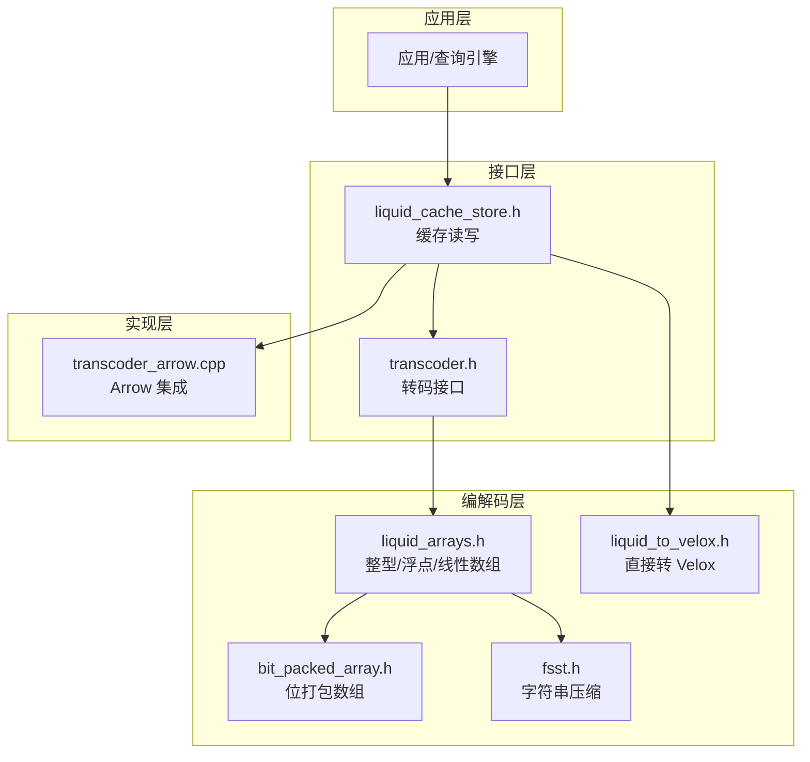
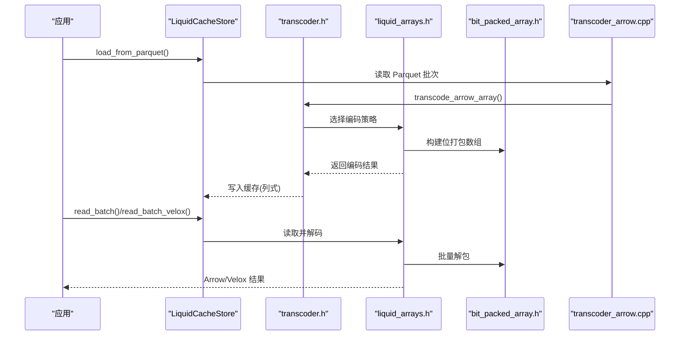
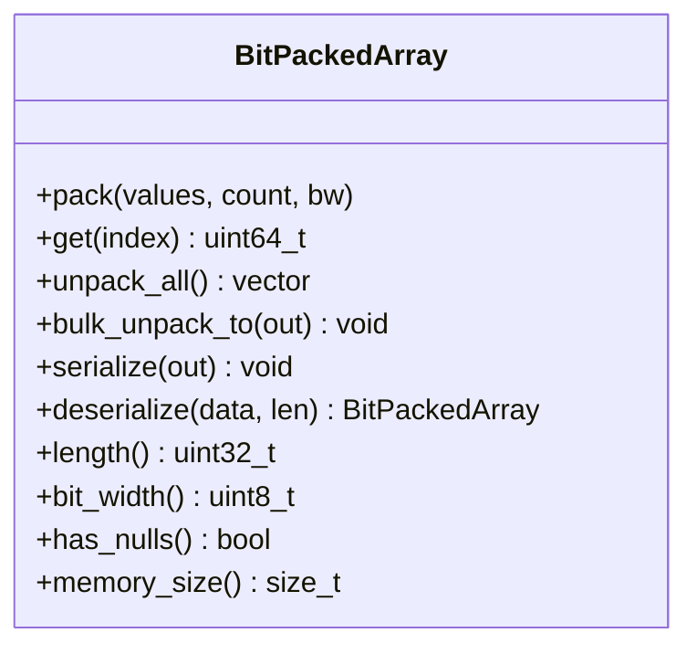
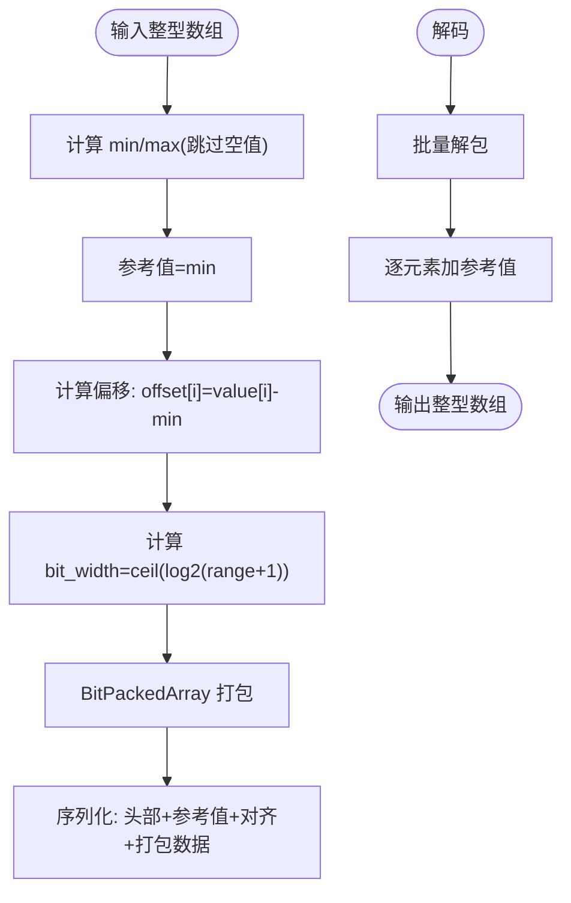
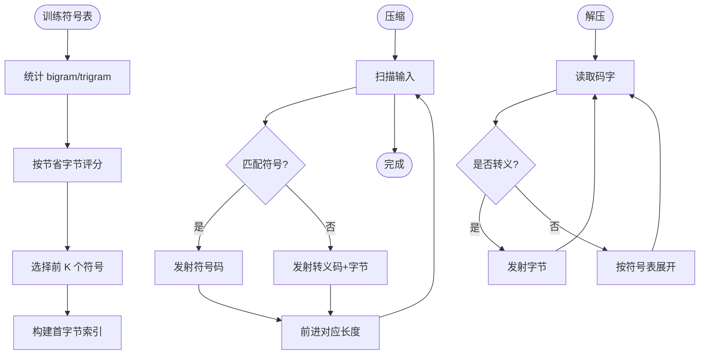
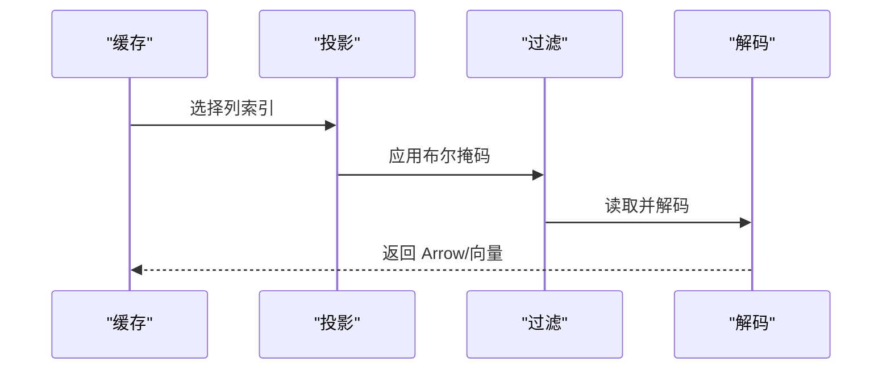
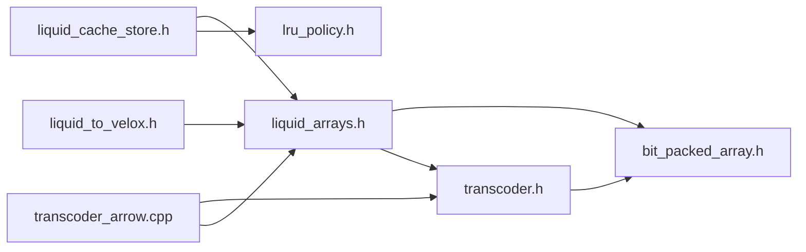
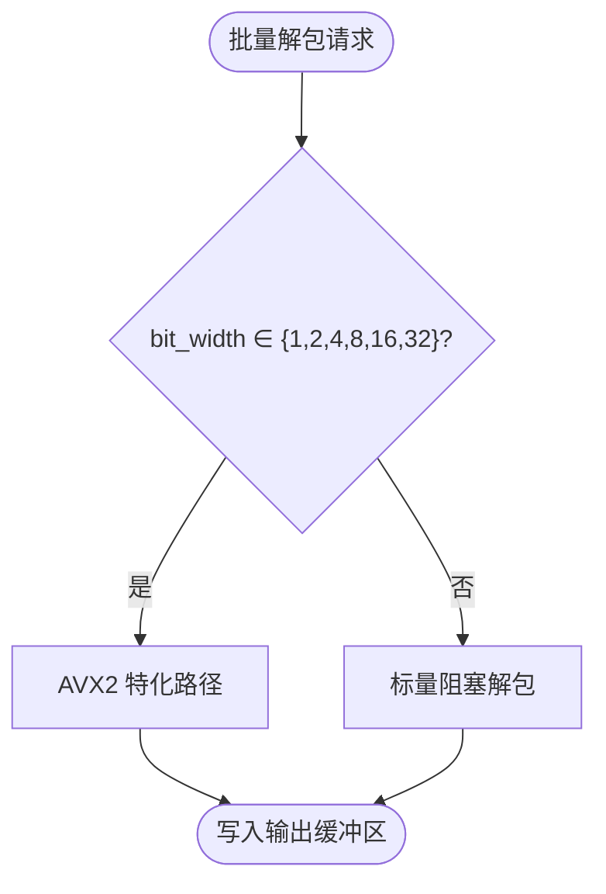
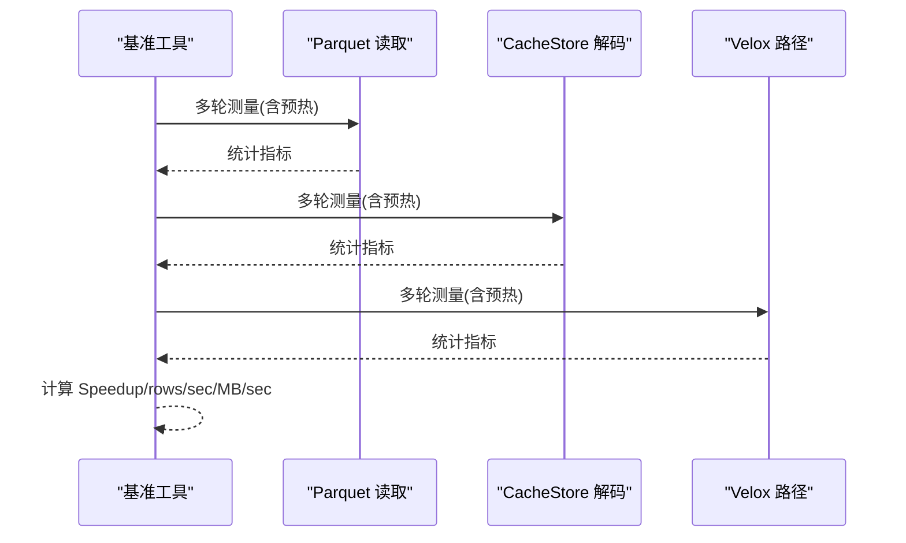

# 性能优化策略

<cite>
**本文档引用的文件**
- [README.md](file://README.md)
- [transcoder.h](file://include/liquid_cache/transcoder.h)
- [bit_packed_array.h](file://include/liquid_cache/bit_packed_array.h)
- [transcoder_arrow.cpp](file://src/transcoder_arrow.cpp)
- [liquid_arrays.h](file://include/liquid_cache/liquid_arrays.h)
- [liquid_array.h](file://include/liquid_cache/liquid_array.h)
- [liquid_cache_store.h](file://include/liquid_cache/liquid_cache_store.h)
- [fsst.h](file://include/liquid_cache/fsst.h)
- [liquid_to_velox.h](file://include/liquid_cache/liquid_to_velox.h)
- [transcode_example.cpp](file://examples/transcode_example.cpp)
- [velox_benchmark.cpp](file://examples/velox_benchmark.cpp)
</cite>

## 目录
1. [简介](#简介)
2. [项目结构](#项目结构)
3. [核心组件](#核心组件)
4. [架构概览](#架构概览)
5. [详细组件分析](#详细组件分析)
6. [依赖关系分析](#依赖关系分析)
7. [性能考虑因素](#性能考虑因素)
8. [故障排查指南](#故障排查指南)
9. [结论](#结论)
10. [附录](#附录)

## 简介
本文件聚焦于 liquid-cache-cpp 在转码与解码过程中的性能优化策略，系统性分析内存访问模式、缓存友好的数据布局、并行处理策略，并结合 BitPacking、SIMD 指令优化与流水线处理等技术，提出可操作的优化建议与最佳实践。同时基于项目内置的基准测试工具，给出性能评估方法与监控指标。

## 项目结构
该项目采用模块化设计，围绕“列式内存缓存 + 编解码”展开：
- 接口层：对外暴露转码/解码入口与缓存读写接口
- 编解码层：实现整型/浮点/字符串等类型的压缩与解压算法
- 缓存层：以列为主的数据结构，支持投影与过滤
- 基准测试：提供与 Velox 引擎的对比评测工具

**图表来源**
- [transcoder.h:1-360](file://include/liquid_cache/transcoder.h#L1-L360)
- [liquid_cache_store.h:1-527](file://include/liquid_cache/liquid_cache_store.h#L1-L527)
- [liquid_arrays.h:1-800](file://include/liquid_cache/liquid_arrays.h#L1-L800)
- [bit_packed_array.h:1-486](file://include/liquid_cache/bit_packed_array.h#L1-L486)
- [fsst.h:1-270](file://include/liquid_cache/fsst.h#L1-L270)
- [liquid_to_velox.h:1-138](file://include/liquid_cache/liquid_to_velox.h#L1-L138)
- [transcoder_arrow.cpp:1-746](file://src/transcoder_arrow.cpp#L1-L746)

**章节来源**
- [README.md:1-378](file://README.md#L1-L378)

## 核心组件
- 转码接口：提供原始缓冲区与 Arrow 数组两种转码入口，覆盖整型、浮点、时间戳、字符串等类型
- 位打包数组：面向 SIMD 的位打包存储，支持批量解包与对齐优化
- 列式缓存：按列缓存，支持投影、过滤与 LRU 淘汰，避免序列化开销
- 字符串压缩：FSST 符号表压缩，适合高重复率文本
- Velox 直转：在启用 Velox 时，提供直接向量转换能力

**章节来源**
- [transcoder.h:1-360](file://include/liquid_cache/transcoder.h#L1-L360)
- [bit_packed_array.h:1-486](file://include/liquid_cache/bit_packed_array.h#L1-L486)
- [liquid_arrays.h:1-800](file://include/liquid_cache/liquid_arrays.h#L1-L800)
- [liquid_cache_store.h:1-527](file://include/liquid_cache/liquid_cache_store.h#L1-L527)
- [fsst.h:1-270](file://include/liquid_cache/fsst.h#L1-L270)
- [liquid_to_velox.h:1-138](file://include/liquid_cache/liquid_to_velox.h#L1-L138)

## 架构概览
整体流程从 Parquet 读取数据，经 Arrow 转码为 Liquid 结构，写入列式缓存；读取时按需投影与过滤，解码为 Arrow 或直接转 Velox 向量。

**图表来源**
- [transcoder_arrow.cpp:34-369](file://src/transcoder_arrow.cpp#L34-L369)
- [transcoder.h:351-358](file://include/liquid_cache/transcoder.h#L351-L358)
- [liquid_arrays.h:95-248](file://include/liquid_cache/liquid_arrays.h#L95-L248)
- [bit_packed_array.h:242-272](file://include/liquid_cache/bit_packed_array.h#L242-L272)
- [liquid_cache_store.h:311-356](file://include/liquid_cache/liquid_cache_store.h#L311-L356)

## 详细组件分析

### BitPacking 与位打包数组
- 设计目标：最小化存储空间，最大化解码吞吐
- 关键特性：
  - 以 bit_width 为单位存储，减少冗余位
  - 8 字节对齐，便于后续 SIMD 批量解包
  - 提供 scalar 与 AVX2 批量解包路径，按 bit_width 选择最优实现
  - 支持空值位图，空值按 0 处理

**图表来源**
- [bit_packed_array.h:39-483](file://include/liquid_cache/bit_packed_array.h#L39-L483)

**章节来源**
- [bit_packed_array.h:242-444](file://include/liquid_cache/bit_packed_array.h#L242-L444)

### 整型/浮点转码与解码
- 整型：帧参考 + 位打包（FoR + BitPacking）
  - 计算 min 作为参考值，offset = value - min，再按 range 的 bit_width 打包
  - 解码时批量解包 + 参考值相加，避免逐元素开销
- 浮点：ALP（自适应无损浮点）+ 位打包
  - 通过指数搜索确定最佳 (e,f)，对误差进行补丁记录，随后对编码值做位打包
  - 解码时先按 (e,f) 解码，再用补丁修正

**图表来源**
- [transcoder.h:78-156](file://include/liquid_cache/transcoder.h#L78-L156)
- [liquid_arrays.h:95-248](file://include/liquid_cache/liquid_arrays.h#L95-L248)

**章节来源**
- [transcoder.h:78-156](file://include/liquid_cache/transcoder.h#L78-L156)
- [liquid_arrays.h:95-248](file://include/liquid_cache/liquid_arrays.h#L95-L248)

### 字符串压缩（FSST）
- 适用场景：高重复率文本（如标签、名称）
- 实现要点：
  - 训练阶段统计 bigram/trigram，按节省字节排序选取符号
  - 压缩时使用首字节索引快速定位候选符号，否则转为转义字节
  - 解压时按符号表展开或原样输出

**图表来源**
- [fsst.h:36-181](file://include/liquid_cache/fsst.h#L36-L181)

**章节来源**
- [fsst.h:36-270](file://include/liquid_cache/fsst.h#L36-L270)

### 列式缓存与读取路径
- 列式布局：每列每批次独立缓存，支持投影与过滤
- 零序列化读取：缓存中保存的是原生结构，避免反序列化
- LRU 淘汰与内存预算：通过原子预算与 LRU 策略控制内存占用

**图表来源**
- [liquid_cache_store.h:311-356](file://include/liquid_cache/liquid_cache_store.h#L311-L356)
- [liquid_array.h:38-85](file://include/liquid_cache/liquid_array.h#L38-L85)

**章节来源**
- [liquid_cache_store.h:188-527](file://include/liquid_cache/liquid_cache_store.h#L188-L527)
- [liquid_array.h:38-85](file://include/liquid_cache/liquid_array.h#L38-L85)

### 与 Velox 的直接转换
- 在启用 LIQUID_ENABLE_VELOX 时，提供从 Liquid 结构到 Velox 向量的直转
- 支持空值位图复制、时间戳物理类型映射、类型映射等

**章节来源**
- [liquid_to_velox.h:33-133](file://include/liquid_cache/liquid_to_velox.h#L33-L133)
- [transcoder_arrow.cpp:489-658](file://src/transcoder_arrow.cpp#L489-L658)

## 依赖关系分析
- 头文件依赖：transcoder.h 依赖 bit_packed_array.h 与 IPC 头；liquid_arrays.h 依赖 bit_packed_array.h 与 IPC 头；liquid_cache_store.h 依赖 liquid_array.h 与 LRU 策略
- 实现依赖：transcoder_arrow.cpp 作为 Arrow 适配层，桥接转码接口与具体数组类型

**图表来源**
- [transcoder.h:1-30](file://include/liquid_cache/transcoder.h#L1-L30)
- [liquid_arrays.h:1-34](file://include/liquid_cache/liquid_arrays.h#L1-L34)
- [liquid_cache_store.h:1-32](file://include/liquid_cache/liquid_cache_store.h#L1-L32)
- [transcoder_arrow.cpp:1-27](file://src/transcoder_arrow.cpp#L1-L27)
- [liquid_to_velox.h:1-22](file://include/liquid_cache/liquid_to_velox.h#L1-L22)

**章节来源**
- [transcoder.h:1-30](file://include/liquid_cache/transcoder.h#L1-L30)
- [liquid_arrays.h:1-34](file://include/liquid_cache/liquid_arrays.h#L1-L34)
- [liquid_cache_store.h:1-32](file://include/liquid_cache/liquid_cache_store.h#L1-L32)
- [transcoder_arrow.cpp:1-27](file://src/transcoder_arrow.cpp#L1-L27)
- [liquid_to_velox.h:1-22](file://include/liquid_cache/liquid_to_velox.h#L1-L22)

## 性能考虑因素

### 内存访问模式与缓存友好布局
- 位打包数组按 bit_width 存储，元素连续存放，解码时批量访问，有利于 CPU 缓存局部性
- 8 字节对齐的头部与值区，减少跨缓存行访问
- 列式布局按列缓存，投影读取时只解码所需列，降低无效内存带宽占用

**章节来源**
- [bit_packed_array.h:155-195](file://include/liquid_cache/bit_packed_array.h#L155-L195)
- [liquid_cache_store.h:311-356](file://include/liquid_cache/liquid_cache_store.h#L311-L356)

### SIMD 指令优化
- AVX2 批量解包：针对 bit_width=1,2,4,8,16,32 的特化路径，使用向量寄存器一次性读取多个元素
- 批处理策略：bulk_unpack_to 代替逐元素 get，显著降低分支与循环开销

**图表来源**
- [bit_packed_array.h:242-272](file://include/liquid_cache/bit_packed_array.h#L242-L272)

**章节来源**
- [bit_packed_array.h:242-378](file://include/liquid_cache/bit_packed_array.h#L242-L378)

### 流水线处理与并行策略
- 转码流水线：Parquet → Arrow → Liquid 结构 → 缓存写入，各阶段可并行
- 读取流水线：缓存读取 → 投影/过滤 → 解码 → 输出，支持多列并行解码
- 批处理：Parquet 批大小（例如 8192）与内部批量解包相结合，提高吞吐

**章节来源**
- [transcoder_arrow.cpp:664-743](file://src/transcoder_arrow.cpp#L664-L743)
- [transcode_example.cpp:413-458](file://examples/transcode_example.cpp#L413-L458)
- [velox_benchmark.cpp:480-539](file://examples/velox_benchmark.cpp#L480-L539)

### 预取、批量处理与内存对齐
- 预取：在解码前对后续块进行预取（可结合操作系统页缓存与内存映射）
- 批量处理：批量解包与批量读取，减少函数调用与分支判断
- 内存对齐：8 字节对齐的头部与值区，避免未对齐访问带来的性能损失

**章节来源**
- [bit_packed_array.h:186-191](file://include/liquid_cache/bit_packed_array.h#L186-L191)
- [transcoder.h:138-154](file://include/liquid_cache/transcoder.h#L138-L154)

### 性能基准测试与对比分析
- 基准测试工具：
  - 本地基准：比较 Parquet 热页缓存读取与 CacheStore 解码速度
  - Velox 基准：比较 Velox Parquet Reader 与 Liquid Cache → Velox 路径
- 指标体系：
  - Mean/Median/StdDev/P5/P95/CI95±
  - Speedup（加速比）
  - rows/sec 与 MB/sec（估算）

**图表来源**
- [transcode_example.cpp:413-469](file://examples/transcode_example.cpp#L413-L469)
- [velox_benchmark.cpp:480-574](file://examples/velox_benchmark.cpp#L480-L574)

**章节来源**
- [README.md:232-310](file://README.md#L232-L310)
- [transcode_example.cpp:338-489](file://examples/transcode_example.cpp#L338-L489)
- [velox_benchmark.cpp:419-592](file://examples/velox_benchmark.cpp#L419-L592)

## 故障排查指南
- 构建与链接问题
  - Arrow 静态库未使用 -fPIC 导致 JNI 共享库链接失败
  - 系统 Arrow 与 Velox bundled Arrow ABI 不兼容
  - 链接器丢弃 Arrow 静态初始化器导致函数未注册
- 运行时问题
  - 未对齐或越界访问：检查 8 字节对齐与边界检查
  - 空值处理：确认空值位图与解码路径一致
  - Velox 转换：确保物理类型映射正确（如时间戳单位）

**章节来源**
- [README.md:343-378](file://README.md#L343-L378)

## 结论
本项目通过“列式缓存 + 位打包 + SIMD 批量解包 + 直转引擎”的组合，在保证数据正确性的前提下实现了高效的转码与解码。结合基准测试工具，可在不同硬件平台上评估与优化性能，进一步的优化方向包括：更激进的 SIMD 扩展、更细粒度的并行化、以及针对特定数据分布的自适应编码策略。

## 附录

### 性能调优最佳实践
- 优先使用批量解包与投影读取，减少无效内存访问
- 选择合适的 bit_width，避免过度浪费位宽
- 启用 AVX2 批量路径，确保数据对齐
- 控制缓存内存预算，合理设置 LRU 淘汰阈值
- 在高重复率文本场景启用 FSST 压缩

### 监控指标清单
- 解码延迟：Mean/Median/P95
- 吞吐：rows/sec、MB/sec（估算）
- 内存占用：缓存总内存、每列平均内存
- 加速比：Liquid Cache 相对 Parquet Reader 的速度提升