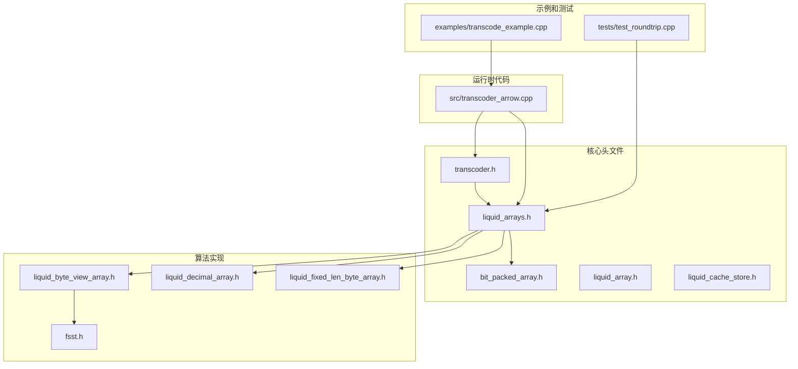
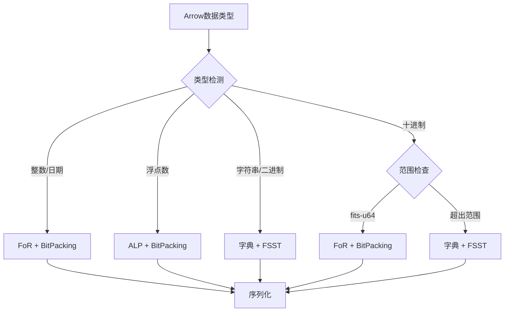
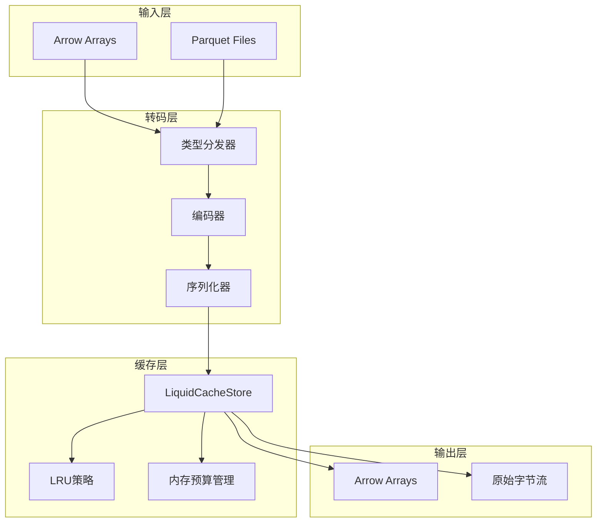
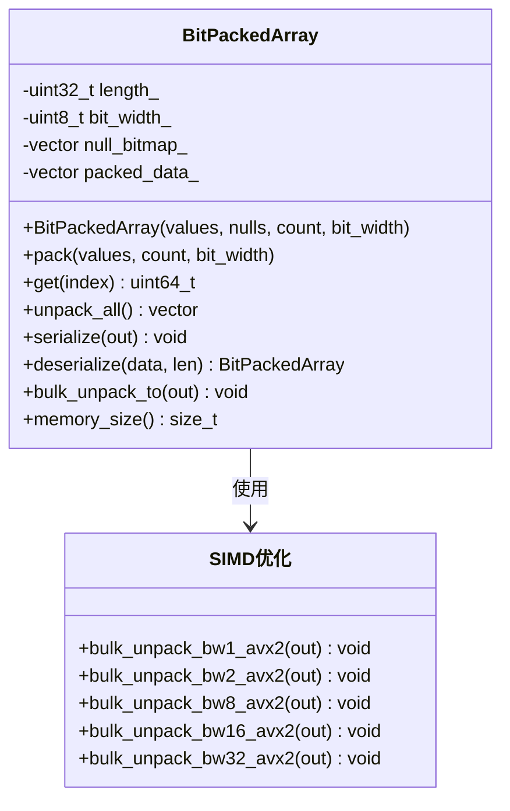
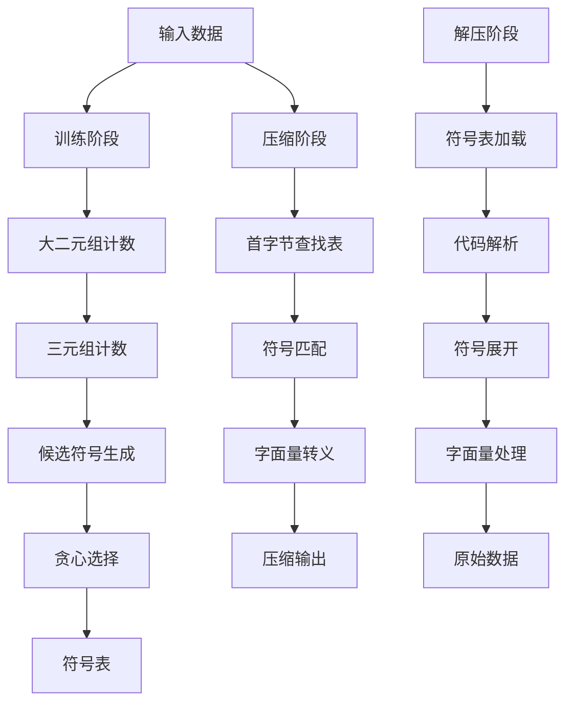
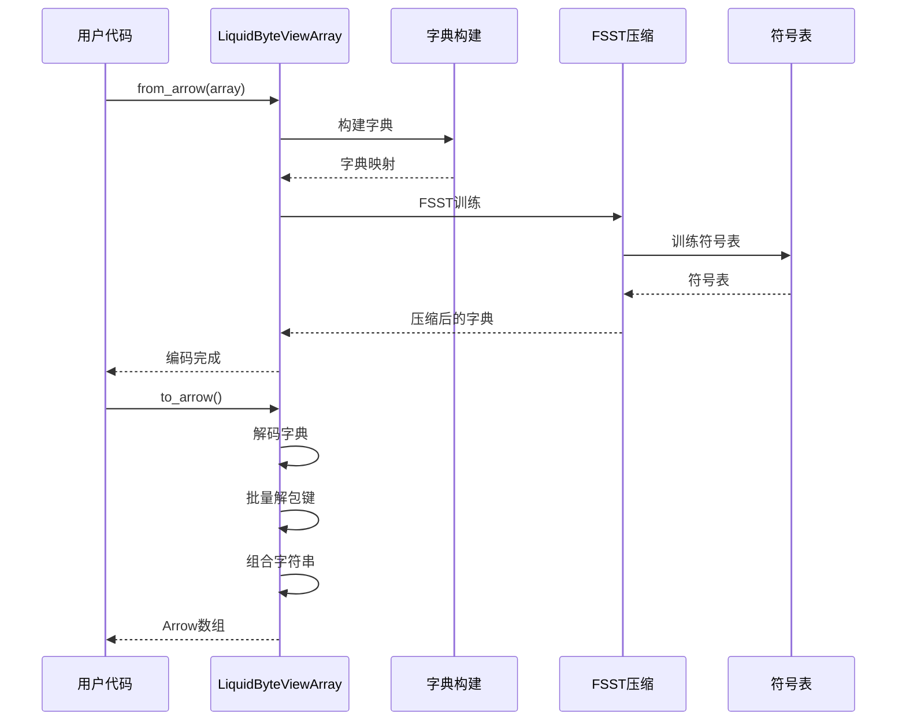
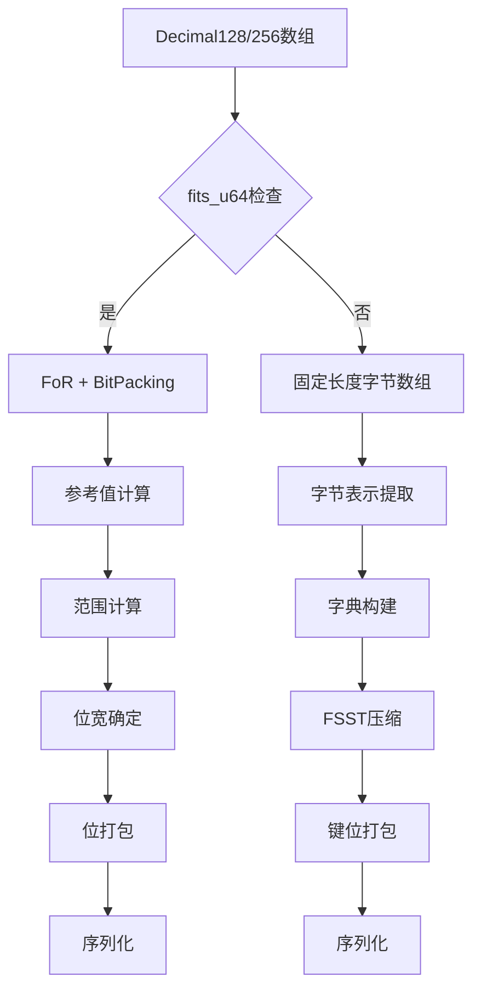
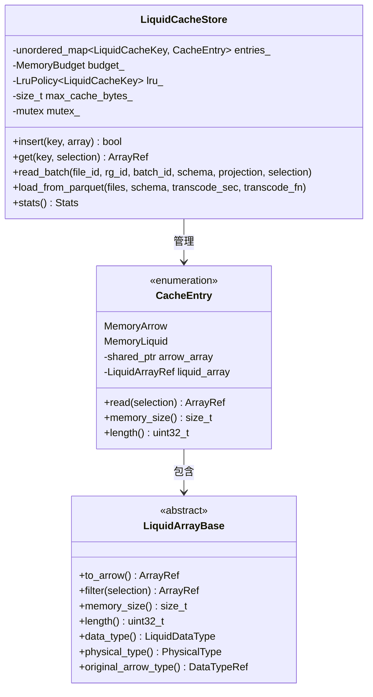
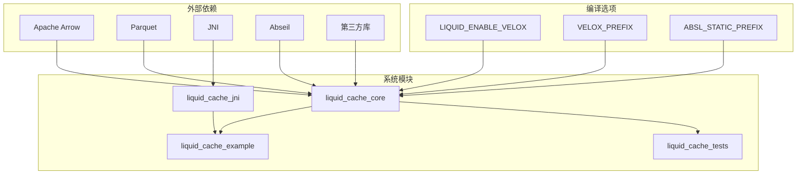

# 数据转码系统

<cite>
**本文档引用的文件**
- [README.md](file://README.md)
- [CMakeLists.txt](file://CMakeLists.txt)
- [transcoder.h](file://include/liquid_cache/transcoder.h)
- [transcoder_arrow.cpp](file://src/transcoder_arrow.cpp)
- [bit_packed_array.h](file://include/liquid_cache/bit_packed_array.h)
- [fsst.h](file://include/liquid_cache/fsst.h)
- [liquid_arrays.h](file://include/liquid_cache/liquid_arrays.h)
- [liquid_byte_view_array.h](file://include/liquid_cache/liquid_byte_view_array.h)
- [liquid_decimal_array.h](file://include/liquid_cache/liquid_decimal_array.h)
- [liquid_fixed_len_byte_array.h](file://include/liquid_cache/liquid_fixed_len_byte_array.h)
- [liquid_array.h](file://include/liquid_cache/liquid_array.h)
- [liquid_cache_store.h](file://include/liquid_cache/liquid_cache_store.h)
- [transcode_example.cpp](file://examples/transcode_example.cpp)
- [test_roundtrip.cpp](file://tests/test_roundtrip.cpp)
</cite>

## 目录
1. [项目概述](#项目概述)
2. [项目结构](#项目结构)
3. [核心组件](#核心组件)
4. [架构概览](#架构概览)
5. [详细组件分析](#详细组件分析)
6. [依赖关系分析](#依赖关系分析)
7. [性能考虑](#性能考虑)
8. [故障排除指南](#故障排除指南)
9. [结论](#结论)
10. [附录](#附录)

## 项目概述

数据转码系统是一个高性能的列式数据压缩和转码框架，专门用于将Apache Arrow格式的数据转换为高效的内部存储格式。该系统支持多种编码算法，包括Frame-of-Reference + BitPacking、自适应无损浮点编码（ALP）以及字典+FSST压缩等，旨在为现代数据分析引擎提供最优的数据存储和访问模式。

系统的核心目标是通过智能的类型分发机制和编码策略选择，实现数据的高效压缩和快速解码，同时保持与Arrow生态系统的完全兼容性。

## 项目结构

**图表来源**
- [transcoder.h](file://include/liquid_cache/transcoder.h)
- [liquid_arrays.h](file://include/liquid_cache/liquid_arrays.h)
- [transcoder_arrow.cpp](file://src/transcoder_arrow.cpp)

**章节来源**
- [CMakeLists.txt](file://CMakeLists.txt)
- [README.md](file://README.md)

## 核心组件

### 类型分发机制

系统采用基于Arrow数据类型的智能分发机制，将不同的数据类型映射到最适合的编码策略：

**图表来源**
- [transcoder_arrow.cpp](file://src/transcoder_arrow.cpp)
- [transcoder.h](file://include/liquid_cache/transcoder.h)

### 编码策略选择

系统实现了多种编码策略以适应不同类型的数据特征：

1. **Frame-of-Reference + BitPacking**: 适用于整数和日期类型，通过参考值减少存储范围
2. **自适应无损浮点编码（ALP）**: 针对浮点数的指数变换编码
3. **字典 + FSST压缩**: 适用于高重复率的字符串和二进制数据
4. **线性整数编码**: 适用于具有线性趋势的数据序列

**章节来源**
- [transcoder.h](file://include/liquid_cache/transcoder.h)
- [transcoder_arrow.cpp](file://src/transcoder_arrow.cpp)
- [liquid_arrays.h](file://include/liquid_cache/liquid_arrays.h)

## 架构概览

**图表来源**
- [liquid_cache_store.h](file://include/liquid_cache/liquid_cache_store.h)
- [liquid_array.h](file://include/liquid_cache/liquid_array.h)
- [transcoder_arrow.cpp](file://src/transcoder_arrow.cpp)

## 详细组件分析

### BitPackedArray组件

BitPackedArray是系统的核心压缩组件，提供了高效的位打包存储机制：

**图表来源**
- [bit_packed_array.h](file://include/liquid_cache/bit_packed_array.h)

#### 性能特性

- **SIMD优化**: 支持AVX2指令集优化，针对常见位宽（1,2,4,8,16,32）进行向量化解包
- **内存对齐**: 8字节对齐确保缓存友好访问
- **零拷贝操作**: 支持批量解包操作避免逐元素访问开销

**章节来源**
- [bit_packed_array.h](file://include/liquid_cache/bit_packed_array.h)

### FSST压缩算法

FSST（Fast Static Symbol Table）提供了高效的字符串压缩能力：

**图表来源**
- [fsst.h](file://include/liquid_cache/fsst.h)

#### 压缩特性

- **训练优化**: 仅对前1MB数据进行采样训练，平衡压缩质量和性能
- **符号表格式**: 与Rust版本完全兼容的二进制格式
- **快速查找**: 首字节索引表实现O(1)候选符号缩小

**章节来源**
- [fsst.h](file://include/liquid_cache/fsst.h)

### 字符串视图数组

字典+FSST压缩的字符串数组实现了高效的文本数据存储：

**图表来源**
- [liquid_byte_view_array.h](file://include/liquid_cache/liquid_byte_view_array.h)

**章节来源**
- [liquid_byte_view_array.h](file://include/liquid_cache/liquid_byte_view_array.h)

### 十进制数组编码

系统支持两种十进制数组编码路径：

1. **fits-u64路径**: 当所有值都能装入uint64时使用FoR+BitPacking
2. **固定长度字节数组路径**: 对于超出范围的值使用字典+FSST压缩

**图表来源**
- [liquid_decimal_array.h](file://include/liquid_cache/liquid_decimal_array.h)
- [liquid_fixed_len_byte_array.h](file://include/liquid_cache/liquid_fixed_len_byte_array.h)

**章节来源**
- [liquid_decimal_array.h](file://include/liquid_cache/liquid_decimal_array.h)
- [liquid_fixed_len_byte_array.h](file://include/liquid_cache/liquid_fixed_len_byte_array.h)

### 缓存存储系统

LiquidCacheStore提供了高性能的列式缓存存储：

**图表来源**
- [liquid_cache_store.h](file://include/liquid_cache/liquid_cache_store.h)
- [liquid_array.h](file://include/liquid_cache/liquid_array.h)

**章节来源**
- [liquid_cache_store.h](file://include/liquid_cache/liquid_cache_store.h)
- [liquid_array.h](file://include/liquid_cache/liquid_array.h)

## 依赖关系分析

**图表来源**
- [CMakeLists.txt](file://CMakeLists.txt)

**章节来源**
- [CMakeLists.txt](file://CMakeLists.txt)

## 性能考虑

### 编码算法性能对比

| 数据类型 | 编码算法 | 压缩率 | 解码速度 | 内存占用 | 适用场景 |
|---------|---------|--------|----------|----------|----------|
| 整数/日期 | FoR + BitPacking | 高 | 极快 | 低 | 连续数值、时间序列 |
| 浮点数 | ALP + BitPacking | 中等 | 快速 | 中等 | 科学计算、金融数据 |
| 字符串 | 字典 + FSST | 很高 | 快速 | 低 | 文本数据、日志 |
| 十进制 | FoR + BitPacking | 高 | 快速 | 低 | 财务数据、度量衡 |

### 性能优化策略

1. **SIMD指令优化**: BitPackedArray针对常见位宽进行AVX2向量化
2. **内存对齐**: 8字节对齐确保缓存行效率
3. **零拷贝设计**: 避免不必要的数据复制
4. **批量操作**: 支持批量解包和过滤操作
5. **LRU缓存**: 智能内存管理减少磁盘I/O

## 故障排除指南

### 常见问题诊断

1. **转码失败**: 检查Arrow数据类型是否受支持
2. **内存不足**: 调整缓存预算设置
3. **解码错误**: 验证序列化格式兼容性
4. **性能问题**: 分析编码策略选择是否合适

### 调试工具

系统提供了完整的单元测试套件，覆盖所有主要功能：

- **roundtrip测试**: 验证编码解码正确性
- **边界条件测试**: 处理空数组、全空值等特殊情况
- **压缩率测试**: 验证存储效率
- **性能基准测试**: 提供性能对比数据

**章节来源**
- [test_roundtrip.cpp](file://tests/test_roundtrip.cpp)

## 结论

数据转码系统通过精心设计的编码策略和优化算法，为现代数据分析应用提供了高效的数据存储和访问解决方案。系统的主要优势包括：

1. **多算法融合**: 支持多种编码算法以适应不同类型的数据
2. **高性能设计**: 通过SIMD优化和内存对齐实现极致性能
3. **完整生态**: 与Arrow和Parquet生态系统完全兼容
4. **可扩展性**: 模块化设计便于添加新的编码算法
5. **生产就绪**: 经过充分测试验证，适合生产环境使用

## 附录

### 编码选择最佳实践

1. **整数和日期数据**: 优先选择FoR + BitPacking
2. **浮点数据**: 使用ALP编码，自动搜索最优参数
3. **字符串数据**: 当重复率>30%时使用字典+FSST
4. **高精度十进制**: fits-u64时用FoR+BitPacking，否则用字典+FSST
5. **混合数据集**: 根据各列特征选择最优编码策略

### 构建和部署

系统支持多种构建配置，可根据需求选择：

- **静态链接**: 适合生产环境部署
- **动态链接**: 适合开发和测试环境
- **Velox集成**: 可选的Facebook Velox向量引擎集成
- **JNI桥接**: 支持Java虚拟机环境