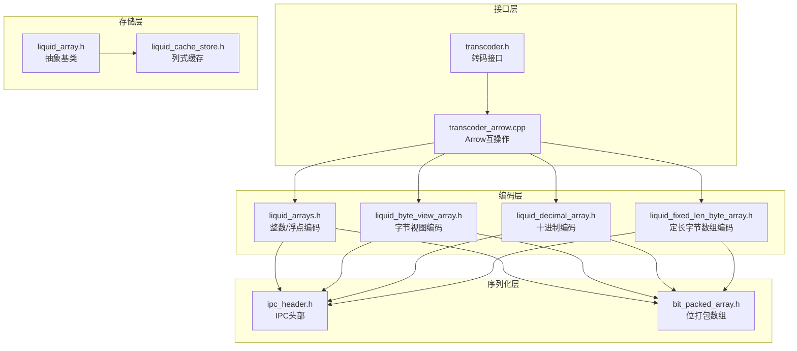
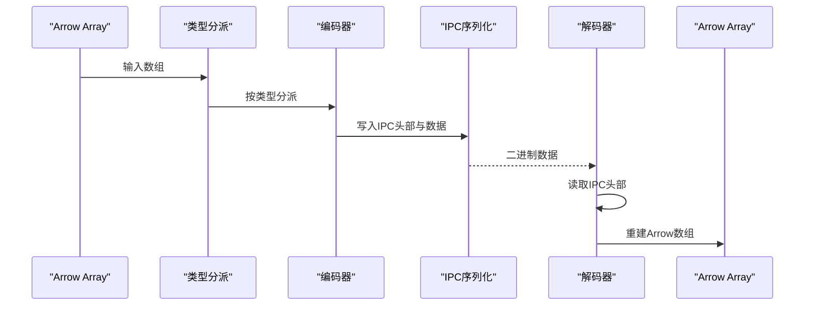
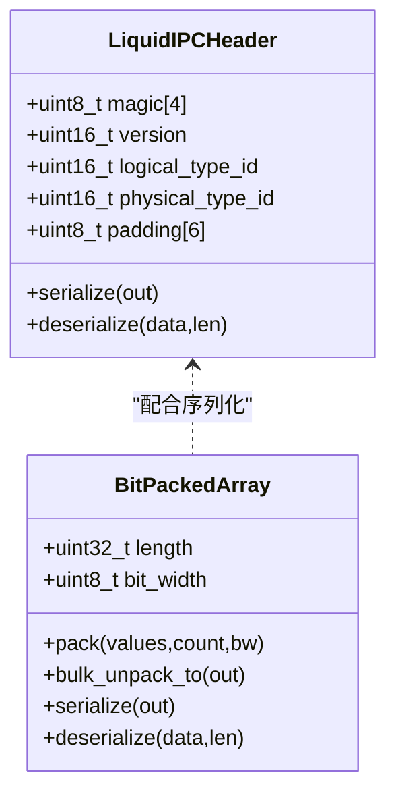
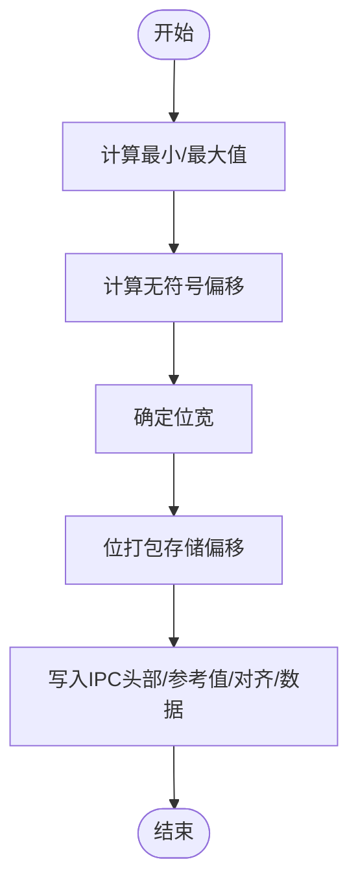
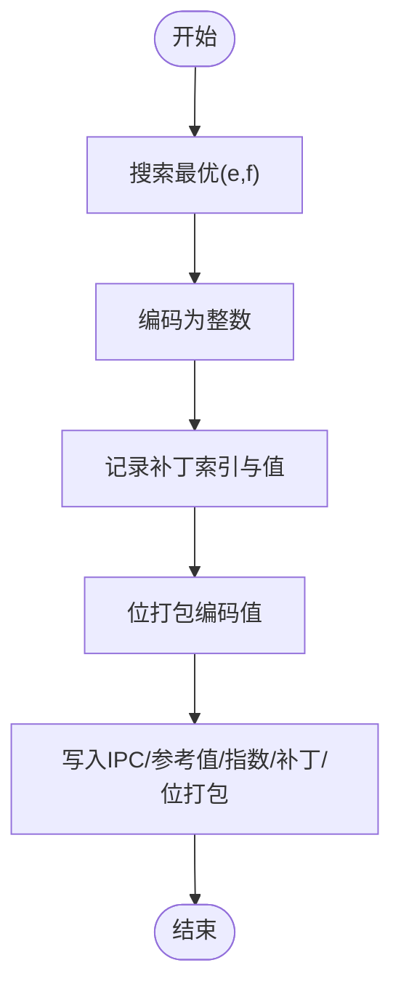
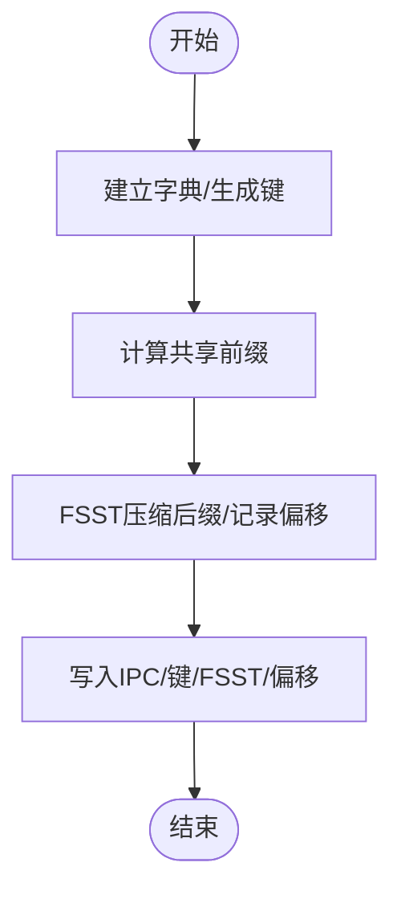
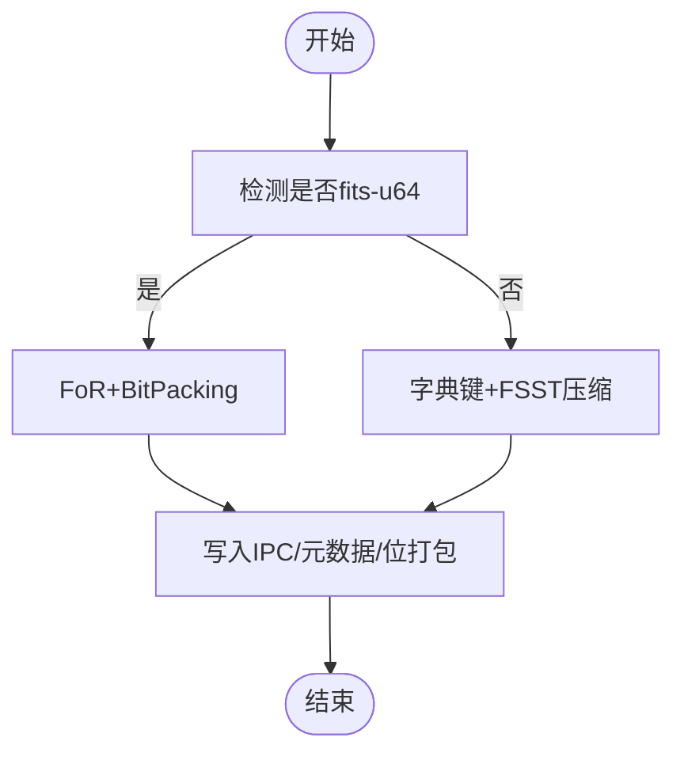
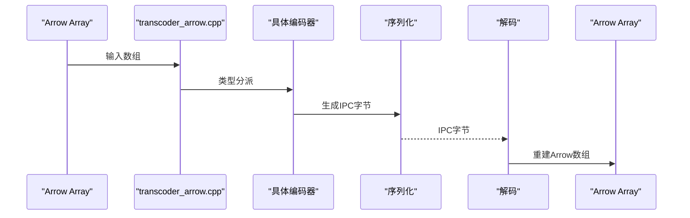
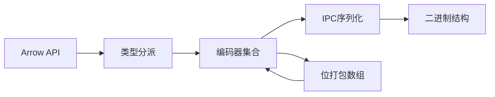

# 格式转换机制

<cite>
**本文档引用的文件**
- [README.md](file://README.md)
- [transcoder.h](file://include/liquid_cache/transcoder.h)
- [transcoder_arrow.cpp](file://src/transcoder_arrow.cpp)
- [ipc_header.h](file://include/liquid_cache/ipc_header.h)
- [liquid_arrays.h](file://include/liquid_cache/liquid_arrays.h)
- [liquid_byte_view_array.h](file://include/liquid_cache/liquid_byte_view_array.h)
- [liquid_decimal_array.h](file://include/liquid_cache/liquid_decimal_array.h)
- [liquid_fixed_len_byte_array.h](file://include/liquid_cache/liquid_fixed_len_byte_array.h)
- [bit_packed_array.h](file://include/liquid_cache/bit_packed_array.h)
- [liquid_array.h](file://include/liquid_cache/liquid_array.h)
- [liquid_cache_store.h](file://include/liquid_cache/liquid_cache_store.h)
- [transcode_example.cpp](file://examples/transcode_example.cpp)
- [test_roundtrip.cpp](file://tests/test_roundtrip.cpp)
- [test_velox_crossval.cpp](file://tests/test_velox_crossval.cpp)
</cite>

## 目录
1. [简介](#简介)
2. [项目结构](#项目结构)
3. [核心组件](#核心组件)
4. [架构总览](#架构总览)
5. [详细组件分析](#详细组件分析)
6. [依赖关系分析](#依赖关系分析)
7. [性能考量](#性能考量)
8. [故障排查指南](#故障排查指南)
9. [结论](#结论)
10. [附录](#附录)

## 简介
本文件系统性阐述 Arrow 格式到 Liquid Cache 格式的转换机制，重点覆盖：
- 数据布局变化与内存组织方式
- 访问模式差异与零拷贝实现
- IPC 头部结构与序列化格式
- 变长数据与嵌套结构的处理策略
- 转换前后数据结构对比与内存使用分析
- 典型转换示例与性能测试方法

该机制以 Arrow 为输入，输出二进制兼容的 Liquid IPC 格式，支持多种数据类型的高效压缩与快速解码，并提供零拷贝的 Arrow/Velox 直通路径。

## 项目结构
仓库采用模块化设计，围绕“转码接口 + 编码数组实现 + IPC 序列化 + 缓存存储”展开：
- 接口层：转码主接口与 Arrow 互操作封装
- 编码层：针对整数、浮点、字符串/二进制、十进制等类型的专用编码器
- 序列化层：统一的 IPC 头部与位打包数组
- 存储层：列式缓存与 LRU 预算控制

**图表来源**
- [transcoder.h:1-360](file://include/liquid_cache/transcoder.h#L1-L360)
- [transcoder_arrow.cpp:1-746](file://src/transcoder_arrow.cpp#L1-L746)
- [liquid_arrays.h:1-1221](file://include/liquid_cache/liquid_arrays.h#L1-L1221)
- [liquid_byte_view_array.h:1-670](file://include/liquid_cache/liquid_byte_view_array.h#L1-L670)
- [liquid_decimal_array.h:1-404](file://include/liquid_cache/liquid_decimal_array.h#L1-L404)
- [liquid_fixed_len_byte_array.h:1-531](file://include/liquid_cache/liquid_fixed_len_byte_array.h#L1-L531)
- [ipc_header.h:1-118](file://include/liquid_cache/ipc_header.h#L1-L118)
- [bit_packed_array.h:1-486](file://include/liquid_cache/bit_packed_array.h#L1-L486)
- [liquid_array.h:1-159](file://include/liquid_cache/liquid_array.h#L1-L159)
- [liquid_cache_store.h:1-527](file://include/liquid_cache/liquid_cache_store.h#L1-L527)

**章节来源**
- [README.md:1-378](file://README.md#L1-L378)

## 核心组件
- 转码接口与 Arrow 互操作
  - 提供独立于 Arrow 的裸缓冲区转码函数，便于 JNI/Velox 调用
  - 提供基于 Arrow Array 的转码入口，完成类型分派与序列化
- 编码数组实现
  - 整数/日期：帧参考 + 位打包（FoR + BitPacking）
  - 浮点：自适应无损浮点编码（ALP）+ 位打包
  - 字符串/二进制：字典 + FSST 压缩（ByteViewArray）
  - 十进制：fits-u64 路径（FoR + BitPacking）或定长字节数组 + FSST
- IPC 与位打包
  - 统一的 16 字节 IPC 头部，携带逻辑类型与物理类型
  - 位打包数组支持批量解包与 SIMD 优化
- 缓存存储
  - 列式缓存，支持投影、过滤与零序列化读取

**章节来源**
- [transcoder.h:1-360](file://include/liquid_cache/transcoder.h#L1-L360)
- [transcoder_arrow.cpp:1-746](file://src/transcoder_arrow.cpp#L1-L746)
- [liquid_arrays.h:1-1221](file://include/liquid_cache/liquid_arrays.h#L1-L1221)
- [liquid_byte_view_array.h:1-670](file://include/liquid_cache/liquid_byte_view_array.h#L1-L670)
- [liquid_decimal_array.h:1-404](file://include/liquid_cache/liquid_decimal_array.h#L1-L404)
- [liquid_fixed_len_byte_array.h:1-531](file://include/liquid_cache/liquid_fixed_len_byte_array.h#L1-L531)
- [ipc_header.h:1-118](file://include/liquid_cache/ipc_header.h#L1-L118)
- [bit_packed_array.h:1-486](file://include/liquid_cache/bit_packed_array.h#L1-L486)
- [liquid_cache_store.h:1-527](file://include/liquid_cache/liquid_cache_store.h#L1-L527)

## 架构总览
Arrow 输入经由类型分派进入对应编码器，编码器内部完成压缩与 IPC 序列化，最终形成二进制兼容的 Liquid 结构。解码阶段按 IPC 头部识别类型并反序列化，再重建 Arrow 数组。

**图表来源**
- [transcoder_arrow.cpp:44-351](file://src/transcoder_arrow.cpp#L44-L351)
- [ipc_header.h:46-106](file://include/liquid_cache/ipc_header.h#L46-L106)
- [liquid_arrays.h:221-238](file://include/liquid_cache/liquid_arrays.h#L221-L238)

## 详细组件分析

### IPC 头部与序列化格式
- IPC 头部（16 字节）包含魔数、版本、逻辑类型、物理类型与填充域，保证跨语言/跨平台二进制兼容
- 所有编码器遵循统一的序列化布局：IPC 头部 + 元数据 + 对齐填充 + 数据体
- 位打包数组采用 16 字节头 + 可选空值位图 + 8 字节对齐的数据块

**图表来源**
- [ipc_header.h:46-106](file://include/liquid_cache/ipc_header.h#L46-L106)
- [bit_packed_array.h:29-195](file://include/liquid_cache/bit_packed_array.h#L29-L195)

**章节来源**
- [ipc_header.h:1-118](file://include/liquid_cache/ipc_header.h#L1-L118)
- [bit_packed_array.h:1-486](file://include/liquid_cache/bit_packed_array.h#L1-L486)

### 整数/日期类型：帧参考 + 位打包
- 编码流程
  - 计算最小/最大值作为帧参考
  - 计算无符号偏移并确定位宽
  - 使用位打包数组存储偏移
  - 写入 IPC 头部、参考值、对齐填充与位打包数据
- 解码流程
  - 读取 IPC 头部与参考值
  - 批量解包位打包数据并加回参考值
  - 重建 Arrow 数组（零拷贝：直接构造 ArrayData）

**图表来源**
- [transcoder.h:78-156](file://include/liquid_cache/transcoder.h#L78-L156)
- [liquid_arrays.h:111-164](file://include/liquid_cache/liquid_arrays.h#L111-L164)

**章节来源**
- [transcoder.h:78-156](file://include/liquid_cache/transcoder.h#L78-L156)
- [liquid_arrays.h:81-248](file://include/liquid_cache/liquid_arrays.h#L81-L248)

### 浮点类型：ALP + 位打包
- 编码流程
  - 通过指数搜索寻找最优 (e,f) 参数
  - 对每个值进行编码并记录解码误差位置（补丁）
  - 使用位打包存储编码后的整数值
  - 写入 IPC 头部、参考值、指数、补丁列表与位打包数据
- 解码流程
  - 读取 IPC 头部、指数与补丁
  - 批量解包后按公式解码，再应用补丁修正

**图表来源**
- [transcoder.h:158-342](file://include/liquid_cache/transcoder.h#L158-L342)
- [liquid_arrays.h:704-840](file://include/liquid_cache/liquid_arrays.h#L704-L840)

**章节来源**
- [transcoder.h:158-342](file://include/liquid_cache/transcoder.h#L158-L342)
- [liquid_arrays.h:576-894](file://include/liquid_cache/liquid_arrays.h#L576-L894)

### 字符串/二进制：字典 + FSST
- 编码流程
  - 建立字典并生成键（BitPackedArray）
  - 计算共享前缀，对后缀进行 FSST 压缩并记录偏移
  - 写入 IPC 头部（物理类型区分字符串/二进制）、字典键、FSST 数据与偏移
- 解码流程
  - 读取 IPC 头部与各段数据
  - 通过缓存的解压字典与偏移表，零拷贝拼接出最终字符串/二进制

**图表来源**
- [liquid_byte_view_array.h:208-353](file://include/liquid_cache/liquid_byte_view_array.h#L208-L353)
- [liquid_byte_view_array.h:413-478](file://include/liquid_cache/liquid_byte_view_array.h#L413-L478)

**章节来源**
- [liquid_byte_view_array.h:1-670](file://include/liquid_cache/liquid_byte_view_array.h#L1-L670)

### 十进制：fits-u64 或 FSST 字典
- fits-u64 路径
  - 若值范围可放入 u64，则采用 FoR + BitPacking
- 大值路径
  - 采用定长字节数组编码（Decimal128/256 的字节表示）
  - 字典键 + FSST 压缩字节数组，提升稀疏大值场景压缩率

**图表来源**
- [liquid_decimal_array.h:106-237](file://include/liquid_cache/liquid_decimal_array.h#L106-L237)
- [liquid_fixed_len_byte_array.h:116-145](file://include/liquid_cache/liquid_fixed_len_byte_array.h#L116-L145)

**章节来源**
- [liquid_decimal_array.h:1-404](file://include/liquid_cache/liquid_decimal_array.h#L1-L404)
- [liquid_fixed_len_byte_array.h:1-531](file://include/liquid_cache/liquid_fixed_len_byte_array.h#L1-L531)

### Arrow → Liquid → Arrow 转换流程
- 类型分派：根据 Arrow type_id 选择对应编码器
- 编码：生成 IPC 兼容的字节序列
- 解码：按 IPC 头部识别类型并重建 Arrow 数组
- 零拷贝：位打包数组与 Arrow Buffer 的直接映射减少复制

**图表来源**
- [transcoder_arrow.cpp:44-351](file://src/transcoder_arrow.cpp#L44-L351)
- [transcoder_arrow.cpp:371-477](file://src/transcoder_arrow.cpp#L371-L477)

**章节来源**
- [transcoder_arrow.cpp:1-746](file://src/transcoder_arrow.cpp#L1-L746)

### 零拷贝转换与性能优势
- 位打包数组支持批量解包与 SIMD 优化，显著降低解码成本
- Arrow Buffer 直接映射避免中间拷贝
- 缓存存储采用列式布局与 LRU 预算控制，减少内存占用与提升命中率

**章节来源**
- [bit_packed_array.h:242-272](file://include/liquid_cache/bit_packed_array.h#L242-L272)
- [liquid_cache_store.h:175-274](file://include/liquid_cache/liquid_cache_store.h#L175-L274)

### 变长数据与嵌套结构处理
- 变长数据（字符串/二进制）通过字典键 + FSST 压缩，结合共享前缀进一步压缩
- 嵌套结构（如字典类型）在 Arrow 层先进行类型转换（Cast）再编码，确保编码器输入的一致性

**章节来源**
- [transcoder_arrow.cpp:267-296](file://src/transcoder_arrow.cpp#L267-L296)
- [transcoder_arrow.cpp:231-265](file://src/transcoder_arrow.cpp#L231-L265)

### 转换前后数据结构对比与内存使用分析
- Arrow 原始布局：每列包含值缓冲区、空值位图与偏移缓冲区（字符串/二进制）
- Liquid 压缩布局：IPC 头部 + 元数据 + 对齐填充 + 压缩数据（位打包/字典/FSST）
- 内存节省：顺序整数/日期等具有较小位宽；重复字符串通过字典+FSST 显著压缩

**章节来源**
- [test_roundtrip.cpp:496-521](file://tests/test_roundtrip.cpp#L496-L521)

## 依赖关系分析
- 类型依赖
  - Arrow 类型 → 编码器模板实例 → IPC 序列化
  - 位打包数组为多编码器共享的基础组件
- 外部依赖
  - Arrow C++ API 用于数组访问与计算
  - 可选 Velox 集成用于向量直通

**图表来源**
- [transcoder_arrow.cpp:44-351](file://src/transcoder_arrow.cpp#L44-L351)
- [liquid_arrays.h:1-1221](file://include/liquid_cache/liquid_arrays.h#L1-L1221)
- [bit_packed_array.h:1-486](file://include/liquid_cache/bit_packed_array.h#L1-L486)

**章节来源**
- [transcoder_arrow.cpp:1-746](file://src/transcoder_arrow.cpp#L1-L746)
- [liquid_arrays.h:1-1221](file://include/liquid_cache/liquid_arrays.h#L1-L1221)

## 性能考量
- 编码阶段
  - FoR + BitPacking 在顺序/近似线性数据上效果显著
  - ALP 指数搜索带来额外开销，建议在大数组上采样搜索
  - 字符串/二进制通过字典+FSST 在高重复度场景收益明显
- 解码阶段
  - 批量解包 + SIMD 优化降低 CPU 开销
  - 零拷贝避免内存复制，提升吞吐
- 缓存层面
  - 列式布局与投影过滤减少不必要的解码
  - LRU 预算控制避免内存膨胀

[本节为通用指导，无需列出具体文件来源]

## 故障排查指南
- IPC 校验失败
  - 检查魔数与版本匹配，确认序列化/反序列化端一致
- 缓冲区不足
  - 反序列化时检查长度与对齐要求
- 类型不匹配
  - 确认 Arrow 类型与 IPC 物理类型映射正确
- 性能异常
  - 检查位宽是否过大、字典是否有效、FSST 训练数据是否充分

**章节来源**
- [ipc_header.h:86-105](file://include/liquid_cache/ipc_header.h#L86-L105)
- [bit_packed_array.h:197-233](file://include/liquid_cache/bit_packed_array.h#L197-L233)

## 结论
该格式转换机制通过统一的 IPC 头部与多种压缩策略，实现了 Arrow 到 Liquid 的高效转换与解码。FoR + BitPacking、ALP + BitPacking、字典 + FSST 等技术在不同数据类型上发挥各自优势，配合零拷贝与列式缓存，显著提升了存储密度与查询性能。测试用例覆盖了主要数据类型的往返正确性与压缩效果，验证了方案的可行性与稳定性。

[本节为总结性内容，无需列出具体文件来源]

## 附录

### 转换示例与基准测试
- 示例程序展示了从 Parquet 加载、转码到缓存、再到基准对比的完整流程
- 基准测试覆盖单列/多列/全表扫描等典型场景，输出平均耗时、加速比与吞吐

**章节来源**
- [transcode_example.cpp:1-550](file://examples/transcode_example.cpp#L1-L550)
- [README.md:232-310](file://README.md#L232-L310)

### 跨引擎一致性验证
- 针对 Velox 的交叉验证确保 Arrow → Liquid → Velox 的值一致性
- 覆盖整数、浮点、字符串/二进制、十进制等类型

**章节来源**
- [test_velox_crossval.cpp:1-430](file://tests/test_velox_crossval.cpp#L1-L430)