# 类型分发系统

<cite>
**本文档引用的文件**
- [transcoder.h](file://include/liquid_cache/transcoder.h)
- [transcoder_arrow.cpp](file://src/transcoder_arrow.cpp)
- [liquid_arrays.h](file://include/liquid_cache/liquid_arrays.h)
- [liquid_byte_view_array.h](file://include/liquid_cache/liquid_byte_view_array.h)
- [liquid_decimal_array.h](file://include/liquid_cache/liquid_decimal_array.h)
- [liquid_fixed_len_byte_array.h](file://include/liquid_cache/liquid_fixed_len_byte_array.h)
- [ipc_header.h](file://include/liquid_cache/ipc_header.h)
- [liquid_to_velox.h](file://include/liquid_cache/liquid_to_velox.h)
- [liquid_to_velox.cpp](file://src/liquid_to_velox.cpp)
- [transcode_example.cpp](file://examples/transcode_example.cpp)
- [test_roundtrip.cpp](file://tests/test_roundtrip.cpp)
</cite>

## 目录
1. [简介](#简介)
2. [项目结构](#项目结构)
3. [核心组件](#核心组件)
4. [架构概览](#架构概览)
5. [详细组件分析](#详细组件分析)
6. [依赖分析](#依赖分析)
7. [性能考虑](#性能考虑)
8. [故障排除指南](#故障排除指南)
9. [结论](#结论)

## 简介

类型分发系统是 Liquid Cache C++ 实现的核心组件，负责将 Arrow 类型系统无缝映射到内部物理类型表示。该系统实现了完整的类型转换管道，从 Arrow 类型到 Liquid 编码格式，再到最终的物理存储格式。

系统采用多层分发机制：
- **编译时模板特化**：针对具体 Arrow 类型进行优化
- **运行时类型检查**：通过 Arrow 类型 ID 进行动态分发
- **模板特化**：为不同物理类型提供专门的编码器

## 项目结构

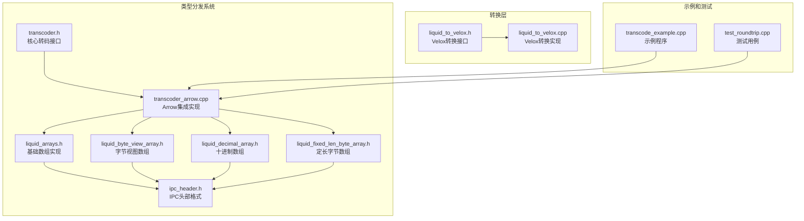

**图表来源**
- [transcoder.h:1-360](file://include/liquid_cache/transcoder.h#L1-L360)
- [transcoder_arrow.cpp:1-746](file://src/transcoder_arrow.cpp#L1-L746)
- [liquid_arrays.h:1-800](file://include/liquid_cache/liquid_arrays.h#L1-L800)

**章节来源**
- [transcoder.h:1-360](file://include/liquid_cache/transcoder.h#L1-L360)
- [transcoder_arrow.cpp:1-746](file://src/transcoder_arrow.cpp#L1-L746)

## 核心组件

### 类型映射系统

系统实现了从 Arrow 类型到内部物理类型的完整映射：

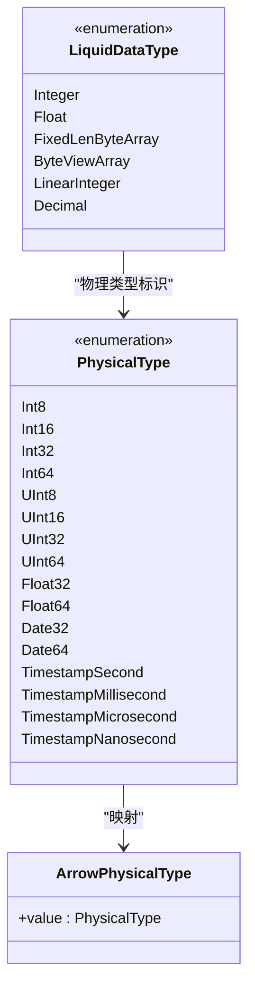

**图表来源**
- [ipc_header.h:27-44](file://include/liquid_cache/ipc_header.h#L27-L44)
- [liquid_arrays.h:66-79](file://include/liquid_cache/liquid_arrays.h#L66-L79)

### 转码接口设计

系统提供了双层转码接口：

1. **原始缓冲区接口**：适用于 JNI 和 Velox 集成
2. **Arrow 接口**：面向 Arrow 生态系统

**章节来源**
- [transcoder.h:35-360](file://include/liquid_cache/transcoder.h#L35-L360)

## 架构概览

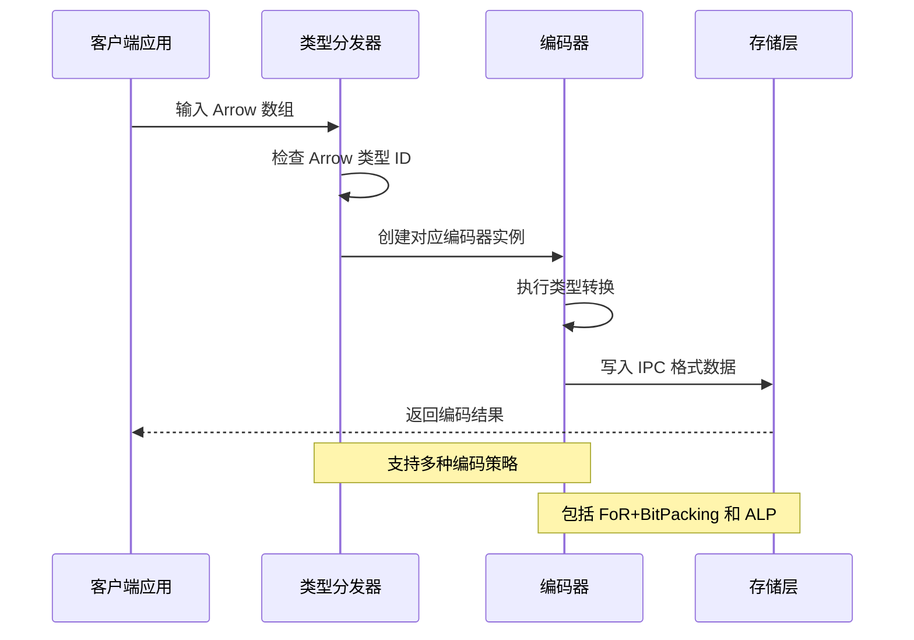

**图表来源**
- [transcoder_arrow.cpp:44-351](file://src/transcoder_arrow.cpp#L44-L351)
- [transcoder.h:352-358](file://include/liquid_cache/transcoder.h#L352-L358)

## 详细组件分析

### Arrow 类型到物理类型的映射

系统实现了精确的类型映射关系：

| Arrow 类型 | 物理类型 | 编码策略 | 特殊处理 |
|------------|----------|----------|----------|
| INT8/16/32/64 | Int8/16/32/64 | FoR + BitPacking | 标准整数编码 |
| UINT8/16/32/64 | UInt8/16/32/64 | FoR + BitPacking | 无符号整数编码 |
| FLOAT/DOUBLE | Float32/Float64 | ALP + BitPacking | 浮点数自适应编码 |
| DATE32/DATE64 | Date32/Date64 | FoR + BitPacking | 日期特殊处理 |
| TIMESTAMP | TimestampSecond/Millisecond/Microsecond/Nanosecond | FoR + BitPacking | 时间戳单位转换 |

**章节来源**
- [transcoder.h:41-58](file://include/liquid_cache/transcoder.h#L41-L58)
- [transcoder_arrow.cpp:152-192](file://src/transcoder_arrow.cpp#L152-L192)

### 类型分发机制实现

系统采用多层分发策略：

#### 1. 编译时模板特化

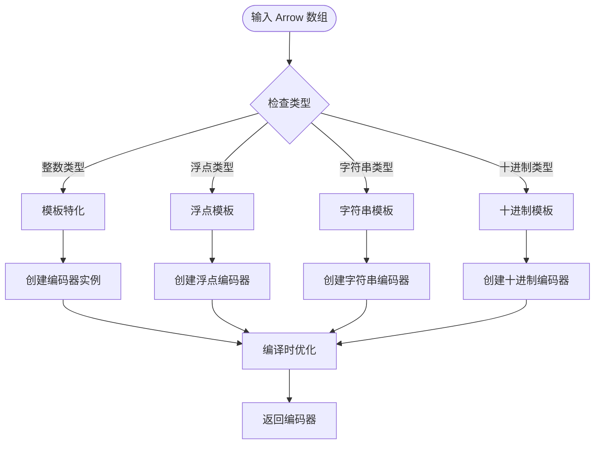

**图表来源**
- [liquid_arrays.h:95-165](file://include/liquid_cache/liquid_arrays.h#L95-L165)
- [transcoder_arrow.cpp:44-351](file://src/transcoder_arrow.cpp#L44-L351)

#### 2. 运行时类型检查

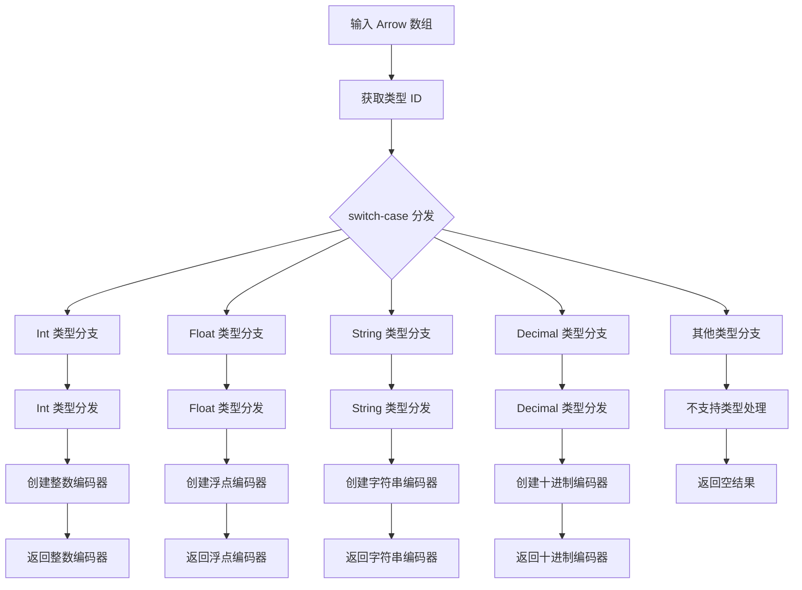

**图表来源**
- [transcoder_arrow.cpp:44-351](file://src/transcoder_arrow.cpp#L44-L351)

**章节来源**
- [transcoder_arrow.cpp:44-351](file://src/transcoder_arrow.cpp#L44-L351)

### 复杂类型转换场景处理

#### 时间戳转换

系统对时间戳进行了特殊的处理策略：

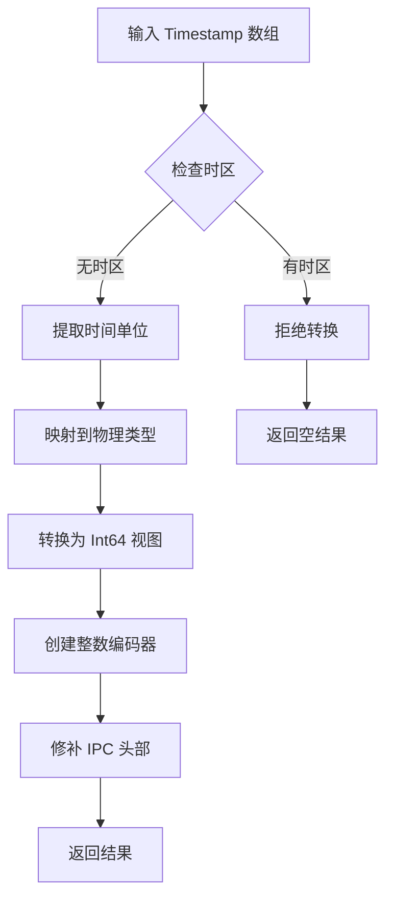

**图表来源**
- [transcoder_arrow.cpp:152-192](file://src/transcoder_arrow.cpp#L152-L192)

#### 字典类型解码

系统支持字典类型的解码处理：

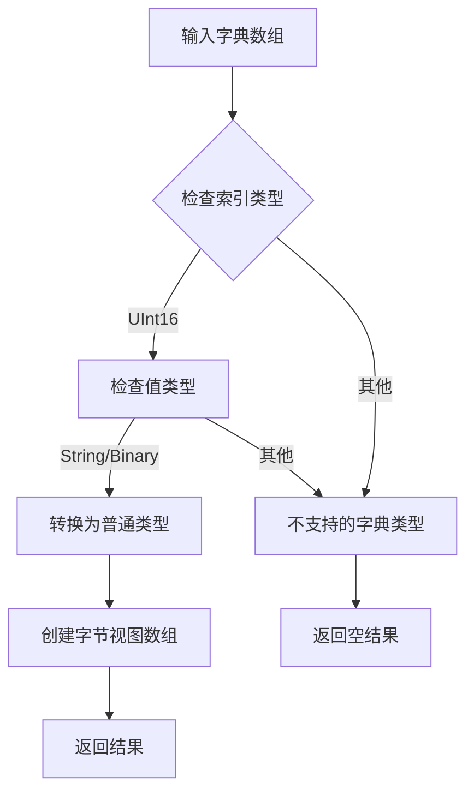

**图表来源**
- [transcoder_arrow.cpp:267-296](file://src/transcoder_arrow.cpp#L267-L296)

#### 字符串视图处理

系统对字符串视图类型提供了专门的处理逻辑：

**章节来源**
- [transcoder_arrow.cpp:231-265](file://src/transcoder_arrow.cpp#L231-L265)

### 编码器实现细节

#### 整数数组编码器

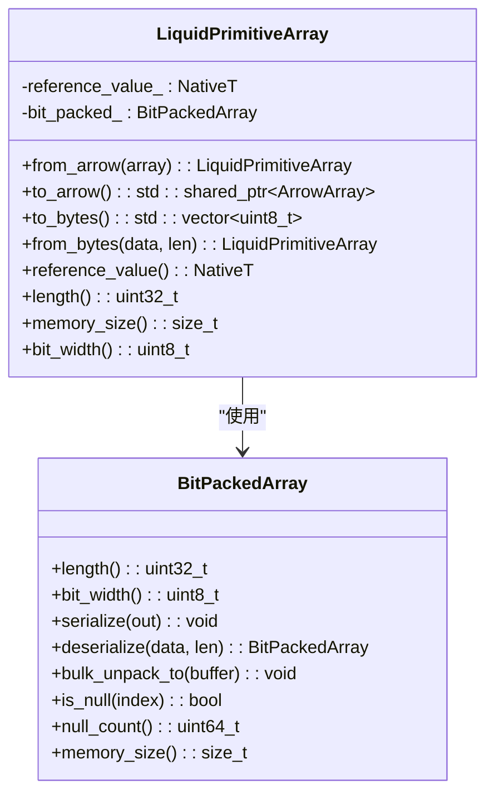

**图表来源**
- [liquid_arrays.h:95-248](file://include/liquid_cache/liquid_arrays.h#L95-L248)

#### 浮点数组编码器

系统实现了 ALP (Adaptive Lossless Floating-Point) 编码：

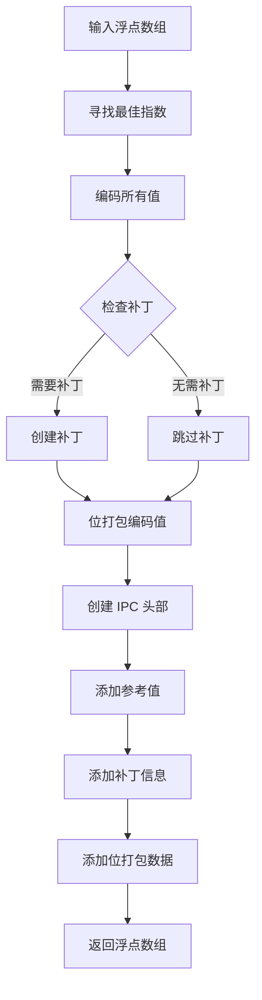

**图表来源**
- [liquid_arrays.h:678-800](file://include/liquid_cache/liquid_arrays.h#L678-L800)

**章节来源**
- [liquid_arrays.h:576-800](file://include/liquid_cache/liquid_arrays.h#L576-L800)

### 解码器实现

系统提供了完整的解码功能，支持从 IPC 格式恢复到 Arrow 类型：

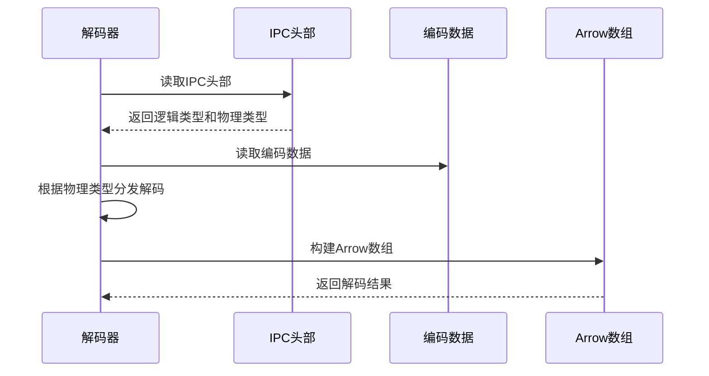

**图表来源**
- [transcoder_arrow.cpp:378-477](file://src/transcoder_arrow.cpp#L378-L477)

**章节来源**
- [transcoder_arrow.cpp:378-477](file://src/transcoder_arrow.cpp#L378-L477)

## 依赖分析

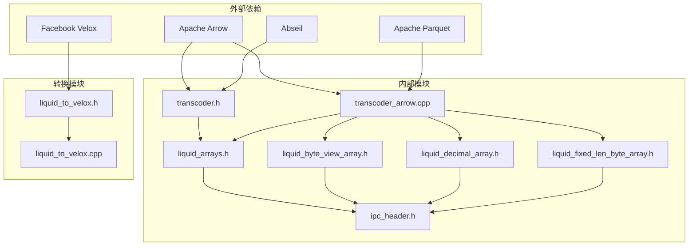

**图表来源**
- [transcoder.h:1-360](file://include/liquid_cache/transcoder.h#L1-L360)
- [transcoder_arrow.cpp:1-27](file://src/transcoder_arrow.cpp#L1-L27)

**章节来源**
- [transcoder.h:1-360](file://include/liquid_cache/transcoder.h#L1-L360)
- [transcoder_arrow.cpp:1-27](file://src/transcoder_arrow.cpp#L1-L27)

## 性能考虑

### 编码效率优化

1. **批量解码**：所有数组都支持批量解码操作，避免逐元素处理
2. **内存对齐**：所有 IPC 数据都按照 8 字节边界对齐
3. **零拷贝操作**：尽可能使用零拷贝的数据传输

### 内存使用优化

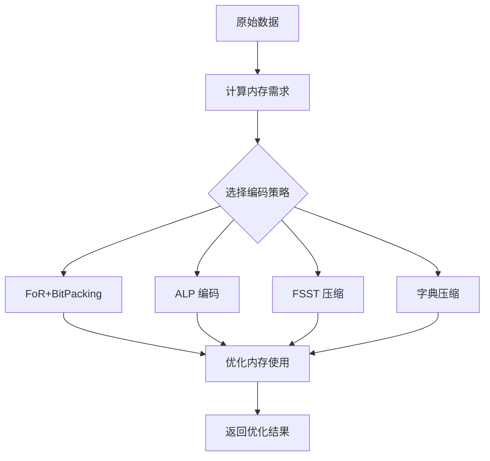

### 并发处理

系统支持多线程环境下的类型分发，通过以下机制保证线程安全：
- 使用智能指针管理资源生命周期
- 避免共享可变状态
- 提供线程安全的缓存机制

## 故障排除指南

### 常见错误类型

1. **类型不支持错误**：当遇到不支持的 Arrow 类型时，系统会返回空结果
2. **内存不足错误**：在编码过程中如果内存不足，会抛出异常
3. **数据格式错误**：当 IPC 数据格式不正确时，解码会失败

### 调试技巧

1. **启用详细日志**：通过检查 Arrow 类型 ID 和物理类型映射
2. **验证编码结果**：使用单元测试验证编码和解码的正确性
3. **监控内存使用**：跟踪编码后的内存占用情况

**章节来源**
- [transcoder_arrow.cpp:344-350](file://src/transcoder_arrow.cpp#L344-L350)
- [test_roundtrip.cpp:32-54](file://tests/test_roundtrip.cpp#L32-L54)

## 结论

类型分发系统通过精心设计的多层分发机制，成功实现了 Arrow 类型系统与内部物理类型表示之间的无缝转换。系统的主要优势包括：

1. **高性能**：通过模板特化和批量操作实现高效的类型转换
2. **灵活性**：支持多种编码策略以适应不同的数据特征
3. **可扩展性**：模块化的架构设计便于添加新的类型支持
4. **可靠性**：完善的错误处理和边界情况处理机制

该系统为 Liquid Cache 提供了坚实的类型基础，支持从简单的整数数组到复杂的十进制数值的完整类型族谱，为后续的存储和查询优化奠定了良好的基础。