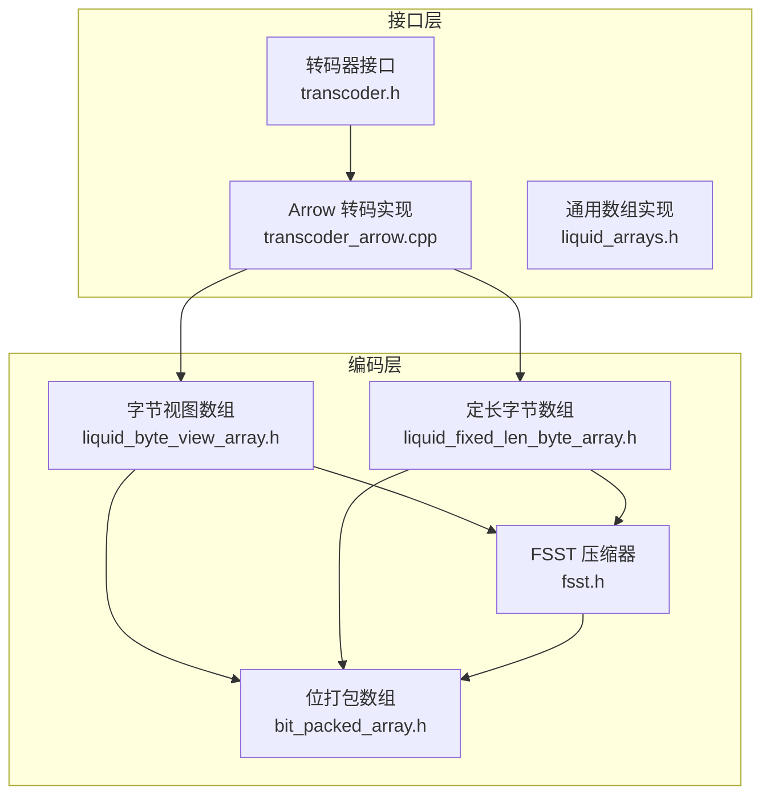
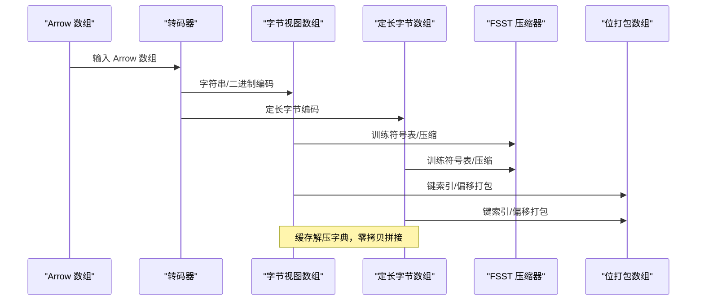
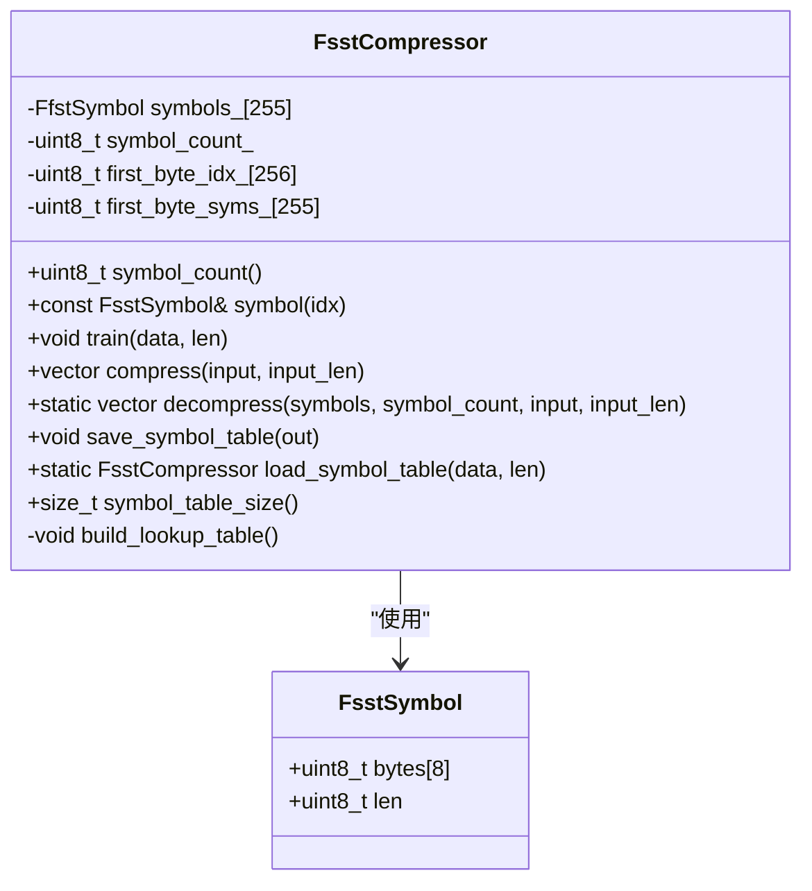
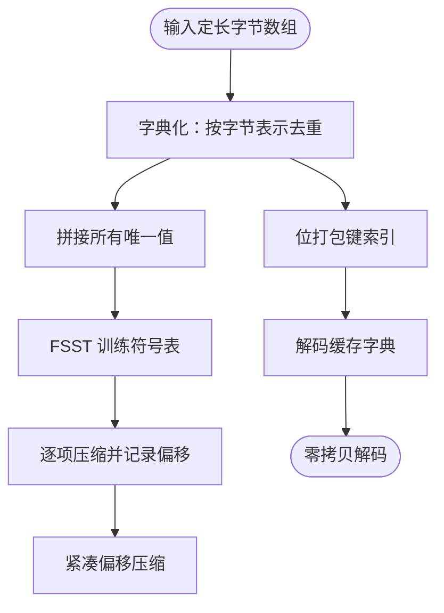
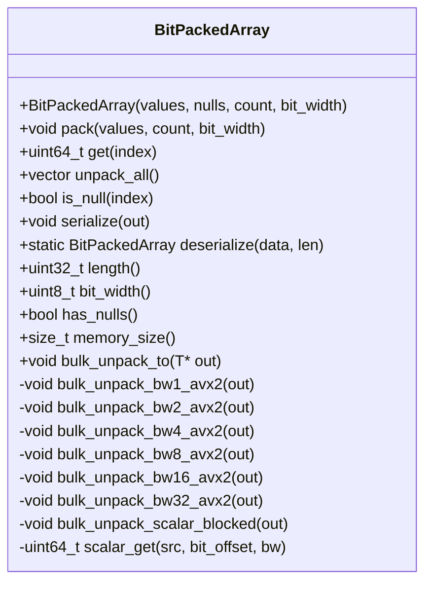
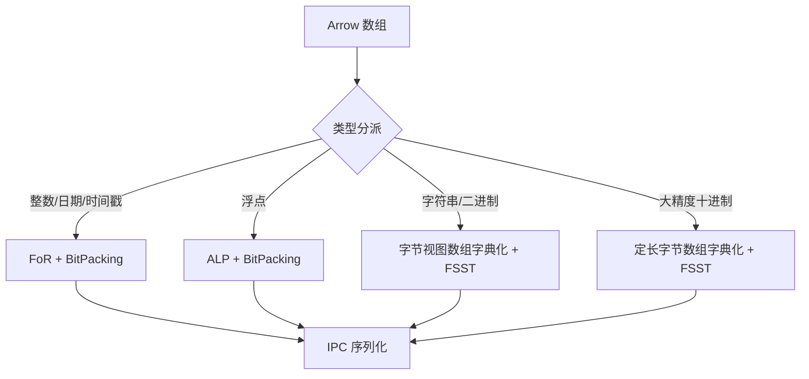
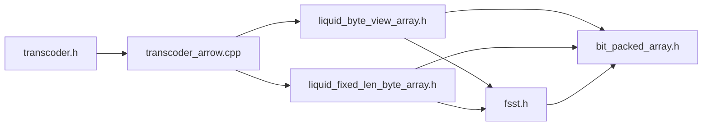

# 字符串和字节编码

<cite>
**本文档引用的文件**
- [fsst.h](file://include/liquid_cache/fsst.h)
- [liquid_byte_view_array.h](file://include/liquid_cache/liquid_byte_view_array.h)
- [liquid_fixed_len_byte_array.h](file://include/liquid_cache/liquid_fixed_len_byte_array.h)
- [bit_packed_array.h](file://include/liquid_cache/bit_packed_array.h)
- [transcoder.h](file://include/liquid_cache/transcoder.h)
- [liquid_arrays.h](file://include/liquid_cache/liquid_arrays.h)
- [transcoder_arrow.cpp](file://src/transcoder_arrow.cpp)
- [README.md](file://README.md)
</cite>

## 目录
1. [简介](#简介)
2. [项目结构](#项目结构)
3. [核心组件](#核心组件)
4. [架构总览](#架构总览)
5. [详细组件分析](#详细组件分析)
6. [依赖关系分析](#依赖关系分析)
7. [性能考量](#性能考量)
8. [故障排查指南](#故障排查指南)
9. [结论](#结论)
10. [附录](#附录)

## 简介
本技术文档聚焦于字符串和字节数据的编码算法，重点阐述 FSST（Fast Static String Table）压缩算法的原理与实现，并结合项目中字节视图数组（ByteViewArray）与定长字节数组（FixedLenByteArray）的编码策略，系统说明：
- 静态字符串表构建与训练过程
- 压缩比优化与解压性能权衡
- 变长字节数组与固定长度字节数组的编码差异
- 字节视图数组的零拷贝设计与内存布局优化
- 在大数据集中的应用效果：重复字符串压缩效率、内存使用优化与解码速度
- 使用示例与编码选择策略及性能调优建议

## 项目结构
该项目采用模块化设计，围绕 Arrow 列式数据框架进行扩展，提供高性能的序列化与反序列化能力。与字符串和字节编码直接相关的关键模块如下：
- FSST 压缩器：提供符号表训练、压缩与解压功能
- 字节视图数组：对字符串/二进制进行字典化 + FSST 压缩
- 定长字节数组：对大精度十进制等固定长度字节值进行字典化 + FSST 压缩
- 位打包数组：通用的位打包存储与批量解包
- 转码器：面向 Arrow 的转码入口与类型分派



图表来源
- [fsst.h:29-270](file://include/liquid_cache/fsst.h#L29-L270)
- [liquid_byte_view_array.h:204-667](file://include/liquid_cache/liquid_byte_view_array.h#L204-L667)
- [liquid_fixed_len_byte_array.h:111-528](file://include/liquid_cache/liquid_fixed_len_byte_array.h#L111-L528)
- [bit_packed_array.h:39-483](file://include/liquid_cache/bit_packed_array.h#L39-L483)
- [transcoder.h:34-360](file://include/liquid_cache/transcoder.h#L34-L360)
- [transcoder_arrow.cpp:34-200](file://src/transcoder_arrow.cpp#L34-L200)
- [liquid_arrays.h:95-248](file://include/liquid_cache/liquid_arrays.h#L95-L248)

章节来源
- [README.md:1-378](file://README.md#L1-L378)

## 核心组件
- FSST 压缩器：基于贪心的大二元/三元计数策略训练符号表，使用首字节查找表加速压缩，支持符号表序列化与加载，以及压缩/解压流水线
- 字节视图数组：对字符串/二进制进行字典化（去重）、共享前缀提取、FSST 压缩、紧凑偏移存储与零拷贝解码
- 定长字节数组：对固定长度字节值（如大精度十进制）进行字典化 + FSST 压缩，支持紧凑偏移与缓存解压
- 位打包数组：按位打包存储整数，支持批量解包与 SIMD 优化，用于键索引与偏移存储

章节来源
- [fsst.h:29-270](file://include/liquid_cache/fsst.h#L29-L270)
- [liquid_byte_view_array.h:204-667](file://include/liquid_cache/liquid_byte_view_array.h#L204-L667)
- [liquid_fixed_len_byte_array.h:111-528](file://include/liquid_cache/liquid_fixed_len_byte_array.h#L111-L528)
- [bit_packed_array.h:39-483](file://include/liquid_cache/bit_packed_array.h#L39-L483)

## 架构总览
FSST 在本项目中的位置与协作方式：
- 字节视图数组与定长字节数组均以“字典化 + FSST 压缩”为核心策略
- 字典键使用位打包数组进行紧凑存储
- 解码阶段通过缓存机制避免重复 FSST 解压，提升解码性能
- Arrow 类型分派由转码器完成，最终生成统一的 IPC 序列化格式



图表来源
- [transcoder.h:34-360](file://include/liquid_cache/transcoder.h#L34-L360)
- [transcoder_arrow.cpp:34-200](file://src/transcoder_arrow.cpp#L34-L200)
- [liquid_byte_view_array.h:204-667](file://include/liquid_cache/liquid_byte_view_array.h#L204-L667)
- [liquid_fixed_len_byte_array.h:111-528](file://include/liquid_cache/liquid_fixed_len_byte_array.h#L111-L528)
- [fsst.h:29-270](file://include/liquid_cache/fsst.h#L29-L270)
- [bit_packed_array.h:39-483](file://include/liquid_cache/bit_packed_array.h#L39-L483)

## 详细组件分析

### FSST 压缩器（FsstCompressor）
FSST 是一种静态符号表压缩算法，通过训练常见子串作为符号，实现高压缩比与快速解压。其核心要点：
- 训练阶段：对输入数据采样（最大 1MB），统计大二元/三元频次，按节省字节数排序，选取前 255 个符号
- 首字节查找表：按首字节分桶，压缩时快速缩小候选范围，降低匹配复杂度
- 压缩格式：符号编号 0..N-1 展开对应符号，0xFF 作为转义字节表示字面量
- 解压鲁棒性：遇到无效代码按字面量处理，保证解压健壮性
- 符号表序列化：兼容 fsst-rs 的符号表格式，便于跨语言互操作



图表来源
- [fsst.h:24-270](file://include/liquid_cache/fsst.h#L24-L270)

章节来源
- [fsst.h:29-270](file://include/liquid_cache/fsst.h#L29-L270)

### 字节视图数组（LiquidByteViewArray）
字节视图数组是字符串/二进制的高效编码容器，核心流程：
- 字典化：对所有唯一值去重，建立字典映射
- 共享前缀：计算字典项的最长公共前缀，后续仅对后缀进行 FSST 压缩
- FSST 压缩：对所有后缀拼接后的数据训练符号表并逐项压缩，记录压缩后偏移
- 紧凑偏移：使用线性回归残差压缩偏移，减少存储开销
- 键索引：使用位打包数组存储每条记录对应的字典键
- 零拷贝解码：缓存解压后的字典，按键索引直接拼接，避免重复解压

```mermaid
sequenceDiagram
participant Input as "输入字符串数组"
participant Dict as "字典构建"
participant Prefix as "共享前缀"
participant FSST as "FSST 压缩"
participant Off as "紧凑偏移"
participant Keys as "位打包键索引"
participant Cache as "解压字典缓存"
Input->>Dict : 去重得到唯一值
Dict->>Prefix : 计算最长公共前缀
Prefix->>FSST : 对后缀拼接数据训练符号表
FSST->>FSST : 逐项压缩并记录偏移
FSST->>Off : 生成压缩偏移
Dict->>Keys : 为每条记录编码字典键
Keys->>Cache : 解码时按键索引零拷贝拼接
```

图表来源
- [liquid_byte_view_array.h:204-667](file://include/liquid_cache/liquid_byte_view_array.h#L204-L667)
- [fsst.h:29-270](file://include/liquid_cache/fsst.h#L29-L270)
- [bit_packed_array.h:39-483](file://include/liquid_cache/bit_packed_array.h#L39-L483)

章节来源
- [liquid_byte_view_array.h:204-667](file://include/liquid_cache/liquid_byte_view_array.h#L204-L667)

### 定长字节数组（LiquidFixedLenByteArray）
定长字节数组用于大精度十进制等固定长度字节值的编码，流程与字节视图数组类似但更简单：
- 字典化：以字节表示为键进行去重
- FSST 压缩：对所有唯一值拼接后训练符号表并逐项压缩
- 紧凑偏移：使用线性回归残差压缩偏移
- 键索引：位打包数组存储键索引
- 解码：缓存解压后的字典，按键索引零拷贝复制



图表来源
- [liquid_fixed_len_byte_array.h:111-528](file://include/liquid_cache/liquid_fixed_len_byte_array.h#L111-L528)
- [fsst.h:29-270](file://include/liquid_cache/fsst.h#L29-L270)
- [bit_packed_array.h:39-483](file://include/liquid_cache/bit_packed_array.h#L39-L483)

章节来源
- [liquid_fixed_len_byte_array.h:111-528](file://include/liquid_cache/liquid_fixed_len_byte_array.h#L111-L528)

### 位打包数组（BitPackedArray）
位打包数组是通用的紧凑存储与批量解包工具：
- 批量解包：支持多种位宽的 SIMD 优化（如 1/2/4/8/16/32），显著提升解包吞吐
- 空值处理：内置空值位图，支持空值检测与空值缓冲区导出
- 内存布局：头部包含长度、位宽、空值标志与数据长度，随后按 8 字节对齐存放打包数据



图表来源
- [bit_packed_array.h:39-483](file://include/liquid_cache/bit_packed_array.h#L39-L483)

章节来源
- [bit_packed_array.h:39-483](file://include/liquid_cache/bit_packed_array.h#L39-L483)

### 转码器与 Arrow 集成
转码器负责将 Arrow 数组转换为内部编码格式，类型分派逻辑如下：
- 整数/日期/时间戳：Frame-of-Reference + BitPacking
- 浮点：ALP（自适应无损浮点）+ BitPacking
- 字符串/二进制：字典化 + FSST（当前实现中字节视图数组承担）



图表来源
- [transcoder.h:34-360](file://include/liquid_cache/transcoder.h#L34-L360)
- [transcoder_arrow.cpp:34-200](file://src/transcoder_arrow.cpp#L34-L200)
- [liquid_byte_view_array.h:204-667](file://include/liquid_cache/liquid_byte_view_array.h#L204-L667)
- [liquid_fixed_len_byte_array.h:111-528](file://include/liquid_cache/liquid_fixed_len_byte_array.h#L111-L528)

章节来源
- [transcoder.h:34-360](file://include/liquid_cache/transcoder.h#L34-L360)
- [transcoder_arrow.cpp:34-200](file://src/transcoder_arrow.cpp#L34-L200)

## 依赖关系分析
- 字节视图数组依赖 FSST 压缩器与位打包数组，同时提供 IPC 序列化与解码
- 定长字节数组同样依赖 FSST 压缩器与位打包数组，但处理的是固定长度字节值
- 转码器作为统一入口，桥接 Arrow 与内部编码格式
- 位打包数组为多类编码提供底层存储与批量解包能力



图表来源
- [transcoder.h:34-360](file://include/liquid_cache/transcoder.h#L34-L360)
- [transcoder_arrow.cpp:34-200](file://src/transcoder_arrow.cpp#L34-L200)
- [liquid_byte_view_array.h:204-667](file://include/liquid_cache/liquid_byte_view_array.h#L204-L667)
- [liquid_fixed_len_byte_array.h:111-528](file://include/liquid_cache/liquid_fixed_len_byte_array.h#L111-L528)
- [fsst.h:29-270](file://include/liquid_cache/fsst.h#L29-L270)
- [bit_packed_array.h:39-483](file://include/liquid_cache/bit_packed_array.h#L39-L483)

章节来源
- [transcoder.h:34-360](file://include/liquid_cache/transcoder.h#L34-L360)
- [transcoder_arrow.cpp:34-200](file://src/transcoder_arrow.cpp#L34-L200)
- [liquid_byte_view_array.h:204-667](file://include/liquid_cache/liquid_byte_view_array.h#L204-L667)
- [liquid_fixed_len_byte_array.h:111-528](file://include/liquid_cache/liquid_fixed_len_byte_array.h#L111-L528)
- [fsst.h:29-270](file://include/liquid_cache/fsst.h#L29-L270)
- [bit_packed_array.h:39-483](file://include/liquid_cache/bit_packed_array.h#L39-L483)

## 性能考量
- FSST 训练采样：对超大数据采用采样（最多 1MB）以控制训练成本，平衡符号表质量与速度
- 首字节查找表：按首字节分桶，显著减少压缩时的候选匹配数量，提高压缩速度
- 缓存解压字典：字节视图与定长字节数组在解码时缓存解压后的字典，避免重复 FSST 解压，提升解码吞吐
- 紧凑偏移：线性回归残差压缩偏移，减少偏移存储空间
- 批量解包与 SIMD：位打包数组提供多种位宽的 SIMD 批量解包，显著提升解码性能
- 零拷贝拼接：解码阶段直接从缓存字典的连续内存块复制，避免多次分配与拷贝

章节来源
- [fsst.h:36-113](file://include/liquid_cache/fsst.h#L36-L113)
- [liquid_byte_view_array.h:625-666](file://include/liquid_cache/liquid_byte_view_array.h#L625-L666)
- [liquid_fixed_len_byte_array.h:436-457](file://include/liquid_cache/liquid_fixed_len_byte_array.h#L436-L457)
- [bit_packed_array.h:242-378](file://include/liquid_cache/bit_packed_array.h#L242-L378)

## 故障排查指南
- 符号表加载失败：检查缓冲区大小是否足够容纳符号表长度与符号数据
- FSST 压缩数据越界：确认压缩后大小与偏移记录是否与原始缓冲区一致
- 解压字典为空：确认是否正确缓存解压字典，或检查键索引是否越界
- 位打包数组反序列化失败：检查头部长度、空值标志与数据长度是否匹配
- Arrow 类型不支持：确认类型分派逻辑是否覆盖目标 Arrow 类型

章节来源
- [fsst.h:199-226](file://include/liquid_cache/fsst.h#L199-L226)
- [liquid_byte_view_array.h:480-570](file://include/liquid_cache/liquid_byte_view_array.h#L480-L570)
- [liquid_fixed_len_byte_array.h:242-283](file://include/liquid_cache/liquid_fixed_len_byte_array.h#L242-L283)
- [bit_packed_array.h:197-233](file://include/liquid_cache/bit_packed_array.h#L197-L233)

## 结论
本项目通过“字典化 + FSST 压缩”的统一策略，实现了字符串/二进制与固定长度字节值的高效编码。FSST 提供高压缩比与快速解压能力，配合共享前缀、紧凑偏移与缓存解压字典，进一步优化内存占用与解码速度。位打包数组的批量解包与 SIMD 优化，使得整体解码吞吐大幅提升。在大数据集场景下，重复字符串与固定长度字节值能够获得显著的压缩率与更低的内存占用，同时保持良好的解码性能。

## 附录

### 使用示例与编码选择策略
- 字符串/二进制（高基数/低基数）：优先使用字节视图数组，利用共享前缀与 FSST 压缩；若存在大量重复后缀，压缩效果更佳
- 大精度十进制：使用定长字节数组，字典化 + FSST 压缩，适合重复值较多的场景
- 浮点：使用转码器的 ALP + BitPacking 策略，适合近似无损且分布较为集中的场景
- 整数/日期/时间戳：使用 FoR + BitPacking，适合单调或近线性的序列

章节来源
- [transcoder_arrow.cpp:34-200](file://src/transcoder_arrow.cpp#L34-L200)
- [liquid_byte_view_array.h:204-667](file://include/liquid_cache/liquid_byte_view_array.h#L204-L667)
- [liquid_fixed_len_byte_array.h:111-528](file://include/liquid_cache/liquid_fixed_len_byte_array.h#L111-L528)

### 性能调优建议
- 控制 FSST 训练样本大小：在超大数据上适当采样，平衡训练时间与符号表质量
- 选择合适的键位宽：根据字典规模计算位宽，避免过度浪费
- 启用缓存解压字典：在重复解码场景下显著降低 CPU 开销
- 使用批量解包与 SIMD：确保编译开启 AVX2 等指令集，提升解包吞吐
- 紧凑偏移压缩：对偏移分布线性或近似线性的场景，紧凑偏移能有效减小存储

章节来源
- [fsst.h:36-113](file://include/liquid_cache/fsst.h#L36-L113)
- [bit_packed_array.h:242-378](file://include/liquid_cache/bit_packed_array.h#L242-L378)
- [liquid_byte_view_array.h:625-666](file://include/liquid_cache/liquid_byte_view_array.h#L625-L666)
- [liquid_fixed_len_byte_array.h:436-457](file://include/liquid_cache/liquid_fixed_len_byte_array.h#L436-L457)