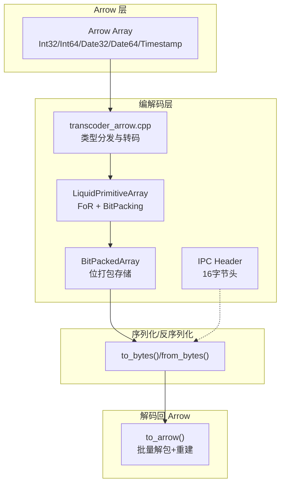
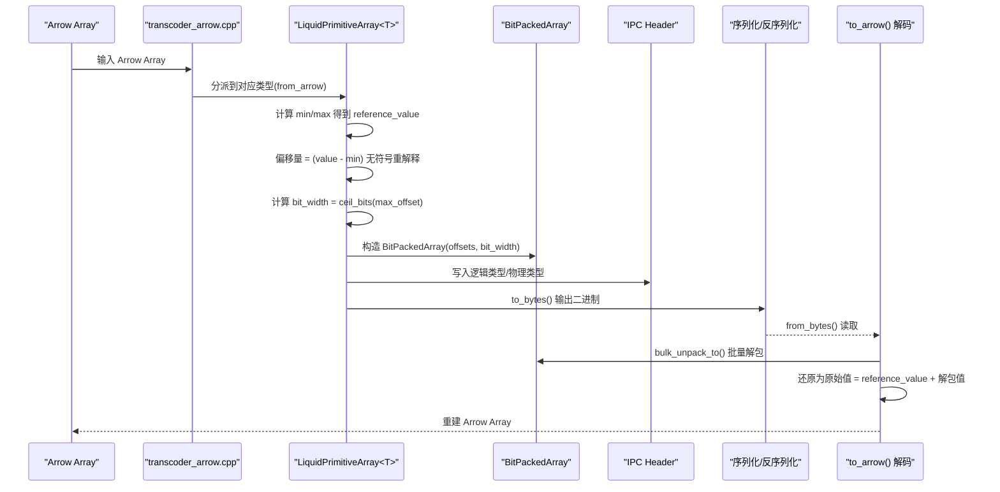
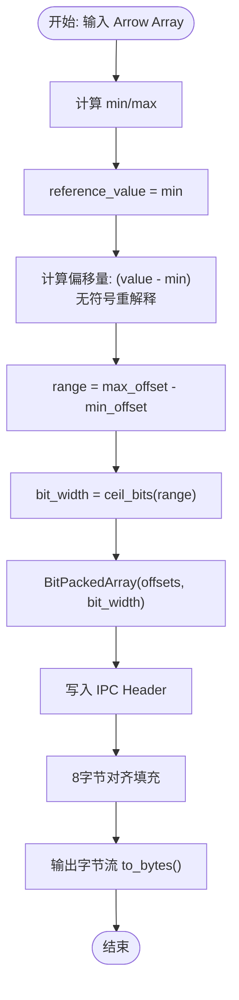
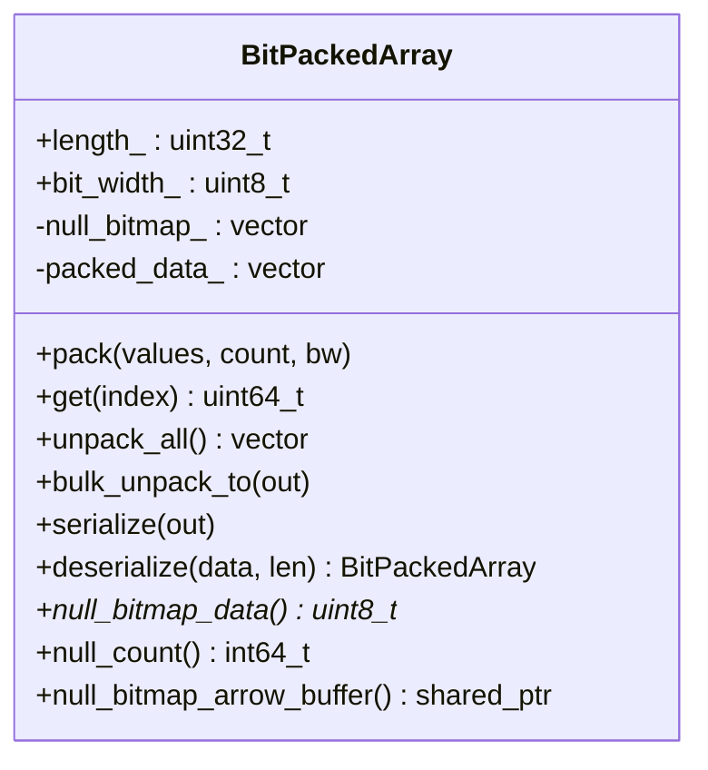
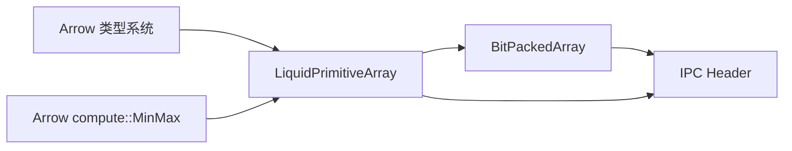

# 整数编码 (FoR + BitPacking)

<cite>
**本文引用的文件**
- [liquid_arrays.h](file://include/liquid_cache/liquid_arrays.h)
- [bit_packed_array.h](file://include/liquid_cache/bit_packed_array.h)
- [ipc_header.h](file://include/liquid_cache/ipc_header.h)
- [transcoder_arrow.cpp](file://src/transcoder_arrow.cpp)
- [test_linear_integer.cpp](file://tests/test_linear_integer.cpp)
- [test_roundtrip.cpp](file://tests/test_roundtrip.cpp)
- [velox_benchmark.cpp](file://examples/velox_benchmark.cpp)
</cite>

## 目录
1. [简介](#简介)
2. [项目结构](#项目结构)
3. [核心组件](#核心组件)
4. [架构总览](#架构总览)
5. [详细组件分析](#详细组件分析)
6. [依赖关系分析](#依赖关系分析)
7. [性能考量](#性能考量)
8. [故障排查指南](#故障排查指南)
9. [结论](#结论)
10. [附录](#附录)

## 简介
本文件系统性阐述整数编码中的 Frame-of-Reference (FoR) + BitPacking 算法在该 C++ 代码库中的实现与使用。内容涵盖：
- FoR + BitPacking 的工作原理：参考值计算、偏移量转换、位宽确定、打包过程
- LiquidPrimitiveArray 类的实现机制：最小值查找、无符号重解释、位打包算法、内存布局
- 压缩效率与解码性能分析
- 不同整数类型（Int32、Int64、Date32 等）的应用策略
- 编码参数选择建议与基准测试方法

## 项目结构
该仓库围绕 Arrow 数组与 Liquid Cache 格式之间的编解码展开，FoR + BitPacking 主要由以下模块协作完成：
- 编码入口与类型分发：transcoder_arrow.cpp
- 整数数组编码器：liquid_arrays.h 中的 LiquidPrimitiveArray<T>
- 位打包存储：bit_packed_array.h 中的 BitPackedArray
- IPC 头部格式：ipc_header.h
- 测试与基准：tests、examples

图表来源
- [transcoder_arrow.cpp:34-351](file://src/transcoder_arrow.cpp#L34-L351)
- [liquid_arrays.h:95-248](file://include/liquid_cache/liquid_arrays.h#L95-L248)
- [bit_packed_array.h:39-233](file://include/liquid_cache/bit_packed_array.h#L39-L233)
- [ipc_header.h:46-106](file://include/liquid_cache/ipc_header.h#L46-L106)

章节来源
- [transcoder_arrow.cpp:34-351](file://src/transcoder_arrow.cpp#L34-L351)
- [liquid_arrays.h:95-248](file://include/liquid_cache/liquid_arrays.h#L95-L248)
- [bit_packed_array.h:39-233](file://include/liquid_cache/bit_packed_array.h#L39-L233)
- [ipc_header.h:46-106](file://include/liquid_cache/ipc_header.h#L46-L106)

## 核心组件
- LiquidPrimitiveArray<T>：对整数/日期类型的 FoR + BitPacking 编码器，负责：
  - 计算最小值作为参考值
  - 将每个元素减去参考值得到非负偏移量，并以无符号方式重解释
  - 计算最大偏移量所需的位宽
  - 使用 BitPackedArray 打包偏移量
  - 提供 to_bytes()/from_bytes() 序列化与 to_arrow() 解码回 Arrow
- BitPackedArray：位打包存储，支持批量解包（含 AVX2 加速），并维护空值位图
- IPC Header：统一的 16 字节头部，标识逻辑类型与物理类型，确保跨语言兼容

章节来源
- [liquid_arrays.h:95-248](file://include/liquid_cache/liquid_arrays.h#L95-L248)
- [bit_packed_array.h:39-233](file://include/liquid_cache/bit_packed_array.h#L39-L233)
- [ipc_header.h:46-106](file://include/liquid_cache/ipc_header.h#L46-L106)

## 架构总览
FoR + BitPacking 在 Arrow 与 Liquid Cache 之间的端到端流程如下：

图表来源
- [transcoder_arrow.cpp:44-192](file://src/transcoder_arrow.cpp#L44-L192)
- [liquid_arrays.h:111-197](file://include/liquid_cache/liquid_arrays.h#L111-L197)
- [bit_packed_array.h:244-272](file://include/liquid_cache/bit_packed_array.h#L244-L272)
- [ipc_header.h:75-105](file://include/liquid_cache/ipc_header.h#L75-L105)

## 详细组件分析

### LiquidPrimitiveArray<T> 实现机制
- 参考值计算与偏移量转换
  - 使用 arrow::compute::MinMax 获取非空元素的最小值与最大值
  - reference_value = min
  - 偏移量 = (value - min)，通过无符号类型重解释保证非负
- 位宽确定
  - 计算 range = max_offset - min_offset = max_offset（因为 min_offset=0）
  - bit_width = ceil_bits(range)，即最高有效位位置
- 位打包
  - 将所有偏移量写入 BitPackedArray，按 bit_width 固定位宽存储
- 内存布局
  - IPC Header（16B）
  - reference_value（NativeT 大小）
  - 按 8 字节对齐填充
  - BitPackedArray 数据（包含可选空值位图、对齐后的打包数据）

图表来源
- [liquid_arrays.h:111-164](file://include/liquid_cache/liquid_arrays.h#L111-L164)
- [liquid_arrays.h:199-238](file://include/liquid_cache/liquid_arrays.h#L199-L238)

章节来源
- [liquid_arrays.h:111-164](file://include/liquid_cache/liquid_arrays.h#L111-L164)
- [liquid_arrays.h:199-238](file://include/liquid_cache/liquid_arrays.h#L199-L238)

### BitPackedArray 位打包算法
- 存储模型
  - 每个元素占用 exactly bit_width 位
  - 采用 1024 元素块（FastLanes 约定）提升 SIMD 友好性
- 打包过程
  - scalar 实现：逐元素计算 bit_offset，写入低 8 字节，必要时跨越高 8 字节
  - 对齐与掩码：当 bit_width < 64 时，使用掩码截断高位
- 解包过程
  - 单元素访问：计算 bit_offset，读取所需字节，右移并掩码
  - 批量解包：优先使用 AVX2 针对常见位宽（1,2,4,8,16,32）的高效路径；否则使用块状标量回退
- 空值处理
  - 维护空值位图，提供 null_count 与 Arrow Buffer 转换接口

图表来源
- [bit_packed_array.h:39-483](file://include/liquid_cache/bit_packed_array.h#L39-L483)

章节来源
- [bit_packed_array.h:62-95](file://include/liquid_cache/bit_packed_array.h#L62-L95)
- [bit_packed_array.h:98-138](file://include/liquid_cache/bit_packed_array.h#L98-L138)
- [bit_packed_array.h:244-272](file://include/liquid_cache/bit_packed_array.h#L244-L272)

### IPC 头部与序列化
- IPC Header（16 字节）
  - magic/version/logical_type_id/physical_type_id/padding
  - 与 Rust 端完全二进制兼容
- 序列化顺序
  - 写入 Header
  - 写入 reference_value
  - 8 字节对齐填充
  - 写入 BitPackedArray（含空值位图与对齐）

章节来源
- [ipc_header.h:46-106](file://include/liquid_cache/ipc_header.h#L46-L106)
- [liquid_arrays.h:199-238](file://include/liquid_cache/liquid_arrays.h#L199-L238)

### 类型映射与时间戳处理
- 整数/日期类型映射至无符号类型用于位宽计算
- 时间戳在 Arrow 层被转换为 Int64 视图后进行 FoR + BitPacking，物理类型保留为时间戳单位信息

章节来源
- [liquid_arrays.h:49-63](file://include/liquid_cache/liquid_arrays.h#L49-L63)
- [transcoder_arrow.cpp:152-192](file://src/transcoder_arrow.cpp#L152-L192)

## 依赖关系分析
- 类型依赖
  - LiquidPrimitiveArray<T> 依赖 Arrow 类型系统与 compute::MinMax
  - BitPackedArray 依赖 Arrow Buffer 以生成空值位图
  - IPC Header 为跨语言兼容的二进制格式
- 编译期与运行时
  - AVX2 条件编译：在支持的平台上启用批量解包加速
  - 无外部依赖的纯头文件库风格，便于集成

图表来源
- [liquid_arrays.h:111-164](file://include/liquid_cache/liquid_arrays.h#L111-L164)
- [bit_packed_array.h:450-476](file://include/liquid_cache/bit_packed_array.h#L450-L476)
- [ipc_header.h:75-105](file://include/liquid_cache/ipc_header.h#L75-L105)

章节来源
- [liquid_arrays.h:111-164](file://include/liquid_cache/liquid_arrays.h#L111-L164)
- [bit_packed_array.h:450-476](file://include/liquid_cache/bit_packed_array.h#L450-L476)
- [ipc_header.h:75-105](file://include/liquid_cache/ipc_header.h#L75-L105)

## 性能考量
- 压缩效率
  - 当数据呈单调或近似线性时，FoR 将大范围值映射到较小范围，显著降低 bit_width
  - 测试用例验证了常量序列（bit_width=0）与线性序列的压缩效果优于原始存储
- 解码性能
  - 批量解包（bulk_unpack_to）避免逐元素访问开销
  - AVX2 特化路径对常见位宽（1,2,4,8,16,32）提供向量化加速
  - 内存布局紧凑，减少缓存未命中
- 适用场景
  - 适合大规模整数/日期列的存储与传输
  - 对于稀疏或随机分布的数据，压缩收益有限
- 与线性模型对比
  - 线性模型（LiquidLinearIntegerArray）在严格单调/线性序列上可能进一步压缩残差
  - 但实现复杂度更高，且需要额外的模型拟合与存储

章节来源
- [test_roundtrip.cpp:496-505](file://tests/test_roundtrip.cpp#L496-L505)
- [test_linear_integer.cpp:237-266](file://tests/test_linear_integer.cpp#L237-L266)
- [bit_packed_array.h:260-272](file://include/liquid_cache/bit_packed_array.h#L260-L272)

## 故障排查指南
- 常见问题
  - 缓冲区过小导致解析失败：检查 IPC Header 与对齐后的 BitPackedArray 长度
  - 非法魔数/版本：确认序列化端与反序列化端的 IPC Header 兼容
  - 空值位图长度不匹配：确保 nulls_len 与实际位图长度一致
- 调试建议
  - 使用 to_bytes()/from_bytes() 进行序列化往返测试
  - 利用 memory_size() 评估内存占用
  - 对比 bit_width() 与原始数据分布，判断是否需要调整编码策略

章节来源
- [bit_packed_array.h:197-233](file://include/liquid_cache/bit_packed_array.h#L197-L233)
- [ipc_header.h:86-105](file://include/liquid_cache/ipc_header.h#L86-L105)

## 结论
FoR + BitPacking 在该代码库中实现了高性能、低开销的整数/日期列压缩与解码。其关键优势在于：
- 通过参考值将大范围值域映射到小范围，显著降低位宽
- 位打包存储与批量解包结合，兼顾压缩率与解码速度
- 与 Arrow 生态无缝对接，支持多类型与空值处理
- 与线性模型相比，FoR + BitPacking 更通用、更易实现，适合大多数场景

## 附录

### 编码参数选择建议
- 数据分布特征
  - 单调/线性：优先考虑 FoR + BitPacking；若残差极小，可考虑线性模型
  - 随机/均匀：FoR + BitPacking 仍有效，但收益有限
- 位宽与内存
  - 通过 bit_width() 与 memory_size() 评估压缩效果
  - 对于常量序列（bit_width=0），收益最佳
- 类型选择
  - Int32/Int64/Date32/Date64：直接使用 FoR + BitPacking
  - Timestamp：转换为 Int64 后再编码，物理类型保留时间单位

章节来源
- [liquid_arrays.h:143-144](file://include/liquid_cache/liquid_arrays.h#L143-L144)
- [test_roundtrip.cpp:422-432](file://tests/test_roundtrip.cpp#L422-L432)

### 性能基准测试方法
- 基准工具
  - examples/velox_benchmark.cpp：比较“Parquet 读取 → Velox 向量”与“Liquid 缓存 → Velox 向量”的性能
- 测试步骤
  - 准备内存中的 Parquet 文件
  - 加载为 Liquid 缓存（一次转码）
  - 多轮测量两种路径的耗时与吞吐
- 关键指标
  - 平均/中位/标准差/95% 置信区间
  - 行数/MB/秒估算

章节来源
- [velox_benchmark.cpp:488-592](file://examples/velox_benchmark.cpp#L488-L592)