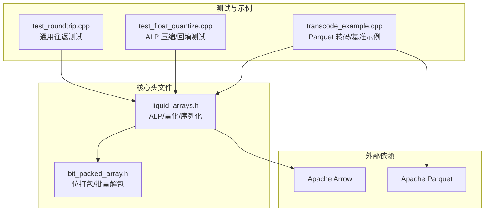
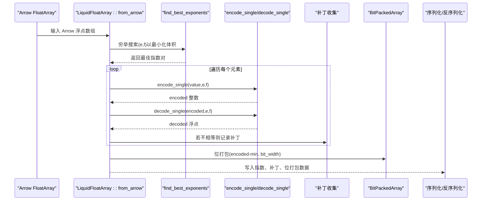
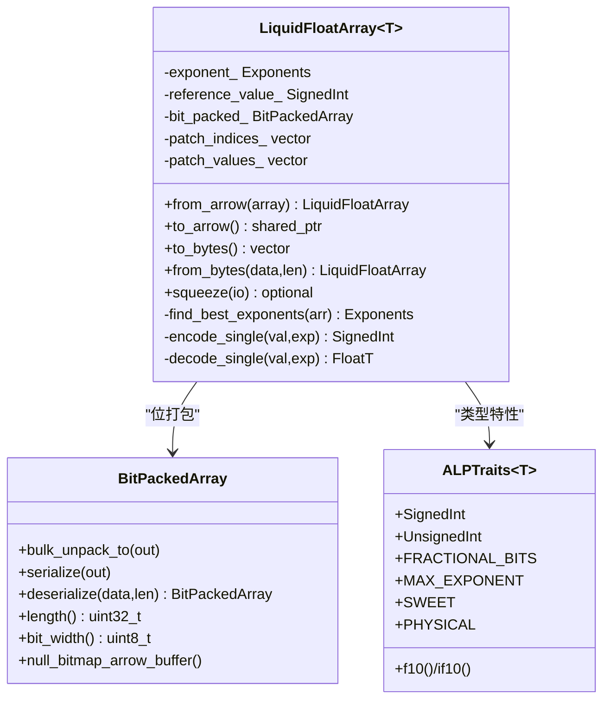
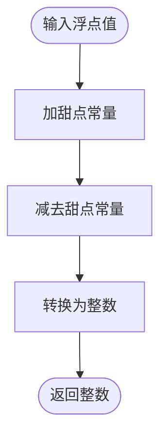
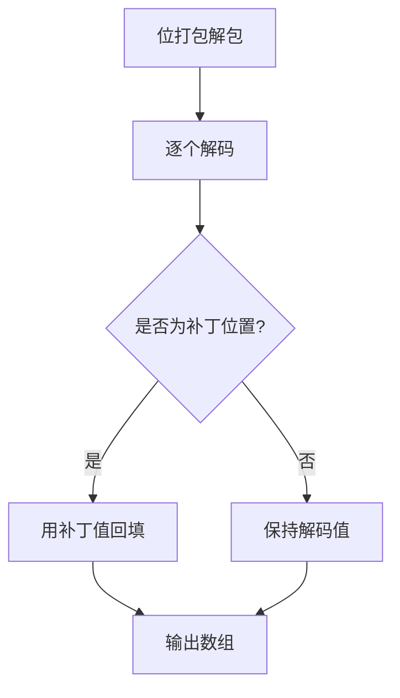
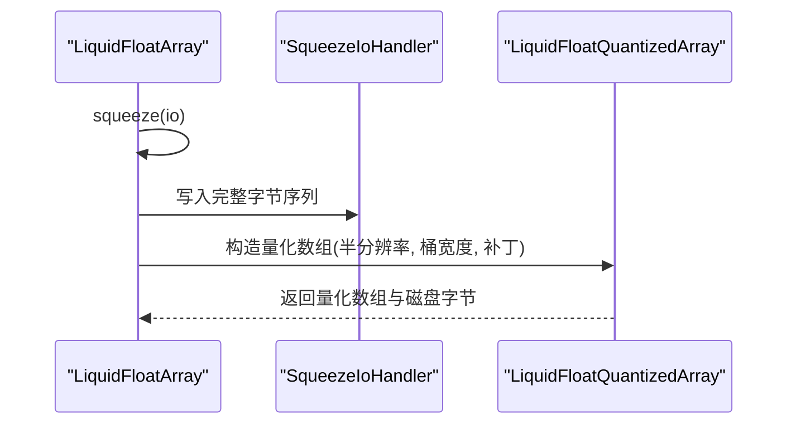
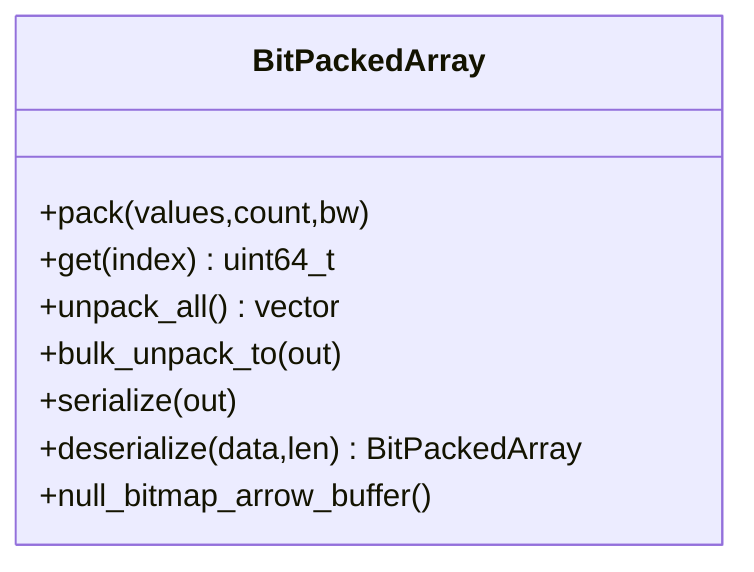
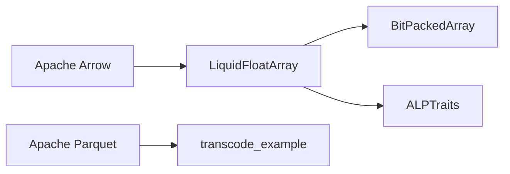

# 浮点数编码 (ALP)

<cite>
**本文档引用的文件**
- [README.md](file://README.md)
- [liquid_arrays.h](file://include/liquid_cache/liquid_arrays.h)
- [bit_packed_array.h](file://include/liquid_cache/bit_packed_array.h)
- [test_float_quantize.cpp](file://tests/test_float_quantize.cpp)
- [test_roundtrip.cpp](file://tests/test_roundtrip.cpp)
- [transcode_example.cpp](file://examples/transcode_example.cpp)
</cite>

## 目录
1. [简介](#简介)
2. [项目结构](#项目结构)
3. [核心组件](#核心组件)
4. [架构总览](#架构总览)
5. [详细组件分析](#详细组件分析)
6. [依赖关系分析](#依赖关系分析)
7. [性能考量](#性能考量)
8. [故障排查指南](#故障排查指南)
9. [结论](#结论)
10. [附录](#附录)

## 简介
本文件面向“浮点数 ALP (Adaptive Lossless Packing)”编码算法，系统性阐述其原理与实现要点，重点覆盖：
- 自适应指数搜索：穷举 (e, f) 组合以最小化整体存储体积
- 量化策略：基于 10 的幂次表的快速四舍五入与无损解码
- 补丁机制：对无法无损还原的元素进行索引与原值记录
- 无损解码保证：通过补丁回填确保解码与原始值完全一致
- 与现有方案对比：与传统浮点压缩方法的差异与优势
- 性能与压缩比评估：结合单元测试与基准示例给出实践参考
- 使用示例与最佳实践：如何在 Arrow/Parquet 生态中应用

## 项目结构
本仓库提供高性能列式数据缓存与编码压缩能力，其中浮点数 ALP 编码位于核心数组实现模块中，并与位打包、IPC 头、转码器等组件协同工作。

图表来源
- [liquid_arrays.h:1-1221](file://include/liquid_cache/liquid_arrays.h#L1-L1221)
- [bit_packed_array.h:1-486](file://include/liquid_cache/bit_packed_array.h#L1-L486)
- [test_roundtrip.cpp:1-544](file://tests/test_roundtrip.cpp#L1-L544)
- [test_float_quantize.cpp:1-419](file://tests/test_float_quantize.cpp#L1-L419)
- [transcode_example.cpp:1-550](file://examples/transcode_example.cpp#L1-L550)

章节来源
- [README.md:1-378](file://README.md#L1-L378)

## 核心组件
- LiquidFloatArray<T>：ALP 浮点数组编码器，负责自适应指数搜索、量化、补丁收集与位打包
- BitPackedArray：位打包存储与批量解包，支持 AVX2 SIMD 加速
- LiquidFloatQuantizedArray<T>：半分辨率量化数组，用于内存-磁盘混合存储与谓词下推
- ALPTraits<T>：针对 float/double 的常量与类型特性（位宽、幂表、物理类型）

章节来源
- [liquid_arrays.h:577-1221](file://include/liquid_cache/liquid_arrays.h#L577-L1221)
- [bit_packed_array.h:22-486](file://include/liquid_cache/bit_packed_array.h#L22-L486)

## 架构总览
ALP 编码的整体流程如下：
1. 采样/穷举搜索最佳指数对 (e, f)，以估计编码后体积
2. 对每个浮点值进行量化：encode_single = fast_round(value × 10^e × 10^-f)
3. 验证无损：decode_single(encoded) 是否等于原值，否则记录补丁
4. 位打包：对编码后的整数减去最小值，按所需位宽进行位打包
5. 序列化：保存指数、补丁列表、位打包数据与对齐信息

图表来源
- [liquid_arrays.h:704-840](file://include/liquid_cache/liquid_arrays.h#L704-L840)
- [liquid_arrays.h:965-1010](file://include/liquid_cache/liquid_arrays.h#L965-L1010)

## 详细组件分析

### LiquidFloatArray<T>：ALP 编码器
- 自适应指数搜索
  - 在大数组上采用采样策略，减少搜索开销
  - 评估不同 (e, f) 下的编码范围与补丁数量，选择总体体积最小者
- 快速四舍五入
  - 使用“甜点”常量进行稳定快速舍入，避免中间浮点误差累积
- 无损验证与补丁机制
  - 对每个量化结果进行解码验证，记录索引与原始值
  - 为提升压缩比，将补丁位置的编码值替换为一个填充值
- 位打包与序列化
  - 计算最小值与范围，确定位宽，批量位打包
  - 序列化布局包含：指数、补丁长度、补丁索引与值、对齐后的位打包数据

图表来源
- [liquid_arrays.h:577-1018](file://include/liquid_cache/liquid_arrays.h#L577-L1018)
- [bit_packed_array.h:22-272](file://include/liquid_cache/bit_packed_array.h#L22-L272)

章节来源
- [liquid_arrays.h:577-840](file://include/liquid_cache/liquid_arrays.h#L577-L840)
- [liquid_arrays.h:842-962](file://include/liquid_cache/liquid_arrays.h#L842-L962)
- [liquid_arrays.h:965-1010](file://include/liquid_cache/liquid_arrays.h#L965-L1010)

### 快速四舍五入与幂次表
- 快速四舍五入
  - 通过“甜点”常量加减抵消中间舍入误差，得到稳定的整数结果
- 幂次表
  - 预计算 10^i 与其倒数 10^-i，避免运行时浮点运算
  - f32/f64 分别维护独立表，上限由类型位宽决定

图表来源
- [liquid_arrays.h:688-696](file://include/liquid_cache/liquid_arrays.h#L688-L696)
- [liquid_arrays.h:624-647](file://include/liquid_cache/liquid_arrays.h#L624-L647)

章节来源
- [liquid_arrays.h:650-676](file://include/liquid_cache/liquid_arrays.h#L650-L676)
- [liquid_arrays.h:688-696](file://include/liquid_cache/liquid_arrays.h#L688-L696)

### 补丁机制与无损解码
- 补丁收集
  - 遍历编码结果，若解码不等于原值，则记录索引与原始值
- 填充优化
  - 选择一个非补丁位置的编码值作为填充，使位打包更紧凑
- 解码阶段
  - 批量解包位打包数据，逐个解码
  - 用补丁值回填对应索引，确保与原数组完全一致

图表来源
- [liquid_arrays.h:801-840](file://include/liquid_cache/liquid_arrays.h#L801-L840)
- [liquid_arrays.h:738-762](file://include/liquid_cache/liquid_arrays.h#L738-L762)

章节来源
- [liquid_arrays.h:738-762](file://include/liquid_cache/liquid_arrays.h#L738-L762)
- [liquid_arrays.h:801-840](file://include/liquid_cache/liquid_arrays.h#L801-L840)

### 量化与谓词下推（Squeeze）
- Squeeze 策略
  - 当位宽 ≥ 8 时，将编码值右移一半位宽，形成半分辨率量化数组
  - 将完整编码字节序列写入磁盘，量化数组仅保留必要元数据
- 谓词下推
  - 基于桶边界 [lo, hi] 与字面量比较，尽可能直接判定真/假
  - 补丁位置单独处理，确保谓词结果准确

图表来源
- [liquid_arrays.h:1168-1212](file://include/liquid_cache/liquid_arrays.h#L1168-L1212)
- [test_float_quantize.cpp:16-31](file://tests/test_float_quantize.cpp#L16-L31)

章节来源
- [liquid_arrays.h:1021-1166](file://include/liquid_cache/liquid_arrays.h#L1021-L1166)
- [liquid_arrays.h:1168-1212](file://include/liquid_cache/liquid_arrays.h#L1168-L1212)
- [test_float_quantize.cpp:54-113](file://tests/test_float_quantize.cpp#L54-L113)

### 位打包与批量解包
- 位打包
  - 按 bit_width 将无符号整数序列打包到连续字节缓冲区
  - 支持空位图与对齐，序列化/反序列化遵循固定头部格式
- 批量解包
  - 提供 AVX2 SIMD 加速路径（bw=1,2,4,8,16,32）
  - 其他位宽采用块状标量回退策略

图表来源
- [bit_packed_array.h:22-486](file://include/liquid_cache/bit_packed_array.h#L22-L486)

章节来源
- [bit_packed_array.h:22-272](file://include/liquid_cache/bit_packed_array.h#L22-L272)
- [bit_packed_array.h:274-444](file://include/liquid_cache/bit_packed_array.h#L274-L444)

## 依赖关系分析
- 内部依赖
  - LiquidFloatArray 依赖 BitPackedArray 实现位打包与批量解包
  - ALPTraits 提供类型相关常量与幂表，驱动快速四舍五入与量化
- 外部依赖
  - Apache Arrow：数组类型、缓冲区管理、计算内核
  - Apache Parquet：示例中用于读取/验证数据

图表来源
- [liquid_arrays.h:1-35](file://include/liquid_cache/liquid_arrays.h#L1-L35)
- [transcode_example.cpp:34-49](file://examples/transcode_example.cpp#L34-L49)

章节来源
- [README.md:41-83](file://README.md#L41-L83)
- [transcode_example.cpp:34-49](file://examples/transcode_example.cpp#L34-L49)

## 性能考量
- 指数搜索复杂度
  - 搜索空间为 O(e×f) 且 e ∈ [0, MAX_EXPONENT), f ∈ [0, e)，典型上限为 10×10
  - 大数组采用 1024 采样步长，平衡搜索质量与时间
- 快速四舍五入
  - 通过“甜点”常量避免中间浮点误差，提高稳定性与速度
- 位打包与 SIMD
  - AVX2 加速常见位宽（1,2,4,8,16,32），显著降低解包成本
- 压缩比评估
  - 单元测试覆盖往返一致性与序列化往返一致性
  - 量化测试验证内存占用下降与谓词下推可行性

章节来源
- [liquid_arrays.h:965-1010](file://include/liquid_cache/liquid_arrays.h#L965-L1010)
- [bit_packed_array.h:260-378](file://include/liquid_cache/bit_packed_array.h#L260-L378)
- [test_roundtrip.cpp:451-462](file://tests/test_roundtrip.cpp#L451-L462)
- [test_float_quantize.cpp:366-403](file://tests/test_float_quantize.cpp#L366-L403)

## 故障排查指南
- 编译与链接
  - Arrow 计算内核通过静态初始化器注册，需使用全归档链接避免丢弃
  - 系统 Arrow 与 Velox bundled Arrow ABI 不兼容，需统一构建配置
- 运行期异常
  - 反序列化时若缓冲区不足或对齐错误，抛出异常
  - 位打包数据越界或空位图长度不匹配会触发异常
- 调试建议
  - 使用单元测试验证往返一致性与序列化往返一致性
  - 通过示例程序对比 Parquet 读取与 CacheStore 解码性能

章节来源
- [README.md:343-378](file://README.md#L343-L378)
- [liquid_arrays.h:903-962](file://include/liquid_cache/liquid_arrays.h#L903-L962)
- [bit_packed_array.h:197-233](file://include/liquid_cache/bit_packed_array.h#L197-L233)

## 结论
ALP 通过自适应指数搜索、快速四舍五入与补丁机制，在保证无损的前提下实现了对浮点数组的有效压缩。配合位打包与 SIMD 加速，以及量化与谓词下推能力，ALP 在内存占用与查询性能之间取得良好平衡。结合单元测试与示例程序，可在 Arrow/Parquet 生态中安全落地。

## 附录

### 使用示例与最佳实践
- 基本往返测试
  - 使用单元测试验证 Float32/Float64 的往返一致性
- 压缩与谓词下推
  - 仅当位宽 ≥ 8 时进行 squeeze；否则直接返回 nullopt
  - 量化数组支持基于桶边界的谓词判定，补丁位置单独处理
- 性能基准
  - 示例程序展示从 Parquet 读取与 CacheStore 解码的对比
  - 建议在热页缓存条件下进行基准，排除磁盘 I/O 影响

章节来源
- [test_roundtrip.cpp:144-184](file://tests/test_roundtrip.cpp#L144-L184)
- [test_float_quantize.cpp:54-113](file://tests/test_float_quantize.cpp#L54-L113)
- [transcode_example.cpp:156-183](file://examples/transcode_example.cpp#L156-L183)