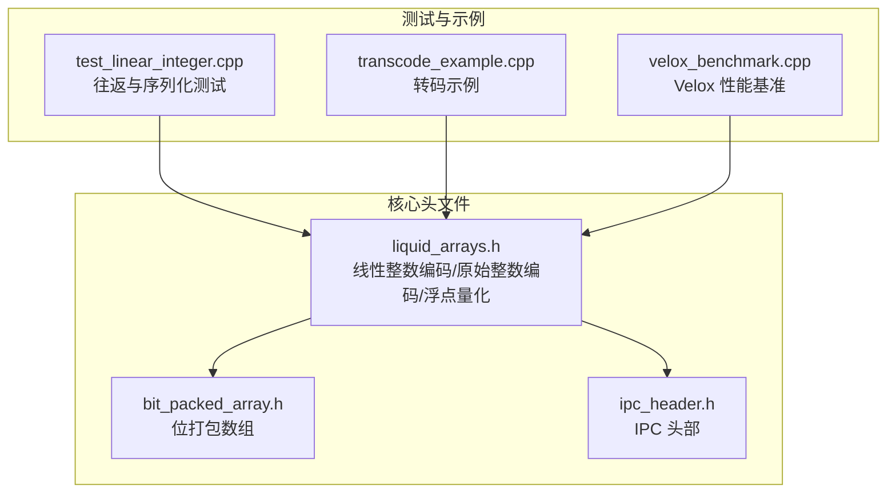
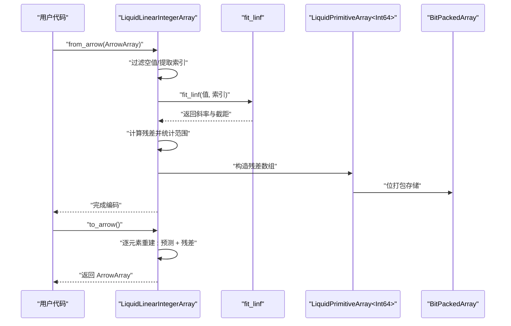
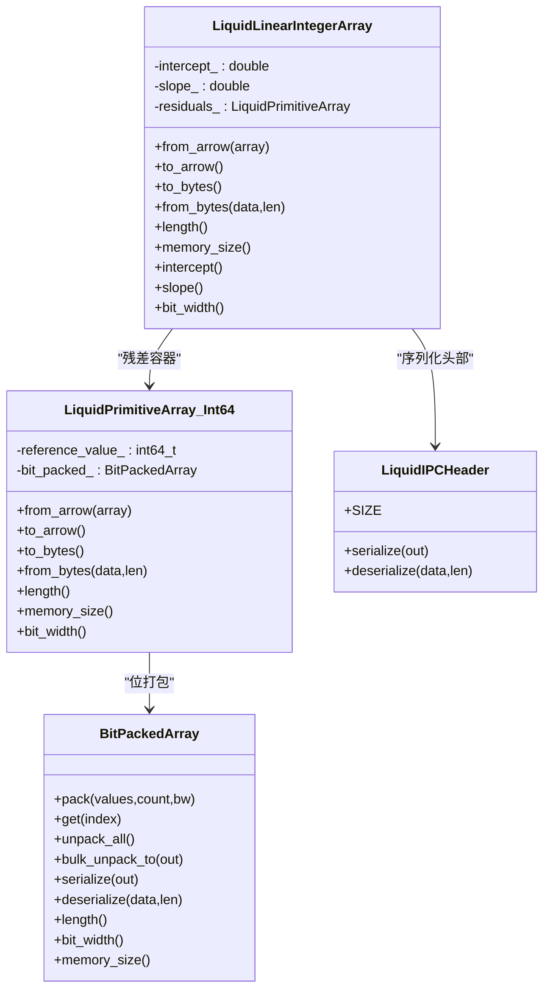
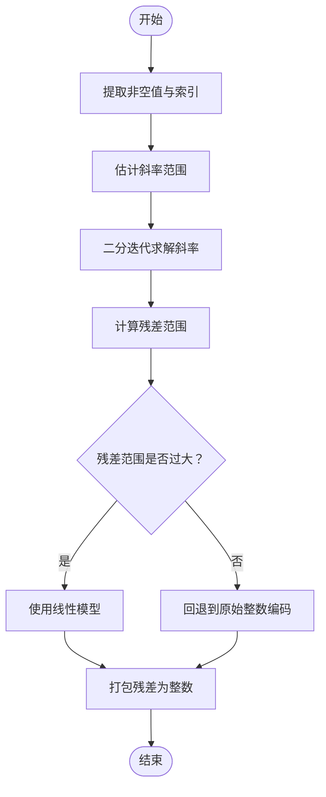
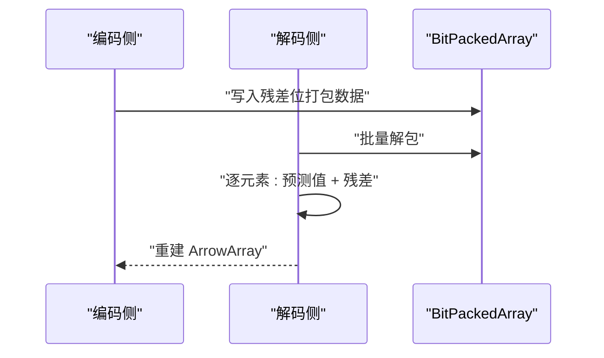
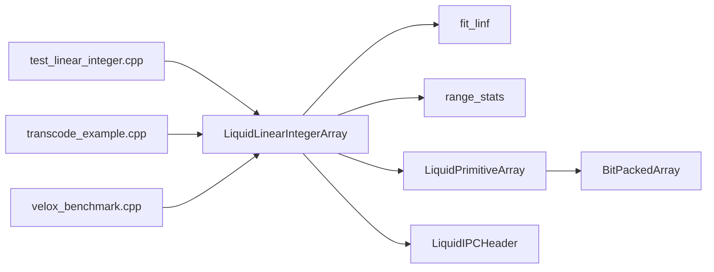

# 线性整数编码

<cite>
**本文引用的文件**
- [README.md](file://README.md)
- [liquid_arrays.h](file://include/liquid_cache/liquid_arrays.h)
- [bit_packed_array.h](file://include/liquid_cache/bit_packed_array.h)
- [ipc_header.h](file://include/liquid_cache/ipc_header.h)
- [test_linear_integer.cpp](file://tests/test_linear_integer.cpp)
- [transcode_example.cpp](file://examples/transcode_example.cpp)
- [velox_benchmark.cpp](file://examples/velox_benchmark.cpp)
</cite>

## 目录
1. [简介](#简介)
2. [项目结构](#项目结构)
3. [核心组件](#核心组件)
4. [架构总览](#架构总览)
5. [详细组件分析](#详细组件分析)
6. [依赖关系分析](#依赖关系分析)
7. [性能考量](#性能考量)
8. [故障排查指南](#故障排查指南)
9. [结论](#结论)
10. [附录](#附录)

## 简介
本文件面向“线性整数编码”算法，系统性阐述基于 L-infinity（切比雪夫）回归的线性模型编码原理与实现细节，重点覆盖以下方面：
- 斜率与截距的求解方法（L-infinity 最优拟合）
- 残差计算与模型拟合流程
- LiquidLinearIntegerArray 类的实现机制：鲁棒回归、残差数组存储、预测与重建
- 适用场景（单调或近似线性序列）与与传统整数编码的性能对比
- 模型参数的序列化存储、内存布局优化与批量解码优化策略

## 项目结构
该项目是一个高性能列式数据内存缓存与编码压缩库，支持 Arrow/Parquet 的高效编解码，并提供与 Velox 引擎的集成能力。与线性整数编码直接相关的核心文件如下：
- include/liquid_cache/liquid_arrays.h：包含线性整数编码、原始整数编码、浮点量化等数组编码实现
- include/liquid_cache/bit_packed_array.h：位打包数组，用于压缩存储偏移量与残差
- include/liquid_cache/ipc_header.h：二进制 IPC 头部，统一序列化格式
- tests/test_linear_integer.cpp：线性整数编码的端到端往返测试与序列化测试
- examples/transcode_example.cpp：示例程序，展示如何将 Arrow 数组转为液态缓存结构
- examples/velox_benchmark.cpp：与 Velox 引擎的性能基准测试，体现线性整数编码在向量化执行中的优势

图表来源
- [liquid_arrays.h:342-566](file://include/liquid_cache/liquid_arrays.h#L342-L566)
- [bit_packed_array.h:29-38](file://include/liquid_cache/bit_packed_array.h#L29-L38)
- [ipc_header.h:46-62](file://include/liquid_cache/ipc_header.h#L46-L62)
- [test_linear_integer.cpp:1-271](file://tests/test_linear_integer.cpp#L1-L271)
- [transcode_example.cpp:39-49](file://examples/transcode_example.cpp#L39-L49)
- [velox_benchmark.cpp:55-56](file://examples/velox_benchmark.cpp#L55-L56)

章节来源
- [README.md:1-378](file://README.md#L1-L378)

## 核心组件
- LiquidLinearIntegerArray<T>：线性整数编码数组，采用 L-infinity（切比雪夫）回归拟合线性模型，残差以整数形式存储并进行位打包压缩
- fit_linf：L-infinity 线性回归求解器，返回最优斜率与截距
- range_stats：按当前斜率计算残差范围，辅助迭代收敛
- LiquidPrimitiveArray<Int64Type>：作为残差容器，使用位打包存储
- BitPackedArray：底层位打包存储，支持批量解包与 SIMD 加速
- LiquidIPCHeader：统一的二进制头部，保证跨语言兼容

章节来源
- [liquid_arrays.h:273-340](file://include/liquid_cache/liquid_arrays.h#L273-L340)
- [liquid_arrays.h:342-566](file://include/liquid_cache/liquid_arrays.h#L342-L566)
- [bit_packed_array.h:29-38](file://include/liquid_cache/bit_packed_array.h#L29-L38)
- [ipc_header.h:46-62](file://include/liquid_cache/ipc_header.h#L46-L62)

## 架构总览
线性整数编码的整体流程如下：
- 输入：Arrow 数组（支持多种整数/日期类型）
- 预处理：过滤空值，提取非空值及其索引
- 模型拟合：使用 L-infinity 回归估计线性模型的斜率与截距
- 残差计算：逐元素计算残差，范围统计，决定是否采用线性模型
- 残差编码：将残差映射为整数并使用位打包存储
- 序列化：写入 IPC 头部、模型参数与残差数据
- 解码：读取头部与参数，逐元素重建值（预测 + 残差）

图表来源
- [liquid_arrays.h:366-474](file://include/liquid_cache/liquid_arrays.h#L366-L474)
- [liquid_arrays.h:291-340](file://include/liquid_cache/liquid_arrays.h#L291-L340)
- [liquid_arrays.h:476-518](file://include/liquid_cache/liquid_arrays.h#L476-L518)
- [bit_packed_array.h:155-195](file://include/liquid_cache/bit_packed_array.h#L155-L195)

## 详细组件分析

### LiquidLinearIntegerArray<T> 实现机制
- 模型假设：value[i] ≈ intercept + slope * i + residual[i]
- 拟合策略：L-infinity（切比雪夫）回归，最小化最大残差绝对值
- 残差存储：以整数形式存储，使用 LiquidPrimitiveArray<Int64Type>，再由 BitPackedArray 压缩
- 空值处理：空位保留为 null，重建时保持空值
- 边界保护：预测值在有符号/无符号类型范围内饱和，避免越界

图表来源
- [liquid_arrays.h:358-566](file://include/liquid_cache/liquid_arrays.h#L358-L566)
- [liquid_arrays.h:95-248](file://include/liquid_cache/liquid_arrays.h#L95-L248)
- [bit_packed_array.h:39-483](file://include/liquid_cache/bit_packed_array.h#L39-L483)
- [ipc_header.h:46-106](file://include/liquid_cache/ipc_header.h#L46-L106)

章节来源
- [liquid_arrays.h:342-566](file://include/liquid_cache/liquid_arrays.h#L342-L566)

### L-infinity（切比雪夫）回归求解
- 核心思想：寻找最优斜率 m，使得残差 s[i] = v[i] - m * i - b 的极值之差最小
- 迭代策略：先估计斜率范围，再二分搜索最优斜率；随后计算残差范围并确定截距
- 收敛控制：最大迭代次数与阈值，避免数值不稳定

图表来源
- [liquid_arrays.h:291-340](file://include/liquid_cache/liquid_arrays.h#L291-L340)
- [liquid_arrays.h:366-474](file://include/liquid_cache/liquid_arrays.h#L366-L474)

章节来源
- [liquid_arrays.h:273-340](file://include/liquid_cache/liquid_arrays.h#L273-L340)

### 残差数组的存储与重建
- 残差存储：使用 LiquidPrimitiveArray<Int64Type>，内部以位打包数组存储
- 内存布局：IPC 头部 + 模型参数（双精度）+ 8 字节对齐 + 残差数据
- 解码重建：逐元素计算预测值，加上对应残差，进行类型范围饱和

图表来源
- [liquid_arrays.h:520-549](file://include/liquid_cache/liquid_arrays.h#L520-L549)
- [liquid_arrays.h:476-518](file://include/liquid_cache/liquid_arrays.h#L476-L518)
- [bit_packed_array.h:155-195](file://include/liquid_cache/bit_packed_array.h#L155-L195)

章节来源
- [liquid_arrays.h:520-549](file://include/liquid_cache/liquid_arrays.h#L520-L549)
- [liquid_arrays.h:476-518](file://include/liquid_cache/liquid_arrays.h#L476-L518)
- [bit_packed_array.h:155-195](file://include/liquid_cache/bit_packed_array.h#L155-L195)

### 适用场景与性能对比
- 适用场景：单调或近似线性的整数序列（例如时间序列、递增 ID、线性增长的业务指标）
- 与传统整数编码对比：当序列接近线性时，线性整数编码显著降低残差方差，从而提升位打包压缩效率；对于高度波动的序列，可能不如原始整数编码或专用编码方案
- 测试验证：测试用例包含单调序列、带空值、负值、不同整数宽度与无符号类型等，验证正确性与压缩效果

章节来源
- [test_linear_integer.cpp:120-271](file://tests/test_linear_integer.cpp#L120-L271)
- [liquid_arrays.h:342-349](file://include/liquid_cache/liquid_arrays.h#L342-L349)

### 序列化与内存布局优化
- 序列化格式：IPC 头部 + 模型参数（双精度，8 字节）+ 8 字节对齐 + 残差数据
- 内存布局：模型参数紧随头部之后，残差数据按 8 字节对齐，便于快速读取
- 位打包优化：BitPackedArray 采用块状结构与 SIMD 批量解包，减少循环开销

章节来源
- [liquid_arrays.h:520-549](file://include/liquid_cache/liquid_arrays.h#L520-L549)
- [bit_packed_array.h:155-195](file://include/liquid_cache/bit_packed_array.h#L155-L195)

### 批量解码优化策略
- 批量解包：BitPackedArray 提供 bulk_unpack_to，避免逐元素访问带来的分支与开销
- 饱和预测：predict_i64_saturated/predict_u64_saturated 在预测值越界时进行饱和，避免异常值影响
- 空值处理：解码时跳过空位，保持空值一致性

章节来源
- [bit_packed_array.h:242-272](file://include/liquid_cache/bit_packed_array.h#L242-L272)
- [liquid_arrays.h:257-271](file://include/liquid_cache/liquid_arrays.h#L257-L271)
- [liquid_arrays.h:476-518](file://include/liquid_cache/liquid_arrays.h#L476-L518)

## 依赖关系分析
- LiquidLinearIntegerArray 依赖：
  - fit_linf 与 range_stats：用于鲁棒回归
  - LiquidPrimitiveArray<Int64>：残差容器
  - BitPackedArray：位打包存储
  - LiquidIPCHeader：统一序列化头部
- 测试与示例：
  - test_linear_integer.cpp：验证往返正确性与序列化
  - transcode_example.cpp：演示 Arrow -> 液态缓存 -> Arrow 的转换
  - velox_benchmark.cpp：在 Velox 向量化执行中评估性能

图表来源
- [liquid_arrays.h:291-340](file://include/liquid_cache/liquid_arrays.h#L291-L340)
- [liquid_arrays.h:342-566](file://include/liquid_cache/liquid_arrays.h#L342-L566)
- [bit_packed_array.h:39-483](file://include/liquid_cache/bit_packed_array.h#L39-L483)
- [ipc_header.h:46-106](file://include/liquid_cache/ipc_header.h#L46-L106)
- [test_linear_integer.cpp:1-271](file://tests/test_linear_integer.cpp#L1-L271)
- [transcode_example.cpp:39-49](file://examples/transcode_example.cpp#L39-L49)
- [velox_benchmark.cpp:55-56](file://examples/velox_benchmark.cpp#L55-L56)

章节来源
- [liquid_arrays.h:291-340](file://include/liquid_cache/liquid_arrays.h#L291-L340)
- [liquid_arrays.h:342-566](file://include/liquid_cache/liquid_arrays.h#L342-L566)
- [bit_packed_array.h:39-483](file://include/liquid_cache/bit_packed_array.h#L39-L483)
- [ipc_header.h:46-106](file://include/liquid_cache/ipc_header.h#L46-L106)
- [test_linear_integer.cpp:1-271](file://tests/test_linear_integer.cpp#L1-L271)
- [transcode_example.cpp:39-49](file://examples/transcode_example.cpp#L39-L49)
- [velox_benchmark.cpp:55-56](file://examples/velox_benchmark.cpp#L55-L56)

## 性能考量
- 线性拟合复杂度：O(n)（估计斜率范围）+ O(iterations)（二分迭代）
- 残差计算与打包：O(n)，位打包进一步压缩
- 解码复杂度：O(n)，批量解包 + SIMD 加速
- 适用性：当序列接近线性时，残差更集中，位打包效率更高；对于高度非线性序列，建议结合其他编码策略

## 故障排查指南
- 序列化/反序列化错误：检查 IPC 头部魔数与版本，确认缓冲区长度足够
- 残差越界：检查预测值饱和逻辑与类型范围
- 空值处理：确认空位在编码与解码两端一致
- 性能异常：确认是否启用了批量解包与对齐策略

章节来源
- [ipc_header.h:86-105](file://include/liquid_cache/ipc_header.h#L86-L105)
- [liquid_arrays.h:536-549](file://include/liquid_cache/liquid_arrays.h#L536-L549)
- [bit_packed_array.h:197-233](file://include/liquid_cache/bit_packed_array.h#L197-L233)

## 结论
线性整数编码通过 L-infinity 回归对近似线性序列进行建模，利用残差的集中性与位打包压缩实现高效存储与解码。其核心优势在于：
- 鲁棒回归（L-infinity）对异常值不敏感
- 残差的整数化与位打包显著降低存储体积
- 批量解包与饱和预测保障了解码性能与稳定性

在实际应用中，应优先识别单调或近似线性的数据特征，配合测试用例与基准测试进行评估与调优。

## 附录
- 示例与基准参考：
  - 端到端往返测试与序列化测试：[test_linear_integer.cpp:1-271](file://tests/test_linear_integer.cpp#L1-L271)
  - Arrow 转码示例：[transcode_example.cpp:39-49](file://examples/transcode_example.cpp#L39-L49)
  - Velox 性能基准：[velox_benchmark.cpp:55-56](file://examples/velox_benchmark.cpp#L55-L56)