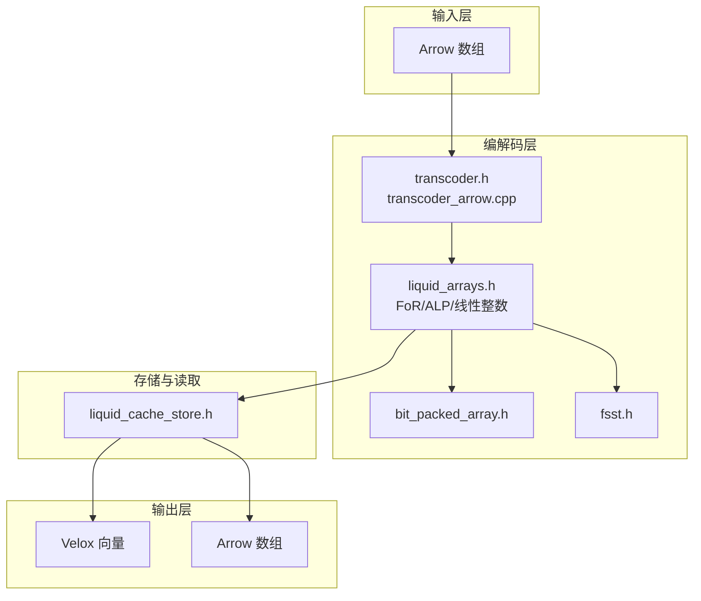
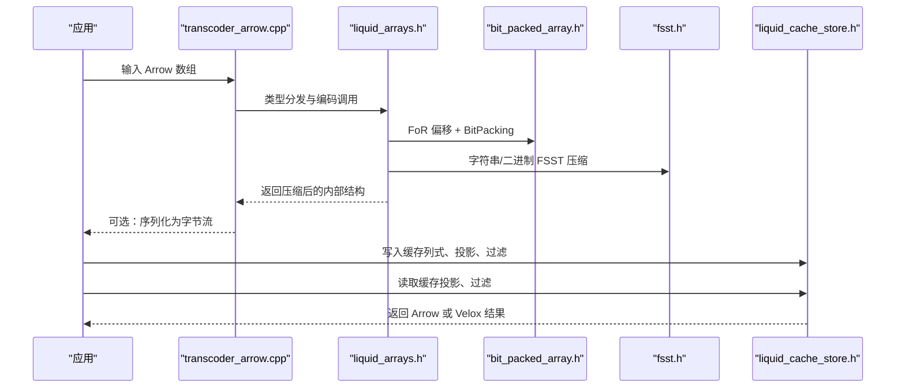
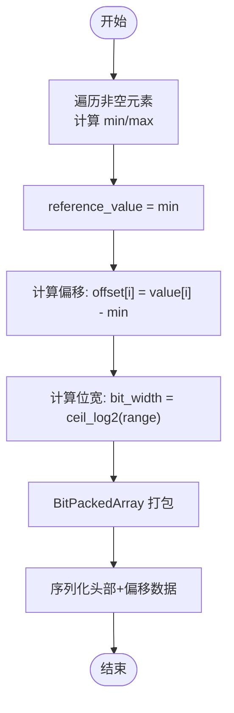
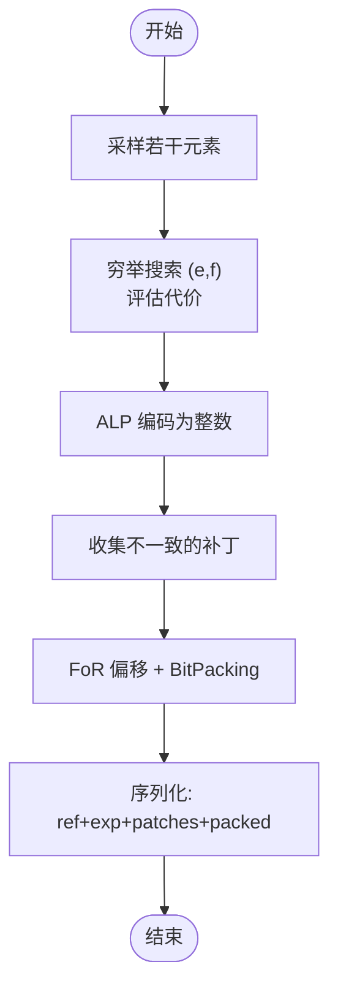
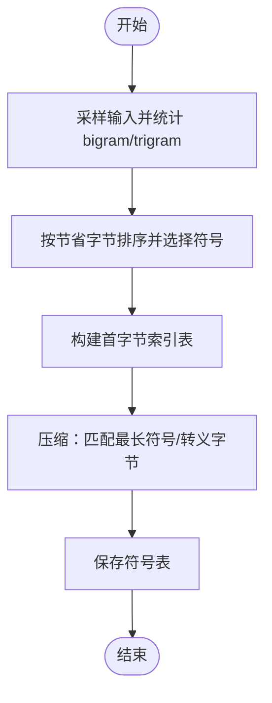
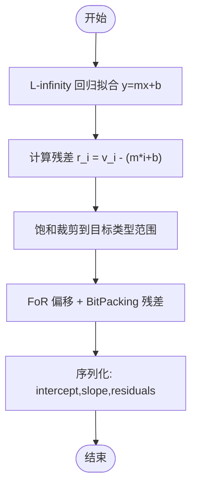
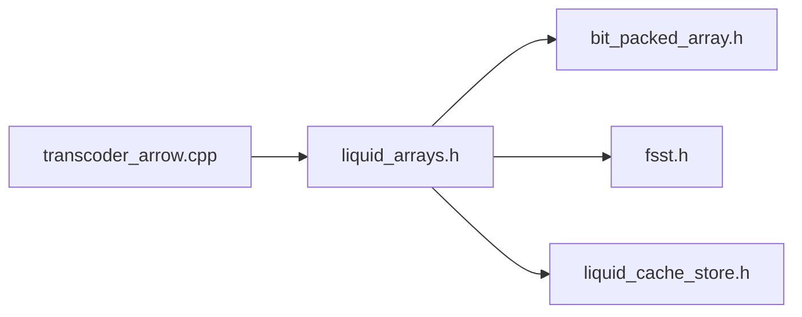

# 编码算法详解

<cite>
**本文档引用的文件**
- [README.md](file://README.md)
- [transcoder.h](file://include/liquid_cache/transcoder.h)
- [transcoder_arrow.cpp](file://src/transcoder_arrow.cpp)
- [liquid_arrays.h](file://include/liquid_cache/liquid_arrays.h)
- [bit_packed_array.h](file://include/liquid_cache/bit_packed_array.h)
- [fsst.h](file://include/liquid_cache/fsst.h)
- [liquid_cache_store.h](file://include/liquid_cache/liquid_cache_store.h)
- [test_linear_integer.cpp](file://tests/test_linear_integer.cpp)
- [test_roundtrip.cpp](file://tests/test_roundtrip.cpp)
- [test_float_quantize.cpp](file://tests/test_float_quantize.cpp)
- [transcode_example.cpp](file://examples/transcode_example.cpp)
- [velox_benchmark.cpp](file://examples/velox_benchmark.cpp)
</cite>

## 目录
1. [简介](#简介)
2. [项目结构](#项目结构)
3. [核心组件](#核心组件)
4. [架构总览](#架构总览)
5. [详细组件分析](#详细组件分析)
6. [依赖关系分析](#依赖关系分析)
7. [性能考量](#性能考量)
8. [故障排查指南](#故障排查指南)
9. [结论](#结论)
10. [附录](#附录)

## 简介
本技术文档系统性阐述 liquid-cache-cpp 中的编码算法体系，涵盖以下核心算法与实现：
- Frame-of-Reference（FoR，参考值偏移）
- Arithmetic Lossless Packing（ALP，算术无损打包）
- BitPacking（位打包）
- FSST（快速静态符号表）字符串压缩
- 线性整数编码（LinearInteger）

文档将从算法原理、工作机制、压缩比特性、解码性能与内存使用、自动算法选择策略、性能对比与使用建议等方面进行深入分析，并结合仓库中的基准测试与单元测试结果，给出可操作的实践指导。

## 项目结构
该项目采用模块化设计，围绕 Arrow 列式数据框架构建，提供从 Arrow 数组到内部压缩表示的编解码流水线，并支持与 Velox 向量引擎的互操作。关键模块包括：
- 编解码接口与类型分发：transcoder.h、transcoder_arrow.cpp
- 编码数组实现：liquid_arrays.h（含 FoR+BitPacking、ALP、线性整数等）
- 位打包工具：bit_packed_array.h
- 字符串压缩：fsst.h
- 缓存与读取：liquid_cache_store.h
- 基准测试与示例：examples/ 下的示例程序与 tests/ 下的单元测试

**图表来源**
- [transcoder_arrow.cpp:44-351](file://src/transcoder_arrow.cpp#L44-L351)
- [liquid_arrays.h:81-248](file://include/liquid_cache/liquid_arrays.h#L81-L248)
- [bit_packed_array.h:39-233](file://include/liquid_cache/bit_packed_array.h#L39-L233)
- [fsst.h:29-270](file://include/liquid_cache/fsst.h#L29-L270)
- [liquid_cache_store.h:188-527](file://include/liquid_cache/liquid_cache_store.h#L188-L527)

**章节来源**
- [README.md:1-378](file://README.md#L1-L378)

## 核心组件
本节概述与编码算法直接相关的组件及其职责：
- 编解码入口与类型分发：负责根据 Arrow 类型选择合适的编码策略（FoR+BitPacking、ALP、FSST 等）。
- 编码数组实现：提供具体的数据结构与序列化/反序列化逻辑。
- 位打包工具：提供高效的位打包与批量解包能力，支持 AVX2 加速。
- 字符串压缩：基于 FSST 的符号表训练与压缩/解压流程。
- 缓存与读取：提供列式缓存、投影读取、过滤读取与内存预算控制。

**章节来源**
- [transcoder.h:17-360](file://include/liquid_cache/transcoder.h#L17-L360)
- [transcoder_arrow.cpp:44-351](file://src/transcoder_arrow.cpp#L44-L351)
- [liquid_arrays.h:81-573](file://include/liquid_cache/liquid_arrays.h#L81-L573)
- [bit_packed_array.h:22-486](file://include/liquid_cache/bit_packed_array.h#L22-L486)
- [fsst.h:24-270](file://include/liquid_cache/fsst.h#L24-L270)
- [liquid_cache_store.h:188-527](file://include/liquid_cache/liquid_cache_store.h#L188-L527)

## 架构总览
下图展示了从 Arrow 数组到内部压缩表示再到解码输出的整体流程，以及与缓存层的交互：

**图表来源**
- [transcoder_arrow.cpp:44-351](file://src/transcoder_arrow.cpp#L44-L351)
- [liquid_arrays.h:81-248](file://include/liquid_cache/liquid_arrays.h#L81-L248)
- [bit_packed_array.h:22-195](file://include/liquid_cache/bit_packed_array.h#L22-L195)
- [fsst.h:29-182](file://include/liquid_cache/fsst.h#L29-L182)
- [liquid_cache_store.h:311-356](file://include/liquid_cache/liquid_cache_store.h#L311-L356)

## 详细组件分析

### FoR（Frame-of-Reference）+ BitPacking
- 算法原理
  - FoR：以最小值作为参考值，将原始值转换为非负偏移量，从而降低最大值，减少所需位宽。
  - BitPacking：按确定的位宽对偏移量进行紧凑存储，支持批量解包与 SIMD 加速。
- 实现要点
  - 最小值查找与偏移计算：遍历非空元素，得到 min/max，构造 reference_value 与 offsets。
  - 位宽计算：基于 range = max - min，计算所需的位宽。
  - 批量解包：提供 AVX2 特化路径，显著提升解码吞吐。
- 压缩比与性能
  - 对单调递增/递减或近似线性的整数序列具有极佳压缩比。
  - 解码阶段内存带宽友好，批量解包减少分支与循环开销。
- 适用场景
  - 整数、日期、时间戳（转换为整数后）等数值型列。
- 关键实现位置
  - [FoR+BitPacking 编码:111-165](file://include/liquid_cache/liquid_arrays.h#L111-L165)
  - [批量解包与 SIMD:168-197](file://include/liquid_cache/liquid_arrays.h#L168-L197)
  - [位打包工具:22-233](file://include/liquid_cache/bit_packed_array.h#L22-L233)

**图表来源**
- [liquid_arrays.h:111-165](file://include/liquid_cache/liquid_arrays.h#L111-L165)
- [bit_packed_array.h:62-95](file://include/liquid_cache/bit_packed_array.h#L62-L95)

**章节来源**
- [liquid_arrays.h:81-248](file://include/liquid_cache/liquid_arrays.h#L81-L248)
- [bit_packed_array.h:22-233](file://include/liquid_cache/bit_packed_array.h#L22-L233)

### ALP（Arithmetic Lossless Packing）+ BitPacking
- 算法原理
  - ALP 通过寻找最佳指数对 (e, f)，将浮点数映射到整数域，保证无损还原。
  - 对映射后的整数使用 FoR + BitPacking 压缩。
- 实现要点
  - 指数搜索：在候选范围内穷举 (e, f)，评估代价（位宽+补丁开销）选择最优。
  - 补丁机制：当 decode 与原值不一致时记录索引与原始值，解码时用填充值替代。
  - 序列化：保存 reference、exponents、patches、BitPacked offsets。
- 压缩比与性能
  - 对分布相对集中的浮点数列有良好效果；当位宽较小（<8）时通常不进行“squeeze”优化。
- 适用场景
  - 浮点数列，特别是科学计算或金融数值。
- 关键实现位置
  - [ALP 编码与指数搜索:705-799](file://include/liquid_cache/liquid_arrays.h#L705-L799)
  - [ALP 编码函数族:679-703](file://include/liquid_cache/liquid_arrays.h#L679-L703)
  - [转码入口（float）:194-214](file://src/transcoder_arrow.cpp#L194-L214)

**图表来源**
- [liquid_arrays.h:705-799](file://include/liquid_cache/liquid_arrays.h#L705-L799)
- [transcoder_arrow.cpp:194-214](file://src/transcoder_arrow.cpp#L194-L214)

**章节来源**
- [liquid_arrays.h:577-800](file://include/liquid_cache/liquid_arrays.h#L577-L800)
- [transcoder_arrow.cpp:194-214](file://src/transcoder_arrow.cpp#L194-L214)

### BitPacking（位打包）
- 算法原理
  - 将每个元素按固定位宽存储，避免按类型对齐造成的空间浪费。
  - 提供批量解包与 SIMD 加速路径，支持常见位宽（1,2,4,8,16,32）。
- 实现要点
  - 打包：逐元素写入，处理跨字节边界与溢出。
  - 解包：提供 scalar 与 blocked scalar 两种路径，AVX2 特化路径覆盖常见位宽。
  - 内存布局：包含头部（长度、位宽、空值标志、空值位图长度、值区长度）与对齐要求。
- 性能特性
  - 解码吞吐高，内存占用小；对齐与边界处理影响性能。
- 关键实现位置
  - [位打包类与序列化:22-233](file://include/liquid_cache/bit_packed_array.h#L22-L233)
  - [批量解包与 SIMD:242-378](file://include/liquid_cache/bit_packed_array.h#L242-L378)

**章节来源**
- [bit_packed_array.h:22-486](file://include/liquid_cache/bit_packed_array.h#L22-L486)

### FSST（快速静态符号表）字符串压缩
- 算法原理
  - 基于大/三元组频次统计训练符号表，将重复子串替换为短码。
  - 支持符号表序列化与加载，压缩/解压采用 O(1) 首字节索引表加速匹配。
- 实现要点
  - 训练：采样输入（限制最大训练字节），统计 bigram/trigram 频次，按节省字节数排序选取符号。
  - 压缩：按首字节分桶匹配候选符号，优先匹配最长符号；否则转义字节。
  - 解压：按码表展开，遇到转义码则直接输出下一个字节。
- 压缩比与性能
  - 对低基数字符串具有显著压缩比；训练成本与符号表大小成正比。
- 关键实现位置
  - [FSST 压缩器类:29-270](file://include/liquid_cache/fsst.h#L29-L270)

**图表来源**
- [fsst.h:36-154](file://include/liquid_cache/fsst.h#L36-L154)

**章节来源**
- [fsst.h:24-270](file://include/liquid_cache/fsst.h#L24-L270)

### 线性整数编码（LinearInteger）
- 算法原理
  - 假设值随索引呈线性关系，拟合截距与斜率，残差使用 FoR+BitPacking 存储。
  - 适用于单调或近似线性的整数序列。
- 实现要点
  - L-infinity（切比雪夫）回归拟合，避免极端值影响。
  - 残差范围估计与饱和预测，防止越界。
  - 序列化：保存截距、斜率与残差数组。
- 压缩比与性能
  - 对线性/近线性序列显著优于普通 FoR；解码为常数时间加法与裁剪。
- 关键实现位置
  - [线性整数数组类:358-566](file://include/liquid_cache/liquid_arrays.h#L358-L566)
  - [回归与残差计算:391-473](file://include/liquid_cache/liquid_arrays.h#L391-L473)

**图表来源**
- [liquid_arrays.h:391-473](file://include/liquid_cache/liquid_arrays.h#L391-L473)

**章节来源**
- [liquid_arrays.h:342-573](file://include/liquid_cache/liquid_arrays.h#L342-L573)
- [test_linear_integer.cpp:1-271](file://tests/test_linear_integer.cpp#L1-L271)

## 依赖关系分析
- 类型分发与编解码
  - transcoder_arrow.cpp 根据 Arrow 类型 ID 分派到对应的编码器（FoR+BitPacking、ALP、FSST 等）。
- 编码器与底层工具
  - FoR+BitPacking 依赖 BitPackedArray；ALP 在编码后同样使用 FoR+BitPacking；字符串使用 FSST。
- 缓存与读取
  - LiquidCacheStore 以列式方式缓存编码后的数组，支持投影与过滤读取。

**图表来源**
- [transcoder_arrow.cpp:44-351](file://src/transcoder_arrow.cpp#L44-L351)
- [liquid_arrays.h:81-248](file://include/liquid_cache/liquid_arrays.h#L81-L248)
- [bit_packed_array.h:22-233](file://include/liquid_cache/bit_packed_array.h#L22-L233)
- [fsst.h:29-182](file://include/liquid_cache/fsst.h#L29-L182)
- [liquid_cache_store.h:188-527](file://include/liquid_cache/liquid_cache_store.h#L188-L527)

**章节来源**
- [transcoder_arrow.cpp:44-351](file://src/transcoder_arrow.cpp#L44-L351)
- [liquid_arrays.h:81-248](file://include/liquid_cache/liquid_arrays.h#L81-L248)

## 性能考量
- 解码性能
  - AVX2 批量解包显著提升 BitPacking 解码速度；FoR+BitPacking 在解码时只需加法与位掩码。
  - ALP 解码包含乘加与幂运算，但通过预计算 10^e、10^-f 表优化。
  - FSST 解压依赖首字节索引表，匹配过程接近 O(1)。
- 内存使用
  - FoR+BitPacking：内存大小 ≈ 偏移数组 + 空值位图 + 头部信息。
  - ALP：额外存储 reference、exponents、patches 与 BitPacked offsets。
  - FSST：符号表大小与重复模式数量相关。
  - 线性整数：存储截距、斜率与残差数组。
- 压缩比
  - FoR+BitPacking 对单调/近线性整数列效果最好；常量序列可达到 0 位宽。
  - ALP 对分布集中的浮点数有效；当位宽 < 8 时通常不进行“squeeze”优化。
  - FSST 对低基数字符串显著压缩；需要足够样本才能获得符号表收益。
  - 线性整数对严格线性序列压缩比最高。

**章节来源**
- [bit_packed_array.h:235-241](file://include/liquid_cache/bit_packed_array.h#L235-L241)
- [liquid_arrays.h:240-243](file://include/liquid_cache/liquid_arrays.h#L240-L243)
- [test_roundtrip.cpp:496-521](file://tests/test_roundtrip.cpp#L496-L521)

## 故障排查指南
- 构建与链接
  - Arrow 与 Velox 的 ABI 不兼容：启用 Velox 时需使用 bundled Arrow 18，且需包裹静态库以避免链接器丢弃初始化器。
  - JNI 共享库链接报错：系统静态库需使用 -fPIC 编译，或改用动态库版本。
- 运行时问题
  - “No function registered with name: min_max”：链接器丢弃了 Arrow 静态库中通过静态初始化器注册的内核，需使用 whole-archive 包裹。
  - FSST 符号表加载失败：检查缓冲区大小与符号表格式一致性。
- 编解码一致性
  - 使用单元测试验证往返正确性与序列化一致性，定位类型分发与解码路径问题。

**章节来源**
- [README.md:345-378](file://README.md#L345-L378)
- [test_roundtrip.cpp:32-54](file://tests/test_roundtrip.cpp#L32-L54)
- [test_float_quantize.cpp:15-31](file://tests/test_float_quantize.cpp#L15-L31)

## 结论
本项目提供了高性能、内存友好的列式数据压缩与解码方案，核心算法组合如下：
- 数值整型/日期/时间戳：FoR + BitPacking
- 浮点数：ALP + BitPacking
- 字符串/二进制：FSST 字典压缩
- 近线性整数序列：线性整数编码

通过 Arrow 与可选的 Velox 集成，该方案既适合内存内高性能解码，也便于与现有分析引擎对接。实际部署中应根据数据特征选择合适算法，并利用缓存与投影读取进一步提升整体性能。

## 附录

### 算法选择策略与使用建议
- 整数/日期/时间戳
  - 优先：FoR + BitPacking；若序列近似线性，考虑线性整数编码。
- 浮点数
  - 优先：ALP + BitPacking；若位宽 < 8，通常不进行“squeeze”优化。
- 字符串/二进制
  - 优先：FSST 字典压缩；低基数场景收益显著。
- 选择依据
  - 通过最小/最大值与分布统计估算位宽与重复模式，决定是否启用压缩与何种压缩策略。

**章节来源**
- [transcoder_arrow.cpp:44-351](file://src/transcoder_arrow.cpp#L44-L351)
- [liquid_arrays.h:342-573](file://include/liquid_cache/liquid_arrays.h#L342-L573)

### 性能对比与基准测试
- 基准测试场景
  - 单列整型（FoR+BitPacking）、单列浮点（ALP）、字符串（低/高基数 FSST）、时间戳（FoR+BitPacking）、混合列（3/5 列）与全表扫描。
- 指标
  - 平均耗时、中位数、标准差、P5/P95、95% 置信区间、加速比、rows/sec、MB/sec。
- 结果解读
  - 加速比 > 1 表示缓存解码路径优于直接 Parquet 读取；FSST 在低基数字符串上尤为显著。

**章节来源**
- [README.md:233-311](file://README.md#L233-L311)
- [transcode_example.cpp:156-183](file://examples/transcode_example.cpp#L156-L183)
- [velox_benchmark.cpp:244-267](file://examples/velox_benchmark.cpp#L244-L267)

### 代码实现示例与路径
- FoR+BitPacking 编码
  - [实现路径:111-165](file://include/liquid_cache/liquid_arrays.h#L111-L165)
- ALP 编码与指数搜索
  - [实现路径:705-799](file://include/liquid_cache/liquid_arrays.h#L705-L799)
- FSST 符号表训练与压缩/解压
  - [实现路径:36-182](file://include/liquid_cache/fsst.h#L36-L182)
- 线性整数编码
  - [实现路径:358-473](file://include/liquid_cache/liquid_arrays.h#L358-L473)
- 编解码入口与类型分发
  - [实现路径:44-351](file://src/transcoder_arrow.cpp#L44-L351)