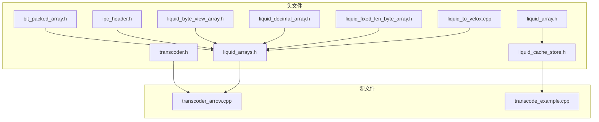
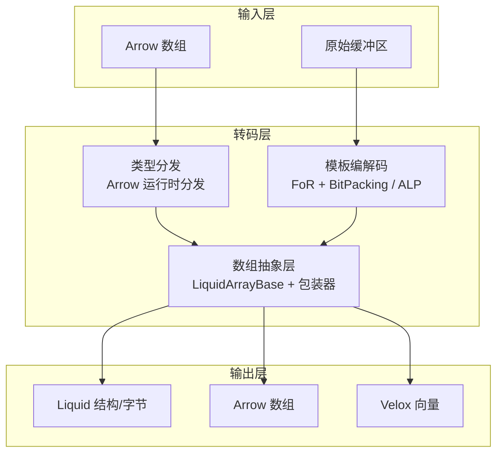
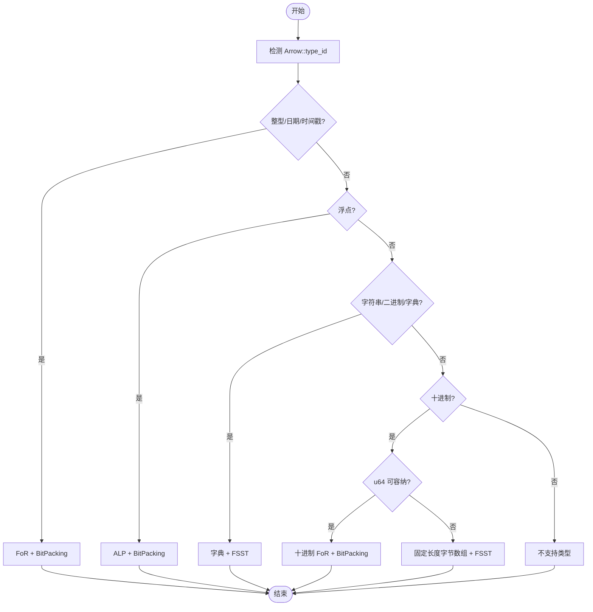
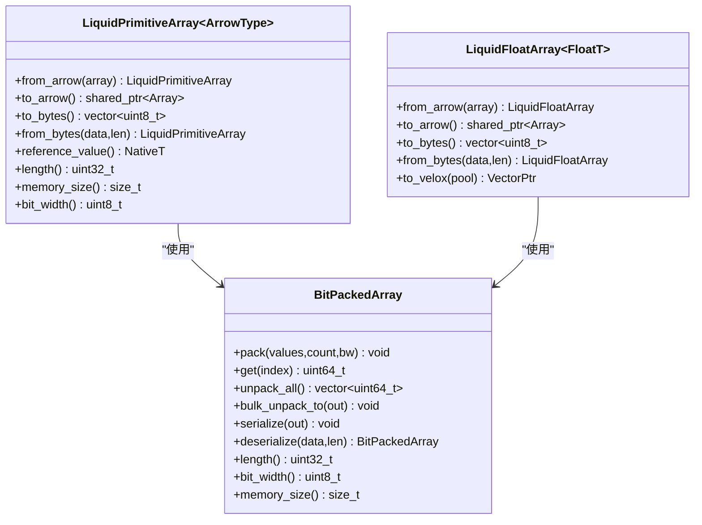
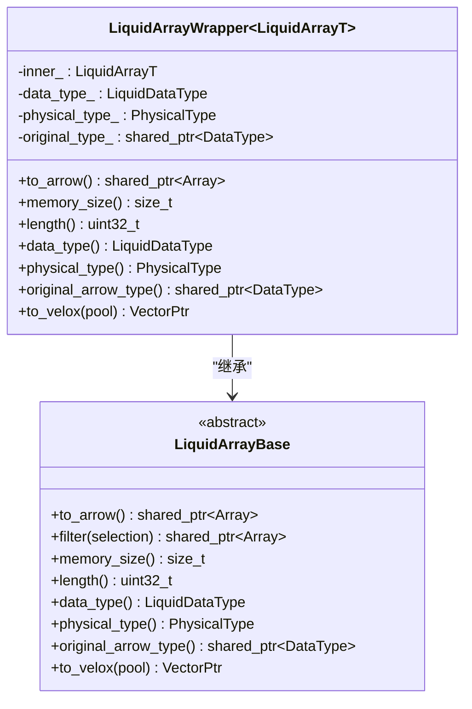
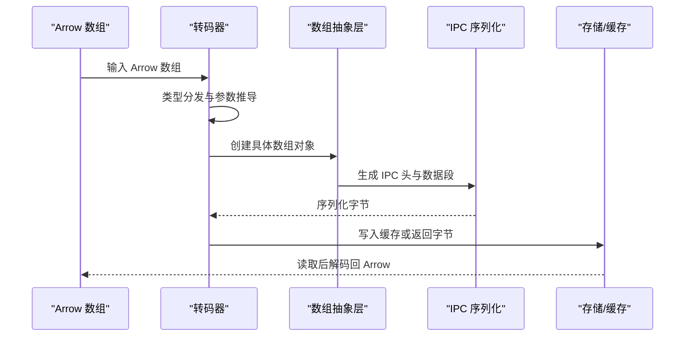
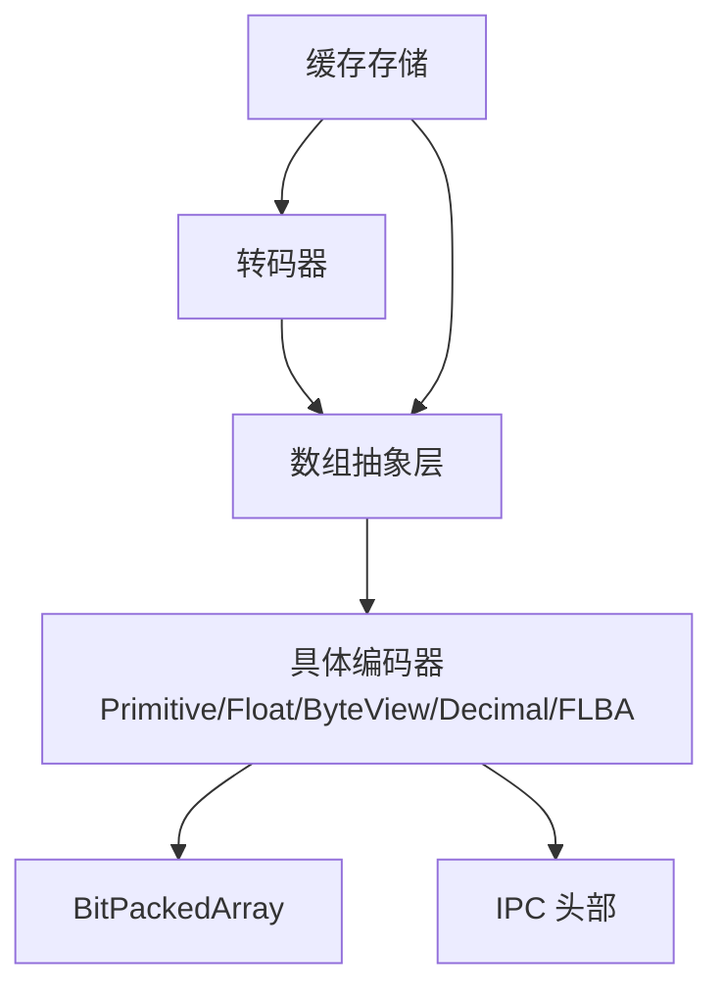
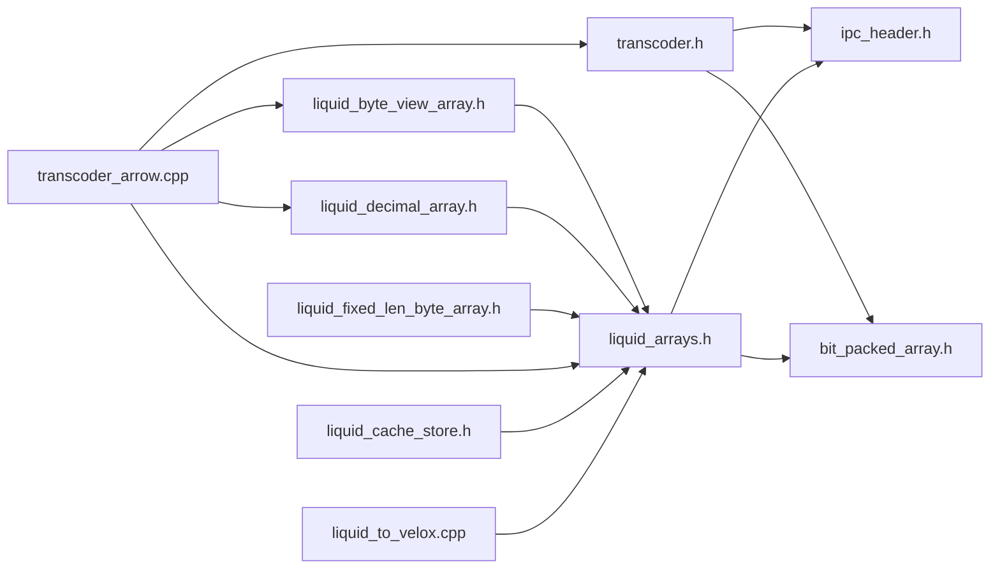

# 转码器架构设计

<cite>
**本文档引用的文件**
- [transcoder.h](file://include/liquid_cache/transcoder.h)
- [transcoder_arrow.cpp](file://src/transcoder_arrow.cpp)
- [liquid_arrays.h](file://include/liquid_cache/liquid_arrays.h)
- [liquid_array.h](file://include/liquid_cache/liquid_array.h)
- [liquid_cache_store.h](file://include/liquid_cache/liquid_cache_store.h)
- [bit_packed_array.h](file://include/liquid_cache/bit_packed_array.h)
- [ipc_header.h](file://include/liquid_cache/ipc_header.h)
- [liquid_byte_view_array.h](file://include/liquid_cache/liquid_byte_view_array.h)
- [liquid_decimal_array.h](file://include/liquid_cache/liquid_decimal_array.h)
- [liquid_fixed_len_byte_array.h](file://include/liquid_cache/liquid_fixed_len_byte_array.h)
- [liquid_to_velox.cpp](file://src/liquid_to_velox.cpp)
- [transcode_example.cpp](file://examples/transcode_example.cpp)
</cite>

## 目录
1. [引言](#引言)
2. [项目结构](#项目结构)
3. [核心组件](#核心组件)
4. [架构总览](#架构总览)
5. [详细组件分析](#详细组件分析)
6. [依赖关系分析](#依赖关系分析)
7. [性能考量](#性能考量)
8. [故障排除指南](#故障排除指南)
9. [结论](#结论)

## 引言
本技术文档系统性阐述液体缓存（Liquid Cache）转码器的架构设计与实现细节，重点覆盖以下方面：
- 类型分发机制：基于 Arrow 数据类型的运行时分发与编译期模板特化相结合的混合策略
- 模板元编程实现：通过 C++ 模板实现类型安全的编解码过程，确保零拷贝与高性能
- 多态接口设计：通过抽象基类与包装器实现统一的多态接口，支持不同数组类型的统一处理
- Arrow 与 Liquid 格式转换流程：涵盖数据布局变化、内存组织方式与访问模式差异
- 组件协作关系：转码器、数组抽象层与具体编码器之间的交互模式
- 设计决策的技术背景与权衡考虑：包括内存对齐、SIMD 加速、字典压缩与 FSST 压缩等

## 项目结构
该项目采用模块化设计，按功能域划分头文件与源文件：
- include/liquid_cache：核心库头文件，定义 IPC 协议、数组抽象、编码器与缓存存储
- src：转码器与平台特定实现（如 Velox 集成）
- examples：示例程序，演示从 Parquet 加载、转码到缓存存储与基准测试
- tests：单元测试与交叉验证

**图示来源**
- [transcoder.h](file://include/liquid_cache/transcoder.h)
- [transcoder_arrow.cpp](file://src/transcoder_arrow.cpp)
- [liquid_arrays.h](file://include/liquid_cache/liquid_arrays.h)
- [liquid_array.h](file://include/liquid_cache/liquid_array.h)
- [liquid_cache_store.h](file://include/liquid_cache/liquid_cache_store.h)
- [bit_packed_array.h](file://include/liquid_cache/bit_packed_array.h)
- [ipc_header.h](file://include/liquid_cache/ipc_header.h)
- [liquid_byte_view_array.h](file://include/liquid_cache/liquid_byte_view_array.h)
- [liquid_decimal_array.h](file://include/liquid_cache/liquid_decimal_array.h)
- [liquid_fixed_len_byte_array.h](file://include/liquid_cache/liquid_fixed_len_byte_array.h)
- [liquid_to_velox.cpp](file://src/liquid_to_velox.cpp)
- [transcode_example.cpp](file://examples/transcode_example.cpp)

**章节来源**
- [transcoder.h:1-360](file://include/liquid_cache/transcoder.h#L1-L360)
- [transcoder_arrow.cpp:1-746](file://src/transcoder_arrow.cpp#L1-L746)
- [liquid_arrays.h:1-800](file://include/liquid_cache/liquid_arrays.h#L1-L800)
- [liquid_array.h:1-159](file://include/liquid_cache/liquid_array.h#L1-L159)
- [liquid_cache_store.h:1-527](file://include/liquid_cache/liquid_cache_store.h#L1-L527)
- [bit_packed_array.h:1-486](file://include/liquid_cache/bit_packed_array.h#L1-L486)
- [ipc_header.h:1-118](file://include/liquid_cache/ipc_header.h#L1-L118)
- [liquid_byte_view_array.h:1-670](file://include/liquid_cache/liquid_byte_view_array.h#L1-L670)
- [liquid_decimal_array.h:1-404](file://include/liquid_cache/liquid_decimal_array.h#L1-L404)
- [liquid_fixed_len_byte_array.h:1-531](file://include/liquid_cache/liquid_fixed_len_byte_array.h#L1-L531)
- [liquid_to_velox.cpp:1-639](file://src/liquid_to_velox.cpp#L1-L639)
- [transcode_example.cpp:1-550](file://examples/transcode_example.cpp#L1-L550)

## 核心组件
- 转码器接口与类型分发
  - 纯 C++ 模板函数族：针对原始缓冲区进行原生类型编码（整型、浮点、日期时间等），提供类型安全的 FoR + BitPacking 编码路径
  - Arrow 依赖的转码入口：将 Arrow 数组转换为 Liquid 结构或序列化字节，支持复杂类型（字符串、二进制、字典、十进制等）
- 数组抽象层
  - 抽象基类与包装器：统一多态接口，屏蔽底层数组类型差异，支持 Arrow 与 Velox 的直接解码
  - 具体数组类型：整型/日期/时间戳、浮点、线性整型模型、字节视图数组、十进制数组、固定长度字节数组
- 编码器与解码器
  - BitPackedArray：位打包存储与批量解包，支持 AVX2 SIMD 加速
  - IPC 头部：二进制兼容的 IPC 协议头，标识逻辑类型与物理类型
  - 字符串/二进制压缩：字典 + FSST 压缩，结合前缀键与紧凑偏移表
  - 十进制压缩：小值路径（u64）与大值路径（固定长度字节数组 + FSST）
- 缓存存储
  - 列式缓存：以列批次为粒度缓存，支持投影与过滤
  - 内存预算与 LRU：可配置内存上限与逐出策略
  - 多引擎集成：同时支持 Arrow 与 Velox 的读取路径

**章节来源**
- [transcoder.h:35-360](file://include/liquid_cache/transcoder.h#L35-L360)
- [transcoder_arrow.cpp:34-351](file://src/transcoder_arrow.cpp#L34-L351)
- [liquid_array.h:29-85](file://include/liquid_cache/liquid_array.h#L29-L85)
- [liquid_arrays.h:81-248](file://include/liquid_cache/liquid_arrays.h#L81-L248)
- [bit_packed_array.h:22-486](file://include/liquid_cache/bit_packed_array.h#L22-L486)
- [ipc_header.h:16-118](file://include/liquid_cache/ipc_header.h#L16-L118)
- [liquid_byte_view_array.h:204-670](file://include/liquid_cache/liquid_byte_view_array.h#L204-L670)
- [liquid_decimal_array.h:69-404](file://include/liquid_cache/liquid_decimal_array.h#L69-L404)
- [liquid_fixed_len_byte_array.h:111-531](file://include/liquid_cache/liquid_fixed_len_byte_array.h#L111-L531)
- [liquid_cache_store.h:188-527](file://include/liquid_cache/liquid_cache_store.h#L188-L527)

## 架构总览
转码器整体采用“类型分发 + 模板元编程 + 多态接口”的混合架构：
- 类型分发：在 Arrow 侧通过运行时 type_id 分发；在纯 C++ 模板侧通过编译期模板特化与类型特征映射
- 模板元编程：通过模板参数推导与类型特征，保证编解码过程的类型安全与零开销抽象
- 多态接口：抽象基类与包装器统一不同数组类型的访问接口，支持 Arrow 与 Velox 的直接解码

**图示来源**
- [transcoder_arrow.cpp:34-351](file://src/transcoder_arrow.cpp#L34-L351)
- [transcoder.h:86-342](file://include/liquid_cache/transcoder.h#L86-L342)
- [liquid_array.h:29-85](file://include/liquid_cache/liquid_array.h#L29-L85)

## 详细组件分析

### 类型分发机制
- Arrow 侧分发：根据 Arrow::Type::type_id 进行 switch-case 分发，分别调用对应模板实例化的编码器
- 纯 C++ 模板分发：针对原始缓冲区的 transcode_primitive/transcode_float 模板函数，通过编译期模板参数确定具体类型与物理类型
- 物理类型映射：将 Arrow 类型映射到 PhysicalType 枚举，确保 IPC 头部一致性

**图示来源**
- [transcoder_arrow.cpp:44-351](file://src/transcoder_arrow.cpp#L44-L351)
- [transcoder.h:41-58](file://include/liquid_cache/transcoder.h#L41-L58)

**章节来源**
- [transcoder_arrow.cpp:44-351](file://src/transcoder_arrow.cpp#L44-L351)
- [transcoder.h:41-58](file://include/liquid_cache/transcoder.h#L41-L58)

### 模板元编程实现
- 类型特征映射：通过模板特化将 Arrow 类型映射到无符号类型与物理类型，确保 BitPackedArray 的正确使用
- 编译期断言：对浮点模板参数进行静态断言，确保只接受 float/double
- 模板实例化：针对不同 Arrow 类型生成专用的编码/解码路径，避免运行时分支

**图示来源**
- [liquid_arrays.h:95-248](file://include/liquid_cache/liquid_arrays.h#L95-L248)
- [liquid_arrays.h:679-800](file://include/liquid_cache/liquid_arrays.h#L679-L800)
- [bit_packed_array.h:39-486](file://include/liquid_cache/bit_packed_array.h#L39-L486)

**章节来源**
- [liquid_arrays.h:48-64](file://include/liquid_cache/liquid_arrays.h#L48-L64)
- [liquid_arrays.h:95-248](file://include/liquid_cache/liquid_arrays.h#L95-L248)
- [liquid_arrays.h:679-800](file://include/liquid_cache/liquid_arrays.h#L679-L800)
- [bit_packed_array.h:39-486](file://include/liquid_cache/bit_packed_array.h#L39-L486)

### 多态接口设计
- 抽象基类：LiquidArrayBase 提供统一的 to_arrow/filter/memory_size/length/data_type/original_arrow_type 接口
- 包装器：LiquidArrayWrapper 将任意具体数组类型适配为多态接口，支持原始 Arrow 类型的重新解释
- 运行时多态：通过虚函数实现运行时解码与过滤，同时保留模板编解码的高性能路径

**图示来源**
- [liquid_array.h:29-156](file://include/liquid_cache/liquid_array.h#L29-L156)

**章节来源**
- [liquid_array.h:29-156](file://include/liquid_cache/liquid_array.h#L29-L156)

### Arrow 与 Liquid 格式转换流程
- 整型/日期/时间戳：FoR（最小值参考）+ BitPacking，序列化包含 IPC 头、参考值、对齐填充与 BitPackedArray 数据
- 浮点：ALP（自适应无损浮点）+ BitPacking，包含指数参数、补丁索引与值、对齐填充与 BitPackedArray 数据
- 字符串/二进制：字典键（BitPackedArray）+ FSST 压缩值（符号表 + 压缩数据 + 偏移表）+ 共享前缀
- 十进制：小值路径（u64）采用 FoR + BitPacking；大值路径（Decimal128/256）采用固定长度字节数组 + FSST

**图示来源**
- [transcoder_arrow.cpp:34-351](file://src/transcoder_arrow.cpp#L34-L351)
- [liquid_arrays.h:199-238](file://include/liquid_cache/liquid_arrays.h#L199-L238)
- [liquid_byte_view_array.h:413-478](file://include/liquid_cache/liquid_byte_view_array.h#L413-L478)
- [liquid_decimal_array.h:307-339](file://include/liquid_cache/liquid_decimal_array.h#L307-L339)

**章节来源**
- [transcoder_arrow.cpp:34-351](file://src/transcoder_arrow.cpp#L34-L351)
- [liquid_arrays.h:199-238](file://include/liquid_cache/liquid_arrays.h#L199-L238)
- [liquid_byte_view_array.h:413-478](file://include/liquid_cache/liquid_byte_view_array.h#L413-L478)
- [liquid_decimal_array.h:307-339](file://include/liquid_cache/liquid_decimal_array.h#L307-L339)

### 组件协作关系
- 转码器与数组抽象层：转码器负责类型分发与参数准备，数组抽象层负责具体的编码/解码实现
- 数组抽象层与具体编码器：抽象层通过包装器统一接口，具体编码器实现高效的内存布局与访问模式
- 缓存存储与读取：缓存存储以列批次为单位管理数组，支持投影与过滤，并提供 Arrow/Velox 的直接读取路径

**图示来源**
- [transcoder_arrow.cpp:34-351](file://src/transcoder_arrow.cpp#L34-L351)
- [liquid_arrays.h:81-248](file://include/liquid_cache/liquid_arrays.h#L81-L248)
- [bit_packed_array.h:39-486](file://include/liquid_cache/bit_packed_array.h#L39-L486)
- [ipc_header.h:46-118](file://include/liquid_cache/ipc_header.h#L46-L118)
- [liquid_cache_store.h:188-527](file://include/liquid_cache/liquid_cache_store.h#L188-L527)

**章节来源**
- [transcoder_arrow.cpp:34-351](file://src/transcoder_arrow.cpp#L34-L351)
- [liquid_arrays.h:81-248](file://include/liquid_cache/liquid_arrays.h#L81-L248)
- [bit_packed_array.h:39-486](file://include/liquid_cache/bit_packed_array.h#L39-L486)
- [ipc_header.h:46-118](file://include/liquid_cache/ipc_header.h#L46-L118)
- [liquid_cache_store.h:188-527](file://include/liquid_cache/liquid_cache_store.h#L188-L527)

## 依赖关系分析
- 头文件依赖
  - 转码器头文件依赖 IPC 头部与位打包数组头文件
  - 数组抽象层依赖 IPC 头部与位打包数组
  - 字节视图数组依赖 FSST 压缩器与位打包数组
  - 缓存存储依赖数组抽象层与 LRU 策略
- 源文件依赖
  - 转码器实现依赖 Arrow API、Parquet Reader 与数组抽象层
  - Velox 集成依赖数组抽象层的具体实现

**图示来源**
- [transcoder.h:12-26](file://include/liquid_cache/transcoder.h#L12-L26)
- [liquid_arrays.h:22-24](file://include/liquid_cache/liquid_arrays.h#L22-L24)
- [liquid_byte_view_array.h:18-22](file://include/liquid_cache/liquid_byte_view_array.h#L18-L22)
- [liquid_decimal_array.h:21-24](file://include/liquid_cache/liquid_decimal_array.h#L21-L24)
- [liquid_fixed_len_byte_array.h:39-43](file://include/liquid_cache/liquid_fixed_len_byte_array.h#L39-L43)
- [transcoder_arrow.cpp:18-27](file://src/transcoder_arrow.cpp#L18-L27)
- [liquid_to_velox.cpp:7-13](file://src/liquid_to_velox.cpp#L7-L13)

**章节来源**
- [transcoder.h:12-26](file://include/liquid_cache/transcoder.h#L12-L26)
- [liquid_arrays.h:22-24](file://include/liquid_cache/liquid_arrays.h#L22-L24)
- [liquid_byte_view_array.h:18-22](file://include/liquid_cache/liquid_byte_view_array.h#L18-L22)
- [liquid_decimal_array.h:21-24](file://include/liquid_cache/liquid_decimal_array.h#L21-L24)
- [liquid_fixed_len_byte_array.h:39-43](file://include/liquid_cache/liquid_fixed_len_byte_array.h#L39-L43)
- [transcoder_arrow.cpp:18-27](file://src/transcoder_arrow.cpp#L18-L27)
- [liquid_to_velox.cpp:7-13](file://src/liquid_to_velox.cpp#L7-L13)

## 性能考量
- 内存对齐与布局
  - IPC 头部与数据段严格对齐至 8 字节边界，减少解码时的内存访问开销
  - BitPackedArray 使用块状布局（1024 元素）以提升 SIMD 访问效率
- SIMD 加速
  - BitPackedArray 在 AVX2 平台上针对常见位宽（1,2,4,8,16,32）提供专门的批量解包内核
- 压缩策略
  - 字典 + FSST 压缩显著降低字符串/二进制与大十进制值的存储体积
  - 线性整型模型（LinearInteger）在单调/近线性序列上进一步压缩残差
- 缓存与预算
  - 列式缓存与 LRU 策略结合内存预算限制，避免 OOM 并保持热点数据的高命中率

[本节为通用性能讨论，无需引用具体文件]

## 故障排除指南
- 类型不支持
  - 现象：转码结果为空或返回空指针
  - 排查：确认 Arrow 类型是否在分发表中，检查 Arrow 依赖版本与编译宏（如 LIQUID_ENABLE_VELOX）
- IPC 头部校验失败
  - 现象：反序列化抛出异常，提示魔数或版本不匹配
  - 排查：确认序列化端与反序列化端的 IPC 协议版本一致，检查字节序与对齐
- 内存不足或预算超限
  - 现象：插入缓存失败或触发逐出策略
  - 排查：调整最大缓存大小，监控内存使用统计，优化列投影与批大小

**章节来源**
- [transcoder_arrow.cpp:344-351](file://src/transcoder_arrow.cpp#L344-L351)
- [ipc_header.h:86-118](file://include/liquid_cache/ipc_header.h#L86-L118)
- [liquid_cache_store.h:491-517](file://include/liquid_cache/liquid_cache_store.h#L491-L517)

## 结论
该转码器架构通过“类型分发 + 模板元编程 + 多态接口”的组合，在保证类型安全与跨引擎兼容的同时，实现了高性能的 Arrow 与 Liquid 格式互转。其核心优势体现在：
- 混合分发策略：既满足 Arrow 运行时类型多样性，又通过模板实现编译期优化
- 统一抽象层：以多态接口屏蔽底层差异，简化上层调用
- 高效压缩与内存布局：FoR + BitPacking、ALP、字典 + FSST 等策略在不同数据类型上取得良好压缩比
- 可扩展性：新增类型只需实现相应数组类型与序列化格式，即可无缝接入现有框架