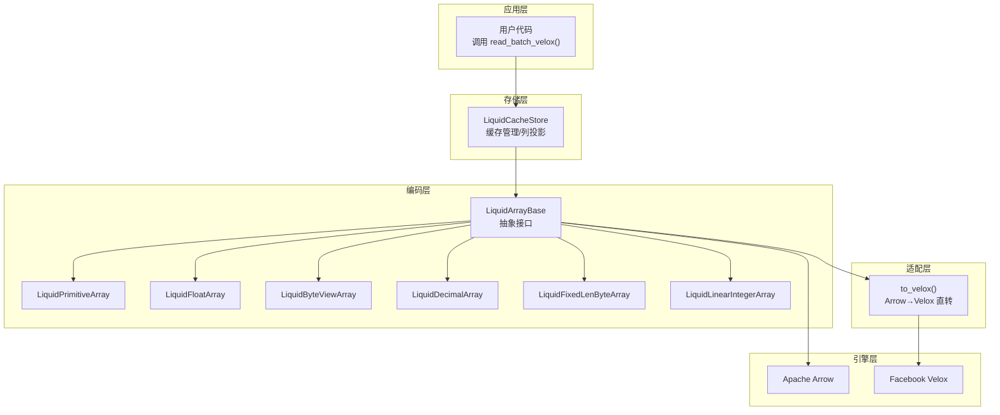
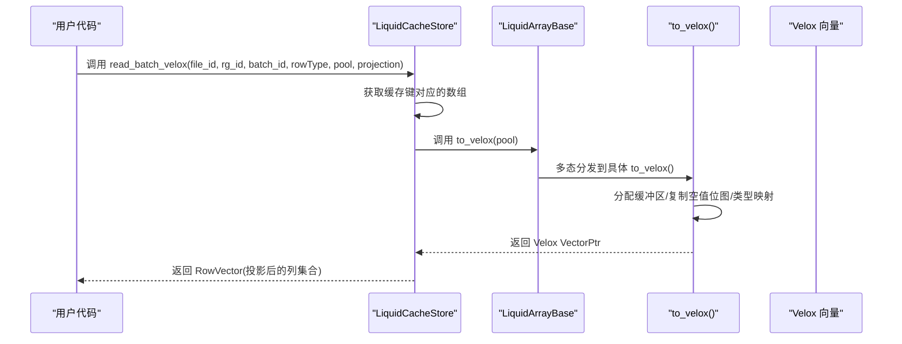
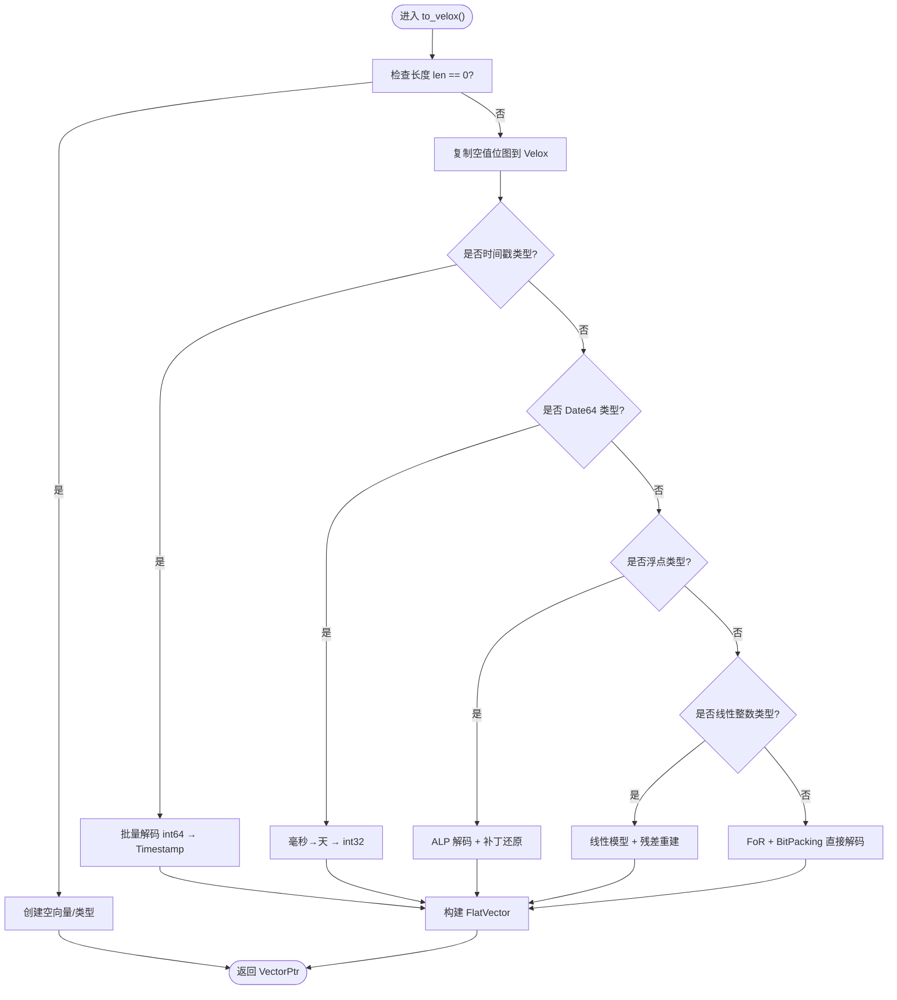
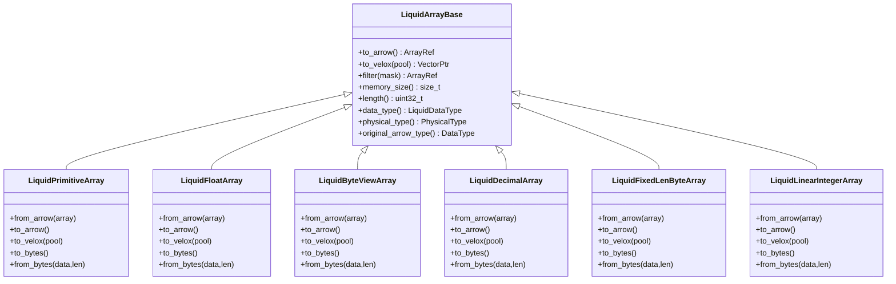
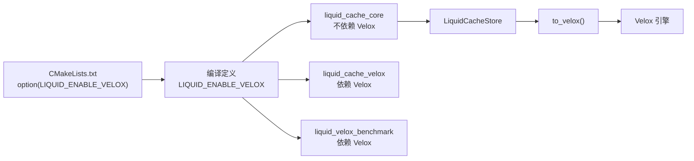

# 引擎适配层

<cite>
**本文档引用的文件**
- [liquid_to_velox.h](file://include/liquid_cache/liquid_to_velox.h)
- [liquid_to_velox.cpp](file://src/liquid_to_velox.cpp)
- [transcoder_arrow.cpp](file://src/transcoder_arrow.cpp)
- [liquid_cache_store.h](file://include/liquid_cache/liquid_cache_store.h)
- [liquid_array.h](file://include/liquid_cache/liquid_array.h)
- [liquid_arrays.h](file://include/liquid_cache/liquid_arrays.h)
- [CMakeLists.txt](file://CMakeLists.txt)
- [README.md](file://README.md)
- [velox_benchmark.cpp](file://examples/velox_benchmark.cpp)
- [test_velox_crossval.cpp](file://tests/test_velox_crossval.cpp)
</cite>

## 目录
1. [简介](#简介)
2. [项目结构](#项目结构)
3. [核心组件](#核心组件)
4. [架构总览](#架构总览)
5. [详细组件分析](#详细组件分析)
6. [依赖关系分析](#依赖关系分析)
7. [性能考虑](#性能考虑)
8. [故障排查指南](#故障排查指南)
9. [结论](#结论)
10. [附录](#附录)

## 简介
本文件系统化阐述液体缓存引擎适配层的设计与实现，重点覆盖：
- 多引擎支持的架构设计：以 Arrow 为通用数据交换格式，通过适配层统一接口，按需桥接到 Velox 向量引擎。
- to_velox() 方法的设计原理与实现要求：涵盖内存池管理、缓冲区分配、空值位图转换、时间戳与日期类型映射等。
- 条件编译宏 LIQUID_ENABLE_VELOX 的作用与配置方法：如何在构建阶段启用/禁用 Velox 集成。
- 不同引擎间的数据格式转换与性能考量：从 Arrow 到 Liquid 内存结构再到 Velox 向量的端到端路径。
- 引擎切换的最佳实践与性能优化建议：包括内存池复用、批量解码、类型映射一致性等。
- 代码示例路径：展示如何在不同引擎之间进行数据转换与适配。

## 项目结构
液体缓存采用分层设计：
- 顶层接口层：LiquidArrayBase 抽象出 to_arrow()/to_velox() 统一接口，配合类型擦除包装器实现多态。
- 编码层：LiquidPrimitiveArray/LiquidFloatArray/LiquidByteViewArray 等实现高效的列式编码与解码。
- 适配层：liquid_to_velox.* 提供 Arrow → Velox 的直接转换，绕过中间 Arrow 向量，提升性能。
- 存储层：LiquidCacheStore 负责缓存管理、内存预算、LRU 淘汰与列投影读取。
- 构建层：CMakeLists.txt 通过 LIQUID_ENABLE_VELOX 控制是否编译 Velox 相关目标及头文件路径。

**图表来源**
- [liquid_cache_store.h:436-468](file://include/liquid_cache/liquid_cache_store.h#L436-L468)
- [liquid_array.h:38-85](file://include/liquid_cache/liquid_array.h#L38-L85)
- [liquid_to_velox.h:23-135](file://include/liquid_cache/liquid_to_velox.h#L23-L135)
- [liquid_to_velox.cpp:1-639](file://src/liquid_to_velox.cpp#L1-L639)

**章节来源**
- [CMakeLists.txt:11-212](file://CMakeLists.txt#L11-L212)
- [README.md:84-162](file://README.md#L84-L162)

## 核心组件
- LiquidArrayBase：定义 to_arrow()/to_velox() 等统一接口，作为所有编码数组的抽象基类。
- LiquidArrayWrapper：模板包装器，将具体数组类型适配为 LiquidArrayBase，实现类型擦除与多态调用。
- LiquidCacheStore：列式缓存存储，支持内存预算、LRU 淘汰、列投影与批量读取；在启用 Velox 时提供 read_batch_velox()。
- to_velox() 实现：在 liquid_to_velox.cpp 中为各类 Liquid 数组提供直接到 Velox 向量的转换，包含内存池管理、缓冲区分配、空值位图复制、类型映射与特殊类型处理（时间戳、日期、十进制等）。

**章节来源**
- [liquid_array.h:38-85](file://include/liquid_cache/liquid_array.h#L38-L85)
- [liquid_cache_store.h:436-468](file://include/liquid_cache/liquid_cache_store.h#L436-L468)
- [liquid_to_velox.cpp:18-101](file://src/liquid_to_velox.cpp#L18-L101)

## 架构总览
引擎适配层的核心思想是“以 Arrow 为中立格式，按需桥接至目标引擎”。Liquid 数组在内存中以紧凑的编码形式保存，既可解码为 Arrow，也可直接转换为 Velox 向量，从而避免重复序列化/反序列化带来的开销。

**图表来源**
- [liquid_cache_store.h:452-467](file://include/liquid_cache/liquid_cache_store.h#L452-L467)
- [liquid_array.h:80-84](file://include/liquid_cache/liquid_array.h#L80-L84)
- [liquid_to_velox.cpp:564-634](file://src/liquid_to_velox.cpp#L564-L634)

## 详细组件分析

### to_velox() 设计原理与实现要点
- 接口统一：LiquidArrayBase 在启用 LIQUID_ENABLE_VELOX 时声明 to_velox()，所有具体数组类型通过模板包装器实现该接口，确保上层调用无需感知具体类型。
- 内存池管理：所有缓冲区（值缓冲、字符串缓冲、空值位图）均通过 Velox MemoryPool 分配，避免跨引擎内存泄漏与碎片化。
- 空值位图转换：copy_null_bitmap_to_velox() 将 BitPackedArray 的位图原样复制到 Velox Buffer，保持空值语义一致。
- 类型映射：
  - 基本数值类型：Int8/UInt8 → TINYINT，Int16/UInt16 → SMALLINT，Int32/UInt32 → INTEGER，Int64/UInt64 → BIGINT，Float32 → REAL，Float64 → DOUBLE。
  - 日期/时间戳：Date32/Date64 映射为 INTEGER；Timestamp 根据单位映射为 TIMESTAMP。
  - 十进制：ShortDecimal/LongDecimal 根据精度阈值选择 int64/int128 存储。
  - 字符串/二进制：ByteViewArray 转为 VARCHAR/VARBINARY 的 FlatVector<StringView>。
- 特殊类型处理：
  - 时间戳：int64_to_velox_timestamp() 根据物理类型单位进行构造。
  - Date64：毫秒到天的换算，转换为 Velox DATE（int32）。
  - 浮点：ALP 编码 + 补丁（patch）的还原与去重。
  - 线性整数：线性模型 + 残差重建，支持有符号/无符号范围饱和与裁剪。

**图表来源**
- [liquid_to_velox.cpp:25-101](file://src/liquid_to_velox.cpp#L25-L101)
- [liquid_to_velox.cpp:122-156](file://src/liquid_to_velox.cpp#L122-L156)
- [liquid_to_velox.cpp:168-260](file://src/liquid_to_velox.cpp#L168-L260)
- [liquid_to_velox.cpp:284-342](file://src/liquid_to_velox.cpp#L284-L342)
- [liquid_to_velox.cpp:352-399](file://src/liquid_to_velox.cpp#L352-L399)
- [liquid_to_velox.cpp:408-480](file://src/liquid_to_velox.cpp#L408-L480)

**章节来源**
- [liquid_to_velox.h:33-135](file://include/liquid_cache/liquid_to_velox.h#L33-L135)
- [liquid_to_velox.cpp:18-639](file://src/liquid_to_velox.cpp#L18-L639)

### 类型映射与内存布局
- 基本类型映射：PhysicalType → Velox Type/TypeKind，确保序列化头与运行时类型一致。
- 字符串/二进制：字典键 + FSST 字典 + BitPacking，两阶段解码：先解字典键，再拼接字符串块，最后构建 StringView。
- 十进制：精度 ≤ 18 使用 ShortDecimal(int64)，> 18 使用 LongDecimal(int128)。
- 线性整数：斜率/截距 + 残差数组（Int64），重建时进行范围饱和与裁剪。

**图表来源**
- [liquid_array.h:38-85](file://include/liquid_cache/liquid_array.h#L38-L85)
- [liquid_arrays.h:95-248](file://include/liquid_cache/liquid_arrays.h#L95-L248)
- [liquid_arrays.h:598-800](file://include/liquid_cache/liquid_arrays.h#L598-L800)
- [liquid_arrays.h:81-566](file://include/liquid_cache/liquid_arrays.h#L81-L566)

**章节来源**
- [liquid_arrays.h:65-80](file://include/liquid_cache/liquid_arrays.h#L65-L80)
- [liquid_to_velox.h:69-133](file://include/liquid_cache/liquid_to_velox.h#L69-L133)

### 引擎切换与接口统一策略
- 统一接口：所有数组类型在 LiquidArrayBase 中声明 to_arrow()/to_velox()，通过模板包装器实现多态调用，屏蔽具体类型差异。
- 条件编译：LIQUID_ENABLE_VELOX 控制是否编译 to_velox() 实现与相关头文件，避免在不启用 Velox 时引入依赖。
- 类型擦除：LiquidArrayWrapper 将具体数组对象封装为 LiquidArrayBase，便于缓存存储与上层调用。

**章节来源**
- [liquid_array.h:80-84](file://include/liquid_cache/liquid_array.h#L80-L84)
- [liquid_cache_store.h:436-468](file://include/liquid_cache/liquid_cache_store.h#L436-L468)

### 内存池管理与缓冲区分配
- 所有缓冲区（值缓冲、字符串缓冲、空值位图）均通过 facebook::velox::memory::MemoryPool 分配，确保与 Velox 内存子系统一致。
- 字符串数组采用两段式缓冲：StringView 数组 + 字节块缓冲，减少指针间接与碎片化。
- 空值位图复制：使用 aligned buffer 分配器，保证对齐与容量设置正确。

**章节来源**
- [liquid_to_velox.cpp:33-43](file://src/liquid_to_velox.cpp#L33-L43)
- [liquid_to_velox.cpp:312-341](file://src/liquid_to_velox.cpp#L312-L341)

### 条件编译宏 LIQUID_ENABLE_VELOX 的作用与配置
- 作用：控制是否启用 Velox 集成，决定是否编译 liquid_to_velox.cpp 以及是否包含 Velox 头文件。
- 配置方法：
  - 在 CMake 配置阶段设置 -DLIQUID_ENABLE_VELOX=ON，并提供 -DVELOX_PREFIX=/path/to/velox/build。
  - 构建系统会自动替换 Arrow/Parquet 头文件与库为 Velox bundled 版本，确保 ABI 兼容。
  - 目标 liquid_cache_velox 与 liquid_velox_benchmark 仅在启用时生成。

**章节来源**
- [CMakeLists.txt:11-212](file://CMakeLists.txt#L11-L212)
- [README.md:84-162](file://README.md#L84-L162)

### 数据格式转换与性能考量
- Arrow → Liquid：transcoder_arrow.cpp 提供类型分派与编码，覆盖整型/浮点/字符串/十进制/时间戳等，支持字典 + FSST 压缩。
- Liquid → Velox：to_velox() 直接解码到 Velox 向量，避免中间 Arrow 向量的额外拷贝与类型转换开销。
- 性能优化点：
  - 批量解码：bulk_unpack_to() 一次性解包位打包数据，减少循环开销。
  - 内存池复用：同一查询生命周期内复用 MemoryPool，降低分配/回收成本。
  - 类型映射一致性：PhysicalType 与 Velox Type 映射严格对应，避免运行时类型转换。
  - 字符串去重：FSST 字典 + 词典键，显著降低字符串存储与传输成本。

**章节来源**
- [transcoder_arrow.cpp:44-351](file://src/transcoder_arrow.cpp#L44-L351)
- [liquid_to_velox.cpp:25-101](file://src/liquid_to_velox.cpp#L25-L101)

### 引擎切换最佳实践与性能优化建议
- 最佳实践：
  - 在构建阶段明确启用/禁用 Velox，避免运行时条件分支带来的不确定性。
  - 使用列投影与行过滤（Selection）减少不必要的解码与内存占用。
  - 在热点查询中复用 MemoryPool，避免频繁分配。
  - 对高基数字符串优先使用 FSST 字典压缩。
- 性能优化：
  - 优先使用 to_velox() 直转，而非先 to_arrow() 再转换。
  - 合理设置内存预算与 LRU 策略，平衡缓存命中与内存占用。
  - 对时间戳与日期进行单位归一化，减少类型转换与计算。

**章节来源**
- [liquid_cache_store.h:436-468](file://include/liquid_cache/liquid_cache_store.h#L436-L468)
- [README.md:233-312](file://README.md#L233-L312)

### 代码示例（路径指引）
- 从内存中的 Parquet 数据加载到 LiquidCacheStore 并读取为 Velox 向量：
  - [examples/velox_benchmark.cpp:665-667](file://examples/velox_benchmark.cpp#L665-L667)
  - [examples/velox_benchmark.cpp:512-533](file://examples/velox_benchmark.cpp#L512-L533)
- 单列/多列读取与投影：
  - [examples/velox_benchmark.cpp:527-533](file://examples/velox_benchmark.cpp#L527-L533)
- 交叉验证（Arrow → Liquid → Velox 一致性）：
  - [tests/test_velox_crossval.cpp:40-60](file://tests/test_velox_crossval.cpp#L40-L60)
  - [tests/test_velox_crossval.cpp:180-220](file://tests/test_velox_crossval.cpp#L180-L220)

**章节来源**
- [velox_benchmark.cpp:665-667](file://examples/velox_benchmark.cpp#L665-L667)
- [test_velox_crossval.cpp:40-60](file://tests/test_velox_crossval.cpp#L40-L60)

## 依赖关系分析
- 构建依赖：CMakeLists.txt 通过 option(LIQUID_ENABLE_VELOX) 与 find_package 控制依赖发现与目标生成。
- 运行时依赖：启用 Velox 时，所有目标统一使用 Velox bundled Arrow 18，确保 ABI 兼容；否则使用系统 Arrow 24。
- 接口耦合：LiquidArrayBase 与 LiquidArrayWrapper 降低具体数组类型与上层调用的耦合度；to_velox() 仅在启用宏时编译，避免无用依赖。

**图表来源**
- [CMakeLists.txt:11-212](file://CMakeLists.txt#L11-L212)
- [liquid_cache_store.h:436-468](file://include/liquid_cache/liquid_cache_store.h#L436-L468)

**章节来源**
- [CMakeLists.txt:11-212](file://CMakeLists.txt#L11-L212)
- [README.md:127-162](file://README.md#L127-L162)

## 性能考虑
- 解码路径对比：
  - Arrow 路径：Parquet → Arrow RecordBatch → Arrow Array → Arrow 计算/过滤 → 用户代码。
  - Liquid→Velox 路径：Parquet → Liquid 结构 → Velox Vector（直转）。
- 关键优化点：
  - 批量解码与位打包：FoR + BitPacking 减少存储与解码成本。
  - 字符串压缩：FSST 字典 + 词典键，显著降低带宽与内存占用。
  - 内存池：统一由 Velox MemoryManager 管理，减少分配开销。
- 基准测试：README.md 提供了详细的基准测试参数与输出指标，可用于评估不同场景下的性能收益。

**章节来源**
- [README.md:233-312](file://README.md#L233-L312)

## 故障排查指南
- 构建期错误：
  - “No function registered with name: min_max”：确保使用 -Wl,--whole-archive 包裹 libarrow.a。
  - ABI 不兼容：启用 LIQUID_ENABLE_VELOX 时必须提供正确的 VELOX_PREFIX，使所有目标使用 Velox bundled Arrow 18。
- 运行期错误：
  - 类型映射不匹配：确认 PhysicalType 与 Velox Type 映射一致，特别是时间戳与十进制类型。
  - 内存不足：调整内存预算与 LRU 策略，或减少列投影与批大小。
- 验证方法：
  - 使用交叉验证测试（tests/test_velox_crossval.cpp）验证 Arrow → Liquid → Velox 的一致性。
  - 使用基准测试（examples/velox_benchmark.cpp）对比两种路径的性能差异。

**章节来源**
- [README.md:345-378](file://README.md#L345-L378)
- [test_velox_crossval.cpp:405-429](file://tests/test_velox_crossval.cpp#L405-L429)

## 结论
引擎适配层通过“以 Arrow 为中立格式 + 按需桥接”的策略，实现了对多引擎（尤其是 Velox）的无缝适配。to_velox() 方法在内存池管理、类型映射与特殊类型处理方面进行了精心设计，结合批量解码与字符串压缩等优化手段，在保证正确性的前提下显著提升了性能。通过条件编译与构建配置，项目在功能与性能之间取得了良好的平衡，并提供了完善的测试与基准工具用于验证与优化。

## 附录
- 关键实现文件路径：
  - [include/liquid_cache/liquid_to_velox.h](file://include/liquid_cache/liquid_to_velox.h)
  - [src/liquid_to_velox.cpp](file://src/liquid_to_velox.cpp)
  - [src/transcoder_arrow.cpp](file://src/transcoder_arrow.cpp)
  - [include/liquid_cache/liquid_cache_store.h](file://include/liquid_cache/liquid_cache_store.h)
  - [include/liquid_cache/liquid_array.h](file://include/liquid_cache/liquid_array.h)
  - [include/liquid_cache/liquid_arrays.h](file://include/liquid_cache/liquid_arrays.h)
  - [CMakeLists.txt](file://CMakeLists.txt)
  - [README.md](file://README.md)
  - [examples/velox_benchmark.cpp](file://examples/velox_benchmark.cpp)
  - [tests/test_velox_crossval.cpp](file://tests/test_velox_crossval.cpp)