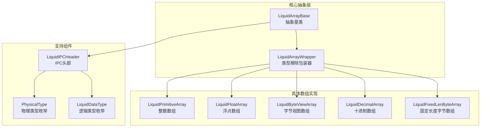
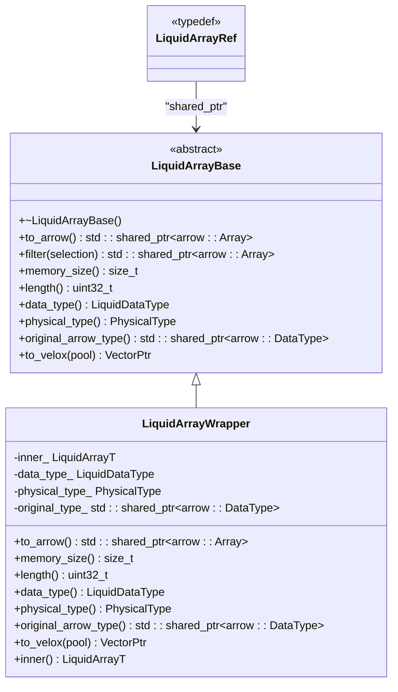
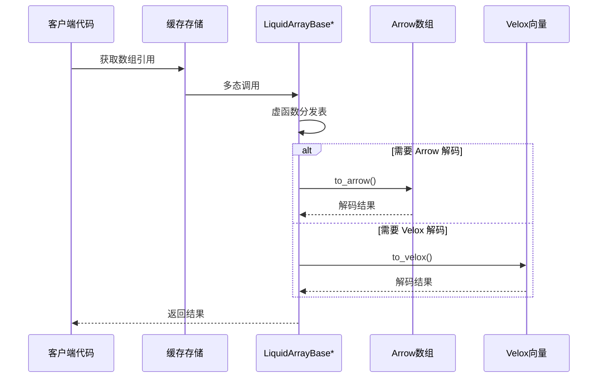
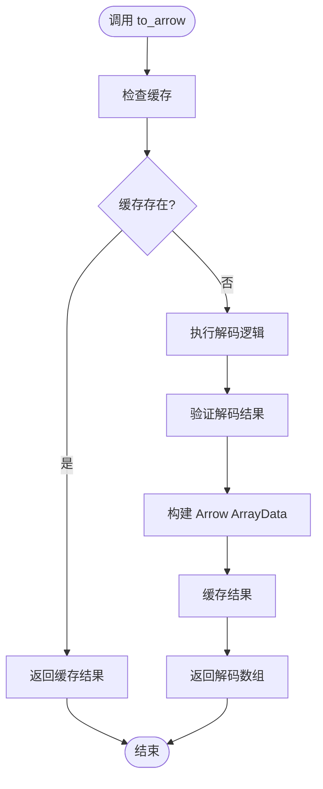
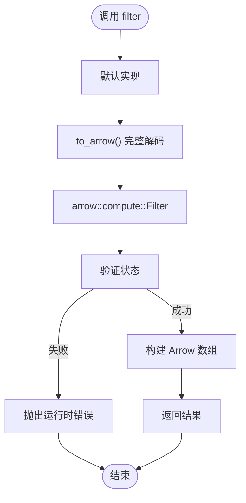
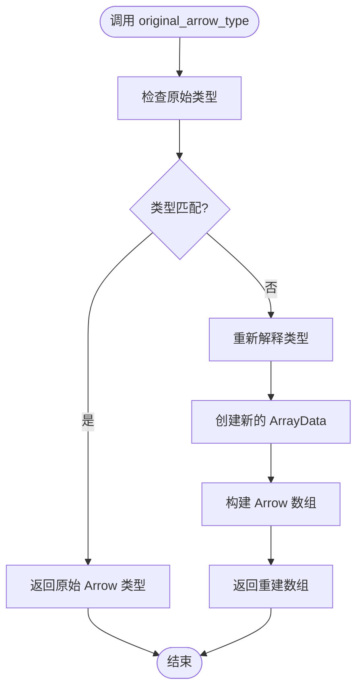
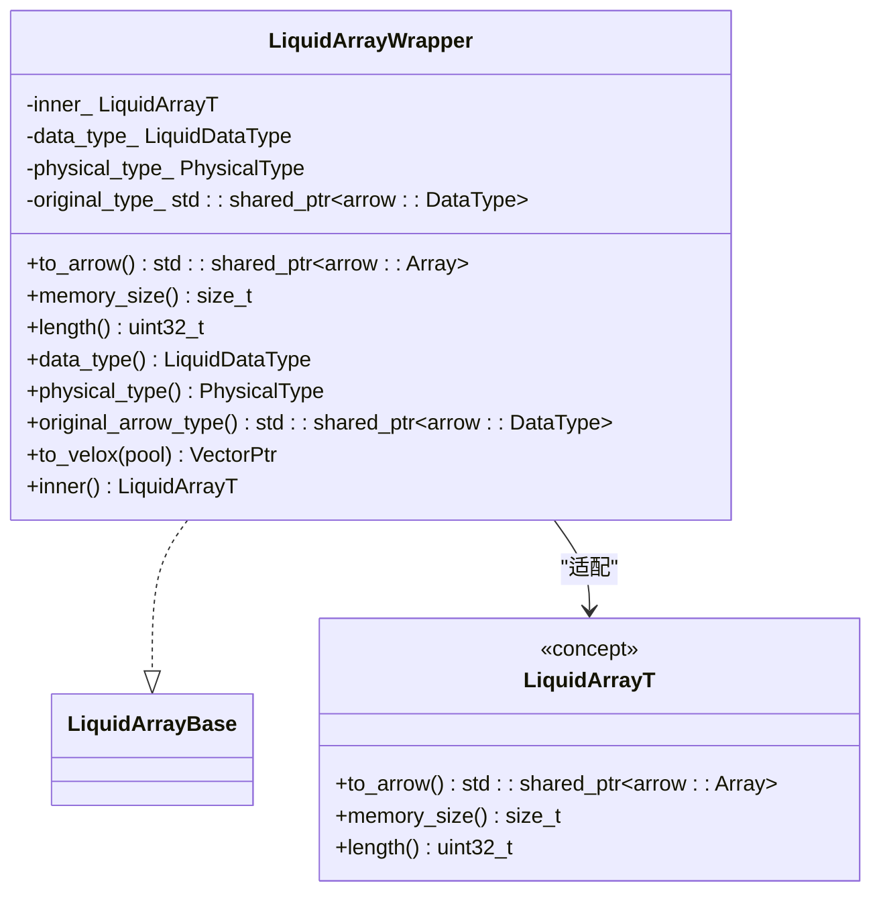
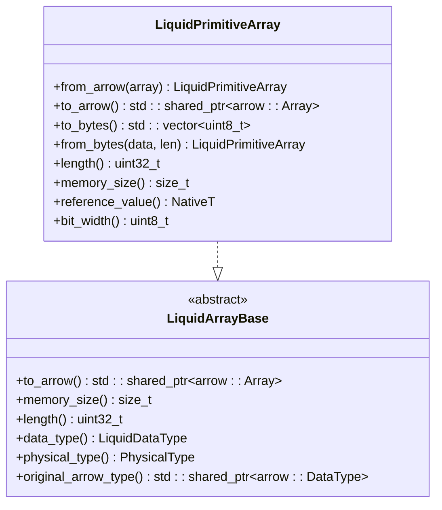
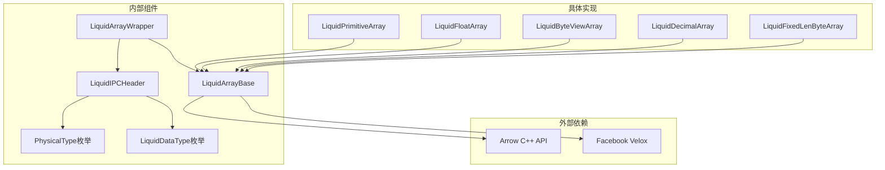
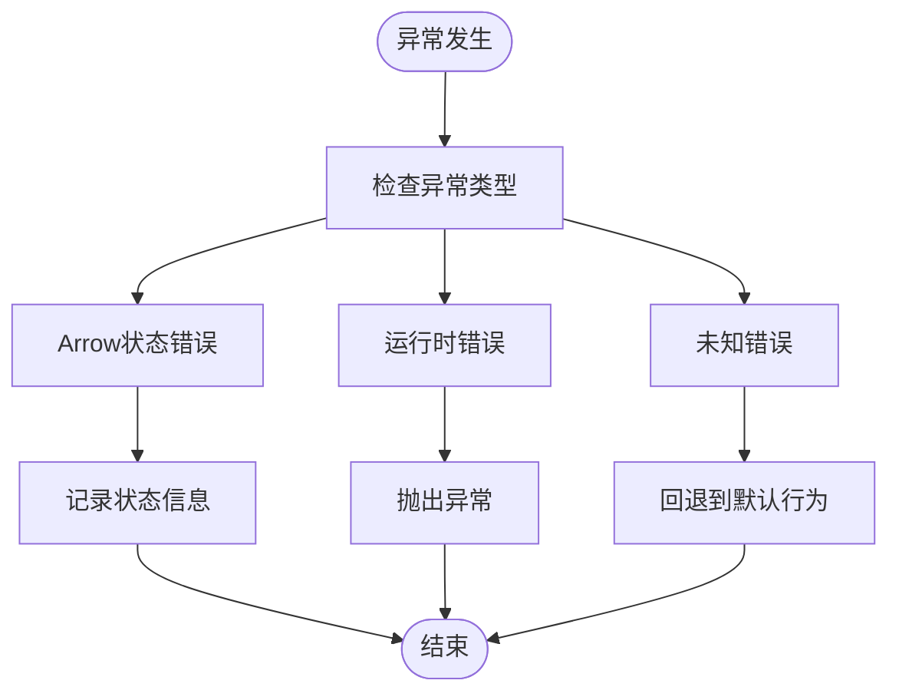

# 抽象基类设计

<cite>
**本文档引用的文件**
- [liquid_array.h](file://include/liquid_cache/liquid_array.h)
- [liquid_arrays.h](file://include/liquid_cache/liquid_arrays.h)
- [liquid_byte_view_array.h](file://include/liquid_cache/liquid_byte_view_array.h)
- [liquid_decimal_array.h](file://include/liquid_cache/liquid_decimal_array.h)
- [liquid_fixed_len_byte_array.h](file://include/liquid_cache/liquid_fixed_len_byte_array.h)
- [ipc_header.h](file://include/liquid_cache/ipc_header.h)
- [transcoder.h](file://include/liquid_cache/transcoder.h)
- [liquid_to_velox.h](file://include/liquid_cache/liquid_to_velox.h)
- [liquid_to_velox.cpp](file://src/liquid_to_velox.cpp)
- [test_roundtrip.cpp](file://tests/test_roundtrip.cpp)
</cite>

## 目录
1. [引言](#引言)
2. [项目结构](#项目结构)
3. [核心组件](#核心组件)
4. [架构概览](#架构概览)
5. [详细组件分析](#详细组件分析)
6. [依赖关系分析](#依赖关系分析)
7. [性能考虑](#性能考虑)
8. [故障排除指南](#故障排除指南)
9. [结论](#结论)

## 引言

LiquidArrayBase 是 Liquid Cache C++ 实现的核心抽象基类，它为所有液化编码数组类型提供统一的多态接口。该设计借鉴了 Rust 中的 `LiquidArray` trait，通过虚函数表实现了类型擦除的多态机制，使得缓存存储能够持有异构数组而无需序列化。

本文档深入分析了抽象基类的设计理念、虚函数表设计、纯虚函数接口定义以及多态实现机制，并详细说明了每个虚函数的作用和实现要求。

## 项目结构

该项目采用模块化的头文件组织方式，主要包含以下核心模块：

**图表来源**
- [liquid_array.h:29-85](file://include/liquid_cache/liquid_array.h#L29-L85)
- [liquid_arrays.h:95-248](file://include/liquid_cache/liquid_arrays.h#L95-L248)
- [ipc_header.h:16-44](file://include/liquid_cache/ipc_header.h#L16-L44)

**章节来源**
- [liquid_array.h:1-159](file://include/liquid_cache/liquid_array.h#L1-L159)
- [liquid_arrays.h:1-800](file://include/liquid_cache/liquid_arrays.h#L1-L800)

## 核心组件

### LiquidArrayBase 抽象基类

LiquidArrayBase 是整个数组体系的基石，定义了所有液化数组必须实现的标准接口：

**图表来源**
- [liquid_array.h:38-85](file://include/liquid_cache/liquid_array.h#L38-L85)
- [liquid_array.h:98-146](file://include/liquid_cache/liquid_array.h#L98-L146)

### 虚函数表设计

抽象基类通过虚函数表实现多态机制，每个派生类都必须提供完整的虚函数实现：

| 虚函数 | 返回类型 | 必需性 | 描述 |
|--------|----------|--------|------|
| `to_arrow()` | `std::shared_ptr<arrow::Array>` | 纯虚 | 完整解码为 Arrow 数组 |
| `filter()` | `std::shared_ptr<arrow::Array>` | 可选重写 | 基于布尔选择掩码过滤 |
| `memory_size()` | `size_t` | 纯虚 | 液化编码表示的内存大小（字节） |
| `length()` | `uint32_t` | 纯虚 | 元素数量 |
| `data_type()` | `LiquidDataType` | 纯虚 | 逻辑编码类型 |
| `physical_type()` | `PhysicalType` | 纯虚 | 物理类型 |
| `original_arrow_type()` | `std::shared_ptr<arrow::DataType>` | 纯虚 | 原始 Arrow 数据类型 |
| `to_velox()` | `VectorPtr` | 可选 | 直接解码到 Velox 向量 |

**章节来源**
- [liquid_array.h:38-85](file://include/liquid_cache/liquid_array.h#L38-L85)

## 架构概览

LiquidArrayBase 的设计遵循了面向对象的抽象原则，通过类型擦除实现异构数组的统一管理：

**图表来源**
- [liquid_array.h:40-84](file://include/liquid_cache/liquid_array.h#L40-L84)

### 类型安全保证

通过以下机制确保类型安全：

1. **纯虚函数约束**：所有必需接口都必须由派生类实现
2. **类型擦除包装器**：`LiquidArrayWrapper` 确保类型一致性
3. **原始类型重建**：`original_arrow_type()` 提供正确的类型重建信息
4. **编译时检查**：模板参数验证派生类的接口完整性

**章节来源**
- [liquid_array.h:98-156](file://include/liquid_cache/liquid_array.h#L98-L156)

## 详细组件分析

### 虚函数接口详解

#### to_arrow() 方法

`to_arrow()` 是最核心的方法，负责将液化编码完全解码为 Arrow 数组：

**图表来源**
- [liquid_array.h:109-121](file://include/liquid_cache/liquid_array.h#L109-L121)

#### filter() 方法

默认实现基于 Arrow 计算库进行过滤，派生类可重写以实现优化的无完整解码过滤：

**图表来源**
- [liquid_array.h:51-59](file://include/liquid_cache/liquid_array.h#L51-L59)

#### memory_size() 和 length() 方法

这两个方法提供数组的基本元数据信息：

- `memory_size()`：返回液化编码表示的内存占用（字节）
- `length()`：返回元素数量（uint32_t）

**章节来源**
- [liquid_array.h:63-67](file://include/liquid_cache/liquid_array.h#L63-L67)

#### data_type() 和 physical_type() 方法

提供类型标识信息用于序列化和反序列化过程：

- `data_type()`：逻辑编码类型（Integer、Float、ByteViewArray 等）
- `physical_type()`：物理存储类型（Int8、UInt64、Float32 等）

**章节来源**
- [liquid_array.h:71-74](file://include/liquid_cache/liquid_array.h#L71-L74)

#### original_arrow_type() 方法

确保正确的类型重建，处理如时间戳等需要特殊处理的类型：

**图表来源**
- [liquid_array.h:113-119](file://include/liquid_cache/liquid_array.h#L113-L119)

### LiquidArrayWrapper 类

`LiquidArrayWrapper` 是类型擦除的关键组件，它将任何具体的液化数组类型适配为 `LiquidArrayBase`：

**图表来源**
- [liquid_array.h:98-146](file://include/liquid_cache/liquid_array.h#L98-L146)

**章节来源**
- [liquid_array.h:98-156](file://include/liquid_cache/liquid_array.h#L98-L156)

### 具体数组实现示例

#### LiquidPrimitiveArray 实现

整数数组实现展示了如何正确继承和实现抽象基类：

**图表来源**
- [liquid_arrays.h:95-248](file://include/liquid_cache/liquid_arrays.h#L95-L248)

**章节来源**
- [liquid_arrays.h:95-248](file://include/liquid_cache/liquid_arrays.h#L95-L248)

#### LiquidFloatArray 实现

浮点数组实现展示了更复杂的编码算法：

**章节来源**
- [liquid_arrays.h:599-800](file://include/liquid_cache/liquid_arrays.h#L599-L800)

## 依赖关系分析

抽象基类的设计确保了清晰的依赖层次：

**图表来源**
- [liquid_array.h:10-25](file://include/liquid_cache/liquid_array.h#L10-L25)
- [ipc_header.h:16-44](file://include/liquid_cache/ipc_header.h#L16-L44)

### 组件耦合度分析

- **低耦合**：抽象基类与具体实现之间通过接口分离
- **高内聚**：每个具体实现专注于特定的数据类型
- **类型安全**：通过模板和类型擦除确保运行时类型安全

**章节来源**
- [liquid_array.h:1-159](file://include/liquid_cache/liquid_array.h#L1-L159)

## 性能考虑

### 虚函数调用开销

- **虚函数表查找**：每次多态调用都有轻微的性能开销
- **内联优化**：编译器可以对简单方法进行内联优化
- **缓存友好**：类型擦除包装器提供了稳定的内存布局

### 内存管理

- **智能指针**：使用 `std::shared_ptr` 自动管理生命周期
- **RAII 模式**：析构函数自动清理资源
- **零拷贝设计**：尽可能复用 Arrow Buffer

### 解码策略

- **延迟解码**：仅在需要时才进行完整解码
- **缓存机制**：避免重复解码相同数据
- **增量解码**：支持部分解码以提高性能

## 故障排除指南

### 常见问题及解决方案

#### 运行时错误处理

抽象基类提供了完善的错误处理机制：

**图表来源**
- [liquid_array.h:55-57](file://include/liquid_cache/liquid_array.h#L55-L57)

#### 调试技巧

1. **启用详细日志**：检查 Arrow 状态和错误信息
2. **验证类型兼容性**：确保 `original_arrow_type()` 正确
3. **监控内存使用**：使用 `memory_size()` 检查内存占用
4. **单元测试**：利用现有的测试套件验证实现正确性

**章节来源**
- [test_roundtrip.cpp:32-54](file://tests/test_roundtrip.cpp#L32-L54)

## 结论

LiquidArrayBase 抽象基类设计体现了现代 C++ 面向对象设计的最佳实践。通过精心设计的虚函数接口、类型擦除机制和多态实现，该设计成功地解决了异构数组存储的技术挑战。

### 设计优势

1. **类型安全**：通过纯虚函数和类型擦除确保运行时类型安全
2. **扩展性**：新数组类型的添加只需实现必要的接口
3. **性能优化**：支持直接解码到目标格式（Arrow 或 Velox）
4. **维护性**：清晰的接口分离便于代码维护和测试

### 技术创新点

1. **混合解码策略**：支持从 Arrow 到 Velox 的直接转换
2. **智能缓存**：避免重复解码操作
3. **二进制兼容性**：与 Rust 实现保持二进制兼容
4. **完整的测试覆盖**：提供全面的功能和性能测试

该设计为大规模数据缓存系统提供了坚实的基础，既保证了性能又保持了代码的可维护性和扩展性。