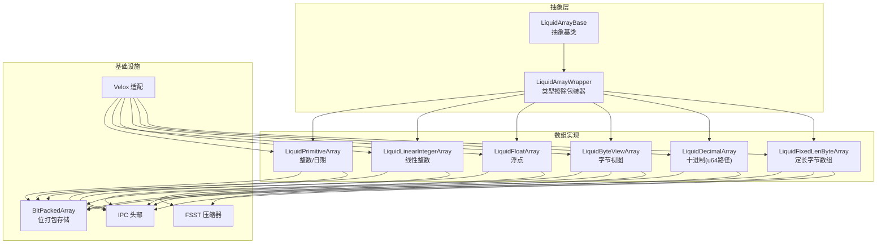
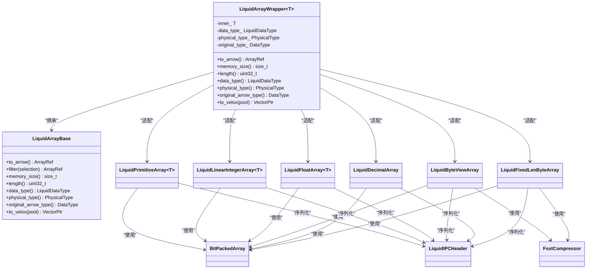
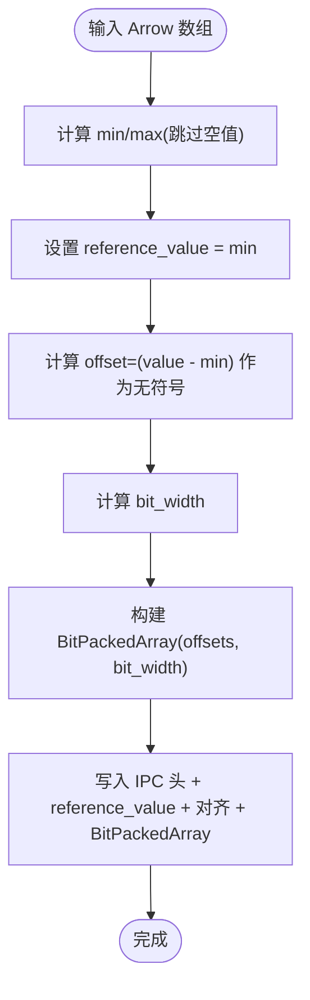
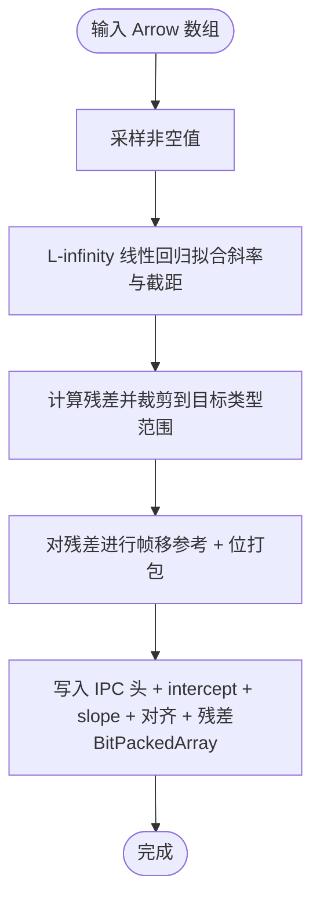
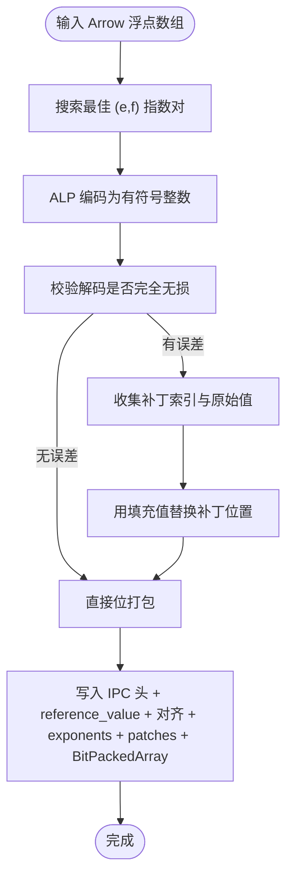
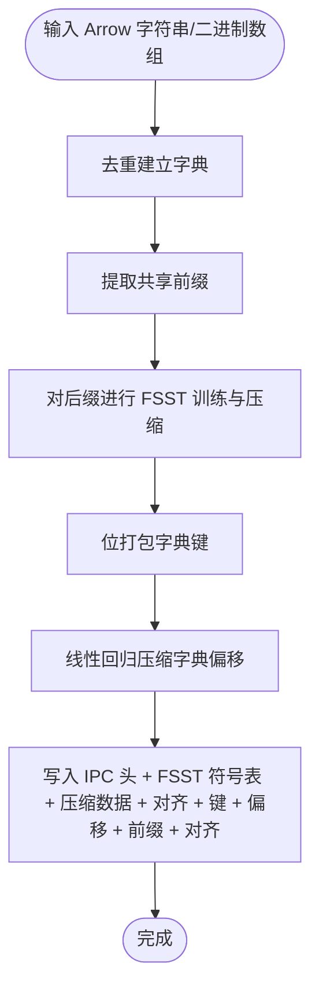
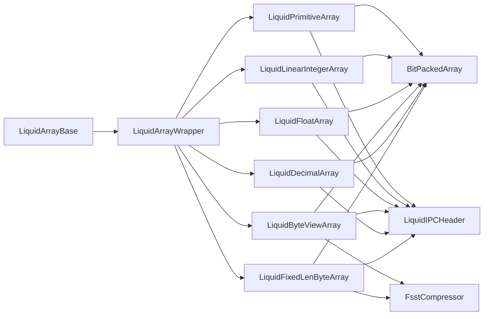
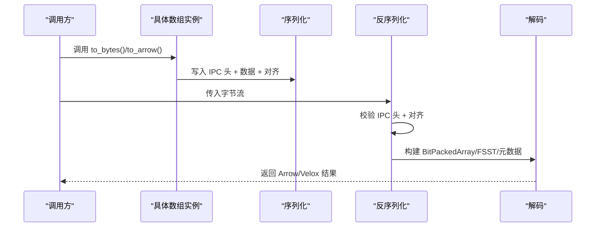

# 数组抽象层

<cite>
**本文档引用的文件**
- [liquid_array.h](file://include/liquid_cache/liquid_array.h)
- [liquid_arrays.h](file://include/liquid_cache/liquid_arrays.h)
- [ipc_header.h](file://include/liquid_cache/ipc_header.h)
- [liquid_to_velox.h](file://include/liquid_cache/liquid_to_velox.h)
- [liquid_to_velox.cpp](file://src/liquid_to_velox.cpp)
- [liquid_byte_view_array.h](file://include/liquid_cache/liquid_byte_view_array.h)
- [liquid_decimal_array.h](file://include/liquid_cache/liquid_decimal_array.h)
- [liquid_fixed_len_byte_array.h](file://include/liquid_cache/liquid_fixed_len_byte_array.h)
- [bit_packed_array.h](file://include/liquid_cache/bit_packed_array.h)
- [fsst.h](file://include/liquid_cache/fsst.h)
- [transcoder.h](file://include/liquid_cache/transcoder.h)
</cite>

## 目录
1. [简介](#简介)
2. [项目结构](#项目结构)
3. [核心组件](#核心组件)
4. [架构总览](#架构总览)
5. [详细组件分析](#详细组件分析)
6. [依赖关系分析](#依赖关系分析)
7. [性能考量](#性能考量)
8. [故障排查指南](#故障排查指南)
9. [结论](#结论)
10. [附录](#附录)

## 简介
本文件系统性阐述 liquid-cache-cpp 的数组抽象层设计与实现，重点覆盖：
- 类型擦除与多态：通过抽象基类与包装器实现统一接口，屏蔽具体数组类型差异
- Arrow/Velox 适配层：支持 Arrow 原生解码与 Velox 直接解码路径
- 序列化/反序列化：IPC 头部格式、数据对齐与边界检查
- 典型数组类型：整数、线性整数、浮点、字节视图、定长字节数组、十进制等
- 扩展指南：如何新增数组类型并保证性能与兼容性

## 项目结构
该仓库采用“头文件库 + 源文件实现”的组织方式，核心位于 include/liquid_cache 下，包含数组抽象、编码器、IPC 头部、FSST 压缩、以及与 Velox 的桥接模块。

图表来源
- [liquid_array.h:29-85](file://include/liquid_cache/liquid_array.h#L29-L85)
- [liquid_arrays.h:95-248](file://include/liquid_cache/liquid_arrays.h#L95-L248)
- [liquid_byte_view_array.h:204-411](file://include/liquid_cache/liquid_byte_view_array.h#L204-L411)
- [liquid_decimal_array.h:69-305](file://include/liquid_cache/liquid_decimal_array.h#L69-L305)
- [liquid_fixed_len_byte_array.h:111-192](file://include/liquid_cache/liquid_fixed_len_byte_array.h#L111-L192)
- [bit_packed_array.h:39-483](file://include/liquid_cache/bit_packed_array.h#L39-L483)
- [fsst.h:29-267](file://include/liquid_cache/fsst.h#L29-L267)
- [ipc_header.h:55-106](file://include/liquid_cache/ipc_header.h#L55-L106)
- [liquid_to_velox.h:25-133](file://include/liquid_cache/liquid_to_velox.h#L25-L133)

章节来源
- [liquid_array.h:29-85](file://include/liquid_cache/liquid_array.h#L29-L85)
- [liquid_arrays.h:95-248](file://include/liquid_cache/liquid_arrays.h#L95-L248)
- [liquid_byte_view_array.h:204-411](file://include/liquid_cache/liquid_byte_view_array.h#L204-L411)
- [liquid_decimal_array.h:69-305](file://include/liquid_cache/liquid_decimal_array.h#L69-L305)
- [liquid_fixed_len_byte_array.h:111-192](file://include/liquid_cache/liquid_fixed_len_byte_array.h#L111-L192)
- [bit_packed_array.h:39-483](file://include/liquid_cache/bit_packed_array.h#L39-L483)
- [fsst.h:29-267](file://include/liquid_cache/fsst.h#L29-L267)
- [ipc_header.h:55-106](file://include/liquid_cache/ipc_header.h#L55-L106)
- [liquid_to_velox.h:25-133](file://include/liquid_cache/liquid_to_velox.h#L25-L133)

## 核心组件
- 抽象基类与类型擦除
  - LiquidArrayBase：定义统一的多态接口（to_arrow、filter、memory_size、length、data_type、physical_type、original_arrow_type），并可选地提供 to_velox 接口
  - LiquidArrayWrapper：模板包装器，将任意具体数组类型适配为 LiquidArrayBase，同时记录逻辑类型、物理类型与原始 Arrow 类型，用于正确重建 Arrow 类型
- 数组实现族
  - 整数/日期：LiquidPrimitiveArray<T>，帧移参考 + 位打包
  - 线性整数：LiquidLinearIntegerArray<T>，线性模型残差 + 位打包
  - 浮点：LiquidFloatArray<T>，ALP 自适应无损 + 位打包 + 补丁
  - 字节视图：LiquidByteViewArray，字典 + FSST + 位打包
  - 十进制：LiquidDecimalArray（u64 路径）、LiquidFixedLenByteArray（定长字节）
- 基础设施
  - BitPackedArray：位打包存储，支持批量解包与 SIMD 加速
  - FSST 压缩器：符号表压缩，用于字节视图与定长字节数组
  - IPC 头部：16 字节二进制头部，确保与 Rust 实现兼容
  - Velox 适配：直接从液态数组解码到 Velox 向量，避免中间 Arrow 层

章节来源
- [liquid_array.h:29-85](file://include/liquid_cache/liquid_array.h#L29-L85)
- [liquid_array.h:98-146](file://include/liquid_cache/liquid_array.h#L98-L146)
- [liquid_arrays.h:95-248](file://include/liquid_cache/liquid_arrays.h#L95-L248)
- [liquid_arrays.h:358-566](file://include/liquid_cache/liquid_arrays.h#L358-L566)
- [liquid_arrays.h:599-800](file://include/liquid_cache/liquid_arrays.h#L599-L800)
- [liquid_byte_view_array.h:204-411](file://include/liquid_cache/liquid_byte_view_array.h#L204-L411)
- [liquid_decimal_array.h:69-305](file://include/liquid_cache/liquid_decimal_array.h#L69-L305)
- [liquid_fixed_len_byte_array.h:111-192](file://include/liquid_cache/liquid_fixed_len_byte_array.h#L111-L192)
- [bit_packed_array.h:39-483](file://include/liquid_cache/bit_packed_array.h#L39-L483)
- [fsst.h:29-267](file://include/liquid_cache/fsst.h#L29-L267)
- [ipc_header.h:55-106](file://include/liquid_cache/ipc_header.h#L55-L106)
- [liquid_to_velox.h:25-133](file://include/liquid_cache/liquid_to_velox.h#L25-L133)

## 架构总览
数组抽象层以 LiquidArrayBase 为核心，通过模板包装器实现类型擦除；具体数组类型负责各自的编码/解码与序列化；IPC 头部与对齐策略保证跨语言兼容；Velox 适配层提供零拷贝解码路径。

图表来源
- [liquid_array.h:29-85](file://include/liquid_cache/liquid_array.h#L29-L85)
- [liquid_array.h:98-146](file://include/liquid_cache/liquid_array.h#L98-L146)
- [liquid_arrays.h:95-248](file://include/liquid_cache/liquid_arrays.h#L95-L248)
- [liquid_arrays.h:358-566](file://include/liquid_cache/liquid_arrays.h#L358-L566)
- [liquid_arrays.h:599-800](file://include/liquid_cache/liquid_arrays.h#L599-L800)
- [liquid_byte_view_array.h:204-411](file://include/liquid_cache/liquid_byte_view_array.h#L204-L411)
- [liquid_decimal_array.h:69-305](file://include/liquid_cache/liquid_decimal_array.h#L69-L305)
- [liquid_fixed_len_byte_array.h:111-192](file://include/liquid_cache/liquid_fixed_len_byte_array.h#L111-L192)
- [bit_packed_array.h:39-483](file://include/liquid_cache/bit_packed_array.h#L39-L483)
- [fsst.h:29-267](file://include/liquid_cache/fsst.h#L29-L267)
- [ipc_header.h:55-106](file://include/liquid_cache/ipc_header.h#L55-L106)

## 详细组件分析

### 抽象基类与类型擦除：LiquidArrayBase 与 LiquidArrayWrapper
- 设计要点
  - 提供 to_arrow、filter、memory_size、length、data_type、physical_type、original_arrow_type 等统一接口
  - filter 默认实现：先解码为 Arrow 再执行过滤；子类可覆盖以实现无需完整解码的优化
  - 可选 to_velox 接口，启用时编译期引入 Velox 依赖
  - LiquidArrayWrapper 将任意具体数组类型封装为多态对象，并记录逻辑/物理类型与原始 Arrow 类型，用于正确重建 Arrow 类型
- 性能与内存
  - 通过共享指针持有，避免不必要的复制
  - original_arrow_type 保障类型一致性，避免 Arrow 类型误用导致的性能或语义问题

章节来源
- [liquid_array.h:29-85](file://include/liquid_cache/liquid_array.h#L29-L85)
- [liquid_array.h:98-146](file://include/liquid_cache/liquid_array.h#L98-L146)

### 整数/日期数组：LiquidPrimitiveArray<T>
- 编码策略
  - 帧移参考：reference_value = min，offset = value - min，按无符号重解释
  - 计算 bit_width = ceil(log2(max(offset)+1))，使用 BitPackedArray 存储
  - null 位图原样保留，便于零拷贝解码
- 解码与序列化
  - 解码：批量解包 + reference_value 加回
  - 序列化：IPC 头 + reference_value + 8 字节对齐 + BitPackedArray
- 适用场景
  - 连续或近似连续的整数/日期序列，压缩率高且解码快速

图表来源
- [liquid_arrays.h:111-165](file://include/liquid_cache/liquid_arrays.h#L111-L165)
- [liquid_arrays.h:169-197](file://include/liquid_cache/liquid_arrays.h#L169-L197)
- [liquid_arrays.h:200-238](file://include/liquid_cache/liquid_arrays.h#L200-L238)

章节来源
- [liquid_arrays.h:95-248](file://include/liquid_cache/liquid_arrays.h#L95-L248)
- [bit_packed_array.h:39-483](file://include/liquid_cache/bit_packed_array.h#L39-L483)

### 线性整数数组：LiquidLinearIntegerArray<T>
- 编码策略
  - 使用 L-infinity 线性回归拟合斜率与截距，残差作为整数序列再次进行帧移参考 + 位打包
  - 仅当残差范围小于原始范围时才采用此模式，否则退化为普通整数编码
- 解码与序列化
  - 解码：按 i 计算预测值，与残差相加并裁剪到目标类型范围
  - 序列化：IPC 头 + intercept + slope + 8 字节对齐 + 残差数组

图表来源
- [liquid_arrays.h:366-474](file://include/liquid_cache/liquid_arrays.h#L366-L474)
- [liquid_arrays.h:476-518](file://include/liquid_cache/liquid_arrays.h#L476-L518)
- [liquid_arrays.h:520-549](file://include/liquid_cache/liquid_arrays.h#L520-L549)

章节来源
- [liquid_arrays.h:358-566](file://include/liquid_cache/liquid_arrays.h#L358-L566)

### 浮点数组：LiquidFloatArray<T>
- 编码策略
  - ALP（自适应无损）：搜索最佳指数对 (e, f)，将浮点转换为整数后再进行位打包
  - 若存在解码误差，则记录补丁索引与原始值，补丁位置用填充值替代以提升压缩率
- 解码与序列化
  - 解码：批量解包后按公式逆变换，再应用补丁
  - 序列化：IPC 头 + reference_value + 8 字节对齐 + exponents + patches + BitPackedArray

图表来源
- [liquid_arrays.h:705-799](file://include/liquid_cache/liquid_arrays.h#L705-L799)
- [liquid_arrays.h:799-800](file://include/liquid_cache/liquid_arrays.h#L799-L800)

章节来源
- [liquid_arrays.h:599-800](file://include/liquid_cache/liquid_arrays.h#L599-L800)

### 字节视图数组：LiquidByteViewArray
- 编码策略
  - 字典去重：将字符串/二进制值去重为字典
  - 共享前缀：提取公共前缀，仅压缩后缀
  - FSST 符号表压缩：对所有后缀进行训练与压缩
  - 位打包字典键：键映射到 16 位，使用 BitPackedArray 存储
  - 线性回归压缩偏移：对字典条目在拼接后的扁平缓冲区中的偏移进行线性回归压缩
- 解码与序列化
  - 解码：缓存解压后的字典，批量解包键，按偏移拼接字符串/二进制
  - 序列化：IPC 头 + FSST 符号表 + 压缩数据 + 对齐 + 键位打包 + 偏移压缩 + 前缀 + 对齐

图表来源
- [liquid_byte_view_array.h:209-353](file://include/liquid_cache/liquid_byte_view_array.h#L209-L353)
- [liquid_byte_view_array.h:355-411](file://include/liquid_cache/liquid_byte_view_array.h#L355-L411)
- [liquid_byte_view_array.h:413-570](file://include/liquid_cache/liquid_byte_view_array.h#L413-L570)

章节来源
- [liquid_byte_view_array.h:204-411](file://include/liquid_cache/liquid_byte_view_array.h#L204-L411)
- [fsst.h:29-267](file://include/liquid_cache/fsst.h#L29-L267)

### 十进制数组：LiquidDecimalArray 与 LiquidFixedLenByteArray
- LiquidDecimalArray（u64 路径）
  - 仅当 Decimal128/256 的值可安全放入 uint64_t 时使用
  - 采用帧移参考 + 位打包，适合精度较小的十进制
- LiquidFixedLenByteArray（定长字节）
  - 针对无法放入 uint64_t 的十进制值，采用字典 + FSST + 位打包
  - 支持 Decimal128/256，按固定宽度存储字节表示

章节来源
- [liquid_decimal_array.h:69-305](file://include/liquid_cache/liquid_decimal_array.h#L69-L305)
- [liquid_fixed_len_byte_array.h:111-192](file://include/liquid_cache/liquid_fixed_len_byte_array.h#L111-L192)

### Velox 适配层
- 目标
  - 绕过 Arrow 中间层，直接将液态数组解码为 Velox 向量，降低内存与拷贝开销
- 关键点
  - null 位图转换：与 Arrow/液态一致的位图约定
  - 时间戳转换：根据物理类型选择合适的 Velox 时间戳构造
  - 类型映射：物理类型到 Velox 类型的映射
  - 批量解码：整数/浮点/线性整数/字节视图/十进制均提供 to_velox 实现

章节来源
- [liquid_to_velox.h:25-133](file://include/liquid_cache/liquid_to_velox.h#L25-L133)
- [liquid_to_velox.cpp:25-101](file://src/liquid_to_velox.cpp#L25-L101)
- [liquid_to_velox.cpp:122-156](file://src/liquid_to_velox.cpp#L122-L156)
- [liquid_to_velox.cpp:168-260](file://src/liquid_to_velox.cpp#L168-L260)
- [liquid_to_velox.cpp:284-342](file://src/liquid_to_velox.cpp#L284-L342)
- [liquid_to_velox.cpp:352-399](file://src/liquid_to_velox.cpp#L352-L399)
- [liquid_to_velox.cpp:408-480](file://src/liquid_to_velox.cpp#L408-L480)

## 依赖关系分析
- 组件耦合
  - LiquidArrayBase 与具体数组类型通过模板包装器解耦，实现高内聚低耦合
  - BitPackedArray 作为底层存储单元被广泛复用，耦合度高但职责单一
  - FSST 压缩器与字节视图/定长字节数组强耦合，提供高压缩比
- 外部依赖
  - Arrow：用于类型系统、计算算子与数组构建
  - Velox：可选依赖，提供高性能向量解码
- 循环依赖
  - 未发现循环依赖；抽象层与实现层单向依赖

图表来源
- [liquid_array.h:29-85](file://include/liquid_cache/liquid_array.h#L29-L85)
- [liquid_array.h:98-146](file://include/liquid_cache/liquid_array.h#L98-L146)
- [liquid_arrays.h:95-248](file://include/liquid_cache/liquid_arrays.h#L95-L248)
- [liquid_arrays.h:358-566](file://include/liquid_cache/liquid_arrays.h#L358-L566)
- [liquid_arrays.h:599-800](file://include/liquid_cache/liquid_arrays.h#L599-L800)
- [liquid_byte_view_array.h:204-411](file://include/liquid_cache/liquid_byte_view_array.h#L204-L411)
- [liquid_decimal_array.h:69-305](file://include/liquid_cache/liquid_decimal_array.h#L69-L305)
- [liquid_fixed_len_byte_array.h:111-192](file://include/liquid_cache/liquid_fixed_len_byte_array.h#L111-L192)
- [bit_packed_array.h:39-483](file://include/liquid_cache/bit_packed_array.h#L39-L483)
- [fsst.h:29-267](file://include/liquid_cache/fsst.h#L29-L267)
- [ipc_header.h:55-106](file://include/liquid_cache/ipc_header.h#L55-L106)

章节来源
- [liquid_array.h:29-85](file://include/liquid_cache/liquid_array.h#L29-L85)
- [liquid_arrays.h:95-248](file://include/liquid_cache/liquid_arrays.h#L95-L248)
- [liquid_byte_view_array.h:204-411](file://include/liquid_cache/liquid_byte_view_array.h#L204-L411)
- [liquid_decimal_array.h:69-305](file://include/liquid_cache/liquid_decimal_array.h#L69-L305)
- [liquid_fixed_len_byte_array.h:111-192](file://include/liquid_cache/liquid_fixed_len_byte_array.h#L111-L192)
- [bit_packed_array.h:39-483](file://include/liquid_cache/bit_packed_array.h#L39-L483)
- [fsst.h:29-267](file://include/liquid_cache/fsst.h#L29-L267)
- [ipc_header.h:55-106](file://include/liquid_cache/ipc_header.h#L55-L106)

## 性能考量
- 解码路径选择
  - to_arrow：通用路径，适合需要 Arrow 类型系统的场景
  - to_velox：零拷贝路径，适合 Velox 工作负载，显著减少内存与拷贝
- SIMD 与批量操作
  - BitPackedArray 提供批量解包 API，并在常见位宽上利用 AVX2 加速
- 压缩策略权衡
  - 整数/日期：帧移参考 + 位打包，适合连续序列
  - 线性整数：对单调/近似线性序列更优
  - 浮点：ALP + 补丁，兼顾压缩率与无损
  - 字节视图/十进制：字典 + FSST + 位打包，高压缩比
- 内存布局与对齐
  - IPC 头部 + 数据 + 8 字节对齐，确保跨平台一致性与缓存友好

章节来源
- [bit_packed_array.h:244-272](file://include/liquid_cache/bit_packed_array.h#L244-L272)
- [liquid_to_velox.cpp:25-101](file://src/liquid_to_velox.cpp#L25-L101)
- [liquid_to_velox.cpp:122-156](file://src/liquid_to_velox.cpp#L122-L156)
- [liquid_to_velox.cpp:168-260](file://src/liquid_to_velox.cpp#L168-L260)
- [liquid_to_velox.cpp:284-342](file://src/liquid_to_velox.cpp#L284-L342)
- [liquid_to_velox.cpp:352-399](file://src/liquid_to_velox.cpp#L352-L399)
- [liquid_to_velox.cpp:408-480](file://src/liquid_to_velox.cpp#L408-L480)

## 故障排查指南
- IPC 头部校验失败
  - 现象：反序列化抛出异常，提示无效魔数或版本不支持
  - 排查：确认序列化端与反序列化端的 IPC 头部格式一致，版本匹配
- 缓冲区大小不足
  - 现象：读取 reference_value 或 BitPackedArray 时越界
  - 排查：检查对齐位置与长度字段，确保按 8 字节对齐
- 类型不匹配
  - 现象：Arrow 类型重建错误或 Velox 类型映射异常
  - 排查：核对 original_arrow_type 与物理类型映射，确保与序列化时一致
- Velox 解码异常
  - 现象：时间戳/日期转换错误
  - 排查：确认物理类型与时间单位一致，检查 null 位图转换

章节来源
- [ipc_header.h:86-105](file://include/liquid_cache/ipc_header.h#L86-L105)
- [liquid_arrays.h:222-238](file://include/liquid_cache/liquid_arrays.h#L222-L238)
- [liquid_byte_view_array.h:481-570](file://include/liquid_cache/liquid_byte_view_array.h#L481-L570)
- [liquid_decimal_array.h:342-375](file://include/liquid_cache/liquid_decimal_array.h#L342-L375)
- [liquid_to_velox.cpp:49-63](file://src/liquid_to_velox.cpp#L49-L63)

## 结论
数组抽象层通过类型擦除与多态接口，实现了对 Arrow 与 Velox 的统一适配；结合多种压缩策略与 SIMD 加速，既保证了跨语言兼容性，又提供了高性能的解码路径。扩展新数组类型时，遵循 IPC 头部格式、对齐与边界检查规范，并优先考虑批量解包与零拷贝路径，即可获得良好的性能与可维护性。

## 附录

### 序列化与反序列化流程（通用）

图表来源
- [ipc_header.h:75-105](file://include/liquid_cache/ipc_header.h#L75-L105)
- [liquid_arrays.h:200-238](file://include/liquid_cache/liquid_arrays.h#L200-L238)
- [liquid_byte_view_array.h:413-570](file://include/liquid_cache/liquid_byte_view_array.h#L413-L570)
- [liquid_decimal_array.h:307-375](file://include/liquid_cache/liquid_decimal_array.h#L307-L375)

### 扩展新数组类型的步骤
- 设计接口
  - 实现 to_arrow、to_bytes/from_bytes、length、memory_size、data_type、physical_type、original_arrow_type 等方法
  - 如需 Velox 支持，实现 to_velox
- 选择压缩策略
  - 优先考虑位打包（BitPackedArray）与字典/符号表（FSST）组合
  - 对于浮点/十进制等特殊类型，评估 ALP/线性模型等策略
- 实现序列化
  - 使用 IPC 头部 + 8 字节对齐 + 元数据 + 数据块
  - 严格检查边界与对齐，避免越界
- 性能优化
  - 批量解包 API（bulk_unpack_to）优先
  - 在常见位宽上利用 SIMD
  - 缓存昂贵的解压/重建操作（如字节视图的字典）
- 验证与测试
  - 单元测试：正反序列化一致性、边界条件、空数组
  - 性能测试：解码吞吐、内存占用、与 Arrow/Velox 的对比

章节来源
- [liquid_array.h:29-85](file://include/liquid_cache/liquid_array.h#L29-L85)
- [bit_packed_array.h:244-272](file://include/liquid_cache/bit_packed_array.h#L244-L272)
- [liquid_to_velox.cpp:25-101](file://src/liquid_to_velox.cpp#L25-L101)
- [liquid_to_velox.cpp:122-156](file://src/liquid_to_velox.cpp#L122-L156)
- [liquid_to_velox.cpp:168-260](file://src/liquid_to_velox.cpp#L168-L260)
- [liquid_to_velox.cpp:284-342](file://src/liquid_to_velox.cpp#L284-L342)
- [liquid_to_velox.cpp:352-399](file://src/liquid_to_velox.cpp#L352-L399)
- [liquid_to_velox.cpp:408-480](file://src/liquid_to_velox.cpp#L408-L480)