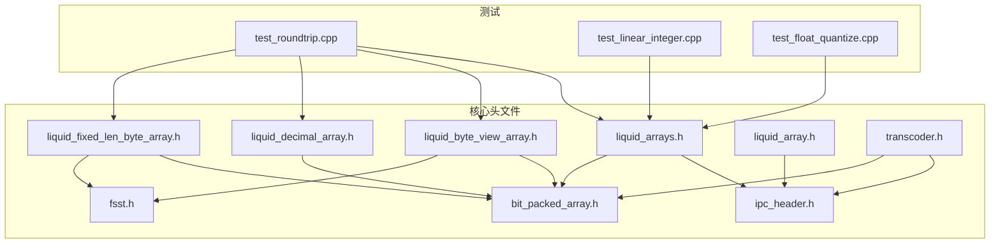
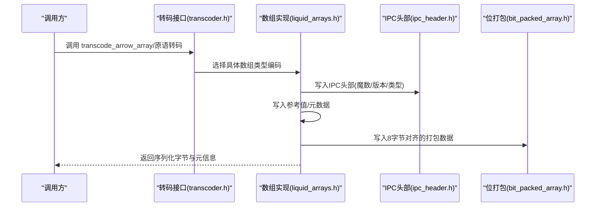
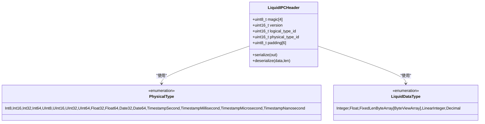
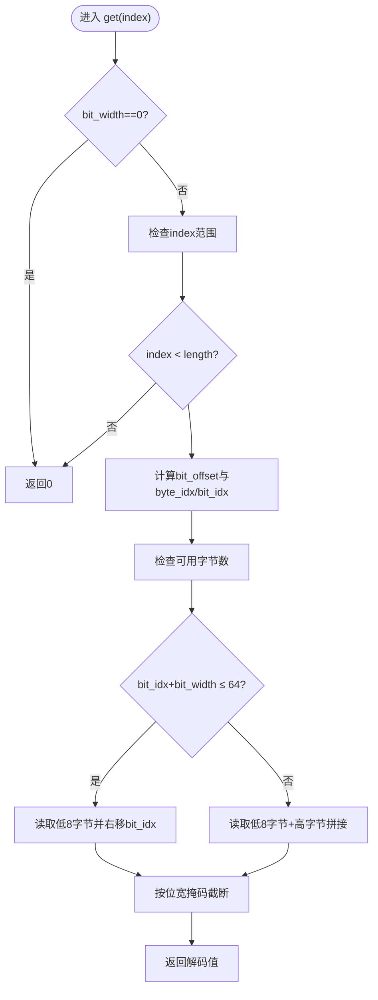
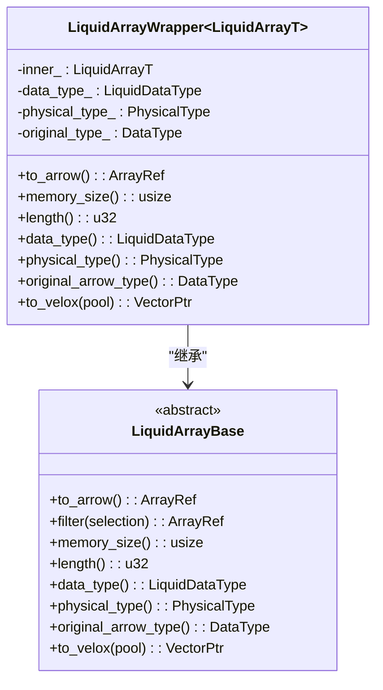
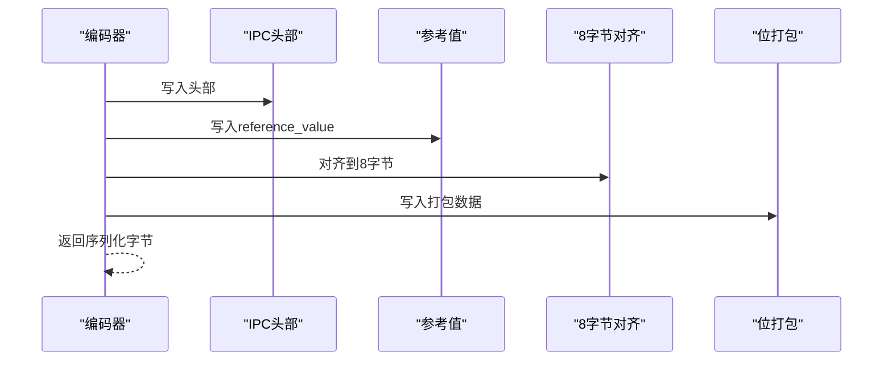
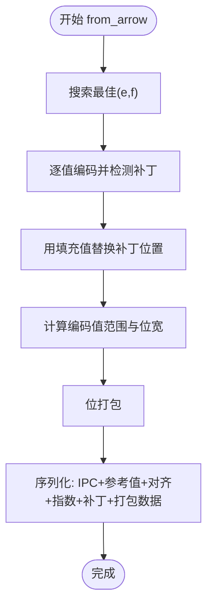
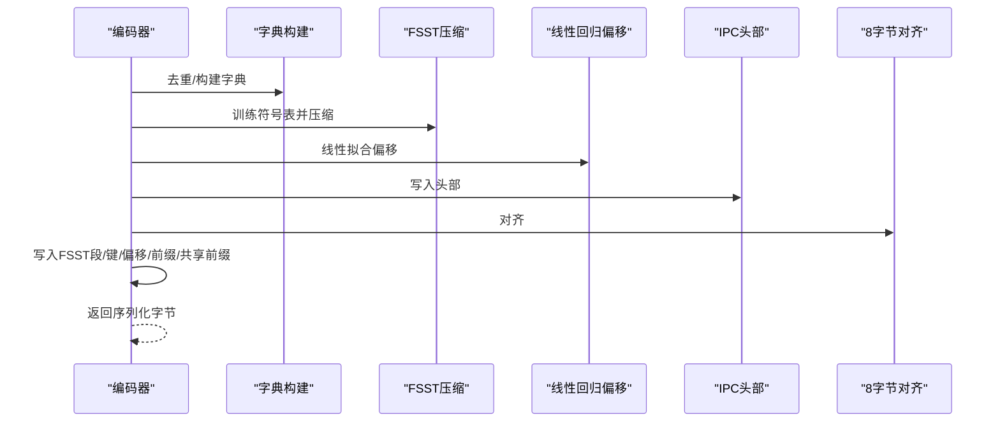
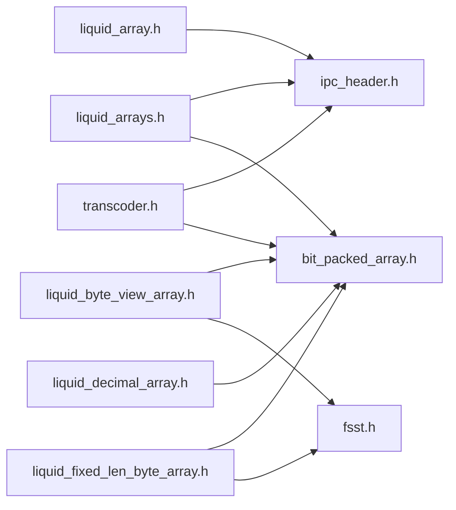

# 数组接口契约

<cite>
**本文档引用的文件**
- [liquid_arrays.h](file://include/liquid_cache/liquid_arrays.h)
- [liquid_array.h](file://include/liquid_cache/liquid_array.h)
- [ipc_header.h](file://include/liquid_cache/ipc_header.h)
- [bit_packed_array.h](file://include/liquid_cache/bit_packed_array.h)
- [liquid_byte_view_array.h](file://include/liquid_cache/liquid_byte_view_array.h)
- [liquid_fixed_len_byte_array.h](file://include/liquid_cache/liquid_fixed_len_byte_array.h)
- [liquid_decimal_array.h](file://include/liquid_cache/liquid_decimal_array.h)
- [fsst.h](file://include/liquid_cache/fsst.h)
- [transcoder.h](file://include/liquid_cache/transcoder.h)
- [test_roundtrip.cpp](file://tests/test_roundtrip.cpp)
- [test_linear_integer.cpp](file://tests/test_linear_integer.cpp)
- [test_float_quantize.cpp](file://tests/test_float_quantize.cpp)
- [README.md](file://README.md)
</cite>

## 目录
1. [简介](#简介)
2. [项目结构](#项目结构)
3. [核心组件](#核心组件)
4. [架构总览](#架构总览)
5. [详细组件分析](#详细组件分析)
6. [依赖关系分析](#依赖关系分析)
7. [性能考量](#性能考量)
8. [故障排查指南](#故障排查指南)
9. [结论](#结论)
10. [附录](#附录)

## 简介
本文件系统化阐述液体缓存 C++ 实现中“数组接口契约”的设计与约束，覆盖内存布局、数据对齐、边界检查、IPC 头部格式、版本兼容与完整性校验、缓存稳定性保障、质量标准与测试要求、契约变更的兼容策略与迁移指南，并结合代码示例说明如何正确实现与验证接口契约。重点围绕以下核心模块：
- IPC 头部与序列化契约（ipc_header.h）
- 位打包数组与内存布局（bit_packed_array.h）
- 多种数组类型的编码实现（liquid_arrays.h、liquid_byte_view_array.h、liquid_fixed_len_byte_array.h、liquid_decimal_array.h）
- 抽象数组接口与类型擦除包装（liquid_array.h）
- 转码接口与一致性测试（transcoder.h、tests）

## 项目结构
液体缓存 C++ 采用“按功能域分层”的组织方式：
- include/liquid_cache：核心头文件，定义 IPC 协议、数组编码、抽象接口与工具
- src：JNI 桥接与 Arrow/Velox 集成实现（不在本文详述）
- tests：端到端往返测试、线性整数测试、浮点量化测试等
- tools：Parquet 生成与验证工具
- README.md：构建与使用说明

**图表来源**
- [ipc_header.h:12-117](file://include/liquid_cache/ipc_header.h#L12-L117)
- [bit_packed_array.h:22-486](file://include/liquid_cache/bit_packed_array.h#L22-L486)
- [liquid_arrays.h:81-576](file://include/liquid_cache/liquid_arrays.h#L81-L576)
- [liquid_byte_view_array.h:204-669](file://include/liquid_cache/liquid_byte_view_array.h#L204-L669)
- [liquid_fixed_len_byte_array.h:111-531](file://include/liquid_cache/liquid_fixed_len_byte_array.h#L111-L531)
- [liquid_decimal_array.h:69-404](file://include/liquid_cache/liquid_decimal_array.h#L69-L404)
- [liquid_array.h:29-85](file://include/liquid_cache/liquid_array.h#L29-L85)
- [transcoder.h:23-360](file://include/liquid_cache/transcoder.h#L23-L360)
- [fsst.h:24-270](file://include/liquid_cache/fsst.h#L24-L270)

**章节来源**
- [README.md:1-378](file://README.md#L1-L378)

## 核心组件
- IPC 头部与版本控制：定义魔数、版本号、逻辑类型与物理类型枚举，提供序列化/反序列化与版本校验
- 位打包数组：定义 16 字节头、空值位图、8 字节对齐的打包数据布局，提供批量解包与边界检查
- 抽象数组接口：统一 to_arrow、filter、memory_size、length、data_type、physical_type 等能力
- 多类型数组实现：整数（含线性整数）、浮点（ALP 量化）、字节视图（字典+FSST）、定长字节数组（Decimal128/256）
- 转码接口：面向 Arrow 与原始缓冲区的转码函数，保证往返一致性与内存占用评估

**章节来源**
- [ipc_header.h:12-117](file://include/liquid_cache/ipc_header.h#L12-L117)
- [bit_packed_array.h:22-486](file://include/liquid_cache/bit_packed_array.h#L22-L486)
- [liquid_array.h:29-85](file://include/liquid_cache/liquid_array.h#L29-L85)
- [liquid_arrays.h:81-576](file://include/liquid_cache/liquid_arrays.h#L81-L576)
- [liquid_byte_view_array.h:204-669](file://include/liquid_cache/liquid_byte_view_array.h#L204-L669)
- [liquid_fixed_len_byte_array.h:111-531](file://include/liquid_cache/liquid_fixed_len_byte_array.h#L111-L531)
- [liquid_decimal_array.h:69-404](file://include/liquid_cache/liquid_decimal_array.h#L69-L404)
- [transcoder.h:23-360](file://include/liquid_cache/transcoder.h#L23-L360)

## 架构总览
液体缓存的数组接口契约以 IPC 头部为协议入口，各数组类型在序列化时严格遵循内存布局与对齐规则，确保跨语言（Rust/C++）二进制兼容。抽象接口提供统一的多态访问，具体实现负责编码细节与性能优化。

**图表来源**
- [transcoder.h:351-360](file://include/liquid_cache/transcoder.h#L351-L360)
- [liquid_arrays.h:199-238](file://include/liquid_cache/liquid_arrays.h#L199-L238)
- [ipc_header.h:55-106](file://include/liquid_cache/ipc_header.h#L55-L106)
- [bit_packed_array.h:155-195](file://include/liquid_cache/bit_packed_array.h#L155-L195)

## 详细组件分析

### IPC 头部与版本兼容性
- 魔数与版本：固定 4 字节魔数与 2 字节版本，用于快速识别与版本校验
- 类型枚举：逻辑类型（整数/浮点/字节视图/线性整数/十进制）与物理类型（整型/浮点/日期时间戳等）
- 内存布局：16 字节定长，字段顺序与大小严格固定，避免平台差异
- 反序列化校验：长度检查、魔数匹配、版本兼容性检查

**图表来源**
- [ipc_header.h:12-117](file://include/liquid_cache/ipc_header.h#L12-L117)

**章节来源**
- [ipc_header.h:12-117](file://include/liquid_cache/ipc_header.h#L12-L117)

### 位打包数组与内存布局
- 头部结构：包含元素个数、位宽、是否含空值、空值位图长度、打包数据长度与填充
- 对齐规则：空值位图后进行 8 字节对齐，再写入打包数据
- 批量解包：提供 bulk_unpack_to，支持 AVX2 加速与标量回退
- 边界检查：访问索引与字节偏移的安全检查，防止越界读取

**图表来源**
- [bit_packed_array.h:97-138](file://include/liquid_cache/bit_packed_array.h#L97-L138)

**章节来源**
- [bit_packed_array.h:22-486](file://include/liquid_cache/bit_packed_array.h#L22-L486)

### 抽象数组接口与类型擦除
- 统一接口：to_arrow、filter、memory_size、length、data_type、physical_type、original_arrow_type
- 类型擦除包装：通过模板包装器将具体数组类型适配为抽象基类，便于缓存存储与多态访问
- Velox 集成：可直接解码为 Velox 向量（可选）

**图表来源**
- [liquid_array.h:29-156](file://include/liquid_cache/liquid_array.h#L29-L156)

**章节来源**
- [liquid_array.h:29-156](file://include/liquid_cache/liquid_array.h#L29-L156)

### 整数数组与线性整数数组
- 整数数组：帧对齐参考值 + 位打包，支持空值位图；序列化包含 IPC 头 + 参考值 + 8 字节对齐 + 打包数据
- 线性整数数组：线性模型残差存储于整数数组，适合单调/近似线性序列；序列化包含 IPC 头 + 截距/斜率 + 8 字节对齐 + 残差数组

**图表来源**
- [liquid_arrays.h:88-93](file://include/liquid_cache/liquid_arrays.h#L88-L93)
- [liquid_arrays.h:350-356](file://include/liquid_cache/liquid_arrays.h#L350-L356)

**章节来源**
- [liquid_arrays.h:81-576](file://include/liquid_cache/liquid_arrays.h#L81-L576)

### 浮点数组（ALP 量化）
- ALP 编码：寻找最佳指数对 (e,f)，将浮点值映射到整数域，记录解码不一致的位置作为补丁
- 量化路径：仅当位宽 ≥ 8 时进行“挤压”（squeezing），否则保持原样
- 谓词评估：对量化后的桶进行谓词推断，必要时回退到全量解码

**图表来源**
- [liquid_arrays.h:577-800](file://include/liquid_cache/liquid_arrays.h#L577-L800)
- [test_float_quantize.cpp:141-168](file://tests/test_float_quantize.cpp#L141-L168)

**章节来源**
- [liquid_arrays.h:577-800](file://include/liquid_cache/liquid_arrays.h#L577-L800)
- [test_float_quantize.cpp:1-419](file://tests/test_float_quantize.cpp#L1-L419)

### 字节视图数组（字符串/二进制）
- 字典 + FSST 压缩：去重得到字典，共享前缀提取，FSST 压缩字典项，线性回归压缩偏移
- 序列化：IPC 头 + 头部元数据 + FSST 符号表/原始字节/压缩大小/压缩数据 + 8 字节对齐 + 字典键 + 偏移 + 前缀键 + 共享前缀

**图表来源**
- [liquid_byte_view_array.h:204-570](file://include/liquid_cache/liquid_byte_view_array.h#L204-L570)
- [fsst.h:24-270](file://include/liquid_cache/fsst.h#L24-L270)

**章节来源**
- [liquid_byte_view_array.h:204-669](file://include/liquid_cache/liquid_byte_view_array.h#L204-L669)
- [fsst.h:24-270](file://include/liquid_cache/fsst.h#L24-L270)

### 定长字节数组（Decimal128/256）
- 适用场景：超出 u64 范围的十进制值，采用字典 + FSST + 线性偏移压缩
- 序列化：IPC 头 + 头部元数据（精度/刻度/类型）+ 字典键 + 8 字节对齐 + FSST 值段（符号表/原始字节/压缩大小/压缩数据/偏移）

**章节来源**
- [liquid_fixed_len_byte_array.h:111-531](file://include/liquid_cache/liquid_fixed_len_byte_array.h#L111-L531)

### 十进制数组（Decimal128/256，u64 路径）
- 适用场景：可安全放入 u64 的十进制值，采用帧对齐 + 位打包
- 序列化：IPC 头 + 头部元数据（精度/刻度/类型）+ 参考值 + 8 字节对齐 + 位打包

**章节来源**
- [liquid_decimal_array.h:69-404](file://include/liquid_cache/liquid_decimal_array.h#L69-L404)

### 转码接口与一致性
- Arrow 转码：根据 Arrow 类型自动选择编码路径（整数/浮点/字符串/十进制）
- 原语转码：支持原生缓冲区与空值位图的直接转码
- 一致性测试：覆盖往返测试、空数组/常量/全空等边界，以及压缩比验证

**章节来源**
- [transcoder.h:351-360](file://include/liquid_cache/transcoder.h#L351-L360)
- [test_roundtrip.cpp:1-544](file://tests/test_roundtrip.cpp#L1-L544)

## 依赖关系分析
- 模块耦合
  - 数组实现强依赖 IPC 头部与位打包数组
  - 字节视图与定长字节数组依赖 FSST 压缩器
  - 抽象接口为上层缓存与转换提供统一入口
- 外部依赖
  - Arrow：数组类型、计算内核、缓冲区管理
  - 可选：Velox、JNI（用于向量引擎与桥接）

**图表来源**
- [liquid_arrays.h:22-23](file://include/liquid_cache/liquid_arrays.h#L22-L23)
- [liquid_byte_view_array.h:18-21](file://include/liquid_cache/liquid_byte_view_array.h#L18-L21)
- [liquid_fixed_len_byte_array.h:39-42](file://include/liquid_cache/liquid_fixed_len_byte_array.h#L39-L42)
- [liquid_decimal_array.h:21-23](file://include/liquid_cache/liquid_decimal_array.h#L21-L23)
- [liquid_array.h](file://include/liquid_cache/liquid_array.h#L17)
- [transcoder.h:12-13](file://include/liquid_cache/transcoder.h#L12-L13)

**章节来源**
- [liquid_arrays.h:22-23](file://include/liquid_cache/liquid_arrays.h#L22-L23)
- [liquid_byte_view_array.h:18-21](file://include/liquid_cache/liquid_byte_view_array.h#L18-L21)
- [liquid_fixed_len_byte_array.h:39-42](file://include/liquid_cache/liquid_fixed_len_byte_array.h#L39-L42)
- [liquid_decimal_array.h:21-23](file://include/liquid_cache/liquid_decimal_array.h#L21-L23)
- [liquid_array.h](file://include/liquid_cache/liquid_array.h#L17)
- [transcoder.h:12-13](file://include/liquid_cache/transcoder.h#L12-L13)

## 性能考量
- 内存布局与对齐
  - 8 字节对齐贯穿多个序列化阶段，减少解码时的地址计算开销
  - 位打包按位存储，显著降低存储与带宽占用
- SIMD 加速
  - 位打包批量解包在常见位宽（1/2/4/8/16/32）下使用 AVX2 加速
- 压缩策略
  - 字符串/二进制：字典 + FSST + 线性偏移
  - 十进制：u64 路径帧对齐 + 位打包；超范围路径字典 + FSST
  - 浮点：ALP 指数搜索 + 补丁 + 位打包；可进一步“挤压”
- 类型安全与运行时性能权衡
  - 类型擦除带来多态成本，但通过模板包装与直接解码路径（如 to_velox）平衡
  - 边界检查与对齐校验提升稳定性，少量增加解码时延

[本节为通用性能讨论，不直接分析具体文件]

## 故障排查指南
- 版本不兼容
  - 现象：反序列化抛出“不支持的 IPC 版本”
  - 排查：确认序列化端与反序列化端使用相同版本的 IPC 头部
  - 参考：[ipc_header.h:86-105](file://include/liquid_cache/ipc_header.h#L86-L105)
- 缓冲区不足
  - 现象：反序列化抛出“缓冲区太小”
  - 排查：检查 IPC 头部、元数据与打包数据的总长度
  - 参考：[bit_packed_array.h:197-233](file://include/liquid_cache/bit_packed_array.h#L197-L233)
- 对齐错误
  - 现象：解码后值错位或越界
  - 排查：确认 8 字节对齐逻辑与打包数据起始偏移
  - 参考：[bit_packed_array.h:186-195](file://include/liquid_cache/bit_packed_array.h#L186-L195)
- 浮点量化失败
  - 现象：squeeze 返回空值或谓词评估返回 NeedsBacking
  - 排查：检查位宽是否足够（≥8），以及桶边界是否明确
  - 参考：[test_float_quantize.cpp:141-168](file://tests/test_float_quantize.cpp#L141-L168)
- 压缩比异常
  - 现象：字节视图压缩后仍大于原生 Arrow
  - 排查：确认字典规模与重复度，适当增大样本量
  - 参考：[test_roundtrip.cpp:507-521](file://tests/test_roundtrip.cpp#L507-L521)

**章节来源**
- [ipc_header.h:86-105](file://include/liquid_cache/ipc_header.h#L86-L105)
- [bit_packed_array.h:186-233](file://include/liquid_cache/bit_packed_array.h#L186-L233)
- [test_float_quantize.cpp:141-168](file://tests/test_float_quantize.cpp#L141-L168)
- [test_roundtrip.cpp:507-521](file://tests/test_roundtrip.cpp#L507-L521)

## 结论
数组接口契约通过严格的 IPC 头部格式、内存布局与对齐规范，结合完善的边界检查与版本兼容校验，确保了跨语言与跨组件的二进制兼容与运行时稳定性。位打包、字典+FSST、ALP 量化等压缩策略在保证类型安全的前提下，实现了显著的存储与带宽节省。配套的测试体系覆盖了往返一致性、边界情况与压缩比验证，为接口契约的持续演进提供了可靠保障。

[本节为总结性内容，不直接分析具体文件]

## 附录

### 接口契约质量标准与测试要求
- 质量标准
  - 二进制兼容：序列化字节与 Rust 端完全一致
  - 类型安全：Arrow 类型与物理类型映射准确
  - 稳定性：边界值、空值、全空、常量序列均通过测试
  - 性能：批量解包与压缩比满足预期
- 测试要求
  - 往返测试：Arrow → 编码 → 解码 → Arrow 完全相等
  - 序列化往返：to_bytes/from_bytes 完整一致
  - 边界测试：空数组、单元素、全空、常量、大范围
  - 压缩比：字节视图/整数等场景应小于原生 Arrow

**章节来源**
- [test_roundtrip.cpp:1-544](file://tests/test_roundtrip.cpp#L1-L544)
- [test_linear_integer.cpp:1-271](file://tests/test_linear_integer.cpp#L1-L271)
- [test_float_quantize.cpp:1-419](file://tests/test_float_quantize.cpp#L1-L419)

### 接口契约变更的兼容性处理策略与迁移指南
- 版本升级
  - 新增逻辑类型：扩展枚举并在反序列化中兼容旧版本
  - 头部新增字段：保留 SIZE 常量，读取时忽略未知字段
- 迁移建议
  - 逐步引入新类型（如 LinearInteger/ByteViewArray）并提供降级路径
  - 保持 IPC 头部固定大小与字段顺序不变
  - 在应用层提供“是否可解码”的探测逻辑

**章节来源**
- [ipc_header.h:12-117](file://include/liquid_cache/ipc_header.h#L12-L117)

### 代码示例路径（不展示具体代码）
- 整数数组往返测试
  - [test_primitive_roundtrip:60-72](file://tests/test_roundtrip.cpp#L60-L72)
- 浮点数组量化与谓词评估
  - [check_roundtrip:54-113](file://tests/test_float_quantize.cpp#L54-L113)
- 字节视图数组序列化
  - [LiquidByteViewArray::to_bytes:413-478](file://include/liquid_cache/liquid_byte_view_array.h#L413-L478)
- 十进制数组序列化
  - [LiquidDecimalArray::to_bytes:307-339](file://include/liquid_cache/liquid_decimal_array.h#L307-L339)
- 原语整数转码
  - [transcode_primitive:86-156](file://include/liquid_cache/transcoder.h#L86-L156)
- 原语浮点转码
  - [transcode_float:169-342](file://include/liquid_cache/transcoder.h#L169-L342)

**章节来源**
- [test_roundtrip.cpp:60-72](file://tests/test_roundtrip.cpp#L60-L72)
- [test_float_quantize.cpp:54-113](file://tests/test_float_quantize.cpp#L54-L113)
- [liquid_byte_view_array.h:413-478](file://include/liquid_cache/liquid_byte_view_array.h#L413-L478)
- [liquid_decimal_array.h:307-339](file://include/liquid_cache/liquid_decimal_array.h#L307-L339)
- [transcoder.h:86-342](file://include/liquid_cache/transcoder.h#L86-L342)