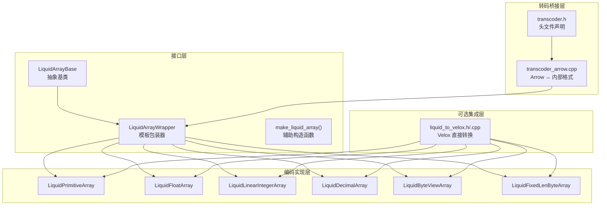
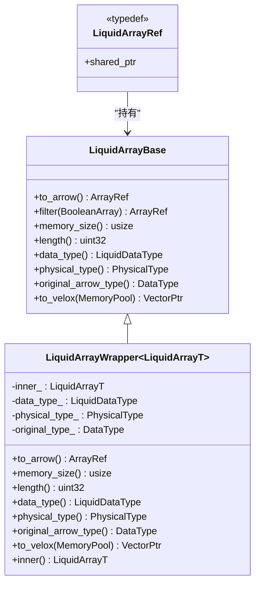
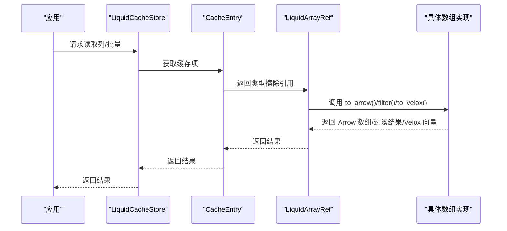
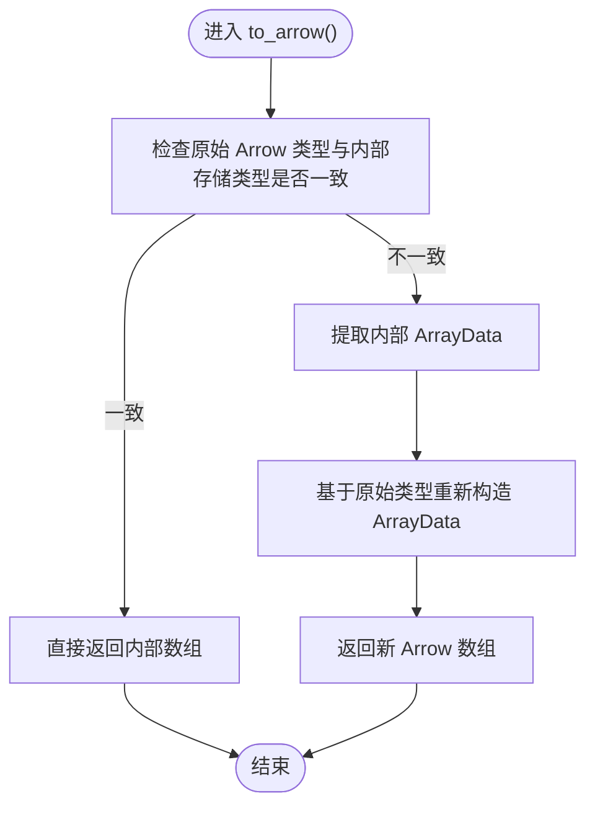
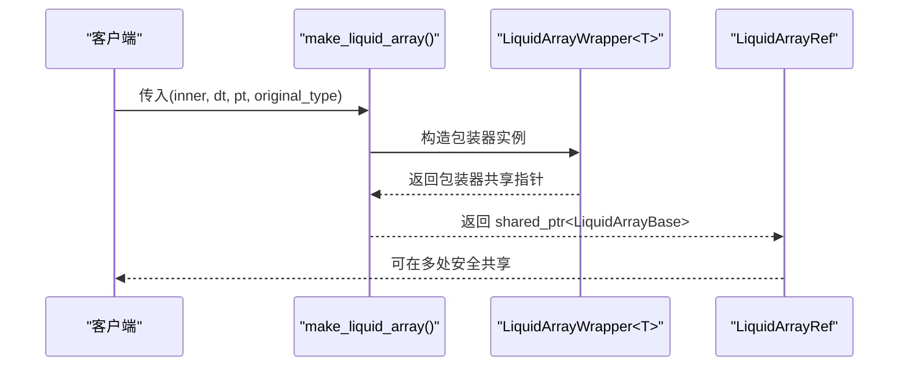
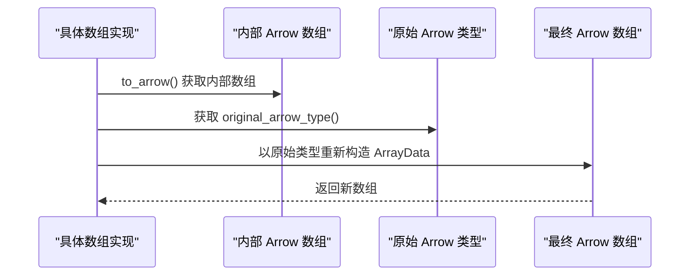
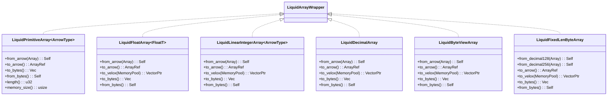
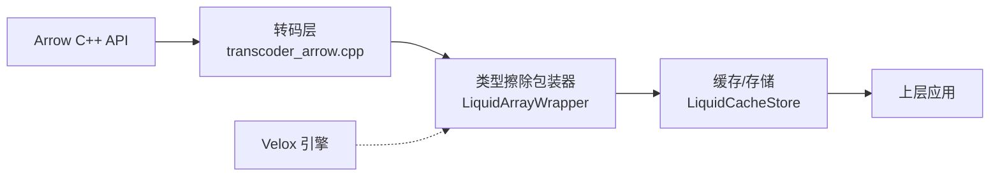

# 类型擦除机制

<cite>
**本文档引用的文件**
- [liquid_array.h](file://include/liquid_cache/liquid_array.h)
- [liquid_arrays.h](file://include/liquid_cache/liquid_arrays.h)
- [liquid_to_velox.h](file://include/liquid_cache/liquid_to_velox.h)
- [liquid_to_velox.cpp](file://src/liquid_to_velox.cpp)
- [ipc_header.h](file://include/liquid_cache/ipc_header.h)
- [liquid_decimal_array.h](file://include/liquid_cache/liquid_decimal_array.h)
- [liquid_byte_view_array.h](file://include/liquid_cache/liquid_byte_view_array.h)
- [liquid_fixed_len_byte_array.h](file://include/liquid_cache/liquid_fixed_len_byte_array.h)
- [transcoder_arrow.cpp](file://src/transcoder_arrow.cpp)
- [transcoder.h](file://include/liquid_cache/transcoder.h)
- [test_roundtrip.cpp](file://tests/test_roundtrip.cpp)
- [jni_bridge.cpp](file://src/jni_bridge.cpp)
- [README.md](file://README.md)
</cite>

## 目录
1. [简介](#简介)
2. [项目结构](#项目结构)
3. [核心组件](#核心组件)
4. [架构总览](#架构总览)
5. [详细组件分析](#详细组件分析)
6. [依赖关系分析](#依赖关系分析)
7. [性能考虑](#性能考虑)
8. [故障排查指南](#故障排查指南)
9. [结论](#结论)
10. [附录](#附录)

## 简介
本文件系统性阐述 Liquid Cache C++ 实现中的类型擦除机制，重点围绕 LiquidArrayBase 抽象基类与 LiquidArrayWrapper 模板包装器的设计与实现，解释其如何在编译期类型约束与运行时多态之间取得平衡，并提供 make_liquid_array 辅助函数的使用方法。同时，文档深入说明原始 Arrow 类型与内部存储类型之间的转换机制（包括类型 reinterpret 与数据重新解释），并给出扩展新数组类型的完整指导。

## 项目结构
该项目采用分层设计：
- 接口层：抽象基类与类型擦除包装器（liquid_array.h）
- 编码实现层：各类具体数组类型的编码/解码逻辑（liquid_arrays.h 及各专用头文件）
- 转码桥接层：Arrow 与内部格式的互转（transcoder_arrow.cpp、transcoder.h）
- 可选集成层：与 Velox 引擎的直接向量转换（liquid_to_velox.h、liquid_to_velox.cpp）

**图表来源**
- [liquid_array.h:38-156](file://include/liquid_cache/liquid_array.h#L38-L156)
- [liquid_arrays.h:95-566](file://include/liquid_cache/liquid_arrays.h#L95-L566)
- [transcoder_arrow.cpp:1-394](file://src/transcoder_arrow.cpp#L1-L394)
- [transcoder.h:17-359](file://include/liquid_cache/transcoder.h#L17-L359)
- [liquid_to_velox.h:23-137](file://include/liquid_cache/liquid_to_velox.h#L23-L137)
- [liquid_to_velox.cpp:1-639](file://src/liquid_to_velox.cpp#L1-L639)

**章节来源**
- [README.md:1-378](file://README.md#L1-L378)

## 核心组件
本节聚焦类型擦除机制的关键构件：抽象基类、模板包装器与辅助构造函数。

- 抽象基类 LiquidArrayBase
  - 提供统一的多态接口：to_arrow()、filter()、memory_size()、length()、data_type()、physical_type()、original_arrow_type()，以及可选的 to_velox()（在启用 LIQUID_ENABLE_VELOX 时）。
  - 该接口与 Rust 的 LiquidArray trait 对齐，确保跨语言一致性。

- 模板包装器 LiquidArrayWrapper<T>
  - 将任意满足接口约束的具体数组类型适配为 LiquidArrayBase。
  - 在构造时接收：逻辑类型标识、物理类型标识、原始 Arrow 类型指针，用于运行时类型重建。
  - 重载 to_arrow() 以处理原始 Arrow 类型与内部存储类型不一致的情况（例如时间戳存储为 Int64，但需要以 Arrow Timestamp 类型返回）。

- 辅助构造函数 make_liquid_array()
  - 便捷地创建 LiquidArrayRef，避免直接管理内存与模板实参的复杂性。

**图表来源**
- [liquid_array.h:38-156](file://include/liquid_cache/liquid_array.h#L38-L156)

**章节来源**
- [liquid_array.h:38-156](file://include/liquid_cache/liquid_array.h#L38-L156)

## 架构总览
类型擦除在本项目中的作用是：
- 在缓存层与上层应用之间提供统一的数组接口，屏蔽底层具体编码格式差异。
- 通过模板包装器在编译期约束具体类型行为，在运行时以多态方式调用。
- 保持与 Arrow 的互操作性，同时允许在必要时直接输出到 Velox 向量。

**图表来源**
- [liquid_cache_store.h:111-173](file://include/liquid_cache/liquid_cache_store.h#L111-L173)
- [liquid_array.h:42-84](file://include/liquid_cache/liquid_array.h#L42-L84)

**章节来源**
- [liquid_cache_store.h:111-173](file://include/liquid_cache/liquid_cache_store.h#L111-L173)

## 详细组件分析

### LiquidArrayBase 与 LiquidArrayWrapper 设计原理
- 模板参数约束
  - 包装器要求传入的类型必须提供：to_arrow()、memory_size()、length() 等方法签名。
  - 通过 SFINAE 与编译期静态断言（隐式）确保接口一致性。
- 类型安全保证
  - 通过 data_type() 与 physical_type() 明确逻辑类型与物理存储类型，避免误用。
  - original_arrow_type() 保留原始 Arrow 类型信息，用于运行时重建 Arrow 类型。
- 运行时类型多态
  - 所有具体数组类型经由 make_liquid_array 包装后，统一作为 LiquidArrayBase 使用。
  - filter() 的默认实现先 to_arrow() 再应用 Arrow 计算过滤，具体类型可覆盖以实现无解码优化。
- 性能优化策略
  - to_arrow() 中对原始类型与内部存储类型不一致的情况进行“重新解释”（reinterpreting），避免不必要的全量解码。
  - 通过内存预算与 LRU 策略控制缓存占用，减少频繁分配与复制。

**图表来源**
- [liquid_array.h:109-121](file://include/liquid_cache/liquid_array.h#L109-L121)

**章节来源**
- [liquid_array.h:38-156](file://include/liquid_cache/liquid_array.h#L38-L156)

### make_liquid_array 辅助函数
- 设计目的
  - 简化类型擦除对象的创建过程，隐藏模板实参与内存管理细节。
- 使用方法
  - 传入具体数组对象、逻辑类型、物理类型、原始 Arrow 类型指针，返回 LiquidArrayRef。
  - 适用于所有满足接口约束的具体数组类型（如 LiquidPrimitiveArray、LiquidFloatArray 等）。

**图表来源**
- [liquid_array.h:148-156](file://include/liquid_cache/liquid_array.h#L148-L156)

**章节来源**
- [liquid_array.h:148-156](file://include/liquid_cache/liquid_array.h#L148-L156)

### 原始 Arrow 类型与内部存储类型的转换机制
- 类型 reinterpret 与数据重新解释
  - 当内部存储类型与原始 Arrow 类型不一致时（如时间戳以 Int64 存储），to_arrow() 会提取内部 ArrayData，基于 original_arrow_type() 重新构造 ArrayData，从而实现“类型 reinterpret”。
- 数据重新解释的实现
  - 保留长度、缓冲区、空值计数与偏移等元信息，仅替换类型描述，避免复制底层数据。
- 典型场景
  - 时间戳：Int64 存储 → Arrow Timestamp 返回
  - 日期：Date64 存储 → Velox DATE（int32）转换（在 Velox 路径中）

**图表来源**
- [liquid_array.h:109-121](file://include/liquid_cache/liquid_array.h#L109-L121)
- [liquid_to_velox.cpp:48-62](file://src/liquid_to_velox.cpp#L48-L62)

**章节来源**
- [liquid_array.h:109-121](file://include/liquid_cache/liquid_array.h#L109-L121)
- [liquid_to_velox.cpp:48-62](file://src/liquid_to_velox.cpp#L48-L62)

### 具体数组类型与类型擦除的结合
- LiquidPrimitiveArray<T>
  - 以 Frame-of-Reference + BitPacking 存储整数/日期类型，提供高效的编码/解码与内存占用。
  - 通过包装器暴露统一接口，支持 to_arrow()、memory_size()、length() 等。
- LiquidFloatArray<T>
  - 采用 ALP（自适应无损浮点）+ BitPacking + Patching，支持量化与补丁记录。
  - 提供 to_arrow() 与 to_velox()（在启用 Velox 时）。
- LiquidLinearIntegerArray<T>
  - 基于线性模型的残差编码，适合单调/近似线性的整数序列。
  - 提供 to_arrow() 与 to_velox()。
- LiquidDecimalArray、LiquidByteViewArray、LiquidFixedLenByteArray
  - 分别针对十进制、字符串/二进制、超出 u64 范围的定长字节数组提供高效压缩与解码。
  - 均可通过包装器接入类型擦除体系。

**图表来源**
- [liquid_arrays.h:95-566](file://include/liquid_cache/liquid_arrays.h#L95-L566)
- [liquid_decimal_array.h:69-401](file://include/liquid_cache/liquid_decimal_array.h#L69-L401)
- [liquid_byte_view_array.h:204-667](file://include/liquid_cache/liquid_byte_view_array.h#L204-L667)
- [liquid_fixed_len_byte_array.h:111-531](file://include/liquid_cache/liquid_fixed_len_byte_array.h#L111-L531)

**章节来源**
- [liquid_arrays.h:95-566](file://include/liquid_cache/liquid_arrays.h#L95-L566)
- [liquid_decimal_array.h:69-401](file://include/liquid_cache/liquid_decimal_array.h#L69-L401)
- [liquid_byte_view_array.h:204-667](file://include/liquid_cache/liquid_byte_view_array.h#L204-L667)
- [liquid_fixed_len_byte_array.h:111-531](file://include/liquid_cache/liquid_fixed_len_byte_array.h#L111-L531)

### 与 Arrow 的互操作与 Velox 集成
- Arrow 互操作
  - 所有具体数组类型均提供 to_arrow()，可直接输出 Arrow 数组。
  - IPC 头部与序列化格式与 Rust 版本二进制兼容，便于跨语言传输与存储。
- Velox 集成
  - 在启用 LIQUID_ENABLE_VELOX 时，提供 to_velox() 直接输出 Velox 向量，绕过 Arrow 中间层，提升性能。
  - 类型映射与时间戳转换在 liquid_to_velox.h/.cpp 中集中处理。

**章节来源**
- [liquid_to_velox.h:23-137](file://include/liquid_cache/liquid_to_velox.h#L23-L137)
- [liquid_to_velox.cpp:1-639](file://src/liquid_to_velox.cpp#L1-L639)

### 扩展新数组类型的完整指导
- 接口实现要求
  - 必须提供以下方法签名（与包装器约束一致）：
    - to_arrow() -> shared_ptr<arrow::Array>
    - memory_size() -> size_t
    - length() -> uint32_t
  - 可选：to_velox(memory::MemoryPool*) -> facebook::velox::VectorPtr（启用 Velox 时）
- 类型定义规范
  - 逻辑类型与物理类型：参考 IPC 头部枚举（LogicalType、PhysicalType）。
  - 原始 Arrow 类型：在 make_liquid_array 时传入 original_arrow_type，确保运行时重建正确类型。
- 最佳实践
  - 优先实现 to_arrow() 与 memory_size()/length()，确保缓存与统计功能可用。
  - 如需 Velox 直通，实现 to_velox() 并遵循 Velox 类型映射规则。
  - 在序列化路径中，严格遵守对齐与头部格式，确保与 Rust 端二进制兼容。

**章节来源**
- [ipc_header.h:16-44](file://include/liquid_cache/ipc_header.h#L16-L44)
- [liquid_array.h:93-96](file://include/liquid_cache/liquid_array.h#L93-L96)
- [liquid_to_velox.h:69-133](file://include/liquid_cache/liquid_to_velox.h#L69-L133)

### 具体使用示例（路径引用）
- 将 Arrow 数组转为类型擦除数组并插入缓存
  - 参考：[transcoder_arrow.cpp:312-369](file://src/transcoder_arrow.cpp#L312-L369)
- 从缓存读取并解码为 Arrow 数组
  - 参考：[liquid_cache_store.h:118-138](file://include/liquid_cache/liquid_cache_store.h#L118-L138)
- JNI 桥接中批量转码与序列化
  - 参考：[jni_bridge.cpp:113-125](file://src/jni_bridge.cpp#L113-L125)

**章节来源**
- [transcoder_arrow.cpp:312-369](file://src/transcoder_arrow.cpp#L312-L369)
- [liquid_cache_store.h:118-138](file://include/liquid_cache/liquid_cache_store.h#L118-L138)
- [jni_bridge.cpp:113-125](file://src/jni_bridge.cpp#L113-L125)

## 依赖关系分析
- 组件耦合与内聚
  - LiquidArrayBase 与 LiquidArrayWrapper 形成稳定的抽象与实现分离，内聚度高。
  - 具体数组类型与包装器松耦合，通过接口约束连接。
- 外部依赖
  - Arrow：提供数组、计算内核与类型系统。
  - 可选：Velox：提供向量与内存池。
- 关键依赖链
  - 具体数组类型 → 包装器 → 类型擦除引用 → 缓存/存储 → 上层应用。
  - 转码层负责 Arrow 与内部格式的互转，贯穿整个数据流。

**图表来源**
- [transcoder_arrow.cpp:1-394](file://src/transcoder_arrow.cpp#L1-L394)
- [liquid_array.h:98-156](file://include/liquid_cache/liquid_array.h#L98-L156)
- [liquid_cache_store.h:188-527](file://include/liquid_cache/liquid_cache_store.h#L188-L527)

**章节来源**
- [transcoder_arrow.cpp:1-394](file://src/transcoder_arrow.cpp#L1-L394)
- [liquid_array.h:98-156](file://include/liquid_cache/liquid_array.h#L98-L156)
- [liquid_cache_store.h:188-527](file://include/liquid_cache/liquid_cache_store.h#L188-L527)

## 性能考虑
- 类型擦除带来的开销
  - 多态调用与虚函数分发表查找存在少量开销，但在热点路径（如 to_velox）可通过直接实现避免全量解码。
- 内存与带宽优化
  - to_arrow() 的类型重新解释避免复制底层缓冲区，仅替换类型描述。
  - 编码器广泛使用位打包与压缩（BitPacking、FSST、ALP），显著降低内存占用与序列化体积。
- 并发与缓存
  - 缓存层采用 LRU 与内存预算控制，避免过度占用；读取路径支持投影与过滤，减少不必要的解码。

[本节为通用性能讨论，无需特定文件引用]

## 故障排查指南
- 常见问题与定位
  - Arrow 计算内核未注册：链接阶段需使用全归档选项包裹 Arrow 静态库，否则计算内核会被链接器丢弃。
    - 参考：[README.md:347-351](file://README.md#L347-L351)
  - Velox 集成头文件冲突或 ABI 不兼容：系统 Arrow 24 与 Velox bundled Arrow 18 不兼容，需统一构建配置。
    - 参考：[README.md:159-161](file://README.md#L159-L161)
  - round-trip 校验失败：检查具体数组类型的编码/解码实现与 IPC 头部格式是否匹配。
    - 参考：[test_roundtrip.cpp:330-397](file://tests/test_roundtrip.cpp#L330-L397)
- 定位建议
  - 使用最小可复现实例（单列/小批量）快速定位问题。
  - 对比 Arrow 原始数组与解码后的数组 Equals 结果，确认类型与值一致性。

**章节来源**
- [README.md:347-351](file://README.md#L347-L351)
- [README.md:159-161](file://README.md#L159-L161)
- [test_roundtrip.cpp:330-397](file://tests/test_roundtrip.cpp#L330-L397)

## 结论
本项目的类型擦除机制通过 LiquidArrayBase 与 LiquidArrayWrapper 实现了编译期约束与运行时多态的平衡，既保证了接口一致性与类型安全，又提供了与 Arrow 的无缝互操作与可选的 Velox 直通能力。通过对原始类型与内部存储类型的“重新解释”，在不牺牲性能的前提下实现了灵活的类型重建。扩展新数组类型时，遵循接口约束与序列化规范即可快速接入现有生态。

[本节为总结性内容，无需特定文件引用]

## 附录
- 相关文件清单
  - 接口与包装器：[liquid_array.h](file://include/liquid_cache/liquid_array.h)
  - 编码实现：[liquid_arrays.h](file://include/liquid_cache/liquid_arrays.h)、[liquid_decimal_array.h](file://include/liquid_cache/liquid_decimal_array.h)、[liquid_byte_view_array.h](file://include/liquid_cache/liquid_byte_view_array.h)、[liquid_fixed_len_byte_array.h](file://include/liquid_cache/liquid_fixed_len_byte_array.h)
  - 转码与桥接：[transcoder_arrow.cpp](file://src/transcoder_arrow.cpp)、[transcoder.h](file://include/liquid_cache/transcoder.h)
  - Velox 集成：[liquid_to_velox.h](file://include/liquid_cache/liquid_to_velox.h)、[liquid_to_velox.cpp](file://src/liquid_to_velox.cpp)
  - IPC 格式：[ipc_header.h](file://include/liquid_cache/ipc_header.h)
  - 示例与测试：[README.md](file://README.md)、[test_roundtrip.cpp](file://tests/test_roundtrip.cpp)、[jni_bridge.cpp](file://src/jni_bridge.cpp)

[本节为补充信息，无需特定文件引用]