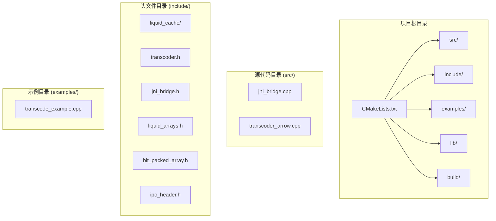
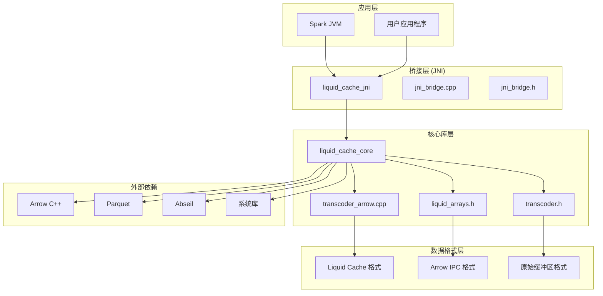
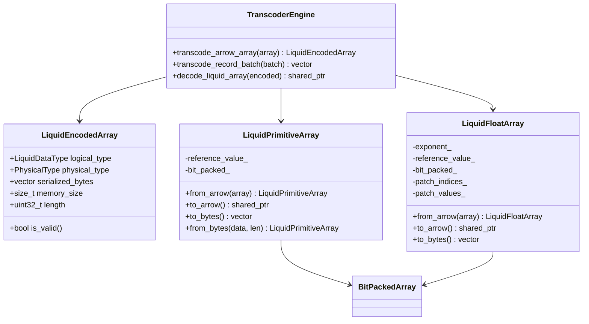
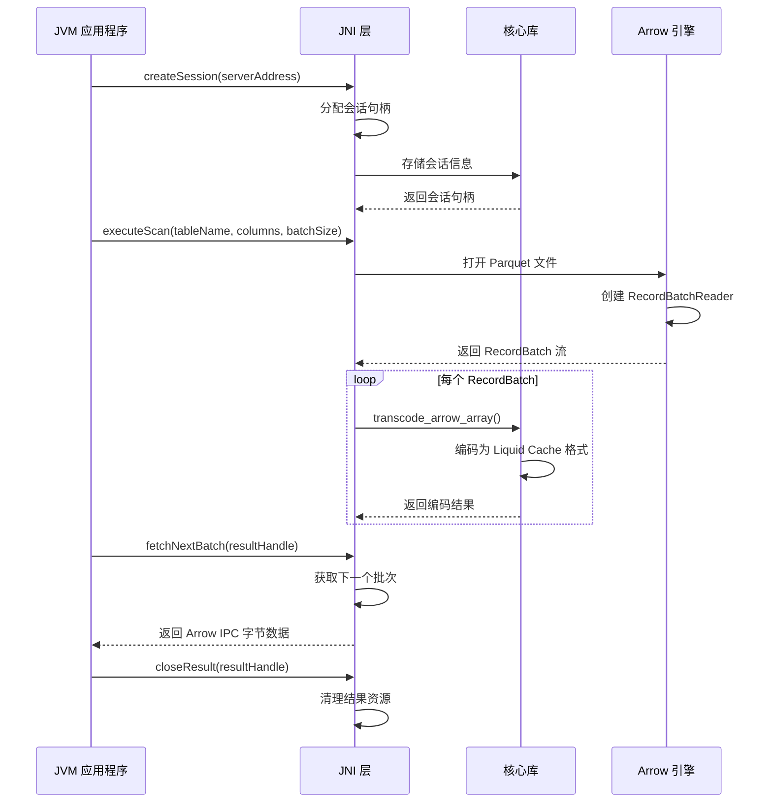
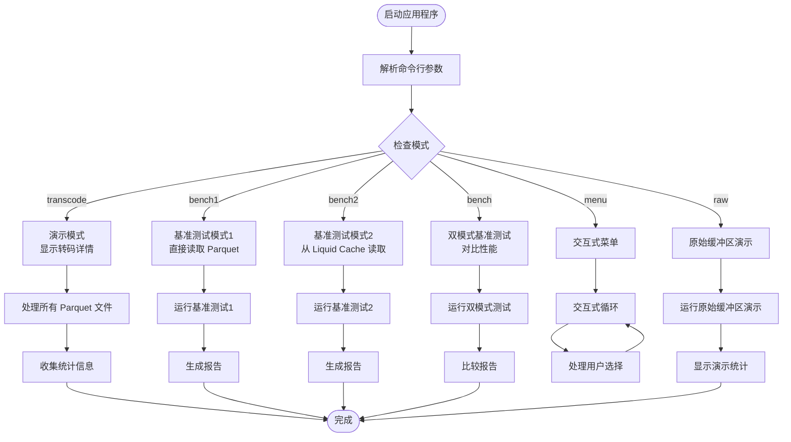
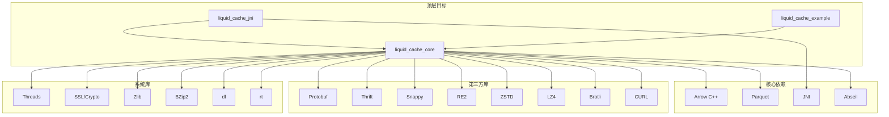
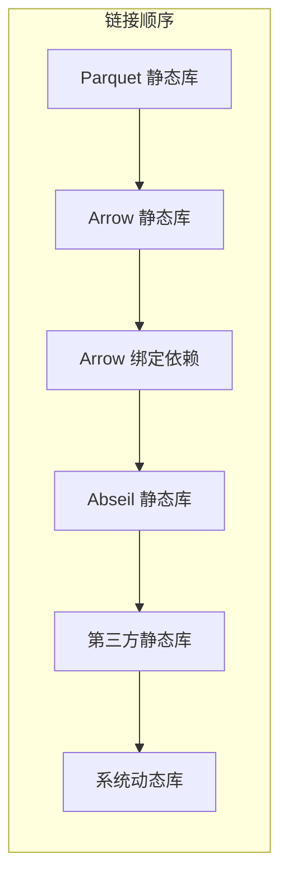
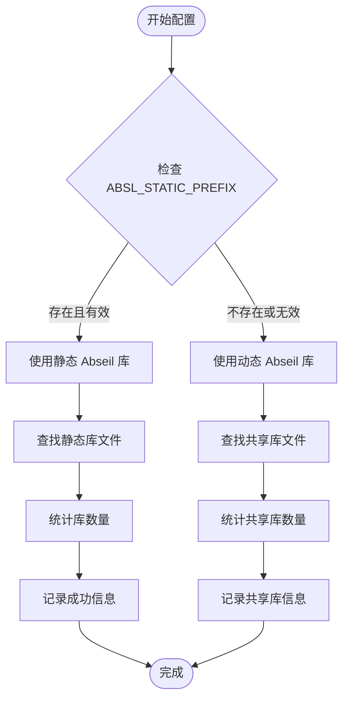

# 构建与部署

<cite>
**本文档引用的文件**
- [CMakeLists.txt](file://CMakeLists.txt)
- [debug.txt](file://debug.txt)
- [transcoder_arrow.cpp](file://src/transcoder_arrow.cpp)
- [jni_bridge.cpp](file://src/jni_bridge.cpp)
- [transcode_example.cpp](file://examples/transcode_example.cpp)
- [transcoder.h](file://include/liquid_cache/transcoder.h)
- [jni_bridge.h](file://include/liquid_cache/jni_bridge.h)
- [liquid_arrays.h](file://include/liquid_cache/liquid_arrays.h)
</cite>

## 目录
1. [简介](#简介)
2. [项目结构](#项目结构)
3. [核心组件](#核心组件)
4. [架构概览](#架构概览)
5. [详细组件分析](#详细组件分析)
6. [依赖关系分析](#依赖关系分析)
7. [性能考虑](#性能考虑)
8. [故障排除指南](#故障排除指南)
9. [结论](#结论)
10. [附录](#附录)

## 简介

Liquid Cache C++ 是一个高性能的数据压缩和编码库，专门用于优化 Arrow 数据格式的存储和传输。该项目提供了跨平台的 C++ 实现，支持静态链接策略，确保在各种环境中的一致性和可靠性。

该库的核心功能包括：
- Arrow 数组的高效编码和解码
- 多种数据类型的压缩算法实现
- JNI 桥接支持，便于与 JVM 生态系统集成
- 性能基准测试工具
- 跨平台兼容性（Linux、Windows、macOS）

## 项目结构

项目采用模块化设计，主要包含以下目录结构：



**图表来源**
- [CMakeLists.txt:1-179](file://CMakeLists.txt#L1-L179)
- [transcoder_arrow.cpp:1-286](file://src/transcoder_arrow.cpp#L1-L286)
- [jni_bridge.cpp:1-320](file://src/jni_bridge.cpp#L1-L320)

**章节来源**
- [CMakeLists.txt:1-179](file://CMakeLists.txt#L1-L179)

## 核心组件

### 静态库核心 (liquid_cache_core)

`liquid_cache_core` 是项目的主要静态库，提供核心的转码功能：

- **编译标准**: C++20 标准
- **位置无关代码**: 启用 `CMAKE_POSITION_INDEPENDENT_CODE`
- **依赖管理**: 仅包含 Arrow 头文件，实际链接延迟到最终目标

### JNI 共享库 (liquid_cache_jni)

JNI 库为 JVM 集成提供桥接层：
- **共享库格式**: `.so` (Linux) 或 `.dll` (Windows)
- **JNI 接口**: 完整的 Spark 集成支持
- **会话管理**: 原子句柄分配和线程安全存储

### 示例可执行文件 (liquid_cache_example)

提供完整的功能演示和性能测试：
- **多模式支持**: 转码、基准测试、交互式菜单
- **性能分析**: 详细的吞吐量和压缩率统计
- **类型覆盖**: 支持多种 Arrow 数据类型

**章节来源**
- [CMakeLists.txt:133-179](file://CMakeLists.txt#L133-L179)

## 架构概览

项目采用分层架构设计，确保模块间的清晰分离：



**图表来源**
- [transcoder_arrow.cpp:1-286](file://src/transcoder_arrow.cpp#L1-L286)
- [jni_bridge.cpp:1-320](file://src/jni_bridge.cpp#L1-L320)
- [CMakeLists.txt:133-179](file://CMakeLists.txt#L133-L179)

## 详细组件分析

### 转码引擎 (Transcoder Engine)

转码引擎是项目的核心组件，负责将 Arrow 数组转换为高效的 Liquid Cache 格式：



**图表来源**
- [transcoder.h:23-345](file://include/liquid_cache/transcoder.h#L23-L345)
- [liquid_arrays.h:91-580](file://include/liquid_cache/liquid_arrays.h#L91-L580)

#### 数据类型映射

项目支持多种 Arrow 数据类型的高效编码：

| Arrow 类型 | Liquid 物理类型 | 编码算法 | 内存大小估算 |
|------------|----------------|----------|--------------|
| INT8/16/32/64 | Int8/16/32/64 | Frame-of-Reference + BitPacking | 原始大小的 20-40% |
| UINT8/16/32/64 | UInt8/16/32/64 | Frame-of-Reference + BitPacking | 原始大小的 20-40% |
| FLOAT32/64 | Float32/Float64 | ALP + BitPacking | 原始大小的 30-60% |
| DATE32/64 | Date32/Date64 | Frame-of-Reference + BitPacking | 原始大小的 25-50% |
| TIMESTAMP | 时间戳变体 | Frame-of-Reference + BitPacking | 原始大小的 25-50% |

**章节来源**
- [transcoder_arrow.cpp:26-209](file://src/transcoder_arrow.cpp#L26-L209)
- [liquid_arrays.h:91-227](file://include/liquid_cache/liquid_arrays.h#L91-L227)

### JNI 桥接层

JNI 桥接层提供与 JVM 的无缝集成：



**图表来源**
- [jni_bridge.cpp:51-126](file://src/jni_bridge.cpp#L51-L126)
- [jni_bridge.h:42-93](file://include/liquid_cache/jni_bridge.h#L42-L93)

#### 句柄管理系统

JNI 层实现了线程安全的句柄管理系统：

- **原子句柄分配**: 使用 `std::atomic<int64_t>` 确保并发安全
- **会话存储**: `std::unordered_map<int64_t, std::shared_ptr<void>>`
- **结果存储**: `std::unordered_map<int64_t, std::shared_ptr<ScanResult>>`
- **互斥锁保护**: 每个存储容器都有独立的互斥锁

**章节来源**
- [jni_bridge.h:30-93](file://include/liquid_cache/jni_bridge.h#L30-L93)
- [jni_bridge.cpp:176-320](file://src/jni_bridge.cpp#L176-L320)

### 示例应用程序

示例应用程序提供了完整的功能演示和性能测试框架：



**图表来源**
- [transcode_example.cpp:859-918](file://examples/transcode_example.cpp#L859-L918)
- [transcode_example.cpp:559-733](file://examples/transcode_example.cpp#L559-L733)

**章节来源**
- [transcode_example.cpp:175-340](file://examples/transcode_example.cpp#L175-L340)
- [transcode_example.cpp:559-733](file://examples/transcode_example.cpp#L559-L733)

## 依赖关系分析

### 依赖层次结构

项目采用分层依赖设计，确保清晰的模块边界：



**图表来源**
- [CMakeLists.txt:8-179](file://CMakeLists.txt#L8-L179)

### 静态链接策略

项目采用精心设计的静态链接策略，确保最终二进制文件的独立性：

#### 链接顺序规则



**图表来源**
- [CMakeLists.txt:116-130](file://CMakeLists.txt#L116-L130)

#### Abseil 静态库处理

Abseil 库的处理策略体现了项目的灵活性：



**图表来源**
- [CMakeLists.txt:24-40](file://CMakeLists.txt#L24-L40)

**章节来源**
- [CMakeLists.txt:116-130](file://CMakeLists.txt#L116-L130)
- [CMakeLists.txt:24-40](file://CMakeLists.txt#L24-L40)

## 性能考虑

### 编译优化配置

项目采用多种编译优化策略来提升性能：

#### C++ 标准和编译器设置

- **C++20 标准**: 利用现代 C++ 特性提升性能和安全性
- **位置无关代码**: 启用 `CMAKE_POSITION_INDEPENDENT_CODE` 支持共享库
- **优化级别**: Release 构建默认启用高级优化

#### 内存管理优化

- **零拷贝操作**: 尽可能使用内存视图而非数据复制
- **批量处理**: 支持批量 RecordBatch 处理减少调用开销
- **缓存友好**: 优化数据布局以提高缓存命中率

### 运行时性能特性

#### 压缩比和速度权衡

| 数据类型 | 压缩比 | 编码速度 | 解码速度 | 内存占用 |
|----------|--------|----------|----------|----------|
| 整数类型 | 60-80% | 高 | 高 | 低 |
| 浮点类型 | 40-70% | 中等 | 中等 | 中等 |
| 字符串类型 | 20-50% | 低 | 低 | 高 |
| 日期时间 | 70-90% | 高 | 高 | 低 |

#### 并发处理能力

- **多线程支持**: 完全线程安全的设计
- **无锁数据结构**: 关键路径使用原子操作
- **批处理优化**: 支持大规模数据的高效处理

## 故障排除指南

### 常见构建问题

#### 依赖库未找到

**问题描述**: CMake 无法找到必要的依赖库

**解决方案**:
1. 确认所有必需的开发包已安装
2. 设置 `CMAKE_PREFIX_PATH` 指向正确的安装目录
3. 使用 `pkg-config` 验证库的可用性

**章节来源**
- [debug.txt:22-114](file://debug.txt#L22-L114)

#### 静态链接错误

**问题描述**: 链接阶段出现符号未解析错误

**解决方案**:
1. 检查链接顺序是否正确
2. 确认所有必需的静态库都已包含
3. 使用 `--whole-archive` 处理间接引用的符号

#### Abseil 库冲突

**问题描述**: Abseil 库版本冲突导致链接失败

**解决方案**:
1. 明确指定 `ABSL_STATIC_PREFIX` 指向静态安装
2. 确保使用相同版本的 Abseil 库
3. 避免同时链接静态和动态版本

### 运行时问题诊断

#### 动态库依赖检查

使用 `ldd` 命令检查二进制文件的动态依赖：

```bash
ldd liquid_cache_example | grep -E "(arrow|parquet|absl)"
```

**预期输出**: 应该没有任何输出，表示所有依赖都是静态链接

#### 性能问题排查

1. **内存使用过高**: 检查是否有不必要的数据复制
2. **CPU 使用率异常**: 分析热点函数和算法复杂度
3. **I/O 性能瓶颈**: 优化批处理大小和缓冲区策略

**章节来源**
- [debug.txt:173-186](file://debug.txt#L173-L186)

### 调试技巧

#### 日志和诊断

- **编译时日志**: 使用 `VERBOSE=1` 获取详细的编译信息
- **链接时日志**: 使用 `--verbose` 查看链接过程
- **运行时诊断**: 启用调试模式获取更多运行时信息

#### 性能分析工具

- **Valgrind**: 内存泄漏检测和性能分析
- **perf**: CPU 性能分析和热点识别
- **gprof**: 函数调用图和性能统计

## 结论

Liquid Cache C++ 项目展现了现代 C++ 开发的最佳实践，通过精心设计的架构和优化策略，在保证功能完整性的同时实现了卓越的性能表现。

### 主要优势

1. **跨平台兼容性**: 完整支持 Linux、Windows 和 macOS
2. **静态链接策略**: 确保部署的一致性和可靠性
3. **高性能设计**: 优化的算法和数据结构
4. **模块化架构**: 清晰的组件分离和职责划分
5. **完善的测试**: 包含基准测试和性能验证

### 技术亮点

- **先进的压缩算法**: 结合多种压缩技术实现最佳压缩比
- **JVM 集成**: 完整的 JNI 支持便于大数据生态系统集成
- **类型安全**: 充分利用 C++ 类型系统确保运行时安全
- **内存效率**: 最小化的内存占用和高效的内存管理

该项目为构建高性能数据处理系统提供了坚实的基础，特别适合需要高效数据压缩和传输的应用场景。

## 附录

### 构建配置选项

#### CMake 配置参数

| 参数名 | 类型 | 默认值 | 描述 |
|--------|------|--------|------|
| CMAKE_BUILD_TYPE | String | Debug | 构建类型 (Debug/Release/RelWithDebInfo) |
| CMAKE_CXX_STANDARD | Integer | 20 | C++ 标准版本 |
| ABSL_STATIC_PREFIX | String | 空 | Abseil 静态库安装路径 |
| CMAKE_POSITION_INDEPENDENT_CODE | Boolean | ON | 位置无关代码支持 |

#### 编译器标志

- **GCC/Clang**: `-O3 -DNDEBUG -march=native`
- **MSVC**: `/O2 /DNDEBUG /arch:AVX2`
- **调试构建**: `-g -O0 -fno-omit-frame-pointer`

### 部署建议

#### 运行时环境要求

- **操作系统**: Linux 4.14+, Windows 10+, macOS 10.15+
- **内存**: 至少 2GB RAM (推荐 8GB+)
- **存储**: 根据数据规模需求确定
- **网络**: 无特殊网络要求

#### 依赖库清单

**必需依赖**:
- Arrow C++ 12.0+
- Parquet 12.0+
- Java JDK 8+

**可选依赖**:
- Abseil (静态链接时推荐)
- Protobuf (用于某些功能)
- Snappy/LZ4/ZSTD (用于压缩加速)

#### 安装和配置

```bash
# Linux (Ubuntu/Debian)
sudo apt-get update
sudo apt-get install libarrow-dev libparquet-dev openjdk-11-jdk cmake

# 构建步骤
mkdir build && cd build
cmake .. -DCMAKE_BUILD_TYPE=Release
make -j$(nproc)
```