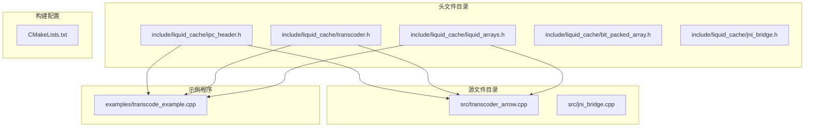
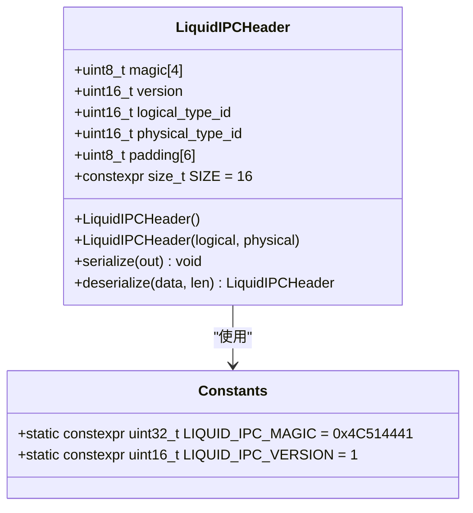
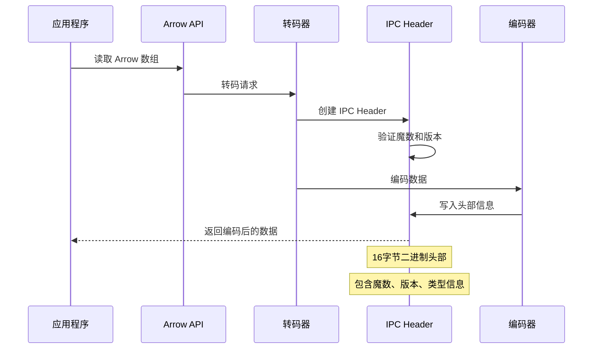
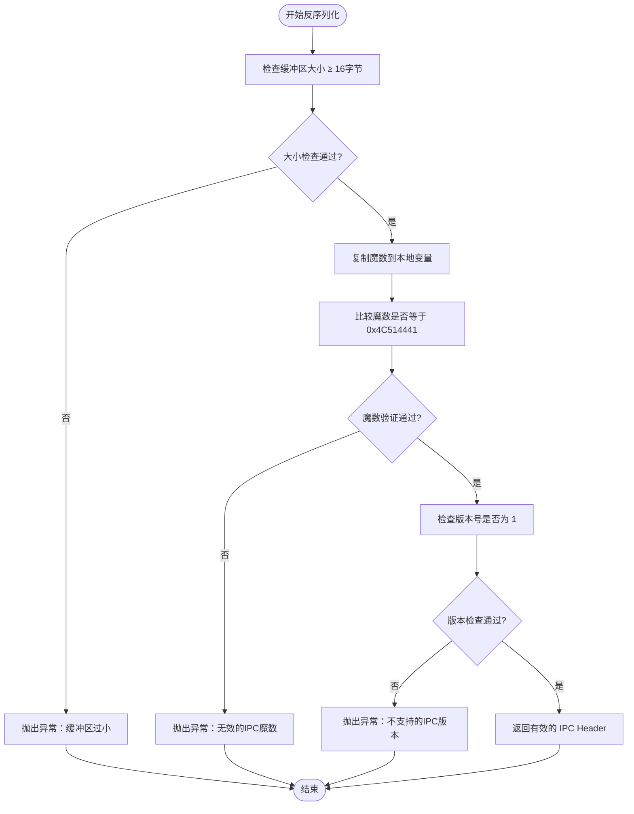
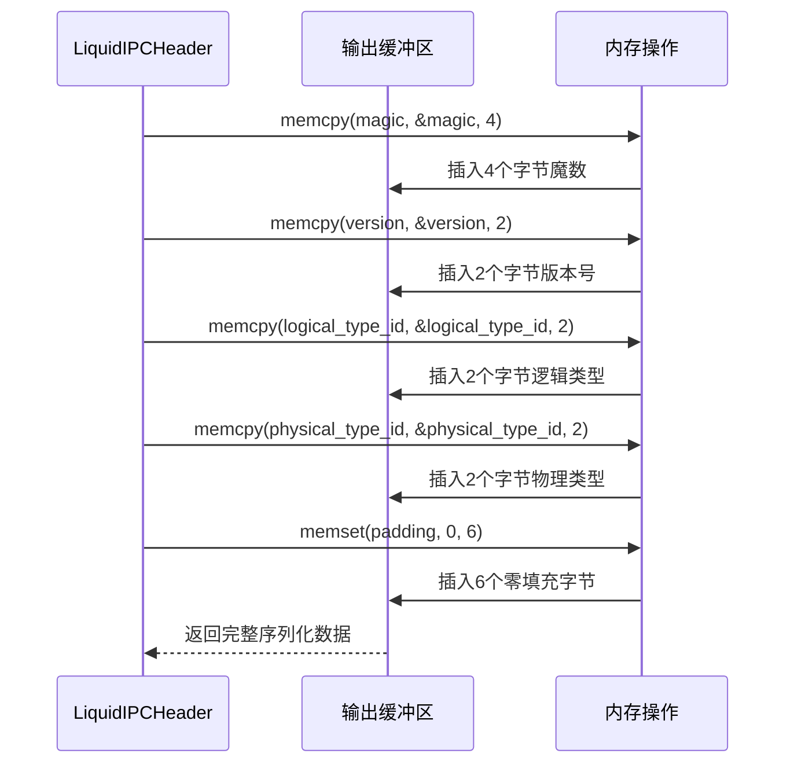
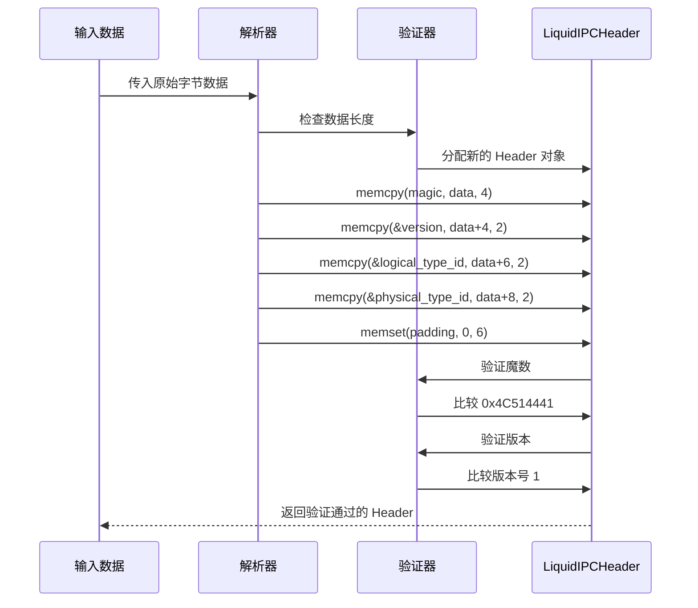
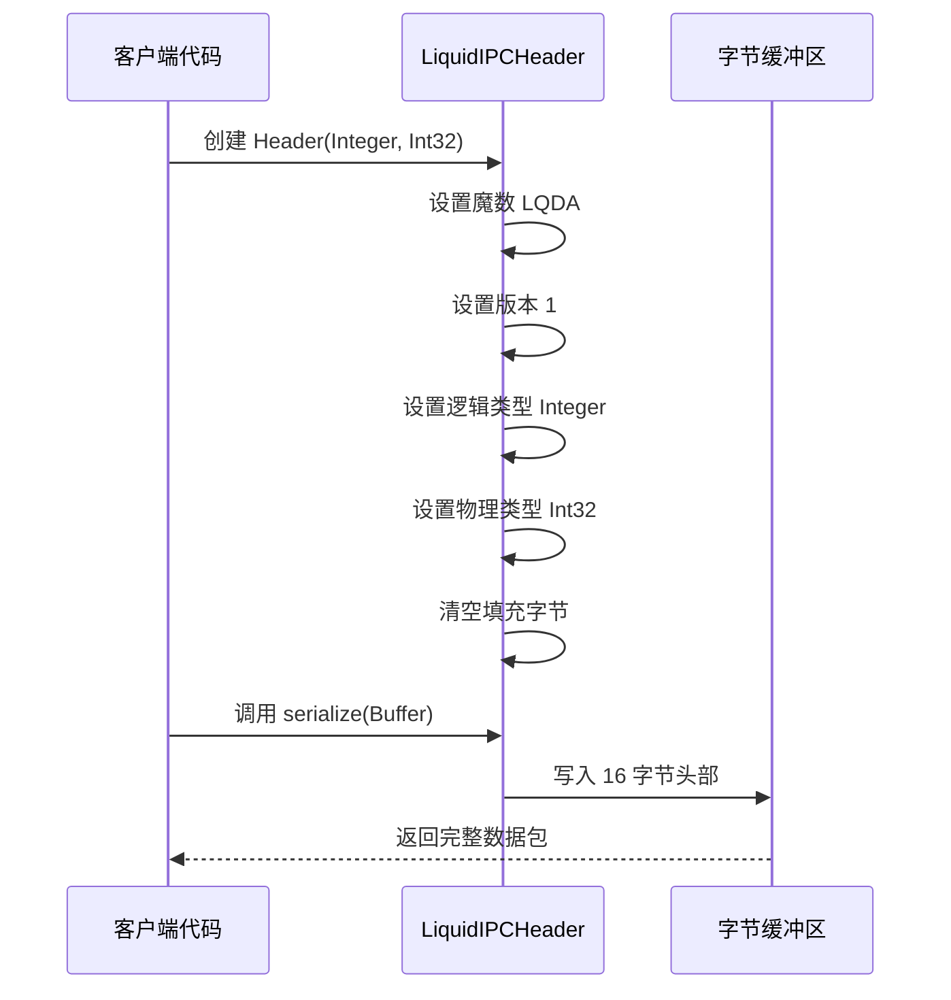
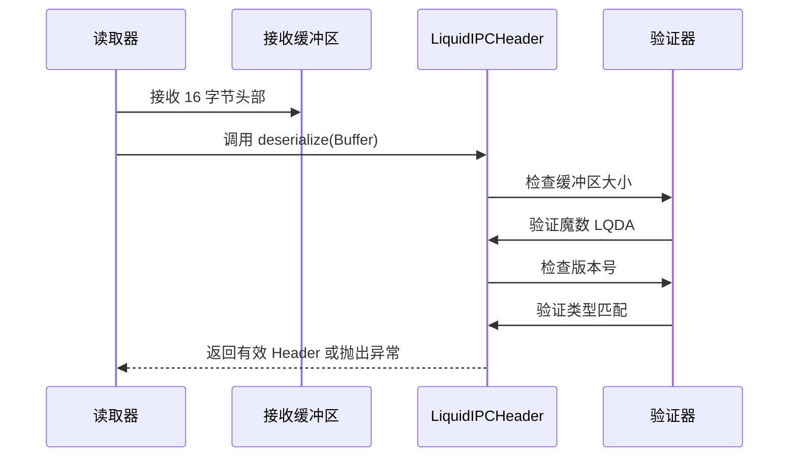
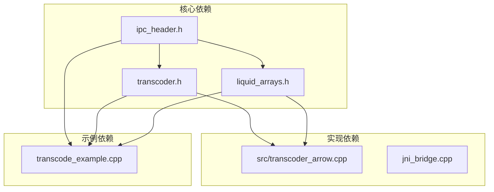

# IPC Header 头部 API

<cite>
**本文档引用的文件**
- [ipc_header.h](file://include/liquid_cache/ipc_header.h)
- [transcoder_arrow.cpp](file://src/transcoder_arrow.cpp)
- [transcoder.h](file://include/liquid_cache/transcoder.h)
- [liquid_arrays.h](file://include/liquid_cache/liquid_arrays.h)
- [transcode_example.cpp](file://examples/transcode_example.cpp)
- [CMakeLists.txt](file://CMakeLists.txt)
</cite>

## 目录
1. [简介](#简介)
2. [项目结构](#项目结构)
3. [核心组件](#核心组件)
4. [架构概览](#架构概览)
5. [详细组件分析](#详细组件分析)
6. [依赖关系分析](#依赖关系分析)
7. [性能考虑](#性能考虑)
8. [故障排除指南](#故障排除指南)
9. [结论](#结论)

## 简介

LiquidIPCHeader 是 Liquid Cache C++ 库中的核心二进制头部结构体，用于在 Arrow 数据格式与 Liquid Cache 编码格式之间建立二进制兼容的通信协议。该头部结构体实现了与 Rust 版本完全兼容的 16 字节二进制格式，确保跨语言、跨平台的数据交换一致性。

该 API 提供了完整的序列化和反序列化接口，支持版本兼容性检查和错误处理机制，是整个 Liquid Cache 系统的数据交换基础。

## 项目结构

Liquid Cache C++ 项目采用模块化设计，主要包含以下核心目录和文件：

**图表来源**
- [CMakeLists.txt:135-179](file://CMakeLists.txt#L135-L179)

**章节来源**
- [CMakeLists.txt:1-179](file://CMakeLists.txt#L1-L179)

## 核心组件

LiquidIPCHeader 结构体是整个 IPC 系统的核心，它定义了 16 字节的二进制头部格式，确保与 Rust 版本的完全兼容性。

### 基本属性

- **固定大小**: 16 字节
- **内存布局**: 使用 `#pragma pack(1)` 确保紧凑的内存布局
- **二进制兼容**: 与 Rust 的 LiquidIPCHeader 完全一致

### 关键常量定义

**图表来源**
- [ipc_header.h:55-106](file://include/liquid_cache/ipc_header.h#L55-L106)

**章节来源**
- [ipc_header.h:12-15](file://include/liquid_cache/ipc_header.h#L12-L15)
- [ipc_header.h:55-63](file://include/liquid_cache/ipc_header.h#L55-L63)

## 架构概览

LiquidIPCHeader 在整个系统中扮演着数据交换协议的角色，连接了 Arrow 数据格式和 Liquid Cache 编码格式。

**图表来源**
- [transcoder_arrow.cpp:36-209](file://src/transcoder_arrow.cpp#L36-L209)
- [ipc_header.h:75-105](file://include/liquid_cache/ipc_header.h#L75-L105)

## 详细组件分析

### LiquidIPCHeader 结构体详解

#### 二进制格式规范

| 字节偏移 | 字段名 | 类型 | 描述 |
|---------|--------|------|------|
| 0-3 | magic | uint8_t[4] | 魔数标识符，值为 "LQDA" (0x4C514441) |
| 4-5 | version | uint16_t | 版本号，当前为 1 |
| 6-7 | logical_type_id | uint16_t | 逻辑类型枚举值 |
| 8-9 | physical_type_id | uint16_t | 物理类型枚举值 |
| 10-15 | padding | uint8_t[6] | 填充字节，必须为零 |

#### 魔数验证机制

魔数验证是确保数据完整性和格式正确性的第一道防线：

**图表来源**
- [ipc_header.h:86-105](file://include/liquid_cache/ipc_header.h#L86-L105)

#### 序列化和反序列化接口

##### serialize() 方法

serialize() 方法负责将 IPC Header 序列化为字节数组：

**图表来源**
- [ipc_header.h:75-84](file://include/liquid_cache/ipc_header.h#L75-L84)

##### deserialize() 方法

deserialize() 方法从字节数组中解析 IPC Header：

**图表来源**
- [ipc_header.h:86-105](file://include/liquid_cache/ipc_header.h#L86-L105)

**章节来源**
- [ipc_header.h:75-105](file://include/liquid_cache/ipc_header.h#L75-L105)

### 类型系统

#### 逻辑类型枚举 (LiquidDataType)

逻辑类型定义了数据的语义含义：

| 枚举值 | 类型名称 | 描述 |
|--------|----------|------|
| 1 | Integer | 整数类型数据 |
| 2 | Float | 浮点数类型数据 |
| 3 | FixedLenByteArray | 固定长度字节数组 |
| 4 | ByteViewArray | 可变长度字节数组视图 |
| 5 | LinearInteger | 线性整数序列 |
| 6 | Decimal | 十进制数值 |

#### 物理类型枚举 (PhysicalType)

物理类型定义了数据的实际存储格式：

| 枚举值 | 类型名称 | 描述 |
|--------|----------|------|
| 0 | Int8 | 8位有符号整数 |
| 1 | Int16 | 16位有符号整数 |
| 2 | Int32 | 32位有符号整数 |
| 3 | Int64 | 64位有符号整数 |
| 4 | UInt8 | 8位无符号整数 |
| 5 | UInt16 | 16位无符号整数 |
| 6 | UInt32 | 32位无符号整数 |
| 7 | UInt64 | 64位无符号整数 |
| 8 | Float32 | 32位浮点数 |
| 9 | Float64 | 64位浮点数 |
| 10 | Date32 | 32位日期 |
| 11 | Date64 | 64位日期 |
| 12 | TimestampSecond | 秒级时间戳 |
| 13 | TimestampMillisecond | 毫秒级时间戳 |
| 14 | TimestampMicrosecond | 微秒级时间戳 |
| 15 | TimestampNanosecond | 纳秒级时间戳 |

**章节来源**
- [ipc_header.h:17-44](file://include/liquid_cache/ipc_header.h#L17-L44)

### 实际使用示例

#### 基础序列化示例

以下示例展示了如何使用 IPC Header 进行基本的序列化操作：

**图表来源**
- [transcode_example.cpp:141-173](file://examples/transcode_example.cpp#L141-L173)

#### 反序列化验证示例

**图表来源**
- [transcode_example.cpp:294-302](file://examples/transcode_example.cpp#L294-L302)

**章节来源**
- [transcode_example.cpp:141-173](file://examples/transcode_example.cpp#L141-L173)
- [transcode_example.cpp:294-302](file://examples/transcode_example.cpp#L294-L302)

## 依赖关系分析

LiquidIPCHeader 在整个系统中与其他组件存在紧密的依赖关系：

**图表来源**
- [transcoder_arrow.cpp:15-18](file://src/transcoder_arrow.cpp#L15-L18)
- [liquid_arrays.h:19](file://include/liquid_cache/liquid_arrays.h#L19)

### 组件耦合度分析

- **高内聚**: IPC Header 专注于头部格式定义，职责单一
- **低耦合**: 通过接口与上层组件交互，避免直接依赖具体实现
- **向后兼容**: 版本控制确保新旧版本的兼容性

**章节来源**
- [transcoder_arrow.cpp:15-18](file://src/transcoder_arrow.cpp#L15-L18)
- [liquid_arrays.h:19](file://include/liquid_cache/liquid_arrays.h#L19)

## 性能考虑

### 内存布局优化

IPC Header 使用 `#pragma pack(1)` 确保紧凑的内存布局，避免编译器添加额外的填充字节：

- **内存效率**: 16 字节紧凑布局，无额外填充
- **缓存友好**: 小尺寸结构体便于 CPU 缓存
- **网络传输**: 固定大小便于网络传输和存储

### 序列化性能

- **零拷贝设计**: 直接内存复制，避免不必要的数据拷贝
- **批量操作**: 支持批量序列化和反序列化
- **内存预分配**: 提供内存容量提示，减少动态扩容

### 错误处理性能

- **早期失败**: 在解析阶段尽早发现格式错误
- **最小化开销**: 异常处理仅在错误情况下触发
- **快速路径**: 正常情况下执行最短路径

## 故障排除指南

### 常见问题及解决方案

#### 魔数验证失败

**症状**: 抛出 "无效的 IPC 魔数" 异常

**可能原因**:
- 数据不是有效的 Liquid Cache 格式
- 数据被截断或损坏
- 平台字节序不匹配

**解决方法**:
- 验证数据源的完整性
- 检查数据传输过程中的损坏
- 确认目标平台的字节序设置

#### 版本不兼容

**症状**: 抛出 "不支持的 IPC 版本" 异常

**可能原因**:
- 使用了不兼容的 Liquid Cache 版本
- 数据格式已更新但客户端未升级

**解决方法**:
- 更新到最新版本的 Liquid Cache
- 检查版本兼容性矩阵
- 实现版本迁移策略

#### 内存访问错误

**症状**: 访问冲突或段错误

**可能原因**:
- 缓冲区大小不足
- 指针为空或无效
- 内存越界访问

**解决方法**:
- 确保缓冲区大小至少为 16 字节
- 验证指针的有效性
- 使用安全的内存访问模式

**章节来源**
- [ipc_header.h:86-105](file://include/liquid_cache/ipc_header.h#L86-L105)

## 结论

LiquidIPCHeader 作为 Liquid Cache 系统的核心组件，成功实现了以下目标：

1. **二进制兼容性**: 与 Rust 版本完全兼容，确保跨语言数据交换
2. **简洁高效**: 16 字节紧凑设计，提供高效的序列化和反序列化
3. **强健验证**: 完善的魔数和版本验证机制，确保数据完整性
4. **清晰接口**: 明确的 API 设计，易于使用和维护

该组件为整个 Liquid Cache 系统奠定了坚实的基础，支持高性能的数据压缩和传输需求。通过合理的错误处理和版本管理，确保了系统的稳定性和可维护性。

在未来的发展中，可以考虑：
- 扩展类型系统以支持更多数据类型
- 优化序列化性能以适应更大规模的数据处理
- 增强错误诊断信息以便于调试和问题定位