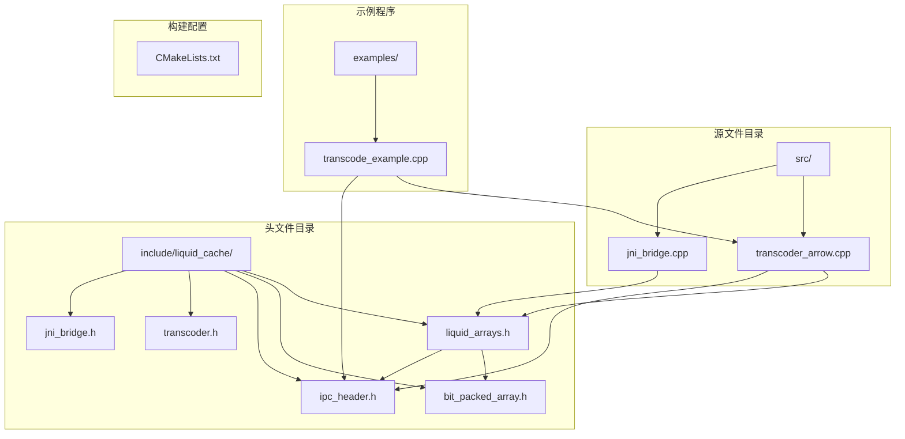
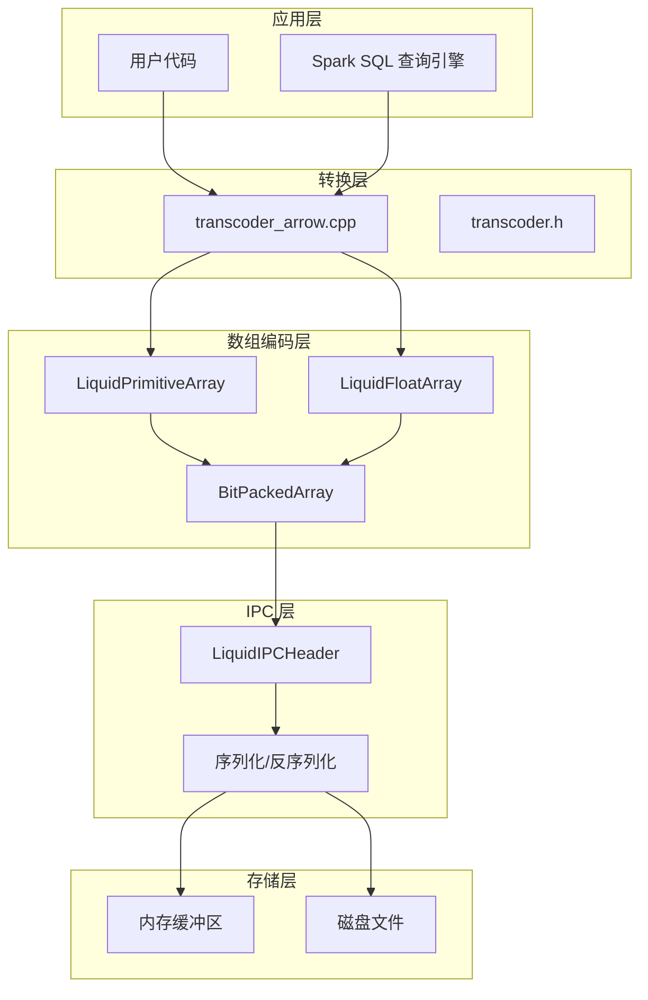
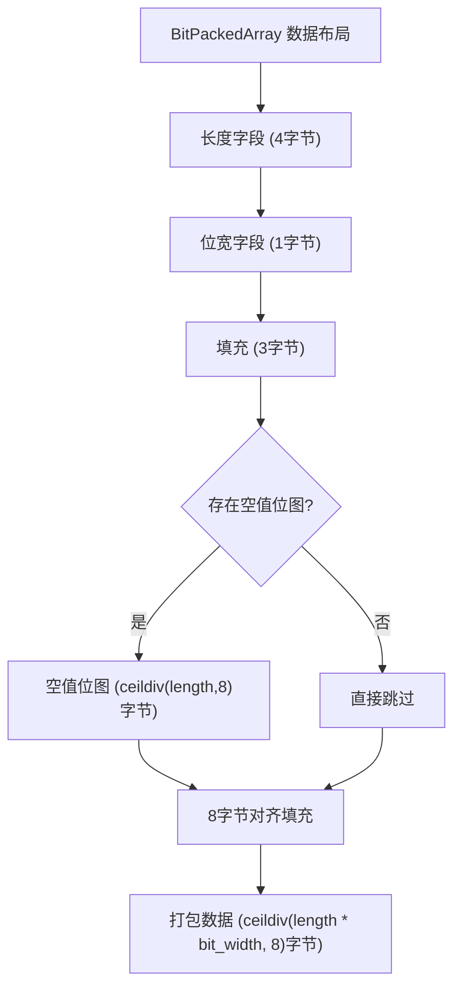
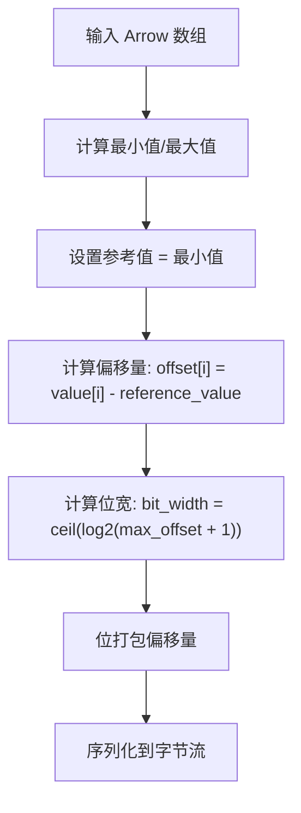
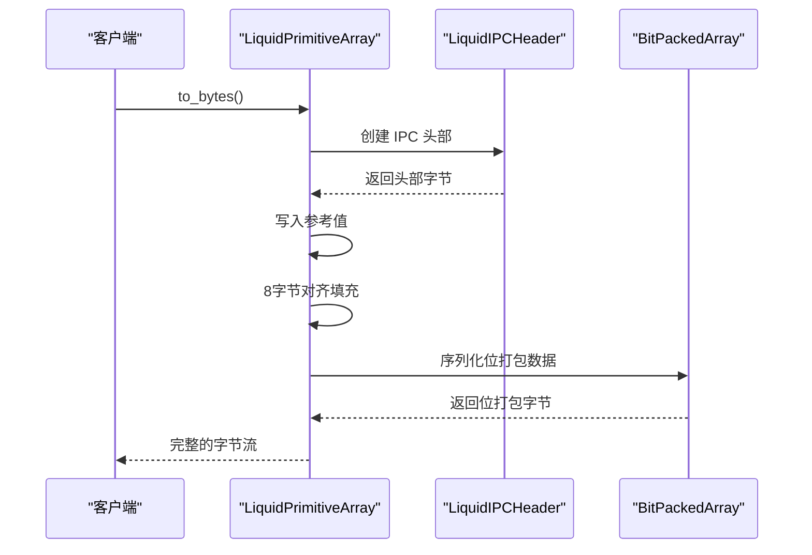
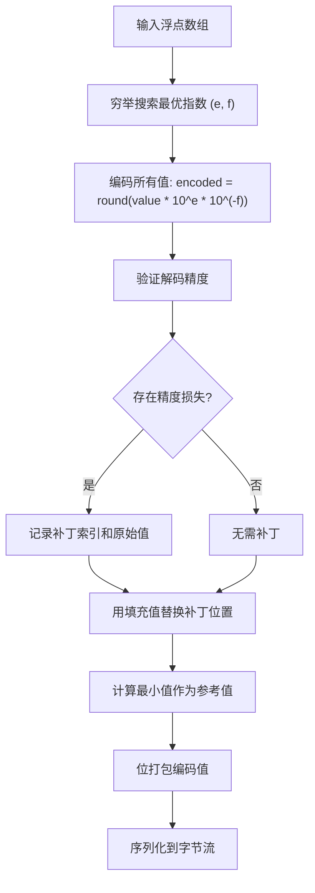
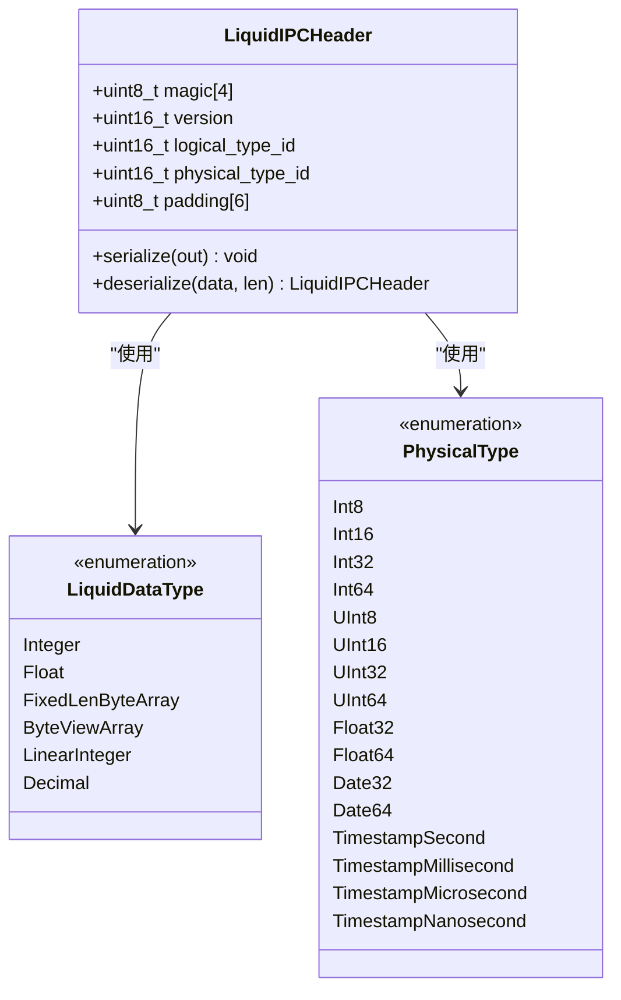
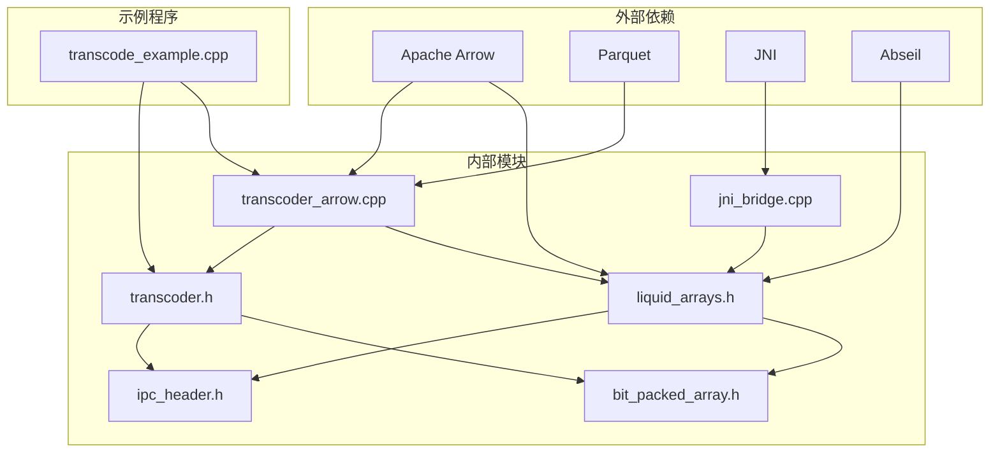

# Liquid Arrays 数组 API

<cite>
**本文档引用的文件**
- [liquid_arrays.h](file://include/liquid_cache/liquid_arrays.h)
- [bit_packed_array.h](file://include/liquid_cache/bit_packed_array.h)
- [ipc_header.h](file://include/liquid_cache/ipc_header.h)
- [transcoder.h](file://include/liquid_cache/transcoder.h)
- [transcoder_arrow.cpp](file://src/transcoder_arrow.cpp)
- [jni_bridge.cpp](file://src/jni_bridge.cpp)
- [transcode_example.cpp](file://examples/transcode_example.cpp)
- [CMakeLists.txt](file://CMakeLists.txt)
</cite>

## 目录
1. [简介](#简介)
2. [项目结构](#项目结构)
3. [核心组件](#核心组件)
4. [架构概览](#架构概览)
5. [详细组件分析](#详细组件分析)
6. [依赖关系分析](#依赖关系分析)
7. [性能考虑](#性能考虑)
8. [故障排除指南](#故障排除指南)
9. [结论](#结论)
10. [附录](#附录)

## 简介

Liquid Arrays 是一个高性能的数组编码和解码库，专为 Apache Arrow 生态系统设计。该库提供了二进制兼容于 Rust 实现的数组格式，支持整数、浮点数和日期类型的有效压缩存储。

主要特性：
- **二进制兼容性**：与 Rust 版本完全兼容的序列化格式
- **高效压缩**：使用帧差分（Frame-of-Reference）+ 位打包技术
- **多类型支持**：整数、浮点数、日期和时间戳类型
- **内存友好**：优化的内存布局和访问模式
- **跨平台**：支持 JNI 桥接，便于与 JVM 生态系统集成

## 项目结构



**图表来源**
- [CMakeLists.txt:167-213](file://CMakeLists.txt#L167-L213)

**章节来源**
- [CMakeLists.txt:1-213](file://CMakeLists.txt#L1-L213)

## 核心组件

### 主要数据结构

Liquid Arrays 库包含以下核心数据结构：

1. **LiquidPrimitiveArray<T>** - 整数类型数组编码器
2. **LiquidFloatArray<T>** - 浮点数类型数组编码器  
3. **BitPackedArray** - 位打包数组存储
4. **LiquidEncodedArray** - 编码后的数组引用
5. **LiquidIPCHeader** - IPC 头部信息

### 类型别名

库提供了多种常用类型别名：
- `LiquidI32Array` / `LiquidI64Array` - 32位/64位有符号整数
- `LiquidU32Array` / `LiquidU64Array` - 32位/64位无符号整数
- `LiquidDate32Array` - 32位日期类型
- `LiquidFloat32Array` / `LiquidFloat64Array` - 32位/64位浮点数

**章节来源**
- [liquid_arrays.h:229-235](file://include/liquid_cache/liquid_arrays.h#L229-L235)
- [liquid_arrays.h:576-577](file://include/liquid_cache/liquid_arrays.h#L576-L577)

## 架构概览



**图表来源**
- [transcoder_arrow.cpp:36-209](file://src/transcoder_arrow.cpp#L36-L209)
- [liquid_arrays.h:91-227](file://include/liquid_cache/liquid_arrays.h#L91-L227)

## 详细组件分析

### BitPackedArray 组件

BitPackedArray 是底层的位打包存储组件，提供高效的位级数据存储。

#### 核心功能

1. **位打包存储**：每个元素使用精确的位宽进行存储
2. **SIMD 友好**：采用 1024 元素块的布局以支持向量化操作
3. **空值处理**：支持可选的空值位图
4. **二进制兼容**：与 Rust 实现完全兼容的二进制格式

#### 内存布局



**图表来源**
- [bit_packed_array.h:21-27](file://include/liquid_cache/bit_packed_array.h#L21-L27)

**章节来源**
- [bit_packed_array.h:28-173](file://include/liquid_cache/bit_packed_array.h#L28-L173)

### LiquidPrimitiveArray 组件

LiquidPrimitiveArray 提供整数类型数组的高效编码，使用帧差分（Frame-of-Reference）+ 位打包技术。

#### 编码算法



**图表来源**
- [liquid_arrays.h:107-161](file://include/liquid_cache/liquid_arrays.h#L107-L161)

#### 序列化格式



**图表来源**
- [liquid_arrays.h:182-202](file://include/liquid_cache/liquid_arrays.h#L182-L202)

**章节来源**
- [liquid_arrays.h:91-227](file://include/liquid_cache/liquid_arrays.h#L91-L227)

### LiquidFloatArray 组件

LiquidFloatArray 实现了自适应无损浮点数编码（ALP），结合位打包技术实现高效压缩。

#### ALP 编码流程



**图表来源**
- [liquid_arrays.h:344-430](file://include/liquid_cache/liquid_arrays.h#L344-L430)

#### 性能优化

ALP 算法的关键优化包括：
- **预计算幂表**：缓存 10 的幂值，避免运行时计算
- **采样搜索**：对大数组使用采样策略减少搜索开销
- **补丁机制**：仅存储精度损失的位置，提高整体压缩率

**章节来源**
- [liquid_arrays.h:258-574](file://include/liquid_cache/liquid_arrays.h#L258-L574)

### IPC Header 组件

IPC Header 提供二进制兼容的头部信息，确保不同语言实现之间的互操作性。

#### 头部格式



**图表来源**
- [ipc_header.h:55-106](file://include/liquid_cache/ipc_header.h#L55-L106)

**章节来源**
- [ipc_header.h:12-117](file://include/liquid_cache/ipc_header.h#L12-L117)

## 依赖关系分析



**图表来源**
- [CMakeLists.txt:8-12](file://CMakeLists.txt#L8-L12)
- [transcoder_arrow.cpp:10-18](file://src/transcoder_arrow.cpp#L10-L18)

### 关键依赖关系

1. **Apache Arrow 集成**：通过 Arrow API 进行数组操作和类型处理
2. **JNI 支持**：提供 JVM 与 C++ 之间的桥接
3. **静态链接策略**：使用静态库链接以确保可移植性
4. **跨平台兼容**：支持 Linux 和其他类 Unix 系统

**章节来源**
- [CMakeLists.txt:14-152](file://CMakeLists.txt#L14-L152)

## 性能考虑

### 内存管理策略

1. **RAII 原则**：所有资源都通过智能指针自动管理
2. **零拷贝设计**：尽量避免不必要的数据复制
3. **内存池优化**：使用 Arrow 默认内存池进行内存分配

### 访问模式优化

1. **SIMD 友好布局**：1024 元素块的位打包布局支持向量化操作
2. **局部性优化**：相邻元素在内存中连续存储
3. **缓存友好的访问**：按顺序访问元素以提高缓存命中率

### 压缩效率

1. **自适应编码**：根据数据特征选择最优编码策略
2. **空值优化**：专门的空值位图减少存储空间
3. **参考值优化**：使用最小值作为参考减少位宽需求

## 故障排除指南

### 常见问题及解决方案

#### 1. 编译错误

**问题**：找不到 Arrow 或 Parquet 头文件
**解决方案**：确保正确设置 CMAKE_PREFIX_PATH 指向 Arrow 安装目录

#### 2. 运行时错误

**问题**：序列化/反序列化失败
**解决方案**：检查 IPC 头部魔数和版本号是否匹配

#### 3. 内存不足

**问题**：大数组处理时内存溢出
**解决方案**：使用批处理方式处理大型数组，或增加系统内存

### 调试技巧

1. **启用详细日志**：通过编译选项启用调试输出
2. **验证数据完整性**：使用 round-trip 测试验证编码/解码正确性
3. **监控内存使用**：跟踪内存分配和释放情况

**章节来源**
- [transcode_example.cpp:177-340](file://examples/transcode_example.cpp#L177-L340)

## 结论

Liquid Arrays 数组 API 提供了一个高性能、二进制兼容的数组编码解决方案。通过帧差分 + 位打包的技术，实现了对整数和浮点数类型的高效压缩存储。库的设计充分考虑了现代 CPU 架构的特点，采用了 SIMD 友好的数据布局和优化的内存访问模式。

主要优势：
- **高性能**：优化的编码算法和内存布局
- **兼容性强**：与 Rust 实现完全二进制兼容
- **易于使用**：简洁的 API 设计，支持智能指针和 RAII
- **跨平台**：支持多种操作系统和架构

## 附录

### 使用示例

#### 基本使用模式

```cpp
// 创建整数数组
auto array = LiquidI32Array::from_arrow(arrow_array);
auto bytes = array.to_bytes();
auto decoded = LiquidI32Array::from_bytes(bytes.data(), bytes.size());
auto result = decoded.to_arrow();
```

#### 浮点数编码示例

```cpp
// 浮点数编码
auto float_array = LiquidFloat32Array::from_arrow(float_arrow_array);
auto encoded = float_array.to_bytes();
```

### 最佳实践

1. **批量处理**：对于大批量数据，使用批处理方式减少内存碎片
2. **类型选择**：根据数据范围选择合适的物理类型
3. **内存预分配**：使用 reserve() 预分配序列化缓冲区大小
4. **错误处理**：始终检查 Arrow Status 返回值
5. **资源管理**：使用智能指针确保资源正确释放

### 性能优化建议

1. **数据预处理**：在编码前进行必要的数据清理和验证
2. **并行处理**：利用多核处理器并行处理多个数组
3. **缓存策略**：合理设置批大小以平衡内存使用和性能
4. **I/O 优化**：使用内存映射文件或异步 I/O 提高数据传输效率