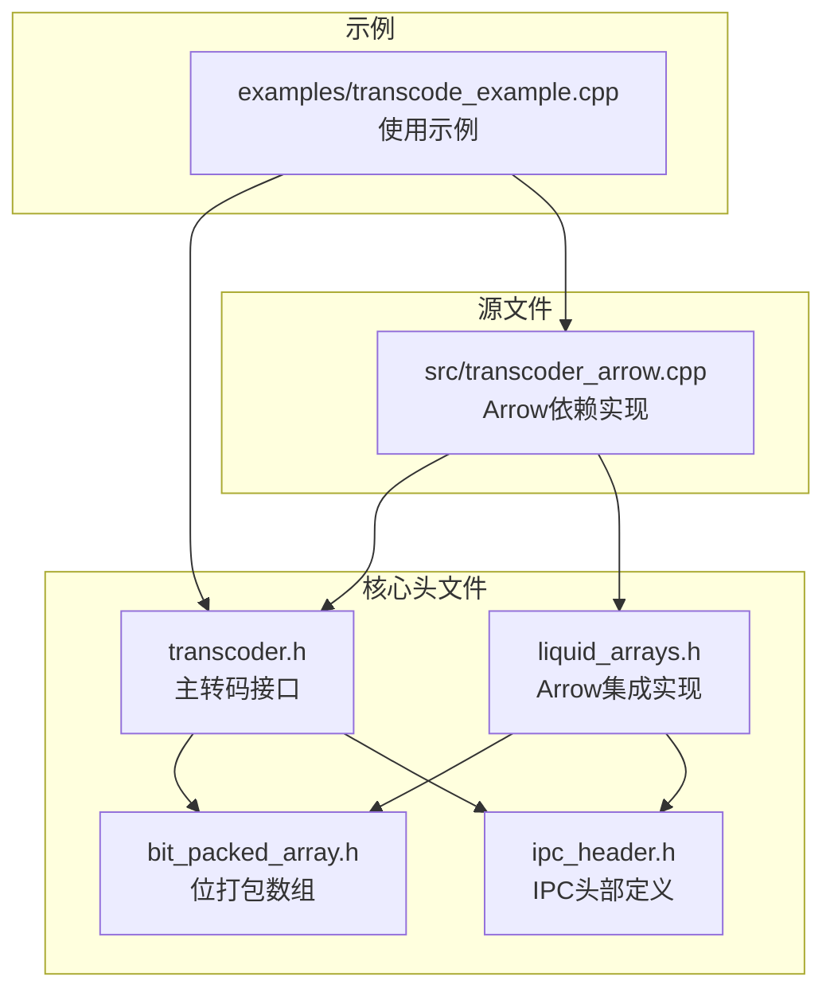
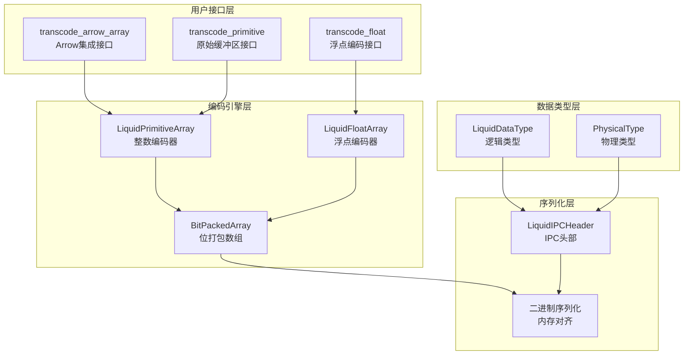
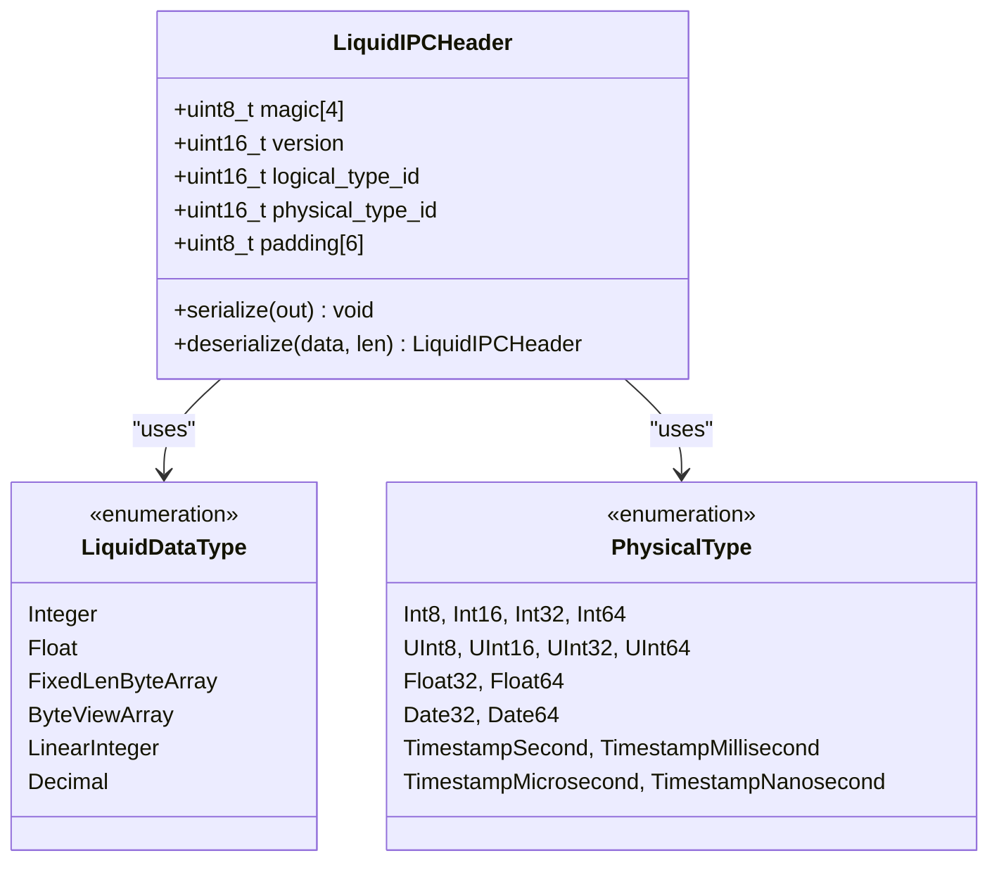
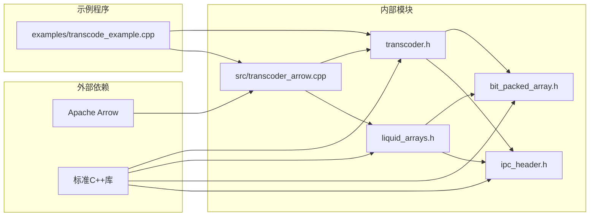
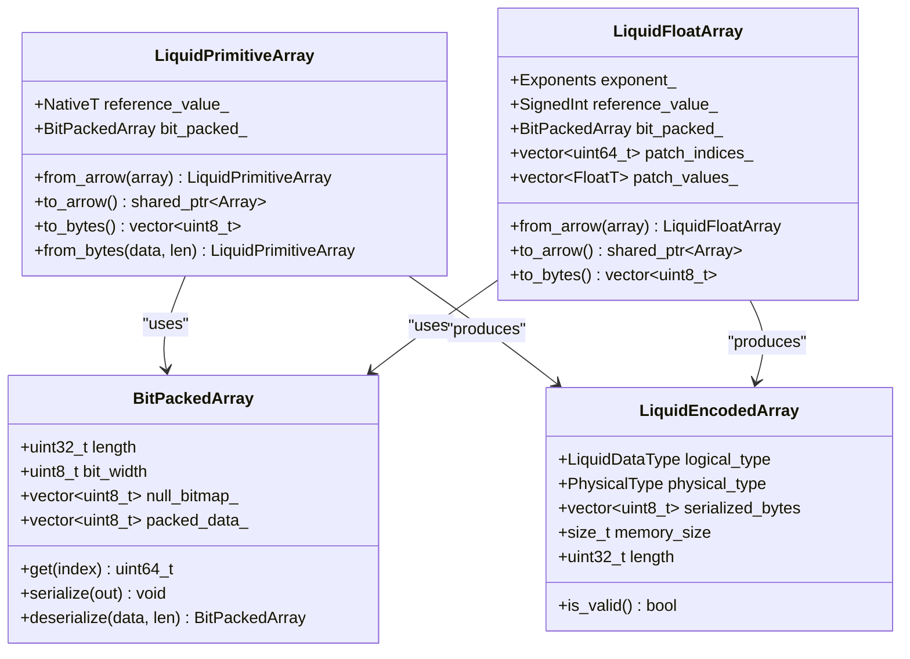

# Transcoder 转码器 API

<cite>
**本文档引用的文件**
- [transcoder.h](file://include/liquid_cache/transcoder.h)
- [transcoder_arrow.cpp](file://src/transcoder_arrow.cpp)
- [liquid_arrays.h](file://include/liquid_cache/liquid_arrays.h)
- [bit_packed_array.h](file://include/liquid_cache/bit_packed_array.h)
- [ipc_header.h](file://include/liquid_cache/ipc_header.h)
- [transcode_example.cpp](file://examples/transcode_example.cpp)
</cite>

## 目录
1. [简介](#简介)
2. [项目结构](#项目结构)
3. [核心组件](#核心组件)
4. [架构概览](#架构概览)
5. [详细组件分析](#详细组件分析)
6. [依赖关系分析](#依赖关系分析)
7. [性能考虑](#性能考虑)
8. [故障排除指南](#故障排除指南)
9. [结论](#结论)

## 简介

Transcoder 转码器 API 是一个高性能的数据压缩和序列化库，专门用于将 Apache Arrow 数组转换为 Liquid Cache 格式。该库提供了两种主要的转码接口：基于 Arrow 的完整实现和基于原始缓冲区的轻量级实现。

该 API 支持多种数据类型的高效编码，包括整数、浮点数、日期时间等，并采用先进的压缩算法如帧参考（Frame-of-Reference）+ 位打包（BitPacking）和自适应无损浮点编码（ALP）。

## 项目结构

项目采用模块化的 C++ 设计，主要包含以下核心模块：



**图表来源**
- [transcoder.h:1-345](file://include/liquid_cache/transcoder.h#L1-L345)
- [liquid_arrays.h:1-580](file://include/liquid_cache/liquid_arrays.h#L1-L580)
- [transcoder_arrow.cpp:1-286](file://src/transcoder_arrow.cpp#L1-L286)

**章节来源**
- [transcoder.h:1-345](file://include/liquid_cache/transcoder.h#L1-L345)
- [liquid_arrays.h:1-580](file://include/liquid_cache/liquid_arrays.h#L1-L580)
- [transcoder_arrow.cpp:1-286](file://src/transcoder_arrow.cpp#L1-L286)

## 核心组件

### LiquidEncodedArray 结构体

`LiquidEncodedArray` 是转码操作的核心输出结构体，用于存储编码后的数据和元信息。

#### 字段定义

| 字段名 | 类型 | 描述 | 默认值 |
|--------|------|------|--------|
| `logical_type` | `LiquidDataType` | 逻辑数据类型标识 | 未初始化 |
| `physical_type` | `PhysicalType` | 物理存储类型标识 | 未初始化 |
| `serialized_bytes` | `std::vector<uint8_t>` | 完整的 IPC 格式字节序列 | 空向量 |
| `memory_size` | `size_t` | 近似内存使用大小 | 0 |
| `length` | `uint32_t` | 元素数量 | 0 |

#### 使用方法

```cpp
// 基本使用示例
LiquidEncodedArray result;
// ... 调用转码函数后填充字段
if (result.is_valid()) {
    // 处理编码后的数据
    size_t size = result.serialized_bytes.size();
    uint32_t count = result.length;
}
```

**章节来源**
- [transcoder.h:25-33](file://include/liquid_cache/transcoder.h#L25-L33)

### 转码函数族

#### transcode_arrow_array()

这是 Arrow 依赖版本的主要转码入口点，支持完整的 Arrow 类型系统。

**函数签名**
```cpp
LiquidEncodedArray transcode_arrow_array(
    const std::shared_ptr<arrow::Array>& array
);
```

**参数说明**
- `array`: 输入的 Arrow 数组指针

**返回值**
- `LiquidEncodedArray`: 编码后的结果对象

**使用场景**
- 从 Arrow 数据结构直接转码
- 支持所有 Arrow 内置类型
- 自动处理空值和元数据

#### transcode_primitive() 模板函数

原始缓冲区版本的整数类型编码接口。

**函数签名**
```cpp
template <typename NativeT>
LiquidEncodedArray transcode_primitive(
    const NativeT* values,
    const uint8_t* null_bitmap,
    uint32_t count,
    PhysicalType physical
);
```

**模板参数约束**
- `NativeT`: 必须是 C++ 原生整数类型（int8_t, int16_t, int32_t, int64_t, uint8_t, uint16_t, uint32_t, uint64_t）

**参数说明**
- `values`: 原始值指针（长度 = count）
- `null_bitmap`: 空值位图（每个值1位，LSB优先）；nullptr 表示无空值
- `count`: 元素数量
- `physical`: 物理类型枚举

**返回值**
- `LiquidEncodedArray`: 编码后的结果

**使用场景**
- JNI 或 Velox 等环境中的直接缓冲区处理
- 避免 Arrow 依赖的轻量级实现
- 性能敏感的应用场景

#### transcode_float() 模板函数

浮点类型编码接口，实现 ALP（自适应无损浮点）算法。

**函数签名**
```cpp
template <typename FloatT>
LiquidEncodedArray transcode_float(
    const FloatT* values,
    const uint8_t* null_bitmap,
    uint32_t count,
    PhysicalType physical
);
```

**模板参数约束**
- `FloatT`: 必须是 `float` 或 `double` 类型

**参数说明**
- `values`: 浮点值指针
- `null_bitmap`: 空值位图
- `count`: 元素数量
- `physical`: 物理类型（Float32 或 Float64）

**返回值**
- `LiquidEncodedArray`: 编码后的结果

**使用场景**
- 高精度数值数据的无损压缩
- 科学计算和金融应用
- 需要保持数值精度的场景

**章节来源**
- [transcoder.h:78-156](file://include/liquid_cache/transcoder.h#L78-L156)
- [transcoder.h:158-342](file://include/liquid_cache/transcoder.h#L158-L342)

## 架构概览

Transcoder API 采用分层架构设计，提供灵活的使用方式：



**图表来源**
- [transcoder.h:15-345](file://include/liquid_cache/transcoder.h#L15-L345)
- [liquid_arrays.h:31-580](file://include/liquid_cache/liquid_arrays.h#L31-L580)
- [bit_packed_array.h:28-176](file://include/liquid_cache/bit_packed_array.h#L28-L176)

## 详细组件分析

### LiquidPrimitiveArray 类

`LiquidPrimitiveArray` 实现了整数和日期类型的高效编码。

#### 核心算法

1. **帧参考（Frame-of-Reference）**: 计算最小值作为参考点
2. **位打包（BitPacking）**: 将偏移量压缩到最小位宽
3. **空值处理**: 通过位图记录空值位置

#### 序列化格式

```
[LiquidIPCHeader: 16B]
[reference_value: sizeof(NativeT)]
[padding to 8-byte alignment]
[BitPackedArray serialized data]
```

**章节来源**
- [liquid_arrays.h:91-227](file://include/liquid_cache/liquid_arrays.h#L91-L227)

### LiquidFloatArray 类

`LiquidFloatArray` 实现了 ALP（自适应无损浮点）编码算法。

#### ALP 算法原理

1. **指数搜索**: 在给定范围内搜索最优指数对 (e, f)
2. **快速舍入**: 使用甜点常数进行快速浮点舍入
3. **补丁机制**: 对无法精确表示的值使用补丁表
4. **位打包**: 对编码后的整数进行位打包压缩

#### 序列化格式

```
[LiquidIPCHeader: 16B]
[reference_value: sizeof(SignedInt)]
[padding to 8B]
[exponent_e: 1B] [exponent_f: 1B] [padding: 6B]
[patch_length: 8B]
[patch_indices: 8B * N] [patch_values: sizeof(FloatT) * N]
[padding to 8B]
[BitPackedArray data]
```

**章节来源**
- [liquid_arrays.h:318-574](file://include/liquid_cache/liquid_arrays.h#L318-L574)

### BitPackedArray 类

位打包数组实现了高效的位级数据存储。

#### 存储特性

- **固定位宽**: 每个元素使用精确的位宽存储
- **SIMD友好**: 1024元素块设计支持向量化操作
- **内存对齐**: 8字节对齐优化访问性能

#### 关键方法

```cpp
// 构造函数
BitPackedArray(const uint64_t* values, const uint8_t* nulls, 
               uint32_t count, uint8_t bit_width);

// 访问方法
uint64_t get(uint32_t index) const;        // 获取单个元素
std::vector<uint64_t> unpack_all() const;  // 解包所有元素

// 序列化
void serialize(std::vector<uint8_t>& out) const;
static BitPackedArray deserialize(const uint8_t* data, size_t len);
```

**章节来源**
- [bit_packed_array.h:28-176](file://include/liquid_cache/bit_packed_array.h#L28-L176)

### IPC 头部系统

IPC 头部确保跨语言兼容性和数据完整性验证。

#### 头部结构



**图表来源**
- [ipc_header.h:55-106](file://include/liquid_cache/ipc_header.h#L55-L106)

**章节来源**
- [ipc_header.h:16-44](file://include/liquid_cache/ipc_header.h#L16-L44)

## 依赖关系分析



**图表来源**
- [transcoder.h:7-13](file://include/liquid_cache/transcoder.h#L7-L13)
- [transcoder_arrow.cpp:10-18](file://src/transcoder_arrow.cpp#L10-L18)

### 类关系图



**图表来源**
- [transcoder.h:25-33](file://include/liquid_cache/transcoder.h#L25-L33)
- [liquid_arrays.h:91-227](file://include/liquid_cache/liquid_arrays.h#L91-L227)
- [liquid_arrays.h:318-574](file://include/liquid_cache/liquid_arrays.h#L318-L574)

**章节来源**
- [transcoder.h:15-345](file://include/liquid_cache/transcoder.h#L15-L345)
- [liquid_arrays.h:31-580](file://include/liquid_cache/liquid_arrays.h#L31-L580)

## 性能考虑

### 内存使用特征

1. **压缩比**: 通常可达到 2:1 到 10:1 的压缩比，取决于数据分布
2. **内存开销**: 
   - 基础开销: IPC 头部 16 字节 + 参考值大小
   - 位打包数据: ceil((元素数 × 位宽)/8) 字节
   - 空值位图: ceil(元素数/8) 字节
   - 补丁表: 对于浮点数，每个补丁约 8+sizeof(FloatT) 字节

### 时间复杂度

1. **整数编码**: O(n) 时间复杂度，需要扫描数据两次
2. **浮点编码**: O(n × e × f) 最坏情况，其中 e 和 f 是指数搜索范围
3. **解码过程**: O(n) 线性时间复杂度

### 优化建议

1. **批量处理**: 大批量数据时性能更优
2. **数据预处理**: 预先去除重复值可提高压缩比
3. **内存对齐**: 利用 8 字节对齐优化访问性能
4. **SIMD扩展**: 位打包数组设计支持向量化操作

## 故障排除指南

### 常见错误类型

1. **无效类型错误**: 当传入不支持的 Arrow 类型时
2. **缓冲区不足**: 序列化或反序列化时缓冲区过小
3. **版本不兼容**: IPC 头部版本不匹配
4. **魔数验证失败**: 数据格式损坏或不兼容

### 错误处理策略

```cpp
try {
    auto result = transcode_arrow_array(array);
    if (!result.is_valid()) {
        // 处理不支持的类型
        handle_unsupported_type(array->type_id());
    }
} catch (const std::exception& e) {
    // 处理序列化异常
    log_error("Transcoding failed: " + std::string(e.what()));
}
```

### 调试技巧

1. **检查 IPC 头部**: 验证魔数和版本号
2. **验证数据完整性**: 确保序列化数据长度正确
3. **测试 round-trip**: 编码后立即解码验证正确性
4. **监控内存使用**: 跟踪 memory_size 字段确认内存分配

**章节来源**
- [transcoder.h:39-58](file://include/liquid_cache/transcoder.h#L39-L58)
- [transcoder_arrow.cpp:236-283](file://src/transcoder_arrow.cpp#L236-L283)

## 结论

Transcoder 转码器 API 提供了一个高性能、类型安全的数据压缩解决方案。其核心优势包括：

1. **多层接口**: 同时支持 Arrow 依赖和原始缓冲区两种使用模式
2. **先进算法**: 采用帧参考 + 位打包和 ALP 编码技术
3. **跨平台兼容**: 二进制格式与 Rust 实现完全兼容
4. **内存效率**: 优化的内存布局和对齐策略

该 API 适用于需要高效数据存储和传输的各种应用场景，特别是大数据处理和实时分析系统。通过合理选择编码策略和优化数据预处理，可以获得最佳的性能和压缩效果。