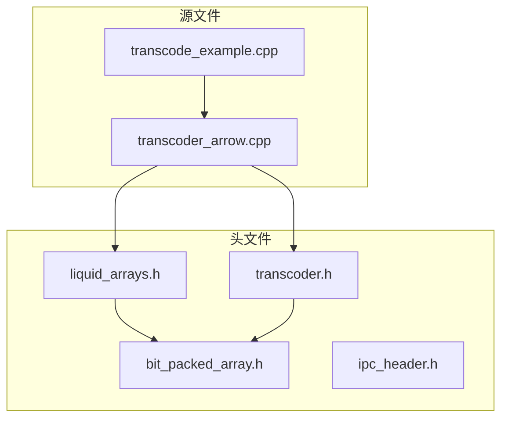
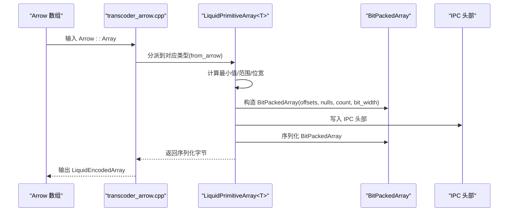
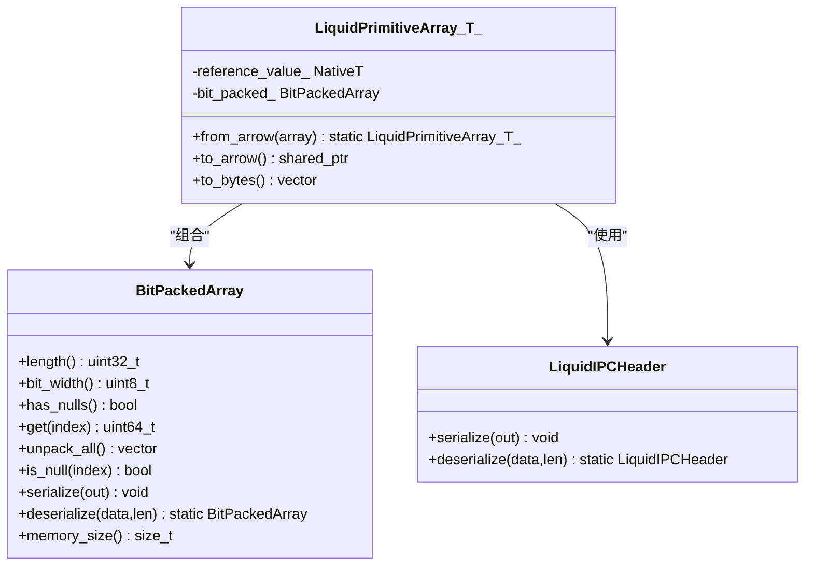

# 位打包数组 API

<cite>
**本文引用的文件**
- [bit_packed_array.h](file://include/liquid_cache/bit_packed_array.h)
- [liquid_arrays.h](file://include/liquid_cache/liquid_arrays.h)
- [ipc_header.h](file://include/liquid_cache/ipc_header.h)
- [transcoder.h](file://include/liquid_cache/transcoder.h)
- [transcoder_arrow.cpp](file://src/transcoder_arrow.cpp)
- [transcode_example.cpp](file://examples/transcode_example.cpp)
</cite>

## 目录
1. [简介](#简介)
2. [项目结构](#项目结构)
3. [核心组件](#核心组件)
4. [架构总览](#架构总览)
5. [详细组件分析](#详细组件分析)
6. [依赖关系分析](#依赖关系分析)
7. [性能考量](#性能考量)
8. [故障排查指南](#故障排查指南)
9. [结论](#结论)
10. [附录](#附录)

## 简介
本文件为 BitPackedArray 位打包数组 API 的权威参考文档。内容覆盖：
- 存储布局与内存组织：长度、位宽、空值位图、打包数据的二进制布局与对齐规则
- 构造函数参数与行为：数据指针、空值位图、元素数量、位宽度的语义与约束
- 序列化/反序列化接口：serialize()/deserialize() 的格式、兼容性与性能要点
- 访问接口：单元素读取、全量解包、空值判断
- 内存占用估算：memory_size() 的组成与使用场景
- 位打包算法细节与 SIMD 优化策略：当前实现为标量，生产环境建议采用 FastLanes 1024 元素块的 SIMD 实现
- 内存对齐、边界处理与错误检查：对齐填充、边界读写、异常抛出

## 项目结构
BitPackedArray 是 Liquid Cache 编解码体系中的基础组件之一，通常与帧差（FoR）编码、位打包、IPC 头部等配合使用，用于整数/日期类型在 Arrow 与自定义格式之间的高效转换与存储。

图表来源
- [bit_packed_array.h:1-176](file://include/liquid_cache/bit_packed_array.h#L1-L176)
- [liquid_arrays.h:1-200](file://include/liquid_cache/liquid_arrays.h#L1-L200)
- [ipc_header.h:1-118](file://include/liquid_cache/ipc_header.h#L1-L118)
- [transcoder.h:90-140](file://include/liquid_cache/transcoder.h#L90-L140)
- [transcoder_arrow.cpp:1-200](file://src/transcoder_arrow.cpp#L1-L200)
- [transcode_example.cpp:1-120](file://examples/transcode_example.cpp#L1-L120)

章节来源
- [bit_packed_array.h:1-176](file://include/liquid_cache/bit_packed_array.h#L1-L176)
- [liquid_arrays.h:1-200](file://include/liquid_cache/liquid_arrays.h#L1-L200)
- [ipc_header.h:1-118](file://include/liquid_cache/ipc_header.h#L1-L118)
- [transcoder.h:90-140](file://include/liquid_cache/transcoder.h#L90-L140)
- [transcoder_arrow.cpp:1-200](file://src/transcoder_arrow.cpp#L1-L200)
- [transcode_example.cpp:1-120](file://examples/transcode_example.cpp#L1-L120)

## 核心组件
- BitPackedArray：无符号整数的位打包容器，支持空值位图、序列化/反序列化、按索引读取与全量解包
- LiquidPrimitiveArray<T>：面向 Arrow 整数/日期类型的编解码器，内部以帧差 + 位打包的方式存储
- IPC 头部：统一的 16 字节头部，标识逻辑类型、物理类型与版本，确保跨语言兼容

章节来源
- [bit_packed_array.h:28-173](file://include/liquid_cache/bit_packed_array.h#L28-L173)
- [liquid_arrays.h:91-180](file://include/liquid_cache/liquid_arrays.h#L91-L180)
- [ipc_header.h:46-106](file://include/liquid_cache/ipc_header.h#L46-L106)

## 架构总览
下图展示从 Arrow 数组到 Liquid Cache 的编码路径，以及 BitPackedArray 在其中的角色。

图表来源
- [transcoder_arrow.cpp:36-164](file://src/transcoder_arrow.cpp#L36-L164)
- [liquid_arrays.h:107-161](file://include/liquid_cache/liquid_arrays.h#L107-L161)
- [bit_packed_array.h:38-46](file://include/liquid_cache/bit_packed_array.h#L38-L46)
- [ipc_header.h:75-84](file://include/liquid_cache/ipc_header.h#L75-L84)

## 详细组件分析

### BitPackedArray 类与二进制布局
- 存储布局（与 Rust 对应实现一致）：
  - 长度 length：4 字节，无符号整型
  - 位宽 bit_width：1 字节，每元素占用位数（0 表示全零）
  - 填充 padding：3 字节，置零
  - 空值位图 null_bitmap：可选，ceildiv(length, 8) 字节；当存在空值时出现
  - 对齐填充：空值位图后按 8 字节对齐
  - 打包数据 packed_data：ceildiv(length × bit_width, 8) 字节
- 内存组织：
  - packed_data 按位线性存储，每个元素占用 bit_width 位
  - 读取时通过 bit_offset 计算字节偏移与位偏移，进行掩码与右移提取
  - 空值位图按位存储，LSB 优先，is_null(index) 通过位测试判断

章节来源
- [bit_packed_array.h:21-27](file://include/liquid_cache/bit_packed_array.h#L21-L27)
- [bit_packed_array.h:77-92](file://include/liquid_cache/bit_packed_array.h#L77-L92)
- [bit_packed_array.h:104-107](file://include/liquid_cache/bit_packed_array.h#L104-L107)

### 构造函数与参数配置
- 参数说明：
  - values：原始无符号值数组，长度为 count
  - nulls：可选空值位图，1 位表示对应元素为空；为 nullptr 表示无空值
  - count：元素个数
  - bit_width：每元素位宽（0..64），0 表示所有元素均为 0
- 行为：
  - 若 nulls 非空，按 ceildiv(count, 8) 复制位图
  - 调用 pack() 进行打包；若 bit_width==0 或 count==0，则清空打包数据

章节来源
- [bit_packed_array.h:32-46](file://include/liquid_cache/bit_packed_array.h#L32-L46)

### pack() 位打包算法细节
- 输入：values、count、bit_width
- 步骤：
  - 计算总位数与总字节数，分配 packed_data
  - 遍历每个元素：
    - 将值限制在 bit_width 位范围内
    - 计算该元素起始位位置 bit_offset
    - 计算字节索引 byte_idx 与位偏移 bit_idx
    - 将值左移 bit_idx 后，写入目标字节（最多 9 字节，覆盖可能跨越的多个字节）
- 复杂度：时间 O(count × ceil((bit_width+7)/8))，空间 O(ceil(count × bit_width / 8))

章节来源
- [bit_packed_array.h:51-75](file://include/liquid_cache/bit_packed_array.h#L51-L75)

### get() 单元素解包流程
- 计算 bit_offset = index × bit_width
- 计算 byte_idx = bit_offset / 8，bit_idx = bit_offset % 8
- 从 packed_data[byte_idx] 开始读取最多 9 字节，右移 bit_idx 得到原始值
- 若 bit_width < 64，再按 (1ULL << bit_width) - 1 掩码截断高位
- 时间复杂度：O(ceil((bit_width+7)/8))

章节来源
- [bit_packed_array.h:77-92](file://include/liquid_cache/bit_packed_array.h#L77-L92)

### unpack_all() 全量解包
- 逐个调用 get()，返回 std::vector<uint64_t>
- 适合一次性读取全部元素的场景

章节来源
- [bit_packed_array.h:95-101](file://include/liquid_cache/bit_packed_array.h#L95-L101)

### is_null() 空值判断
- 若 null_bitmap 为空，直接返回 false
- 否则按位测试对应字节的第 (index % 8) 位，空值为 0

章节来源
- [bit_packed_array.h:103-107](file://include/liquid_cache/bit_packed_array.h#L103-L107)

### serialize() 与 deserialize() 序列化接口
- serialize()：
  - 写入 length（4 字节）、bit_width（1 字节）、padding（3 字节）
  - 若存在空值位图，写入位图并按 8 字节对齐填充 0
  - 写入 packed_data
- deserialize()：
  - 读取 length 与 bit_width
  - 基于剩余长度与位宽推断是否包含空值位图，并按 8 字节对齐读取
  - 读取 packed_data
- 兼容性：与 Rust 对应实现的二进制格式完全一致
- 性能考虑：
  - 序列化：顺序写入，避免额外拷贝
  - 反序列化：基于长度与位宽的启发式检测，尽量减少误判

章节来源
- [bit_packed_array.h:109-128](file://include/liquid_cache/bit_packed_array.h#L109-L128)
- [bit_packed_array.h:130-159](file://include/liquid_cache/bit_packed_array.h#L130-L159)

### memory_size() 内存占用估算
- 返回 packed_data.size() + null_bitmap.size() + sizeof(BitPackedArray)
- 适用于评估对象在内存中的近似大小，便于缓存与统计

章节来源
- [bit_packed_array.h:164-166](file://include/liquid_cache/bit_packed_array.h#L164-L166)

### 与上层组件的协作
- LiquidPrimitiveArray<T>：
  - 使用 get_bit_width() 计算位宽
  - 生成 offsets（原值减去最小值）与空值位图
  - 以 offsets.data()、nulls、count、bit_width 构造 BitPackedArray
  - 通过 IPC 头部与 reference_value 一起序列化
- IPC 头部：
  - 提供统一的 16 字节头部，标识逻辑类型与物理类型

章节来源
- [liquid_arrays.h:36-39](file://include/liquid_cache/liquid_arrays.h#L36-L39)
- [liquid_arrays.h:107-161](file://include/liquid_cache/liquid_arrays.h#L107-L161)
- [ipc_header.h:46-106](file://include/liquid_cache/ipc_header.h#L46-L106)

## 依赖关系分析

图表来源
- [bit_packed_array.h:28-173](file://include/liquid_cache/bit_packed_array.h#L28-L173)
- [liquid_arrays.h:91-180](file://include/liquid_cache/liquid_arrays.h#L91-L180)
- [ipc_header.h:55-106](file://include/liquid_cache/ipc_header.h#L55-L106)

章节来源
- [bit_packed_array.h:28-173](file://include/liquid_cache/bit_packed_array.h#L28-L173)
- [liquid_arrays.h:91-180](file://include/liquid_cache/liquid_arrays.h#L91-L180)
- [ipc_header.h:55-106](file://include/liquid_cache/ipc_header.h#L55-L106)

## 性能考量
- 当前实现为标量打包/解包，适合教学与原型验证
- 生产环境建议采用 FastLanes 1024 元素块的 SIMD 实现，以获得更好的吞吐与缓存局部性
- 位宽越小，打包密度越高，但解包时的位移与掩码操作会增加开销
- 8 字节对齐可提升内存访问效率，序列化/反序列化已内置对齐逻辑
- 全量解包（unpack_all）会触发多次 get()，在大数组场景下建议按需访问或分批处理

## 故障排查指南
- 反序列化失败（缓冲区过小）：
  - 触发条件：输入长度小于最小头部长度
  - 处理建议：确保传入完整且正确的序列化数据
- 无效的 IPC 魔数或版本：
  - 触发条件：IPC 头部校验失败
  - 处理建议：确认数据来源与版本一致性
- 解包越界或位宽异常：
  - 触发条件：bit_width 为 0 时 get() 返回 0；解包时读取超过 packed_data 边界
  - 处理建议：在调用 get() 前检查 bit_width 与索引合法性；确保序列化数据与构造参数一致

章节来源
- [bit_packed_array.h:130-133](file://include/liquid_cache/bit_packed_array.h#L130-L133)
- [ipc_header.h:86-105](file://include/liquid_cache/ipc_header.h#L86-L105)

## 结论
BitPackedArray 提供了紧凑、可序列化的位打包存储方案，配合帧差与 IPC 头部，构成 Liquid Cache 编解码链路的关键一环。当前实现强调可读性与跨语言兼容，生产部署建议引入 SIMD 优化与更严格的边界检查，以获得更高的性能与稳定性。

## 附录

### API 一览（按功能分类）
- 构造与初始化
  - BitPackedArray(values, nulls, count, bit_width)
  - pack(values, count, bit_width)
- 访问与遍历
  - get(index) -> uint64_t
  - unpack_all() -> vector<uint64_t>
  - is_null(index) -> bool
  - length() / bit_width() / has_nulls()
- 序列化与反序列化
  - serialize(out) -> void
  - deserialize(data, len) -> BitPackedArray
- 内存与统计
  - memory_size() -> size_t

章节来源
- [bit_packed_array.h:32-166](file://include/liquid_cache/bit_packed_array.h#L32-L166)

### 使用示例（概念性说明）
- 编码路径（Arrow -> Liquid Cache）：
  - 通过 transcoder_arrow.cpp 的类型分派，构建 LiquidPrimitiveArray<T>
  - 由 LiquidPrimitiveArray<T> 内部构造 BitPackedArray 并序列化
- 解码路径（Liquid Cache -> Arrow）：
  - 读取 IPC 头部与 reference_value
  - 反序列化 BitPackedArray，按需解包并还原原值

章节来源
- [transcoder_arrow.cpp:36-164](file://src/transcoder_arrow.cpp#L36-L164)
- [liquid_arrays.h:182-200](file://include/liquid_cache/liquid_arrays.h#L182-L200)