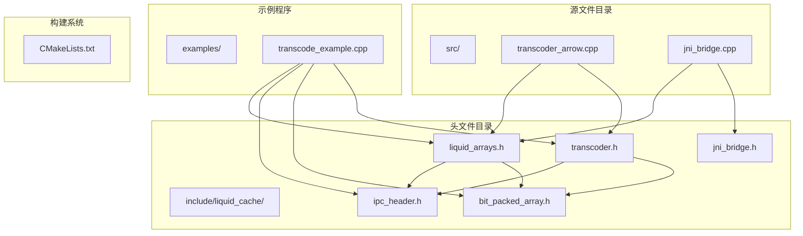
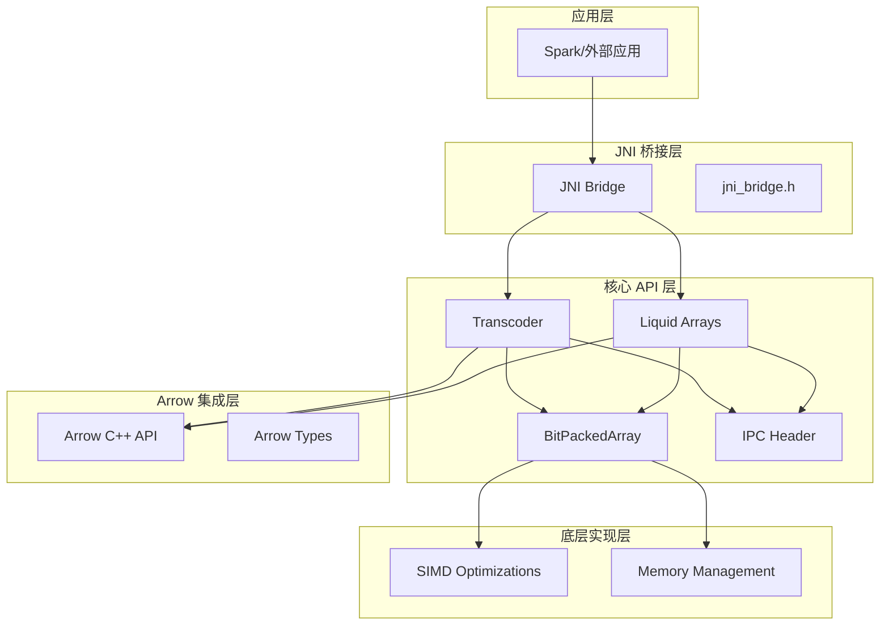
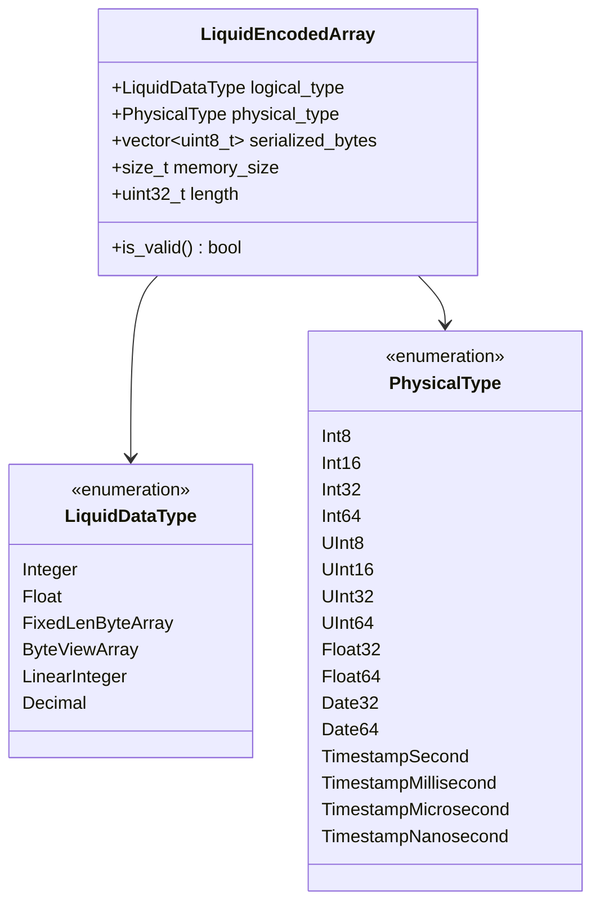
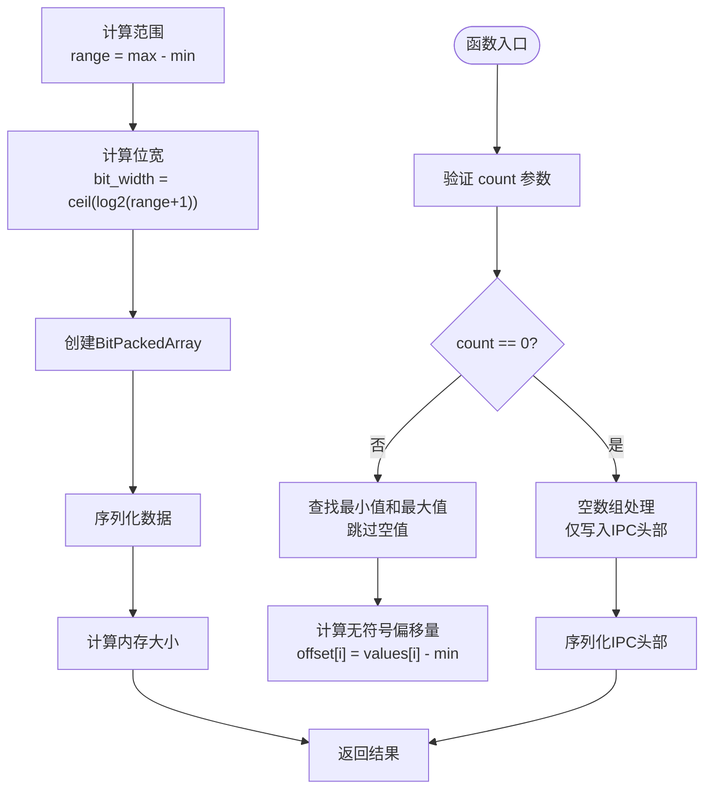
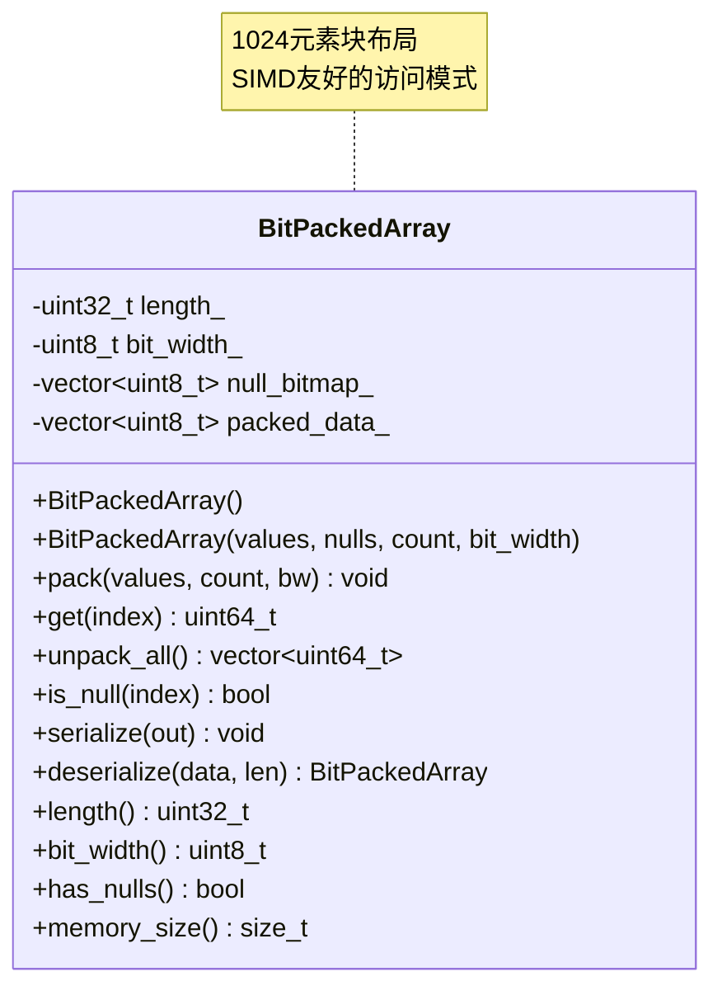
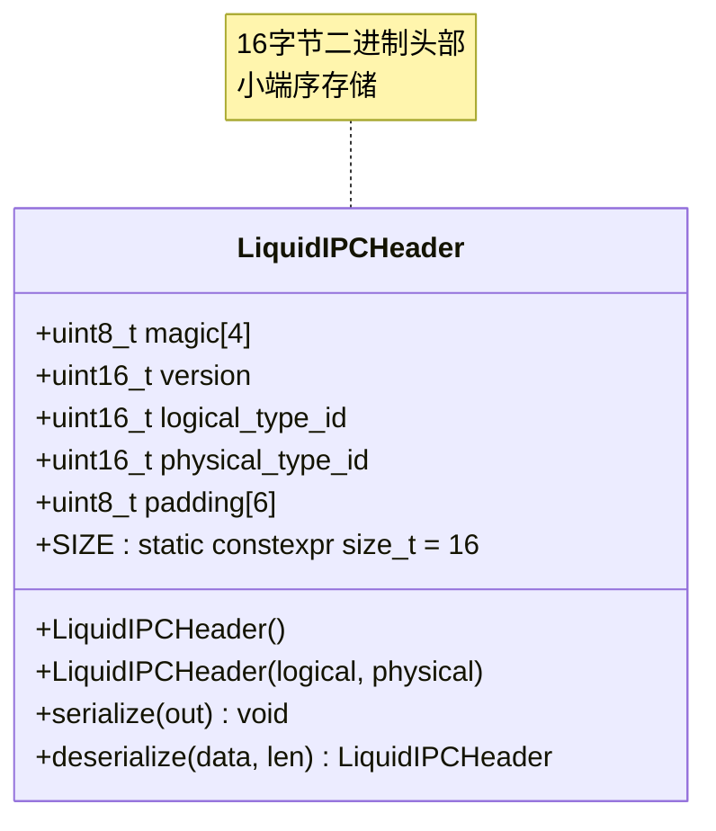
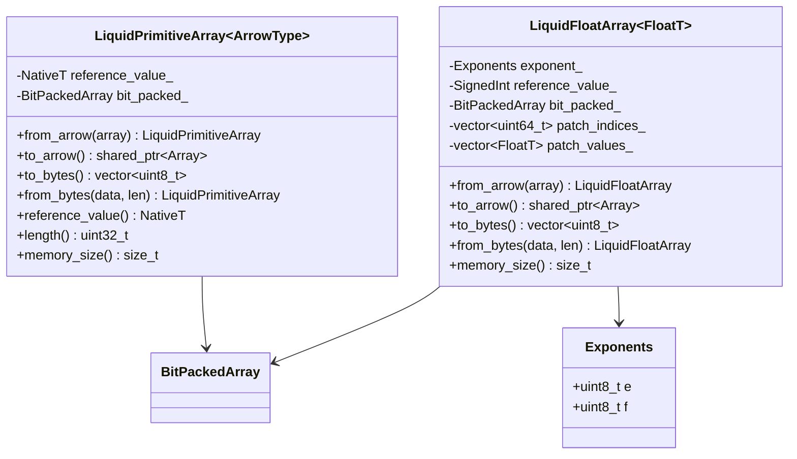
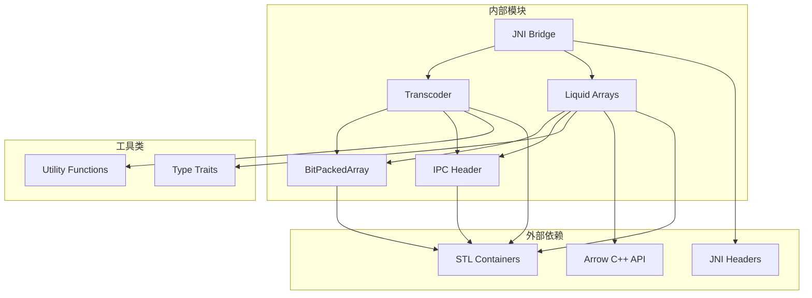

# 核心 API 参考

<cite>
**本文档引用的文件**
- [transcoder.h](file://include/liquid_cache/transcoder.h)
- [bit_packed_array.h](file://include/liquid_cache/bit_packed_array.h)
- [ipc_header.h](file://include/liquid_cache/ipc_header.h)
- [liquid_arrays.h](file://include/liquid_cache/liquid_arrays.h)
- [transcoder_arrow.cpp](file://src/transcoder_arrow.cpp)
- [jni_bridge.cpp](file://src/jni_bridge.cpp)
- [jni_bridge.h](file://include/liquid_cache/jni_bridge.h)
- [transcode_example.cpp](file://examples/transcode_example.cpp)
</cite>

## 目录
1. [简介](#简介)
2. [项目结构](#项目结构)
3. [核心组件](#核心组件)
4. [架构概览](#架构概览)
5. [详细组件分析](#详细组件分析)
6. [依赖关系分析](#依赖关系分析)
7. [性能考虑](#性能考虑)
8. [故障排除指南](#故障排除指南)
9. [结论](#结论)

## 简介

Liquid Cache C++ 核心 API 提供了高性能的数据压缩和序列化功能，专门针对 Arrow 数组进行优化。该库实现了与 Rust 版本完全二进制兼容的格式，支持多种数据类型的高效编码和解码。

主要特性包括：
- **帧式参考(FoR) + 位打包**：用于整数和日期类型
- **自适应无损浮点(ALP)**：用于浮点类型
- **二进制兼容的 IPC 格式**：支持跨语言互操作
- **SIMD 友好的位打包数组**：优化内存访问模式
- **完整的 JNI 桥接**：支持 Spark 集成

## 项目结构



**图表来源**
- [transcoder.h:1-345](file://include/liquid_cache/transcoder.h#L1-L345)
- [bit_packed_array.h:1-176](file://include/liquid_cache/bit_packed_array.h#L1-L176)
- [liquid_arrays.h:1-580](file://include/liquid_cache/liquid_arrays.h#L1-L580)

**章节来源**
- [transcoder.h:1-345](file://include/liquid_cache/transcoder.h#L1-L345)
- [bit_packed_array.h:1-176](file://include/liquid_cache/bit_packed_array.h#L1-L176)
- [ipc_header.h:1-118](file://include/liquid_cache/ipc_header.h#L1-L118)
- [liquid_arrays.h:1-580](file://include/liquid_cache/liquid_arrays.h#L1-L580)

## 核心组件

### Transcoder 类族

Transcoder 类族提供了两种主要的转码接口：

1. **原始缓冲区接口**：无需 Arrow 依赖，直接处理原始数据指针
2. **Arrow 集成接口**：与 Arrow C++ API 完全集成

### BitPackedArray 类

位打包数组是整个系统的核心数据结构，采用 SIMD 友好的 1024 元素块布局，支持高效的并行访问。

### IPC Header 结构

Liquid Cache 使用 16 字节的二进制 IPC 头部，确保与 Rust 实现的完全兼容性。

**章节来源**
- [transcoder.h:15-345](file://include/liquid_cache/transcoder.h#L15-L345)
- [bit_packed_array.h:13-176](file://include/liquid_cache/bit_packed_array.h#L13-L176)
- [ipc_header.h:10-118](file://include/liquid_cache/ipc_header.h#L10-L118)

## 架构概览



**图表来源**
- [jni_bridge.cpp:1-320](file://src/jni_bridge.cpp#L1-L320)
- [transcoder_arrow.cpp:1-286](file://src/transcoder_arrow.cpp#L1-L286)
- [transcoder.h:1-345](file://include/liquid_cache/transcoder.h#L1-L345)

## 详细组件分析

### Transcoder 类详细分析

#### LiquidEncodedArray 结构体

`LiquidEncodedArray` 是类型擦除的液态数组句柄，等价于 Rust 的 `LiquidArrayRef = Arc<dyn LiquidArray>`。



**图表来源**
- [transcoder.h:23-33](file://include/liquid_cache/transcoder.h#L23-L33)
- [ipc_header.h:16-44](file://include/liquid_cache/ipc_header.h#L16-L44)

##### transcode_primitive() 方法

`transcode_primitive()` 是模板方法，支持所有原生整数类型（int8_t 到 int64_t）。

**函数签名**
```cpp
template <typename NativeT>
LiquidEncodedArray transcode_primitive(
    const NativeT* values,
    const uint8_t* null_bitmap,
    uint32_t count,
    PhysicalType physical
);
```

**参数说明**
- `values`: 原始值指针，长度为 `count`
- `null_bitmap`: 空值位图（每个值1位，LSB优先），nullptr 表示无空值
- `count`: 元素数量
- `physical`: 物理类型枚举（PhysicalType）

**模板参数约束**
- `NativeT`: 必须是 C 原生整数类型（int8_t, int16_t, int32_t, int64_t, uint8_t, uint16_t, uint32_t, uint64_t）
- 使用 `std::make_unsigned_t<NativeT>` 转换为无符号类型

**算法流程**


**图表来源**
- [transcoder.h:78-156](file://include/liquid_cache/transcoder.h#L78-L156)

**异常处理**
- 当 `count == 0` 时正常返回，仅包含 IPC 头部
- 未指定显式的异常抛出，依赖调用方错误检查

**使用场景**
- 直接从 JNI 或 Velox 调用
- 无需 Arrow 依赖的独立转码
- 性能敏感的批量数据处理

##### transcode_float() 方法

`transcode_float()` 实现了自适应无损浮点编码（ALP）。

**函数签名**
```cpp
template <typename FloatT>
LiquidEncodedArray transcode_float(
    const FloatT* values,
    const uint8_t* null_bitmap,
    uint32_t count,
    PhysicalType physical
);
```

**模板参数约束**
- `FloatT`: 必须是 `float` 或 `double` 类型
- 使用 `std::is_floating_point_v<FloatT>` 进行静态断言

**ALP 编码算法**
1. **指数搜索**：在预定义范围内搜索最优指数对 (e, f)
2. **编码**：`encoded = round(value × 10^e × 10^(-f))`
3. **校验**：验证解码精度，记录需要修补的位置
4. **位打包**：对编码后的值进行位打包压缩

**PATCH 机制**
- 对于无法精确表示的值，记录其索引和原始值
- 使用填充值替换修补位置以提高压缩率

**内存布局**
```
[IPC Header: 16B] + [Reference Value: 4/8B] + [Padding: 0-7B] + 
[ALP Parameters: 8B] + [Patch Data: 8+8N+N×F] + [BitPackedArray]
```

**章节来源**
- [transcoder.h:158-342](file://include/liquid_cache/transcoder.h#L158-L342)

### BitPackedArray 类详细分析

BitPackedArray 是 SIMD 友好的位打包整数存储，每个元素恰好使用 `bit_width` 位。



**图表来源**
- [bit_packed_array.h:28-173](file://include/liquid_cache/bit_packed_array.h#L28-L173)

#### 存储布局

**二进制格式（与 Rust BitPackedArray::to_bytes/from_bytes 匹配）**
```
[0..3]  length      (uint32_t, 元素数量)
[4..4]  bit_width   (uint8_t, 每元素位数; 0 = 全零)
[5..8]  padding     (3字节, 零填充)
[8..N]  null_bitmap (ceildiv(length, 8)字节; 无空值时省略)
        padding to 8字节对齐
        packed data (ceildiv(length * bit_width, 8)字节)
```

**内存管理策略**
- 使用 `std::vector<uint8_t>` 进行动态内存分配
- 支持空值位图的可选存储
- 内存对齐到 8 字节边界

**访问接口**
- `get(index)`: 单元素随机访问，时间复杂度 O(1)
- `unpack_all()`: 批量解包，时间复杂度 O(n)
- `is_null(index)`: 空值检查，时间复杂度 O(1)

**章节来源**
- [bit_packed_array.h:15-176](file://include/liquid_cache/bit_packed_array.h#L15-L176)

### IPC Header 详细分析

LiquidIPCHeader 提供了与 Rust 实现完全二进制兼容的 16 字节 IPC 头部。



**图表来源**
- [ipc_header.h:46-106](file://include/liquid_cache/ipc_header.h#L46-L106)

#### 二进制格式规范

**内存布局（小端序）**
```
[0..3]   magic           (0x4C514441 = "LQDA")
[4..5]   version         (当前为1)
[6..7]   logical_type_id (LiquidDataType枚举值)
[8..9]   physical_type_id(PhysicalType枚举值)
[10..15] padding         (零填充)
```

**字段定义**
- `magic`: 魔术数字，固定值 0x4C514441
- `version`: 版本号，当前为 1
- `logical_type_id`: 逻辑类型标识符
- `physical_type_id`: 物理类型标识符

**版本兼容性**
- 当前版本：1
- 向后兼容：新版本可能添加字段但保持前16字节不变
- 错误检测：通过魔术数字和版本号验证

**章节来源**
- [ipc_header.h:12-118](file://include/liquid_cache/ipc_header.h#L12-L118)

### Liquid Arrays 类族

Liquid Arrays 提供了与 Arrow 类型完全对应的 C++ 实现，支持完整的序列化和反序列化。



**图表来源**
- [liquid_arrays.h:91-227](file://include/liquid_cache/liquid_arrays.h#L91-L227)
- [liquid_arrays.h:318-574](file://include/liquid_cache/liquid_arrays.h#L318-L574)

#### LiquidPrimitiveArray 模板类

**算法流程（FoR + BitPacking）**
1. 计算非空值的最小值和最大值
2. 设置参考值为最小值
3. 计算每个值的无符号偏移量
4. 计算所需的位宽
5. 使用 BitPackedArray 进行位打包

**序列化布局**
```
[LiquidIPCHeader: 16B] + [reference_value: sizeof(NativeT)] + 
[padding to 8B] + [BitPackedArray serialized data]
```

**章节来源**
- [liquid_arrays.h:77-227](file://include/liquid_cache/liquid_arrays.h#L77-L227)

#### LiquidFloatArray 模板类

**ALP 编码流程**
1. 采样值集寻找最优指数对 (e, f)
2. 对每个值执行编码：`encoded = round(value × 10^e × 10^(-f))`
3. 验证解码精度，记录修补位置
4. 使用位打包压缩编码后的值

**PATCH 数据结构**
- `patch_indices_`: 修补位置的索引数组
- `patch_values_`: 对应的原始值数组

**序列化布局**
```
[LiquidIPCHeader: 16B] + [reference_value: 4/8B] + [padding] +
[exponent_e: 1B] + [exponent_f: 1B] + [padding: 6B] +
[patch_length: 8B] + [patch_indices: 8×N] + [patch_values: F×N] +
[padding] + [BitPackedArray data]
```

**章节来源**
- [liquid_arrays.h:236-574](file://include/liquid_cache/liquid_arrays.h#L236-L574)

## 依赖关系分析



**图表来源**
- [transcoder_arrow.cpp:1-286](file://src/transcoder_arrow.cpp#L1-L286)
- [jni_bridge.cpp:1-320](file://src/jni_bridge.cpp#L1-L320)

**章节来源**
- [transcoder_arrow.cpp:1-286](file://src/transcoder_arrow.cpp#L1-L286)
- [jni_bridge.cpp:1-320](file://src/jni_bridge.cpp#L1-L320)

## 性能考虑

### 时间复杂度分析

1. **transcode_primitive()**: O(n)
   - 查找最小值和最大值：O(n)
   - 计算偏移量：O(n)
   - 位打包：O(n)

2. **transcode_float()**: O(n × e × f)
   - 指数搜索：O(e × f)，其中 e, f 在常数范围内
   - 编码和校验：O(n)

3. **BitPackedArray::get()**: O(1)
4. **BitPackedArray::unpack_all()**: O(n)
5. **序列化/反序列化**: O(n)

### 内存使用特征

1. **压缩比**：通常 2:1 到 10:1，取决于数据分布
2. **额外内存开销**：
   - IPC 头部：16 字节
   - 参考值：4-8 字节
   - PATCH 数据：每修补项 8+N 字节
   - 位打包数据：ceildiv(n × bit_width, 8) 字节

### 优化建议

1. **批处理**：对大量小数组进行批处理以减少 IPC 开销
2. **内存池**：使用内存池减少频繁分配
3. **SIMD 扩展**：利用 AVX/SSE 指令加速位打包
4. **缓存友好**：按 1024 元素块访问以提高缓存命中率

## 故障排除指南

### 常见错误和解决方案

**IPC 头部验证失败**
- **症状**：`Invalid Liquid IPC magic number` 或 `Unsupported Liquid IPC version`
- **原因**：数据损坏或版本不兼容
- **解决**：检查数据完整性，确保使用相同版本的库

**位打包数组解析错误**
- **症状**：`BitPackedArray: buffer too small`
- **原因**：缓冲区大小不足或数据格式错误
- **解决**：验证序列化数据长度，检查对齐要求

**Arrow 类型转换错误**
- **症状**：`Expected Integer logical type` 或类型不匹配
- **原因**：序列化数据与期望类型不符
- **解决**：检查 IPC 头部中的逻辑类型标识符

**内存分配失败**
- **症状**：`std::bad_alloc`
- **原因**：内存不足或数组过大
- **解决**：增加系统内存，分批处理大数据集

**章节来源**
- [ipc_header.h:86-105](file://include/liquid_cache/ipc_header.h#L86-L105)
- [bit_packed_array.h:131-159](file://include/liquid_cache/bit_packed_array.h#L131-L159)
- [transcoder_arrow.cpp:236-283](file://src/transcoder_arrow.cpp#L236-L283)

## 结论

Liquid Cache C++ 核心 API 提供了一个高性能、二进制兼容的数据压缩和序列化解决方案。通过精心设计的算法和数据结构，该库能够在保持与 Rust 实现完全兼容的同时，提供出色的性能表现。

关键优势包括：
- **完全二进制兼容**：与 Rust 实现无缝互操作
- **高性能编码**：FoR + BitPacking 和 ALP 编码方案
- **SIMD 友好**：优化的内存布局支持并行处理
- **完整的 JNI 支持**：便于集成到 Spark 生态系统
- **类型安全**：强类型模板设计确保编译时类型检查

该 API 适用于大规模数据分析场景，特别是需要高性能数据传输和存储的应用程序。