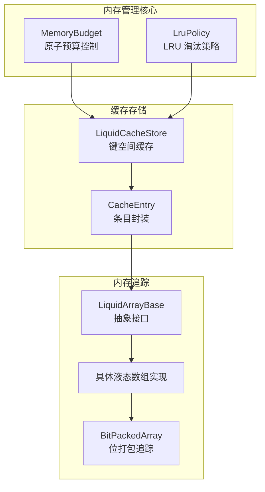
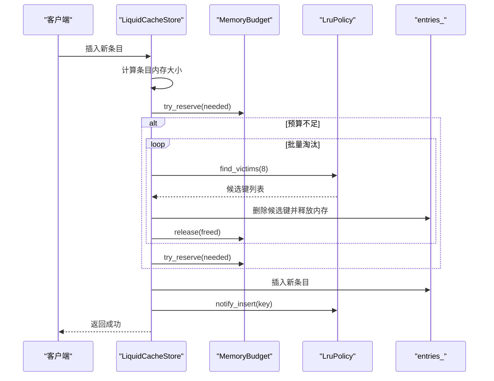
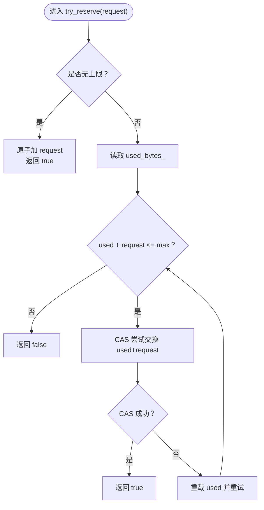
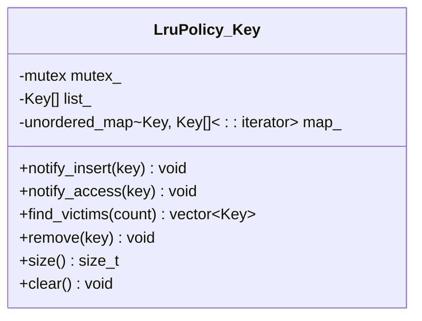
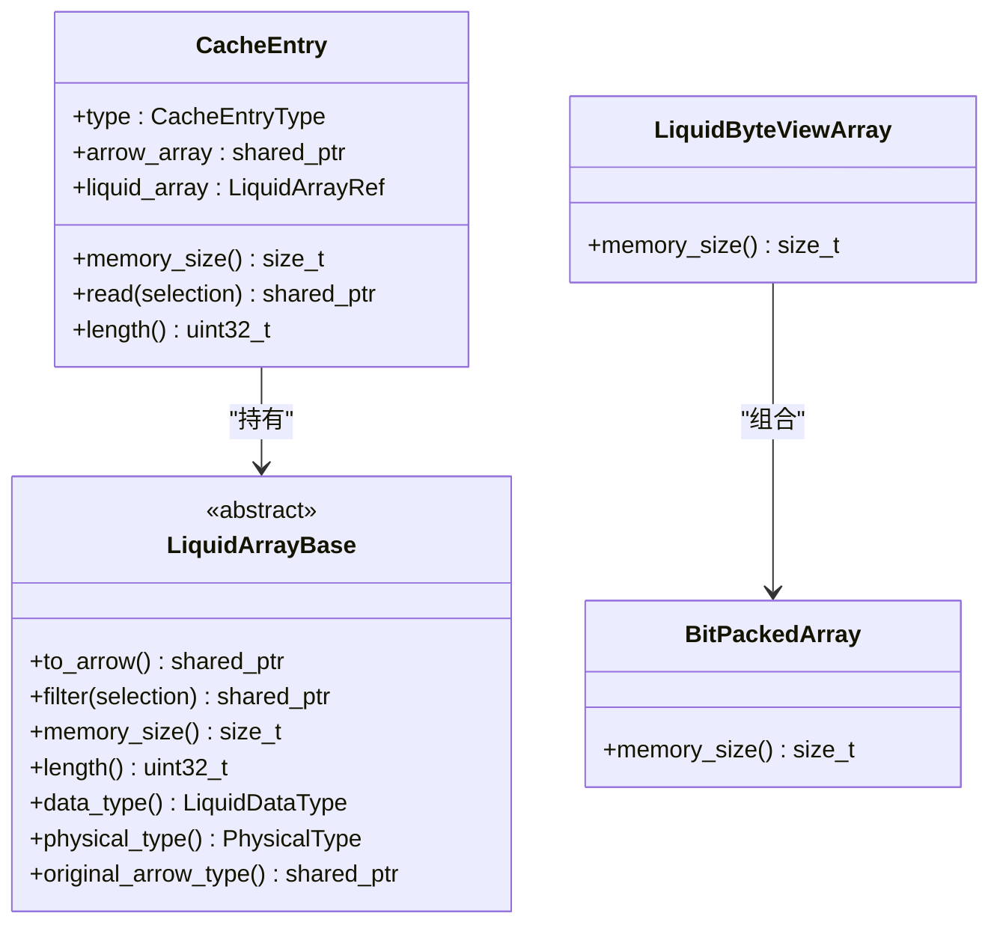
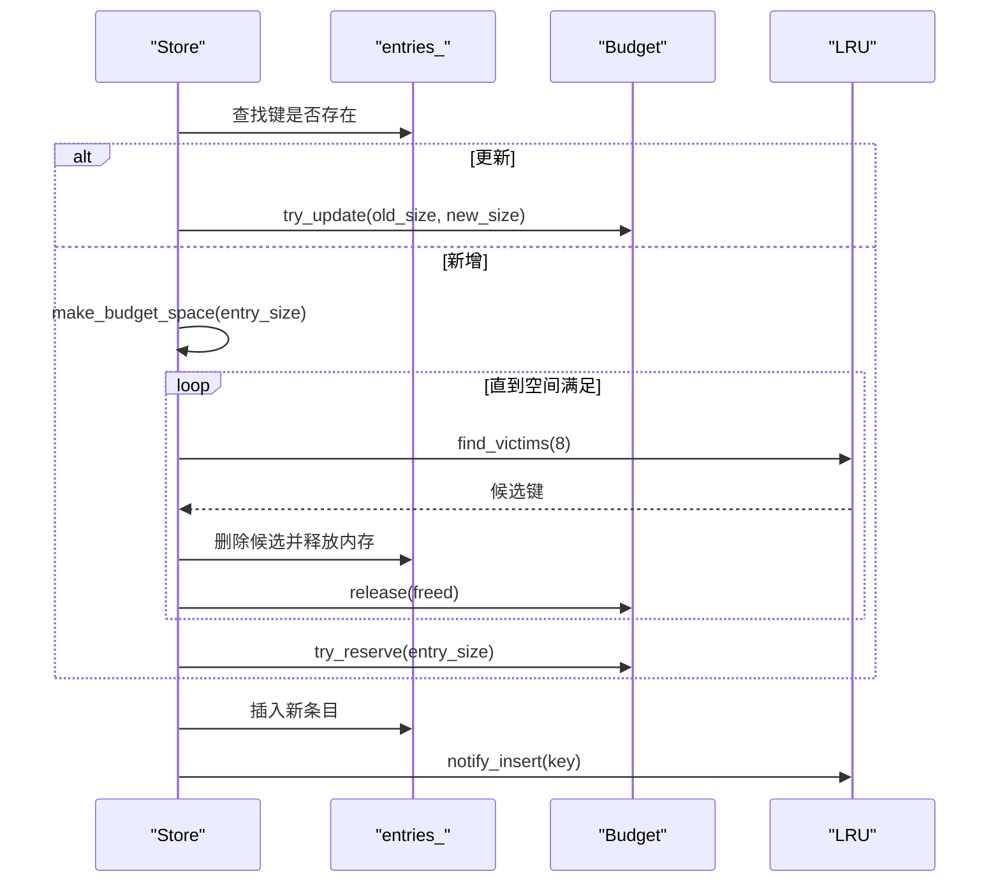
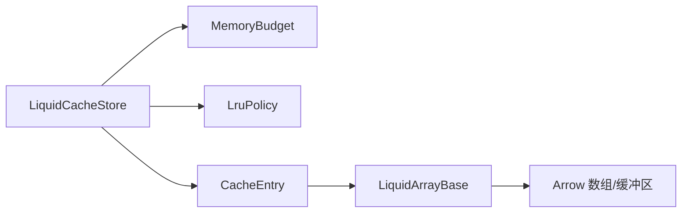

# 内存管理策略

<cite>
**本文档引用的文件**
- [lru_policy.h](file://include/liquid_cache/lru_policy.h)
- [liquid_cache_store.h](file://include/liquid_cache/liquid_cache_store.h)
- [test_cache_budget.cpp](file://tests/test_cache_budget.cpp)
- [liquid_array.h](file://include/liquid_cache/liquid_array.h)
- [liquid_arrays.h](file://include/liquid_cache/liquid_arrays.h)
- [liquid_byte_view_array.h](file://include/liquid_cache/liquid_byte_view_array.h)
- [bit_packed_array.h](file://include/liquid_cache/bit_packed_array.h)
- [README.md](file://README.md)
</cite>

## 目录
1. [引言](#引言)
2. [项目结构](#项目结构)
3. [核心组件](#核心组件)
4. [架构总览](#架构总览)
5. [详细组件分析](#详细组件分析)
6. [依赖关系分析](#依赖关系分析)
7. [性能考量](#性能考量)
8. [故障排查指南](#故障排查指南)
9. [结论](#结论)
10. [附录](#附录)

## 引言
本设计文档聚焦于内存管理策略，围绕以下主题展开：
- 内存预算控制机制：基于原子操作的无锁预留与释放，以及更新语义的实现。
- LRU 淘汰策略：以访问记录、候选选择与批量淘汰为核心的实现细节。
- 内存追踪机制：如何准确计算缓存条目的内存占用，覆盖 Arrow 数组与液态数组两种形态。
- 线程安全设计：互斥锁使用、无锁操作与并发访问控制的权衡。
- 最佳实践：缓存大小设置、淘汰策略调优与内存泄漏预防。

## 项目结构
仓库采用按功能域划分的头文件组织方式，内存管理相关的核心位于 include/liquid_cache 目录：
- lru_policy.h：内存预算与 LRU 策略的声明与实现。
- liquid_cache_store.h：缓存存储器，整合预算与 LRU，并提供插入、读取、批量加载等能力。
- liquid_array.h、liquid_arrays.h、liquid_byte_view_array.h、bit_packed_array.h：液态数组抽象与具体实现，提供 memory_size 统一的内存追踪接口。
- tests/test_cache_budget.cpp：预算与 LRU 的单元测试，覆盖并发、预算更新、淘汰行为等。

**图表来源**
- [lru_policy.h:30-96](file://include/liquid_cache/lru_policy.h#L30-L96)
- [lru_policy.h:111-188](file://include/liquid_cache/lru_policy.h#L111-L188)
- [liquid_cache_store.h:188-524](file://include/liquid_cache/liquid_cache_store.h#L188-L524)
- [liquid_array.h:38-85](file://include/liquid_cache/liquid_array.h#L38-L85)
- [liquid_arrays.h:242](file://include/liquid_cache/liquid_arrays.h#L242)
- [bit_packed_array.h:237-240](file://include/liquid_cache/bit_packed_array.h#L237-L240)

**章节来源**
- [README.md:5-40](file://README.md#L5-L40)

## 核心组件
- MemoryBudget：无锁预算控制，支持原子预留、释放与更新，提供上限检查与使用量查询。
- LruPolicy<Key>：基于 std::list + std::unordered_map 的经典 LRU 实现，提供插入通知、访问通知、批量候选选择与移除。
- LiquidCacheStore：整合预算与 LRU 的缓存存储器，负责条目插入、读取、批量读取、统计与清理。
- CacheEntry：条目封装，支持 Arrow 数组与液态数组两种形态，并提供统一的 memory_size 接口。
- 液态数组体系：通过 LiquidArrayBase 抽象与具体实现，提供 memory_size、to_arrow、filter 等能力，用于精确追踪内存占用。

**章节来源**
- [lru_policy.h:30-96](file://include/liquid_cache/lru_policy.h#L30-L96)
- [lru_policy.h:111-188](file://include/liquid_cache/lru_policy.h#L111-L188)
- [liquid_cache_store.h:188-524](file://include/liquid_cache/liquid_cache_store.h#L188-L524)
- [liquid_array.h:38-85](file://include/liquid_cache/liquid_array.h#L38-L85)

## 架构总览
内存管理策略由“预算控制 + LRU 淘汰 + 条目追踪”三部分协同完成：
- 预算控制：MemoryBudget 提供原子预留与释放，避免竞态条件下的超支。
- LRU 淘汰：LruPolicy 以互斥保护维护访问顺序，批量选择 LRU 候选进行淘汰。
- 条目追踪：CacheEntry 在不同条目类型下计算内存占用，确保预算更新的准确性。

**图表来源**
- [liquid_cache_store.h:222-274](file://include/liquid_cache/liquid_cache_store.h#L222-L274)
- [liquid_cache_store.h:491-517](file://include/liquid_cache/liquid_cache_store.h#L491-L517)
- [lru_policy.h:146-159](file://include/liquid_cache/lru_policy.h#L146-L159)
- [lru_policy.h:118-130](file://include/liquid_cache/lru_policy.h#L118-L130)

## 详细组件分析

### MemoryBudget：原子预算控制
- 设计要点
  - 使用原子计数器跟踪已用字节，提供无锁预留与释放。
  - 支持“尝试更新”语义：在增长时尝试预留差额，在收缩时直接释放差额。
  - 无上限模式（max_bytes_=0）下，预留总是成功且不参与上限检查。
- 关键方法
  - try_reserve：在无上限时直接累加；否则使用 compare_exchange_weak 循环 CAS 成功后返回。
  - release：原子减小已用字节。
  - try_update：根据新旧大小差额决定预留或释放。
- 并发特性
  - 预留/释放为原子操作，避免锁争用。
  - 由于预算上限检查涉及循环 CAS，存在竞争场景下的重试成本。

**图表来源**
- [lru_policy.h:49-91](file://include/liquid_cache/lru_policy.h#L49-L91)

**章节来源**
- [lru_policy.h:30-96](file://include/liquid_cache/lru_policy.h#L30-L96)

### LruPolicy<Key>：LRU 淘汰策略
- 设计要点
  - 使用 std::list 维护 MRU 到 LRU 的顺序（前 MRU，后 LRU）。
  - 使用 std::unordered_map 快速定位键对应的 list 迭代器，实现 O(1) 移动与删除。
  - 互斥锁保护所有公共接口，保证并发安全。
- 关键方法
  - notify_insert：若键已存在则移动至前端（提升为 MRU），否则在前端插入新键。
  - notify_access：若键存在则移动至前端。
  - find_victims：从后端批量取出候选键（每次淘汰一个），并从 map 中擦除。
  - remove/clear/size：提供移除特定键、清空与查询大小的能力。
- 并发特性
  - 所有公共方法使用 lock_guard 保护，避免多线程并发修改内部结构。

**图表来源**
- [lru_policy.h:111-188](file://include/liquid_cache/lru_policy.h#L111-L188)

**章节来源**
- [lru_policy.h:98-188](file://include/liquid_cache/lru_policy.h#L98-L188)

### CacheEntry 与内存追踪
- 设计要点
  - CacheEntry 支持两种类型：MemoryArrow 与 MemoryLiquid，分别来自 Arrow 原始数组与液态数组。
  - memory_size 提供统一的内存占用计算接口，确保预算更新的准确性。
- Arrow 形态内存追踪
  - 遍历数组数据缓冲区，累加各缓冲区大小，得到条目内存占用。
- 液态数组内存追踪
  - 通过 LiquidArrayBase::memory_size 返回编码后的内存大小，包含头部、位打包、字典等子结构的开销。
  - 具体实现中，BitPackedArray、ByteViewArray 等子结构提供各自的 memory_size，最终汇总到上层。

**图表来源**
- [liquid_cache_store.h:111-173](file://include/liquid_cache/liquid_cache_store.h#L111-L173)
- [liquid_array.h:38-85](file://include/liquid_cache/liquid_array.h#L38-L85)
- [liquid_arrays.h:242](file://include/liquid_cache/liquid_arrays.h#L242)
- [liquid_byte_view_array.h:572-577](file://include/liquid_cache/liquid_byte_view_array.h#L572-L577)
- [bit_packed_array.h:237-240](file://include/liquid_cache/bit_packed_array.h#L237-L240)

**章节来源**
- [liquid_cache_store.h:140-173](file://include/liquid_cache/liquid_cache_store.h#L140-L173)
- [liquid_array.h:61-78](file://include/liquid_cache/liquid_array.h#L61-L78)
- [liquid_arrays.h:242](file://include/liquid_cache/liquid_arrays.h#L242)
- [liquid_byte_view_array.h:572-577](file://include/liquid_cache/liquid_byte_view_array.h#L572-L577)
- [bit_packed_array.h:237-240](file://include/liquid_cache/bit_packed_array.h#L237-L240)

### LiquidCacheStore：预算 + LRU 集成
- 设计要点
  - 以互斥锁保护 entries_、预算与 LRU，确保并发安全。
  - 插入流程：计算条目大小，必要时通过 LRU 批量淘汰候选，再进行预算预留，最后更新 LRU。
  - 读取流程：命中后通知 LRU 访问，避免被误淘汰。
  - make_budget_space：在插入前尝试释放足够空间，批量淘汰候选并逐个释放内存，直到满足需求或穷尽候选。
- 关键接口
  - insert/insert_arrow：支持 Arrow 与液态数组插入。
  - get/read_batch：单条读取与批量投影读取。
  - stats/total_memory_size：提供统计信息与总内存占用。
  - clear：清空缓存、预算与 LRU。

**图表来源**
- [liquid_cache_store.h:222-274](file://include/liquid_cache/liquid_cache_store.h#L222-L274)
- [liquid_cache_store.h:491-517](file://include/liquid_cache/liquid_cache_store.h#L491-L517)
- [lru_policy.h:146-159](file://include/liquid_cache/lru_policy.h#L146-L159)

**章节来源**
- [liquid_cache_store.h:188-524](file://include/liquid_cache/liquid_cache_store.h#L188-L524)

## 依赖关系分析
- 组件耦合
  - LiquidCacheStore 依赖 MemoryBudget 与 LruPolicy，形成“预算 + 淘汰”的协作关系。
  - CacheEntry 依赖 LiquidArrayBase 抽象，使 Store 无需关心具体数组类型即可追踪内存。
- 外部依赖
  - Arrow 作为数组与缓冲区的基础设施，提供内存布局与缓冲区访问能力。
  - C++ 标准库容器与原子操作提供并发与数据结构支撑。

**图表来源**
- [liquid_cache_store.h:188-524](file://include/liquid_cache/liquid_cache_store.h#L188-L524)
- [liquid_array.h:38-85](file://include/liquid_cache/liquid_array.h#L38-L85)

**章节来源**
- [liquid_cache_store.h:188-524](file://include/liquid_cache/liquid_cache_store.h#L188-L524)

## 性能考量
- 预算预留的原子性
  - 使用 compare_exchange_weak 的循环 CAS 在高并发下可能产生重试，建议合理设置预算上限，减少频繁重试。
- LRU 批量淘汰
  - 每轮批量淘汰 8 个候选，平衡了淘汰效率与锁持有时间；可根据负载调整批量大小。
- 内存追踪精度
  - Arrow 形态通过遍历缓冲区累加，开销与数组大小线性相关；液态数组通过 memory_size 精确统计，避免重复解码带来的额外开销。
- 互斥锁范围
  - Store 的大部分操作在互斥锁保护下进行，建议尽量缩短临界区，例如在计算内存大小与预算检查阶段避免持有锁。

[本节为通用性能讨论，不直接分析具体文件]

## 故障排查指南
- 预算不足导致插入失败
  - 现象：insert/insert_arrow 返回 false。
  - 排查：确认 max_cache_bytes 是否过小；检查 make_budget_space 是否成功批量淘汰；查看 stats 中 budget_usage_bytes 与 budget_max_bytes。
- 访问未命中导致误淘汰
  - 现象：get 读取后仍被 LRU 淘汰。
  - 排查：确认 get 调用后是否调用了 notify_access；检查 LRU 的 notify_access 逻辑是否生效。
- 大条目无法插入
  - 现象：条目大小超过 max_cache_bytes。
  - 排查：增大预算或拆分条目；确认 memory_size 计算是否合理。
- 清理后内存未归零
  - 现象：clear 后 memory_budget_usage 仍大于 0。
  - 排查：确认 clear 是否调用 budget_.reset() 与 lru_.clear()；检查是否有外部引用导致内存未释放。

**章节来源**
- [test_cache_budget.cpp:166-272](file://tests/test_cache_budget.cpp#L166-L272)
- [test_cache_budget.cpp:340-355](file://tests/test_cache_budget.cpp#L340-L355)
- [liquid_cache_store.h:424-429](file://include/liquid_cache/liquid_cache_store.h#L424-L429)

## 结论
本内存管理策略通过“原子预算 + LRU 淘汰 + 精准内存追踪”的组合，实现了高性能、可扩展的缓存管理：
- MemoryBudget 提供无锁预留与更新，降低锁争用。
- LruPolicy 以 O(1) 的插入与访问移动实现经典的 LRU 行为。
- CacheEntry 与液态数组抽象确保内存追踪的准确性与一致性。
- 在实际部署中，应结合业务特征合理设置预算上限、调优批量淘汰大小，并关注锁持有时间与内存追踪开销，以获得最佳性能与稳定性。

[本节为总结性内容，不直接分析具体文件]

## 附录
- 最佳实践清单
  - 预算设置：以峰值内存占用的 120%-150% 作为上限，预留一定余量应对突发流量。
  - 淘汰调优：根据 LRU 命中率与吞吐表现调整批量淘汰大小（当前为 8），观察淘汰频率与平均条目生命周期。
  - 内存追踪：优先使用液态数组以减少解码成本；对 Arrow 形态，确保只在必要时进行过滤与投影，避免不必要的内存复制。
  - 并发控制：尽量缩短互斥锁持有时间，将昂贵的计算与 I/O 放在锁外；批量操作合并以减少锁竞争。
  - 泄漏预防：定期调用 clear 或设置合理的 TTL；确保外部引用及时释放；监控 stats 中的 entry_count 与 total_memory_bytes。

[本节为通用指导，不直接分析具体文件]