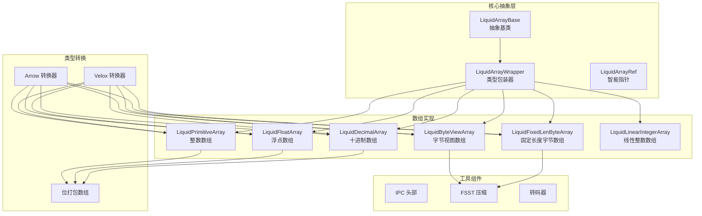
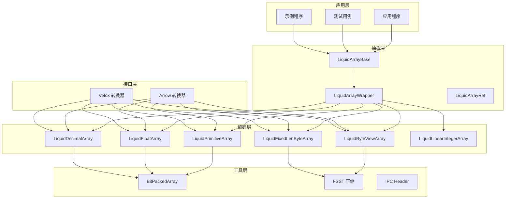
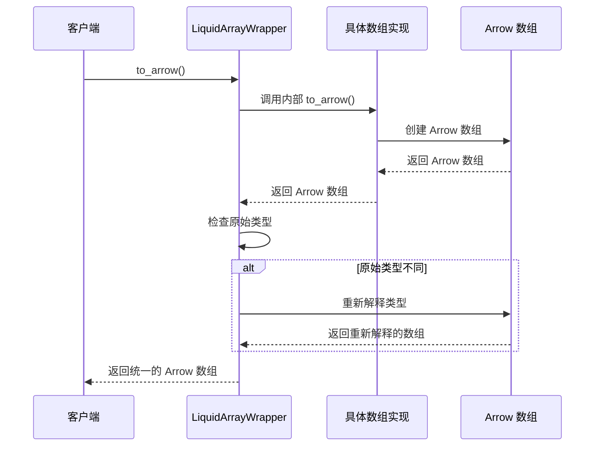
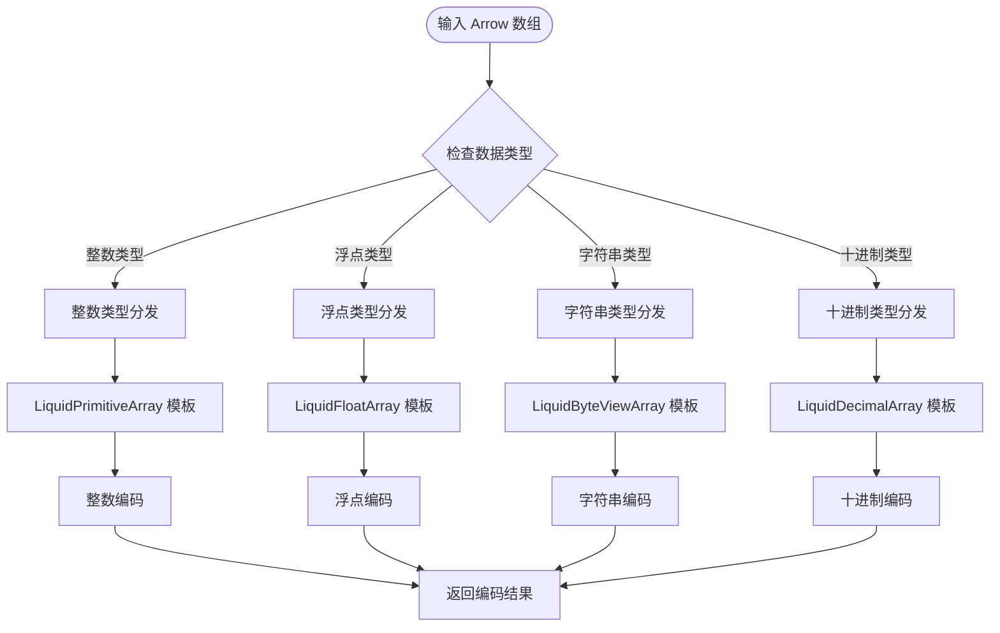
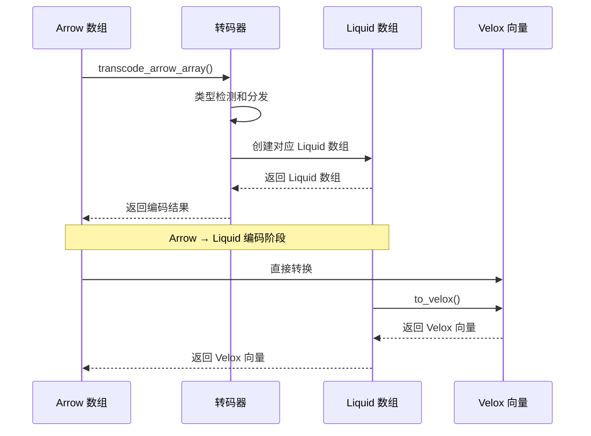
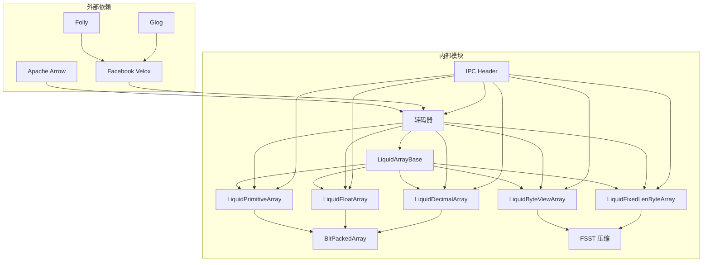

# 数组抽象层设计

<cite>
**本文档引用的文件**
- [liquid_array.h](file://include/liquid_cache/liquid_array.h)
- [liquid_arrays.h](file://include/liquid_cache/liquid_arrays.h)
- [liquid_to_velox.h](file://include/liquid_cache/liquid_to_velox.h)
- [liquid_to_velox.cpp](file://src/liquid_to_velox.cpp)
- [transcoder_arrow.cpp](file://src/transcoder_arrow.cpp)
- [liquid_byte_view_array.h](file://include/liquid_cache/liquid_byte_view_array.h)
- [liquid_decimal_array.h](file://include/liquid_cache/liquid_decimal_array.h)
- [liquid_fixed_len_byte_array.h](file://include/liquid_cache/liquid_fixed_len_byte_array.h)
- [bit_packed_array.h](file://include/liquid_cache/bit_packed_array.h)
- [ipc_header.h](file://include/liquid_cache/ipc_header.h)
- [test_roundtrip.cpp](file://tests/test_roundtrip.cpp)
- [transcode_example.cpp](file://examples/transcode_example.cpp)
- [velox_benchmark.cpp](file://examples/velox_benchmark.cpp)
</cite>

## 目录
1. [引言](#引言)
2. [项目结构](#项目结构)
3. [核心组件](#核心组件)
4. [架构概览](#架构概览)
5. [详细组件分析](#详细组件分析)
6. [依赖关系分析](#依赖关系分析)
7. [性能考虑](#性能考虑)
8. [故障排除指南](#故障排除指南)
9. [结论](#结论)

## 引言

Liquid Cache C++ 数组抽象层是一个高性能的数据压缩和序列化框架，专为现代数据分析工作负载设计。该系统提供了统一的数组抽象接口，支持多种数据类型的高效编码和解码，同时实现了与 Apache Arrow 和 Facebook Velox 生态系统的无缝集成。

该抽象层的核心设计理念是通过类型擦除机制实现多态支持，允许缓存存储异构数组而无需序列化。系统采用模板特化模式支持整数、浮点数、字符串等多种数据类型，并提供了完整的 Arrow 和 Velox 类型转换机制。

## 项目结构

项目采用模块化设计，主要包含以下核心模块：



**图表来源**
- [liquid_array.h:29-89](file://include/liquid_cache/liquid_array.h#L29-L89)
- [liquid_arrays.h:95-248](file://include/liquid_cache/liquid_arrays.h#L95-L248)
- [liquid_to_velox.h:23-137](file://include/liquid_cache/liquid_to_velox.h#L23-L137)

**章节来源**
- [liquid_array.h:1-159](file://include/liquid_cache/liquid_array.h#L1-L159)
- [liquid_arrays.h:1-800](file://include/liquid_cache/liquid_arrays.h#L1-L800)

## 核心组件

### LiquidArrayBase 抽象基类

LiquidArrayBase 是整个数组抽象层的核心，定义了所有 Liquid 编码数组的统一接口。该类提供了以下关键功能：

- **多态接口**：通过纯虚函数定义统一的数组操作接口
- **类型擦除**：隐藏具体实现细节，提供类型无关的操作
- **Arrow 集成**：支持直接解码为 Arrow 数组
- **Velox 集成**：支持直接解码为 Velox 向量（可选）

```mermaid
classDiagram
class LiquidArrayBase {
<<abstract>>
+~LiquidArrayBase()
+to_arrow() std : : shared_ptr~arrow : : Array~
+filter(selection) std : : shared_ptr~arrow : : Array~
+memory_size() size_t
+length() uint32_t
+data_type() LiquidDataType
+physical_type() PhysicalType
+original_arrow_type() std : : shared_ptr~arrow : : DataType~
+to_velox(pool) VectorPtr
}
class LiquidArrayWrapper {
-inner_ LiquidArrayT
-data_type_ LiquidDataType
-physical_type_ PhysicalType
-original_type_ std : : shared_ptr~arrow : : DataType~
+to_arrow() std : : shared_ptr~arrow : : Array~
+memory_size() size_t
+length() uint32_t
+data_type() LiquidDataType
+physical_type() PhysicalType
+original_arrow_type() std : : shared_ptr~arrow : : DataType~
+to_velox(pool) VectorPtr
+inner() const LiquidArrayT&
}
class LiquidArrayRef {
<<typedef>>
}
LiquidArrayBase <|-- LiquidArrayWrapper
LiquidArrayRef --> LiquidArrayBase : "std : : shared_ptr"
```

**图表来源**
- [liquid_array.h:39-89](file://include/liquid_cache/liquid_array.h#L39-L89)
- [liquid_array.h:98-146](file://include/liquid_cache/liquid_array.h#L98-L146)

### 模板特化机制

系统通过模板特化支持多种数据类型，每种类型都有专门的实现类：

- **整数类型**：LiquidPrimitiveArray 支持 Int8/16/32/64、UInt8/16/32/64、Date32/64
- **浮点类型**：LiquidFloatArray 支持 Float32/64，使用 ALP（自适应无损预测）算法
- **字符串类型**：LiquidByteViewArray 使用 FSST 字典压缩
- **十进制类型**：LiquidDecimalArray 支持 Decimal128/256
- **固定长度字节**：LiquidFixedLenByteArray 用于大数值的字节表示

**章节来源**
- [liquid_arrays.h:95-248](file://include/liquid_cache/liquid_arrays.h#L95-L248)
- [liquid_arrays.h:358-566](file://include/liquid_cache/liquid_arrays.h#L358-L566)

## 架构概览

系统采用分层架构设计，从底层的位打包到高层的类型转换器：



**图表来源**
- [transcoder_arrow.cpp:44-351](file://src/transcoder_arrow.cpp#L44-L351)
- [liquid_to_velox.cpp:25-160](file://src/liquid_to_velox.cpp#L25-L160)

## 详细组件分析

### 类型擦除机制详解

类型擦除是 Liquid Cache 的核心技术之一，通过 LiquidArrayWrapper 实现：



**图表来源**
- [liquid_array.h:109-121](file://include/liquid_cache/liquid_array.h#L109-L121)

类型擦除的关键优势：
- **运行时多态**：通过虚函数实现动态绑定
- **类型安全**：编译时类型检查，运行时类型转换
- **内存效率**：避免重复存储类型信息
- **扩展性**：新类型只需实现统一接口

### 数组类型分发机制

系统通过编译时模板特化和运行时类型分发相结合：



**图表来源**
- [transcoder_arrow.cpp:44-351](file://src/transcoder_arrow.cpp#L44-L351)

### 智能指针设计分析

LiquidArrayRef 使用 std::shared_ptr 实现智能指针管理：

```mermaid
classDiagram
class LiquidArrayRef {
<<typedef>>
+operator*() LiquidArrayBase&
+operator->() LiquidArrayBase*
+use_count() size_t
+unique() bool
}
class LiquidArrayBase {
<<abstract>>
+to_arrow() std : : shared_ptr~arrow : : Array~
+to_velox() VectorPtr
+memory_size() size_t
+length() uint32_t
}
class LiquidArrayWrapper {
-inner_ LiquidArrayT
-data_type_ LiquidDataType
-physical_type_ PhysicalType
-original_type_ std : : shared_ptr~arrow : : DataType~
}
LiquidArrayRef --> LiquidArrayBase : "std : : shared_ptr"
LiquidArrayBase <|-- LiquidArrayWrapper
```

**图表来源**
- [liquid_array.h:87-89](file://include/liquid_cache/liquid_array.h#L87-L89)
- [liquid_array.h:98-146](file://include/liquid_cache/liquid_array.h#L98-L146)

智能指针的优势：
- **自动内存管理**：避免内存泄漏
- **共享所有权**：多个持有者共享同一对象
- **线程安全**：原子引用计数
- **生命周期控制**：自动销毁不再使用的对象

### Arrow 与 Velox 类型转换机制

系统提供了完整的类型转换基础设施：



**图表来源**
- [transcoder_arrow.cpp:44-351](file://src/transcoder_arrow.cpp#L44-L351)
- [liquid_to_velox.cpp:25-160](file://src/liquid_to_velox.cpp#L25-L160)

类型转换的关键特性：
- **零拷贝优化**：尽可能避免数据复制
- **类型映射**：Arrow 类型到 Velox 类型的精确映射
- **内存池支持**：Velox 内存池集成
- **错误处理**：完善的异常处理机制

### 编码和解码流程示例

以整数数组为例，展示完整的编码解码过程：

```mermaid
flowchart TD
A[原始整数数组] --> B[计算最小值和最大值]
B --> C[计算参考值 = 最小值]
C --> D[计算偏移量 = 值 - 参考值]
D --> E[计算位宽 = ceil(log2(max_offset+1))]
E --> F[位打包存储偏移量]
F --> G[存储空值位图]
G --> H[写入 IPC 头部]
H --> I[编码完成]
I --> J[序列化到字节数组]
J --> K[反序列化字节数组]
K --> L[重建位打包数组]
L --> M[解码偏移量]
M --> N[计算原始值 = 偏移量 + 参考值]
N --> O[重建空值位图]
O --> P[创建 Arrow 数组]
```

**图表来源**
- [liquid_arrays.h:111-165](file://include/liquid_cache/liquid_arrays.h#L111-L165)
- [liquid_arrays.h:169-197](file://include/liquid_cache/liquid_arrays.h#L169-L197)

**章节来源**
- [liquid_arrays.h:81-248](file://include/liquid_cache/liquid_arrays.h#L81-L248)
- [liquid_to_velox.h:25-137](file://include/liquid_cache/liquid_to_velox.h#L25-L137)

## 依赖关系分析

系统采用松耦合设计，各组件间依赖关系清晰：



**图表来源**
- [transcoder_arrow.cpp:10-26](file://src/transcoder_arrow.cpp#L10-L26)
- [liquid_to_velox.cpp:7-12](file://src/liquid_to_velox.cpp#L7-L12)

**章节来源**
- [transcoder_arrow.cpp:1-746](file://src/transcoder_arrow.cpp#L1-L746)
- [liquid_to_velox.cpp:1-639](file://src/liquid_to_velox.cpp#L1-L639)

## 性能考虑

### 压缩算法优化

系统采用了多种压缩技术来优化存储空间和解码性能：

1. **帧差编码（FoR）**：对连续整数进行差分编码，显著减少存储空间
2. **自适应无损预测（ALP）**：针对浮点数的特殊压缩算法
3. **FSST 字典压缩**：高效的字符串和字节序列压缩
4. **位打包存储**：使用 BitPackedArray 实现紧凑的位级存储

### SIMD 加速

系统充分利用现代 CPU 的 SIMD 指令集进行加速：

- **AVX2 支持**：针对常见位宽（1, 2, 4, 8, 16, 32）的向量化解包
- **块级处理**：64 元素块的批量处理优化
- **内存对齐**：确保数据访问的内存对齐优化

### 内存管理策略

- **零拷贝设计**：尽可能避免不必要的数据复制
- **缓冲区重用**：复用内存缓冲区减少分配开销
- **延迟解压缩**：字符串数组使用懒加载字典解压
- **内存池集成**：与 Velox 内存池无缝集成

## 故障排除指南

### 常见问题诊断

1. **类型不匹配错误**
   - 检查 IPC 头部的逻辑类型和物理类型标识
   - 验证 Arrow 类型与物理类型的一致性

2. **内存不足问题**
   - 监控 memory_size() 返回值
   - 检查 BitPackedArray 的内存使用情况
   - 考虑使用更高效的压缩算法

3. **解码失败**
   - 验证字节数组的完整性
   - 检查对齐要求（8 字节对齐）
   - 确认位宽的有效性

### 性能调优建议

1. **选择合适的编码算法**
   - 连续整数：优先使用 LiquidPrimitiveArray
   - 浮点数：使用 LiquidFloatArray 的 ALP 算法
   - 字符串：确保有足够的重复模式

2. **内存优化**
   - 合理设置批处理大小
   - 利用内存池减少分配开销
   - 考虑数据局部性优化

**章节来源**
- [test_roundtrip.cpp:32-54](file://tests/test_roundtrip.cpp#L32-L54)
- [transcoder_arrow.cpp:378-477](file://src/transcoder_arrow.cpp#L378-L477)

## 结论

Liquid Cache C++ 数组抽象层通过精心设计的架构实现了高性能的数据压缩和类型转换。其核心优势包括：

1. **统一抽象接口**：通过 LiquidArrayBase 提供一致的多态接口
2. **类型擦除机制**：实现运行时类型安全的多态操作
3. **模板特化支持**：灵活支持多种数据类型的高效编码
4. **生态系统集成**：无缝对接 Arrow 和 Velox 生态系统
5. **性能优化**：采用多种压缩算法和 SIMD 加速技术

该系统为现代数据分析应用提供了强大的基础，能够有效提升数据存储效率和查询性能。通过合理的架构设计和优化策略，Liquid Cache 成为了一个既实用又高效的数组抽象解决方案。